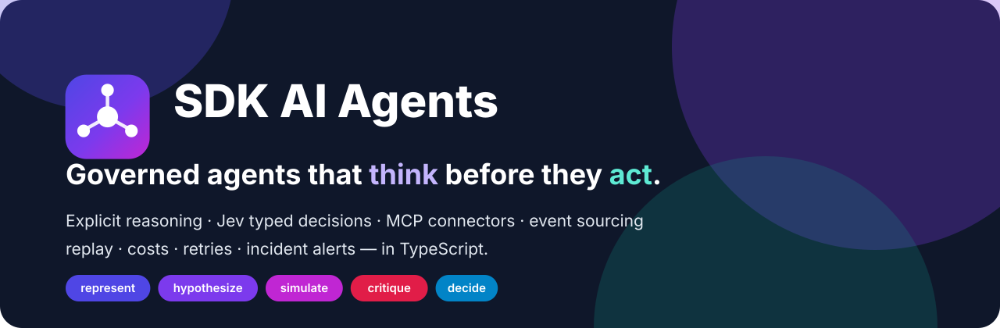
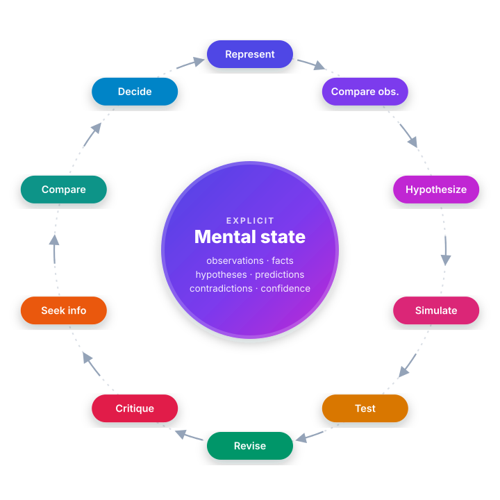
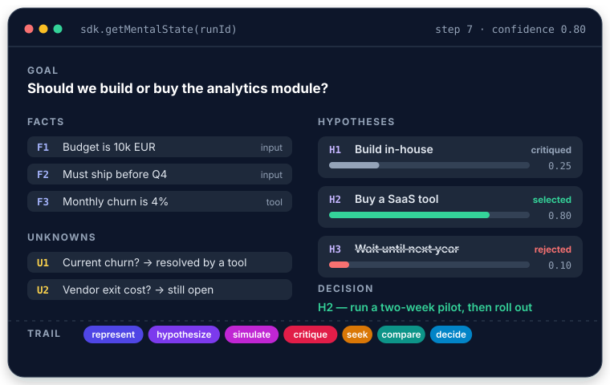
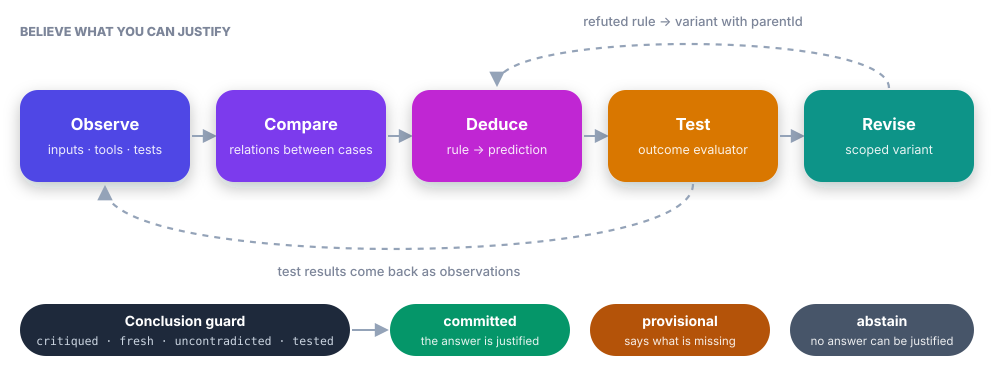
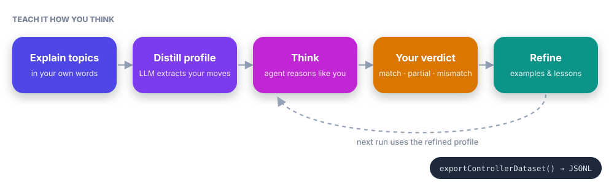
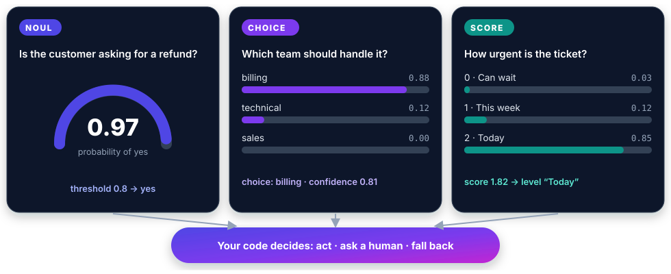
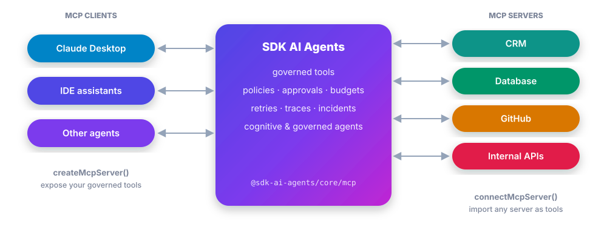
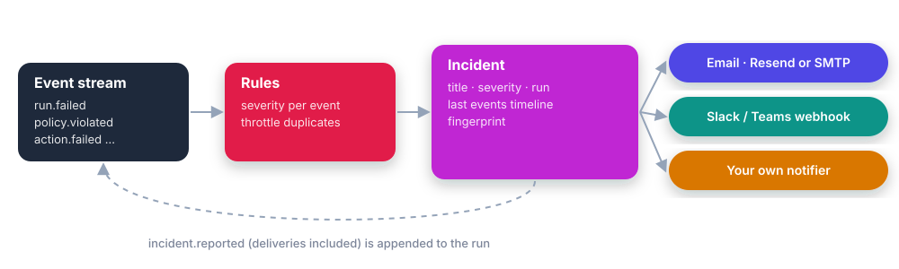
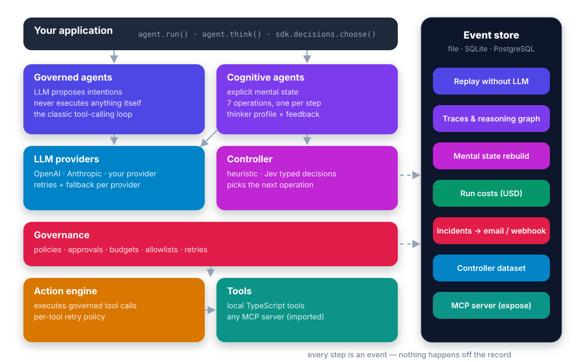

<p align="center">
  
</p>

<p align="center">
  <a href="https://nicolashedoire.github.io/sdk-ai-agents/"><strong>Documentation</strong></a> ·
  <a href="https://nicolashedoire.github.io/sdk-ai-agents/guide/getting-started">Getting started</a> ·
  <a href="https://nicolashedoire.github.io/sdk-ai-agents/guide/cognitive-agents">How agents think</a> ·
  <a href="CHANGELOG.md">Changelog</a>
</p>

<p align="center">
  
  
  
  
  
</p>

**SDK AI Agents** is a TypeScript SDK for AI agents you can trust in production. Agents **reason explicitly** on a mental state you can inspect, can be **taught how you think**, decide with **calibrated typed answers** (TypeSafe Jev), **connect to your systems over MCP** — and every step is governed, traced, priced and replayable.

```ts
import { createSDK } from '@sdk-ai-agents/core';

const sdk = createSDK({ apiKey: process.env.OPENAI_API_KEY, jev: { apiKey: process.env.TYPESAFE_API_KEY } });

const analyst = sdk.createCognitiveAgent({ name: 'analyst', model: 'gpt-4o', tools: [lookupMetric] });
const { answer, decision, state, runId } = await analyst.think({ problem: 'Should we build or buy our analytics module?' });

console.log(answer);                        // the decision, with its rationale and next actions
console.log(decision?.status);              // committed, provisional (with what is missing) or abstain
console.log(state.hypotheses);              // every option considered, simulated and critiqued
console.log(await sdk.getRunCost(runId));   // what it cost, per model
```

No TypeSafe account? Jev is also served by Vercel AI Gateway with the same API: pass your gateway key with `baseUrl: 'https://ai-gateway.vercel.sh/typesafe'` and `model: 'typesafe-ai/jev'` ([details](https://nicolashedoire.github.io/sdk-ai-agents/guide/typed-decisions#through-vercel-ai-gateway)).

## Agents that think before they act



A classic LLM call goes straight from question to answer. A **cognitive agent** keeps an explicit **mental state** — observations, facts, assumptions, constraints, unknowns, hypotheses, predictions, contradictions, confidence — and improves it one operation at a time:

1. **Represent** the problem and what was observed
2. **Compare observations** — similarities, differences, counterexamples
3. **Hypothesize** answers, rules or explanations
4. **Simulate** their consequences and **predict**
5. **Test** predictions with your own evaluator
6. **Revise** what the evidence refuted
7. **Critique** each hypothesis
8. **Seek information** with governed tools
9. **Compare** what survives
10. **Decide** — committed, provisional or abstain, with a rationale and next actions

A **controller** picks the next operation — a deterministic heuristic, or **Jev** with calibrated confidence and automatic fallback. Invariants live in code: a rejected hypothesis cannot be selected, a fatal critique rejects its hypothesis, an agent only runs the tools it was given, the last step always concludes. Every thought is an event, so any run's mental state can be **rebuilt, audited and replayed**.

<br clear="right" />

<p align="center"></p>

## Believe what you can justify

<p align="center"></p>

Give the agent what you observed; tool results and test results are observations too, each with its **provenance** (source, event, time, context, origin). It **compares** observations, induces **rules** with the premises they rest on, deduces **predictions** with the observation that would refute them, and your own **outcome evaluator** — a simulator, a measurement, a test suite — says `confirmed`, `refuted` or `inconclusive`. A refuted rule is **revised** into a scoped variant, never silently revived. Evidence and the thinker's **preferences are scored apart**: preferences may reorder actions, and let a choice the thinker clearly prefers be committed on plausible evidence, but they never make a claim more credible. An answer is **committed** only when it passes that guard; otherwise the agent says it is **provisional** and what is missing, or **abstains**. [Evidence & verification →](https://nicolashedoire.github.io/sdk-ai-agents/guide/evidence-and-verification)

## Reason like a given person

<p align="center"></p>

**Yes, the SDK can imitate the way a given person reasons.** Explain a few topics in your own words, **distill** your reasoning into a thinker profile (order of attention, priorities, reflexes, rejection criteria, appetite for risk), written into the instructions of each reasoning step. Then **correct** it after each run, with a percentage of agreement and where it went wrong: matches become calibration examples, disagreements become lessons with the highest priority. It imitates a way of reasoning, not what you know, and the SDK does not grade itself: your agreement, run after run on new problems, measures how close it gets. Export the runs as a dataset to train your own controller.

```ts
const profile = await sdk.distillThinkerProfile({ id: 'me', name: 'Me', model: 'gpt-4o', samples });
const me = sdk.createCognitiveAgent({ name: 'me', model: 'gpt-4o', profile });

const run = await me.think({ problem: 'Should we pay for Jev or use an open clone?' });
await me.learnFromFeedback(run.runId, {
  verdict: 'mismatch',
  expected: 'Prototype with the free clone first',
  lesson: 'Always test the free option on real data before paying',
});
```

## Typed decisions with Jev

<p align="center"></p>

Inject any context and get structured, calibrated answers your code can act on — single choice, **multiple choice**, yes/no and ratings, many questions in one request:

```ts
const route = await sdk.decisions.choose({
  context: ticket,
  question: 'Which team should handle this ticket?',
  options: { billing: 'Payments, refunds', technical: 'Bugs, outages', sales: 'Pricing' },
});
if (!route.confident) escalateToHuman(ticket);

const topics = await sdk.decisions.selectMany({
  context: ticket,
  question: 'Which problems does the customer report?',
  options: ['double charge', 'login issue', 'broken export'],
});
```

Works with TypeSafe's API or any compatible self-hosted clone (`jev.baseUrl`).

## MCP connectors, both ways

<p align="center"></p>

```ts
import { connectMcpServer, serveMcpOverStdio } from '@sdk-ai-agents/core/mcp';

// Expose governed tools to Claude Desktop, IDEs and other agents
await serveMcpOverStdio(sdk, { name: 'acme-crm', tools: ['lookup_customer'] });

// Import the tools of any MCP server — governed like local tools
const crm = await connectMcpServer({ name: 'crm', transport: { type: 'http', url }, toolPrefix: 'crm_' });
const tools = crm.tools.map((tool) => sdk.defineTool(tool));
```

## Built for operations

<p align="center"></p>

| | |
| --- | --- |
| **Governance** | The LLM only proposes. Policies, allowlists, budgets and human approvals are checked before every action. |
| **Traceability** | Append-only event log (file, SQLite, PostgreSQL), replay without the LLM, reasoning graphs, golden traces, regression detection. |
| **API costs** | Token usage of every LLM call and typed decision, priced per run and per model. |
| **Retries** | One policy per provider before failover, vendor retries disabled so they never stack, retries for idempotent tools, all traced. |
| **Incidents** | Failed runs, blocked actions and failovers become incidents with their timeline, sent by email (Resend, SMTP…) or webhook (Slack…). |

## Architecture

<p align="center"></p>

## Install

Not on npm yet — install from GitHub (the package builds itself on install):

```sh
npm install github:nicolashedoire/sdk-ai-agents zod@^3.25.28
npm install @modelcontextprotocol/sdk   # only for MCP connectors
```

Node.js 20+, TypeScript 5+ and zod 3 (≥ 3.25.28; zod 4 is not supported yet).

## Documentation

| | |
| --- | --- |
| [Introduction](https://nicolashedoire.github.io/sdk-ai-agents/guide/introduction) | Why and what |
| [Getting started](https://nicolashedoire.github.io/sdk-ai-agents/guide/getting-started) | First agent in five minutes |
| [Key terms in plain words](https://nicolashedoire.github.io/sdk-ai-agents/guide/glossary) | Every term explained without jargon |
| [Cognitive agents](https://nicolashedoire.github.io/sdk-ai-agents/guide/cognitive-agents) | Mental state, operations, controllers |
| [Evidence & verification](https://nicolashedoire.github.io/sdk-ai-agents/guide/evidence-and-verification) | Provenance, predictions, tests, revisions, conclusion guard |
| [Reason like a given person](https://nicolashedoire.github.io/sdk-ai-agents/guide/thinker-profiles) | Distill a profile, correct it, measure how close it gets |
| [Typed decisions](https://nicolashedoire.github.io/sdk-ai-agents/guide/typed-decisions) | Jev, context injection, choices |
| [MCP connectors](https://nicolashedoire.github.io/sdk-ai-agents/guide/mcp) | Expose and import tools |
| [Operations](https://nicolashedoire.github.io/sdk-ai-agents/guide/costs) | Costs, retries, incidents |
| [SDK API](https://nicolashedoire.github.io/sdk-ai-agents/reference/sdk-api) · [Events](https://nicolashedoire.github.io/sdk-ai-agents/reference/events) | Reference |

The same pages live in [`docs/`](docs) — run `npm run docs:dev` for a local preview.

## Development

```sh
npm install
npm run build          # TypeScript → dist/
npx vitest run         # tests
npm run docs:dev       # documentation site
```

Tests of the new modules use no module mocks: ports are implemented in memory (scripted LLM provider, in-memory decision client), HTTP adapters run against local servers, and MCP runs over the official in-memory transport.

## License

MIT
