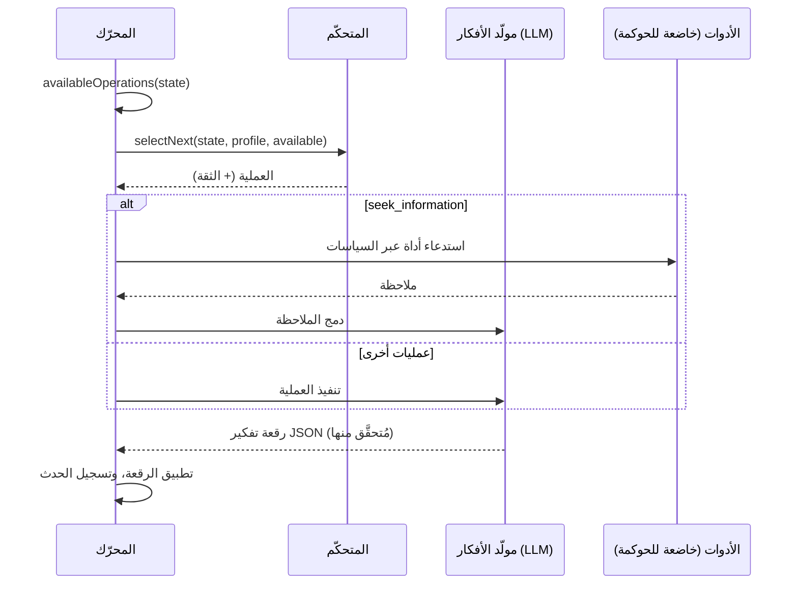

# الوكلاء المعرفيون

لا يجيب الوكيل المعرفي في مرور واحد. بل يحتفظ **بحالة ذهنية صريحة** ويحسّنها **عمليةً معرفيةً** تلو الأخرى، إلى أن يستطيع الالتزام بقرار يمكنه تبريره.

::: tip بكلمات بسيطة
يجيب الذكاء الاصطناعي المعتاد دفعة واحدة، ويختفي استدلاله. أما الوكيل المعرفي فيعمل مثل شخص معه دفتر ملاحظات: يكتب ما يعرفه، وما يفترضه، وما لا يعرفه بعد، ويسرد عدة خيارات، ويتخيّل عواقبها، ويبحث عمّا قد يسوء، ويتحقّق من الوقائع بالأدوات التي سمحت بها، ويقارن الخيارات، ثم يقرّر بعد ذلك فقط. كل حركة من هذه الحركات **عملية** واحدة، وكل واحدة منها تُكتَب في الدفتر، فتستطيع إعادة قراءة الاستدلال كله لاحقًا. وإذا لم يستطع الوصول إلى استنتاج متين، فإنه يقول ذلك. كل مصطلح في هذه الصفحة مشروح في [المصطلحات الأساسية بكلمات بسيطة](./glossary#how-a-cognitive-agent-reasons).
:::

{.illustration style="max-width:460px"}

```ts
const agent = sdk.createCognitiveAgent({
  name: 'analyst',
  model: 'gpt-4o',
  tools: [lookupMetric],
  profile: myProfile, // optional, see Thinker profiles
});

const { status, answer, decision, state, runId } = await agent.think({
  problem: 'Should we build or buy our analytics module?',
  context: { budget: '10k EUR', deadline: 'before Q4' },
  observations: [{ content: 'Churn was 4% last month', originGroup: 'billing' }], // optional
});

decision?.status; // 'committed' | 'provisional' | 'abstain'
```

::: tip الأدلة أولًا
كيف تُتتبَّع الملاحظات، وتُختبَر التنبؤات، ويُحرَس الاستنتاج، موصوف في [الأدلة والتحقّق](./evidence-and-verification).
:::

## الحالة الذهنية {#the-mental-state}

الحالة الذهنية بيانات بسيطة ومُنمَّطة. يحصل كل عنصر على معرّف ثابت يستطيع النموذج الإشارة إليه.

| الجزء | المعرّفات | ما يحتويه |
| --- | --- | --- |
| `observations` | `O1…` | ما لوحظ — قُدِّم مع المشكلة، أو أعادته أداة أو اختبار — مع منشئه |
| `facts` | `F1…` | عبارات لها مصدر (`input`، `tool`، `inference`)، والملاحظات التي جاءت منها، وحالة (`active`، `superseded`، `retracted`) |
| `assumptions` | `A1…` | ما يسلّم به الاستدلال |
| `constraints` | `K1…` | ما يجب أن تحترمه أي إجابة |
| `unknowns` | `U1…` | الأسئلة المفتوحة — `open` أو `resolved` أو `dropped`، مع عدد المحاولات |
| `hypotheses` | `H1…` | مقترحات أو قواعد أو تفسيرات مع مقدّماتها، ومحاكاتها، وانتقاداتها، و`support` من الأدلة، و`preferenceFit`، وحالة |
| `comparisons` | `R1…` | علاقات بين الملاحظات: تشابه، أو اختلاف، أو تطوّر، أو عدم توافق، أو مثال مضاد |
| `predictions` | `P1…` | ما تتنبأ به فرضية، وما سيدحضها، ونتيجة الاختبار |
| `contradictions` | `C1…` | تعارضات بين العناصر، مع فئة، إلى أن تُحَلّ بأدلة مُستشهَد بها |
| `failures` | `X1…` | ما فشل من قبل، حتى لا يُعاد تجريبه على نحو أعمى |
| `knowledge` | `M1…` | ما أثبتته عمليات تشغيل سابقة ضمن النطاق نفسه باختبارات حقيقية، ويُستدعى حين يبدأ التشغيل (انظر [الذاكرة عبر عمليات التشغيل](./memory)) |
| `confidence`، `evidenceRevision` | | دعم الأدلة لأفضل إجابة؛ وعدّاد يجعل التقييمات الأقدم متقادمة |
| `decision`، `trail` | | القرار النهائي وحالته، وسطر واحد لكل خطوة |

{.illustration style="max-width:760px"}

الحالة **لا تُعدَّل في مكانها أبدًا**. تنتج كل عملية *رقعة تفكير* (thought patch)؛ وتُسجَّل الرقعة حدثًا من نوع `cognition.thought`؛ والحالة هي حصيلة طيّ (fold) جميع الرقع. ولهذا يستطيع `sdk.getMentalState(runId)` إعادة بناء أي تشغيل بدقة، حتى بعد أشهر.

## العمليات {#the-operations}

| العملية | ما تفعله | متى تكون متاحة |
| --- | --- | --- |
| `represent` | تستخرج الحقائق والافتراضات والقيود والمجاهيل | دائمًا أولًا؛ ومرة أخرى حين يكون هناك تناقض مفتوح |
| `compare_observations` | تربط بين الملاحظات: أوجه التشابه، والاختلافات، والتغيّرات، والأمثلة المضادة | ملاحظتان قابلتان للمقارنة أو أكثر (باستثناء المكرَّرات ونتائج الاختبارات)، وملاحظات جديدة منذ آخر مقارنة |
| `hypothesize` | تقترح مقترحات أو قواعد أو تفسيرات جديدة | عدد الفرضيات النشطة أقل من `maxHypotheses` |
| `simulate` | تُسقِط العواقب خطوة بخطوة وتصرّح بتنبؤات قابلة للاختبار | فرضية ليست لها محاكاة |
| `test_prediction` | تشغّل مقيِّم النتائج الخاص بك على تنبؤ مُسجَّل — دون استدعاء النموذج اللغوي | مقيِّم مُعَدّ، وتنبؤ معلّق، وميزانية اختبارات متبقية |
| `revise` | تحوّل فرضية ناقضتها الأدلة إلى صيغة معدّلة محدودة النطاق | فرضية مدحوضة أو متناقضة ليست لها صيغة معدّلة بعد |
| `critique` | تجد أقوى الأسباب التي قد تجعل فرضية تفشل | فرضية ليس لها نقد |
| `seek_information` | تستدعي أداة خاضعة للحوكمة للإجابة عن مجهول مفتوح | أدوات موجودة، ومجهول مفتوح، وميزانية أدوات متبقية |
| `compare` | تحكم على دعم الأدلة، وعلى مدى ملاءمة المقترحات للمفكّر | تغيّرت فرضية منقودة، أو تغيّرت الأدلة، منذ آخر مقارنة |
| `decide` | تلتزم بإجابة، ومسوّغ، وثقة، وإجراءات تالية | فرضية تجتاز [حارس الاستنتاج](./evidence-and-verification#the-conclusion-guard) |

**الشيفرة تقرّر ما هو ممكن، والمتحكّم يقرّر ما هو مفيد.** تُحسَب الشروط المسبقة من الحالة، ولا يستطيع المتحكّم الاختيار إلا من بين العمليات المتاحة.

قواعد مفروضة بالشيفرة، أيًا كان ما يقوله النموذج:

- النقد `fatal` (القاتل) الذي لا ردّ عليه، أو التنبؤ المدحوض، يرفض فرضيته؛
- لا يمكن إحياء فرضية مرفوضة ولا إعادة صياغتها ولا اختيارها — بل يمكن فقط مراجعتها إلى صيغة معدّلة تقول ما الذي تغيّر؛
- لا تخلط الشيفرة التفضيلات أبدًا بدعم الأدلة لادعاء ما، ولا يستطيع النموذج تحديد ثقة الحالة؛
- يُحَلّ التناقض مرة واحدة، ولا يُحَلّ إلا بالاستشهاد بالملاحظات أو الحقائق التي تحسمه؛
- الخطوة التي لم تغيّر شيئًا مما كان يُفترَض أن تغيّره، أو القرار المؤجَّل، تُحسَب محاولة فاشلة؛ وبعد محاولتين متتاليتين لا تعود العملية معروضة إلى أن تأتي خطوة أخرى بأدلة جديدة (انظر [ميزانية لا تُهدَر](./evidence-and-verification#a-budget-that-is-not-wasted))؛
- المنشأ (الملاحظات، ونتائج الاختبارات) وحالة القرار يكتبهما المحرّك: ويُجرَّد منهما أي رد من النموذج يحتويهما؛
- تُتجاهَل الإشارات إلى معرّفات غير معروفة ويُبلَّغ عنها في `issues` ضمن حدث التفكير؛
- لا يكون في اللعب أكثر من `maxHypotheses` فرضية: وتُسقَط المقترحات الزائدة ويُبلَّغ عنها؛
- يتوقّف التحقيق في مجهول بعد محاولتين غير ناجحتين، أو فورًا حين لا تستطيع أي أداة متاحة الإجابة عنه، ولا تُعرَض إعادة الصياغة (`represent` على تناقض) أكثر من ثلاث مرات؛
- تُسجَّل العملية الفاشلة على أنها فاشلة ولا تُحسَب منجزة؛
- **الخطوة الأخيرة هي دائمًا محاولة قرار**: الإجابة التي لا تجتاز حارس الاستنتاج تصبح `provisional` (مع ما ينقص) أو `abstain`؛ وإذا لم يستطع النموذج إنتاج قرار أصلًا، يمتنع المحرّك ويسجّل السبب.

## المتحكّمات {#controllers}

يختار المتحكّم العملية التالية.



| المتحكّم | كيف يختار | متى تستخدمه |
| --- | --- | --- |
| `heuristic` | ترتيب انتباه ثابت: التمثيل ← المراجعة ← مقارنة الملاحظات ← وضع الفرضيات ← المحاكاة ← اختبار التنبؤات ← النقد ← البحث عن المعلومات ← المقارنة ← القرار | الافتراضي دون Jev، حتمي، ومجاني |
| `typed` | طلب Jev واحد لكل خطوة: سؤال Choice بين العمليات المتاحة وسؤال Noul «هل أنت جاهز للقرار؟» | استدلال تكيّفي بثقة معايَرة |
| متحكّمك الخاص | نفّذ `CognitiveController.selectNext()` | نموذج محلي مضبوط بدقة، أو قواعد عمل، … |

مع `controller: 'auto'` (القيمة الافتراضية) يستخدم الوكيل Jev حين تكون لدى حزمة SDK واجهة خلفية للقرارات المُنمَّطة، والقاعدة الإرشادية في غير ذلك. **يرجع المتحكّم المُنمَّط إلى القاعدة الإرشادية** حين تكون ثقة سؤال Choice أقل من `minConfidence` (0.35)، أو حين يفشل العميل، أو حين لا تكون الإجابة عملية متاحة. ويُستبدَل كذلك بالقاعدة الإرشادية المتحكّمُ المخصّص الذي يرمي استثناءً أو يعيد عملية غير متاحة. ويُسجَّل كل رجوع في الحقل `fallbackFrom` من حدث الاختيار.

```ts
sdk.createCognitiveAgent({
  name: 'analyst',
  model: 'gpt-4o',
  controller: 'typed',
  controllerOptions: { minConfidence: 0.5, readinessThreshold: 0.85 },
  assessment: 'typed', // compare hypotheses with Jev Score questions
});
```

## الأدوات داخل الاستدلال {#tools-inside-reasoning}

تستخدم `seek_information` **محرّكَي الاستدلال والإجراءات الأصيلين**: يختار النموذج اللغوي أداة واحدة للمجهول المفتوح، ويتحقّق محرّك الإجراءات من أن الأداة **أُعطيت لهذا الوكيل**، ويفحص الاستدعاء مقابل السياسات (بما فيها حدود التشغيل، انظر [الحدود والسياسات](#limits-and-policies)) والموافقات والميزانيات، وتُسجَّل النتيجة **ملاحظةً** تشير إلى حدثها `action.executed`، ثم تُدمَج حقائقَ بالقيمة `source: "tool"`. يُحتفَظ بالملاحظة حتى لو فشل تفسيرها. والأداة المرفوضة أو المحظورة أو الفاشلة تصبح إخفاقًا مُسجَّلًا، ويستمر الاستدلال.

## الحدود {#limits}

```ts
sdk.createCognitiveAgent({
  name: 'analyst',
  model: 'gpt-4o',
  limits: {
    maxSteps: 12,              // the last one always decides
    timeoutMs: 180_000,
    maxHypotheses: 3,          // in play at the same time
    maxToolCalls: 5,
    decisionThreshold: 0.75,   // evidence support a committed answer needs (see minProposalSupport)
    maxConsecutiveFailures: 3, // then the run fails (and alerts you, if incidents are on)
    maxPredictionTests: 4,     // calls to the outcome evaluator per run
    preferenceWeight: 0.4,     // weight of the thinker's preferences when ranking proposals
    minProposalSupport: 0.35,  // evidence support enough for a choice of action the thinker clearly prefers
  },
  evaluator: myBench,          // optional OutcomeEvaluator, enables test_prediction
  knowledge: { store, scope: 'my-domain' }, // optional memory across runs
});
```

يُتحقَّق من الحدود عند إنشاء الوكيل: القيمة `maxSteps: 0` أو مهلة زمنية تتجاوز ما يدعمه المؤقّت ترمي `ValidationError` بدل أن تعطّل ضمانًا بصمت. لا يجوز أن تتجاوز `minProposalSupport` قيمة `decisionThreshold`؛ اجعلها مساوية لـ `decisionThreshold` كي لا يعتمد الإجابةَ إلا الأدلة. وإذا خفّضت `decisionThreshold` دون تحديد `minProposalSupport`، ينخفض الحدّ الأدنى معها.

### الحدود والسياسات {#limits-and-policies}

تُفحَص سياسات الميزانية والمهلة الزمنية التي تنطبق على الوكيل — تلك الموجودة في `policies` الخاصة به والسياسات العامة — **قبل كل خطوة**، قبل أي استدعاء للنموذج في تلك الخطوة، ثم مرة أخرى قبل كل استدعاء أداة. وهي ترى تقدّم التشغيل: يعدّ `maxSteps` الخطوات المنجزة، ويعدّ `maxTokens` رموز استدعاءات النموذج في هذا التشغيل (الأفكار وإصلاحاتها، واختيار الأدوات، والقرارات المُنمَّطة، والإجابات التي لم يستطع المزوّد استخدامها)، ويقيس `maxDuration` الوقت منذ بدء التشغيل. وتُفحَص ميزانيات الرموز والكلفة لكل فترة (`budgetLimit` مع `maxTokens` أو `maxCost`، دون `toolName`) قبل كل خطوة أيضًا، ويُحتسَب فيها كل استدعاء للنموذج يسجّله التشغيل (انظر [تكاليف API](./costs#budgets)). تُفحَص الخطوة بوصفها نيّةً من النوع `continue`: فالسياسة التي تشترط شروطُها استدعاءَ أداة (`intention.type` يساوي `tool_call`) لا تنطبق إلا على استدعاءات الأدوات. أما قوائم السماح والسياسات المخصّصة وميزانيات الاستدعاءات (`maxToolCalls`) والموافقات فلا تخصّ إلا استدعاءات الأدوات، وكذلك قاعدة الحدّ التي يكون إجراؤها `require_approval`: فالخطوة لا تنتظر موافقةً أبدًا. ويُسجَّل فحص كل خطوة في تدقيق السياسات (`sdk.getPolicyAuditTrail`)، للسياسات التي يمكن أن تنطبق على خطوة.

أول حدّ يُبلَغ يُنهي التشغيل (أما حدود استدعاءات الأدوات فلا تفعل سوى تخطّي الاستدعاءات)، ولا يُنهيه نوعا الحدود بالطريقة نفسها:

| الحدّ | `limits` الخاصة بالوكيل | السياسات |
| --- | --- | --- |
| الخطوات | `maxSteps`: الخطوة الأخيرة تقرّر؛ `completed`، مع قرار `committed` أو `provisional` أو `abstain` | `maxSteps`: تُرفَض الخطوة التالية؛ `failed` |
| الوقت | `timeoutMs`: يُلغى التشغيل، ويتلقّى الاستدعاء الجاري إشارة الإلغاء؛ `failed`، `Timeout exceeded (… ms)` | `maxDuration`: يُفحَص بين الخطوات وقبل استدعاءات الأدوات، ويستمر الاستدعاء الجاري؛ `failed`، `Timeout (… ms) exceeded` |
| الرموز، الكلفة | — | `maxTokens` والميزانيات لكل فترة: تُرفَض الخطوة التالية؛ `failed` |
| استدعاءات الأدوات | `maxToolCalls`: لا تُعرَض `seek_information` بعد ذلك | الاستدعاء المرفوض إخفاقٌ مُسجَّل، ويستمر الاستدلال |

تُسجَّل الخطوة المرفوضة حدثًا من نوع `policy.violated` — مع `intention: { type: 'continue' }` والخطوة (`step`) والسبب (`reason`) والسياسات المنتهَكة (`violatedPolicies`) — ثم `run.failed` مع سبب السياسة؛ وتكون للنتيجة `status: 'failed'` و`PolicyViolationError` في `error`. أما استدعاء الأداة الذي يرفضه حدّ تشغيل فيُسجَّل حدثًا من نوع `policy.violated` وعمليةً فاشلة؛ ولأن الحدّ يبقى متجاوَزًا، تُرفَض الخطوة التالية ويفشل التشغيل. ولكي ينتهي التشغيل بقرار لا برفض، اجعل `maxSteps` الخاص بالوكيل لا يتجاوز `maxSteps` السياسة: عندها تقرّر خطوته الأخيرة قبل أن ترفض السياسة أي شيء.

## مُخرَجات النموذج غير الصالحة {#invalid-model-output}

لكل عملية عقد JSON صارم يتحقّق منه Zod. الرد الذي ليس JSON صالحًا، أو ينقصه حقله المطلوب، أو يستخدم قيمة خاطئة، يُعاد إرساله **مرة واحدة** مع خطأ التحقّق. أما الحقول التي لا يحقّ لعملية أن تكتبها (`decision` أثناء `simulate`، مثلًا) فتُتجاهَل وتُدرَج في `ignoredFields`. وإذا فشل الإصلاح أيضًا، تُسجَّل العملية إخفاقًا وتستمر الحلقة.

## الإيقاف والإلغاء وانتهاء المهلة {#stop-cancel-time-out}

```ts
const pending = agent.think({ problem });
await agent.stop();          // or agent.stop(runId)
const result = await pending; // status: 'cancelled'
```

ينتج عن انتهاء المهلة `status: 'failed'` مع `Timeout exceeded (… ms)`، ويُعلَّم التشغيل فاشلًا في سجل الأحداث. ويوقف `sdk.stopRun(runId)` عمليات التشغيل المعرفية أيضًا. تُفحَص المهلة والإيقاف بين العمليات وتُمرَّر إلى مزوّدك إشارةَ إلغاء (abort signal)؛ ولا يُلغي المزوّدان المدمجان OpenAI وAnthropic طلبًا قيد التنفيذ بالفعل، فينتهي الاستدعاء البطيء عند المهلة الخاصة بالمورّد.

**تُلتقَط لقطة من الملف عند بدء التشغيل**: الملاحظات الراجعة المقدَّمة أثناء تشغيل جارٍ تُطبَّق على التشغيل التالي.

## الأمان {#security}

يقرأ الوكيل المعرفي نصًا لم يكتبه: نتائج الأدوات، وأوصاف أدوات MCP، والمستندات الموجودة في السياق. تعامَل مع كل ذلك بوصفه **مُدخَلًا غير موثوق** — فقد يحتوي على تعليمات موجّهة إلى النموذج (حقن الموجّهات، prompt injection). تحدّ حزمة SDK مما يستطيع مثل هذا النص تحقيقه:

- لا يستطيع الوكيل استدعاء إلا الأدوات التي أُعطيت له، وتُفحَص السياسات عند كل استدعاء — ضع الأدوات المدمِّرة خلف سياسات `require_approval`؛
- لا ينفّذ النموذج أي شيء بنفسه أبدًا: هو يقترح، ومحرّك الإجراءات يتحقّق؛
- تُفرَض الثوابت على الحالة الذهنية بالشيفرة، لا بالموجّه؛
- كل استدعاء أداة وكل فكرة موجودان في سجل الأحداث للمراجعة.

يخزّن سجل الأحداث الهدف، والسياق، وكل فكرة، وتخزّن أحداث `decision.evaluated` السياق المُرسَل إلى Jev. طبّق قواعد الاحتفاظ والتنقيح التي تتطلّبها بياناتك على مخزن الأحداث الذي تختاره.

## إعادة التشغيل والتدقيق {#replay-and-audit}

التشغيل المعرفي تشغيل عادي:

- يعرض `sdk.getTrace(runId)` أحداث `cognition.*` إلى جانب `policy.checked`، و`tool.called`، …
- يعيد `sdk.replay(runId)` تنفيذ استدعاءات أدواته دون استدعاء النموذج اللغوي ويعيد إنتاج الإجابة النهائية — مع قيد الأدوات نفسه الذي كان في التشغيل الأصلي، فالأداة التي رُفضت للوكيل تُرفَض مرة أخرى، ومع تقدّم التشغيل عند كل استدعاء، فالاستدعاء الذي رفضه حدّ تشغيل يُرفَض مرة أخرى؛
- يعيد `sdk.getMentalState(runId)` بناء الحالة؛
- يحوّل `sdk.exportControllerDataset()` عمليات التشغيل إلى بيانات تدريب (انظر [ملفات المفكّرين](./thinker-profiles#train-your-own-controller)).
