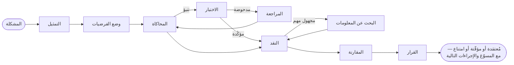

# مقدّمة

**SDK AI Agents** حزمة SDK بلغة TypeScript لبناء وكلاء ذكاء اصطناعي يمكنك الوثوق بهم في بيئة الإنتاج: وكلاء يستدلّون صراحةً قبل أن يتصرّفوا، ويمكن تعليمهم كيف تفكّر *أنت*، وكل خطوة من خطواتهم خاضعة للحوكمة، ومُتتبَّعة، ومُسعَّرة، وقابلة لإعادة التشغيل.

{.illustration style="max-width:460px"}

## لماذا حزمة SDK أخرى للوكلاء؟ {#why-another-agent-sdk}

تمنحك واجهات API للنماذج اللغوية مولّدًا للنصوص قديرًا جدًا. أما ما لا تمنحك إياه فهو التحكّم في **كيفية** الوصول إلى الاستنتاج:

- يجري الاستدلال داخل النموذج، في مرور واحد، ويختفي بمجرد طباعة الإجابة؛
- لا شيء يمنع النموذج من التصرّف بناءً على تخمين، أو استدعاء الأداة الخطأ، أو الإنفاق المفرط؛
- حين يسوء أمر ما، يكون لديك موجّه (prompt) وإجابة — لا قصة.

تضع حزمة SDK هذه طبقة استدلال **حول** النموذج. فيصبح النموذج اللغوي مكوّنًا من بين مكوّنات أخرى:

| الطبقة | ما تفعله | أين توجد |
| --- | --- | --- |
| **الحالة الذهنية** | الحقائق، والافتراضات، والقيود، والمجاهيل، والفرضيات، والتناقضات، والثقة | يُعاد بناؤها من الأحداث في أي وقت |
| **المتحكّم** | يختار العملية المعرفية التالية | قاعدة إرشادية حتمية، أو قرارات Jev المُنمَّطة، أو متحكّم خاص بك |
| **مولّد الأفكار** | ينفّذ عملية واحدة ويعيد رقعة JSON مُتحقَّقًا منها | أي مزوّد نماذج لغوية |
| **ملف المفكّر** | ترتيب انتباه شخص ما وأولوياته وقواعده الإرشادية | بيانات ذات إصدارات، تُحسَّن بالملاحظات الراجعة |
| **الحوكمة** | السياسات، وقوائم السماح، والميزانيات، والموافقات، وإعادة المحاولة | تُفحَص قبل كل إجراء |
| **مخزن الأحداث** | مصدر الحقيقة الوحيد | ملف، أو SQLite، أو PostgreSQL |

## نوعان من الوكلاء {#two-kinds-of-agents}

**الوكلاء الخاضعون للحوكمة** (`sdk.createAgent`) يشغّلون الحلقة التقليدية لاستدعاء الأدوات — يقترح النموذج اللغوي نيّة، ويتحقّق منها محرّك الإجراءات وينفّذها. وهم مثاليون للمهام المحدّدة جيدًا.

**الوكلاء المعرفيون** (`sdk.createCognitiveAgent`) يستدلّون صراحةً. وهم مصمّمون للقرارات: اختيار بنية معمارية، وفرز حادث، وتقييم فرصة، والإجابة عن أسئلة من نوع «هل ينبغي لنا…؟».

يتشارك النوعان الأدوات نفسها، والسياسات، ومخزن الأحداث، وإعادة التشغيل، والتكاليف، وتنبيهات الحوادث.

## هل يستطيع الاستدلال على طريقة شخص معيّن؟ {#can-it-reason-like-a-given-person}

**نعم.** يستطيع الوكيل المعرفي محاكاة طريقة استدلال شخص معيّن. تشرح بضعة مواضيع بكلماتك الخاصة؛ فتستخرج منها حزمة SDK **ملف مفكّر**: الترتيب الذي تنظر به إلى المشكلة، وأولوياتك، وردود أفعالك، وما يجعلك ترفض فكرة، وميلك إلى المخاطرة. يُكتَب هذا الملف في تعليمات كل خطوة من خطوات استدلاله. وبعد كل تشغيل تقول إلى أي حدّ تتفق معه (مثلًا «صحيح بنسبة 60%، وهنا أخطأت»)، ويُحتفَظ بالدرس لعمليات التشغيل التالية.

ما يحاكيه هو **طريقة استدلال**: فهو لا يعرف ما لم تكتبه قط، ولا يقرّر مكانك، وتفضيلاتك لا تجعل أبدًا ادعاءً عن العالم أكثر مصداقية. لا تقيّم حزمة SDK نفسها بنفسها: نسبة الاتفاق التي تعطيها تشغيلًا بعد تشغيل، على مشكلات لم يرها من قبل، هي ما يخبرك بمدى اقترابه. تشرح صفحة [الاستدلال على طريقة شخص معيّن](./thinker-profiles) كل خطوة.

## ما الذي تحصل عليه {#what-you-get}

- **استدلال صريح** — عشر عمليات على حالة ذهنية، مع ثوابت مفروضة بالشيفرة (لا يمكن اختيار فرضية مرفوضة، والنقد القاتل يرفض الفرضية، والخطوة الأخيرة تستنتج دائمًا).
- **أدلة يمكنك تدقيقها** — ملاحظات مع منشئها، وتنبؤات يختبرها مقيِّمك الخاص، وقواعد مدحوضة تُراجَع إلى صيغ معدّلة محدودة النطاق، وتفضيلات تُبقى منفصلة عن الأدلة، وحارس استنتاج يجيب بـ `committed` أو `provisional` أو `abstain`؛ ومع مخزن معرفة، يُتذكَّر ما أجابت به الاختبارات لعمليات التشغيل التالية.
- **الاستدلال على طريقة شخص معيّن**: استخلص ملف مفكّر من مواضيع شرحتها بكلماتك الخاصة، ثم صحّح الوكيل بأحكام `match` أو `partial` أو `mismatch` ونسبة اتفاق.
- **قرارات مُنمَّطة** — [TypeSafe Jev](https://docs.typesafe.ai) أو أي واجهة خلفية متوافقة تجيب عن أسئلة Noul وChoice وScore باحتمالات معايَرة.
- **موصِّلات MCP** — اعرض أدواتك في صورة خادم MCP، واستورد أي خادم MCP في صورة أدوات خاضعة للحوكمة.
- **الدراسات** — باحث يفهم موضوعًا، ثم يقترح كيف يُعاد تصميمه بوسائل اليوم: سبع مراحل، وادعاءات يُتحقَّق منها مقابل المصادر التي بحث فيها فعلًا، وميثاق مُجمَّد مع حارس يُبقيه على هدفه. انظر [الدراسات](./studies).
- **تشغيل مدمج** — تكاليف API لكل تشغيل، وسياسات إعادة محاولة لا تتراكم، وتنبيهات حوادث بالبريد الإلكتروني أو عبر webhook.
- **استناد أصيل إلى الأحداث (event sourcing)** — إعادة التشغيل دون النموذج اللغوي، والآثار المرجعية (golden traces)، واكتشاف التراجعات، ورسوم بيانية للاستدلال.

كيف يُقارَن بأطر العمل الأخرى؟ انظر [لماذا حزمة SDK هذه](./why). هل هذه المصطلحات جديدة عليك؟ تشرح صفحة [المصطلحات الأساسية بكلمات بسيطة](./glossary) كل واحد منها. هل أنت مستعد؟ توجّه إلى [البدء](./getting-started).
