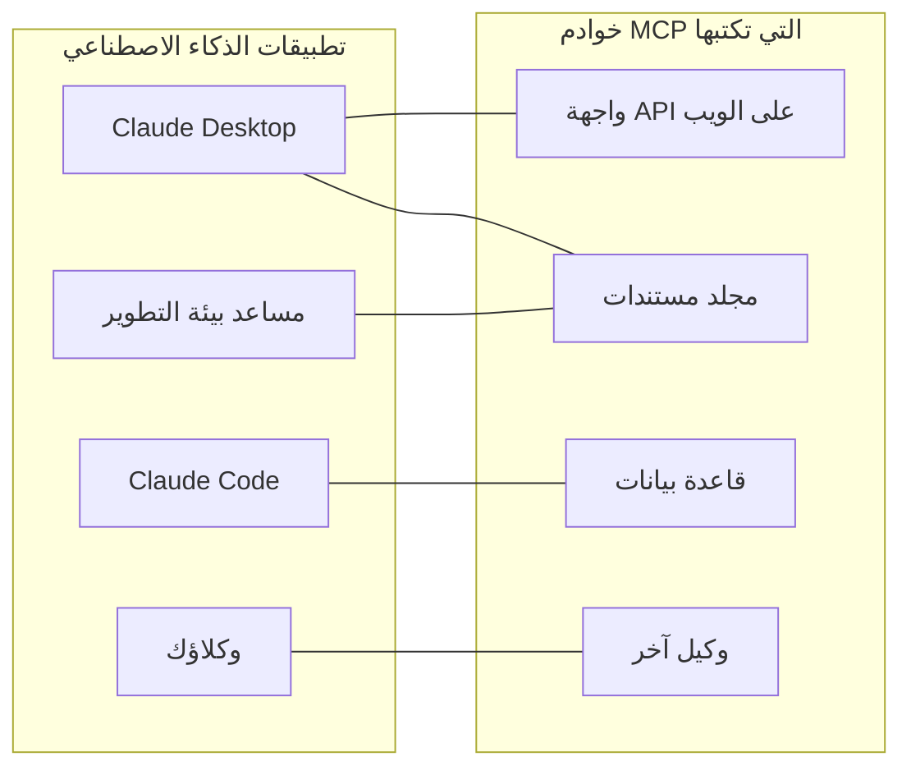
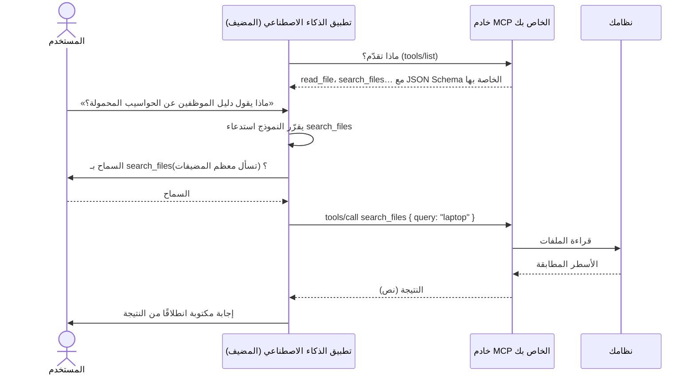
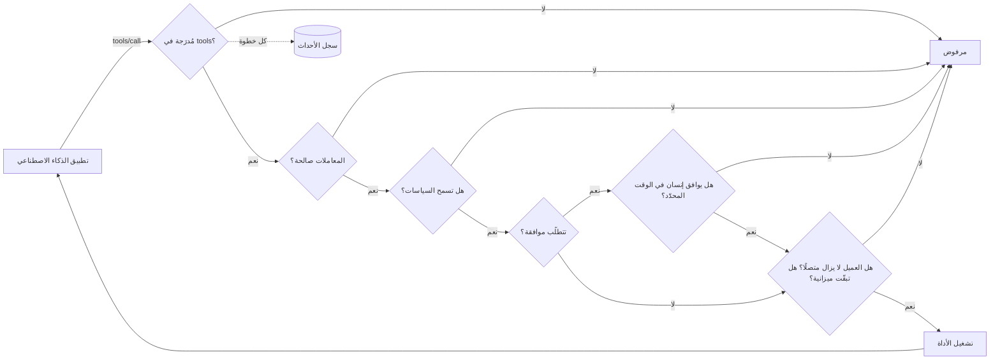

# MCP بكلمات بسيطة

**يتيح MCP لتطبيق ذكاء اصطناعي — Claude Desktop، أو Claude Code، أو مساعد في بيئة تطوير، أو وكيلك الخاص — استخدام أنظمتك: واجهة API، أو مجلد مستندات، أو قاعدة بيانات، أو وكيل آخر.** تشرح هذه الصفحة الفكرة والمصطلحات. وتنتقل الصفحات التالية من الصفر إلى خادم يعمل:

1. [أول خادم MCP لك في 5 دقائق](./mcp-first-server) — خطوة بخطوة، من مجلد فارغ إلى Claude Desktop.
2. [خادم MCP لأيّ شيء](./mcp-recipes) — سطر واحد لدالة، أو واجهة API على الويب، أو مجلد، أو قاعدة بيانات، أو وكيل.
3. [النشر والتأمين واستكشاف الأعطال](./mcp-deploy) — النشر عبر HTTP، والمصادقة، والموافقات، وما يجب فعله حين لا يعمل.

## الفكرة: مقبس واحد لكل تطبيقات الذكاء الاصطناعي {#the-idea-one-plug-for-every-ai-app}

فكّر في MCP (بروتوكول سياق النموذج، Model Context Protocol) على أنه **USB-C لتطبيقات الذكاء الاصطناعي**. قبل USB، كان لكل جهاز كابله الخاص. وقبل MCP، كان كل تطبيق ذكاء اصطناعي يحتاج إلى شيفرة ربط خاصة لكل نظام يتحدّث إليه: تكامل لـ Claude، وآخر لبيئة التطوير لديك، وآخر لوكيلك.

مع MCP، تكتب **برنامجًا صغيرًا واحدًا — خادم MCP — أمام نظامك**. ويستطيع بعد ذلك كل تطبيق يتحدّث MCP أن يتصل به، ويسرد ما يقدّمه، ويستخدمه. تبني الخادم مرة واحدة؛ فيعمل في كل مكان.



البروتوكول معيار مفتوح منشور على [modelcontextprotocol.io](https://modelcontextprotocol.io). بدأته Anthropic؛ وتدعمه تطبيقات ذكاء اصطناعي كثيرة.

## المصطلحات، واحدًا واحدًا {#the-words-one-by-one}

| المصطلح | بكلمات بسيطة | مثال |
| --- | --- | --- |
| **المضيف** (Host، تطبيق الذكاء الاصطناعي) | التطبيق الذي يتحدّث إليه المستخدم. يشغّل النموذج اللغوي ويقرّر متى يستخدم خادمك. | Claude Desktop، وClaude Code، وVS Code |
| **عميل MCP** (MCP client) | الجزء من المضيف الذي يحتفظ بالاتصال بخادم واحد. نادرًا ما تراه. | واحد لكل خادم في Claude Desktop |
| **خادم MCP** (MCP server) | برنامجك الصغير. يقول ما يقدّمه وينفّذ العمل عند الطلب. | `serveMcpOverStdio(sdk, { … })` |
| **الأداة** (Tool) | إجراء قد يقرّر النموذج استدعاءه، مع معاملات مُسمّاة. يقرأ النموذج اسمها ووصفها وقائمة معاملاتها ليقرّر. | `read_file`، `list_pets`، `query` |
| **المورد** (Resource) | مستند يعرضه الخادم للقراءة. بخلاف الأداة، **المستخدم أو التطبيق** هو من يختاره (مثلًا بزر «إرفاق»)، لا النموذج. | `folder://handbook/onboarding.md` |
| **الموجّه** (Prompt) | قالب رسالة جاهز يعرضه خادم. لا توفّره حزمة SDK هذه بعد. | — |
| **وسيلة النقل** (Transport) | كيف تنتقل الرسائل بين المضيف والخادم. | stdio، وStreamable HTTP |
| **stdio** | **يشغّل المضيف خادمك برنامجًا** على الحاسوب نفسه ويتحدّث معه عبر مدخلاته ومخرجاته القياسية — كأنك تكتب فيه وتقرأ ما يطبعه. لا شيء مفتوح على الشبكة. | الخوادم المحلية في Claude Desktop |
| **Streamable HTTP** | خادمك **خدمة ويب**؛ ترسل إليها المضيفات طلبات HTTP. يُستخدَم لمشاركة خادم واحد مع فريق. | `https://mcp.example.com/mcp` |
| **JSON Schema** | وصف معاملات الأداة (الأسماء، والأنواع، وأيها مطلوب) الذي يقرؤه النموذج. تكتبه حزمة SDK لك. | `{ "type": "object", "properties": { "path": { "type": "string" } } }` |
| **التوصيف** (Annotation) | تلميح عن أداة يُعرَض على المضيفات، مثل «هذه الأداة تقرأ فقط». قد تستخدمه المضيفات لتقرّر متى تطلب تأكيدًا من المستخدم. | `readOnlyHint: true` |

::: tip الأدوات مقابل الموارد
**الأداة** شيء *يفعله* النموذج («ابحث في دليل الموظفين عن 'laptop'»). و**المورد** شيء *يسلّمه* المستخدم («أرفق onboarding.md بهذه المحادثة»). وصفة المجلد تقدّم الاثنين، من المجلد نفسه.
:::

## ما يحدث أثناء استدعاء واحد {#what-happens-during-one-call}



أمران يجب تذكّرهما:

- **لا يرى النموذج إلا ما يسرده الخادم**: الأسماء، والأوصاف، ومخططات المعاملات، والنتائج التي تعود إليه. اكتب أوصافًا واضحة؛ ولا تضع فيها أسرارًا أبدًا.
- **الخادم هو من يقرّر ما يحدث فعلًا.** يقترح النموذج استدعاءً؛ ويستطيع خادمك رفضه، أو تقييده، أو سؤال إنسان، أو تسجيله. وهنا يأتي دور حزمة SDK هذه.

## ما تضيفه حزمة SDK هذه {#what-this-sdk-adds}

يمكنك كتابة خوادم MCP بحزمة MCP SDK الرسمية وحدها. تقوم حزمة SDK هذه فوقها وتضيف ما تحتاجه لتشغيل خادم **بأمان، وفي سطر واحد**:

| | مع حزمة MCP SDK الرسمية وحدها | مع SDK AI Agents |
| --- | --- | --- |
| عرض واجهة API على الويب | كتابة معالج لكل نقطة نهاية | `openApiTools({ spec })` — أداة لكل عملية، للقراءة فقط افتراضيًا |
| عرض مجلد | كتابة فحوص المسارات بنفسك | `folderTools({ root })` — لا تستطيع الروابط الرمزية و`..` الخروج من المجلد |
| عرض قاعدة بيانات | كتابة حارس SQL بنفسك | `databaseTools({ database })` — استعلام SELECT واحد، للقراءة فقط على مستوى قاعدة البيانات (معاملة للقراءة فقط على PostgreSQL، و`query_only` على SQLite)، مع حدّ لعدد الصفوف |
| عرض وكيل | — | `cognitiveAgentTool(agent)` — «ماذا كان Nicolas سيفكّر؟» في أداة واحدة |
| لا شيء يُعرَض بالخطأ | الأمر متروك لك | الأدوات التي تسردها في `tools` فقط |
| قواعد قبل كل استدعاء | الأمر متروك لك | [السياسات](./governed-agents)، والميزانيات، وقوائم السماح |
| إنسان يقول نعم أولًا | الأمر متروك لك | الأدوات الموسومة بـ `requiresApproval` تنتظر `sdk.approveAction()`؛ وتُلغى الموافقة حين يلغي العميل أو ينقطع اتصاله، وبعد `approvalTimeoutMs` (50 ثانية افتراضيًا) |
| معرفة ما حدث | الأمر متروك لك | كل استدعاء وكل قراءة لمورد تشغيلٌ في [سجل الأحداث](./observability) |



بهذا الترتيب: يُرفَض الاستدعاء ذو المعاملات غير الصالحة قبل أن يُطلَب من أي أحد الموافقة عليه، ويُحتسَب الاستدعاء من ميزانيته حين يبدأ، أيًا كانت نتيجته.

يُسجَّل كل استدعاء يتم عبر MCP تشغيلًا مستقلًا، بالهوية `mcp:<server name>`: يمكنك قراءته، وحساب تكلفته، وإطلاق تنبيه بشأنه، تمامًا مثل تشغيل وكيل.

## في الاتجاهين {#both-directions}

تتحدّث حزمة SDK بروتوكول MCP في الاتجاهين:

- **التقديم**: حوِّل أدواتك وواجهات API والمجلدات وقواعد البيانات والوكلاء لديك إلى خوادم MCP — الصفحات التالية.
- **الاستخدام**: امنح وكلاءك أدوات أي خادم MCP موجود — أدناه.

### استخدام أدوات خادم MCP في وكلائك {#use-the-tools-of-an-mcp-server-in-your-agents}

```ts
import { connectMcpServer } from '@sdk-ai-agents/core/mcp';

const crm = await connectMcpServer({
  name: 'crm',
  transport: { type: 'http', url: 'https://mcp.acme.internal/crm', headers: { Authorization: `Bearer ${token}` } },
  toolPrefix: 'crm_',                         // avoid collisions between servers
  include: ['lookup_customer', 'list_invoices'],
  metadata: { riskLevel: 'medium' },          // governance metadata for every tool
  retry: { maxRetries: 2 },
});

const tools = crm.tools.map((definition) => sdk.defineTool(definition));
const agent = sdk.createCognitiveAgent({ name: 'account-manager', model: 'gpt-4o', tools });

await agent.think({ problem: 'Should we offer customer c-42 a discount?' });
await crm.close();
```

| `transport.type` | استخدمه لـ |
| --- | --- |
| `stdio` | الخوادم المحلية التي تُشغَّل عملية (`command`، `args`، `env`، `cwd`) |
| `http` | الخوادم البعيدة عبر Streamable HTTP (`url`، `headers`) |
| `custom` | أي وسيلة نقل تبنيها (WebSocket، أو في الذاكرة للاختبارات…) |

تحتفظ الأدوات المستوردة بـ JSON Schema الخاصة بالخادم، فيرى النموذج المعاملات الحقيقية. وبمجرد تعريفها بـ `sdk.defineTool`، تتصرّف تمامًا مثل الأدوات المحلية: تنطبق قوائم السماح، والسياسات، والموافقات (`metadata: { requiresApproval: true }` تجعل كل استدعاء ينتظر إنسانًا)، والميزانيات، وإعادة المحاولة، والآثار على كل استدعاء. وإذا فشل سرد الأدوات، يُغلَق الاتصال (وعملية stdio) قبل رمي الخطأ.

::: warning لا تتصل إلا بالخوادم التي تثق بها
تصل أوصاف الأدوات المستوردة ونتائجها إلى النموذج حرفيًا: يستطيع خادم خبيث أن يكتب فيها تعليمات. اتصل بالخوادم التي تثق بها، وأعطِ كل وكيل الأدوات التي يحتاجها فقط، واحمِ الأدوات المدمِّرة بالموافقات.
:::

## من المفيد معرفته {#good-to-know}

- يوجد دعم MCP في نقطة دخول منفصلة، `@sdk-ai-agents/core/mcp`، فلا تتطلّب الحزمة الأساسية `@modelcontextprotocol/sdk` ما لم تستخدمه. أما مصادر الأدوات (`openApiTools`، و`folderTools`، و`databaseTools`، و`cognitiveAgentTool`…) فهي في الحزمة الأساسية: يستطيع وكلاؤك استخدامها دون MCP.
- الخادم مبني على حزمة MCP TypeScript SDK الرسمية 1.30، التي تقبل مراجعات البروتوكول 2024-10-07، و2024-11-05، و2025-03-26، و2025-06-18، و2025-11-25 (قيمة `SUPPORTED_PROTOCOL_VERSIONS` لديها، تم التحقّق منها في 2026-09-24). ويوثّق موقع MCP أيضًا مراجعة 2026-07-28 ([البنية المعمارية](https://modelcontextprotocol.io/docs/learn/architecture)، تم التحقّق منها في 2026-09-24)، ولا تتحدّثها حزمة SDK هذه بعد.
- تقدّم حزمة SDK هذه **الأدوات** و**الموارد**. أما الموجّهات (prompts)، والاستعانة بنموذج العميل (sampling)، وطلب المعلومات من المستخدم (elicitation) فغير متوفرة.

التالي: [ابنِ خادمك الأول](./mcp-first-server).
