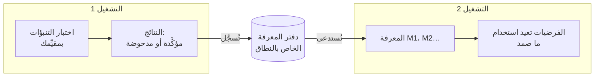

# الذاكرة عبر عمليات التشغيل

::: tip بكلمات بسيطة
تخيّل دفتر مختبر يتشاركه كل من يعمل على المنصة نفسها. في كل مرة تؤكّد فيها تجربة قاعدة ما أو تدحضها، تُدوَّن مع ما كان متوقّعًا وما شوهد. ويقرأ الشخص التالي الدفتر قبل أن يبدأ: فيعيد استخدام ما صمد، ولا يعيد تجربة ما فشل من قبل كما هو.

يستطيع الوكيل المعرفي الاحتفاظ بدفتر كهذا. ولا يدوّن فيه إلا **ما أجاب به اختبار حقيقي**، لا ما اعتقده النموذج أو المفكّر لا غير.
:::

## ما الذي تفعله {#what-it-does}



1. **في نهاية التشغيل**، تصبح كل قاعدة أو تفسير له تنبؤ واحد على الأقل أكّده [مقيِّم النتائج](./evidence-and-verification#predictions-and-the-outcome-evaluator) الخاص بك أو دحضه **نتيجةً** (finding): العبارة، ونطاقها، والقاعدة التي تراجعها داخل التشغيل، وكل اختبار (ما كان متوقّعًا، وما لوحظ، وأي مقيِّم). وتُلحَق النتائج **بدفتر** النطاق.
2. **في بداية التشغيل التالي** ضمن النطاق نفسه، **تُستدعى** العناصر الأكثر صلة وتُوضَع في الحالة الذهنية بوصفها `knowledge`، بالمعرّفات `M1`، `M2`…
3. **أثناء التشغيل**:
   - يرى النموذج كل عنصر مع حالته وأحدث اختباراته، ويُطلَب منه إعادة استخدام القاعدة المُتحقَّق منها ضمن نطاقها، مع الاستشهاد بها؛
   - الفرضية التي تعيد صياغة عنصر **مدحوض** حرفيًا (النوع والعبارة والنطاق أنفسها، بصرف النظر عن حالة الأحرف وعلامات الترقيم) يرفضها المحرّك؛ ويُطلَب من النموذج أن يقترح بدلًا منها صيغة معدّلة تستشهد بمعرّف `M` الخاص بالعنصر في مقدّماتها وتفسّر الدحض، لكن أي صياغة أو نطاق آخر يُقبَل فرضيةً جديدة؛
   - الفرضية التي تعيد صياغة عنصر **مُتحقَّق منه** أو **متنازَع عليه** تُربَط به تلقائيًا (يُضاف معرّف `M` الخاص به إلى المقدّمات)، فترى خطوة المقارنة الاختبارات السابقة.

## تفعيلها {#turn-it-on}

```ts
import { FileKnowledgeStore } from '@sdk-ai-agents/core';

const physicist = sdk.createCognitiveAgent({
  name: 'physicist',
  model: 'gpt-4o',
  evaluator: bench,   // without an evaluator, nothing is tested, so nothing is remembered
  knowledge: {
    store: new FileKnowledgeStore('./knowledge'),
    scope: 'inclined-plane',
  },
});

const first = await physicist.think({ problem: 'Does the rolling time depend on the ball?', observations });
const second = await physicist.think({ problem: 'Will a 250 g glass ball take as long as a steel one?' });

second.state.knowledge;
// [{ id: 'M1', status: 'refuted',  statement: 'Rolling time on this plane does not depend on the ball', … },
//  { id: 'M2', status: 'verified', statement: 'For rigid balls, rolling time on this plane does not depend on mass', … }]
```

| الخيار | القيمة الافتراضية | المعنى |
| --- | --- | --- |
| `store` | (مطلوب) | حيث يُحفَظ الدفتر: `FileKnowledgeStore`، أو `InMemoryKnowledgeStore`، أو مخزن خاص بك |
| `scope` | (مطلوب) | موضوع المعرفة. لا تتشارك عمليات التشغيل ما تعلّمته إلا داخل نطاق. أحرف صغيرة، وأرقام، و`.`، و`-`، و`_`: فنطاقان لا يختلفان إلا في حالة الأحرف سيتشاركان ملفًا واحدًا على macOS وWindows |
| `recallLimit` | `10` | عدد العناصر المستدعاة في بداية التشغيل، من 0 إلى 50. القيمة `0` تسجّل دون استدعاء |
| `record` | `true` | ما إذا كانت عمليات التشغيل تسجّل ما أثبتته اختباراتها |

يستخدمها `examples/rule-discovery.ts`: شغّله مرتين، فيبدأ التشغيل الثاني بما أثبته الأول.

## ما يُتذكَّر، وما لا يُتذكَّر أبدًا {#what-is-remembered-and-what-never-is}

| ما يُتذكَّر | ما لا يُتذكَّر أبدًا |
| --- | --- |
| القواعد والتفسيرات ذات التنبؤ الذي **أكّده** مقيِّمك أو **دحضه** | اختيارات الإجراءات (المقترحات): فهي تعتمد على من يقرّر ومتى |
| ما كان متوقّعًا، وما لوحظ، وأي مقيِّم وأي إصدار | التنبؤات التي لم تُختبَر قط، أو التي كان اختبارها **غير حاسم** |
| القاعدة التي تراجعها صيغة معدّلة، وما الذي تغيّر | ما اعتقده النموذج، والدعم الذي أعطاه، وتفضيلات المفكّر |
| أي عمليات التشغيل سجّلته | الإجابة النهائية للتشغيل |

التشغيل الذي يفشل أو يُوقَف يظل يسجّل الاختبارات التي أجراها: فالقياس يبقى صالحًا مهما حدث بعده.

## الحالات {#statuses}

| الحالة | متى | ما يُقال للنموذج |
| --- | --- | --- |
| `verified` | تأكيدات فقط حتى الآن | أعِد استخدامها ضمن نطاقها واستشهد بها؛ وخارج ذلك النطاق هي فرضية يجب اختبارها من جديد |
| `refuted` | دحوض فقط حتى الآن | لا تقترحها مجددًا أبدًا كما هي؛ والصيغة المعدّلة تستشهد بمعرّف `M` الخاص بها في مقدّماتها وتقول ما الذي يختلف |
| `contested` | تأكيدات ودحوض معًا | لا تصمد إلا في بعض الظروف: اعثر على أيّها |

العبارة نفسها في النطاق نفسه هي العنصر نفسه، أيًا كانت حالة أحرفها أو علامات ترقيمها. وتُزال الاختبارات المكرَّرة حسب التشغيل والتنبؤ: فتسجيل التشغيل نفسه مرتين لا يضيف شيئًا.

## أي العناصر تُستدعى {#which-items-are-recalled}

تُرتَّب عناصر النطاق ترتيبًا حتميًا:

1. الأكثر اشتراكًا في الكلمات مع المشكلة (الكلمات المؤلّفة من أربعة أحرف أو أكثر، في العبارة وفي النطاق)؛
2. ثم الأكثر اختبارًا؛
3. ثم الأحدث.

تُستدعى أول `recallLimit` عنصرًا. هذه مطابقة كلمات بسيطة، لا بحث دلالي: فقد لا تُستدعى أولًا قاعدة صيغت بطريقة مختلفة جدًا عن المشكلة. أبقِ النطاقات ضيقة (منصة واحدة، منتج واحد، مجال واحد) كي يكون كل ما في النطاق ذا صلة.

## النطاقات {#scopes}

النطاق حدّ فاصل، لا اسم مجلد من أجل الترتيب:

- لا **تتشارك** عمليات التشغيل ما تعلّمته إلا داخل نطاق؛
- استخدم نطاقًا واحدًا لكل منصة، أو منتج، أو مجموعة بيانات، أو مجال تنطبق قواعده بعضها على بعض: `inclined-plane`، `checkout-latency`، `churn-model-v3`؛
- لا تخلط أبدًا بين العملاء أو المستأجرين في نطاق واحد إذا كان يجب أن تبقى بياناتهم منفصلة.

## المخازن {#stores}

| المخزن | استخدمه لـ |
| --- | --- |
| `FileKnowledgeStore(directory)` | ملف واحد لكل نطاق، `<directory>/<scope>.jsonl`، وسطر واحد لكل تشغيل. لا تُضاف الأسطر إلا في النهاية، فيكون الملف أيضًا سجلًا تاريخيًا مقروءًا. تُنفَّذ الكتابات عبر نسخة واحدة من `FileKnowledgeStore` بالتتابع: شارك نسخة واحدة بين وكلاء العملية الواحدة |
| `InMemoryKnowledgeStore()` | الاختبارات، والنماذج الأولية، والعمليات قصيرة العمر |
| `KnowledgeStore` الخاص بك | قاعدة بيانات تتشاركها عدة عمليات |

ينبغي للنسخ أو العمليات المتعددة التي تكتب في النطاق نفسه في الوقت نفسه أن تستخدم قاعدة بيانات: نفّذ الدوال الثلاث للمنفذ (port). السطر الذي تركته كتابة منقطعة غير مكتمل يُتخطّى عند القراءة، مع تحذير، ويبدأ الإدخال التالي في سطر جديد؛ أما السطر الذي هو JSON صالح لكنه ليس إدخالًا صالحًا فيوقف القراءة مع رقم سطره، لأن الملف قد عُدِّل.

```ts
import type { KnowledgeStore } from '@sdk-ai-agents/core';

const store: KnowledgeStore = {
  async recall({ scope, goal, limit }) { /* the most relevant items of the scope */ },
  async record({ scope, runId, recordedAt, findings }) { /* append one entry */ },
  async list(scope) { /* every item of the scope */ },
};
```

تطوي `projectKnowledge(entries)` إدخالات الدفتر في عناصر، وترتّبها `rankKnowledge(items, goal, limit)`، فلا يحتاج المخزن المخصّص إلا إلى الاحتفاظ بالإدخالات (مثلًا صف واحد لكل تشغيل) وإعادة استخدام الدالتين.

افحص ما يعرفه نطاق ما في أي وقت:

```ts
for (const item of await store.list('inclined-plane')) {
  console.log(item.status, item.confirmations, item.refutations, item.statement);
}
```

## التدقيق وإعادة التشغيل {#audit-and-replay}

- تُسجَّل العناصر المستدعاة في `cognition.started` (`knowledge.scope`، `knowledge.items`)، فيعيد `sdk.getMentalState(runId)` بناء ما كان التشغيل يعرفه بدقة، دون قراءة المخزن مرة أخرى، حتى لو تغيّر المخزن منذ ذلك الحين.
- تُسجَّل النتائج في حدث `cognition.knowledge_recorded` (`scope`، `findings`).
- المخزن الذي يفشل لا يوقف التشغيل أبدًا: يُسجَّل الاستدعاء الفاشل بوصفه `knowledge.error` في `cognition.started` ويمضي التشغيل دون ذاكرة؛ ويُسجَّل التسجيل الفاشل بوصفه `error` في `cognition.knowledge_recorded`. والمخزن الذي لا يجيب خلال `limits.timeoutMs` الخاصة بالتشغيل يُعامَل على أنه فاشل (وقد تكتمل كتابة بطيئة بعد ذلك). وإذا لم يستطع سجل الأحداث نفسه تسجيل النتائج، يُطبَع تحذير وتُعاد نتيجة التشغيل دون تغيير.

## الحدود {#limits}

- **مطابقة الكلمات.** الاستدعاء ليس دلاليًا؛ وقد تفوته قواعد ذات صلة صيغت بطريقة مختلفة.
- **إعادات الصياغة الحرفية فقط.** لا تُرفَض إلا إعادة صياغة قاعدة مدحوضة بالنوع نفسه، والصياغة نفسها (بصرف النظر عن حالة الأحرف وعلامات الترقيم)، والنطاق نفسه؛ أما المعاد صياغتها بكلمات أخرى فتُقبَل فرضيةً جديدة.
- **يكفي اختبار واحد لتكون `verified`.** يصبح العنصر مُتحقَّقًا منه بمجرد تأكيد تنبؤ واحد وعدم دحض أي تنبؤ، والنموذج هو الذي يختار أي تنبؤ يختبر القاعدة: فالتنبؤ الضعيف يظل يُحسَب تأكيدًا.
- **النطاق مُعلَن، لا مُتحقَّق منه.** القاعدة المُتحقَّق منها لـ «الكرات الصلبة» تُعرَض بذلك النطاق، ويُطلَب من النموذج ألا يطبّقها في مكان آخر دون اختبار جديد؛ ولا شيء يتحقّق من ذلك في الشيفرة.
- **المقيِّم موثوق.** الذاكرة موثوقة بقدر مقيِّمك: فالقياس الخاطئ يُتذكَّر بوصفه اختبارًا.
- **كاتب واحد لكل ملف.** لا يرتّب `FileKnowledgeStore` إلا كتابات نسخة واحدة؛ ولا يُنسَّق بين نسختين أو عمليتين تكتبان في النطاق نفسه.
