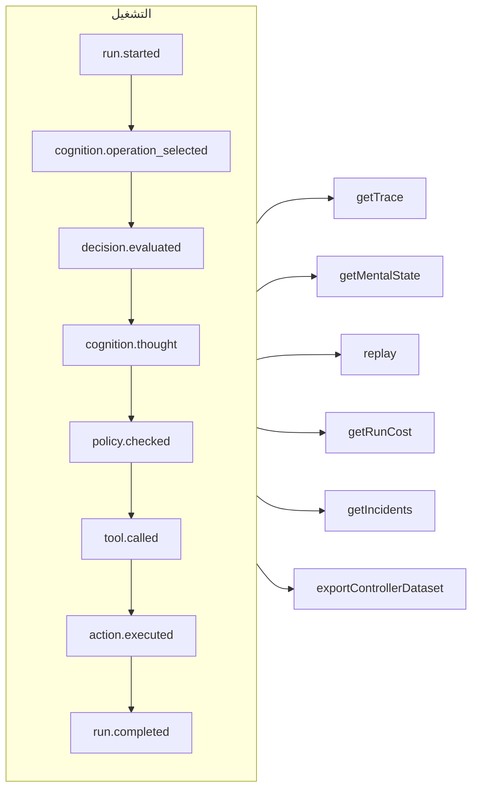

# التتبّع وإعادة التشغيل

كل تشغيل — خاضع للحوكمة، أو معرفي، أو قرار مُنمَّط مباشر، أو استدعاء أداة MCP — هو **سجل أحداث لا يُضاف إليه إلا في نهايته** (append-only). لا شيء يحدث خارج السجل، وكل ما عداه مشتق منه.



## المخازن {#stores}

| المخزن | استخدمه لـ |
| --- | --- |
| `FileEventStore` (الافتراضي) | التطوير، وعملية واحدة — ملف JSON واحد لكل تشغيل |
| `SQLiteEventStore` | الحفظ المحلي مع الاستعلامات |
| `PostgreSQLEventStore` | بيئة الإنتاج: استعلامات مفهرسة، وتجميع، ونسخ احتياطي واستعادة |

::: code-group

```ts [File]
import { createSDK, FileEventStore } from '@sdk-ai-agents/core';

const sdk = createSDK({ apiKey, eventStore: new FileEventStore('./events') });
```

```ts [SQLite]
import Database from 'better-sqlite3';
import { createSDK, SQLiteEventStore } from '@sdk-ai-agents/core';

const sdk = createSDK({ apiKey, eventStore: new SQLiteEventStore({ db: new Database('events.db') }) });
```

```ts [PostgreSQL]
import pg from 'pg';
import { createSDK, PostgreSQLEventStore } from '@sdk-ai-agents/core';

const pool = new pg.Pool({ connectionString: process.env.DATABASE_URL });
const sdk = createSDK({ apiKey, eventStore: new PostgreSQLEventStore({ pool }) });
```

:::

تنفّذ المخازن `IEventStore`؛ اكتب مخزنك الخاص لاستهداف أي قاعدة بيانات. يخزّن مخزن الملفات الأحداث مؤقتًا ويفرغها كل 100 ملّي ثانية؛ استدعِ `await store.destroy()` عند الإيقاف لكتابة ما هو معلّق. ويتجاهل قرّاء السجل (إعادة بناء الحالة الذهنية، والتكاليف، ومجموعات البيانات) الأحداث المكرَّرة ذات المعرّف نفسه.

## قراءة تشغيل {#read-a-run}

```ts
const trace = await sdk.getTrace(runId);          // status, timeline, summary
const text = await sdk.exportTrace(runId, 'text'); // human-readable timeline
const events = await sdk.getEvents(runId, { type: ['tool.called', 'policy.violated'] });
const state = await sdk.getMentalState(runId);    // cognitive runs
```

حالة التشغيل هي **آخر حدث من أحداث دورة الحياة** (`run.completed`، `run.failed`، `run.cancelled`). والأحداث المُلحَقة بعد ذلك — الملاحظات الراجعة، وتقارير الحوادث — لا تعيد فتحه أبدًا.

## إعادة التشغيل دون النموذج اللغوي {#replay-without-the-llm}

```ts
const replay = await sdk.replay(runId);
```

تعيد إعادة التشغيل تنفيذ النوايا المُسجَّلة عبر محرّك الإجراءات — بما في ذلك السياسات — **دون استدعاء النموذج اللغوي**. أعِد التشغيل مع تعديلات لاختبار سيناريوهات «ماذا لو»، مثلًا بعد تغيير سياسة.

تشغّل إعادة التشغيل الأدوات مجددًا، فعليًا. بالنسبة إلى الأدوات الموسومة بـ `requiresApproval`، لا تكرّر إعادة التشغيل إلا الاستدعاءات التي **وافق** عليها إنسان في التشغيل الأصلي — الأداة نفسها بالمعاملات نفسها — دون السؤال مجددًا؛ أما الاستدعاء الذي رُفض أو أُلغي أو لم تتم الموافقة عليه قط فيُرفَض، ولا يُشغَّل. والموافقات التي تتطلّبها *سياسة* تظل سارية وتنتظر قرارًا.

## فهم القرارات {#understand-decisions}

| الدالة | ما تحصل عليه |
| --- | --- |
| `getReasoningGraph(runId)` / `exportReasoningGraph(runId, 'graphviz')` | السلسلة نيّة ← سياسة ← إجراء في صورة رسم بياني |
| `getAlternatives(runId)` | البدائل التي نظر فيها الوكيل |
| `getDecisionPatterns(filters)` | أنماط القرار المتكرّرة عبر عمليات التشغيل |
| `getTraceVisualization(runId)` | بنية مجمّعة وجاهزة للعرض على خط زمني في واجهة مستخدم |
| `getPolicyAuditTrail(runId)` | كل تقييم لسياسة ونتيجته |

## اختبر الوكلاء كما تختبر الشيفرة {#test-agents-like-code}

حوِّل تشغيلًا جيدًا إلى **أثر مرجعي** (golden trace)، ثم تحقّق من عمليات التشغيل الجديدة مقابله:

```ts
const golden = await sdk.createGoldenTrace(runId, { name: 'refund flow', description: 'Expected behavior' });
const validation = await sdk.validateAgainstGoldenTrace(newRunId, golden.id);
const regressions = await sdk.detectRegressions(newRunId, golden.id);
```

تتوفّر أيضًا مجموعات اختبار التراجعات، والتوكيدات السلوكية، ومقارنة عمليات التشغيل، وتحليل التأثير قبل النشر — انظر [واجهة SDK البرمجية](../reference/sdk-api).
