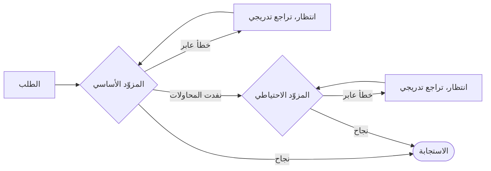

# إعادة المحاولة والبديل الاحتياطي

تتعطّل الشبكات، ويُقيَّد معدّل طلبات المزوّدين، وتنتهي مهلة الأدوات. تعيد حزمة SDK محاولة ما يمكن إعادة محاولته، وتتحوّل إلى البديل فيما لا يمكن، و**تكتب كل إعادة محاولة في التشغيل** فلا يُخفى شيء.



## مزوّدو النماذج اللغوية {#llm-providers}

تنطبق سياسة إعادة المحاولة على كل مزوّد **على حدة، قبل أي تحويل إلى البديل**:

```ts
const sdk = createSDK({
  apiKey: process.env.OPENAI_API_KEY,
  fallbackProviders: [{ provider: 'anthropic', config: { apiKey: process.env.ANTHROPIC_API_KEY } }],
  retry: { maxRetries: 3, initialDelayMs: 500, maxDelayMs: 8_000 },
});
```

يحتاج المزوّد الاحتياطي من جهة أخرى إلى مفتاحه الخاص، في `config` الخاص به أو في `providerConfig`: لا يُرسَل مفتاح المزوّد الأساسي إلى جهة أخرى أبدًا. ولا يتلقّى نموذج الوكيل إلا إذا كان يخدمه، وإلا فيستخدم `defaultModel` الخاص به (ترفض Anthropic اسم نموذج من OpenAI، والعكس صحيح). ويذكر الحدث `intention.generated` المزوّد الذي أجاب والنموذج الذي استخدمه.

| الخيار | القيمة الافتراضية | |
| --- | --- | --- |
| `maxRetries` | `2` | عدد مرات إعادة المحاولة بعد المحاولة الأولى |
| `initialDelayMs` | `500` | يتضاعف عند كل إعادة محاولة (`multiplier`) |
| `maxDelayMs` | `8000` | الحدّ الأعلى لانتظار تراجع واحد |
| `maxRetryAfterMs` | `60000` | أطول قيمة `retry-after` تُحترَم (`maxDelayMs` حين يوجد بديل) |
| `jitter` | `true` | يجعل كل انتظار عشوائيًا ضمن [delay/2, delay] |
| `retryOn` | `isTransientError` | دالة الشرط الخاصة بك |

لا تُعاد محاولة إلا الأخطاء **العابرة**: 408، و409، و425، و429، و5xx، و529، وإخفاقات الاتصال، وانتهاء المهلة — بما في ذلك أخطاء الاتصال في OpenAI وAnthropic، التي يُتعرَّف عليها من صنفها ومن رمز الشبكة في `cause` الخاص بها. أما أخطاء المصادقة والتحقّق والسياسات فتفشل فورًا، وكذلك الرمز 429 الذي يعني أن رصيد الحساب أو حصّته قد نفد (`insufficient_quota`، `credit_balance_exhausted`…): فالانتظار لن يعيد الرصيد. وتحمل رسالة الخطأ تفسير المورّد. حين يرسل المزوّد `retry-after-ms` أو `retry-after`، تنتظر حزمة SDK تلك المدة بدل تراجعها الخاص، حتى `maxRetryAfterMs` (60 ثانية افتراضيًا). وحين تكون `fallbackProviders` مُعدّة، يُخفَّض ذلك الحدّ إلى `maxDelayMs`: فالمزوّد الذي يطلب توقّفًا طويلًا يُترَك للبديل بدل أن يعطّل التشغيل. والطلب الأطول من ذلك يُنهي إعادة المحاولة.

حين تكون سياسة حزمة SDK نشطة، تُعطَّل إعادة المحاولة الخاصة بعميلَي OpenAI وAnthropic — **فلا تتراكم إعادة المحاولة أبدًا**. وتُسجَّل كل إعادة محاولة حدثًا من نوع `provider.retry` مع المزوّد، والنموذج، والمحاولة، والتأخير، والخطأ. مرّر `retry: false` للإبقاء على القيم الافتراضية للمورّد بدلًا من ذلك.

المزوّد الذي تحقنه بـ `llmProvider` يُستخدَم كما هو ما لم تعيّن `retry` صراحةً، ولا يُغلَّف `FallbackProvider` أبدًا حتى تبقى تحويلاته إلى البديل مرئية في الأثر. ولا تُغلَّف مزوّداته كذلك، فلا ينطبق عليها `retry`: لإعادة محاولة أحدها قبل التحويل إلى البديل، غلّفه في `RetryingLLMProvider` وأعطِ عميله `maxRetries: 0`. واجعل `maxRetryAfterMs` في السياسة مساويًا لـ `maxDelayMs` فيها، كما يفعل SDK حين يمكن للبديل أن يتولّى، حتى يُترَك المزوّد الذي يطلب توقّفًا طويلًا للبديل. ولا تُسجَّل إعادات المحاولة هذه أحداثًا من نوع `provider.retry`.

## الأدوات {#tools}

وسِم الأدوات المتساوية القوة (idempotent) بأنها قابلة لإعادة المحاولة:

```ts
sdk.defineTool({
  name: 'lookup_metric',
  description: 'Reads a metric',
  schema: z.object({ metric: z.string() }),
  retry: { maxRetries: 2, initialDelayMs: 200 },
  handler: async ({ metric }) => warehouse.read(metric),
});
```

لا تُعاد إلا محاولة إخفاقات الأدوات — ولا تُعاد أبدًا عند رفض سياسة أو خطأ تحقّق. وكل إعادة محاولة حدث من نوع `tool.retry`.

## القرارات المُنمَّطة {#typed-decisions}

يعيد عميل Jev محاولة الاستجابات 408، و429، و5xx، و529، وأخطاء الشبكة، **مع احترام `retry-after`**، ويعتمد سياسة إعادة المحاولة في حزمة SDK افتراضيًا (وتتغلّب عليها `jev.maxRetries`). وبخلاف مزوّدي النماذج اللغوية، يعيد محاولة كل 429، أيًا كان سببه، حتى `maxRetries`.

## في أي مكان آخر {#anywhere-else}

تُصدَّر `withRetry` لاستخدامها في شيفرتك:

```ts
import { withRetry, DEFAULT_RETRY_POLICY } from '@sdk-ai-agents/core';

const data = await withRetry(() => fetchPartnerFeed(), DEFAULT_RETRY_POLICY, {
  onRetry: ({ retry, delayMs, error }) => logger.warn({ retry, delayMs, error }),
});
```
