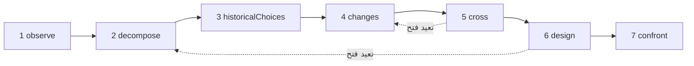

# الدراسات

الدراسة باحث من الذكاء الاصطناعي. تطبّق منهجًا واحدًا — **افهم موضوعًا، ثم أعِد تصميمه بوسائل اليوم** — وتسلّمك ملفًا بحثيًا: ما يفعله الموضوع، وكيف يعمل، ولماذا بُني بهذه الطريقة، وما الذي تغيّر منذ ذلك الحين، وعدة تصاميم جديدة، والتجارب التي من شأنها أن تحسم بينها. إنها لا تبني شيئًا، ولا تشغّل شيئًا، ولا تقيس شيئًا: إنها تستقصي وتقترح.

::: tip بكلمات بسيطة
اختر موضوعًا: متصفّح ويب، أو محرّك قاعدة بيانات، أو جدول مواعيد قطارات. تلاحظه الدراسة، وتفكّكه، وتبحث عن الأسباب الكامنة وراء خياراته القديمة، وتبحث عمّا ظهر منذ ذلك الحين من أبحاث وتقنيات، ثم تقاطع بين الاثنين لتتخيّل تنظيمًا آخر. إنها تستهدف تغييرًا في المبدأ يجعل شيئًا جديدًا ممكنًا، لا نسخة أسرع من الشيء نفسه. ويقول كل ادعاء ما إذا كان **مُثبَتًا** بمصدر عثرت عليه الدراسة فعلًا، أو **فرضية**، أو **جِدّة** ما زال يجب التحقّق منها مقابل الأعمال القائمة. وطوال الوقت، تُبقيها عدة آليات على الهدف الذي أعطيتها إياه، لأن النماذج اللغوية تميل إلى الشرود كلما تراكمت التعليمات. كل مصطلح مشروح في [المصطلحات الأساسية بكلمات بسيطة](./glossary#studies).
:::

```ts
const study = sdk.createStudy({
  name: 'browser',
  object: 'The Web browser, from 1990 to 2026',
  objective: 'A browser design whose every choice follows from the investigation',
  leads: ['vectorisation', 'weights', 'ReLU'], // your leads: examples to verify, not truths
  analogues: ['Bitcoin'],                      // breakthroughs by assembly to deconstruct
  sources: ['brave_web_search'],               // SDK tools the study searches with
});

const result = await study.run();
result.status;   // 'completed' | 'stopped' | 'failed' | 'cancelled'
result.report;   // the structured report
result.markdown; // the same, as a readable dossier
```

## ما هي الدراسة {#what-a-study-is}

تطبّق الدراسة منهجًا من سبع مراحل: *افهم موضوعًا، ثم أعِد تصميمه بمعارف اليوم وتقنياته*. وسؤالها الموجِّه هو: **لو كان علينا أن نلبّي احتياجات اليوم بالمعارف والتقنيات المتاحة اليوم، فكيف سننظّم هذا الموضوع؟** وما لم تعطِ `question` خاصًّا بك، تطرح الدراسة هذا السؤال بلغتها، متبوعًا بالغاية الموصوفة في [الغاية: قدرة جديدة](#the-aim-a-new-capability).

الدراسة ليست وكيلًا. ليست لديها أدوات تتصرّف بها، بل **مصادر** تبحث فيها فقط (انظر [البحث عبر مصادرك](#research-through-your-sources))، ومُخرَجها تقرير، لا إجراء. تُنشأ بـ `sdk.createStudy()`، انطلاقًا من **ميثاق** — الموضوع، والهدف، واحتياجاتك، وخيوطك — لا يتغيّر أبدًا بعد ذلك.

مرحلتها الأخيرة تصمّم التجارب، ولا تُجريها. وما إن تُجري إحداها حتى تسجّل ما توصّلت إليه على بطاقة الآلية المطابقة (انظر [بطاقة الآلية](#the-mechanism-card)).

## المراحل السبع {#the-seven-passages}

يمرّ التشغيل بمراحل المنهج السبع، بالترتيب. تنتج كل مرحلة عناصر من بضعة أنواع (**مجموعاتها**)، ويحصل كل عنصر على معرّف لا يُعاد استخدامه أبدًا: `O1`، و`P2`، و`A1`…

| # | المرحلة | ما تفعله | ما تحتفظ به |
| --- | --- | --- | --- |
| 1 | `observe` | تنظر في سلوكيات الموضوع، واستخداماته، وتنوّعاته، وإخفاقاته، كلٌّ منها مع شروطه: متى، وأين، ولمن، وبماذا. إنها تصف، ولا تفسّر بعد | `observations` (`O`) |
| 2 | `decompose` | ترسم خريطة الأجزاء: وظيفتها، ومُدخلاتها، ومُخرَجاتها، وعلاقاتها، وتنزل داخل الجزء ما دام عمله غامضًا، مع مجاهيل كل جزء. وتحدّد **السلسلة الكاملة** للموضوع، حلقةً بعد حلقة (للمتصفّح: الاستقبال، والفهم، والتنفيذ، والعرض، والتفاعل) | `pieces` (`P`)، `chain` (`C`) |
| 3 | `historicalChoices` | تبحث عن الأسباب الموثّقة لخيارات زمنها: العتاد، والأدوات، والاستخدامات، والمعارف، والتكاليف، والتوافق. والسبب المعقول الذي لا يسنده مستند يبقى فرضية | `historicalChoices` (`H`) |
| 4 | `changes` | تبحث عمّا ظهر أو صار قابلًا للاستخدام منذ ذلك الحين، في مجال الموضوع وفي غيره، كل تقدّم مع آليته، وتاريخه، وأدلّته، وشروط استخدامه، ومدى توافره. وتصدر حكمًا على كل خيط من خيوطك، وتبحث عن أدوات رياضية وتقنية أخرى تتجاوزها، وتسرد أفضل الإنجازات الحالية (المرجع الذي يُقاس به «الأفضل»)، وتفكّك الاختراقات بالتركيب | `advances` (`V`)، `leadVerdicts` (`L`)، `independentLeads` (`I`)، `references` (`R`)، `analogues` (`B`) |
| 5 | `cross` | تقاطع الماضي بالحاضر: أيّ القيود باقية، وأيّها ضعفت، وأيّ المتطلّبات جديدة. وتستخلص القرارات التي صارت قابلة للمراجعة، وتقترح توليفات A + B (ما يتيحه A لـ B، وما يجب أن يتبادلاه، وما يكلّفه ذلك من تحويلات ومزامنة)، وتسمّي قدرات جديدة مرشّحة | `constraints` (`K`)، `revisableDecisions` (`D`)، `combinations` (`X`)، `capabilities` (`Y`) |
| 6 | `design` | تصمّم بنيتين على الأقل، تستهدف إحداها على الأقل قدرة جديدة، وتغطي كلٌّ منها السلسلة الكاملة، مع آليتها، وشروطها، وفائدتها، وكلفتها الإضافية، ومثال مضاد محتمل، وتنبؤاتها. وتعطي الحالات الثلاث لكل جزء رئيسي، وتقول ما الجديد وما ليس جديدًا. ثم تبحث عن الأعمال السابقة لادعاءات الجِدّة | `architectures` (`A`)، `threeStates` (`T`)، `noveltyClaims` (`N`) |
| 7 | `confront` | تصمّم التجارب التي من شأنها أن تحسم بين البنى وأن تختبر السلسلة الكاملة: البروتوكول، والقياسات، والمعايير، والنتيجة المتوقّعة لكل بنية. وتملأ بطاقة آلية لكل آلية رئيسية | `experiments` (`E`)، `cards` (`M`) |

النتائج التي تعيدها عمليات البحث مرقّمة هي أيضًا: `S1`، و`S2`… وتتلقّى كل مرحلة ما تحتاج إليه من عناصر المراحل السابقة، في صورة سجلّات JSON مضغوطة.

### دورة، لا خطّ مستقيم {#a-loop-not-a-line}



تشكّل المراحل دورة. حين يعترض مجهولٌ مرحلةً ما — كأن يحتاج التصميم إلى معرفة كيف يعمل جزء ما فعلًا — يمكنها أن تطلب **إعادة فتح** مرحلة سابقة بشأن تلك النقطة. فتُشغَّل المرحلة السابقة من جديد مركّزةً على تلك النقطة، وتضيف عناصر إلى ما كان لديها، ثم تُشغَّل المرحلة التي طلبت ذلك من جديد بهذه العناصر. ويضع `limits.maxLoops` حدًّا لعمليات إعادة الفتح في التشغيل الواحد (1 افتراضيًا، و0 لمنعها كليًا)؛ والمرحلة التي أُعيد فتحها هي نفسها لا تستطيع إعادة فتح مرحلة أخرى.

### الحالات الثلاث لكل جزء {#three-states-of-each-piece}

يعطي التصميم كل جزء رئيسي ثلاث حالات، تُبقى منفصلة في التقرير (`threeStates`):

- **الموضوع في زمنه** (`atItsTime`): كيف بُني الجزء، وفي ظلّ أيّ شروط؛
- **أفضل الإنجازات الحالية ذات الصلة** (`currentBest`): المرجع الذي يُقاس به التحسين؛
- **مقترحنا** (`proposal`): ما تفعله البنية به.

قِدَم الخيار لا يجعله خاطئًا، وقد تجعل تقنيةٌ حديثة تعقيدًا من الماضي غير ضروري: تُظهر الحالات الثلاث أيّ شرط تغيّر، وأيّ آلية صارت ممكنة، وما أثر ذلك في الكل.

### بطاقة الآلية {#the-mechanism-card}

تملأ المرحلة الأخيرة بطاقة لكل آلية رئيسية. للبطاقة أحد عشر حقلًا: تملأ الدراسة التسعة الأولى، ويبقى الأخيران فارغين إلى أن تُجري تجربة.

| # | الحقل | السؤال الذي يجيب عنه |
| --- | --- | --- |
| 1 | `observation` | ماذا يفعل النظام، وفي ظلّ أيّ شروط؟ |
| 2 | `mechanism` | أيّ الأجزاء والعلاقات تفسّره؟ |
| 3 | `unknown` | ما الذي يبقى فتحه أو قياسه أو توثيقه؟ |
| 4 | `historicalChoice` | لماذا اختير هذا التنظيم، وبناءً على أيّ أدلة؟ |
| 5 | `evolution` | ما الذي تغيّر منذ ذلك الحين، وبأيّ مصادر وتواريخ؟ |
| 6 | `newPossibility` | أيّ خيار يصير قابلًا للمراجعة بفضل ذلك التغيّر؟ |
| 7 | `proposedCombination` | كيف تتكامل التقنيات معًا، عمليًا؟ |
| 8 | `prediction` | ما الأثر الذي نتوقّعه، وفي ظلّ أيّ شروط؟ |
| 9 | `experiment` | كيف نحسم بين المقترحات ونتحقّق من الكل؟ |
| 10 | `resultAndError` | ماذا وجدنا، وأين يخفق التفسير؟ |
| 11 | `conclusionAndMemory` | ما الذي نحتفظ به، وما الذي نغيّره، وأين يمكن إعادة استخدام هذه الآلية؟ |

```ts
await study.recordResult('M1', {
  result: 'Layout reuse cut the time to redraw by 40% on the reference pages',
  error: 'No gain on pages whose styles change on every frame',
  conclusion: 'Keep immutable layout results; look again at style invalidation',
});
```

يملأ `recordResult(cardId, { result, error?, conclusion? })` الحقلين 10 و11 من البطاقة، ويسجّل حدثًا من نوع `study.result_recorded` في التشغيل الذي كتب البطاقة. ويرمي `ValidationError` لبطاقة مجهولة أو لـ `result` فارغ. ويعيد `study.report()` التقرير مع البطاقة مملوءة.

## الغاية: قدرة جديدة {#the-aim-a-new-capability}

لا تبحث الدراسة عن نسخة أسرع من الموضوع نفسه. بل تبحث عن **تغيير في المبدأ يجعل ممكنًا شيئًا صعبًا اليوم، لا مجرد شيء أسرع**.

### القدرة، والمبدأ، والآلية {#capability-principle-mechanism}

تصرّح كل بنية بثلاثة أمور:

- **القدرة** (`capability`): ما يصير ممكنًا، ولمن، والقيد الحالي الذي ترفعه (`what`، و`forWhom`، و`liftedConstraint`)؛
- **التغيير في المبدأ** (`principleChange`): أيّ مبدأ يتغيّر — `representation`، أو `distribution` (توزيع العمل)، أو `responsibility`، أو `trust`، أو `verification`، أو `other` — وكيف؛
- **الآلية** (`mechanism`): كيف يُنتج تركيبُ التقنيات القدرةَ.

تصرّح كل بنية بنوعها `kind`: `capability`، أو `improvement` حين لا تفعل سوى جعل شيء أسرع أو أرخص. والبنية التي لا تصرّح بأي نوع تُعَدّ تحسينًا، وهو الادعاء الأضعف. ويجب على القدرة أن تصرّح بتغييرها في المبدأ وبتركيبها، وإلا رفضها المخطط (انظر [كل عنصر يقول ما يخدمه](#every-item-says-what-it-serves)).

يمكنك أن تسمّي القدرة التي تستهدفها في الميثاق (`capability`)؛ فيحملها عندئذٍ كل موجّه. ومن دونها، يجب على المرحلة `cross` أن تقترح قدرة مرشّحة واحدة على الأقل (`capabilities`، `Y1`…)، مع مَن هي له، ولماذا هي صعبة اليوم، وأيّ مبدأ سيتغيّر.

ويحكم الحارس (انظر [الحارس](#the-guardian)) أيضًا على كل بنية: القدرة التي يجدها مجرد أسرع أو أرخص تصبح `improvement`، مع `declaredKind: 'capability'` لإظهار ما ادّعاه النموذج. والتصميم الذي لا تبقى فيه أي قدرة على الإطلاق خارجٌ عن الهدف ككل: يُدوَّن في سجلّ الانحراف ويُعاد مرة واحدة؛ وإذا ظلّت الإعادة بلا قدرة، قال التقرير ذلك (الإشعار `noCapability`). وفي التقرير، **تأتي القدرات أولًا، والتحسينات بعدها**.

### الجِدّة تكمن في التركيب {#novelty-lies-in-the-assembly}

نادرًا ما تأتي الاختراقات من تقنية لا سابقة لها. فهي في الغالب تركّب تقنيات سابقة بطريقة لم يسبق إليها أحد، وهذا التركيب يفتح قدرة. والدراسة تستدل بالطريقة نفسها:

- تسرد البنية **مكوّناتها** (`components`): تقنيات سابقة، لكلٍّ منها عبارتها وتاريخها ومصادرها، ولكلٍّ منها حالة يُتحقَّق منها كما يُتحقَّق من حالة أي ادعاء؛
- ويقول **تركيبها** (`assembly`) ما يعطيه كل مكوّن للمكوّنات الأخرى، وما تتبادله، وما يكلّفه ذلك؛
- المكوّن **ليس جِدّة أبدًا**: المكوّن المقدَّم على أنه جديد يكون `established` إذا وثّقته نتيجة استرجعتها الدراسة، و`hypothesis` في غير ذلك، مع السبب؛
- وحالة البنية نفسها هي حالة تركيبها وقدرتها. وحين تدّعي جِدّة، يُبحث عن أعمالها السابقة **بوصفها توليفة**: تبحث الدراسة عن أعمال تجمع بالفعل المكوّنات نفسها لإنتاج القدرة نفسها، لا عن كل جزء على حدة.

يُظهر الملف البحثي مسار كل بنية: المكوّنات (مع حالاتها) ← التركيب (مع حالته) ← القدرة.

### الاختراقات بالتركيب {#breakthroughs-by-assembly}

تفكّك المرحلة `changes` أيضًا اختراقات سابقة، في أي مجال، جاءت من تركيب تقنيات سابقة (`analogues`، `B1`…). وBitcoin هو المثال الذي يعطيه المنهج: التواقيع بالمفتاح العام، وسلاسل التجزئة والختم الزمني، وإثبات العمل، وأشجار Merkle، وشبكة الند للند، كانت كلها موجودة من قبل؛ وحين رُكِّبت، أعطت سجلًّا مشتركًا دون طرف ثالث موثوق.

لكل اختراق، تسجّل الدراسة التقنيات السابقة التي ركّبها (اثنتان على الأقل، مع تواريخها)، والقيد الذي رفعه، والقدرة التي فتحها، و**نمط** التركيب. وتتلقّى المرحلتان `cross` و`design` هذه الأنماط ويمكنهما إعادة استخدامها. وكل اختراق ادعاءٌ كغيره: لا يكون `established` إلا بنتيجة استرجعتها الدراسة.

يجب تفكيك كل اختراق تسمّيه في `analogues`. والرد الذي ينسى أحدها يُعاد مرة واحدة؛ وإذا ظلّ أحدها ناقصًا، أدرجه التقرير في `undeconstructedAnalogues`، مع الإشعار `analoguesNotDeconstructed`. ويجوز للدراسة أن تضيف اختراقات أخرى عثرت عليها.

## مُثبَت، فرضية، جِدّة {#established-hypothesis-novelty}

كل عنصر من عناصر الدراسة **ادعاء**: عبارة لها حالة، والنتائج التي تستشهد بها (`sources`)، وما تخدمه في الهدف. يقترح النموذج حالةً؛ و**الشيفرة تتحقّق منها**، أيًّا كان ما يقوله النموذج.

| الحالة | ما تتطلّبه | ما تفعله الدراسة في غير ذلك |
| --- | --- | --- |
| `established` | أن يستشهد الادعاء بنتيجة واحدة على الأقل **استرجعتها هذه الدراسة** من مصادرها | يصبح `hypothesis`. يحتفظ `declaredStatus` بالحالة التي أعطاها النموذج، ويقول `statusReason` السبب؛ والمعرّفات التي استشهد بها ولم تسترجعها الدراسة قط تُبقى منفصلة في `unretrievedSources` ولا تسند شيئًا |
| `hypothesis` | لا شيء: معقول، وغير موثَّق هنا | — |
| `novelty` | فكرة غير موجودة بعد، و**بحث عن أعمالها السابقة** | يبقى جِدّةً يجب التحقّق منها (`toVerify: true`)، مع السبب، إلى أن يُبحث عن أعماله السابقة وتُقيَّم |

الحالة التي لا تستطيع الدراسة قراءتها تُعَدّ `hypothesis`، ولا تُعَدّ أبدًا حالة أقوى. **دون مصادر، لا يمكن إثبات شيء**: كل ادعاء فرضيةٌ في أحسن الأحوال، ولا يمكن التحقّق من أي جِدّة، ويقول التقرير ذلك في أول إشعاراته (`noSources`).

### الأعمال السابقة {#prior-art}

بعد التصميم، تبحث الدراسة عن الأعمال السابقة لكل جِدّة ما زال يجب التحقّق منها، سواء جاءت من التصميم أو من المراحل السابقة. يختار النموذج عمليات البحث (للبنية: توليفة مكوّناتها والقدرة)، وتُجريها الدراسة، ثم يسمّي استدعاءٌ منفصل أقرب عمل موجود من بين النتائج ويصدر حكمًا:

- `novel` أو `partlyNovel`: يبقى الادعاء جِدّةً، ولم يعد يجب التحقّق منه، مع `priorArt` الخاص به (`closest`، و`sources`، و`verdict`)؛
- `exists`: الفكرة منجَزة من قبل؛ يصبح الادعاء `hypothesis`، ويسمّي `statusReason` أقرب عمل.

والجِدّة التي تعذّر البحث عن أعمالها السابقة أو تقييمها — لا مصدر، أو ميزانية البحث مستنفَدة، أو لم يُطلَب لها أي بحث، أو جِدّة ادُّعيت بعد التصميم — تبقى للتحقّق، وتقول السبب. ويعدّها التقرير (الإشعار `noveltiesToVerify`).

## البحث عبر مصادرك {#research-through-your-sources}

ليس في حزمة SDK بحث مُدمَج على الويب. تبحث الدراسة **بالأدوات التي تعطيها إياها** في `sources`: أسماء أدوات SDK، وهي عادةً أدوات البحث لخادم MCP مستورَد بـ [`connectMcpServer`](./mcp#use-the-tools-of-an-mcp-server-in-your-agents) ومُعرَّف بـ `sdk.defineTool`:

```ts
import { connectMcpServer } from '@sdk-ai-agents/core/mcp';

const search = await connectMcpServer({
  name: 'search',
  transport: {
    type: 'stdio',
    command: 'npx',
    args: ['-y', '@modelcontextprotocol/server-brave-search'],
    env: { BRAVE_API_KEY: process.env.BRAVE_API_KEY ?? '' },
  },
  metadata: { readOnly: true },
});
// Define the tools first: the study checks its sources when it is created.
const sources = search.tools.map((tool) => sdk.defineTool(tool).name);

const study = sdk.createStudy({ name: 'browser', object, objective, sources });
```

- **يُتحقَّق منها عند إنشاء الدراسة.** يرمي `createStudy` خطأ `ValidationError` حين لا يكون المصدر أداة معرَّفة، أو لا يقبل استعلامًا نصيًا. يوضع الاستعلام في المعامل `query` للأداة، أو في اسم شائع آخر (`q`، و`search`، و`keywords`…)، وإلا ففي معاملها النصي المطلوب الوحيد، وإلا ففي أول معامل نصي لها.
- **خاضعة للحوكمة.** يمرّ كل بحث عبر `sdk.executeTool`، تحت `id` الدراسة بوصفه معرّف الوكيل، ومع المصادر بوصفها الأدوات الوحيدة المسموح بها: تنطبق قوائم السماح، والسياسات، والميزانيات، والموافقات، وإعادة المحاولة، والآثار كما في أي استدعاء أداة، وتُسجَّل أحداث الأداة (`action.executing`، و`policy.checked`، و`tool.called`، و`action.executed`) في تشغيل الدراسة. والبحث الذي يفشل، أو الذي ترفضه سياسة، يُسجَّل مع خطئه، وتمضي الدراسة.
- **متى تبحث.** قبل `historicalChoices` وقبل `changes`، يطلب النموذج عمليات البحث التي تحتاج إليها المرحلة — لـ `changes`: للتحقّق من كل خيط من خيوطك، ولإيجاد أدوات أخرى تتجاوزها، ولإيجاد أفضل الإنجازات الحالية، ولتوثيق الاختراقات بالتركيب. وبعد `design`، تبحث عن الأعمال السابقة لادعاءات الجِدّة. ولا يُطلَب أكثر من ست عمليات بحث دفعة واحدة.
- **نتائج مرقّمة.** تقرأ الدراسة النتائج أيًّا كان شكلها (قائمة، أو كائن يحوي قائمة مثل `results` أو `items`، أو نص JSON، أو أجزاء نصية من MCP، أو نص عادي)، وتحتفظ بعنوان، وبرابط URL أو محدِّد موقع آخر، وبتاريخ إن وُجد، وبمقتطف، وترقّمها مرة واحدة للدراسة كلها: النتيجة نفسها إذا عُثر عليها مرة أخرى، بحسب محدِّد موقعها، تحتفظ بمعرّفها. وتحتفظ بـ `limits.maxResultsPerSearch` نتيجة من كل بحث (5 افتراضيًا).
- **محدودة.** يضع `limits.maxSearches` (20 لكل تشغيل افتراضيًا) سقفًا لعمليات البحث. وما إن يُستنفَد حتى **لا يتوقّف** التشغيل: بل يمضي دون بحث، وتبقى الادعاءات التي كانت تحتاج إلى مصدر فرضيات، وتبقى ادعاءات الجِدّة للتحقّق، ويقول التقرير أيّ المراحل لم تستطع البحث (الإشعار `searchesSkipped`).

خيوطك أمثلة يجب التحقّق منها، لا حقائق: يجب على `changes` أن تعطي كلًّا منها حكمًا — `relevant`، أو `partlyRelevant`، أو `notRelevant`، مع الأسباب — والرد الذي ينسى أحدها يُعاد مرة واحدة. والخيط الذي يبقى بلا حكم يُدرَج في `unverifiedLeads` (الإشعار `leadsNotVerified`). أما الأدوات التي تعثر عليها الدراسة بنفسها فهي `independentLeads`.

## البقاء على الهدف {#staying-on-the-objective}

النماذج اللغوية تنحرف. في كل مرة تُضاف فيها تعليمة، يبتعد الحديث عن موضوعه قليلًا، وينسى النموذج ما كان عليه أن يفعله، إلى أن يجب تذكيره به في كل مرة. تجعل الدراسة الانحراف **صعبًا بحكم البنية**، و**مرئيًا** حين يحدث رغم ذلك.

### ميثاق مُجمَّد {#a-frozen-charter}

يحتوي الميثاق على الموضوع، والسؤال الموجِّه، والهدف، والاحتياجات، وخيوطك، وما هو خارج النطاق (`scope.exclude`)، والقدرة المستهدفة، والاختراقات المطلوب تفكيكها. ويُجمَّد عند إنشاء الدراسة — لا يمكن تغيير `study.charter`، ولا حتى عن طريق الخطأ — وتُحسَب بصمته بـ SHA-256 (`study.charterHash`). وتُسجَّل البصمة حين يبدأ كل تشغيل (`study.started`) وفي كل تعديل، فتستطيع أن تثبت أن كل تشغيل عمل على الميثاق نفسه. و`name` الدراسة ليس جزءًا منه: الدراستان اللتان لهما الميثاق نفسه لهما البصمة نفسها. **الهدف الجديد دراسة جديدة.**

### موجّه يُعاد بناؤه عند كل استدعاء {#a-prompt-rebuilt-at-each-call}

لا تُجري الدراسة محادثة أبدًا. يُبنى كل استدعاء للنموذج من هذه الأمور وحدها:

- الميثاق، والتعديلات المقبولة تحته؛
- مهمّة المرحلة؛
- السجلّات المضغوطة التي تحتاج إليها من المراحل السابقة (JSON، لا نصوص محادثات)؛
- نتائج البحث التي يجوز لها الاستشهاد بها.

لا يصل أي رد سابق إلى موجّه. حتى إصلاح رد تعذّر استخدامه يُعاد بناؤه من الميثاق: يقول لماذا رُفض الرد، ولا يقول أبدًا ما كان. لا شيء يتراكم من استدعاء إلى آخر، فلا شيء يطمس الهدف.

### الهدف في الطرفين {#the-objective-at-both-ends}

يبدأ كل موجّه بالميثاق، وينتهي بتذكير سطره الأخير هو الهدف:

```text
STUDY CHARTER (immutable, sha256 3f5a9c0e1b2d4f67)
Object: The Web browser, from 1990 to 2026
Question: If we had to meet today’s needs with the knowledge and techniques available today, how would we organise this object? Which change of principle would make possible something difficult today, not only faster?
Objective: A browser design whose every choice follows from the investigation
…
Accepted amendments (subordinate to the objective):
1. Examine memory safety too

(the task of the passage, the records of earlier passages, the results it may cite)

REMINDER
This step must produce: at least two architectures, at least one aiming at a new capability, …
Out of scope: anything that serves neither the objective nor the needs.
Write every text value in English (en). Reply with the JSON object only.
Objective: A browser design whose every choice follows from the investigation
```

الميثاق، والهدف ضمنه، هو أول ما يقرؤه النموذج، والهدف هو آخر ما يقرؤه.

### كل عنصر يقول ما يخدمه {#every-item-says-what-it-serves}

يجب أن يحمل كل عنصر `servesObjective`: في جملة واحدة، أيّ جزء من الهدف أو أيّ حاجة يخدم. والعنصر الذي لا يحمله **يرفضه المخطط** قبل أن يراه الحارس أصلًا، ويُدوَّن في سجلّ الانحراف (`by: 'schema'`). والعنصر الذي لا يستطيع أن يقول ما يخدمه هو في الغالب عنصر لا يخدم شيئًا.

### الحارس {#the-guardian}

بعد كل مرحلة، يرى استدعاءٌ منفصل — **الحارس** — الميثاقَ والتعديلات المقبولة وعناصر تلك المرحلة فقط: لا المهمّة، ولا السجلّات السابقة، ولا عمليات البحث. ويعمل بدرجة حرارة 0، ويحكم على كل عنصر: هل هو على الهدف أم لا، ولماذا. وفي التصميم، يحكم أيضًا على ما إذا كانت كل بنية تفتح قدرة جديدة (انظر [القدرة، والمبدأ، والآلية](#capability-principle-mechanism)).

- العنصر الخارج عن الهدف يُحذَف ويُدوَّن في **سجلّ الانحراف** (`by: 'guardian'`)، مع السبب، ويُسجَّل حدثًا من نوع `study.drift_rejected`.
- حين تتجاوز العناصر المرفوضة (من الحارس أو من المخطط) حصةً مما أنتجته المرحلة — `driftThreshold`، الثلث افتراضيًا — **تُعاد المرحلة مرة واحدة**، مع إخبارها بالعناصر التي رُفضت ولماذا. وتحلّ عناصر الإعادة محلّ عناصر المحاولة الأولى.
- يحتفظ التقرير بكل رفض (`driftLog`)، ويعدّ حالات الرفض والإعادات في `stats`.

### التعديلات {#amendments}

يمكنك إضافة تعليمة بعد إنشاء الدراسة. ولا تتسلّل أبدًا دون أن يُنتبَه إليها: يصنّفها الحارس مقابل الميثاق، في تشغيل خاص بها.

```ts
const amendment = await study.amend('Examine memory safety too');
amendment.verdict;  // 'refines' | 'conflicts' | 'changesObjective' | 'unclassified'
amendment.accepted; // true only when it refines the objective
amendment.number;   // 1, 2… for an accepted amendment
amendment.reason;   // why
```

| الحكم | المعنى | النتيجة |
| --- | --- | --- |
| `refines` | يفصّل العمل أو يضيّقه، أو يضيف حاجة، ضمن الهدف والنطاق | مقبول، ومرقَّم، ويظهر تحت الميثاق في كل موجّه لاحق — بما فيها موجّهات تشغيل جارٍ |
| `conflicts` | يناقض الميثاق، أو النطاق، أو تعديلًا مقبولًا | مرفوض، مع السبب؛ ولا يصل أبدًا إلى أي موجّه |
| `changesObjective` | يغيّر الموضوع أو الهدف | مرفوض: الهدف الجديد دراسة جديدة، تُنشأ بـ `sdk.createStudy` |
| `unclassified` | فشل تصنيفه | مرفوض: الهدف أولًا |

تُسجَّل التعديلات المقبولة والمرفوضة (`study.amendment_accepted`، و`study.amendment_refused`) وتُدرَج في `study.amendments` وفي التقرير. لا تتراكم التعليمات بصمت أبدًا: كلٌّ منها مرقَّمة، وتابعة للهدف، ومرئية.

### لماذا ينجح هذا {#why-this-works}

يأتي الانحراف من سياق يكبر: الإجابات السابقة، والتعليمات المكدّسة، والنقاشات الجانبية ينتهي بها الأمر إلى أن تزن أكثر من الهدف. والدراسة تزيل هذا النموّ. لا يعيد النموذج أبدًا قراءة ردوده السابقة، فلا يمكن أن ينجرف مع انحرافه هو. ولا تتراكم التعليمات: لا توجد إلا التعديلات المقبولة، وكلٌّ منها مرقَّم وتابع لميثاق لا يمكن أن يتغيّر. يفتتح الميثاق كل موجّه ويختمه الهدف، حيث يولي النموذج أكبر قدر من الانتباه. ويجب أن يبرّر كل عنصر نفسه مقابل الهدف، مما يجعل العنصر الشارد سهل الاكتشاف. وحَكَمٌ ذو رؤية ضيّقة — الميثاق والعناصر، لا شيء غير ذلك — يلتقط ما يظلّ يتسلّل، بينما يُريك سجلّ الانحراف ما حذفه ولماذا.

لا شيء من هذا يجعل الانحراف مستحيلًا: فالحارس نموذج أيضًا، وقد يخطئ في الاتجاهين. لكنه يجعل الانحراف غير مرجَّح، ومحدودًا (إعادة واحدة لكل مرحلة)، وقابلًا للتدقيق.

## الحدود والتكاليف والميزانيات {#limits-costs-and-budgets}

| الحدّ | القيمة الافتراضية | حين يُبلَغ |
| --- | --- | --- |
| `maxModelCalls` | 60 | يتوقّف التشغيل: الحالة `stopped`، و`stoppedBy: 'maxModelCalls'`. ويعدّ كل استدعاء في التشغيل: المراحل، وطلبات البحث، وفحوص الحارس، وفحوص الأعمال السابقة، والإصلاحات |
| `timeoutMs` | 20 دقيقة | يُلغى التشغيل، ويتلقّى الاستدعاء الجاري إشارة الإلغاء: `stopped`، و`stoppedBy: 'timeoutMs'` |
| `maxSearches` | 20 | يمضي التشغيل دون بحث (انظر [البحث عبر مصادرك](#research-through-your-sources)) |
| `maxLoops` | 1 | لا تُعرَض أي إعادة فتح أخرى |
| `maxResultsPerSearch` | 5 | تُسقَط النتائج الأخرى للبحث |

تنطبق الحدود على كل تشغيل. إعدادات أخرى: `driftThreshold` (1/3)، و`temperature` للمراحل وطلبات البحث (0.4؛ أما الحارس، والتعديلات، وفحص الأعمال السابقة فتعمل بـ 0)، و`maxTokens`، و`model` (النموذج الافتراضي للمزوّد حين يُغفَل)، و`llmProvider` (مزوّد لهذه الدراسة بدل مزوّد حزمة SDK). والإعداد الخارج عن النطاق المسموح يرمي `ValidationError` عند إنشاء الدراسة.

التشغيل الذي يتوقّف **يحتفظ بكل ما فعله**: المراحل المنجزة، وعناصر المرحلة الجارية (والعناصر التي لم يكن الحارس قد حكم عليها بعد تُوسَم بـ `unchecked`، الإشعار `uncheckedItems`)، وتقريرًا وملفًا بحثيًا يقولان ما لم يُشغَّل.

التشغيل الذي لا إصلاحات فيه ولا إعادات يُجري 14 استدعاءً للنموذج دون مصادر — كل مرحلة وفحص الحارس لها — وحتى 18 مع مصادر: عمليات البحث المطلوبة قبل `historicalChoices` و`changes`، والبحث عن الأعمال السابقة لادعاءات الجِدّة (استعلاماته، ثم فحصه). ويضيف كل إصلاح استدعاءً واحدًا، وكل إعادة استدعاءين على الأقل (المرحلة وفحصها من جديد)، وكل إعادة فتح أربعة على الأقل (المرحلة المُعاد فتحها والمرحلة التي طلبت ذلك، كلٌّ منهما مع فحصها).

### التكاليف والميزانيات {#costs-and-budgets}

يُسجَّل كل استدعاء للنموذج في الدراسة حدثًا من نوع `study.model_called`، مع `model` و`requestedModel` و`usage` الخاصة به — حدث واحد للاستدعاء وإصلاحه — وتُسجَّل الإجابة التي تجاهلها مزوّد حدثًا من نوع `provider.answer_discarded`. وتُحتسَب كأي استدعاء آخر للنموذج:

- في `sdk.getRunCost(result.runId)`، والتعديل في تشغيله الخاص: `sdk.getRunCost(amendment.runId)` (انظر [تكاليف API](./costs))؛
- في الميزانيات لكل فترة، تحت `id` الدراسة: يعطي `sdk.getBudgetUsage({ agentId: study.id, period: 'all' })` الرموز والكلفة واستدعاءات الأدوات لكل عمليات تشغيلها.

تُفحَص سياسات الميزانية والمهلة الزمنية في حزمة SDK (`defaultPolicies`، و`defineGlobalPolicy`) **قبل كل مرحلة**، كما تُفحَص سياسات الوكيل المعرفي قبل كل خطوة (انظر [الحدود والسياسات](./cognitive-agents#limits-and-policies)): يعدّ `maxSteps` المراحل المنجزة، و`maxTokens` رموز استدعاءات النموذج في التشغيل، و`maxDuration` الوقت منذ بدء التشغيل، و`budgetLimit` مع `maxTokens` أو `maxCost` ميزانيته لكل فترة. والسياسة التي ترفض تسجّل `policy.violated` مع `passage`، ويتوقّف التشغيل: `stopped`، و`stoppedBy: 'policy'`. وتمرّ عمليات البحث أيضًا، بوصفها استدعاءات أدوات، عبر السياسات.

## عمليات التشغيل، والاستئناف، والإلغاء {#runs-resume-and-cancellation}

| الحالة | متى | آخر الأحداث |
| --- | --- | --- |
| `completed` | شُغِّلت كل المراحل | `study.completed`، `run.completed` |
| `stopped` | أنهى حدٌّ أو سياسةٌ التشغيل (`stoppedBy`) | `study.failed`، `run.failed` |
| `failed` | أنهاه خطأ، مثل رد تعذّر استخدامه حتى بعد إصلاحه، أو تصميم فيه أقل من بنيتين صالحتين (`error`) | `study.failed`، `run.failed` |
| `cancelled` | أُلغيت إشارته `signal` | `study.failed`، `run.cancelled` |

```ts
const controller = new AbortController();
const first = await study.run({ signal: controller.signal });

// Later: resume at the first passage not complete, with what was done kept.
const second = await study.run();

// Or run every passage again.
const fresh = await study.run({ restart: true });
```

- **الاستئناف.** يبدأ `run()` من أول مرحلة غير مكتملة، لذلك يمكن استئناف تشغيل متوقّف أو فاشل أو ملغى باستدعاء `run()` من جديد. وتُحفَظ المراحل المكتملة؛ ويسجّل `study.started` الموضع الذي استُؤنف منه التشغيل (`resumeAt`). ويعيد `restart: true` تشغيل كل المراحل (وتستمر المعرّفات من حيث كانت: `O3` يلي `O2`).
- **تشغيل واحد في كل مرة.** استدعاء `run()` ثانٍ بينما تشغيلٌ جارٍ يرمي `ValidationError`. ويمكن استدعاء `amend()` أثناء التشغيل.
- **في الذاكرة.** تعيش حالة الدراسة في كائن `Study` الخاص بها، ويتغيّر `id` الخاص بها من عملية إلى أخرى: يعمل الاستئناف على الكائن نفسه. وتسجّل الأحداث عناصر كل مرحلة، وكل بحث، وكل حكم من أجل التدقيق، لكن حزمة SDK لا تعيد بناء دراسة منها.
- **التقرير.** `result.report` نسخة أُخذت حين انتهى التشغيل؛ ويعيد `study.report()` التقرير كما هو الآن، مع النتائج المسجَّلة منذ ذلك الحين.

### الأحداث المباشرة {#live-events}

يستدعي `run({ onEvent })` مستمِعك مع كل حدث من أحداث التشغيل، بالترتيب، بمجرّد أن يقبله مخزن الأحداث، تمامًا كما يفعل `agent.run` (انظر [التقدّم المباشر](./observability#live-progress)). ولا يعيد `run()` نتيجته إلا بعد أن يفرغ المستمِع من كل حدث، أو قبل ذلك حين يكون التشغيل قد أُلغي أو انتهت مهلته.

```ts
const result = await study.run({
  onEvent: (event) => {
    if (event.type === 'study.passage_started') console.log(`→ ${event.data.passage}`);
    if (event.type === 'study.drift_rejected') console.log(`  off the objective: ${event.data.reason}`);
  },
});

// Every run of the study, amendments included: its events carry its id as agentId.
const unsubscribe = sdk.subscribe(listener, { agentId: study.id });
```

تسجّل الدراسة أحد عشر نوعًا من الأحداث: `study.started`، و`study.passage_started`، و`study.passage_completed`، و`study.search`، و`study.model_called`، و`study.drift_rejected`، و`study.amendment_accepted`، و`study.amendment_refused`، و`study.result_recorded`، و`study.completed`، و`study.failed`. ويعطي [فهرس الأحداث](../reference/events#studies) بياناتها.

## مثال كامل {#a-complete-example}

يدرس `examples/study.ts` متصفّح الويب من 1990 إلى 2026، بالفرنسية. ويعطي ثلاثة خيوط للتحقّق منها — التحويل إلى متّجهات (vectorisation)، والأوزان (`poids`)، وReLU، وهي أمثلة لا شيء يقول إنها تنطبق على متصفّح — ولا يسمّي أي قدرة، فتقترح الدراسة قدرات مرشّحة، ويطلب منها تفكيك Bitcoin بوصفه اختراقًا بالتركيب. هذا جوهره، مع خادم البحث Brave مصدرًا:

```ts
import { writeFileSync } from 'node:fs';
import { FileEventStore, createSDK } from '@sdk-ai-agents/core';
import { connectMcpServer } from '@sdk-ai-agents/core/mcp';

const eventStore = new FileEventStore('./events');
const sdk = createSDK({
  apiKey: process.env.OPENAI_API_KEY,
  eventStore,
  // Illustrative prices: use your provider's current prices or your contract.
  pricing: { 'gpt-4o': { inputPerMillion: 2.5, outputPerMillion: 10 } },
});

// The study searches only with the tools you give it, run through the governed pipeline.
const search = await connectMcpServer({
  name: 'search',
  transport: {
    type: 'stdio',
    command: 'npx',
    args: ['-y', '@modelcontextprotocol/server-brave-search'],
    env: { BRAVE_API_KEY: process.env.BRAVE_API_KEY ?? '' },
  },
  metadata: { readOnly: true },
});
const sources = search.tools.map((tool) => sdk.defineTool(tool).name);

const study = sdk.createStudy({
  name: 'navigateur',
  object: 'Le navigateur Web, de 1990 à 2026',
  objective: "Une conception de navigateur dont chaque choix découle de l'enquête",
  needs: ['interactions', 'accessibilité', 'compatibilité attendue avec le Web existant'],
  leads: ['vectorisation', 'poids', 'ReLU'],
  // No capability named: the study proposes candidates (set `capability` to aim at one).
  analogues: ['Bitcoin'],
  sources,
  model: 'gpt-4o',
  language: 'fr',
  limits: { maxModelCalls: 60, maxSearches: 20, timeoutMs: 20 * 60_000 },
});

const result = await study.run({
  onEvent: (event) => {
    if (event.type === 'study.passage_started') console.log(`→ ${event.data.passage}`);
    if (event.type === 'study.search') console.log(`  search: ${event.data.query}`);
  },
});

writeFileSync('study-navigateur.md', result.markdown);
const { stats } = result.report;
console.log(`${result.status}: ${stats.byStatus.established} established, ${stats.byStatus.hypothesis} hypotheses`);
// Capabilities first, then improvements (only faster or cheaper).
for (const { id, kind, name, capability } of result.report.architectures) {
  console.log(`${id} [${kind}] ${name}: ${capability.what}`);
}
console.log(await sdk.getRunCost(result.runId));

await search.close();
await eventStore.destroy();
```

يأخذ المثال نفسه أمر تشغيل أي خادم MCP للبحث: شغّله بـ `OPENAI_API_KEY=… SEARCH_MCP="npx -y @modelcontextprotocol/server-brave-search" BRAVE_API_KEY=… npm run example:study` (يختار `SEARCH_TOOLS` بعض أدوات الخادم، و`MODEL` النموذج). ويكتب الملف البحثي في `examples/study-navigateur.md`. ومن دون `SEARCH_MCP`، يعمل دون مصادر: يبقى كل شيء فرضية، ويقول الملف البحثي ذلك أولًا.

ما تتوقّعه في الملف البحثي:

- **الخيوط محكومًا عليها**: يحصل كلٌّ من التحويل إلى متّجهات والأوزان وReLU على حكم مع أسبابه، وتسرد الدراسة أدوات أخرى عثرت عليها تتجاوزها؛
- **Bitcoin مفكَّكًا**: مكوّناته السابقة وتواريخها، والقيد الذي رفعه (طرف ثالث موثوق)، والقدرة التي فتحها، ونمط التركيب، الذي تعيد استخدامه مرحلتا المقاطعة والتصميم؛
- **قدرات مرشّحة** تحت مرحلة المقاطعة، ثم بنيتان للمتصفّح على الأقل، القدرات أولًا، لكلٍّ منها مسارها المكوّنات ← التركيب ← القدرة، وتغطيتها للسلسلة الكاملة (الاستقبال، والفهم، والتنفيذ، والعرض، والتفاعل)، وتنبؤاتها؛
- **التجارب** التي من شأنها أن تحسم بينها، وبطاقات الآليات، مع الحقلين 10 و11 لتملأهما بعد أن تُجري التجارب.

## قراءة التقرير {#reading-the-report}

```ts
const { report } = result;
report.notices;       // read first: no sources, a stop, leads without a verdict…
report.architectures; // capabilities first, then improvements
report.experiments;   // what would decide between the architectures
report.cards;         // one mechanism card per main mechanism
report.driftLog;      // what left the objective, and why
report.results;       // every result retrieved, S1, S2…
report.stats;         // model calls, searches, items by status, rejections, redos, loops
```

ويحتوي التقرير أيضًا على الميثاق وبصمته، والتعديلات، وحالة كل مرحلة (`complete`، أو `partial`، أو `unchecked`، أو `notRun`، مع محاولاتها والمراحل التي أعادت فتحها)، وكل مجموعات المراحل، والحالات الثلاث مجمّعة بحسب الجزء، وعمليات البحث، وعمليات تشغيل الدراسة (`runIds`، بما فيها عمليات تشغيل التعديلات). ويسرد [مرجع واجهة SDK البرمجية](../reference/sdk-api#studies) أنواعه.

تقول **الإشعارات** ما يجب أن يعرفه القارئ قبل أن يثق بالباقي:

| الإشعار | المعنى |
| --- | --- |
| `noSources` | لم يكن للدراسة أي مصدر: لم يمكن إثبات شيء، ولا التحقّق من أي جِدّة |
| `stopped`، `failed`، `cancelled` | كيف انتهى آخر تشغيل؛ ويحتفظ التقرير بما أُنجِز |
| `passagesNotRun` | مراحل لم يبلغها آخر تشغيل |
| `uncheckedItems` | عناصر لم يحكم عليها الحارس، لأن التشغيل توقّف قبل ذلك |
| `searchesSkipped` | نفدت ميزانية البحث، وفي أيّ المراحل |
| `leadsNotVerified` | خيوط بلا حكم |
| `analoguesNotDeconstructed` | اختراقات مسمّاة لم تُفكَّك |
| `noCapability` | لا تستهدف أي بنية قدرة جديدة: تحسينات فقط |
| `noveltiesToVerify` | ادعاءات جِدّة ما زال يجب التحقّق منها مقابل الأعمال السابقة |

### الملف البحثي {#the-dossier}

`result.markdown` هو التقرير في صورة ملف بحثي مقروء، بلغة الدراسة `language`. ويكتب `renderStudyMarkdown(report)` الشيء نفسه انطلاقًا من أي تقرير — مثلًا `renderStudyMarkdown(study.report())` بعد أن تسجّل نتيجة. ويتبع المنهج:

1. الميثاق (الموضوع، والسؤال، والهدف، والاحتياجات، والخيوط، والنطاق، والقدرة المستهدفة، والاختراقات المطلوب تفكيكها، والبصمة) والتعديلات؛
2. الإشعارات؛
3. مبدأ المنهج، وحالة كل مرحلة؛
4. عناصر كل مرحلة: الملاحظات، والأجزاء والسلسلة الكاملة، والخيارات التاريخية، وأوجه التقدّم، وأحكام الخيوط، والخيوط المستقلة، والمراجع الحالية، والقيود، والقرارات القابلة للمراجعة، والقدرات المرشّحة؛
5. الحالات الثلاث لكل جزء، والتوليفات، والاختراقات بالتركيب؛
6. مقترحات التصميم: كل بنية موسومة بأنها قدرة جديدة أو تحسين، مع لمن هي، والقيد المرفوع، والتغيير في المبدأ، والآلية، والمسار المكوّنات ← التركيب ← القدرة، وشروطها، وفائدتها، وكلفتها الإضافية، ومثالها المضاد، وتغطيتها للسلسلة، وتنبؤاتها؛ ثم ما هو جديد وما ليس كذلك؛
7. التجارب، وبطاقات الآليات؛
8. سجلّ الانحراف، والمصادر، والإحصاءات.

يُظهر كل ادعاء حالته والنتائج التي يستشهد بها (`S1, S3`)؛ والحالة التي خفّضتها الدراسة تقول ما صرّح به النموذج ولماذا؛ والجِدّة تُظهر أعمالها السابقة، أو أنها ما زالت للتحقّق. وكلمات الملف البحثي موجودة باللغات الإحدى عشرة لهذا التوثيق؛ وتحصل أي لغة أخرى على تسميات إنجليزية، بينما يظل النموذج يكتب نصوصه بتلك اللغة. ورسالة `message` لكل إشعار في التقرير بالإنجليزية؛ ويكتبها الملف البحثي بلغته.

## ما لا تفعله الدراسة {#what-a-study-does-not-do}

- **لا تبني شيئًا، ولا تشغّل شيئًا، ولا تقيس شيئًا.** تبقى تنبؤاتها تنبؤات إلى أن تُجري التجارب.
- **لا تعرف إلا ما تعيده مصادرها.** ليس في حزمة SDK بحث خاص بها على الويب؛ ومن دون مصادر، يكون كل ادعاء فرضية.
- **يُتحقَّق من الاستشهاد، لا من محتواه.** تتحقّق الشيفرة من أن النتيجة التي يستشهد بها ادعاء `established` قد استرجعتها هذه الدراسة، لا من أن النتيجة تقول ما يقوله الادعاء. يسرد الملف البحثي كل مصدر مع رابطه: اقرأها.
- **الحارس وفحص الأعمال السابقة أحكامُ نموذج.** يُظهرها سجلّ الانحراف وما يُدوَّن عن الأعمال السابقة، فتستطيع أن تخالفها.
- **ما تقرؤه غير موثوق.** يمكن أن تحتوي نتائج البحث على تعليمات موجّهة إلى النموذج (حقن الموجّهات، prompt injection). ولا تستطيع الدراسة إلا استدعاء مصادرها، عبر السياسات، ويُهرَّب نص النموذج ونص المصادر في الملف البحثي؛ والحالات وقواعد الانحراف مفروضة بالشيفرة، لا بالموجّه.
