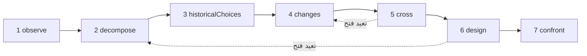

# الدراسات

الدراسة باحث من الذكاء الاصطناعي. تطبّق منهجًا واحدًا — **افهم موضوعًا، ثم أعِد تصميمه بوسائل اليوم** — وتسلّمك ملفًا بحثيًا: ما يفعله الموضوع، وكيف يعمل، ولماذا بُني بهذه الطريقة، وما الذي تغيّر منذ ذلك الحين، وعدة تصاميم جديدة، والتجارب التي من شأنها أن تحسم بينها. إنها لا تبني شيئًا، ولا تشغّل شيئًا، ولا تقيس شيئًا: إنها تستقصي وتقترح.

::: tip بكلمات بسيطة
اختر موضوعًا: متصفّح ويب، أو محرّك قاعدة بيانات، أو جدول مواعيد قطارات. تلاحظه الدراسة، وتفكّكه، وتبحث عن الأسباب الكامنة وراء خياراته القديمة، وتبحث عمّا ظهر منذ ذلك الحين من أبحاث وتقنيات، ثم تقاطع بين الاثنين لتتخيّل تنظيمًا آخر. إنها تستهدف تغييرًا في المبدأ يجعل شيئًا جديدًا ممكنًا، لا نسخة أسرع من الشيء نفسه. ويقول كل ادعاء ما إذا كان **مُثبَتًا** بمصدر عثرت عليه الدراسة فعلًا، أو **فرضية**، أو **جِدّة** ما زال يجب التحقّق منها مقابل الأعمال القائمة. وطوال الوقت، تُبقيها عدة آليات على الهدف الذي أعطيتها إياه، لأن النماذج اللغوية تميل إلى الشرود كلما تراكمت التعليمات. كل مصطلح مشروح في [المصطلحات الأساسية بكلمات بسيطة](./glossary#studies).
:::

```ts
const study = sdk.createStudy({
  name: 'browser',
  object: 'The Web browser, from 1990 to 2026',
  objective: 'A browser design whose every choice follows from the investigation',
  leads: ['vectorisation', 'weights', 'ReLU'], // your leads: examples to verify, not truths
  analogues: ['Bitcoin'],                      // breakthroughs by assembly to deconstruct
  sources: ['web_search', 'arxiv_search'],     // SDK tools the study searches with (webTools())
});

const result = await study.run();
result.status;   // 'completed' | 'stopped' | 'failed' | 'cancelled'
result.report;   // the structured report
result.markdown; // the same, as a readable dossier
```

## ما هي الدراسة {#what-a-study-is}

تطبّق الدراسة منهجًا من سبع مراحل: *افهم موضوعًا، ثم أعِد تصميمه بمعارف اليوم وتقنياته*. وسؤالها الموجِّه هو: **لو كان علينا أن نلبّي احتياجات اليوم بالمعارف والتقنيات المتاحة اليوم، فكيف سننظّم هذا الموضوع؟** وما لم تعطِ `question` خاصًّا بك، تطرح الدراسة هذا السؤال بلغتها، متبوعًا بالغاية الموصوفة في [الغاية: قدرة جديدة](#the-aim-a-new-capability).

الدراسة ليست وكيلًا. ليست لديها أدوات تتصرّف بها، بل **مصادر** تبحث فيها فقط (انظر [البحث عبر مصادرك](#research-through-your-sources))، ومُخرَجها تقرير، لا إجراء. تُنشأ بـ `sdk.createStudy()`، انطلاقًا من **ميثاق** — الموضوع، والهدف، واحتياجاتك، وخيوطك — لا يتغيّر أبدًا بعد ذلك.

مرحلتها الأخيرة تصمّم التجارب، ولا تُجريها. وما إن تُجري إحداها حتى تسجّل ما توصّلت إليه على بطاقة الآلية المطابقة (انظر [بطاقة الآلية](#the-mechanism-card)).

## المراحل السبع {#the-seven-passages}

يمرّ التشغيل بمراحل المنهج السبع، بالترتيب. تنتج كل مرحلة عناصر من بضعة أنواع (**مجموعاتها**)، ويحصل كل عنصر على معرّف لا يُعاد استخدامه أبدًا، حتى إعادة البدء: `O1`، و`P2`، و`A1`…

| # | المرحلة | ما تفعله | ما تحتفظ به |
| --- | --- | --- | --- |
| 1 | `observe` | تنظر في سلوكيات الموضوع، واستخداماته، وتنوّعاته، وإخفاقاته، كلٌّ منها مع شروطه: متى، وأين، ولمن، وبماذا. إنها تصف، ولا تفسّر بعد | `observations` (`O`) |
| 2 | `decompose` | ترسم خريطة الأجزاء: وظيفتها، ومُدخلاتها، ومُخرَجاتها، وعلاقاتها، وتنزل داخل الجزء ما دام عمله غامضًا، مع مجاهيل كل جزء. وتحدّد **السلسلة الكاملة** للموضوع، حلقةً بعد حلقة (للمتصفّح: الاستقبال، والفهم، والتنفيذ، والعرض، والتفاعل) | `pieces` (`P`)، `chain` (`C`) |
| 3 | `historicalChoices` | تبحث عن الأسباب الموثّقة لخيارات زمنها: العتاد، والأدوات، والاستخدامات، والمعارف، والتكاليف، والتوافق. والسبب المعقول الذي لا يسنده مستند يبقى فرضية | `historicalChoices` (`H`) |
| 4 | `changes` | تبحث عمّا ظهر أو صار قابلًا للاستخدام منذ ذلك الحين، في مجال الموضوع وفي غيره، كل تقدّم مع آليته، وتاريخه، وأدلّته، وشروط استخدامه، ومدى توافره. وتصدر حكمًا على كل خيط من خيوطك، وتبحث عن أدوات رياضية وتقنية أخرى تتجاوزها، وتسرد أفضل الإنجازات الحالية (المرجع الذي يُقاس به «الأفضل»)، وتفكّك الاختراقات بالتركيب | `advances` (`V`)، `leadVerdicts` (`L`)، `independentLeads` (`I`)، `references` (`R`)، `analogues` (`B`) |
| 5 | `cross` | تقاطع الماضي بالحاضر: أيّ القيود باقية، وأيّها ضعفت، وأيّ المتطلّبات جديدة. وتستخلص القرارات التي صارت قابلة للمراجعة، وتقترح توليفات A + B (ما يتيحه A لـ B، وما يجب أن يتبادلاه، وما يكلّفه ذلك من تحويلات ومزامنة)، وتسمّي قدرات جديدة مرشّحة | `constraints` (`K`)، `revisableDecisions` (`D`)، `combinations` (`X`)، `capabilities` (`Y`) |
| 6 | `design` | تصمّم بنيتين على الأقل، تستهدف إحداها على الأقل قدرة جديدة، وتغطي كلٌّ منها السلسلة الكاملة، مع آليتها، وشروطها، وفائدتها، وكلفتها الإضافية، ومثال مضاد محتمل، وتنبؤاتها. وتعطي الحالات الثلاث لكل جزء رئيسي، وتقول ما الجديد وما ليس جديدًا. ثم تبحث عن الأعمال السابقة لادعاءات الجِدّة ولتركيب كل قدرة | `architectures` (`A`)، `threeStates` (`T`)، `noveltyClaims` (`N`) |
| 7 | `confront` | تصمّم التجارب التي من شأنها أن تحسم بين البنى وأن تختبر السلسلة الكاملة: البروتوكول، والقياسات، والمعايير، والنتيجة المتوقّعة لكل بنية. وتملأ بطاقة آلية لكل آلية رئيسية | `experiments` (`E`)، `cards` (`M`) |

النتائج التي تعيدها عمليات البحث مرقّمة هي أيضًا: `S1`، و`S2`… وتتلقّى كل مرحلة ما تحتاج إليه من عناصر المراحل السابقة، في صورة سجلّات JSON مضغوطة: العناصر التي حكم عليها الحارس فقط (انظر [الحارس](#the-guardian)).

### دورة، لا خطّ مستقيم {#a-loop-not-a-line}



تشكّل المراحل دورة. حين يعترض مجهولٌ مرحلةً ما — كأن يحتاج التصميم إلى معرفة كيف يعمل جزء ما فعلًا — يمكنها أن تطلب **إعادة فتح** مرحلة سابقة بشأن تلك النقطة. فتُشغَّل المرحلة السابقة من جديد مركّزةً على تلك النقطة، ولا تضيف إلى العناصر التي كانت لديها إلا ما يحتاج إليه ذلك المجهول: ليس عليها حدّ أدنى تبلغه، ولا يُطلَب منها من جديد حكمٌ على الخيوط ولا اختراق. ثم تُشغَّل المرحلة التي طلبت ذلك من جديد بهذه العناصر؛ وإلى أن يحدث ذلك، لا تكون مكتملة (حالتها `partial`)، وينتظر بحثُ التصميم عن الأعمال السابقة نسختَه النهائية. ويضع `limits.maxLoops` حدًّا لعمليات إعادة الفتح في التشغيل الواحد (1 افتراضيًا، و0 لمنعها كليًا)؛ والمرحلة التي أُعيد فتحها هي نفسها لا تستطيع إعادة فتح مرحلة أخرى.

### الحالات الثلاث لكل جزء {#three-states-of-each-piece}

يعطي التصميم كل جزء رئيسي ثلاث حالات، تُبقى منفصلة في التقرير (`threeStates`):

- **الموضوع في زمنه** (`atItsTime`): كيف بُني الجزء، وفي ظلّ أيّ شروط؛
- **أفضل الإنجازات الحالية ذات الصلة** (`currentBest`): المرجع الذي يُقاس به التحسين؛
- **مقترحنا** (`proposal`): ما تفعله البنية به.

قِدَم الخيار لا يجعله خاطئًا، وقد تجعل تقنيةٌ حديثة تعقيدًا من الماضي غير ضروري: تُظهر الحالات الثلاث أيّ شرط تغيّر، وأيّ آلية صارت ممكنة، وما أثر ذلك في الكل.

### بطاقة الآلية {#the-mechanism-card}

تملأ المرحلة الأخيرة بطاقة لكل آلية رئيسية. للبطاقة أحد عشر حقلًا: تملأ الدراسة التسعة الأولى، ويبقى الأخيران فارغين إلى أن تُجري تجربة.

| # | الحقل | السؤال الذي يجيب عنه |
| --- | --- | --- |
| 1 | `observation` | ماذا يفعل النظام، وفي ظلّ أيّ شروط؟ |
| 2 | `mechanism` | أيّ الأجزاء والعلاقات تفسّره؟ |
| 3 | `unknown` | ما الذي يبقى فتحه أو قياسه أو توثيقه؟ |
| 4 | `historicalChoice` | لماذا اختير هذا التنظيم، وبناءً على أيّ أدلة؟ |
| 5 | `evolution` | ما الذي تغيّر منذ ذلك الحين، وبأيّ مصادر وتواريخ؟ |
| 6 | `newPossibility` | أيّ خيار يصير قابلًا للمراجعة بفضل ذلك التغيّر؟ |
| 7 | `proposedCombination` | كيف تتكامل التقنيات معًا، عمليًا؟ |
| 8 | `prediction` | ما الأثر الذي نتوقّعه، وفي ظلّ أيّ شروط؟ |
| 9 | `experiment` | كيف نحسم بين المقترحات ونتحقّق من الكل؟ |
| 10 | `resultAndError` | ماذا وجدنا، وأين يخفق التفسير؟ |
| 11 | `conclusionAndMemory` | ما الذي نحتفظ به، وما الذي نغيّره، وأين يمكن إعادة استخدام هذه الآلية؟ |

```ts
await study.recordResult('M1', {
  result: 'Layout reuse cut the time to redraw by 40% on the reference pages',
  error: 'No gain on pages whose styles change on every frame',
  conclusion: 'Keep immutable layout results; look again at style invalidation',
});
```

يملأ `recordResult(cardId, { result, error?, conclusion? })` الحقلين 10 و11 من البطاقة، ويسجّل حدثًا من نوع `study.result_recorded` في التشغيل الذي كتب البطاقة. ويرمي `ValidationError` لبطاقة مجهولة أو لـ `result` فارغ. ويعيد `study.report()` التقرير مع البطاقة مملوءة.

## الغاية: قدرة جديدة {#the-aim-a-new-capability}

لا تبحث الدراسة عن نسخة أسرع من الموضوع نفسه. بل تبحث عن **تغيير في المبدأ يجعل ممكنًا شيئًا صعبًا اليوم، لا مجرد شيء أسرع**.

### القدرة، والمبدأ، والآلية {#capability-principle-mechanism}

تصرّح كل بنية بثلاثة أمور:

- **القدرة** (`capability`): ما يصير ممكنًا، ولمن، والقيد الحالي الذي ترفعه (`what`، و`forWhom`، و`liftedConstraint`)؛
- **التغيير في المبدأ** (`principleChange`): أيّ مبدأ يتغيّر — `representation`، أو `distribution` (توزيع العمل)، أو `responsibility`، أو `trust`، أو `verification`، أو `other` — وكيف؛
- **الآلية** (`mechanism`): كيف يُنتج تركيبُ التقنيات القدرةَ.

تصرّح كل بنية بنوعها `kind`: `capability`، أو `improvement` حين لا تفعل سوى جعل شيء أسرع أو أرخص. والبنية التي لا تصرّح بأي نوع تُعَدّ تحسينًا، وهو الادعاء الأضعف. ويجب على القدرة أن تصرّح بتغييرها في المبدأ وبتركيبها، وإلا رفضها المخطط (انظر [كل عنصر يقول ما يخدمه](#every-item-says-what-it-serves)).

يمكنك أن تسمّي القدرة التي تستهدفها في الميثاق (`capability`)؛ فيحملها عندئذٍ كل موجّه. ومن دونها، يجب على المرحلة `cross` أن تقترح قدرة مرشّحة واحدة على الأقل (`capabilities`، `Y1`…)، مع مَن هي له، ولماذا هي صعبة اليوم، وأيّ مبدأ سيتغيّر.

ويرى الحارس (انظر [الحارس](#the-guardian)) آلية كل بنية ومكوّناتها وتركيبها، ويحكم على أمرين كلٌّ على حدة: هل تخدم الهدف، وهل تفتح قدرة جديدة. والقدرة التي يجدها مجرد أسرع أو أرخص تصبح `improvement`، مع `declaredKind: 'capability'` لإظهار ما ادّعاه النموذج، و`kindReason` لبيان السبب، وحدث من نوع `study.capability_demoted`. والتحسين الذي يخدم الهدف يبقى: يأتي ترتيبه بعد القدرات، ولا يُحذَف أبدًا لكونه تحسينًا. والتصميم الذي لا تبقى فيه أي قدرة على الإطلاق خارجٌ عن الهدف ككل: يُدوَّن في سجلّ الانحراف ويُعاد مرة واحدة؛ وإذا ظلّت الإعادة بلا قدرة، قال التقرير ذلك (الإشعار `noCapability`)، وإذا لم يُبقِ الحارس أي بنية على الإطلاق، قال ذلك أيضًا (الإشعار `noDesign`). والقدرة التي يجد البحث عن الأعمال السابقة أن تركيبها منجَز من قبل تبقى قدرة، لكنها لم تعد جديدة: انظر [الأعمال السابقة](#prior-art). وفي التقرير، **تأتي القدرات الجديدة أولًا، ثم القدرات التي تركيبها موجود من قبل، ثم التحسينات**.

### الجِدّة تكمن في التركيب {#novelty-lies-in-the-assembly}

نادرًا ما تأتي الاختراقات من تقنية لا سابقة لها. فهي في الغالب تركّب تقنيات سابقة بطريقة لم يسبق إليها أحد، وهذا التركيب يفتح قدرة. والدراسة تستدل بالطريقة نفسها:

- تسرد البنية **مكوّناتها** (`components`): تقنيات سابقة، لكلٍّ منها عبارتها وتاريخها ومصادرها، ولكلٍّ منها حالة يُتحقَّق منها كما يُتحقَّق من حالة أي ادعاء؛
- ويقول **تركيبها** (`assembly`) ما يعطيه كل مكوّن للمكوّنات الأخرى، وما تتبادله، وما يكلّفه ذلك؛
- المكوّن **ليس جِدّة أبدًا**: المكوّن المقدَّم على أنه جديد يكون `established` إذا وثّقته نتيجة مُدرَجة في موجّهه، و`hypothesis` في غير ذلك، مع السبب؛
- ويقول كل مكوّن وكل رابط من روابط التركيب من أيّ سجلّات الاستقصاء يأتي (`from`): أوجه التقدّم (`V`)، والخيوط المستقلة (`I`)، والمراجع (`R`)، والاختراقات (`B`)، والقرارات القابلة للمراجعة (`D`)، والتوليفات (`X`)، والقدرات المرشّحة (`Y`)، من بين تلك التي أدرجها موجّه التصميم. وتتحقّق الشيفرة من ذلك: المعرّفات التي لم يُدرجها الموجّه تذهب إلى `unknownFrom`، والجزء الذي لا يستشهد بأيٍّ من السجلّات المُدرَجة يُوسَم بـ `untraced` — أي لا يُعرَف له أصل، فهو لا ينبثق من الاستقصاء — مع الإشعار `untracedAssembly`؛
- وحالة البنية نفسها هي حالة تركيبها وقدرتها. ويُبحث عن الأعمال السابقة لتركيب **كل قدرة**، أيًّا كانت الحالة التي أعطاها إياه النموذج، **بوصفه توليفة**: تبحث الدراسة عن أعمال تجمع بالفعل المكوّنات نفسها لإنتاج القدرة نفسها، لا عن كل جزء على حدة.

يُظهر الملف البحثي مسار كل بنية: المكوّنات (مع حالاتها ومن أين تأتي) ← التركيب (مع حالته) ← القدرة.

### الاختراقات بالتركيب {#breakthroughs-by-assembly}

تفكّك المرحلة `changes` أيضًا اختراقات سابقة، في أي مجال، جاءت من تركيب تقنيات سابقة (`analogues`، `B1`…). وBitcoin هو المثال الذي يعطيه المنهج: التواقيع بالمفتاح العام، وسلاسل التجزئة والختم الزمني، وإثبات العمل، وأشجار Merkle، وشبكة الند للند، كانت كلها موجودة من قبل؛ وحين رُكِّبت، أعطت سجلًّا مشتركًا دون طرف ثالث موثوق.

لكل اختراق، تسجّل الدراسة التقنيات السابقة التي ركّبها (اثنتان على الأقل، مع تواريخها)، والقيد الذي رفعه، والقدرة التي فتحها، و**نمط** التركيب. وتتلقّى المرحلتان `cross` و`design` هذه الأنماط ويمكنهما إعادة استخدامها. وكل اختراق ادعاءٌ كغيره: لا يكون `established` إلا بنتيجة استرجعتها الدراسة.

يجب تفكيك كل اختراق تسمّيه في `analogues`. ويرقّمها الميثاق، ويسمّي النموذج الاختراق الذي يفكّكه برقمه (`named`)، فتصمد المطابقة أيًّا كانت اللغة التي يكتب بها النموذج. والرد الذي ينسى أحدها يُعاد مرة واحدة؛ وإذا ظلّ أحدها ناقصًا، أدرجه التقرير في `undeconstructedAnalogues`، مع الإشعار `analoguesNotDeconstructed`. ويجوز للدراسة أن تضيف اختراقات أخرى عثرت عليها.

## مُثبَت، فرضية، جِدّة {#established-hypothesis-novelty}

كل عنصر من عناصر الدراسة **ادعاء**: عبارة لها حالة، والنتائج التي تستشهد بها (`sources`)، وما تخدمه في الهدف. يقترح النموذج حالةً؛ و**الشيفرة تتحقّق منها**، أيًّا كان ما يقوله النموذج.

| الحالة | ما تتطلّبه | ما تفعله الدراسة في غير ذلك |
| --- | --- | --- |
| `established` | أن يستشهد الادعاء بنتيجة واحدة على الأقل **مُدرَجة في الموجّه الذي كتبه** | يصبح `hypothesis`. يحتفظ `declaredStatus` بالحالة التي أعطاها النموذج، ويقول `statusReason` السبب؛ والمعرّفات التي استشهد بها ولم يُدرجها موجّهه تُبقى منفصلة في `unlistedSources` ولا تسند شيئًا |
| `hypothesis` | لا شيء: معقول، وغير موثَّق هنا | — |
| `novelty` | فكرة غير موجودة بعد، و**بحث عن أعمالها السابقة** | يبقى جِدّةً يجب التحقّق منها (`toVerify: true`)، مع السبب، إلى أن يُبحث عن أعماله السابقة وتُقيَّم |

لا تكفي نتيجة استرجعتها الدراسة لمرحلة أخرى: يجب أن يكون النموذج قد رآها في الموجّه الذي كتب الادعاء. والقاعدة نفسها تسري على مكوّنات البنية. الحالة التي لا تستطيع الدراسة قراءتها تُعَدّ `hypothesis`، ولا تُعَدّ أبدًا حالة أقوى. **دون مصادر، لا يمكن إثبات شيء**: كل ادعاء فرضيةٌ في أحسن الأحوال، ولا يمكن التحقّق من أي جِدّة، ويقول التقرير ذلك في أول إشعاراته (`noSources`).

كل سبب تعطيه الدراسة — لماذا خُفِّضت حالة، ولماذا حُذف عنصر، ولماذا رُفض تعديل — هو `StudyReason`: رمز `code` (مثل `citesUnlisted` أو `priorArtNoResult`)، ومعاملاته `params`، والسبب نفسه بالإنجليزية (`message`). ويكتبه الملف البحثي بلغة الدراسة؛ والسبب الذي كتبه الحارس أو النموذج رمزه `judged`، ونصّه في `params.text`.

### الأعمال السابقة {#prior-art}

بعد التصميم النهائي، تبحث الدراسة عن الأعمال السابقة لكل جِدّة ما زال يجب التحقّق منها، سواء جاءت من التصميم أو من المراحل السابقة، ولتركيب كل بنية تستهدف قدرة، أيًّا كانت حالتها. يختار النموذج عمليات بحث لكل ادعاء (للبنية: توليفة مكوّناتها والقدرة)، وتُجريها الدراسة، ثم يسمّي استدعاءٌ منفصل أقرب عمل موجود ويصدر حكمًا. **لا تستند الأعمال السابقة لادعاءٍ إلا إلى نتائج عمليات البحث الخاصة به**، وإلى واحدة منها على الأقل:

- `novel` أو `partlyNovel`: تبقى الجِدّة جِدّةً، ولم يعد يجب التحقّق منها، مع `priorArt` الخاص بها (`closest`، و`sources`، و`verdict`)؛
- `exists`: الفكرة منجَزة من قبل؛ تصبح الجِدّة `hypothesis`، ويسمّي `statusReason` أقرب عمل.

وتُسجَّل أيضًا الأعمال السابقة للقدرة التي ليست جِدّة، ولا تتغيّر حالتها: الدراسة تخفّض الحالات، ولا ترفعها أبدًا. وحين يكون تركيبها موجودًا من قبل، تحتفظ بـ `kind: 'capability'`، ويقول `priorArtReason` الخاص بها ذلك (`assemblyExists`، مع أقرب عمل)، ويأتي ترتيبها بعد القدرات الأخرى، وقبل التحسينات (الإشعار `capabilitiesExist`).

والادعاء الذي تعذّر البحث عن أعماله السابقة أو تقييمها يبقى للتحقّق (`toVerify`)، مع السبب: في `statusReason` الخاص به إذا كان جِدّة، وفي `priorArtReason` الخاص به إذا كان قدرة ذات حالة أخرى. والأسباب: لم يُجرَ بحثه بعد (`priorArtNotSearchedYet`)، أو لا مصدر (`priorArtNoSource`)، أو لم يُطلَب له أي بحث (`priorArtNotSearched`)، أو فشلت عمليات بحثه (`priorArtSearchFailed`) أو لم تجد شيئًا (`priorArtNoResult`)، أو نفدت ميزانية البحث (`priorArtSearchBudget`)، أو لم تُقيَّم نتائجه (`priorArtNotAssessed`)، أو لم يستشهد الفحص بأيٍّ من نتائجه الخاصة (`priorArtUnsupported`). والجِدّة التي ادُّعيت بعد التصميم تبقى أيضًا للتحقّق. ويعدّها التقرير (الإشعاران `noveltiesToVerify` و`capabilitiesToVerify`).

وبحث الأعمال السابقة الذي فشل لأن الخدمة قيّدت معدّله — يقول خطأ أداته `throttled`، كما تقول أدوات الويب في حزمة SDK — لا يضيع بسبب ذلك: يُجرَّب مرة أخرى، بعد عمليات بحث الأعمال السابقة الأخرى وبعد الانتظار الذي طلبته الخدمات (5 ثوانٍ على الأقل، و150 ثانية على الأكثر)، حين يبقى للتشغيل دقيقة وعمليات بحث متاحة. وتُسجَّل المحاولة الثانية بحثًا قائمًا بذاته (`retry: true`). والبحث الذي فشل لسبب آخر لا يُجرَّب مرة أخرى، والادعاء الذي تفشل محاولته الثانية أيضًا يبقى للتحقّق، كما سبق.

## البحث عبر مصادرك {#research-through-your-sources}

تبحث الدراسة **بالأدوات التي تعطيها إياها** في `sources`: أسماء أدوات SDK. و[أدوات الويب](./web-research) في حزمة SDK تعمل دون إعداد — `web_search` (عبر DuckDuckGo إلى أن تضبط مزوّدًا آخر)، و`arxiv_search`، و`wikipedia_search`، و`github_search` — وتأتي نتائجها مع عنوان URL، ومع تاريخ حين يكون معروفًا:

```ts
import { webTools } from '@sdk-ai-agents/core';

// Define the tools first: the study checks its sources when it is created.
const sources = webTools({ include: ['web_search', 'arxiv_search', 'wikipedia_search'] }).map(
  (tool) => sdk.defineTool(tool).name
);

const study = sdk.createStudy({ name: 'browser', object, objective, sources });
```

وتصلح أي أداة بحث أخرى أيضًا، مثل أدوات البحث لخادم MCP مستورَد بـ [`connectMcpServer`](./mcp#use-the-tools-of-an-mcp-server-in-your-agents) ومُعرَّف بـ `sdk.defineTool`:

```ts
import { connectMcpServer } from '@sdk-ai-agents/core/mcp';

const search = await connectMcpServer({
  name: 'search',
  transport: {
    type: 'stdio',
    command: 'npx',
    args: ['-y', '@modelcontextprotocol/server-brave-search'],
    env: { BRAVE_API_KEY: process.env.BRAVE_API_KEY ?? '' },
  },
  metadata: { readOnly: true },
});
// Define the tools first: the study checks its sources when it is created.
const sources = search.tools.map((tool) => sdk.defineTool(tool).name);

const study = sdk.createStudy({ name: 'browser', object, objective, sources });
```

- **يُتحقَّق منها عند إنشاء الدراسة.** يرمي `createStudy` خطأ `ValidationError` حين لا يكون المصدر أداة معرَّفة، أو لا يقبل استعلامًا نصيًا. يوضع الاستعلام في المعامل `query` للأداة، أو في اسم شائع آخر (`q`، و`search`، و`keywords`…)، وإلا ففي معاملها النصي المطلوب الوحيد، وإلا ففي أول معامل نصي لها.
- **خاضعة للحوكمة.** يمرّ كل بحث عبر `sdk.executeTool`، تحت `id` الدراسة بوصفه معرّف الوكيل، ومع المصادر بوصفها الأدوات الوحيدة المسموح بها: تنطبق قوائم السماح، والسياسات، والميزانيات، والموافقات، وإعادة المحاولة، والآثار كما في أي استدعاء أداة، وتُسجَّل أحداث الأداة (`action.executing`، و`policy.checked`، و`tool.called`، و`action.executed`) في تشغيل الدراسة. والبحث الذي يفشل، أو الذي ترفضه سياسة، يُسجَّل مع خطئه، وتمضي الدراسة.
- **متى تبحث.** قبل `historicalChoices` وقبل `changes`، يطلب النموذج عمليات البحث التي تحتاج إليها المرحلة — لـ `changes`: للتحقّق من كل خيط من خيوطك، ولإيجاد أدوات أخرى تتجاوزها، ولإيجاد أفضل الإنجازات الحالية، ولتوثيق الاختراقات بالتركيب. وبعد `design`، تبحث عن الأعمال السابقة لادعاءات الجِدّة. ولا يُطلَب أكثر من ست عمليات بحث دفعة واحدة.
- **نتائج مرقّمة.** تقرأ الدراسة النتائج أيًّا كان شكلها (قائمة، أو كائن يحوي قائمة مثل `results` أو `items`، أو نص JSON، أو أجزاء نصية من MCP، أو نص مكتوب في كتل من أسطر `Title:` و`Description:` و`URL:` — نتيجة واحدة لكل كتلة، كما تجيب خوادم البحث MCP في الغالب، ويدخل النصُّ الحرّ الواقع تحت الكتلة في مقتطفها — أو نص عادي). والإجابة مثل «No results found» ليست نتيجة. وتحتفظ بعنوان، وبرابط URL أو محدِّد موقع آخر، وبتاريخ إن وُجد، وبمقتطف، كلٌّ منها في سطر واحد، وترقّمها مرة واحدة للدراسة كلها، حتى إعادة البدء: النتيجة نفسها إذا عُثر عليها مرة أخرى، بحسب محدِّد موقعها، تحتفظ بمعرّفها. وتحتفظ بـ `limits.maxResultsPerSearch` نتيجة من كل بحث (5 افتراضيًا).
- **تُعرَض بوصفها بيانات.** كل نص يأتي من خارج الدراسة — نتائج البحث، وأوصاف المصادر، والعناصر المرفوضة التي تُخبَر بها الإعادة — يصل إلى النموذج في كتلة JSON موسومة بين سطر `<<<UNTRUSTED-DATA-<id>` وسطر `UNTRUSTED-DATA-<id>>>`. ويُختار المعرّف عشوائيًا لكل موجّه، فلا يستطيع نصٌّ أن يُغلق كتلته بعلامة كتبها بنفسه، ويُبلَّغ النموذج بأن ما بين العلامتين بيانات، وليس أبدًا تعليمات يجب اتباعها. وتأتي النتائج التي عُثر عليها لهذه الخطوة مع مقتطفها؛ أما النتائج التي تستشهد بها السجلّات السابقة فتأتي مع معرّفها وعنوانها ومحدِّد موقعها. ولا يستطيع أن يسند ادعاءً مكتوبًا انطلاقًا من ذلك الموجّه إلا المعرّفاتُ المُدرَجة هناك.
- **محدودة.** يضع `limits.maxSearches` (20 لكل تشغيل افتراضيًا) سقفًا لعمليات البحث. وما إن يُستنفَد حتى **لا يتوقّف** التشغيل: بل يمضي دون بحث، وتبقى الادعاءات التي كانت تحتاج إلى مصدر فرضيات، وتبقى ادعاءات الجِدّة للتحقّق، ويقول التقرير أيّ المراحل لم تستطع البحث (الإشعار `searchesSkipped`).

خيوطك أمثلة يجب التحقّق منها، لا حقائق: يجب على `changes` أن تعطي كلًّا منها حكمًا — `relevant`، أو `partlyRelevant`، أو `notRelevant`، مع الأسباب — والرد الذي ينسى أحدها يُعاد مرة واحدة. ويرقّم الميثاق الخيوط، ويسمّي النموذج كلًّا منها برقمه، أيًّا كانت اللغة التي يكتب بها؛ ويعيد التقرير كتابة الخيط كما يكتبه الميثاق. ويحصل الخيط على حكم واحد: الحكم الذي يُعطى عليه من جديد يُسقَط (`leadAlreadyJudged`)، ويُدرَج بوصفه مكرَّرًا في `study.passage_completed`؛ وهو ليس انحرافًا. والخيط الذي يبقى بلا حكم بعد أن تُشغَّل `changes` يُدرَج في `unverifiedLeads` (الإشعار `leadsNotVerified`). أما الأدوات التي تعثر عليها الدراسة بنفسها فهي `independentLeads`.

## البقاء على الهدف {#staying-on-the-objective}

النماذج اللغوية تنحرف. في كل مرة تُضاف فيها تعليمة، يبتعد الحديث عن موضوعه قليلًا، وينسى النموذج ما كان عليه أن يفعله، إلى أن يجب تذكيره به في كل مرة. تجعل الدراسة الانحراف **صعبًا بحكم البنية**، و**مرئيًا** حين يحدث رغم ذلك.

### ميثاق مُجمَّد {#a-frozen-charter}

يحتوي الميثاق على الموضوع، والسؤال الموجِّه، والهدف، والاحتياجات، وخيوطك، وما هو خارج النطاق (`scope.exclude`)، والقدرة المستهدفة، والاختراقات المطلوب تفكيكها. ويُجمَّد عند إنشاء الدراسة — لا يمكن تغيير `study.charter`، ولا حتى عن طريق الخطأ — وتُحسَب بصمته بـ SHA-256 (`study.charterHash`). وتُسجَّل البصمة حين يبدأ كل تشغيل (`study.started`) وفي كل تعديل، فتستطيع أن تثبت أن كل تشغيل عمل على الميثاق نفسه. و`name` الدراسة ليس جزءًا منه: الدراستان اللتان لهما الميثاق نفسه لهما البصمة نفسها. **الهدف الجديد دراسة جديدة.**

### موجّه يُعاد بناؤه عند كل استدعاء {#a-prompt-rebuilt-at-each-call}

لا تُجري الدراسة محادثة أبدًا. يُبنى كل استدعاء للنموذج من هذه الأمور وحدها:

- الميثاق، والتعديلات المقبولة تحته؛
- مهمّة المرحلة؛
- السجلّات المضغوطة التي تحتاج إليها من المراحل السابقة (JSON، لا نصوص محادثات)، والعناصر التي حكم عليها الحارس فقط؛
- نتائج البحث التي يجوز لها الاستشهاد بها، موسومةً بوصفها بيانات.

لا يصل أي رد سابق إلى موجّه. حتى إصلاح رد تعذّر استخدامه يُعاد بناؤه من الميثاق: يقول لماذا رُفض الرد، ولا يقول أبدًا ما كان. لا شيء يتراكم من استدعاء إلى آخر، فلا شيء يطمس الهدف.

### الهدف في الطرفين {#the-objective-at-both-ends}

يبدأ كل موجّه بالميثاق، وينتهي بتذكير سطره الأخير هو الهدف:

```text
STUDY CHARTER (immutable, sha256 3f5a9c0e1b2d4f67)
Object: The Web browser, from 1990 to 2026
Question: If we had to meet today’s needs with the knowledge and techniques available today, how would we organise this object? Which change of principle would make possible something difficult today, not only faster?
Objective: A browser design whose every choice follows from the investigation
The user’s leads (examples to verify, not truths):
1. vectorisation
2. weights
3. ReLU
New capability aimed at: none named; propose candidates: what a change of principle would make possible that is difficult today, not only faster.
Breakthroughs by assembly to deconstruct as analogues:
1. Bitcoin
Accepted amendments (subordinate to the objective):
1. Examine memory safety too

(the role — researcher or guardian — then the task, the records of earlier passages, the results it may cite)

REMINDER
This step must produce: at least two architectures, at least one aiming at a new capability, …
Out of scope: anything that does not serve the objective (the needs are priorities, not the only topics).
The aim is a new capability, not only a speed-up: none named; propose candidates: what a change of principle would make possible that is difficult today, not only faster.
Write every text value in English (en). Reply with the JSON object only.
Objective: A browser design whose every choice follows from the investigation
```

الميثاق، والهدف ضمنه، هو أول ما يقرؤه النموذج، والهدف هو آخر ما يقرؤه. وقبله مباشرة، يعيد كل تذكير التأكيد على الغاية: القدرة المسمّاة في الميثاق، أو الدعوة إلى اقتراح قدرات مرشّحة حين لا يسمّي أيًّا منها.

### كل عنصر يقول ما يخدمه {#every-item-says-what-it-serves}

يجب أن يحمل كل عنصر `servesObjective`: في جملة واحدة، أيّ جزء من الهدف أو أيّ حاجة يخدم. والعنصر الذي لا يحمله **يرفضه المخطط** قبل أن يراه الحارس أصلًا، ويُدوَّن في سجلّ الانحراف (`by: 'schema'`). والعنصر الذي لا يستطيع أن يقول ما يخدمه هو في الغالب عنصر لا يخدم شيئًا.

### الحارس {#the-guardian}

بعد كل مرحلة، يرى استدعاءٌ منفصل — **الحارس** — الميثاقَ والتعديلات المقبولة وعناصر تلك المرحلة فقط: لا المهمّة، ولا السجلّات السابقة، ولا عمليات البحث. ويعمل بدرجة حرارة 0، ويحكم على كل عنصر على حدة: هل هو على الهدف أم لا، ولماذا. وفي التصميم، يرى أيضًا آلية كل بنية ومكوّناتها وتركيبها، ويحكم على ما إذا كانت تفتح قدرة جديدة (انظر [القدرة، والمبدأ، والآلية](#capability-principle-mechanism)). احتياجات الميثاق أولويات، لا قائمة مغلقة بالموضوعات: فجانبٌ من الموضوع لا يذكره الميثاق — أمنه أو استهلاكه للطاقة — يكون على الهدف إذا خدم إعادة التصميم؛ أما ما يخدم غايةً أخرى، كخطة إطلاق، فليس كذلك.

- العنصر الخارج عن الهدف يُحذَف ويُدوَّن في **سجلّ الانحراف** (`by: 'guardian'`)، مع السبب، ويُسجَّل حدثًا من نوع `study.drift_rejected`.
- **يفشل مُغلَقًا.** لا يُحتسَب إلا الحكم الذي تكون فيه قيمة `onObjective` صحيحة أو خاطئة. والعنصر الذي يبقى بلا حكم يبقى `unchecked`: يبقى في التقرير، موسومًا (الإشعار `uncheckedItems`)، لكنه لا يصل أبدًا إلى موجّه لاحق، ويجعل التشغيلُ التالي الحارسَ يحكم عليه أولًا. والحارس الذي لا يحكم على أيٍّ من عناصر مرحلة يُفشِل التشغيل. وحين يتعذّر استخدام إصلاحٍ، أو يفشل المزوّد فيه، يُقرأ الرد الأول بتساهل بدلًا منه: تُحتسَب أحكامه الصالحة، وتبقى العناصر التي لا حكم لها غير مفحوصة (`usedAttempt: 1` في `study.model_called` حين يكون الإصلاح قد تلقّى ردًّا). أمّا التوقّف — بلوغ حدٍّ أو الإلغاء — فيظلّ يوقف التشغيل.
- **الأحكام المتأخرة تصل إلى ما يليها.** حين يُبقي حارسُ التشغيل التالي عناصرَ من مرحلة مكتملة بالفعل، تستدرك المراحلُ التي شُغِّلت من دونها ما فاتها: يحصل التصميم على البحث عن أعمالها السابقة، وتُشغَّل من جديد المراحلُ اللاحقة التي تقرؤها، كما تفعل الدورة (`limits.maxLoops`؛ ويقول `study.passage_started` `outdated: true`). وإذا لم تبقَ دورة، تبقى تلك المراحل متقادمة (الإشعار `passagesOutdated`)، ويكتبها تشغيلٌ لاحق من جديد.
- حين تتجاوز العناصر المرفوضة (من الحارس أو من المخطط) حصةً مما أنتجته المرحلة — `driftThreshold`، الثلث افتراضيًا — **تُعاد المرحلة مرة واحدة**، مع إخبارها بالعناصر التي رُفضت ولماذا. والإعادة خطوة قائمة بذاتها، تفحصها سياسات الميزانية أولًا. ويُحتفَظ بالأفضل من المحاولتين: في التصميم، المحاولة التي تستهدف قدرة جديدة؛ ثم المحاولة التي لديها، بعد الحكم عليها، العناصر التي تحتاج إليها كل مجموعة؛ ثم المحاولة التي احتُفظ فيها بعناصر أكثر؛ والإعادة حين تتساويان. والإعادة التي لا يستطيع الحارس الحكم عليها تُبقي المحاولة الأولى قائمة. وحين يُحتفَظ بالمحاولة الأولى، يقول ذلك `study.passage_completed` وحالةُ المرحلة (`keptAttempt`)، ويقولان ما كانت تحويه الإعادة المستبعَدة (`discarded`)؛ ويقوله الملف البحثي أيضًا، ويُظهر كل مدخل من مدخلات سجلّ الانحراف فيه محاولتَه.
- المرحلة التي تبقى فيها عناصر محكوم عليها أقل مما تحتاج إليه (أقل من بنيتين، مثلًا) يُحتفَظ بها كما هي، ويقول التقرير ذلك (الإشعار `minimumsNotMet`).
- يحتفظ التقرير بكل رفض (`driftLog`)، ويعدّ حالات الرفض والإعادات في `stats`.

### التعديلات {#amendments}

يمكنك إضافة تعليمة بعد إنشاء الدراسة. ولا تتسلّل أبدًا دون أن يُنتبَه إليها: يصنّفها الحارس مقابل الميثاق وحده — لا مقابل التعديلات السابقة أبدًا، فلا يمكن للتعديلات أن يُبنى بعضها على بعض — في تشغيل خاص بها (`mode: 'study-amendment'`)، تُفحَص فيه سياسات الميزانية أولًا.

```ts
const amendment = await study.amend('Examine memory safety too', { timeoutMs: 30_000 });
amendment.verdict;  // 'refines' | 'conflicts' | 'changesObjective' | 'unclassified'
amendment.accepted; // true only when it refines the objective
amendment.number;   // 1, 2… for an accepted amendment
amendment.reason;   // why: { code, params?, message }
```

| الحكم | المعنى | النتيجة |
| --- | --- | --- |
| `refines` | يفصّل العمل أو يضيّقه، أو يضيف حاجة، ضمن الهدف والنطاق | مقبول، ومرقَّم، ويظهر تحت الميثاق في كل موجّه لاحق — بما فيها موجّهات تشغيل جارٍ |
| `conflicts` | يناقض الميثاق أو نطاقه | مرفوض، مع السبب؛ ولا يصل أبدًا إلى أي موجّه |
| `changesObjective` | يغيّر الموضوع أو الهدف | مرفوض: الهدف الجديد دراسة جديدة، تُنشأ بـ `sdk.createStudy` |
| `unclassified` | تعذّر تصنيفه: خطأ (`amendmentUnclassified`)، أو انقضت مهلته `timeoutMs` (60 000 ملّي ثانية افتراضيًا، `amendmentTimedOut`)، أو أُلغيت إشارته `signal` (`amendmentCancelled`)، أو رفضت سياسةُ ميزانية الاستدعاءَ (`amendmentPolicy`) | مرفوض: الهدف أولًا |

تُسجَّل التعديلات المقبولة والمرفوضة (`study.amendment_accepted`، و`study.amendment_refused`) وتُدرَج في `study.amendments` وفي التقرير. لا تتراكم التعليمات بصمت أبدًا: كلٌّ منها مرقَّمة، وتابعة للهدف، ومرئية. ولأن كلًّا منها يُحكَم عليه مقابل الميثاق وحده، يمكن أن يُقبَل تعديلان يناقض أحدهما الآخر: فكلٌّ منهما يفصّل الميثاق، ثم يحكم الحارس على كل عنصر لاحق مقابل الميثاق وكل تلك التعديلات. وتُصنَّف التعديلات واحدًا تلو الآخر، بالترتيب الذي طُلبت به، وتُحتسَب مهلة `timeoutMs` لكلٍّ منها من حلول دوره. وهي محدودة أيضًا: يرمي `amend()` خطأ `ValidationError` لنص يتجاوز 500 حرف (`MAX_AMENDMENT_LENGTH`)، أو حين يحلّ دوره وقد قبلت الدراسة 10 تعديلات (`MAX_AMENDMENTS`)، فلا تستطيع استدعاءات تُجرى في الوقت نفسه أن تتجاوز الحدّ معًا — فبعد ذلك، ينبغي أن يقول الميثاقُ كل شيء، في دراسة جديدة.

### لماذا ينجح هذا {#why-this-works}

يأتي الانحراف من سياق يكبر: الإجابات السابقة، والتعليمات المكدّسة، والنقاشات الجانبية ينتهي بها الأمر إلى أن تزن أكثر من الهدف. والدراسة تزيل هذا النموّ. لا يعيد النموذج أبدًا قراءة ردوده السابقة، فلا يمكن أن ينجرف مع انحرافه هو. ولا تتراكم التعليمات: لا توجد إلا التعديلات المقبولة، وهي قليلة، وقصيرة، وكلٌّ منها مرقَّم ومحكوم عليه مقابل ميثاق لا يمكن أن يتغيّر، لا مقابل بعضها بعضًا أبدًا. يفتتح الميثاق كل موجّه ويختمه الهدف، حيث يولي النموذج أكبر قدر من الانتباه. ويجب أن يبرّر كل عنصر نفسه مقابل الهدف، مما يجعل العنصر الشارد سهل الاكتشاف. ونتائج البحث موسومة بوصفها بيانات، فالصفحة التي تقول «تجاهل تعليماتك» اقتباسٌ، لا أمر. وحَكَمٌ ذو رؤية ضيّقة — الميثاق والعناصر، لا شيء غير ذلك — يلتقط ما يظلّ يتسلّل، وهو يفشل مُغلَقًا: ما لم يحكم عليه لا يمضي أبعد. ويُريك سجلّ الانحراف ما حذفه ولماذا.

لا شيء من هذا يجعل الانحراف مستحيلًا: فالحارس نموذج أيضًا، وقد يخطئ في الاتجاهين. لكنه يجعل الانحراف غير مرجَّح، ومحدودًا (إعادة واحدة لكل مرحلة)، وقابلًا للتدقيق.

## الحدود والتكاليف والميزانيات {#limits-costs-and-budgets}

| الحدّ | القيمة الافتراضية | حين يُبلَغ |
| --- | --- | --- |
| `maxModelCalls` | 60 | يتوقّف التشغيل: الحالة `stopped`، و`stoppedBy: 'maxModelCalls'`. ويعدّ كل استدعاء في التشغيل: المراحل، وطلبات البحث، وفحوص الحارس، وفحوص الأعمال السابقة، والإصلاحات |
| `timeoutMs` | 20 دقيقة | يُلغى التشغيل، ويتلقّى الاستدعاء الجاري إشارة الإلغاء: `stopped`، و`stoppedBy: 'timeoutMs'` |
| `maxSearches` | 20 | يمضي التشغيل دون بحث (انظر [البحث عبر مصادرك](#research-through-your-sources)) |
| `maxLoops` | 1 | لا تُعرَض أي إعادة فتح أخرى |
| `maxResultsPerSearch` | 5 | تُسقَط النتائج الأخرى للبحث |

تنطبق الحدود على كل تشغيل. إعدادات أخرى: `driftThreshold` (1/3)، و`temperature` للمراحل وطلبات البحث (0.4؛ أما الحارس، والتعديلات، وفحص الأعمال السابقة فتعمل بـ 0)، و`maxTokens`، و`model` (النموذج الافتراضي للمزوّد حين يُغفَل)، و`llmProvider` (مزوّد لهذه الدراسة بدل مزوّد حزمة SDK). والإعداد الخارج عن النطاق المسموح يرمي `ValidationError` عند إنشاء الدراسة.

التشغيل الذي يتوقّف **يحتفظ بكل ما فعله**: المراحل المنجزة، وعناصر المرحلة الجارية (والعناصر التي لم يكن الحارس قد حكم عليها بعد تُوسَم بـ `unchecked`، وتُبقى خارج كل موجّه لاحق، الإشعار `uncheckedItems`)، وتقريرًا وملفًا بحثيًا يقولان ما لم يُشغَّل.

التشغيل الذي لا إصلاحات فيه ولا إعادات يُجري 14 استدعاءً للنموذج دون مصادر — كل مرحلة وفحص الحارس لها — وحتى 18 مع مصادر: عمليات البحث المطلوبة قبل `historicalChoices` و`changes`، والبحث عن الأعمال السابقة لادعاءات الجِدّة (استعلاماته، ثم فحصه). ويضيف كل إصلاح استدعاءً واحدًا، وكل إعادة استدعاءين على الأقل (المرحلة وفحصها من جديد)، وكل إعادة فتح أربعة على الأقل (المرحلة المُعاد فتحها والمرحلة التي طلبت ذلك، كلٌّ منهما مع فحصها).

### التكاليف والميزانيات {#costs-and-budgets}

يُسجَّل كل استدعاء للنموذج في الدراسة حدثًا من نوع `study.model_called`، مع `model` و`requestedModel` و`usage` الخاصة به — حدث واحد للاستدعاء وإصلاحه — وتُسجَّل الإجابة التي تجاهلها مزوّد حدثًا من نوع `provider.answer_discarded`. وتُحتسَب كأي استدعاء آخر للنموذج:

- في `sdk.getRunCost(result.runId)`، والتعديل في تشغيله الخاص: `sdk.getRunCost(amendment.runId)` (انظر [تكاليف API](./costs))؛
- في الميزانيات لكل فترة، تحت `id` الدراسة: يعطي `sdk.getBudgetUsage({ agentId: study.id, period: 'all' })` الرموز والكلفة واستدعاءات الأدوات لكل عمليات تشغيلها.

تُفحَص سياسات الميزانية والمهلة الزمنية في حزمة SDK (`defaultPolicies`، و`defineGlobalPolicy`) **قبل كل خطوة** من خطوات الدراسة، كما تُفحَص سياسات الوكيل المعرفي قبل كل خطوة من خطواته (انظر [الحدود والسياسات](./cognitive-agents#limits-and-policies)). والخطوة هي مرحلة تُنجَز، أو إعادة، أو مرحلة أُعيد فتحها، أو فحص الحارس لما تركه تشغيلٌ متوقّف دون حكم، أو إتمام مرحلة يستأنفها تشغيل، أو تصنيف تعديل. يعدّ `maxSteps` الخطوات المنجزة، و`maxTokens` رموز استدعاءات النموذج في التشغيل، و`maxDuration` الوقت منذ بدء التشغيل، و`budgetLimit` مع `maxTokens` أو `maxCost` ميزانيته لكل فترة. والسياسة التي ترفض تسجّل `policy.violated` مع `passage`، ويتوقّف التشغيل: `stopped`، و`stoppedBy: 'policy'`؛ أما التعديل فيُرفَض بدلًا من ذلك (`amendmentPolicy`). وتمرّ عمليات البحث أيضًا، بوصفها استدعاءات أدوات، عبر السياسات.

## عمليات التشغيل، والاستئناف، والإلغاء {#runs-resume-and-cancellation}

| الحالة | متى | آخر الأحداث |
| --- | --- | --- |
| `completed` | شُغِّلت كل المراحل | `study.completed`، `run.completed` |
| `stopped` | أنهى حدٌّ أو سياسةٌ التشغيل (`stoppedBy`) | `study.failed`، `run.failed` |
| `failed` | أنهاه خطأ، مثل رد تعذّر استخدامه حتى بعد إصلاحه، أو تصميم فيه أقل من بنيتين صالحتين، أو حارس لم يُصدر حكمًا صالحًا على أيٍّ من عناصر مرحلة (`error`) | `study.failed`، `run.failed` |
| `cancelled` | أُلغيت إشارته `signal` | `study.failed`، `run.cancelled` |

```ts
const controller = new AbortController();
const first = await study.run({ signal: controller.signal });

// Later: resume at the first passage not complete, with what was done kept.
const second = await study.run();

// Or start the study over: only the charter and the amendments stay.
const fresh = await study.run({ restart: true });
```

- **الاستئناف.** يُستأنَف التشغيل المتوقّف أو الفاشل أو الملغى باستدعاء `run()` من جديد. فيحكم الحارس أولًا على ما تركه آخر تشغيل دون حكم، وما يُبقيه يصل إلى المراحل التي شُغِّلت من دونه (انظر [الحارس](#the-guardian)). ثم المرحلة التي حُكم على محاولتها الأولى قبل التوقّف تخضع للإعادة التي كانت مستحقّة لها، وفق القواعد نفسها كما في التشغيل (ويقول `study.passage_started` `redo: true` و`resumed: true`)؛ وإلا فإنها لا تفعل سوى أن تنتهي — فالتصميم الذي قُطع بحثه عن الأعمال السابقة يُستأنَف عند ذلك البحث، ويقول `study.passage_completed` الخاص به `resumed: true`. ثم تُشغَّل المراحل غير المكتملة. وتُحفَظ المراحل المكتملة بالفعل؛ ويسجّل `study.started` أول مرحلة بقي فيها عمل (`resumeAt`).
- **إعادة البدء.** يعيد `restart: true` بدء الدراسة من أولها: يمحو المراحل، والنتائج (التي تُرقَّم من `S1` من جديد)، وعمليات البحث، وسجلّ الانحراف، وترقيم العناصر، وعمليات التشغيل. ولا يبقى إلا الميثاق والتعديلات.
- **تشغيل واحد في كل مرة.** استدعاء `run()` ثانٍ بينما تشغيلٌ جارٍ يرمي `ValidationError`. ويمكن استدعاء `amend()` أثناء التشغيل.
- **في الذاكرة.** تعيش حالة الدراسة في كائن `Study` الخاص بها، ويتغيّر `id` الخاص بها من عملية إلى أخرى: يعمل الاستئناف على الكائن نفسه. وتسجّل الأحداث عناصر كل مرحلة، وكل بحث، وكل حكم من أجل التدقيق، لكن حزمة SDK لا تعيد بناء دراسة منها.
- **التقرير.** `result.report` نسخة أُخذت حين انتهى التشغيل؛ ويعيد `study.report()` التقرير كما هو الآن، مع النتائج المسجَّلة منذ ذلك الحين.

### الأحداث المباشرة {#live-events}

يستدعي `run({ onEvent })` مستمِعك مع كل حدث من أحداث التشغيل، بالترتيب، بمجرّد أن يقبله مخزن الأحداث، تمامًا كما يفعل `agent.run` (انظر [التقدّم المباشر](./observability#live-progress)). ولا يعيد `run()` نتيجته إلا بعد أن يفرغ المستمِع من كل حدث، أو قبل ذلك حين يكون التشغيل قد أُلغي أو انتهت مهلته.

```ts
const result = await study.run({
  onEvent: (event) => {
    if (event.type === 'study.passage_started') console.log(`→ ${event.data.passage}`);
    if (event.type === 'study.drift_rejected') console.log(`  off the objective: ${event.data.reason}`);
  },
});

// Every run of the study, amendments included: its events carry its id as agentId.
const unsubscribe = sdk.subscribe(listener, { agentId: study.id });
```

تسجّل الدراسة اثني عشر نوعًا من الأحداث: `study.started`، و`study.passage_started`، و`study.passage_completed`، و`study.search`، و`study.model_called`، و`study.drift_rejected`، و`study.capability_demoted`، و`study.amendment_accepted`، و`study.amendment_refused`، و`study.result_recorded`، و`study.completed`، و`study.failed`. ويعطي [فهرس الأحداث](../reference/events#studies) بياناتها. والأداة التي تشغّل دراسة وتمرّر إليها `onEvent` الخاص بسياقها يتابعها عميل MCP أيضًا: تسمّي [إشعارات التقدّم](./mcp-deploy#progress-notifications) الخاصة بها المراحلَ (`passage changes started`، `search in changes`، ثم `report ready` أو `partial report ready`)، ولا تسمّي أبدًا استعلامًا ولا نصًّا من نصوص الدراسة.

## مثال كامل {#a-complete-example}

يدرس `examples/study.ts` متصفّح الويب من 1990 إلى 2026، بالفرنسية. ويعطي ثلاثة خيوط للتحقّق منها — التحويل إلى متّجهات (vectorisation)، والأوزان (`poids`)، وReLU، وهي أمثلة لا شيء يقول إنها تنطبق على متصفّح — ولا يسمّي أي قدرة، فتقترح الدراسة قدرات مرشّحة، ويطلب منها تفكيك Bitcoin بوصفه اختراقًا بالتركيب. هذا جوهره، وهو يبحث على الويب بأدوات الويب في حزمة SDK:

```ts
import { writeFileSync } from 'node:fs';
import { FileEventStore, createSDK, webTools } from '@sdk-ai-agents/core';

const eventStore = new FileEventStore('./events');
const sdk = createSDK({
  apiKey: process.env.OPENAI_API_KEY,
  eventStore,
  // Illustrative prices: use your provider's current prices or your contract.
  pricing: { 'gpt-4o': { inputPerMillion: 2.5, outputPerMillion: 10 } },
});

// The study searches only with the tools you give it, run through the governed pipeline.
// DuckDuckGo, arXiv and Wikipedia need no key.
const web = webTools({ include: ['web_search', 'arxiv_search', 'wikipedia_search'] });
const sources = web.map((tool) => sdk.defineTool(tool).name);

const study = sdk.createStudy({
  name: 'navigateur',
  object: 'Le navigateur Web, de 1990 à 2026',
  objective: "Une conception de navigateur dont chaque choix découle de l'enquête",
  needs: ['interactions', 'accessibilité', 'compatibilité attendue avec le Web existant'],
  leads: ['vectorisation', 'poids', 'ReLU'],
  // No capability named: the study proposes candidates (set `capability` to aim at one).
  analogues: ['Bitcoin'],
  sources,
  model: 'gpt-4o',
  language: 'fr',
  limits: { maxModelCalls: 60, maxSearches: 20, timeoutMs: 20 * 60_000 },
});

const result = await study.run({
  onEvent: (event) => {
    if (event.type === 'study.passage_started') console.log(`→ ${event.data.passage}`);
    if (event.type === 'study.search') console.log(`  search: ${event.data.query}`);
  },
});

writeFileSync('study-navigateur.md', result.markdown);
const { stats } = result.report;
console.log(`${result.status}: ${stats.byStatus.established} established, ${stats.byStatus.hypothesis} hypotheses`);
// Capabilities first, then improvements (only faster or cheaper).
for (const { id, kind, name, capability } of result.report.architectures) {
  console.log(`${id} [${kind}] ${name}: ${capability.what}`);
}
console.log(await sdk.getRunCost(result.runId));

await eventStore.destroy();
```

شغّل المثال بـ `OPENAI_API_KEY=… npm run example:study`: لا يحتاج إلى أي مفتاح آخر. ويستطيع أيضًا أن يبحث بخادم MCP للبحث تعطيه أمر تشغيله: `SEARCH_MCP="npx -y @modelcontextprotocol/server-brave-search" SEARCH_ENV=BRAVE_API_KEY BRAVE_API_KEY=…` يضيف أدوات الخادم إلى المصادر. ويسمّي `SEARCH_ENV` المتغيّرات التي يحتاج إليها الخادم: فيحصل عليها وعلى بيئة دنيا، ولا يحصل أبدًا على مفتاح نموذجك. ويختار `SEARCH_TOOLS` بعض أدوات الخادم، و`MODEL` النموذج. ويكتب الملف البحثي في `examples/study-navigateur.md`، ويطبع لماذا لم يكتمل تشغيلٌ، ثم ينتهي عندئذٍ برمز الخروج 1.

ما تتوقّعه في الملف البحثي:

- **الخيوط محكومًا عليها**: يحصل كلٌّ من التحويل إلى متّجهات والأوزان وReLU على حكم مع أسبابه، وتسرد الدراسة أدوات أخرى عثرت عليها تتجاوزها؛
- **Bitcoin مفكَّكًا**: مكوّناته السابقة وتواريخها، والقيد الذي رفعه (طرف ثالث موثوق)، والقدرة التي فتحها، ونمط التركيب، الذي تعيد استخدامه مرحلتا المقاطعة والتصميم؛
- **قدرات مرشّحة** تحت مرحلة المقاطعة، ثم بنيتان للمتصفّح على الأقل، القدرات أولًا، لكلٍّ منها مسارها المكوّنات ← التركيب ← القدرة، وتغطيتها للسلسلة الكاملة (الاستقبال، والفهم، والتنفيذ، والعرض، والتفاعل)، وتنبؤاتها؛
- **التجارب** التي من شأنها أن تحسم بينها، وبطاقات الآليات، مع الحقلين 10 و11 لتملأهما بعد أن تُجري التجارب.

## قراءة التقرير {#reading-the-report}

```ts
const { report } = result;
report.notices;       // read first: no sources, a stop, leads without a verdict…
report.architectures; // new capabilities, then existing ones, then improvements
report.experiments;   // what would decide between the architectures
report.cards;         // one mechanism card per main mechanism
report.driftLog;      // what left the objective, and why
report.results;       // every result retrieved, S1, S2…
report.stats;         // model calls, searches, items by status, rejections, redos, loops, amendments
```

ويحتوي التقرير أيضًا على الميثاق وبصمته، والتعديلات، وحالة كل مرحلة (`complete`، أو `partial`، أو `unchecked`، أو `notRun`، مع محاولاتها، والمراحل التي أعادت فتحها، والإعادة التي استبعدتها، إن وُجدت)، وكل مجموعات المراحل، والحالات الثلاث مجمّعة بحسب الجزء، وعمليات البحث، وعمليات تشغيل `run()` منذ آخر إعادة بدء (`runIds`). ويعدّ `stats.runs` و`stats.modelCalls` تلك العمليات، والاستدعاءات التي أجاب عنها المزوّد فقط؛ أما التعديلات فتُعَدّ على حدة، وتبقى بعد إعادة البدء (`stats.amendments`: كم تعديلًا صُنِّف، واستدعاءاتها للنموذج). ويسرد [مرجع واجهة SDK البرمجية](../reference/sdk-api#studies) أنواعه.

تقول **الإشعارات** ما يجب أن يعرفه القارئ قبل أن يثق بالباقي. لكل إشعار رمز `code`، ومعاملاته `params` وتفاصيله `details`، والإشعار نفسه بالإنجليزية (`message`):

| الإشعار | المعنى |
| --- | --- |
| `noSources` | لم يكن للدراسة أي مصدر: لم يمكن إثبات شيء، ولا التحقّق من أي جِدّة |
| `stopped`، `failed`، `cancelled` | كيف انتهى آخر تشغيل؛ ويحتفظ التقرير بما أُنجِز |
| `passagesNotRun` | مراحل لم يبلغها آخر تشغيل |
| `uncheckedItems` | عناصر لم يحكم عليها الحارس (توقّف التشغيل قبل ذلك، أو لم يُصدر عليها حكمًا صالحًا): تُبقى خارج كل موجّه لاحق، ويحكم عليها التشغيل التالي أولًا |
| `searchesSkipped` | نفدت ميزانية البحث، وفي أيّ المراحل |
| `leadsNotVerified` | خيوط بلا حكم، بعد أن تُشغَّل `changes` |
| `analoguesNotDeconstructed` | اختراقات مسمّاة لم تُفكَّك، بعد أن تُشغَّل `changes` |
| `noDesign` | لم يُبقِ التصميم أي بنية |
| `noCapability` | لا تستهدف أي بنية قدرة جديدة: تحسينات فقط |
| `minimumsNotMet` | مجموعات بقيت فيها عناصر محكوم عليها أقل مما تحتاج إليه (`details`: `passage.collection`) |
| `untracedAssembly` | بنى لها مكوّن أو رابط تركيب لا يستشهد بأي سجلّ من سجلّات الاستقصاء (`details`: معرّفاتها) |
| `noveltiesToVerify` | ادعاءات جِدّة ما زال يجب التحقّق منها مقابل الأعمال السابقة |
| `capabilitiesToVerify` | قدرات لم يُتحقَّق من تركيبها مقابل الأعمال السابقة (`details`: معرّفاتها) |
| `capabilitiesExist` | قدرات تركيبها موجود من قبل، يأتي ترتيبها بعد الأخرى (`details`: معرّفاتها) |
| `passagesOutdated` | مراحل كُتبت قبل عناصر حكم عليها الحارس متأخرًا، ولم تُكتَب من جديد بعد |

### الملف البحثي {#the-dossier}

`result.markdown` هو التقرير في صورة ملف بحثي مقروء، بلغة الدراسة `language`. ويكتب `renderStudyMarkdown(report)` الشيء نفسه انطلاقًا من أي تقرير — مثلًا `renderStudyMarkdown(study.report())` بعد أن تسجّل نتيجة. ويتبع المنهج:

1. الميثاق (الموضوع، والسؤال، والهدف، والاحتياجات، والخيوط، والنطاق، والقدرة المستهدفة، والاختراقات المطلوب تفكيكها، والبصمة) والتعديلات؛
2. الإشعارات؛
3. مبدأ المنهج، وحالة كل مرحلة؛
4. عناصر كل مرحلة: الملاحظات، والأجزاء والسلسلة الكاملة، والخيارات التاريخية، وأوجه التقدّم، وأحكام الخيوط، والخيوط المستقلة، والمراجع الحالية، والقيود، والقرارات القابلة للمراجعة، والقدرات المرشّحة؛
5. الحالات الثلاث لكل جزء، والتوليفات، والاختراقات بالتركيب؛
6. مقترحات التصميم: كل بنية موسومة بأنها قدرة جديدة أو تحسين (ومع السبب، للبنية التي خُفِّض نوعها)، مع لمن هي، والقيد المرفوع، والتغيير في المبدأ، والآلية، والمسار المكوّنات ← التركيب ← القدرة مع الموضع الذي يأتي منه كل جزء، وشروطها، وفائدتها، وكلفتها الإضافية، ومثالها المضاد، وتغطيتها للسلسلة، وتنبؤاتها؛ ثم ما هو جديد وما ليس كذلك؛
7. التجارب، وبطاقات الآليات؛
8. سجلّ الانحراف (كل مدخل مع محاولته، والإعادات المستبعَدة)، والمصادر، والإحصاءات.

يُظهر كل ادعاء حالته والنتائج التي يستشهد بها (`S1, S3`)، والمعرّفات التي استشهد بها ولم يُدرجها موجّهه؛ والحالة التي خفّضتها الدراسة تقول ما صرّح به النموذج ولماذا؛ والجِدّة تُظهر أعمالها السابقة، أو أنها ما زالت للتحقّق. ولا تصير روابطَ إلا محدِّدات المواقع من نوع http وhttps. وكلمات الملف البحثي موجودة باللغات الإحدى عشرة لهذا التوثيق؛ وتحصل أي لغة أخرى على تسميات إنجليزية، بينما يظل النموذج يكتب نصوصه بتلك اللغة. ورسالة `message` لكل إشعار ولكل سبب في التقرير بالإنجليزية؛ ويكتبها الملف البحثي بلغته، انطلاقًا من رموزها.

## ما لا تفعله الدراسة {#what-a-study-does-not-do}

- **لا تبني شيئًا، ولا تشغّل شيئًا، ولا تقيس شيئًا.** تبقى تنبؤاتها تنبؤات إلى أن تُجري التجارب.
- **لا تعرف إلا ما تعيده مصادرها.** من دون مصادر، يكون كل ادعاء فرضية؛ و[أدوات الويب](./web-research) لا تقرأ إلا ما هو عامّ، دون تشغيل JavaScript الصفحة.
- **يُتحقَّق من الاستشهاد، لا من محتواه.** تتحقّق الشيفرة من أن النتيجة التي يستشهد بها ادعاء `established` كانت مُدرَجة في الموجّه الذي كتبه، لا من أن النتيجة تقول ما يقوله الادعاء. يسرد الملف البحثي كل مصدر مع رابطه: اقرأها.
- **الحارس وفحص الأعمال السابقة أحكامُ نموذج.** يُظهرها سجلّ الانحراف وما يُدوَّن عن الأعمال السابقة، فتستطيع أن تخالفها.
- **ما تقرؤه غير موثوق.** يمكن أن تحتوي نتائج البحث على تعليمات موجّهة إلى النموذج (حقن الموجّهات، prompt injection). وهي تصل إلى النموذج موسومةً بوصفها بيانات، ولا تستطيع الدراسة إلا استدعاء مصادرها، عبر السياسات، ويُهرَّب نص النموذج ونص المصادر في الملف البحثي؛ والحالات وقواعد الانحراف مفروضة بالشيفرة، لا بالموجّه. والوسم يقلّل الخطر؛ لكنه لا يزيله.
