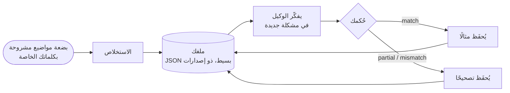

# ملفات المفكّرين: الاستدلال على طريقة شخص معيّن

::: tip هل تستطيع حزمة SDK أن تستدل مثلي؟
**نعم: يمكنها محاكاة الطريقة التي يستدل بها شخص معيّن.** يستطيع الوكيل المعرفي أن يتبع ترتيب انتباهك *أنت*، وأن يزن أولوياتك *أنت*، وأن يطبّق ردود أفعالك *أنت*، وأن يرفض ما كنت *أنت* سترفضه. وهو يتعلّم ذلك من بضع مشكلات تشرحها بكلماتك الخاصة؛ وفي كل مرة تخبره أين أخطأ، يُضاف التصحيح إلى تعليماته، وتُظهر نسبة اتفاقك ما إذا كان يقترب أكثر.

إنه يحاكي **طريقة استدلال**، لا شخصًا: فهو لا يعرف ما لم تكتبه، ولا يقرّر مكانك. لا تدّعي حزمة SDK مدى اقترابها منك: **أنت من يقيسه**، تشغيلًا بعد تشغيل، بنسبة الاتفاق التي تعطيها لإجاباته.
:::

{.illustration}

## ماذا يعني «الاستدلال مثلك» {#what-reasoning-like-you-means}

| ما يحاكيه | ما لا يحاكيه |
| --- | --- |
| **الترتيب** الذي تنظر به إلى المشكلة (أولًا ما تتيحه حقًا، ثم حدودها…) | **معرفتك**: ما تعرفه لكنك لم تكتبه قط، إلا إذا قدّمته سياقًا أو ملاحظات |
| **أولوياتك** (ما يهمّك أكثر، بالترتيب) | **ذكرياتك** وحياتك: فهو لا يعرف إلا العيّنات والتصحيحات والسياق التي قدّمتها له |
| **ردود أفعالك** («حين تكون خدمة مدفوعة، أبحث أولًا عن بديل مجاني») | الحدوس التي لم تصُغها قط في كلمات |
| ما يجعلك **ترفض** فكرة | **مسؤوليتك**: إجابته تنبؤ بما كنت ستفكّر فيه، لا قرار يُتخَذ عنك |
| **ميلك إلى المخاطرة** | يقينك بشأن العالم: الادعاءات لا تزال تحتاج إلى أدلة، كما في أي وكيل معرفي |
| **الأخطاء التي صحّحتها**: يُطلَب منه ألا يكرّرها | |

## كيف يعمل، خطوة بخطوة {#how-it-works-step-by-step}



### الخطوة 1: اشرح بضعة مواضيع بكلماتك الخاصة {#step-1-explain-a-few-topics-in-your-own-words}

**العيّنة** موضوع واحد استدللت بشأنه، مكتوب بالطريقة التي خطر لك بها. لا بأس بالفوضى. وللعيّنة ثلاثة أجزاء:

| الحقل | ما تكتبه | مثال |
| --- | --- | --- |
| `topic` | الموضوع، في بضع كلمات | «روبوت لا يرتّب إلا المطابخ» |
| `reasoning` | كيف تناولته: ما الذي نظرت إليه أولًا، وما الذي تحقّقت منه، وما الذي جعلك تتردّد، ولماذا | «ماذا يفعل حقًا؟ غرفة واحدة فقط، إذن الحدّ هو التعميم. هل يستطيع تعلّم غرفة أخرى من بضعة أمثلة؟…» |
| `conclusion` | ما خلصت إليه أو ما كنت ستفعله (اختياري، لكنه يصبح مثال معايرة) | «بناء حلقة تكيّفية صغيرة واختبارها على غرفة ثانية» |

خمس إلى عشر عيّنات عن مواضيع **متنوّعة** أفضل من عيّنات كثيرة عن موضوع واحد: فالمُستخلِص يبحث عمّا يتكرّر **عبر** المواضيع، والنمط الذي يُرى مرة واحدة ضعيف.

### الخطوة 2: استخلص ملفك {#step-2-distill-your-profile}

```ts
const profile = await sdk.distillThinkerProfile({
  id: 'nicolas',
  name: 'Nicolas',
  model: 'gpt-4o',
  samples: [
    {
      topic: 'Typed decision APIs like Jev',
      reasoning:
        'What does it really allow? Then the limits: closed, US-only, paid. Is there an open clone? ' +
        'Could it become the controller of my agents? I would benchmark it on my own traces first.',
      conclusion: 'Use an open clone as the controller and benchmark it against Jev',
    },
    { topic: 'World models', reasoning: 'Structure beats scale. Test on a small chaotic system before anything big.' },
  ],
});
```

ما يحدث بالضبط:

1. تُفحَص العيّنات: يحتاج كل منها إلى موضوع واستدلال.
2. يؤدّي استدعاء واحد للنموذج اللغوي دور *محلّل معرفي*. وهو يبحث عن **العمليات المتكرّرة** في استدلالك، لا عن آرائك: ما تفحصه أولًا، والأسئلة التي تطرحها، وإلى أي حدّ تدفع فكرة ما، وما يجعلك ترفض حلًا، وعلاقتك بالمخاطرة والتكلفة والجِدّة. ويُطلَب منه ألا يحتفظ إلا بالأنماط التي تدعمها العيّنات، وأن يفضّل ما شوهد منها في عدة عيّنات.
3. يُتحقَّق من رده مقابل مخطط الملف. ويُعاد الرد غير الصالح مرة واحدة مع الخطأ؛ ويرمي الفشل الثاني `ThoughtGenerationError` بدل إعادة ملف نصف مكتمل.
4. تُحفَظ العيّنات التي لها استنتاج داخل الملف بوصفها **أمثلة**، فيحمل الملف المنهج المستخرج والأدلة التي جاء منها معًا.

النتيجة JSON بسيط. **اقرأه**: إذا كانت خطوة أو أولوية خاطئة أو ناقصة، فأصلحها يدويًا. أنت تعرف نفسك أفضل مما يعرفها استخراج واحد.

### الخطوة 3: دع الوكيل يفكّر مثلك {#step-3-let-the-agent-think-as-you}

```ts
const twin = sdk.createCognitiveAgent({
  name: 'my-twin',
  model: 'gpt-4o',
  profile,
  systemPrompt: "Write every statement and the answer in French, in the thinker's own voice.", // optional
});

const run = await twin.think({
  problem: 'A bank offers you a stable, well-paid CTO job maintaining legacy systems. What do you decide?',
});
console.log(run.decision?.status, run.decision?.answer);
```

**يُنسَخ الملف حين يبدأ التشغيل**، فالتصحيح المقدَّم أثناء تشغيل ما يُطبَّق على التشغيل التالي. ويُكتَب في تعليمات كل خطوة استدلال، ويُطلَب من خطوة `decide` النهائية *الإجابة التي كان المفكّر سيعطيها*، مع مسوّغ يتبع ترتيب انتباه المفكّر. يسرد قسم [أين يؤثّر الملف](#where-the-profile-weighs-and-where-it-never-does) كل موضع.

### الخطوة 4: أخبره أين أخطأ {#step-4-tell-it-where-it-went-wrong}

بعد التشغيل، أعطِ **حُكمك**: هل استدل بالطريقة التي كنت ستستدل بها؟

```ts
// "Yes, exactly what I would have thought."
await twin.learnFromFeedback(run.runId, { verdict: 'match' });

// "No, I would have gone another way."
await twin.learnFromFeedback(run.runId, {
  verdict: 'mismatch',
  expected: 'Prototype with the free clone first, then compare with Jev on 100 real tickets',
  lesson: 'Always test the free option on real data before paying',
});

// "You are 50% right, and here is where you went wrong."
await twin.learnFromFeedback(run.runId, {
  verdict: 'partial',
  agreement: 0.5,
  wrongAbout: ['ignored the free option', 'overestimated the integration cost'],
  expected: 'Benchmark the open clone on our own tickets before deciding',
});
```

| الحقل | المعنى | مطلوب |
| --- | --- | --- |
| `verdict` | `match` (استدل مثلك)، `partial` (جزئيًا)، `mismatch` (إطلاقًا) | دائمًا |
| `agreement` | القدر الذي تتفق معه منه، من 0 إلى 1: القيمة `0.8` تعني «صحيح بنسبة 80%» | لا |
| `expected` | ما كنت ستخلص إليه بدلًا من ذلك | مع `partial` و`mismatch` |
| `wrongAbout` | أين أخطأ الاستدلال، بكلماتك | لا |
| `lesson` | القاعدة التي يجب تذكّرها في المرة القادمة (القيمة الافتراضية `expected`) | لا |
| `notes` | أي شيء آخر، يُحفَظ في الحدث | لا |

ما يحدث له:

| الحكم | التأثير في الملف |
| --- | --- |
| `match` | يصبح التشغيل **مثال** معايرة: سؤاله، وملخّص خطوات استدلاله، واستنتاجه. كل `match` يُبقي أحدث 10 أمثلة، بما فيها العيّنات المستخلصة. |
| `partial` / `mismatch` | يُسجَّل **تصحيح**: ما خلص إليه الوكيل، وما توقّعته، ونسبة اتفاقك، وأين أخطأ، والدرس. ويُحتفَظ بأحدث 20 تصحيحًا. تختم التصحيحات الملف في تعليمات كل خطوة استدلال، بوصفها الأولوية القصوى: «لا تكرّر هذه الأخطاء». ويرى متحكّم Jev آخر خمسة دروس. |

يرفع كل حكم رقم إصدار التصحيح (patch) في الملف (`1.0.0` ← `1.0.1`)، ويُلحَق بالتشغيل حدثًا من نوع `cognition.feedback`، مع إصدار الملف قبله وبعده. ولا يمكن للتشغيل الذي لا قرار فيه أن يتلقّى ملاحظات راجعة: فليس هناك ما يُحكَم عليه.

تعيد `learnFromFeedback` الملف المُحسَّن وتحتفظ به في الوكيل. **احفظه** (`twin.getProfile()` هو JSON بسيط)، وإلا ضاعت الدروس حين تتوقّف عمليتك.

### الخطوة 5: قِس مدى اقترابه {#step-5-measure-how-close-it-gets}

تسجّل حزمة SDK أحكامك؛ ولا تقيّم نفسها بنفسها. لتعرف ما إذا كان يستدل مثلك حقًا، اتبع بروتوكولًا بسيطًا:

1. حضّر **مشكلات جديدة** لم يرها الوكيل قط، عن مواضيع متنوّعة.
2. **اكتب إجابتك أولًا**، قبل قراءة إجابة الوكيل، حتى لا تؤثّر إجابته في إجابتك.
3. شغّل الوكيل، ثم قيّم كل إجابة: نسبة الاتفاق (`agreement`)، وما أخطأ فيه (`wrongAbout`)، وما كنت تتوقّعه (`expected`).
4. قدّم تلك الملاحظات الراجعة واحفظ الملف المُحسَّن.
5. في الجولة التالية، استخدم **مشكلات جديدة أخرى** وقارن متوسط الاتفاق بالجولة السابقة.

إذا ارتفع المتوسط على مشكلات لم يرها قط، فهذه علامة على أنه يلتقط *طريقتك* في الاستدلال، لا مجرد الإجابات التي صحّحتها؛ وعلى عدد قليل من المشكلات قد يكون الارتفاع مصادفة أيضًا، فواصل لعدة جولات. أما إذا لم يتحسّن إلا على المشكلات التي صحّحتها، فهو ينسخ الإجابات.

```ts
const scores = [0.4, 0.6, 0.5]; // the agreement you gave this round
const average = scores.reduce((sum, value) => sum + value, 0) / scores.length; // 0.5, that is 50%
```

## تشريح الملف {#anatomy-of-a-profile}

يمكنك أيضًا كتابة ملف يدويًا:

```ts
import { defineThinkerProfile } from '@sdk-ai-agents/core';

const builder = defineThinkerProfile({
  id: 'builder',
  name: 'Pragmatic builder',
  summary: 'Looks for what a technology really enables, then its limits, then a prototype.',
  reasoningSequence: [
    { id: 'real-capability', instruction: 'Establish what the technology really enables' },
    { id: 'limits', instruction: 'Look for its limits immediately' },
    { id: 'workaround', instruction: 'Imagine how to work around those limits' },
    { id: 'product', instruction: 'Check whether it can become a product' },
    { id: 'automation', instruction: 'Ask how the product could run itself' },
    { id: 'generalize', instruction: 'Extrapolate towards a more general architecture' },
    { id: 'prototype', instruction: 'Design the smallest prototype that tests it' },
  ],
  priorities: ['Real capability over hype', 'Free and open options first', 'Fast feedback'],
  heuristics: [{ when: 'a service is paid and closed', action: 'look for an open alternative before paying' }],
  rejectionCriteria: ['Cannot be tested with a prototype', 'Locks data in a vendor'],
  riskAppetite: 'high',
});

const agent = sdk.createCognitiveAgent({ name: 'me', model: 'gpt-4o', profile: builder });
```

تتحقّق `defineThinkerProfile` من الملف وتملأ ما ينقص بقيم افتراضية (قوائم فارغة، و`riskAppetite: 'medium'`، و`version: '1.0.0'`).

| الحقل | بكلمات بسيطة | كيف يستخدمه المحرّك |
| --- | --- | --- |
| `id`، `name`، `version` | من يصفه هذا الملف، وأي مراجعة منه | يُسجَّل في كل تشغيل، فتعرف أي إصدار من الملف أنتجه |
| `summary` | جملة واحدة تصف الأسلوب | يُكتَب في أعلى الملف ضمن الموجّهات |
| `reasoningSequence` | الخطوات التي تمرّ بها، بالترتيب | يُكتَب بعنوان «ترتيب الانتباه (اتبعه)»؛ والإجابة النهائية تتبعه |
| `priorities` | ما يهمّ أكثر، الأهم أولًا | يُكتَب في الموجّهات؛ ويُستخدَم للحكم على مدى ملاءمة اختيار ما لك |
| `heuristics` | ردود أفعالك: «عندما …، فإن …» | تُكتَب قواعدَ في الموجّهات |
| `rejectionCriteria` | ما يجعلك تتخلّى عن فكرة | تُستخدَم لنقد الخيارات ولرفض ما كنت سترفضه |
| `riskAppetite` | `low` أو `medium` أو `high` | يُكتَب في الموجّهات |
| `examples` | عمليات تشغيل وعيّنات صادقت عليها | تُعرَض بعنوان «أمثلة مُصادَق عليها على استدلاله»: يعاير النموذج نفسه عليها |
| `corrections` | دروس من عمليات تشغيل لم تتفق معها | تُعرَض في نهاية الملف، بوصفها الأولوية القصوى |

دون ملف، يستخدم الوكلاء `DEFAULT_THINKER_PROFILE`، وهو محلّل محايد يضع الأدلة أولًا.

## أين يؤثّر الملف، وأين لا يؤثّر أبدًا {#where-the-profile-weighs-and-where-it-never-does}

| لحظة الاستدلال | هل يُحسَب ملفك؟ |
| --- | --- |
| **كل خطوة استدلال** (التمثيل، ووضع الفرضيات، والمحاكاة، والنقد، والمقارنة، والقرار، وقراءة نتيجة أداة) | نعم: الملف كله موجود في التعليمات التي يتلقّاها النموذج اللغوي. ولا يستبعده إلا الطلب القصير الذي يختار الأداة التي ستُستدعى |
| **اختيار الخطوة التالية** | مع متحكّم Jev، نعم: فهو يرى ترتيب انتباهك، وأولوياتك، ومعايير الرفض لديك، وميلك إلى المخاطرة، وآخر خمسة دروس لك. ودون Jev، يتبع المتحكّم الإرشادي ترتيبًا ثابتًا، ويشكّل ملفك محتوى كل خطوة بدلًا من ذلك |
| **النقد** | نعم: تُهاجَم الخيارات بمعايير الرفض لديك |
| **مدى ملاءمة اختيار ما لك** (`preferenceFit`) | نعم: فهذا هو الغرض منها. الاختيار الذي يُحكَم بأنه يستوفي أحد معايير الرفض لديك يُرتَّب في مرتبة أدنى، ويُرفَض حين يكون الحَكَم متأكدًا من ذلك (يضع Jev كل احتماله على ذلك المستوى) أو، مع حَكَم من نموذج لغوي، حين يرفضه النموذج |
| **مدى دعم الأدلة لخيار ما** (`support`) | **لا.** مع Jev، يُرسَل هذا السؤال دون ملفك؛ ومع نموذج لغوي، يُطلَب من النموذج تجاهل التفضيلات |
| **أي اختيار إجراء يأتي في المرتبة الأولى** | نعم، بالنسبة إلى اختيارات الإجراءات، بوزن 40% افتراضيًا |
| **ما إذا كان يجوز اعتماد اختيار إجراء** | نعم، حين تفضّله بوضوح ولا تتعارض الوقائع معه |
| **ما إذا كان ادعاء عن العالم ذا مصداقية** | **أبدًا** في الشيفرة: لا تُخلَط الدرجتان أبدًا. ومع حَكَم من نموذج لغوي يعتمد الفصل على تعليماته، وقد يسلك الادعاءُ الذي يَسِمه النموذج خطأً بأنه اختيار مسارَ التفضيل (انظر [الأنواع المُعلَنة](./evidence-and-verification#not-there-yet)) |

### الدرجتان {#the-two-scores}

حين تُقارَن الخيارات، يحصل كل منها على ما يصل إلى درجتين بين 0 و1:

| الدرجة | السؤال | 0 | 0.25 | 0.5 | 0.75 | 1 |
| --- | --- | --- | --- | --- | --- | --- |
| `support` | إلى أي حدّ تدعمه الوقائع والملاحظات والاختبارات والانتقادات؟ | مدحوض | مدعوم بضعف | معقول | مدعوم بقوة | ثابت |
| `preferenceFit` | إلى أي حدّ يلائم هذا الاختيار المفكّر؟ (لاختيارات الإجراءات فقط) | يستوفي معيار رفض | ملاءمة ضعيفة | ملاءمة مقبولة | ملاءمة جيدة | ملاءمة مثالية |

هذه هي المستويات التي يسأل عنها المقيِّم التقديري Jev؛ أما الحَكَم من نموذج لغوي فيعطي رقمًا بين 0 و1 لكل منهما، يُقرَأ بالطريقة نفسها. وكلتاهما حكم تقديري، لا احتمال مَقيس.

### كيف يُرتَّب اختيار ما ويُعتمَد {#how-a-choice-is-ranked-and-committed}

خذ مشكلة وظيفة المصرف أعلاه، مع خيارين:

| الخيار | `support` | `preferenceFit` | درجة الترتيب: 60% دعم + 40% ملاءمة |
| --- | --- | --- | --- |
| H1: قبول الوظيفة | 0.5 (معقول) | 0.25 (ملاءمة ضعيفة: لا شيء جديد لبنائه) | 0.6 × 0.5 + 0.4 × 0.25 = **0.40** |
| H2: الرفض ومواصلة البناء | 0.5 (معقول) | 1 (ملاءمة مثالية) | 0.6 × 0.5 + 0.4 × 1 = **0.70** |

تدعم الوقائع الخيارين بالتساوي؛ وتضع تفضيلاتك H2 أولًا. والوزن هو `limits.preferenceWeight` (0.4).

لكي **يُعتمَد** خيار ما (إجابة حاسمة، لا إجابة مؤقّتة أو امتناع)، يجب أن يجتاز [حارس الاستنتاج](./evidence-and-verification#the-conclusion-guard). وتكفي أدلته بإحدى طريقتين:

- **بالأدلة وحدها**، لأي نوع من الفرضيات: `support` لا يقل عن `limits.decisionThreshold` (0.75، «مدعوم بقوة»)؛
- **باختيارك**، لاختيار إجراء فقط: `preferenceFit` لا تقل عن `limits.decisionThreshold` (0.75، «ملاءمة جيدة») **و** `support` لا يقل عن `limits.minProposalSupport` (0.35، أعلى قليلًا من «مدعوم بضعف»).

يسلك H2 الطريقة الثانية: الدعم 0.5 ≥ 0.35، والملاءمة 1 ≥ 0.75. فيُعتمَد **بثقة 0.5**، لأن ثقة القرار لا تتجاوز أبدًا دعم أدلته: الإجابة تقول «هذا اختيار المفكّر»، لا «هذا مُثبَت».

لماذا توجد الطريقة الثانية: سؤال مثل *«هل كنت ستقبل هذه الوظيفة؟»* ليس فيه إلا القليل من الأدلة لوزنها. يقرّره الشخص بأولوياته، بشرط ألا تتعارض الوقائع مع الاختيار. وفي تشغيل حقيقي بملف مفكّر، كانت مثل هذه الأسئلة تنتهي دون إجابة مُعتمَدة قبل وجود هذه الطريقة الثانية.

لماذا هي مغلقة أمام الادعاءات: عبارة مثل *«الذكاء الاصطناعي لهذه الشركة الناشئة يكشف الكذب بدقة 99%»* **قاعدة** عن العالم. وحتى لو كنت تتمنّى أن تكون صحيحة، فلا تُعتمَد إلا إذا بلغ دعم أدلتها 0.75، ما دام النموذج يسِمها بأنها قاعدة، وهو ما يُطلَب منه فعله (انظر [الأنواع المُعلَنة](./evidence-and-verification#not-there-yet)). التفضيلات تستطيع أن تختار ما يُفعَل؛ لكنها لا تجعل شيئًا صحيحًا أبدًا.

## الحدود {#limits}

- **النموذج مهم.** الملف مجموعة من التعليمات: والنموذج الصغير يتبعها بأمانة أقل من النموذج الكبير.
- **لا يعرف إلا ما قدّمته له.** قدّم وقائع وضعك بوصفها `context` أو `observations` حين تكون مهمة.
- **الملف الأول مسوّدة.** حفنة من العيّنات تعطي حفنة من الأنماط؛ والتصحيحات هي ما يحسّنه.
- **ذاكرته محدودة.** يُحتفَظ بـ 20 تصحيحًا، وكل `match` يُبقي أحدث 10 أمثلة (يمكن للملف المستخلص أن يبدأ بأكثر من ذلك)؛ ويُسقَط الأقدم.
- **الأمانة ليست الحقيقة.** ملاحظاتك الراجعة تقيس ما إذا كان الوكيل قد استدل **مثلك**، لا ما إذا كان **مصيبًا**. للتحقّق من ادعاء مقابل العالم، أعطِ الوكيل [مقيِّم نتائج](./evidence-and-verification#predictions-and-the-outcome-evaluator).
- **إنها بيانات شخصية.** تصف العيّنات والملفات وأحداث هذه التشغيلات كيف يفكّر شخص ما. خزّنها بصورة خاصة، ولا تخزّنها أبدًا في مستودع عام، واطلب الموافقة قبل إعداد ملف لشخص آخر.

## الملفات بيانات {#profiles-are-data}

الملفات JSON بسيط: احفظها حيث تشاء وأعِد تحميلها بـ `agent.setProfile(profile)` أو بالخيار `profile`. تحمل الأحداث `profileId` و`profileVersion`، فتعرف دائمًا أي إصدار من الملف أنتج تشغيلًا ما.

## درّب متحكّمك الخاص {#train-your-own-controller}

يُسجَّل كل اختيار لعملية مع الحالة التي رآها المتحكّم. صدّرها بصيغة JSON Lines:

```ts
const jsonl = await sdk.exportControllerDataset(); // or pass runIds
```

```json
{"runId":"run_…","step":3,"state":{…},"available":["hypothesize","simulate","critique","decide"],"operation":"simulate","controller":"jev","confidence":0.82,"usedFallback":false,"runStatus":"completed","feedback":"partial","agreement":0.5}
```

صفِّ على `feedback: "match"` فتحصل على أمثلة مُشرَف عليها لطريقتك *أنت* في اختيار الحركة التالية: ما يكفي للضبط الدقيق (fine-tuning) لنموذج مفتوح صغير وتوصيله بوصفه `CognitiveController` مخصّصًا، دون تكلفة لكل استدعاء.
