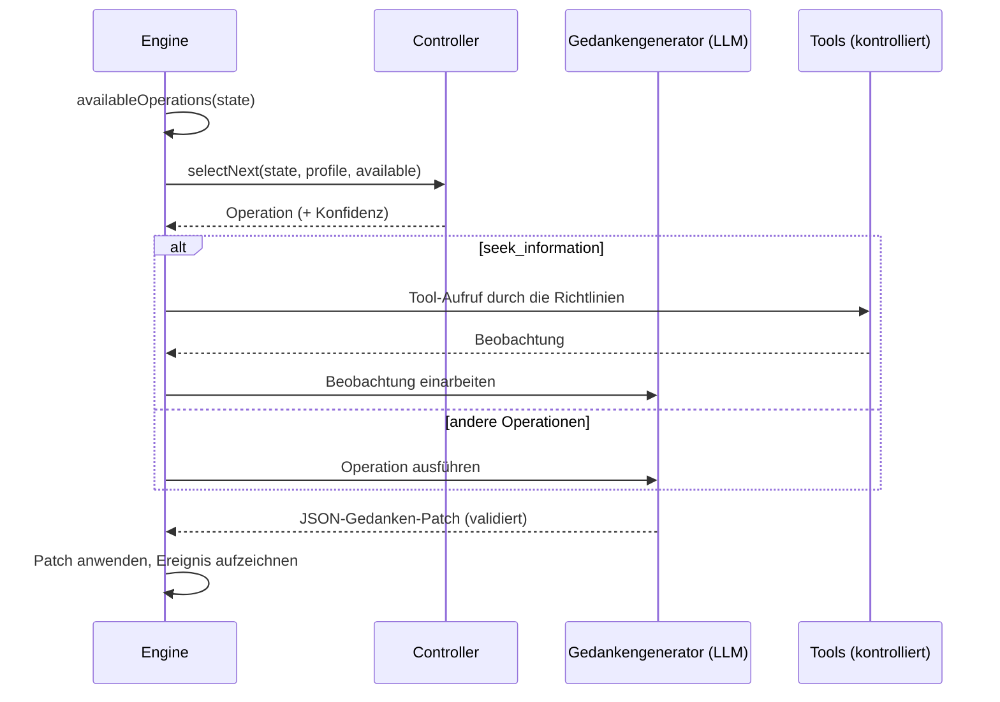

# Kognitive Agenten

Ein kognitiver Agent antwortet nicht in einem Durchgang. Er führt einen **expliziten mentalen Zustand** und verbessert ihn **eine kognitive Operation** nach der anderen, bis er sich auf eine Entscheidung festlegen kann, die er begründen kann.

::: tip In einfachen Worten
Eine übliche KI antwortet in einem Zug, und ihr Denken verschwindet. Ein kognitiver Agent arbeitet wie jemand mit einem Notizbuch: Er schreibt auf, was er weiß, was er annimmt und was er noch nicht weiß, listet mehrere Optionen auf, stellt sich ihre Folgen vor, sucht nach dem, was schiefgehen könnte, prüft Fakten mit den Tools, die Sie erlaubt haben, vergleicht die Optionen und entscheidet erst dann. Jeder dieser Schritte ist eine **Operation**, und jeder wird ins Notizbuch geschrieben, sodass Sie das gesamte Denken hinterher nachlesen können. Wenn er zu keinem belastbaren Schluss kommt, sagt er das. Jeder Begriff auf dieser Seite wird in [Schlüsselbegriffe einfach erklärt](./glossary#how-a-cognitive-agent-reasons) erklärt.
:::

{.illustration style="max-width:460px"}

```ts
const agent = sdk.createCognitiveAgent({
  name: 'analyst',
  model: 'gpt-4o',
  tools: [lookupMetric],
  profile: myProfile, // optional, see Thinker profiles
});

const { status, answer, decision, state, runId } = await agent.think({
  problem: 'Should we build or buy our analytics module?',
  context: { budget: '10k EUR', deadline: 'before Q4' },
  observations: [{ content: 'Churn was 4% last month', originGroup: 'billing' }], // optional
});

decision?.status; // 'committed' | 'provisional' | 'abstain'
```

::: tip Belege zuerst
Wie Beobachtungen nachverfolgt, Vorhersagen getestet und Schlussfolgerungen abgesichert werden, beschreibt [Belege & Verifikation](./evidence-and-verification).
:::

## Der mentale Zustand {#the-mental-state}

Der mentale Zustand besteht aus einfachen, typisierten Daten. Jedes Element erhält eine stabile Kennung, auf die sich das Modell beziehen kann.

| Teil | Kennungen | Was er enthält |
| --- | --- | --- |
| `observations` | `O1…` | Was beobachtet wurde – mit dem Problem übergeben, von einem Tool oder einem Test geliefert – samt Herkunft |
| `facts` | `F1…` | Aussagen mit einer Quelle (`input`, `tool`, `inference`), den Beobachtungen, aus denen sie stammen, und einem Status (`active`, `superseded`, `retracted`) |
| `assumptions` | `A1…` | Was das Denken als gegeben voraussetzt |
| `constraints` | `K1…` | Was jede Antwort einhalten muss |
| `unknowns` | `U1…` | Offene Fragen – `open`, `resolved` oder `dropped`, mit Zählern der Versuche |
| `hypotheses` | `H1…` | Vorschläge, Regeln oder Erklärungen mit Prämissen, Simulationen, Kritiken, einer Evidenzstützung `support`, einer `preferenceFit` und einem Status |
| `comparisons` | `R1…` | Beziehungen zwischen Beobachtungen: Ähnlichkeit, Unterschied, Entwicklung, Unvereinbarkeit, Gegenbeispiel |
| `predictions` | `P1…` | Was eine Hypothese vorhersagt, was sie widerlegen würde, und das Testergebnis |
| `contradictions` | `C1…` | Konflikte zwischen Elementen, mit einer Kategorie, bis sie mit angeführten Belegen aufgelöst sind |
| `failures` | `X1…` | Was bereits gescheitert ist, damit es nicht blind erneut versucht wird |
| `knowledge` | `M1…` | Was frühere Läufe im selben Geltungsbereich mit echten Tests festgestellt haben, abgerufen beim Start des Laufs (siehe [Gedächtnis über Läufe hinweg](./memory)) |
| `confidence`, `evidenceRevision` | | Evidenzstützung der besten Antwort; ein Zähler, durch den ältere Bewertungen veralten |
| `decision`, `trail` | | Die endgültige Entscheidung und ihr Status, eine Zeile pro Schritt |

{.illustration style="max-width:760px"}

Der Zustand wird **nie an Ort und Stelle bearbeitet**. Jede Operation erzeugt einen *Gedanken-Patch*; der Patch wird als Ereignis `cognition.thought` aufgezeichnet; der Zustand ist die Faltung aller Patches. Deshalb kann `sdk.getMentalState(runId)` jeden Lauf exakt rekonstruieren, auch Monate später.

## Die Operationen {#the-operations}

| Operation | Was sie tut | Verfügbar, wenn |
| --- | --- | --- |
| `represent` | Extrahiert Fakten, Annahmen, Randbedingungen und Unbekannte | Immer zuerst; erneut, wenn ein Widerspruch offen ist |
| `compare_observations` | Setzt Beobachtungen in Beziehung: Ähnlichkeiten, Unterschiede, Veränderungen, Gegenbeispiele | Zwei oder mehr vergleichbare Beobachtungen (ohne Duplikate und Testergebnisse), davon neue seit dem letzten Vergleich |
| `hypothesize` | Schlägt neue Vorschläge, Regeln oder Erklärungen vor | Weniger aktive Hypothesen als `maxHypotheses` |
| `simulate` | Leitet Schritt für Schritt Folgen ab und formuliert testbare Vorhersagen | Eine Hypothese hat noch keine Simulation |
| `test_prediction` | Führt Ihren Ergebnis-Evaluator auf einer aufgezeichneten Vorhersage aus – ohne LLM-Aufruf | Ein Evaluator ist konfiguriert, eine Vorhersage steht aus, Testbudget ist übrig |
| `revise` | Macht aus einer Hypothese, der die Belege widersprechen, eine Variante mit eingegrenztem Geltungsbereich | Eine widerlegte oder widersprochene Hypothese hat noch keine Variante |
| `critique` | Findet die stärksten Gründe, warum eine Hypothese scheitern könnte | Eine Hypothese hat noch keine Kritik |
| `seek_information` | Ruft ein kontrolliertes Tool auf, um eine offene Unbekannte zu beantworten | Tools sind vorhanden, eine Unbekannte ist offen, Tool-Budget ist übrig |
| `compare` | Beurteilt die Evidenzstützung und wie gut Vorschläge zum Denker passen | Eine kritisierte Hypothese hat sich geändert, oder die Belege haben sich seit dem letzten Vergleich geändert |
| `decide` | Legt sich auf eine Antwort, Begründung, Konfidenz und nächste Schritte fest | Eine Hypothese besteht die [Abschlussprüfung](./evidence-and-verification#the-conclusion-guard) |

**Der Code entscheidet, was möglich ist, der Controller entscheidet, was sinnvoll ist.** Die Vorbedingungen werden aus dem Zustand berechnet, und der Controller kann nur unter den verfügbaren Operationen wählen.

Regeln, die im Code durchgesetzt werden, egal was das Modell sagt:

- eine `fatal`-Kritik ohne Entgegnung oder eine widerlegte Vorhersage verwirft ihre Hypothese;
- eine verworfene Hypothese kann nicht wiederbelebt, neu formuliert oder ausgewählt werden – nur zu einer Variante überarbeitet, die sagt, was sich geändert hat;
- der Code mischt nie Präferenzen in die Evidenzstützung einer Aussage, und das Modell kann die Konfidenz des Zustands nicht setzen;
- ein Widerspruch wird einmal aufgelöst, und nur unter Angabe der Beobachtungen oder Fakten, die ihn klären;
- ein Schritt, der nichts von dem geändert hat, was er ändern sollte, oder eine aufgeschobene Entscheidung zählt als gescheiterter Versuch; nach zwei in Folge wird die Operation nicht mehr angeboten, bis ein anderer Schritt neue Belege bringt (siehe [Ein Budget, das nicht verschwendet wird](./evidence-and-verification#a-budget-that-is-not-wasted));
- die Herkunft (Beobachtungen, Testergebnisse) und der Entscheidungsstatus werden von der Engine geschrieben: Eine Modellantwort, die sie enthält, wird bereinigt;
- Verweise auf unbekannte Kennungen werden ignoriert und als `issues` im Gedankenereignis gemeldet;
- höchstens `maxHypotheses` Hypothesen sind im Spiel: überzählige Vorschläge werden verworfen und gemeldet;
- eine Unbekannte wird nach zwei erfolglosen Versuchen nicht mehr untersucht, oder sofort nicht mehr, wenn kein verfügbares Tool sie beantworten kann, und eine Neuformulierung (`represent` bei einem Widerspruch) wird höchstens dreimal angeboten;
- eine fehlgeschlagene Operation wird als fehlgeschlagen aufgezeichnet und zählt nicht als erledigt;
- der **letzte Schritt ist immer ein Entscheidungsversuch**: Eine Antwort, die die Abschlussprüfung nicht besteht, wird `provisional` (mit dem, was fehlt) oder eine Enthaltung (`abstain`); kann das Modell überhaupt keine Entscheidung liefern, enthält sich die Engine und zeichnet den Grund auf.

## Controller {#controllers}

Der Controller wählt die nächste Operation.



| Controller | Wie er wählt | Wann Sie ihn verwenden |
| --- | --- | --- |
| `heuristic` | Eine feste Aufmerksamkeitsreihenfolge: darstellen → überarbeiten → Beobachtungen vergleichen → Hypothesen bilden → simulieren → Vorhersagen testen → kritisieren → Informationen suchen → vergleichen → entscheiden | Standard ohne Jev, deterministisch, kostenlos |
| `typed` | Eine Jev-Anfrage pro Schritt: ein Choice über die verfügbaren Operationen und ein Noul „bereit zu entscheiden?“ | Adaptives Denken mit kalibrierter Konfidenz |
| Ihr eigener | `CognitiveController.selectNext()` implementieren | Ein feinabgestimmtes lokales Modell, Geschäftsregeln, … |

Mit `controller: 'auto'` (dem Standard) verwendet der Agent Jev, wenn das SDK ein Backend für typisierte Entscheidungen hat, und andernfalls die Heuristik. Der typisierte Controller **fällt auf die Heuristik zurück**, wenn die Konfidenz des Choice unter `minConfidence` (0,35) liegt, wenn der Client fehlschlägt oder wenn die Antwort keine verfügbare Operation ist. Ein eigener Controller, der eine Ausnahme wirft oder eine nicht verfügbare Operation liefert, wird ebenfalls durch die Heuristik ersetzt. Jeder Rückfall wird im Feld `fallbackFrom` des Auswahlereignisses aufgezeichnet.

```ts
sdk.createCognitiveAgent({
  name: 'analyst',
  model: 'gpt-4o',
  controller: 'typed',
  controllerOptions: { minConfidence: 0.5, readinessThreshold: 0.85 },
  assessment: 'typed', // compare hypotheses with Jev Score questions
});
```

## Tools im Denkprozess {#tools-inside-reasoning}

`seek_information` verwendet die **native Reasoning Engine und Action Engine**: Das LLM wählt ein Tool für die offene Unbekannte, die Action Engine prüft, dass das Tool **diesem Agenten gegeben wurde**, validiert den Aufruf gegen Richtlinien (Laufzeitlimits eingeschlossen, siehe [Limits und Richtlinien](#limits-and-policies)), Freigaben und Budgets, und das Ergebnis wird als **Beobachtung** aufgezeichnet, die auf ihr Ereignis `action.executed` verweist, und dann als Fakten mit `source: "tool"` eingearbeitet. Die Beobachtung bleibt erhalten, auch wenn ihre Interpretation fehlschlägt. Ein abgelehntes, blockiertes oder fehlschlagendes Tool wird zu einem aufgezeichneten Fehlschlag, und das Denken geht weiter.

## Limits {#limits}

```ts
sdk.createCognitiveAgent({
  name: 'analyst',
  model: 'gpt-4o',
  limits: {
    maxSteps: 12,              // the last one always decides
    timeoutMs: 180_000,
    maxHypotheses: 3,          // in play at the same time
    maxToolCalls: 5,
    decisionThreshold: 0.75,   // evidence support a committed answer needs (see minProposalSupport)
    maxConsecutiveFailures: 3, // then the run fails (and alerts you, if incidents are on)
    maxPredictionTests: 4,     // calls to the outcome evaluator per run
    preferenceWeight: 0.4,     // weight of the thinker's preferences when ranking proposals
    minProposalSupport: 0.35,  // evidence support enough for a choice of action the thinker clearly prefers
  },
  evaluator: myBench,          // optional OutcomeEvaluator, enables test_prediction
  knowledge: { store, scope: 'my-domain' }, // optional memory across runs
});
```

Die Limits werden beim Erstellen des Agenten validiert: `maxSteps: 0` oder ein Timeout, das über das hinausgeht, was ein Timer unterstützt, wirft einen `ValidationError`, statt stillschweigend eine Schutzvorkehrung abzuschalten. `minProposalSupport` darf `decisionThreshold` nicht übersteigen; setzen Sie es gleich `decisionThreshold`, damit nur die Belege eine Antwort verbindlich machen können. Wenn Sie `decisionThreshold` senken, ohne `minProposalSupport` zu setzen, sinkt die Untergrenze mit.

### Limits und Richtlinien {#limits-and-policies}

Die Budget- und Timeout-Richtlinien, die für den Agenten gelten – die aus seinen `policies` und die globalen –, werden **vor jedem Schritt** geprüft, vor jedem seiner Modellaufrufe, und erneut vor jedem Tool-Aufruf. Sie sehen den Fortschritt des Laufs: `maxSteps` zählt die bereits erledigten Schritte, `maxTokens` die Tokens der Modellaufrufe des Laufs (Gedanken und ihre Reparaturen, Tool-Auswahl, typisierte Entscheidungen, Antworten, die der Anbieter nicht verwenden konnte), `maxDuration` die Zeit seit dem Start des Laufs. Token- und Kostenbudgets pro Zeitraum (`budgetLimit` mit `maxTokens` oder `maxCost`, ohne `toolName`) werden ebenfalls vor jedem Schritt geprüft, und jeder Modellaufruf, den der Lauf aufzeichnet, zählt darin (siehe [API-Kosten](./costs#budgets)). Ein Schritt wird als Intention vom Typ `continue` geprüft: Eine Richtlinie, deren Bedingungen einen Tool-Aufruf verlangen (`intention.type` gleich `tool_call`), gilt nur für Tool-Aufrufe. Allowlists, eigene Richtlinien (Custom), Aufrufbudgets (`maxToolCalls`) und Freigaben betreffen nur Tool-Aufrufe, ebenso eine Limit-Regel, deren Aktion `require_approval` ist: Ein Schritt wartet nie auf eine Freigabe. Die Prüfung jedes Schritts steht im Audit der Richtlinien (`sdk.getPolicyAuditTrail`), für die Richtlinien, die für einen Schritt gelten können.

Das erste erreichte Limit beendet den Lauf (Limits für Tool-Aufrufe lassen nur Aufrufe aus), und die beiden Arten von Limits beenden ihn nicht auf dieselbe Weise:

| Limit | `limits` des Agenten | Richtlinien |
| --- | --- | --- |
| Schritte | `maxSteps`: Der letzte Schritt entscheidet; `completed`, mit einer Entscheidung `committed`, `provisional` oder `abstain` | `maxSteps`: Der nächste Schritt wird abgelehnt; `failed` |
| Zeit | `timeoutMs`: Der Lauf wird abgebrochen, ein laufender Aufruf erhält das Abbruchsignal; `failed`, `Timeout exceeded (… ms)` | `maxDuration`: geprüft zwischen den Schritten und vor Tool-Aufrufen, ein laufender Aufruf läuft weiter; `failed`, `Timeout (… ms) exceeded` |
| Tokens, Kosten | — | `maxTokens`, Budgets pro Zeitraum: Der nächste Schritt wird abgelehnt; `failed` |
| Tool-Aufrufe | `maxToolCalls`: `seek_information` wird nicht mehr angeboten | Ein abgelehnter Aufruf ist ein aufgezeichneter Fehlschlag, und das Denken geht weiter |

Ein abgelehnter Schritt wird als `policy.violated` aufgezeichnet – mit `intention: { type: 'continue' }`, dem Schritt (`step`), dem Grund (`reason`) und den verletzten Richtlinien (`violatedPolicies`) –, danach `run.failed` mit dem Grund der Richtlinie; das Ergebnis hat `status: 'failed'` und einen `PolicyViolationError` als `error`. Ein Tool-Aufruf, den ein Laufzeitlimit ablehnt, wird als `policy.violated` und als fehlgeschlagene Operation aufgezeichnet; da das Limit weiterhin überschritten ist, wird der nächste Schritt abgelehnt, und der Lauf schlägt fehl. Um mit einer Entscheidung statt mit einer Ablehnung zu enden, setzen Sie das `maxSteps` des Agenten höchstens so hoch wie das der Richtlinie: Sein letzter Schritt entscheidet dann, bevor die Richtlinie etwas ablehnt.

## Ungültige Modellausgabe {#invalid-model-output}

Jede Operation hat einen strikten JSON-Vertrag, der von Zod validiert wird. Eine Antwort, die kein gültiges JSON ist, ihr Pflichtfeld nicht enthält oder einen falschen Wert verwendet, wird **einmal** mit dem Validierungsfehler zurückgeschickt. Felder, die eine Operation nicht schreiben darf (zum Beispiel eine `decision` während `simulate`), werden ignoriert und in `ignoredFields` aufgeführt. Schlägt auch die Reparatur fehl, wird die Operation als Fehlschlag aufgezeichnet, und die Schleife läuft weiter.

## Anhalten, abbrechen, Zeitüberschreitung {#stop-cancel-time-out}

```ts
const pending = agent.think({ problem });
await agent.stop();          // or agent.stop(runId)
const result = await pending; // status: 'cancelled'
```

Eine Zeitüberschreitung ergibt `status: 'failed'` mit `Timeout exceeded (… ms)`, und der Lauf wird im Ereignisprotokoll als fehlgeschlagen markiert. `sdk.stopRun(runId)` hält auch kognitive Läufe an. Das Timeout und das Anhalten werden zwischen den Operationen geprüft und als Abbruchsignal an Ihren Anbieter weitergegeben; die eingebauten Anbieter OpenAI und Anthropic brechen eine bereits laufende Anfrage nicht ab, sodass ein langsamer Aufruf erst mit dem Timeout des Anbieters endet.

Das Profil wird **beim Start eines Laufs als Momentaufnahme festgehalten**: Feedback, das während eines laufenden Laufs gegeben wird, gilt für den nächsten Lauf.

## Sicherheit {#security}

Ein kognitiver Agent liest Text, den er nicht selbst geschrieben hat: Tool-Ergebnisse, Beschreibungen von MCP-Tools, Dokumente im Kontext. Behandeln Sie all das als **nicht vertrauenswürdige Eingabe** – es kann Anweisungen enthalten, die sich an das Modell richten (Prompt Injection). Das SDK begrenzt, was solcher Text erreichen kann:

- der Agent kann nur die Tools aufrufen, die ihm gegeben wurden, und bei jedem Aufruf werden die Richtlinien geprüft – stellen Sie destruktive Tools hinter `require_approval`-Richtlinien;
- das Modell führt nie selbst etwas aus: Es schlägt vor, die Action Engine prüft;
- Invarianten des mentalen Zustands werden im Code durchgesetzt, nicht durch den Prompt;
- jeder Tool-Aufruf und jeder Gedanke steht zur Überprüfung im Ereignisprotokoll.

Das Ereignisprotokoll speichert das Ziel, den Kontext und jeden Gedanken, und die Ereignisse `decision.evaluated` speichern den an Jev gesendeten Kontext. Wenden Sie auf den Ereignisspeicher, den Sie wählen, die Aufbewahrungs- und Schwärzungsregeln an, die Ihre Daten erfordern.

## Replay und Audit {#replay-and-audit}

Ein kognitiver Lauf ist ein normaler Lauf:

- `sdk.getTrace(runId)` zeigt die Ereignisse `cognition.*` neben `policy.checked`, `tool.called`, …
- `sdk.replay(runId)` führt seine Tool-Aufrufe erneut aus, ohne das LLM aufzurufen, und reproduziert die endgültige Antwort – mit derselben Tool-Beschränkung wie der ursprüngliche Lauf, sodass ein Tool, das dem Agenten verweigert wurde, erneut verweigert wird, und mit dem Fortschritt des Laufs bei jedem Aufruf, sodass ein Aufruf, den ein Laufzeitlimit abgelehnt hat, erneut abgelehnt wird;
- `sdk.getMentalState(runId)` rekonstruiert den Zustand;
- `sdk.exportControllerDataset()` macht aus Läufen Trainingsdaten (siehe [Denkerprofile](./thinker-profiles#train-your-own-controller)).
