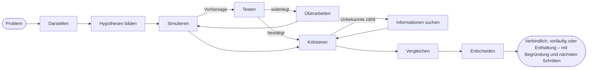

# Einführung

**SDK AI Agents** ist ein TypeScript-SDK, mit dem Sie KI-Agenten bauen, denen Sie in der Produktion vertrauen können: Agenten, die explizit nachdenken, bevor sie handeln, denen man beibringen kann, wie *Sie* denken, und deren jeder Schritt kontrolliert, nachverfolgt, bepreist und wiederholbar ist.

{.illustration style="max-width:460px"}

## Warum noch ein Agenten-SDK? {#why-another-agent-sdk}

LLM-APIs geben Ihnen einen sehr leistungsfähigen Textgenerator. Was sie Ihnen nicht geben, ist Kontrolle darüber, **wie** eine Schlussfolgerung zustande kommt:

- das Denken findet im Modell statt, in einem einzigen Durchgang, und ist verschwunden, sobald die Antwort ausgegeben ist;
- nichts hindert das Modell daran, auf Grundlage einer Vermutung zu handeln, das falsche Tool aufzurufen oder zu viel auszugeben;
- wenn etwas schiefgeht, haben Sie einen Prompt und eine Antwort – aber keine Geschichte.

Dieses SDK legt eine Denkschicht **um** das Modell herum. Das LLM wird zu einer Komponente unter anderen:

| Schicht | Was sie tut | Wo sie liegt |
| --- | --- | --- |
| **Mentaler Zustand** | Fakten, Annahmen, Randbedingungen, Unbekannte, Hypothesen, Widersprüche, Konfidenz | Jederzeit aus Ereignissen rekonstruiert |
| **Controller** | Wählt die nächste kognitive Operation | Deterministische Heuristik, typisierte Entscheidungen mit Jev oder Ihr eigener |
| **Gedankengenerator** | Führt eine Operation aus und liefert einen validierten JSON-Patch | Jeder beliebige LLM-Anbieter |
| **Denkerprofil** | Die Aufmerksamkeitsreihenfolge, Prioritäten und Heuristiken einer Person | Versionierte Daten, verfeinert durch Feedback |
| **Governance** | Richtlinien, Allowlists, Budgets, Freigaben, Wiederholungsversuche | Vor jeder Aktion geprüft |
| **Ereignisspeicher** | Die einzige Quelle der Wahrheit | Datei, SQLite oder PostgreSQL |

## Zwei Arten von Agenten {#two-kinds-of-agents}

**Kontrollierte Agenten** (`sdk.createAgent`) führen die klassische Tool-Calling-Schleife aus – das LLM schlägt eine Intention vor, die Action Engine prüft und führt sie aus. Sie eignen sich ideal für klar umrissene Aufgaben.

**Kognitive Agenten** (`sdk.createCognitiveAgent`) denken explizit nach. Sie sind für Entscheidungen gemacht: eine Architektur wählen, einen Incident einordnen, eine Gelegenheit bewerten, Fragen der Art „Sollten wir …?“ beantworten.

Beide Arten teilen dieselben Tools, Richtlinien, denselben Ereignisspeicher, Replay, dieselben Kosten und Incident-Benachrichtigungen.

## Kann es wie eine bestimmte Person denken? {#can-it-reason-like-a-given-person}

**Ja.** Ein kognitiver Agent kann nachahmen, wie eine bestimmte Person denkt. Sie erklären einige Themen in Ihren eigenen Worten; das SDK extrahiert daraus ein **Denkerprofil**: die Reihenfolge, in der Sie ein Problem betrachten, Ihre Prioritäten, Ihre Reflexe, was Sie eine Idee verwerfen lässt, Ihre Risikobereitschaft. Dieses Profil wird in die Anweisungen jedes Schritts seines Denkens geschrieben. Nach jedem Lauf sagen Sie, wie weit Sie zustimmen (zum Beispiel „zu 60 % richtig, hier liegt der Fehler“), und die Lektion wird für die nächsten Läufe aufbewahrt.

Was es nachahmt, ist eine **Denkweise**: Es weiß nicht, was Sie nie aufgeschrieben haben, es entscheidet nicht an Ihrer Stelle, und Ihre Präferenzen machen eine Aussage über die Welt nie glaubwürdiger. Das SDK bewertet sich nicht selbst: Der Prozentsatz an Zustimmung, den Sie Lauf für Lauf auf Problemen vergeben, die es nie gesehen hat, zeigt Ihnen, wie nah es herankommt. [Wie eine bestimmte Person denken](./thinker-profiles) erklärt jeden Schritt.

## Was Sie bekommen {#what-you-get}

- **Explizites Schlussfolgern** – zehn Operationen auf einem mentalen Zustand, mit Invarianten, die im Code durchgesetzt werden (eine verworfene Hypothese kann nicht ausgewählt werden, eine fatale Kritik verwirft eine Hypothese, der letzte Schritt schließt immer ab).
- **Belege, die Sie prüfen können** – Beobachtungen mit Herkunft, Vorhersagen, die Ihr eigener Evaluator testet, widerlegte Regeln, die zu Varianten mit engerem Geltungsbereich überarbeitet werden, Präferenzen getrennt von den Belegen, und eine Abschlussprüfung, die mit `committed`, `provisional` oder `abstain` antwortet; mit einem Wissensspeicher wird das, was die Tests ergeben haben, für die nächsten Läufe gespeichert.
- **Denken wie eine bestimmte Person**: Destillieren Sie ein Denkerprofil aus Themen, die Sie in Ihren eigenen Worten erklärt haben, und korrigieren Sie den Agenten dann mit den Urteilen `match`, `partial` oder `mismatch` und einem Prozentsatz an Zustimmung.
- **Typisierte Entscheidungen** – [TypeSafe Jev](https://docs.typesafe.ai) oder jedes kompatible Backend beantwortet Noul-, Choice- und Score-Fragen mit kalibrierten Wahrscheinlichkeiten.
- **MCP-Konnektoren** – stellen Sie Ihre Tools als MCP-Server bereit, importieren Sie jeden beliebigen MCP-Server als kontrollierte Tools.
- **Betrieb eingebaut** – API-Kosten pro Lauf, Wiederholungsrichtlinien, die sich nicht stapeln, Incident-Benachrichtigungen per E-Mail oder Webhook.
- **Natives Event Sourcing** – Replay ohne das LLM, Golden Traces, Erkennung von Regressionen, Denkgraphen.

Wie schneidet es im Vergleich zu anderen Frameworks ab? Siehe [Warum dieses SDK](./why). Neu bei diesen Begriffen? [Schlüsselbegriffe einfach erklärt](./glossary) erklärt jeden einzelnen. Bereit? Weiter geht es mit dem [Schnellstart](./getting-started).
