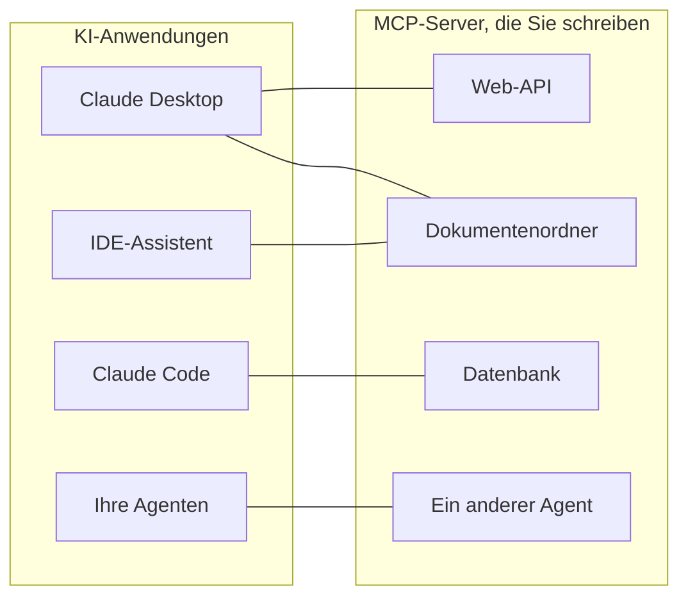
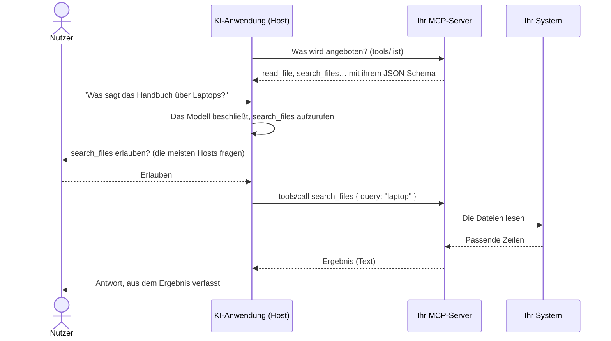
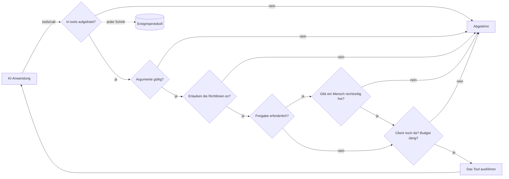

# MCP einfach erklärt

**Mit MCP kann eine KI-Anwendung – Claude Desktop, Claude Code, ein IDE-Assistent, Ihr eigener Agent – Ihre Systeme nutzen: eine API, einen Dokumentenordner, eine Datenbank, einen anderen Agenten.** Diese Seite erklärt die Idee und die Begriffe. Die nächsten Seiten führen von null zu einem funktionierenden Server:

1. [Ihr erster MCP-Server in 5 Minuten](./mcp-first-server) – Schritt für Schritt, von einem leeren Ordner bis zu Claude Desktop.
2. [Ein MCP-Server für alles](./mcp-recipes) – eine Zeile für eine Funktion, eine Web-API, einen Ordner, eine Datenbank oder einen Agenten.
3. [Bereitstellen, absichern und Fehler beheben](./mcp-deploy) – Bereitstellung über HTTP, Authentifizierung, Freigaben und was zu tun ist, wenn es nicht funktioniert.

## Die Idee: ein Stecker für jede KI-Anwendung {#the-idea-one-plug-for-every-ai-app}

Stellen Sie sich MCP (Model Context Protocol) als **USB-C für KI-Anwendungen** vor. Vor USB hatte jedes Gerät sein eigenes Kabel. Vor MCP brauchte jede KI-Anwendung für jedes System, mit dem sie sprach, ihren eigenen Verbindungscode: eine Integration für Claude, eine weitere für Ihre IDE, noch eine für Ihren Agenten.

Mit MCP schreiben Sie **ein kleines Programm – einen MCP-Server – vor Ihrem System**. Jede Anwendung, die MCP spricht, kann sich dann damit verbinden, auflisten, was er anbietet, und ihn nutzen. Sie bauen den Server einmal; er funktioniert überall.



Das Protokoll ist ein offener Standard, veröffentlicht unter [modelcontextprotocol.io](https://modelcontextprotocol.io). Anthropic hat es ins Leben gerufen; viele KI-Anwendungen unterstützen es.

## Die Begriffe, einer nach dem anderen {#the-words-one-by-one}

| Begriff | Einfach erklärt | Beispiel |
| --- | --- | --- |
| **Host** (die KI-Anwendung) | Die Anwendung, mit der der Nutzer spricht. Sie führt das Sprachmodell aus und entscheidet, wann Ihr Server verwendet wird. | Claude Desktop, Claude Code, VS Code |
| **MCP-Client** | Der Teil des Hosts, der die Verbindung zu einem Server hält. Sie sehen ihn selten. | Einer pro Server in Claude Desktop |
| **MCP-Server** | Ihr kleines Programm. Es sagt, was es anbietet, und erledigt die Arbeit, wenn es darum gebeten wird. | `serveMcpOverStdio(sdk, { … })` |
| **Tool** | Eine Aktion, die das Modell aufzurufen beschließen kann, mit benannten Argumenten. Das Modell liest Name, Beschreibung und Argumentliste, um zu entscheiden. | `read_file`, `list_pets`, `query` |
| **Ressource** | Ein Dokument, das der Server zum Lesen anbietet. Anders als bei einem Tool wählt es der **Nutzer oder die Anwendung** aus (zum Beispiel mit einer Schaltfläche zum Anhängen), nicht das Modell. | `folder://handbook/onboarding.md` |
| **Prompt** | Eine fertige Nachrichtenvorlage, die ein Server anbietet. Von diesem SDK noch nicht bereitgestellt. | — |
| **Transport** | Wie Nachrichten zwischen Host und Server übertragen werden. | stdio, Streamable HTTP |
| **stdio** | Der Host **startet Ihren Server als Programm** auf demselben Rechner und kommuniziert über dessen Standardein- und -ausgabe – als würde man etwas eintippen und lesen, was das Programm ausgibt. Nichts ist im Netzwerk geöffnet. | Lokale Server in Claude Desktop |
| **Streamable HTTP** | Ihr Server ist ein **Webdienst**; Hosts senden ihm HTTP-Anfragen. Damit teilen Sie einen Server mit einem Team. | `https://mcp.example.com/mcp` |
| **JSON Schema** | Die Beschreibung der Argumente eines Tools (Namen, Typen, welche erforderlich sind), die das Modell liest. Das SDK schreibt sie für Sie. | `{ "type": "object", "properties": { "path": { "type": "string" } } }` |
| **Annotation** | Ein Hinweis zu einem Tool, der Hosts angezeigt wird, etwa „dieses Tool liest nur“. Hosts können damit entscheiden, wann sie den Nutzer um Bestätigung bitten. | `readOnlyHint: true` |

::: tip Tools versus Ressourcen
Ein **Tool** ist etwas, das das Modell *tut* („durchsuche das Handbuch nach ‚Laptop‘“). Eine **Ressource** ist etwas, das der Nutzer *übergibt* („hänge onboarding.md an diese Unterhaltung an“). Das Rezept für Ordner bietet beides an, aus demselben Ordner.
:::

## Was bei einem Aufruf passiert {#what-happens-during-one-call}



Zwei Dinge, die Sie sich merken sollten:

- **Das Modell sieht nur, was der Server auflistet**: Namen, Beschreibungen, Argumentschemas und die Ergebnisse, die es zurückbekommt. Schreiben Sie klare Beschreibungen; schreiben Sie nie Geheimnisse hinein.
- **Der Server entscheidet, was wirklich passiert.** Das Modell schlägt einen Aufruf vor; Ihr Server kann ihn ablehnen, begrenzen, einen Menschen fragen oder protokollieren. Genau hier kommt dieses SDK ins Spiel.

## Was dieses SDK hinzufügt {#what-this-sdk-adds}

Sie können MCP-Server allein mit dem offiziellen MCP-SDK schreiben. Dieses SDK setzt darauf auf und fügt hinzu, was Sie brauchen, um einen Server **sicher und mit einer Zeile** zu betreiben:

| | Nur mit dem offiziellen MCP-SDK | Mit SDK AI Agents |
| --- | --- | --- |
| Eine Web-API bereitstellen | Einen Handler pro Endpunkt schreiben | `openApiTools({ spec })` – ein Tool pro Operation, standardmäßig schreibgeschützt |
| Einen Ordner bereitstellen | Pfadprüfungen selbst schreiben | `folderTools({ root })` – symbolische Links und `..` können den Ordner nicht verlassen |
| Eine Datenbank bereitstellen | Die SQL-Absicherung selbst schreiben | `databaseTools({ database })` – ein einzelnes SELECT, schreibgeschützt auf Datenbankebene (eine schreibgeschützte Transaktion bei PostgreSQL, `query_only` bei SQLite), mit Zeilenlimit |
| Einen Agenten bereitstellen | — | `cognitiveAgentTool(agent)` – „Was würde Nicolas denken?“ als ein Tool |
| Nichts versehentlich bereitgestellt | Ihnen überlassen | Nur die Tools, die Sie in `tools` auflisten |
| Regeln vor jedem Aufruf | Ihnen überlassen | [Richtlinien](./governed-agents), Budgets, Allowlists |
| Ein Mensch stimmt zuerst zu | Ihnen überlassen | Mit `requiresApproval` markierte Tools warten auf `sdk.approveAction()`; die Freigabe wird abgebrochen, wenn der Client abbricht oder die Verbindung trennt, und nach `approvalTimeoutMs` (standardmäßig 50 s) |
| Wissen, was passiert ist | Ihnen überlassen | Jeder Aufruf und jedes Lesen einer Ressource ist ein Lauf im [Ereignisprotokoll](./observability) |



In dieser Reihenfolge: Ein Aufruf mit ungültigen Argumenten wird abgelehnt, bevor jemand gebeten wird, ihn freizugeben, und ein Aufruf wird beim Start auf sein Budget angerechnet, unabhängig von seinem Ausgang.

Jeder über MCP ausgeführte Aufruf wird als eigener Lauf aufgezeichnet, mit der Identität `mcp:<server name>`: Sie können ihn lesen, seine Kosten ermitteln und darauf Benachrichtigungen einrichten, genau wie bei einem Agentenlauf.

## Beide Richtungen {#both-directions}

Das SDK spricht MCP in beide Richtungen:

- **Bereitstellen**: Machen Sie aus Ihren Tools, APIs, Ordnern, Datenbanken und Agenten MCP-Server – die nächsten Seiten.
- **Nutzen**: Geben Sie Ihren eigenen Agenten die Tools eines beliebigen bestehenden MCP-Servers – siehe unten.

### Die Tools eines MCP-Servers in Ihren Agenten nutzen {#use-the-tools-of-an-mcp-server-in-your-agents}

```ts
import { connectMcpServer } from '@sdk-ai-agents/core/mcp';

const crm = await connectMcpServer({
  name: 'crm',
  transport: { type: 'http', url: 'https://mcp.acme.internal/crm', headers: { Authorization: `Bearer ${token}` } },
  toolPrefix: 'crm_',                         // avoid collisions between servers
  include: ['lookup_customer', 'list_invoices'],
  metadata: { riskLevel: 'medium' },          // governance metadata for every tool
  retry: { maxRetries: 2 },
});

const tools = crm.tools.map((definition) => sdk.defineTool(definition));
const agent = sdk.createCognitiveAgent({ name: 'account-manager', model: 'gpt-4o', tools });

await agent.think({ problem: 'Should we offer customer c-42 a discount?' });
await crm.close();
```

| `transport.type` | Verwenden Sie ihn für |
| --- | --- |
| `stdio` | Lokale Server, die als Prozess gestartet werden (`command`, `args`, `env`, `cwd`) |
| `http` | Entfernte Server über Streamable HTTP (`url`, `headers`) |
| `custom` | Jeden Transport, den Sie selbst bauen (WebSocket, im Speicher für Tests…) |

Importierte Tools behalten das JSON Schema des Servers, sodass das Modell die tatsächlichen Argumente sieht. Einmal mit `sdk.defineTool` definiert, verhalten sie sich genau wie lokale Tools: Allowlists, Richtlinien, Freigaben (`metadata: { requiresApproval: true }` lässt jeden Aufruf auf einen Menschen warten), Budgets, Wiederholungsversuche und Traces gelten für jeden Aufruf. Schlägt das Auflisten der Tools fehl, wird die Verbindung (und der stdio-Prozess) geschlossen, bevor der Fehler geworfen wird.

::: warning Verbinden Sie nur Server, denen Sie vertrauen
Beschreibungen und Ergebnisse importierter Tools erreichen das Modell Wort für Wort: Ein bösartiger Server kann Anweisungen hineinschreiben. Verbinden Sie Server, denen Sie vertrauen, geben Sie jedem Agenten nur die Tools, die er braucht, und schützen Sie destruktive Tools mit Freigaben.
:::

## Gut zu wissen {#good-to-know}

- Die MCP-Unterstützung liegt in einem separaten Einstiegspunkt, `@sdk-ai-agents/core/mcp`, sodass das Kernpaket `@modelcontextprotocol/sdk` nur benötigt, wenn Sie es verwenden. Die Tool-Quellen (`openApiTools`, `folderTools`, `databaseTools`, `cognitiveAgentTool`…) befinden sich im Kernpaket: Ihre Agenten können sie ohne MCP verwenden.
- Der Server baut auf dem offiziellen MCP-TypeScript-SDK 1.30 auf, das die Protokollrevisionen 2024-10-07, 2024-11-05, 2025-03-26, 2025-06-18 und 2025-11-25 akzeptiert (seine `SUPPORTED_PROTOCOL_VERSIONS`, geprüft am 24.09.2026). Die MCP-Website dokumentiert außerdem eine Revision 2026-07-28 ([Architektur](https://modelcontextprotocol.io/docs/learn/architecture), geprüft am 24.09.2026), die dieses SDK noch nicht spricht.
- Dieses SDK stellt **Tools** und **Ressourcen** bereit. Prompts, Sampling und Elicitation werden nicht angeboten.

Weiter: [Bauen Sie Ihren ersten Server](./mcp-first-server).
