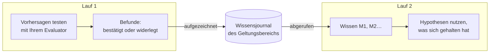

# Gedächtnis über Läufe hinweg

::: tip In einfachen Worten
Denken Sie an ein Laborbuch, das alle teilen, die am selben Prüfstand arbeiten. Jedes Mal, wenn ein Experiment eine Regel bestätigt oder widerlegt, wird es eingetragen, mit dem, was erwartet und was gesehen wurde. Die nächste Person liest das Buch, bevor sie anfängt: Sie nutzt, was sich gehalten hat, und versucht nicht noch einmal unverändert, was bereits gescheitert ist.

Ein kognitiver Agent kann ein solches Buch führen. Er trägt nur ein, **was ein echter Test ergeben hat**, nie das, was das Modell oder der Denker bloß geglaubt hat.
:::

## Was es tut {#what-it-does}



1. **Am Ende eines Laufs** wird jede Regel oder Erklärung mit mindestens einer Vorhersage, die Ihr [Ergebnis-Evaluator](./evidence-and-verification#predictions-and-the-outcome-evaluator) bestätigt oder widerlegt hat, zu einem **Befund**: die Aussage, ihr Geltungsbereich, die Regel, die sie innerhalb des Laufs überarbeitet, und jeder Test (was erwartet wurde, was beobachtet wurde, welcher Evaluator). Die Befunde werden an das **Journal** des Geltungsbereichs angehängt.
2. **Zu Beginn des nächsten Laufs** im selben Geltungsbereich werden die relevantesten Einträge **abgerufen** und als `knowledge` mit den Kennungen `M1`, `M2`… in den mentalen Zustand gelegt.
3. **Während des Laufs**:
   - sieht das Modell jeden Eintrag mit seinem Status und seinen letzten Tests und wird angewiesen, eine verifizierte Regel innerhalb ihres Geltungsbereichs wiederzuverwenden und sie anzuführen;
   - wird eine Hypothese, die einen **widerlegten** Eintrag wortgleich wiederholt (gleiche Art, gleiche Aussage und gleicher Geltungsbereich, abgesehen von Groß-/Kleinschreibung und Satzzeichen), von der Engine abgelehnt; das Modell wird angewiesen, stattdessen eine Variante vorzuschlagen, die die `M`-Kennung des Eintrags in ihren Prämissen anführt und die Widerlegung erklärt, aber jeder andere Wortlaut oder Geltungsbereich wird als neue Hypothese akzeptiert;
   - wird eine Hypothese, die einen **verifizierten** oder **umstrittenen** Eintrag wiederholt, automatisch damit verknüpft (seine `M`-Kennung wird den Prämissen hinzugefügt), sodass der Vergleichsschritt die früheren Tests sieht.

## Einschalten {#turn-it-on}

```ts
import { FileKnowledgeStore } from '@sdk-ai-agents/core';

const physicist = sdk.createCognitiveAgent({
  name: 'physicist',
  model: 'gpt-4o',
  evaluator: bench,   // without an evaluator, nothing is tested, so nothing is remembered
  knowledge: {
    store: new FileKnowledgeStore('./knowledge'),
    scope: 'inclined-plane',
  },
});

const first = await physicist.think({ problem: 'Does the rolling time depend on the ball?', observations });
const second = await physicist.think({ problem: 'Will a 250 g glass ball take as long as a steel one?' });

second.state.knowledge;
// [{ id: 'M1', status: 'refuted',  statement: 'Rolling time on this plane does not depend on the ball', … },
//  { id: 'M2', status: 'verified', statement: 'For rigid balls, rolling time on this plane does not depend on mass', … }]
```

| Option | Standard | Bedeutung |
| --- | --- | --- |
| `store` | (erforderlich) | Wo das Journal aufbewahrt wird: `FileKnowledgeStore`, `InMemoryKnowledgeStore` oder Ihr eigener |
| `scope` | (erforderlich) | Worum es beim Wissen geht. Läufe teilen, was sie gelernt haben, nur innerhalb eines Geltungsbereichs. Kleinbuchstaben, Ziffern, `.`, `-`, `_`: Zwei Geltungsbereiche, die sich nur in der Groß-/Kleinschreibung unterscheiden, würden sich unter macOS und Windows eine Datei teilen |
| `recallLimit` | `10` | Einträge, die zu Beginn eines Laufs abgerufen werden, von 0 bis 50. `0` zeichnet auf, ohne abzurufen |
| `record` | `true` | Ob Läufe aufzeichnen, was ihre Tests festgestellt haben |

`examples/rule-discovery.ts` verwendet es: Führen Sie es zweimal aus, und der zweite Lauf beginnt mit dem, was der erste festgestellt hat.

## Was gespeichert wird und was nie {#what-is-remembered-and-what-never-is}

| Gespeichert | Nie gespeichert |
| --- | --- |
| Regeln und Erklärungen mit einer Vorhersage, die Ihr Evaluator **bestätigt** oder **widerlegt** hat | Handlungswahlen (Vorschläge): Sie hängen davon ab, wer entscheidet und wann |
| Was erwartet wurde, was beobachtet wurde, welcher Evaluator in welcher Version | Vorhersagen, die nie getestet wurden oder deren Test **nicht eindeutig** war |
| Die Regel, die eine Variante überarbeitet, und was sich geändert hat | Was das Modell geglaubt hat, die Stützung, die es vergeben hat, die Präferenzen des Denkers |
| Welche Läufe den Eintrag aufgezeichnet haben | Die endgültige Antwort des Laufs |

Ein Lauf, der fehlschlägt oder angehalten wird, zeichnet trotzdem die Tests auf, die er durchgeführt hat: Eine Messung bleibt gültig, was auch immer danach geschah.

## Status {#statuses}

| Status | Wann | Was dem Modell gesagt wird |
| --- | --- | --- |
| `verified` | Bisher nur Bestätigungen | Innerhalb des Geltungsbereichs wiederverwenden und anführen; außerhalb davon ist es eine Hypothese, die erneut getestet werden muss |
| `refuted` | Bisher nur Widerlegungen | Nie wieder unverändert vorschlagen; eine Variante führt die `M`-Kennung in ihren Prämissen an und sagt, worin sie sich unterscheidet |
| `contested` | Sowohl Bestätigungen als auch Widerlegungen | Es gilt nur unter bestimmten Bedingungen: herausfinden, unter welchen |

Dieselbe Aussage im selben Geltungsbereich ist derselbe Eintrag, unabhängig von Groß-/Kleinschreibung oder Satzzeichen. Tests werden nach Lauf und Vorhersage dedupliziert: Denselben Lauf zweimal aufzuzeichnen fügt nichts hinzu.

## Welche Einträge abgerufen werden {#which-items-are-recalled}

Die Einträge des Geltungsbereichs werden deterministisch eingeordnet:

1. die meisten Wörter, die sie mit dem Problem gemeinsam haben (Wörter mit vier oder mehr Buchstaben, in der Aussage und im Geltungsbereich);
2. dann die am häufigsten getesteten;
3. dann die jüngsten.

Die ersten `recallLimit` Einträge werden abgerufen. Das ist einfacher Wortabgleich, keine semantische Suche: Eine Regel, die ganz anders formuliert ist als das Problem, wird womöglich nicht zuerst abgerufen. Halten Sie Geltungsbereiche eng (ein Prüfstand, ein Produkt, ein Fachgebiet), damit alles in einem Geltungsbereich relevant ist.

## Geltungsbereiche {#scopes}

Ein Geltungsbereich ist eine Grenze, kein Ordnername der Ordnung halber:

- Läufe **teilen**, was sie gelernt haben, nur innerhalb eines Geltungsbereichs;
- verwenden Sie einen Geltungsbereich pro Prüfstand, Produkt, Datensatz oder Fachgebiet, deren Regeln füreinander gelten: `inclined-plane`, `checkout-latency`, `churn-model-v3`;
- mischen Sie nie Kunden oder Mandanten in einem Geltungsbereich, wenn deren Daten getrennt bleiben müssen.

## Speicher {#stores}

| Speicher | Verwenden Sie ihn für |
| --- | --- |
| `FileKnowledgeStore(directory)` | Eine Datei pro Geltungsbereich, `<directory>/<scope>.jsonl`, eine Zeile pro Lauf. Zeilen werden nur angehängt, sodass die Datei zugleich eine lesbare Historie ist. Schreibvorgänge über eine Instanz von `FileKnowledgeStore` werden serialisiert: Teilen Sie eine Instanz zwischen den Agenten eines Prozesses |
| `InMemoryKnowledgeStore()` | Tests, Prototypen, kurzlebige Prozesse |
| Ihr eigener `KnowledgeStore` | Eine Datenbank, die sich mehrere Prozesse teilen |

Mehrere Instanzen oder Prozesse, die gleichzeitig in denselben Geltungsbereich schreiben, sollten eine Datenbank verwenden: Implementieren Sie die drei Methoden des Ports. Eine Zeile, die durch einen unterbrochenen Schreibvorgang unvollständig geblieben ist, wird beim Lesen mit einer Warnung übersprungen, und der nächste Eintrag beginnt in einer neuen Zeile; eine Zeile, die gültiges JSON, aber kein gültiger Eintrag ist, bricht das Lesen unter Angabe ihrer Zeilennummer ab, da die Datei verändert wurde.

```ts
import type { KnowledgeStore } from '@sdk-ai-agents/core';

const store: KnowledgeStore = {
  async recall({ scope, goal, limit }) { /* the most relevant items of the scope */ },
  async record({ scope, runId, recordedAt, findings }) { /* append one entry */ },
  async list(scope) { /* every item of the scope */ },
};
```

`projectKnowledge(entries)` faltet Journaleinträge zu Einträgen des Wissens und `rankKnowledge(items, goal, limit)` ordnet sie ein, sodass ein eigener Speicher nur die Einträge aufbewahren muss (zum Beispiel eine Zeile pro Lauf) und beide wiederverwenden kann.

Prüfen Sie jederzeit, was ein Geltungsbereich weiß:

```ts
for (const item of await store.list('inclined-plane')) {
  console.log(item.status, item.confirmations, item.refutations, item.statement);
}
```

## Audit und Replay {#audit-and-replay}

- Die abgerufenen Einträge werden in `cognition.started` aufgezeichnet (`knowledge.scope`, `knowledge.items`), sodass `sdk.getMentalState(runId)` genau rekonstruiert, was der Lauf wusste, ohne den Speicher erneut zu lesen, auch wenn sich der Speicher inzwischen geändert hat.
- Die Befunde werden in einem Ereignis `cognition.knowledge_recorded` aufgezeichnet (`scope`, `findings`).
- Ein fehlschlagender Speicher hält nie einen Lauf an: Ein fehlgeschlagener Abruf wird als `knowledge.error` in `cognition.started` aufgezeichnet, und der Lauf geht ohne Gedächtnis weiter; eine fehlgeschlagene Aufzeichnung wird als `error` in `cognition.knowledge_recorded` aufgezeichnet. Ein Speicher, der nicht innerhalb von `limits.timeoutMs` des Laufs antwortet, wird als fehlgeschlagen behandelt (ein langsamer Schreibvorgang kann danach trotzdem noch abgeschlossen werden). Kann das Ereignisprotokoll selbst die Befunde nicht aufzeichnen, wird eine Warnung ausgegeben und das Ergebnis des Laufs unverändert zurückgegeben.

## Limits {#limits}

- **Wortabgleich.** Der Abruf ist nicht semantisch; verwandte Regeln mit anderem Wortlaut können übersehen werden.
- **Nur exakte Wiederholungen.** Abgelehnt wird nur die Wiederholung einer widerlegten Regel mit gleicher Art, gleichem Wortlaut (abgesehen von Groß-/Kleinschreibung und Satzzeichen) und gleichem Geltungsbereich; eine umformulierte wird als neue Hypothese akzeptiert.
- **Ein Test genügt für `verified`.** Ein Eintrag ist verifiziert, sobald eine Vorhersage bestätigt und keine widerlegt wurde, und das Modell wählt, welche Vorhersage eine Regel testet: Auch eine schwache Vorhersage zählt als Bestätigung.
- **Der Geltungsbereich wird angegeben, nicht geprüft.** Eine für „starre Kugeln“ verifizierte Regel wird mit diesem Geltungsbereich angezeigt, und das Modell wird angewiesen, sie ohne neuen Test nicht anderswo anzuwenden; nichts prüft das im Code.
- **Dem Evaluator wird vertraut.** Das Gedächtnis ist so zuverlässig wie Ihr Evaluator: Eine falsche Messung wird als Test gespeichert.
- **Ein Schreiber pro Datei.** `FileKnowledgeStore` serialisiert nur die Schreibvorgänge einer Instanz; zwei Instanzen oder zwei Prozesse, die in denselben Geltungsbereich schreiben, werden nicht koordiniert.
