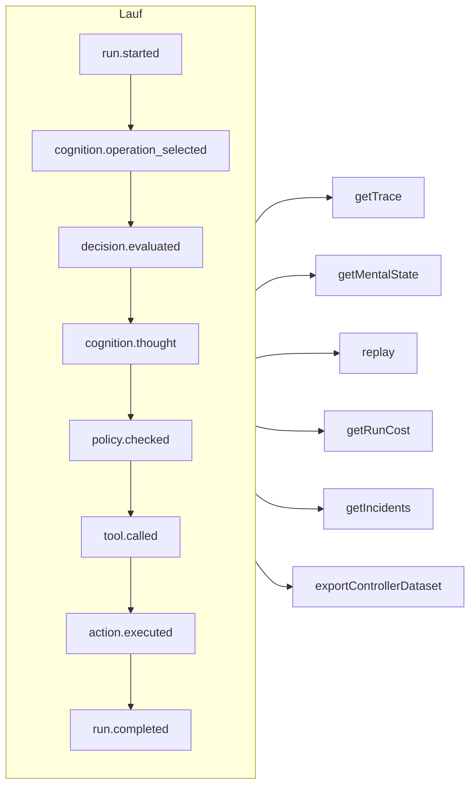

# Nachvollziehbarkeit & Replay

Jeder Lauf – ob kontrolliert, kognitiv, eine direkte typisierte Entscheidung oder ein MCP-Tool-Aufruf – ist ein **Ereignisprotokoll, an das nur angehängt wird**. Nichts geschieht außerhalb des Protokolls, und alles andere wird daraus abgeleitet.



## Speicher {#stores}

| Speicher | Verwenden Sie ihn für |
| --- | --- |
| `FileEventStore` (Standard) | Entwicklung, ein einzelner Prozess – eine JSON-Datei pro Lauf |
| `SQLiteEventStore` | Lokale Persistenz mit Abfragen |
| `PostgreSQLEventStore` | Produktion: indizierte Abfragen, Aggregation, Sicherung und Wiederherstellung |

::: code-group

```ts [File]
import { createSDK, FileEventStore } from '@sdk-ai-agents/core';

const sdk = createSDK({ apiKey, eventStore: new FileEventStore('./events') });
```

```ts [SQLite]
import Database from 'better-sqlite3';
import { createSDK, SQLiteEventStore } from '@sdk-ai-agents/core';

const sdk = createSDK({ apiKey, eventStore: new SQLiteEventStore({ db: new Database('events.db') }) });
```

```ts [PostgreSQL]
import pg from 'pg';
import { createSDK, PostgreSQLEventStore } from '@sdk-ai-agents/core';

const pool = new pg.Pool({ connectionString: process.env.DATABASE_URL });
const sdk = createSDK({ apiKey, eventStore: new PostgreSQLEventStore({ pool }) });
```

:::

Speicher implementieren `IEventStore`; schreiben Sie Ihren eigenen, um jede beliebige Datenbank anzusprechen. Der Dateispeicher puffert Ereignisse und schreibt sie alle 100 ms weg; rufen Sie beim Herunterfahren `await store.destroy()` auf, um noch Ausstehendes zu schreiben. Leser des Protokolls (Rekonstruktion des mentalen Zustands, Kosten, Datensätze) ignorieren Ereignisse, die mit derselben Kennung wiederholt werden.

## Einen Lauf lesen {#read-a-run}

```ts
const trace = await sdk.getTrace(runId);          // status, timeline, summary
const text = await sdk.exportTrace(runId, 'text'); // human-readable timeline
const events = await sdk.getEvents(runId, { type: ['tool.called', 'policy.violated'] });
const state = await sdk.getMentalState(runId);    // cognitive runs
```

Der Status eines Laufs ist das **letzte Lebenszyklusereignis** (`run.completed`, `run.failed`, `run.cancelled`). Danach angehängte Ereignisse – Feedback, Incident-Meldungen – öffnen ihn nie wieder.

## Replay ohne das LLM {#replay-without-the-llm}

```ts
const replay = await sdk.replay(runId);
```

Replay führt die aufgezeichneten Intentionen erneut durch die Action Engine aus – Richtlinien eingeschlossen –, **ohne das LLM aufzurufen**. Spielen Sie mit Änderungen erneut ab, um „Was wäre, wenn?“-Szenarien zu testen, zum Beispiel nach einer Richtlinienänderung.

Ein Replay führt die Tools erneut aus, und zwar tatsächlich. Bei Tools, die mit `requiresApproval` markiert sind, wiederholt ein Replay nur die Aufrufe, die im ursprünglichen Lauf von einem Menschen **freigegeben** wurden – dasselbe Tool mit denselben Parametern –, ohne erneut nachzufragen; ein Aufruf, der abgelehnt, abgebrochen oder nie freigegeben wurde, wird verweigert, nicht ausgeführt. Freigaben, die eine *Richtlinie* verlangt, gelten weiterhin und warten auf eine Entscheidung.

## Entscheidungen verstehen {#understand-decisions}

| Methode | Was Sie erhalten |
| --- | --- |
| `getReasoningGraph(runId)` / `exportReasoningGraph(runId, 'graphviz')` | Die Kette Intention → Richtlinie → Aktion als Graph |
| `getAlternatives(runId)` | Alternativen, die der Agent in Betracht gezogen hat |
| `getDecisionPatterns(filters)` | Wiederkehrende Entscheidungsmuster über Läufe hinweg |
| `getTraceVisualization(runId)` | Gruppierte Struktur, bereit für eine Zeitleiste in einer Benutzeroberfläche |
| `getPolicyAuditTrail(runId)` | Jede Auswertung einer Richtlinie und ihr Ergebnis |

## Agenten wie Code testen {#test-agents-like-code}

Machen Sie aus einem guten Lauf einen **Golden Trace** und validieren Sie dann neue Läufe dagegen:

```ts
const golden = await sdk.createGoldenTrace(runId, { name: 'refund flow', description: 'Expected behavior' });
const validation = await sdk.validateAgainstGoldenTrace(newRunId, golden.id);
const regressions = await sdk.detectRegressions(newRunId, golden.id);
```

Regressionssuiten, Verhaltensassertionen, der Vergleich von Läufen und eine Auswirkungsanalyse vor der Bereitstellung sind ebenfalls verfügbar – siehe die [SDK-API](../reference/sdk-api).
