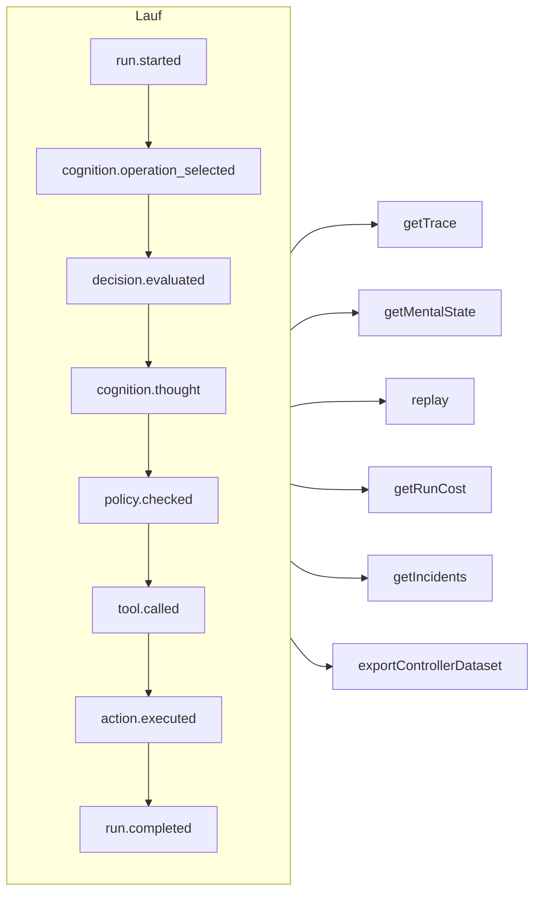

# Nachvollziehbarkeit & Replay

Jeder Lauf – ob kontrolliert, kognitiv, eine direkte typisierte Entscheidung oder ein MCP-Tool-Aufruf – ist ein **Ereignisprotokoll, an das nur angehängt wird**. Nichts geschieht außerhalb des Protokolls, und alles andere wird daraus abgeleitet.



## Speicher {#stores}

| Speicher | Verwenden Sie ihn für |
| --- | --- |
| `FileEventStore` (Standard) | Entwicklung, ein einzelner Prozess – eine JSON-Datei pro Lauf |
| `SQLiteEventStore` | Lokale Persistenz mit Abfragen |
| `PostgreSQLEventStore` | Produktion: indizierte Abfragen, Aggregation, Sicherung und Wiederherstellung |

::: code-group

```ts [File]
import { createSDK, FileEventStore } from '@sdk-ai-agents/core';

const sdk = createSDK({ apiKey, eventStore: new FileEventStore('./events') });
```

```ts [SQLite]
import Database from 'better-sqlite3';
import { createSDK, SQLiteEventStore } from '@sdk-ai-agents/core';

const sdk = createSDK({ apiKey, eventStore: new SQLiteEventStore({ db: new Database('events.db') }) });
```

```ts [PostgreSQL]
import pg from 'pg';
import { createSDK, PostgreSQLEventStore } from '@sdk-ai-agents/core';

const pool = new pg.Pool({ connectionString: process.env.DATABASE_URL });
const sdk = createSDK({ apiKey, eventStore: new PostgreSQLEventStore({ pool }) });
```

:::

Speicher implementieren `IEventStore`; schreiben Sie Ihren eigenen, um jede beliebige Datenbank anzusprechen. Der Dateispeicher puffert Ereignisse und schreibt sie alle 100 ms weg; rufen Sie beim Herunterfahren `await store.destroy()` auf, um noch Ausstehendes zu schreiben. Leser des Protokolls (Rekonstruktion des mentalen Zustands, Kosten, Datensätze) ignorieren Ereignisse, die mit derselben Kennung wiederholt werden.

## Einen Lauf lesen {#read-a-run}

```ts
const trace = await sdk.getTrace(runId);          // status, timeline, summary
const text = await sdk.exportTrace(runId, 'text'); // human-readable timeline
const events = await sdk.getEvents(runId, { type: ['tool.called', 'policy.violated'] });
const state = await sdk.getMentalState(runId);    // cognitive runs
```

Der Status eines Laufs ist das **letzte Lebenszyklusereignis** (`run.completed`, `run.failed`, `run.cancelled`). Danach angehängte Ereignisse – Feedback, Incident-Meldungen – öffnen ihn nie wieder.

## Live-Fortschritt {#live-progress}

Ereignisse erreichen Ihren Code auch **während der Lauf noch im Gange ist**, sobald der Speicher sie angenommen hat: um den Fortschritt in einer Benutzeroberfläche anzuzeigen, ihn an einen Client zu streamen oder ein Dashboard zu speisen. MCP-Clients erhalten sie als [Fortschrittsbenachrichtigungen](./mcp-deploy#progress-notifications).

```ts
const result = await agent.run({
  message: 'Refund order 1234',
  onEvent: (event) => console.log(event.type),
});

const answer = await cognitiveAgent.think({ problem, onEvent: (event) => socket.send(JSON.stringify(event)) });
const replay = await sdk.replay(runId, undefined, { onEvent: (event) => console.log(event.type) });

// Every run of the SDK, for as long as you listen
const unsubscribe = sdk.subscribe((event) => dashboard.push(event), { types: ['run.failed', 'approval.requested'] });
unsubscribe();
```

| Wo | Was der Listener erhält |
| --- | --- |
| `run({ onEvent })`, `think({ onEvent })` | Jedes Ereignis dieses Laufs |
| `replay(runId, modifications, { onEvent })` | Jedes Ereignis des Replays |
| `executeTool(name, params, { onEvent })` | Die Ereignisse des Aufrufs und des Agentenlaufs, den sein Tool startet (`governedAgentTool`, `cognitiveAgentTool`), eine Ebene tief: nicht die Läufe, die dieser Agent seinerseits startet |
| `sdk.subscribe(listener, { runId?, agentId?, types?, maxQueued? })` | Jedes Ereignis jedes Laufs, der zum Filter passt, bis Sie die zurückgegebene Funktion aufrufen |

Was garantiert ist:

- **Nur, was der Speicher angenommen hat.** Ein Listener wird aufgerufen, sobald das `append` des Speichers erfolgreich war, nie für ein Ereignis, das der Speicher abgelehnt hat. Bei den SQL-Speichern ist die Zeile festgeschrieben; beim Dateispeicher liegt das Ereignis in seinem Puffer: `getEvents` gibt es sofort zurück, und es erreicht die Festplatte innerhalb von 100 ms (bei einem Absturz dazwischen geht es verloren).
- **In Reihenfolge.** Die Ereignisse eines Laufs kommen in der Reihenfolge an, in der sie aufgezeichnet wurden; die Ereignisse verschiedener Läufe wechseln sich ab.
- **Ein Ereignis nach dem anderen, und der Lauf wartet nie.** Gibt Ihr Listener ein Promise zurück, wartet sein nächstes Ereignis, bis dieses Promise erfüllt oder abgelehnt ist, sodass ein asynchroner Listener die Ereignisse nicht umordnen kann. Der Lauf geht währenddessen weiter: Ein langsamer Listener fällt zurück, er bremst den Agenten nicht. Ein synchroner Listener wird aufgerufen, bevor das `append` des Ereignisses zurückkehrt: Halten Sie ihn kurz.
- **Der Aufruf wartet auf den Listener, bis der Lauf unterbrochen wird.** Sobald der Lauf vorbei ist, warten `run()`, `think()`, `replay()` und `executeTool()`, bis ihr `onEvent` jedes Ereignis fertig verarbeitet hat; wenn sie zurückkehren, haben Sie also alles gesehen. Das Warten endet vorzeitig, wenn der Lauf angehalten oder abgebrochen wurde oder wenn sein `signal` abgebrochen wird (der Aufrufer gibt auf); bei einem kognitiven Lauf zählt `limits.timeoutMs` auch das Warten mit. Der Listener wird dann abgemeldet: Die Ereignisse, die er noch nicht erhalten hat, werden verworfen. Ein Replay kann nicht abgebrochen werden, also wartet es immer. Ansonsten hindert ein Promise, das nie erfüllt oder abgelehnt wird, den Aufruf an der Rückkehr: Für Arbeit nach dem Prinzip „Fire and Forget“ geben Sie das Promise nicht zurück (`onEvent: (event) => { void save(event); }`).
- **Eine begrenzte Warteschlange.** Höchstens `maxQueued` Ereignisse (standardmäßig 10 000) warten auf einen Listener, der noch mit einem früheren beschäftigt ist; darüber hinaus werden neue Ereignisse für diesen Listener verworfen. Das Verwerfen wird gemeldet, sobald der Listener aufgeholt hat, mit einem `LiveEventsDroppedError`, der angibt, wie viele Ereignisse verworfen wurden.
- **Fehler bleiben außerhalb des Laufs.** Ein Listener, der einen Fehler wirft oder dessen Promise abgelehnt wird, wird auf der Standardfehlerausgabe (`console.error`) gemeldet und erhält trotzdem die nächsten Ereignisse; dasselbe gilt für verworfene Ereignisse. Um Fehler selbst zu behandeln, fangen Sie sie im Listener ab; um Fehler und verworfene Ereignisse gleichermaßen zu behandeln, erstellen Sie das SDK mit `eventStore: new ObservedEventStore(store, { onListenerError })`.
- **Eine Kopie.** Jeder Listener erhält seine eigene Kopie des Ereignisses, so wie der Speicher es zurückliest: Wer sie ändert, ändert nichts im Protokoll.
- **Abmelden wirkt sofort.** Nachdem die von `sdk.subscribe` zurückgegebene Funktion aufgerufen wurde, wird der Listener nicht mehr aufgerufen, auch nicht für bereits wartende Ereignisse; sie kann aus dem Listener selbst heraus aufgerufen werden.

Der Filter `agentId` vergleicht mit dem `metadata.agentId` jedes Ereignisses: Einige Ereignisse tragen keinen Agenten (`provider.retry`, das Ende eines Replays, das `decision.evaluated` eines Aufrufs von `sdk.decisions` ohne `agentId`); filtern Sie nach Lauf, um sie zu erhalten. Wiederhergestellte Sicherungen werden nicht zugestellt. Die Incident-Meldungen von `incidents` werden zugestellt; einen `MonitoredEventStore`, den Sie selbst erstellen, bauen Sie auf einem `ObservedEventStore` auf (`new MonitoredEventStore(new ObservedEventStore(store), options)`), sonst werden seine Meldungen zwar aufgezeichnet, aber nicht live zugestellt. Für einen Agenten, den Sie von Hand auf Ihrem eigenen Speicher zusammenbauen (`new AgentImpl(…)`), wickeln Sie den Speicher in einen `ObservedEventStore`, um `onEvent` zu nutzen; `createSDK` erledigt das für Sie. Hinter einem Agenten-Tool läuft ein Agent, dessen Speicher nicht so umhüllt ist, ohne den Listener des Aufrufers, statt fehlzuschlagen.

## Replay ohne das LLM {#replay-without-the-llm}

```ts
const replay = await sdk.replay(runId);
```

Replay führt die aufgezeichneten Intentionen erneut durch die Action Engine aus – Richtlinien eingeschlossen –, **ohne das LLM aufzurufen**. Spielen Sie mit Änderungen erneut ab, um „Was wäre, wenn?“-Szenarien zu testen, zum Beispiel nach einer Richtlinienänderung.

Ein Replay führt die Tools erneut aus, und zwar tatsächlich. Bei Tools, die mit `requiresApproval` markiert sind, wiederholt ein Replay nur die Aufrufe, die im ursprünglichen Lauf von einem Menschen **freigegeben** wurden – dasselbe Tool mit denselben Parametern –, ohne erneut nachzufragen; ein Aufruf, der abgelehnt, abgebrochen oder nie freigegeben wurde, wird verweigert, nicht ausgeführt. Freigaben, die eine *Richtlinie* verlangt, gelten weiterhin und warten auf eine Entscheidung.

## Entscheidungen verstehen {#understand-decisions}

| Methode | Was Sie erhalten |
| --- | --- |
| `getReasoningGraph(runId)` / `exportReasoningGraph(runId, 'graphviz')` | Die Kette Intention → Richtlinie → Aktion als Graph |
| `getAlternatives(runId)` | Alternativen, die der Agent in Betracht gezogen hat |
| `getDecisionPatterns(filters)` | Wiederkehrende Entscheidungsmuster über Läufe hinweg |
| `getTraceVisualization(runId)` | Gruppierte Struktur, bereit für eine Zeitleiste in einer Benutzeroberfläche |
| `getPolicyAuditTrail(runId)` | Jede Auswertung einer Richtlinie und ihr Ergebnis |

## Agenten wie Code testen {#test-agents-like-code}

Machen Sie aus einem guten Lauf einen **Golden Trace** und validieren Sie dann neue Läufe dagegen:

```ts
const golden = await sdk.createGoldenTrace(runId, { name: 'refund flow', description: 'Expected behavior' });
const validation = await sdk.validateAgainstGoldenTrace(newRunId, golden.id);
const regressions = await sdk.detectRegressions(newRunId, golden.id);
```

Läufe werden nach der Bedeutung ihrer Ereignisse verglichen – Typ, Reihenfolge, Tool, Parameter, Ergebnisse –, nie nach Ereignis-IDs, die in jedem Lauf neu sind; Zeitpunkte, Token-Zahlen und die anderen Werte, die das SDK schreibt und die sich von Lauf zu Lauf ändern, bleiben ebenfalls außen vor, aber Parameter und Ergebnisse eines Tools werden immer verglichen, wie auch immer ihre Schlüssel heißen. Ein Lauf, der dasselbe noch einmal tut, besteht; ein Tool, das mit anderen Argumenten aufgerufen wird, wird dort gemeldet, wo der Aufruf stattfand.

### Regressionssuiten in der CI {#regression-suites-in-ci}

Fassen Sie Golden Traces einmal in einer Suite zusammen und führen Sie sie dann in der CI aus:

```ts
// Once, after recording the good runs
await sdk.createRegressionTestSuite('support-agent', {
  name: 'refunds',
  goldenTraces: [{ goldenTraceId: golden.id, name: 'refund flow' }],
});

// In CI: the same agent, created again
sdk.createAgent({ name: 'support-agent', model: 'gpt-4o', tools });
const { results, exitCode } = await sdk.runRegressionTestsForCI('support-agent', {
  detection: { tolerance: { ignoreEventTypes: ['intention.generated'], ignoreDataFields: ['output'] } },
});
await sdk.exportTestResults(results, 'junit', { outputPath: 'regressions.xml' });
process.exitCode = exitCode;
```

Eine Suite kennt ihren Agenten über seinen **Namen**, da Agenten-IDs in jedem Prozess neu sind. Alle Suiten des Agenten laufen, die älteste zuerst: Jeder Test schickt die Eingabe des Referenzlaufs an den Agenten und vergleicht den neuen Lauf mit dem Golden Trace. Der Exit-Code ist 0, wenn alle Tests bestanden haben, 1, wenn einer eine Regression gefunden hat, und 2, wenn einer nicht laufen konnte. Ein echtes Modell formuliert seine Antworten von Lauf zu Lauf anders: Die `detection` oben lässt den Text des Modells und die endgültige Antwort aus und prüft weiterhin jeden Tool-Aufruf mit seinen Argumenten.

Assertions auf den Ereignissen eines Laufs, der Vergleich zweier Läufe, die Auswirkungen einer neuen Version eines Agenten und Abfragen über alle Läufe stehen in der [SDK-API](../reference/sdk-api#assertions).
