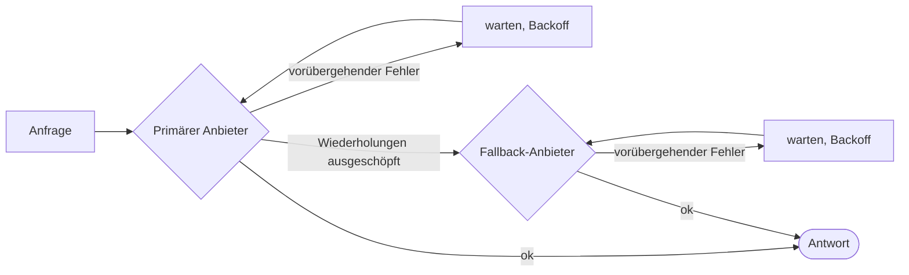

# Wiederholungen & Fallback

Netzwerke fallen aus, Anbieter drosseln Anfragen, Tools laufen in Zeitüberschreitungen. Das SDK wiederholt, was sich wiederholen lässt, weicht aus, wo das nicht geht, und **schreibt jeden Wiederholungsversuch in den Lauf**, sodass nichts verborgen bleibt.



## LLM-Anbieter {#llm-providers}

Eine Wiederholungsrichtlinie gilt für jeden Anbieter **einzeln, vor jedem Fallback**:

```ts
const sdk = createSDK({
  apiKey: process.env.OPENAI_API_KEY,
  fallbackProviders: [{ provider: 'anthropic', config: { apiKey: process.env.ANTHROPIC_API_KEY } }],
  retry: { maxRetries: 3, initialDelayMs: 500, maxDelayMs: 8_000 },
});
```

Ein Fallback-Anbieter eines anderen Herstellers braucht einen eigenen Schlüssel, in seiner `config` oder in `providerConfig`: Der Schlüssel des primären Anbieters wird nie an einen anderen Hersteller gesendet. Er erhält das Modell des Agenten nur, wenn er es anbietet, sonst sein eigenes `defaultModel` (Anthropic lehnt einen OpenAI-Modellnamen ab und umgekehrt). Das Event `intention.generated` nennt den Anbieter, der geantwortet hat, und das verwendete Modell.

| Option | Standard | |
| --- | --- | --- |
| `maxRetries` | `2` | Wiederholungsversuche nach dem ersten Versuch |
| `initialDelayMs` | `500` | Bei jedem Wiederholungsversuch verdoppelt (`multiplier`) |
| `maxDelayMs` | `8000` | Obergrenze für eine Backoff-Wartezeit |
| `maxRetryAfterMs` | `60000` | Längstes beachtetes `retry-after` (`maxDelayMs`, wenn es einen Fallback gibt) |
| `jitter` | `true` | Macht jede Wartezeit im Bereich [delay/2, delay] zufällig |
| `retryOn` | `isTransientError` | Ihr eigenes Prädikat |

Nur **vorübergehende** Fehler werden wiederholt: 408, 409, 425, 429, 5xx, 529, Verbindungsfehler und Zeitüberschreitungen – einschließlich der Verbindungsfehler von OpenAI und Anthropic, erkannt an der Klasse und am Netzwerkcode in ihrer `cause`. Authentifizierungs-, Validierungs- und Richtlinienfehler schlagen sofort fehl, ebenso ein 429, der bedeutet, dass das Konto kein Guthaben oder Kontingent mehr hat (`insufficient_quota`, `credit_balance_exhausted`…): Warten würde das Guthaben nicht zurückbringen. Die Fehlermeldung enthält die Erklärung des Anbieters. Sendet der Anbieter `retry-after-ms` oder `retry-after`, wartet das SDK so lange statt seines eigenen Backoffs, bis zu `maxRetryAfterMs` (standardmäßig 60 s). Sind `fallbackProviders` konfiguriert, wird diese Grenze auf `maxDelayMs` gesenkt: Ein Anbieter, der um eine lange Pause bittet, wird zugunsten des Fallbacks verlassen, statt den Lauf zu blockieren. Eine längere Anforderung beendet die Wiederholungsversuche.

Ist die Richtlinie des SDK aktiv, werden die eigenen Wiederholungsversuche der OpenAI- und Anthropic-Clients deaktiviert – **Wiederholungen stapeln sich nie**. Jeder Wiederholungsversuch wird als Ereignis `provider.retry` mit Anbieter, Modell, Versuch, Verzögerung und Fehler aufgezeichnet. Übergeben Sie `retry: false`, um stattdessen die Standardwerte des Anbieters zu behalten.

Ein Anbieter, den Sie mit `llmProvider` einsetzen, wird unverändert verwendet, sofern Sie `retry` nicht ausdrücklich setzen, und ein `FallbackProvider` wird nie umhüllt, damit seine Failover im Trace sichtbar bleiben.

## Tools {#tools}

Markieren Sie idempotente Tools als wiederholbar:

```ts
sdk.defineTool({
  name: 'lookup_metric',
  description: 'Reads a metric',
  schema: z.object({ metric: z.string() }),
  retry: { maxRetries: 2, initialDelayMs: 200 },
  handler: async ({ metric }) => warehouse.read(metric),
});
```

Nur Fehlschläge des Tools werden wiederholt – nie eine Ablehnung durch eine Richtlinie oder ein Validierungsfehler. Jeder Wiederholungsversuch ist ein Ereignis `tool.retry`.

## Typisierte Entscheidungen {#typed-decisions}

Der Jev-Client wiederholt Antworten mit 408, 429, 5xx und 529 sowie Netzwerkfehler, **unter Beachtung von `retry-after`**, mit der Wiederholungsrichtlinie des SDK als Standard (`jev.maxRetries` überschreibt sie). Anders als die LLM-Anbieter wiederholt er jeden 429, unabhängig von der Ursache, bis zu `maxRetries`.

## Überall sonst {#anywhere-else}

`withRetry` wird für Ihren eigenen Code exportiert:

```ts
import { withRetry, DEFAULT_RETRY_POLICY } from '@sdk-ai-agents/core';

const data = await withRetry(() => fetchPartnerFeed(), DEFAULT_RETRY_POLICY, {
  onRetry: ({ retry, delayMs, error }) => logger.warn({ retry, delayMs, error }),
});
```
