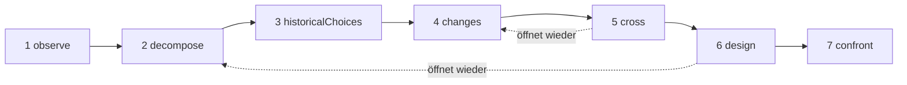

# Studien

Eine Studie ist ein KI-Forscher. Sie wendet eine einzige Methode an – **ein Objekt verstehen und es dann mit den Mitteln von heute neu entwerfen** – und übergibt Ihnen ein Dossier: was das Objekt tut, wie es funktioniert, warum es so gebaut wurde, was sich seitdem geändert hat, mehrere neue Entwürfe und die Experimente, die zwischen ihnen entscheiden würden. Sie baut nichts, führt nichts aus und misst nichts: Sie untersucht und schlägt vor.

::: tip In einfachen Worten
Wählen Sie ein Objekt: einen Webbrowser, eine Datenbank-Engine, einen Zugfahrplan. Die Studie beobachtet es, nimmt es auseinander, sucht nach den Gründen für seine früheren Entscheidungen, recherchiert, welche Forschung und welche Techniken seitdem aufgekommen sind, und kreuzt beides, um sich eine andere Organisation vorzustellen. Sie zielt auf einen Wechsel des Prinzips, der etwas Neues möglich macht, nicht auf eine schnellere Version desselben. Jede Behauptung sagt, ob sie durch eine Quelle **belegt** ist, die die Studie tatsächlich gefunden hat, ob sie eine **Hypothese** ist oder eine **Neuheit**, die noch mit bestehenden Arbeiten abzugleichen ist. Und die ganze Zeit über halten mehrere Mechanismen sie bei dem Ziel, das Sie ihr gegeben haben, denn Sprachmodelle neigen dazu abzuschweifen, je mehr sich die Anweisungen häufen. Jeder Begriff wird in [Schlüsselbegriffe einfach erklärt](./glossary#studies) erklärt.
:::

```ts
const study = sdk.createStudy({
  name: 'browser',
  object: 'The Web browser, from 1990 to 2026',
  objective: 'A browser design whose every choice follows from the investigation',
  leads: ['vectorisation', 'weights', 'ReLU'], // your leads: examples to verify, not truths
  analogues: ['Bitcoin'],                      // breakthroughs by assembly to deconstruct
  sources: ['brave_web_search'],               // SDK tools the study searches with
});

const result = await study.run();
result.status;   // 'completed' | 'stopped' | 'failed' | 'cancelled'
result.report;   // the structured report
result.markdown; // the same, as a readable dossier
```

## Was eine Studie ist {#what-a-study-is}

Eine Studie wendet eine Methode in sieben Phasen an: *ein Objekt verstehen und es dann mit dem Wissen und den Techniken von heute neu entwerfen*. Ihre Leitfrage lautet: **Wenn wir die heutigen Bedürfnisse mit dem Wissen und den Techniken erfüllen müssten, die heute verfügbar sind, wie würden wir dieses Objekt organisieren?** Sofern Sie keine eigene `question` angeben, stellt die Studie diese Frage in ihrer Sprache, gefolgt von dem Anspruch, der in [Worauf sie abzielt: eine neue Fähigkeit](#the-aim-a-new-capability) beschrieben ist.

Eine Studie ist kein Agent. Sie hat keine Tools, mit denen sie handeln könnte, nur **Quellen**, die sie durchsucht (siehe [Recherche über Ihre Quellen](#research-through-your-sources)), und ihr Ergebnis ist ein Bericht, keine Aktion. Sie wird mit `sdk.createStudy()` aus einer **Charta** erstellt – dem Objekt, dem Ziel, Ihren Bedürfnissen und Ihren Spuren –, die sich danach nie mehr ändert.

Ihre letzte Phase entwirft Experimente; sie führt sie nicht aus. Sobald Sie eines ausgeführt haben, tragen Sie sein Ergebnis in die passende Mechanismuskarte ein (siehe [Die Mechanismuskarte](#the-mechanism-card)).

## Die sieben Phasen {#the-seven-passages}

Ein Lauf durchläuft die sieben Phasen der Methode der Reihe nach. Jede erzeugt Elemente einiger Arten (ihre **Sammlungen**), und jedes Element erhält eine Kennung, die nie wiederverwendet wird: `O1`, `P2`, `A1`…

| # | Phase | Was sie tut | Was sie behält |
| --- | --- | --- | --- |
| 1 | `observe` | Betrachtet die Verhaltensweisen, Verwendungen, Varianten und Ausfälle des Objekts, jeweils mit ihren Bedingungen: wann, wo, für wen, womit. Sie beschreibt; sie erklärt noch nicht | `observations` (`O`) |
| 2 | `decompose` | Kartiert die Teile: ihre Funktion, Eingaben, Ausgaben und Beziehungen, und steigt in ein Teil hinab, solange seine Funktionsweise undurchsichtig bleibt, mit den Unbekannten jedes Teils. Legt die **gesamte Kette** des Objekts fest, Stufe für Stufe (bei einem Browser: empfangen, verstehen, ausführen, darstellen, interagieren) | `pieces` (`P`), `chain` (`C`) |
| 3 | `historicalChoices` | Sucht die dokumentierten Gründe für die Entscheidungen ihrer Zeit: Hardware, Werkzeuge, Verwendungen, Wissen, Kosten, Kompatibilität. Ein plausibler Grund ohne Dokument bleibt eine Hypothese | `historicalChoices` (`H`) |
| 4 | `changes` | Sucht, was seitdem aufgekommen oder nutzbar geworden ist, im Bereich des Objekts und in anderen, jeden Fortschritt mit seinem Mechanismus, seinem Datum, seinen Belegen, seinen Einsatzbedingungen und seiner Verfügbarkeit. Gibt zu jeder Ihrer Spuren ein Urteil ab, sucht über sie hinaus nach anderen mathematischen und technischen Werkzeugen, listet die besten aktuellen Umsetzungen auf (den Maßstab für „besser“) und zerlegt Durchbrüche durch Zusammensetzung | `advances` (`V`), `leadVerdicts` (`L`), `independentLeads` (`I`), `references` (`R`), `analogues` (`B`) |
| 5 | `cross` | Kreuzt Vergangenheit und Gegenwart: welche Randbedingungen bleiben, welche sich abgeschwächt haben, welche Anforderungen neu sind. Leitet die Entscheidungen ab, die revidierbar geworden sind, schlägt Kombinationen A + B vor (was A B ermöglicht, was sie austauschen müssen, was das an Umwandlungen und Synchronisierung kostet) und benennt mögliche neue Fähigkeiten | `constraints` (`K`), `revisableDecisions` (`D`), `combinations` (`X`), `capabilities` (`Y`) |
| 6 | `design` | Entwirft mindestens zwei Architekturen, davon mindestens eine, die auf eine neue Fähigkeit abzielt, jede über die gesamte Kette, mit ihrem Mechanismus, ihren Bedingungen, ihrem Nutzen, ihren Mehrkosten, einem möglichen Gegenbeispiel und ihren Vorhersagen. Gibt die drei Zustände jedes Hauptteils an und sagt, was neu ist und was nicht. Recherchiert dann den Stand der Technik der Neuheiten | `architectures` (`A`), `threeStates` (`T`), `noveltyClaims` (`N`) |
| 7 | `confront` | Entwirft die Experimente, die zwischen den Architekturen entscheiden und die gesamte Kette testen würden: Protokoll, Messgrößen, Kriterien und das erwartete Ergebnis für jede Architektur. Füllt eine Mechanismuskarte für jeden Hauptmechanismus aus | `experiments` (`E`), `cards` (`M`) |

Die Ergebnisse, die die Suchen liefern, werden ebenfalls nummeriert: `S1`, `S2`… Jede Phase erhält die Elemente der früheren Phasen, die sie braucht, als kompakte JSON-Datensätze.

### Eine Schleife, keine Linie {#a-loop-not-a-line}



Die Phasen bilden eine Schleife. Wenn eine Unbekannte eine Phase blockiert – der Entwurf muss zum Beispiel wissen, wie ein Teil wirklich funktioniert –, kann sie verlangen, eine frühere Phase zu diesem Punkt **wieder zu öffnen**. Die frühere Phase läuft mit diesem Schwerpunkt erneut und fügt den Elementen, die sie schon hatte, neue hinzu; danach läuft die Phase, die darum gebeten hat, mit ihnen erneut. `limits.maxLoops` begrenzt die Wiederöffnungen eines Laufs (standardmäßig 1, 0 für keine); eine Phase, die selbst wieder geöffnet wurde, kann keine andere wieder öffnen.

### Drei Zustände jedes Teils {#three-states-of-each-piece}

Der Entwurf gibt jedem Hauptteil drei Zustände, die im Bericht getrennt gehalten werden (`threeStates`):

- **das Objekt zu seiner Zeit** (`atItsTime`): wie das Teil gebaut war und unter welchen Bedingungen;
- **die besten einschlägigen aktuellen Umsetzungen** (`currentBest`): der Maßstab, an dem eine Verbesserung gemessen wird;
- **unser Vorschlag** (`proposal`): was die Architektur damit macht.

Das Alter einer Entscheidung macht sie nicht falsch, und eine neue Technik kann eine Komplikation der Vergangenheit überflüssig machen: Die drei Zustände zeigen, welche Bedingung sich geändert hat, welcher Mechanismus möglich wurde und was das für das Ganze bedeutet.

### Die Mechanismuskarte {#the-mechanism-card}

Die letzte Phase füllt für jeden Hauptmechanismus eine Karte aus. Sie hat elf Felder: Die Studie füllt die ersten neun aus, und die letzten beiden bleiben leer, bis Sie ein Experiment ausgeführt haben.

| # | Feld | Die Frage, die es beantwortet |
| --- | --- | --- |
| 1 | `observation` | Was tut das System, unter welchen Bedingungen? |
| 2 | `mechanism` | Welche Teile und Beziehungen erklären es? |
| 3 | `unknown` | Was bleibt zu öffnen, zu messen oder zu dokumentieren? |
| 4 | `historicalChoice` | Warum wurde diese Organisation gewählt, auf welche Belege gestützt? |
| 5 | `evolution` | Was hat sich seitdem geändert, mit welchen Quellen und Datumsangaben? |
| 6 | `newPossibility` | Welche Entscheidung wird durch diese Änderung revidierbar? |
| 7 | `proposedCombination` | Wie greifen die Techniken konkret ineinander? |
| 8 | `prediction` | Welche Wirkung erwarten wir, unter welchen Bedingungen? |
| 9 | `experiment` | Wie entscheiden wir zwischen den Vorschlägen und prüfen das Ganze? |
| 10 | `resultAndError` | Was haben wir herausgefunden, und wo versagt die Erklärung? |
| 11 | `conclusionAndMemory` | Was behalten wir, was ändern wir, wo ließe sich dieser Mechanismus wiederverwenden? |

```ts
await study.recordResult('M1', {
  result: 'Layout reuse cut the time to redraw by 40% on the reference pages',
  error: 'No gain on pages whose styles change on every frame',
  conclusion: 'Keep immutable layout results; look again at style invalidation',
});
```

`recordResult(cardId, { result, error?, conclusion? })` füllt die Felder 10 und 11 der Karte aus und zeichnet ein Ereignis `study.result_recorded` in dem Lauf auf, der die Karte geschrieben hat. Bei einer unbekannten Karte oder einem leeren `result` wirft es einen `ValidationError`. `study.report()` gibt den Bericht mit der ausgefüllten Karte zurück.

## Worauf sie abzielt: eine neue Fähigkeit {#the-aim-a-new-capability}

Eine Studie sucht keine schnellere Version desselben Objekts. Sie sucht **einen Wechsel des Prinzips, der etwas möglich macht, das heute schwierig ist, nicht nur etwas Schnelleres**.

### Fähigkeit, Prinzip, Mechanismus {#capability-principle-mechanism}

Jede Architektur benennt drei Dinge:

- **die Fähigkeit** (`capability`): was möglich wird, für wen, und welche heutige Randbedingung sie aufhebt (`what`, `forWhom`, `liftedConstraint`);
- **den Wechsel des Prinzips** (`principleChange`): welches Prinzip sich ändert – `representation`, `distribution` (der Arbeit), `responsibility`, `trust`, `verification` oder `other` – und wie;
- **den Mechanismus** (`mechanism`): wie die Zusammensetzung der Techniken die Fähigkeit hervorbringt.

Jede Architektur gibt ihre Art an (`kind`): `capability` oder `improvement`, wenn sie etwas nur schneller oder günstiger macht. Eine Architektur, die keine Art angibt, ist eine Verbesserung, die schwächere Behauptung. Eine Fähigkeit muss ihren Wechsel des Prinzips und ihre Zusammensetzung angeben, sonst lehnt das Schema sie ab (siehe [Jedes Element sagt, wozu es dient](#every-item-says-what-it-serves)).

Sie können die angestrebte Fähigkeit in der Charta benennen (`capability`); jeder Prompt trägt sie dann mit. Ohne sie muss die Phase `cross` mindestens eine mögliche Fähigkeit vorschlagen (`capabilities`, `Y1`…), mit der Angabe, für wen sie ist, warum sie heute schwierig ist und welches Prinzip sich ändern würde.

Der Wächter (siehe [Der Wächter](#the-guardian)) beurteilt außerdem jede Architektur: Eine Fähigkeit, die er nur für schneller oder günstiger hält, wird zu einer `improvement`, mit `declaredKind: 'capability'`, um zu zeigen, was das Modell behauptet hat. Ein Entwurf, der gar keine Fähigkeit enthält, verfehlt das Ziel als Ganzes: Er wird im Drift-Protokoll vermerkt und einmal wiederholt; enthält auch die Wiederholung keine, sagt der Bericht es (Hinweis `noCapability`). Im Bericht **kommen die Fähigkeiten zuerst, die Verbesserungen danach**.

### Die Neuheit liegt in der Zusammensetzung {#novelty-lies-in-the-assembly}

Durchbrüche entstehen selten aus einer Technik ohne Vorbild. Häufiger setzen sie frühere Techniken so zusammen, wie es noch niemand getan hatte, und diese Zusammensetzung eröffnet eine Fähigkeit. Eine Studie denkt genauso:

- eine Architektur listet ihre **Komponenten** auf (`components`): frühere Techniken, jede mit ihrer Aussage, ihrem Datum und ihren Quellen, jede mit einem Status, der wie der jeder Behauptung geprüft wird;
- ihre **Zusammensetzung** (`assembly`) sagt, was jede Komponente den anderen gibt, was sie austauschen und was das kostet;
- eine Komponente ist **nie eine Neuheit**: Eine Komponente, die als neu dargestellt wird, ist `established`, wenn ein Ergebnis, das die Studie abgerufen hat, sie dokumentiert, und andernfalls eine `hypothesis`, mit Begründung;
- der eigene Status der Architektur ist der ihrer Zusammensetzung und ihrer Fähigkeit. Beansprucht sie eine Neuheit, wird ihr Stand der Technik **als Kombination** recherchiert: Die Studie sucht nach Arbeiten, die bereits dieselben Komponenten verbinden, um dieselbe Fähigkeit zu erzeugen, nicht nach jedem einzelnen Teil.

Das Dossier zeigt den Weg jeder Architektur: Komponenten (mit ihrem Status) → Zusammensetzung (mit ihrem Status) → Fähigkeit.

### Durchbrüche durch Zusammensetzung {#breakthroughs-by-assembly}

Die Phase `changes` zerlegt außerdem frühere Durchbrüche aus beliebigen Bereichen, die aus der Zusammensetzung früherer Techniken entstanden sind (`analogues`, `B1`…). Bitcoin ist das Beispiel, das die Methode gibt: Signaturen mit öffentlichen Schlüsseln, Hash-Ketten und Zeitstempel, Proof of Work, Merkle-Bäume und ein Peer-to-Peer-Netz gab es alle schon vorher; zusammengesetzt ergaben sie ein gemeinsames Kassenbuch ohne vertrauenswürdigen Dritten.

Für jeden Durchbruch hält die Studie fest, welche früheren Techniken er zusammengesetzt hat (mindestens zwei, mit ihren Datumsangaben), welche Randbedingung er aufgehoben hat, welche Fähigkeit sich dadurch eröffnet hat und nach welchem **Muster** die Zusammensetzung gebaut ist. Die Phasen `cross` und `design` erhalten diese Muster und können sie wiederverwenden. Jeder Durchbruch ist eine Behauptung wie jede andere: `established` nur mit einem Ergebnis, das die Studie abgerufen hat.

Die Durchbrüche, die Sie in `analogues` nennen, müssen alle zerlegt werden. Eine Antwort, die einen davon vergisst, wird einmal zurückgeschickt; fehlt danach noch einer, führt der Bericht ihn in `undeconstructedAnalogues` auf, mit dem Hinweis `analoguesNotDeconstructed`. Die Studie kann weitere Durchbrüche hinzufügen, die sie gefunden hat.

## Belegt, Hypothese, Neuheit {#established-hypothesis-novelty}

Jedes Element einer Studie ist eine **Behauptung**: eine Aussage mit einem Status, den Ergebnissen, die sie anführt (`sources`), und dem, wozu sie im Ziel dient. Das Modell schlägt einen Status vor; **der Code prüft ihn**, was auch immer das Modell sagt.

| Status | Was er voraussetzt | Was die Studie andernfalls tut |
| --- | --- | --- |
| `established` | Die Behauptung führt mindestens ein Ergebnis an, das **diese Studie** aus ihren Quellen **abgerufen hat** | Sie wird zur `hypothesis`. `declaredStatus` behält den Status, den das Modell angegeben hat, und `statusReason` sagt, warum; angeführte Kennungen, die die Studie nie abgerufen hat, werden getrennt in `unretrievedSources` aufbewahrt und stützen nichts |
| `hypothesis` | Nichts: plausibel, hier nicht dokumentiert | — |
| `novelty` | Eine Idee, die es noch nicht gibt, und eine **Recherche zu ihrem Stand der Technik** | Sie bleibt eine zu prüfende Neuheit (`toVerify: true`), mit Begründung, bis ihr Stand der Technik recherchiert und bewertet ist |

Einen Status, den die Studie nicht lesen kann, wertet sie als `hypothesis`, nie als einen stärkeren. **Ohne Quellen lässt sich nichts belegen**: Jede Behauptung ist bestenfalls eine Hypothese, keine Neuheit kann geprüft werden, und der Bericht sagt es in seinem ersten Hinweis (`noSources`).

### Stand der Technik {#prior-art}

Nach dem Entwurf recherchiert die Studie den Stand der Technik jeder Neuheit, die noch zu prüfen ist, ob sie aus dem Entwurf oder aus den früheren Phasen stammt. Das Modell wählt die Suchen (für eine Architektur: die Kombination ihrer Komponenten und die Fähigkeit), die Studie führt sie aus, dann benennt ein separater Aufruf unter den Ergebnissen die nächstliegende bestehende Arbeit und gibt ein Urteil ab:

- `novel` oder `partlyNovel`: Die Behauptung bleibt eine Neuheit, ist nicht mehr zu prüfen und erhält ihr `priorArt` (`closest`, `sources`, `verdict`);
- `exists`: Die Idee gibt es bereits; die Behauptung wird zur `hypothesis`, und `statusReason` nennt die nächstliegende Arbeit.

Eine Neuheit, deren Stand der Technik nicht recherchiert oder bewertet werden konnte – keine Quelle, das Suchbudget aufgebraucht, keine Suche für sie verlangt oder eine Neuheit, die erst nach dem Entwurf beansprucht wurde –, bleibt zu prüfen und sagt, warum. Der Bericht zählt sie (Hinweis `noveltiesToVerify`).

## Recherche über Ihre Quellen {#research-through-your-sources}

Das SDK hat keine eingebaute Websuche. Eine Studie sucht mit **den Tools, die Sie ihr als `sources` geben**: den Namen von SDK-Tools, typischerweise den Such-Tools eines MCP-Servers, die mit [`connectMcpServer`](./mcp#use-the-tools-of-an-mcp-server-in-your-agents) importiert und mit `sdk.defineTool` definiert wurden:

```ts
import { connectMcpServer } from '@sdk-ai-agents/core/mcp';

const search = await connectMcpServer({
  name: 'search',
  transport: {
    type: 'stdio',
    command: 'npx',
    args: ['-y', '@modelcontextprotocol/server-brave-search'],
    env: { BRAVE_API_KEY: process.env.BRAVE_API_KEY ?? '' },
  },
  metadata: { readOnly: true },
});
// Define the tools first: the study checks its sources when it is created.
const sources = search.tools.map((tool) => sdk.defineTool(tool).name);

const study = sdk.createStudy({ name: 'browser', object, objective, sources });
```

- **Beim Erstellen der Studie geprüft.** `createStudy` wirft einen `ValidationError`, wenn eine Quelle kein definiertes Tool ist oder keine Textanfrage annimmt. Die Anfrage kommt in den Parameter `query` des Tools oder in einen anderen gängigen Namen (`q`, `search`, `keywords`…), sonst in seinen einzigen erforderlichen Textparameter, sonst in seinen ersten Textparameter.
- **Kontrolliert.** Jede Suche läuft über `sdk.executeTool`, mit der `id` der Studie als Agenten-ID und mit den Quellen als einzigen erlaubten Tools: Allowlists, Richtlinien, Budgets, Freigaben, Wiederholungsversuche und Traces gelten wie bei jedem Tool-Aufruf, und die Tool-Ereignisse (`action.executing`, `policy.checked`, `tool.called`, `action.executed`) werden im Lauf der Studie aufgezeichnet. Eine Suche, die fehlschlägt oder die eine Richtlinie ablehnt, wird mit ihrem Fehler aufgezeichnet, und die Studie geht weiter.
- **Wann sie sucht.** Vor `historicalChoices` und vor `changes` verlangt das Modell die Suchen, die die Phase braucht – bei `changes`: um jede Ihrer Spuren zu prüfen, um über sie hinaus andere Werkzeuge zu finden, um die besten aktuellen Umsetzungen zu finden und um die Durchbrüche durch Zusammensetzung zu dokumentieren. Nach `design` recherchiert sie den Stand der Technik der Neuheiten. Höchstens sechs Suchen werden auf einmal verlangt.
- **Nummerierte Ergebnisse.** Die Studie liest die Ergebnisse unabhängig von ihrer Form (eine Liste, ein Objekt, das eine solche enthält, etwa `results` oder `items`, JSON-Text, MCP-Textteile, reiner Text), behält einen Titel, eine URL oder eine andere Fundstelle, ein Datum, falls angegeben, und einen Auszug und nummeriert sie einmal für die ganze Studie: Dasselbe Ergebnis behält, wenn es erneut gefunden wird, anhand seiner Fundstelle seine Kennung. Sie behält `limits.maxResultsPerSearch` Ergebnisse jeder Suche (standardmäßig 5).
- **Begrenzt.** `limits.maxSearches` (standardmäßig 20 pro Lauf) begrenzt die Suchen. Ist es aufgebraucht, **hält der Lauf nicht an**: Er geht ohne Suchen weiter, Behauptungen, die eine Quelle gebraucht hätten, bleiben Hypothesen, Neuheiten bleiben zu prüfen, und der Bericht sagt, in welchen Phasen nicht gesucht werden konnte (Hinweis `searchesSkipped`).

Ihre Spuren sind zu prüfende Beispiele, keine Wahrheiten: `changes` muss jeder von ihnen ein Urteil geben – `relevant`, `partlyRelevant` oder `notRelevant`, mit Gründen –, und eine Antwort, die eine vergisst, wird einmal zurückgeschickt. Eine Spur, die danach noch kein Urteil hat, wird in `unverifiedLeads` aufgeführt (Hinweis `leadsNotVerified`). Werkzeuge, die die Studie selbst findet, sind `independentLeads`.

## Beim Ziel bleiben {#staying-on-the-objective}

Sprachmodelle driften ab. Mit jeder hinzugefügten Anweisung schweift das Thema ein wenig weiter ab, und das Modell vergisst, was es tun sollte, bis man es jedes Mal daran erinnern muss. Eine Studie macht Drift **strukturell schwierig** und **sichtbar**, wenn sie doch auftritt.

### Eine eingefrorene Charta {#a-frozen-charter}

Die Charta enthält das Objekt, die Leitfrage, das Ziel, die Bedürfnisse, Ihre Spuren, was außerhalb des Rahmens liegt (`scope.exclude`), die angestrebte Fähigkeit und die zu zerlegenden Durchbrüche. Sie wird beim Erstellen der Studie eingefroren – `study.charter` lässt sich nicht ändern, auch nicht versehentlich – und mit SHA-256 gehasht (`study.charterHash`). Der Hash wird beim Start jedes Laufs (`study.started`) und in jedem Nachtrag aufgezeichnet, sodass Sie nachweisen können, dass jeder Lauf mit derselben Charta gearbeitet hat. Der `name` der Studie gehört nicht dazu: Zwei Studien mit derselben Charta haben denselben Hash. **Ein neues Ziel ist eine neue Studie.**

### Ein Prompt, bei jedem Aufruf neu gebaut {#a-prompt-rebuilt-at-each-call}

Eine Studie führt nie ein Gespräch. Jeder Modellaufruf wird aus nichts anderem gebaut als:

- der Charta und den angenommenen Nachträgen darunter;
- der Aufgabe der Phase;
- den kompakten Datensätzen, die sie aus den früheren Phasen braucht (JSON, keine Mitschriften);
- den Suchergebnissen, die sie anführen darf.

Keine frühere Antwort erreicht einen Prompt. Selbst die Reparatur einer Antwort, die nicht verwendet werden konnte, wird aus der Charta neu gebaut: Sie sagt, warum die Antwort abgelehnt wurde, nie, was sie war. Von Aufruf zu Aufruf häuft sich nichts an, also verwässert nichts das Ziel.

### Das Ziel an beiden Enden {#the-objective-at-both-ends}

Jeder Prompt beginnt mit der Charta und endet mit einer Erinnerung, deren letzte Zeile das Ziel ist:

```text
STUDY CHARTER (immutable, sha256 3f5a9c0e1b2d4f67)
Object: The Web browser, from 1990 to 2026
Question: If we had to meet today’s needs with the knowledge and techniques available today, how would we organise this object? Which change of principle would make possible something difficult today, not only faster?
Objective: A browser design whose every choice follows from the investigation
…
Accepted amendments (subordinate to the objective):
1. Examine memory safety too

(the task of the passage, the records of earlier passages, the results it may cite)

REMINDER
This step must produce: at least two architectures, at least one aiming at a new capability, …
Out of scope: anything that serves neither the objective nor the needs.
Write every text value in English (en). Reply with the JSON object only.
Objective: A browser design whose every choice follows from the investigation
```

Die Charta, das Ziel eingeschlossen, ist das Erste, was das Modell liest, und das Ziel das Letzte.

### Jedes Element sagt, wozu es dient {#every-item-says-what-it-serves}

Jedes Element muss `servesObjective` tragen: in einem Satz, welchem Teil des Ziels oder welchem Bedürfnis es dient. Ein Element ohne diese Angabe wird **vom Schema abgelehnt**, bevor der Wächter es überhaupt sieht, und im Drift-Protokoll vermerkt (`by: 'schema'`). Ein Element, das nicht sagen kann, wozu es dient, ist meist eines, das zu nichts dient.

### Der Wächter {#the-guardian}

Nach jeder Phase sieht ein separater Aufruf – **der Wächter** – nur die Charta, die angenommenen Nachträge und die Elemente dieser Phase: nicht die Aufgabe, nicht die früheren Datensätze, nicht die Suchen. Er läuft mit Temperatur 0 und beurteilt jedes Element: beim Ziel oder nicht, und warum. Beim Entwurf beurteilt er außerdem, ob jede Architektur eine neue Fähigkeit eröffnet (siehe [Fähigkeit, Prinzip, Mechanismus](#capability-principle-mechanism)).

- Ein Element, das vom Ziel abweicht, wird entfernt, mit der Begründung im **Drift-Protokoll** vermerkt (`by: 'guardian'`) und als Ereignis `study.drift_rejected` aufgezeichnet.
- Wenn die abgelehnten Elemente (vom Wächter oder vom Schema) mehr als einen bestimmten Anteil dessen ausmachen, was die Phase erzeugt hat – `driftThreshold`, standardmäßig ein Drittel –, wird die Phase **einmal wiederholt**, mit der Angabe, welche Elemente abgelehnt wurden und warum. Die Elemente der Wiederholung ersetzen die des ersten Versuchs.
- Der Bericht behält jede Ablehnung (`driftLog`) und zählt sie und die Wiederholungen in `stats`.

### Nachträge {#amendments}

Sie können eine Anweisung hinzufügen, nachdem die Studie erstellt wurde. Sie schleicht sich nie unbemerkt ein: Der Wächter ordnet sie in einem eigenen Lauf gegenüber der Charta ein.

```ts
const amendment = await study.amend('Examine memory safety too');
amendment.verdict;  // 'refines' | 'conflicts' | 'changesObjective' | 'unclassified'
amendment.accepted; // true only when it refines the objective
amendment.number;   // 1, 2… for an accepted amendment
amendment.reason;   // why
```

| Urteil | Bedeutung | Ausgang |
| --- | --- | --- |
| `refines` | Der Nachtrag präzisiert oder verengt die Arbeit oder fügt ein Bedürfnis hinzu, innerhalb des Ziels und des Rahmens | Angenommen, nummeriert und in jedem späteren Prompt unter der Charta angezeigt – auch in denen eines laufenden Laufs |
| `conflicts` | Er widerspricht der Charta, dem Rahmen oder einem angenommenen Nachtrag | Abgelehnt, mit Begründung; er erreicht nie einen Prompt |
| `changesObjective` | Er ändert das Objekt oder das Ziel | Abgelehnt: Ein neues Ziel ist eine neue Studie, erstellt mit `sdk.createStudy` |
| `unclassified` | Seine Einordnung ist fehlgeschlagen | Abgelehnt: Das Ziel geht vor |

Angenommene und abgelehnte Nachträge werden aufgezeichnet (`study.amendment_accepted`, `study.amendment_refused`) und in `study.amendments` sowie im Bericht aufgeführt. Anweisungen häufen sich nie stillschweigend an: Jede ist nummeriert, dem Ziel untergeordnet und sichtbar.

### Warum das funktioniert {#why-this-works}

Drift entsteht durch einen wachsenden Kontext: Frühere Antworten, gestapelte Anweisungen und Nebendiskussionen wiegen am Ende schwerer als das Ziel. Eine Studie beseitigt dieses Wachstum. Das Modell liest nie seine eigenen früheren Antworten erneut, also kann es nicht von seiner eigenen Drift mitgerissen werden. Anweisungen häufen sich nicht an: Es gibt nur angenommene Nachträge, jeder nummeriert und einer Charta untergeordnet, die sich nicht ändern kann. Die Charta eröffnet jeden Prompt und das Ziel schließt ihn ab, dort, wo ein Modell am aufmerksamsten ist. Jedes Element muss sich gegenüber dem Ziel rechtfertigen, sodass ein abschweifendes Element leicht zu erkennen ist. Und ein Richter mit engem Blickfeld – die Charta und die Elemente, sonst nichts – fängt ab, was trotzdem durchrutscht, während das Drift-Protokoll Ihnen zeigt, was er entfernt hat und warum.

Nichts davon macht Drift unmöglich: Der Wächter ist ebenfalls ein Modell und kann sich in beide Richtungen irren. Es macht Drift unwahrscheinlich, begrenzt (eine Wiederholung pro Phase) und nachprüfbar.

## Limits, Kosten und Budgets {#limits-costs-and-budgets}

| Limit | Standard | Wenn es erreicht ist |
| --- | --- | --- |
| `maxModelCalls` | 60 | Der Lauf hält an: Status `stopped`, `stoppedBy: 'maxModelCalls'`. Es zählt jeden Aufruf des Laufs: Phasen, Suchanfragen, Prüfungen durch den Wächter, Prüfungen des Stands der Technik, Reparaturen |
| `timeoutMs` | 20 Minuten | Der Lauf wird abgebrochen, und ein laufender Aufruf erhält das Abbruchsignal: `stopped`, `stoppedBy: 'timeoutMs'` |
| `maxSearches` | 20 | Der Lauf geht ohne Suchen weiter (siehe [Recherche über Ihre Quellen](#research-through-your-sources)) |
| `maxLoops` | 1 | Es wird keine weitere Wiederöffnung angeboten |
| `maxResultsPerSearch` | 5 | Die übrigen Ergebnisse einer Suche werden verworfen |

Die Limits gelten für jeden Lauf. Weitere Einstellungen: `driftThreshold` (1/3), `temperature` der Phasen und Suchanfragen (0,4; der Wächter, die Nachträge und die Prüfung des Stands der Technik laufen mit 0), `maxTokens`, `model` (ohne Angabe das Standardmodell des Anbieters) und `llmProvider` (ein eigener Anbieter für diese Studie statt des Anbieters des SDK). Eine Konfiguration außerhalb des zulässigen Bereichs wirft beim Erstellen der Studie einen `ValidationError`.

Ein Lauf, der anhält, **behält alles, was er getan hat**: die bereits erledigten Phasen, die Elemente der laufenden Phase (die der Wächter noch nicht beurteilt hatte, werden als `unchecked` markiert, Hinweis `uncheckedItems`) sowie einen Bericht und ein Dossier, die sagen, was nicht ausgeführt wurde.

Ein Lauf ohne Reparaturen oder Wiederholungen macht ohne Quellen 14 Modellaufrufe – jede Phase und ihre Prüfung durch den Wächter – und mit Quellen bis zu 18: die Suchen, die vor `historicalChoices` und `changes` verlangt werden, und die Recherche zum Stand der Technik der Neuheiten (ihre Anfragen, dann ihre Prüfung). Jede Reparatur fügt einen Aufruf hinzu, jede Wiederholung mindestens zwei (die Phase und ihre Prüfung noch einmal), jede Wiederöffnung mindestens vier (die wieder geöffnete Phase und die, die darum gebeten hat, jede mit ihrer Prüfung).

### Kosten und Budgets {#costs-and-budgets}

Jeder Modellaufruf einer Studie wird als Ereignis `study.model_called` aufgezeichnet, mit seinem `model`, `requestedModel` und `usage` – ein Ereignis für einen Aufruf und seine Reparatur –, und eine Antwort, die ein Anbieter verworfen hat, als Ereignis `provider.answer_discarded`. Sie zählen wie jeder andere Modellaufruf:

- in `sdk.getRunCost(result.runId)`, und ein Nachtrag in seinem eigenen Lauf: `sdk.getRunCost(amendment.runId)` (siehe [API-Kosten](./costs));
- in den Budgets pro Zeitraum, unter der `id` der Studie: `sdk.getBudgetUsage({ agentId: study.id, period: 'all' })` liefert die Tokens, Kosten und Tool-Aufrufe aller ihrer Läufe.

Die Budget- und Timeout-Richtlinien des SDK (`defaultPolicies`, `defineGlobalPolicy`) werden **vor jeder Phase** geprüft, so wie die eines kognitiven Agenten vor jedem Schritt (siehe [Limits und Richtlinien](./cognitive-agents#limits-and-policies)): `maxSteps` zählt die bereits durchgeführten Phasen, `maxTokens` die Tokens der Modellaufrufe des Laufs, `maxDuration` die Zeit seit dem Start des Laufs, und ein `budgetLimit` mit `maxTokens` oder `maxCost` sein Budget pro Zeitraum. Eine Richtlinie, die ablehnt, zeichnet `policy.violated` mit der Phase (`passage`) auf, und der Lauf hält an: `stopped`, `stoppedBy: 'policy'`. Die Suchen durchlaufen als Tool-Aufrufe ebenfalls die Richtlinien.

## Läufe, Fortsetzen und Abbruch {#runs-resume-and-cancellation}

| Status | Wann | Letzte Ereignisse |
| --- | --- | --- |
| `completed` | Jede Phase ist gelaufen | `study.completed`, `run.completed` |
| `stopped` | Ein Limit oder eine Richtlinie hat den Lauf beendet (`stoppedBy`) | `study.failed`, `run.failed` |
| `failed` | Ein Fehler hat ihn beendet, etwa eine Antwort, die selbst nach ihrer Reparatur nicht verwendbar war, oder ein Entwurf mit weniger als zwei gültigen Architekturen (`error`) | `study.failed`, `run.failed` |
| `cancelled` | Sein `signal` wurde abgebrochen | `study.failed`, `run.cancelled` |

```ts
const controller = new AbortController();
const first = await study.run({ signal: controller.signal });

// Later: resume at the first passage not complete, with what was done kept.
const second = await study.run();

// Or run every passage again.
const fresh = await study.run({ restart: true });
```

- **Fortsetzen.** `run()` beginnt bei der ersten Phase, die nicht abgeschlossen ist; ein angehaltener, fehlgeschlagener oder abgebrochener Lauf lässt sich also fortsetzen, indem Sie `run()` erneut aufrufen. Die bereits abgeschlossenen Phasen bleiben erhalten; `study.started` hält fest, wo der Lauf fortgesetzt wurde (`resumeAt`). `restart: true` führt jede Phase erneut aus (die Kennungen zählen dort weiter, wo sie waren: `O3` folgt auf `O2`).
- **Ein Lauf nach dem anderen.** Ein zweites `run()`, während ein Lauf im Gange ist, wirft einen `ValidationError`. `amend()` kann während eines Laufs aufgerufen werden.
- **Im Arbeitsspeicher.** Der Zustand einer Studie lebt in ihrem `Study`-Objekt, und ihre `id` ändert sich von einem Prozess zum nächsten: Das Fortsetzen funktioniert mit demselben Objekt. Die Ereignisse halten für das Audit die Elemente jeder Phase, jede Suche und jedes Urteil fest, aber das SDK rekonstruiert eine Studie nicht aus ihnen.
- **Bericht.** `result.report` ist eine Kopie, die beim Ende des Laufs angefertigt wurde; `study.report()` gibt den Bericht in seinem aktuellen Stand zurück, mit den seitdem erfassten Ergebnissen.

### Live-Ereignisse {#live-events}

`run({ onEvent })` ruft Ihren Listener mit jedem Ereignis des Laufs auf, der Reihe nach, sobald der Ereignisspeicher es angenommen hat, genau wie `agent.run` (siehe [Live-Fortschritt](./observability#live-progress)). `run()` kehrt zurück, sobald der Listener jedes Ereignis fertig verarbeitet hat, oder früher, wenn der Lauf abgebrochen wurde oder sein Zeitlimit überschritten hat.

```ts
const result = await study.run({
  onEvent: (event) => {
    if (event.type === 'study.passage_started') console.log(`→ ${event.data.passage}`);
    if (event.type === 'study.drift_rejected') console.log(`  off the objective: ${event.data.reason}`);
  },
});

// Every run of the study, amendments included: its events carry its id as agentId.
const unsubscribe = sdk.subscribe(listener, { agentId: study.id });
```

Eine Studie zeichnet elf Ereignistypen auf: `study.started`, `study.passage_started`, `study.passage_completed`, `study.search`, `study.model_called`, `study.drift_rejected`, `study.amendment_accepted`, `study.amendment_refused`, `study.result_recorded`, `study.completed` und `study.failed`. Der [Ereigniskatalog](../reference/events#studies) gibt ihre Daten an.

## Ein vollständiges Beispiel {#a-complete-example}

`examples/study.ts` untersucht den Webbrowser von 1990 bis 2026, auf Französisch. Es gibt drei zu prüfende Spuren an – Vektorisierung, Gewichte (`poids`) und ReLU, Beispiele, von denen nichts sagt, dass sie auf einen Browser zutreffen –, benennt keine Fähigkeit, sodass die Studie Kandidaten vorschlägt, und lässt sie Bitcoin als Durchbruch durch Zusammensetzung zerlegen. Sein Kern, mit dem Brave-Suchserver als Quelle:

```ts
import { writeFileSync } from 'node:fs';
import { FileEventStore, createSDK } from '@sdk-ai-agents/core';
import { connectMcpServer } from '@sdk-ai-agents/core/mcp';

const eventStore = new FileEventStore('./events');
const sdk = createSDK({
  apiKey: process.env.OPENAI_API_KEY,
  eventStore,
  // Illustrative prices: use your provider's current prices or your contract.
  pricing: { 'gpt-4o': { inputPerMillion: 2.5, outputPerMillion: 10 } },
});

// The study searches only with the tools you give it, run through the governed pipeline.
const search = await connectMcpServer({
  name: 'search',
  transport: {
    type: 'stdio',
    command: 'npx',
    args: ['-y', '@modelcontextprotocol/server-brave-search'],
    env: { BRAVE_API_KEY: process.env.BRAVE_API_KEY ?? '' },
  },
  metadata: { readOnly: true },
});
const sources = search.tools.map((tool) => sdk.defineTool(tool).name);

const study = sdk.createStudy({
  name: 'navigateur',
  object: 'Le navigateur Web, de 1990 à 2026',
  objective: "Une conception de navigateur dont chaque choix découle de l'enquête",
  needs: ['interactions', 'accessibilité', 'compatibilité attendue avec le Web existant'],
  leads: ['vectorisation', 'poids', 'ReLU'],
  // No capability named: the study proposes candidates (set `capability` to aim at one).
  analogues: ['Bitcoin'],
  sources,
  model: 'gpt-4o',
  language: 'fr',
  limits: { maxModelCalls: 60, maxSearches: 20, timeoutMs: 20 * 60_000 },
});

const result = await study.run({
  onEvent: (event) => {
    if (event.type === 'study.passage_started') console.log(`→ ${event.data.passage}`);
    if (event.type === 'study.search') console.log(`  search: ${event.data.query}`);
  },
});

writeFileSync('study-navigateur.md', result.markdown);
const { stats } = result.report;
console.log(`${result.status}: ${stats.byStatus.established} established, ${stats.byStatus.hypothesis} hypotheses`);
// Capabilities first, then improvements (only faster or cheaper).
for (const { id, kind, name, capability } of result.report.architectures) {
  console.log(`${id} [${kind}] ${name}: ${capability.what}`);
}
console.log(await sdk.getRunCost(result.runId));

await search.close();
await eventStore.destroy();
```

Das Beispiel selbst nimmt den Befehl eines beliebigen MCP-Suchservers entgegen: Führen Sie es mit `OPENAI_API_KEY=… SEARCH_MCP="npx -y @modelcontextprotocol/server-brave-search" BRAVE_API_KEY=… npm run example:study` aus (`SEARCH_TOOLS` wählt einige der Tools des Servers aus, `MODEL` das Modell). Es schreibt das Dossier nach `examples/study-navigateur.md`. Ohne `SEARCH_MCP` läuft es ohne Quellen: Alles bleibt eine Hypothese, und das Dossier sagt das als Erstes.

Was Sie im Dossier erwarten können:

- **die beurteilten Spuren**: Vektorisierung, Gewichte und ReLU erhalten jeweils ein Urteil mit Gründen, und die Studie listet andere Werkzeuge auf, die sie über sie hinaus gefunden hat;
- **Bitcoin zerlegt**: seine früheren Komponenten und ihre Datumsangaben, die Randbedingung, die es aufgehoben hat (ein vertrauenswürdiger Dritter), die Fähigkeit, die sich dadurch eröffnet hat, und das Muster der Zusammensetzung, das von der Kreuzung und dem Entwurf wiederverwendet wird;
- **mögliche Fähigkeiten** unter der Kreuzung, dann mindestens zwei Browser-Architekturen, Fähigkeiten zuerst, jede mit ihrem Weg Komponenten → Zusammensetzung → Fähigkeit, ihrer Abdeckung der gesamten Kette (empfangen, verstehen, ausführen, darstellen, interagieren) und ihren Vorhersagen;
- **die Experimente**, die zwischen ihnen entscheiden würden, und die Mechanismuskarten, deren Felder 10 und 11 auszufüllen sind, sobald Sie die Experimente ausgeführt haben.

## Den Bericht lesen {#reading-the-report}

```ts
const { report } = result;
report.notices;       // read first: no sources, a stop, leads without a verdict…
report.architectures; // capabilities first, then improvements
report.experiments;   // what would decide between the architectures
report.cards;         // one mechanism card per main mechanism
report.driftLog;      // what left the objective, and why
report.results;       // every result retrieved, S1, S2…
report.stats;         // model calls, searches, items by status, rejections, redos, loops
```

Der Bericht enthält außerdem die Charta und ihren Hash, die Nachträge, den Zustand jeder Phase (`complete`, `partial`, `unchecked` oder `notRun`, mit ihren Versuchen und den Phasen, die sie wieder geöffnet haben), jede Sammlung der Phasen, die drei Zustände nach Teil gruppiert, die Suchen und die Läufe der Studie (`runIds`, Läufe der Nachträge eingeschlossen). Die [SDK-API-Referenz](../reference/sdk-api#studies) führt seine Typen auf.

Die **Hinweise** sagen, was der Leser wissen muss, bevor er dem Rest vertraut:

| Code | Bedeutung |
| --- | --- |
| `noSources` | Die Studie hatte keine Quelle: Nichts konnte belegt und keine Neuheit geprüft werden |
| `stopped`, `failed`, `cancelled` | Wie der letzte Lauf geendet hat; der Bericht behält, was getan wurde |
| `passagesNotRun` | Phasen, die der letzte Lauf nicht erreicht hat |
| `uncheckedItems` | Elemente, die der Wächter nicht beurteilt hat, weil der Lauf vorher angehalten hat |
| `searchesSkipped` | Das Suchbudget war aufgebraucht, und in welchen Phasen |
| `leadsNotVerified` | Spuren ohne Urteil |
| `analoguesNotDeconstructed` | Genannte Durchbrüche, die nicht zerlegt wurden |
| `noCapability` | Keine Architektur zielt auf eine neue Fähigkeit: nur Verbesserungen |
| `noveltiesToVerify` | Neuheiten, die noch mit dem Stand der Technik abzugleichen sind |

### Das Dossier {#the-dossier}

`result.markdown` ist der Bericht als lesbares Dossier, in der `language` der Studie. `renderStudyMarkdown(report)` schreibt dasselbe aus jedem beliebigen Bericht – zum Beispiel `renderStudyMarkdown(study.report())`, nachdem Sie ein Ergebnis erfasst haben. Es folgt der Methode:

1. die Charta (Objekt, Frage, Ziel, Bedürfnisse, Spuren, Rahmen, angestrebte Fähigkeit, zu zerlegende Durchbrüche, Hash) und die Nachträge;
2. die Hinweise;
3. das Prinzip der Methode und der Zustand jeder Phase;
4. die Elemente jeder Phase: Beobachtungen, Teile und die gesamte Kette, historische Entscheidungen, Fortschritte, Urteile zu den Spuren, unabhängige Spuren, aktuelle Referenzen, Randbedingungen, revidierbare Entscheidungen und mögliche Fähigkeiten;
5. die drei Zustände jedes Teils, die Kombinationen und die Durchbrüche durch Zusammensetzung;
6. die Entwurfsansätze: jede Architektur als neue Fähigkeit oder als Verbesserung gekennzeichnet, mit der Angabe, für wen sie ist, der aufgehobenen Randbedingung, dem Wechsel des Prinzips, dem Mechanismus, dem Weg Komponenten → Zusammensetzung → Fähigkeit, ihren Bedingungen, ihrem Nutzen, ihren Mehrkosten, dem Gegenbeispiel, der Abdeckung der Kette und den Vorhersagen; danach, was neu ist und was nicht;
7. die Experimente und die Mechanismuskarten;
8. das Drift-Protokoll, die Quellen und die Statistiken.

Jede Behauptung zeigt ihren Status und die Ergebnisse, die sie anführt (`S1, S3`); ein Status, den die Studie herabgestuft hat, sagt, was das Modell angegeben hatte und warum; eine Neuheit zeigt ihren Stand der Technik oder dass sie noch zu prüfen ist. Die Wörter des Dossiers gibt es in den elf Sprachen dieser Dokumentation; eine andere Sprache erhält englische Bezeichnungen, während das Modell seine Texte trotzdem in dieser Sprache schreibt. Die `message` jedes Hinweises im Bericht ist auf Englisch; das Dossier schreibt sie in seiner eigenen Sprache.

## Was eine Studie nicht tut {#what-a-study-does-not-do}

- **Sie baut nichts, führt nichts aus und misst nichts.** Ihre Vorhersagen bleiben Vorhersagen, bis Sie die Experimente ausführen.
- **Sie weiß nur, was ihre Quellen liefern.** Das SDK hat keine eigene Websuche; ohne Quellen ist jede Behauptung eine Hypothese.
- **Geprüft wird ein Zitat, nicht sein Inhalt.** Der Code prüft, dass ein Ergebnis, das eine `established`-Behauptung anführt, von dieser Studie abgerufen wurde, nicht, dass das Ergebnis sagt, was die Behauptung sagt. Das Dossier führt jede Quelle mit ihrem Link auf: Lesen Sie sie.
- **Der Wächter und die Prüfung des Stands der Technik sind Urteile eines Modells.** Das Drift-Protokoll und die Notizen zum Stand der Technik zeigen sie, sodass Sie widersprechen können.
- **Was sie liest, ist nicht vertrauenswürdig.** Suchergebnisse können Anweisungen enthalten, die sich an das Modell richten (Prompt Injection). Eine Studie kann nur ihre Quellen aufrufen, und zwar über die Richtlinien, und der Text des Modells und der Quellen wird im Dossier maskiert; die Status und die Drift-Regeln werden im Code durchgesetzt, nicht durch den Prompt.
