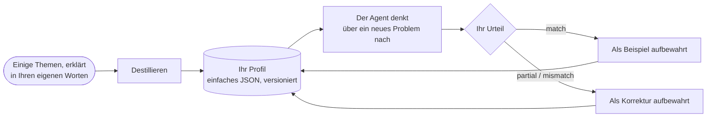

# Denkerprofile: wie eine bestimmte Person denken

::: tip Kann das SDK wie ich denken?
**Ja: Es kann nachahmen, wie eine bestimmte Person denkt.** Ein kognitiver Agent kann *Ihrer* Aufmerksamkeitsreihenfolge folgen, *Ihre* Prioritäten gewichten, *Ihre* Reflexe anwenden und verwerfen, was *Sie* verwerfen würden. Er lernt das aus einigen Problemen, die Sie in Ihren eigenen Worten erklären; jedes Mal, wenn Sie ihm sagen, wo er falschlag, wird die Korrektur zu seinen Anweisungen hinzugefügt, und Ihre Zustimmung zeigt, ob er näher herankommt.

Er ahmt eine **Denkweise** nach, keine Person: Er weiß nicht, was Sie nicht aufgeschrieben haben, und er entscheidet nicht an Ihrer Stelle. Das SDK behauptet nicht, wie nah es für Sie herankommt: **Sie messen es**, Lauf für Lauf, als den Prozentsatz an Zustimmung, den Sie seinen Antworten geben.
:::

{.illustration}

## Was „wie Sie denken“ bedeutet {#what-reasoning-like-you-means}

| Er ahmt nach | Er ahmt nicht nach |
| --- | --- |
| Die **Reihenfolge**, in der Sie ein Problem betrachten (zuerst, was es wirklich ermöglicht, dann seine Grenzen…) | Ihr **Wissen**: was Sie wissen, aber nie aufgeschrieben haben, es sei denn, Sie geben es als Kontext oder Beobachtungen mit |
| Ihre **Prioritäten** (was Ihnen am wichtigsten ist, der Reihe nach) | Ihre **Erinnerungen** und Ihr Leben: Er kennt nur die Samples, Korrekturen und den Kontext, die Sie ihm gegeben haben |
| Ihre **Reflexe** („wenn ein Dienst kostenpflichtig ist, suche ich zuerst eine kostenlose Alternative“) | Die Intuitionen, die Sie nie in Worte gefasst haben |
| Was Sie eine Idee **verwerfen** lässt | Ihre **Verantwortung**: Seine Antwort ist eine Vorhersage dessen, was Sie denken würden, keine für Sie getroffene Entscheidung |
| Ihre **Risikobereitschaft** | Ihre Gewissheit über die Welt: Aussagen brauchen weiterhin Belege, wie bei jedem kognitiven Agenten |
| Die **Fehler, die Sie korrigiert haben**: Er wird angewiesen, sie nicht zu wiederholen | |

## Wie es funktioniert, Schritt für Schritt {#how-it-works-step-by-step}



### Schritt 1: Erklären Sie einige Themen in Ihren eigenen Worten {#step-1-explain-a-few-topics-in-your-own-words}

Ein **Sample** ist ein Thema, über das Sie nachgedacht haben, so aufgeschrieben, wie es Ihnen in den Sinn kam. Unordentlich ist in Ordnung. Es hat drei Teile:

| Feld | Was Sie schreiben | Beispiel |
| --- | --- | --- |
| `topic` | Das Thema, in wenigen Worten | „Ein Roboter, der nur Küchen aufräumt“ |
| `reasoning` | Wie Sie herangegangen sind: was Sie zuerst betrachtet haben, was Sie geprüft haben, was Sie zögern ließ, warum | „Was macht er wirklich? Nur ein Raum, also liegt die Grenze bei der Verallgemeinerung. Könnte er aus wenigen Beispielen einen anderen Raum lernen?…“ |
| `conclusion` | Was Sie gefolgert haben oder tun würden (optional, wird aber zu einem Kalibrierungsbeispiel) | „Eine kleine adaptive Schleife bauen und sie in einem zweiten Raum testen“ |

Fünf bis zehn Samples zu **verschiedenen** Themen funktionieren besser als viele Samples zu einem einzigen Thema: Der Destillierer sucht nach dem, was sich **über** Themen hinweg wiederholt, und ein Muster, das nur einmal auftaucht, ist schwach.

### Schritt 2: Destillieren Sie Ihr Profil {#step-2-distill-your-profile}

```ts
const profile = await sdk.distillThinkerProfile({
  id: 'nicolas',
  name: 'Nicolas',
  model: 'gpt-4o',
  samples: [
    {
      topic: 'Typed decision APIs like Jev',
      reasoning:
        'What does it really allow? Then the limits: closed, US-only, paid. Is there an open clone? ' +
        'Could it become the controller of my agents? I would benchmark it on my own traces first.',
      conclusion: 'Use an open clone as the controller and benchmark it against Jev',
    },
    { topic: 'World models', reasoning: 'Structure beats scale. Test on a small chaotic system before anything big.' },
  ],
});
```

Was genau passiert:

1. Die Samples werden geprüft: Jedes braucht ein Thema und eine Argumentation.
2. Ein Aufruf des Sprachmodells übernimmt die Rolle eines *kognitiven Analysten*. Er sucht nach den **wiederkehrenden Operationen** Ihres Denkens, nicht nach Ihren Meinungen: was Sie zuerst untersuchen, welche Fragen Sie stellen, wie weit Sie eine Idee treiben, was Sie eine Lösung verwerfen lässt, Ihr Verhältnis zu Risiko, Kosten und Neuheit. Er wird angewiesen, nur Muster zu behalten, die von den Samples gestützt werden, und solche zu bevorzugen, die in mehreren Samples auftauchen.
3. Seine Antwort wird gegen das Profilschema validiert. Eine ungültige Antwort wird einmal mit dem Fehler zurückgeschickt; ein zweiter Fehlschlag wirft einen `ThoughtGenerationError`, statt ein halbfertiges Profil zurückzugeben.
4. Samples mit einer Schlussfolgerung werden als **Beispiele** im Profil aufbewahrt, sodass das Profil sowohl die extrahierte Methode als auch die Belege enthält, aus denen sie stammt.

Das Ergebnis ist einfaches JSON. **Lesen Sie es**: Wenn ein Schritt oder eine Priorität falsch ist oder fehlt, korrigieren Sie sie von Hand. Sie kennen sich besser als eine einzige Extraktion.

### Schritt 3: Lassen Sie den Agenten wie Sie denken {#step-3-let-the-agent-think-as-you}

```ts
const twin = sdk.createCognitiveAgent({
  name: 'my-twin',
  model: 'gpt-4o',
  profile,
  systemPrompt: "Write every statement and the answer in French, in the thinker's own voice.", // optional
});

const run = await twin.think({
  problem: 'A bank offers you a stable, well-paid CTO job maintaining legacy systems. What do you decide?',
});
console.log(run.decision?.status, run.decision?.answer);
```

Das Profil wird **beim Start des Laufs kopiert**, sodass eine Korrektur, die während eines Laufs gegeben wird, für den nächsten gilt. Es wird in die Anweisungen jedes Denkschritts geschrieben, und vom abschließenden Schritt `decide` wird *die Antwort, die der Denker geben würde*, verlangt, mit einer Begründung, die der Aufmerksamkeitsreihenfolge des Denkers folgt. [Wo das Profil Gewicht hat](#where-the-profile-weighs-and-where-it-never-does) listet jede Stelle auf.

### Schritt 4: Sagen Sie ihm, wo er falschlag {#step-4-tell-it-where-it-went-wrong}

Geben Sie nach einem Lauf Ihr **Urteil** ab: Hat er so gedacht, wie Sie es getan hätten?

```ts
// "Yes, exactly what I would have thought."
await twin.learnFromFeedback(run.runId, { verdict: 'match' });

// "No, I would have gone another way."
await twin.learnFromFeedback(run.runId, {
  verdict: 'mismatch',
  expected: 'Prototype with the free clone first, then compare with Jev on 100 real tickets',
  lesson: 'Always test the free option on real data before paying',
});

// "You are 50% right, and here is where you went wrong."
await twin.learnFromFeedback(run.runId, {
  verdict: 'partial',
  agreement: 0.5,
  wrongAbout: ['ignored the free option', 'overestimated the integration cost'],
  expected: 'Benchmark the open clone on our own tickets before deciding',
});
```

| Feld | Bedeutung | Erforderlich |
| --- | --- | --- |
| `verdict` | `match` (er hat wie Sie gedacht), `partial` (teilweise), `mismatch` (gar nicht) | Immer |
| `agreement` | Wie weit Sie zustimmen, von 0 bis 1: `0.8` bedeutet „zu 80 % richtig“ | Nein |
| `expected` | Was Sie stattdessen gefolgert hätten | Bei `partial` und `mismatch` |
| `wrongAbout` | Wo das Denken falschlag, in Ihren Worten | Nein |
| `lesson` | Die Regel, die er sich für das nächste Mal merken soll (Standard: `expected`) | Nein |
| `notes` | Alles andere, im Ereignis aufbewahrt | Nein |

Was damit geschieht:

| Urteil | Wirkung auf das Profil |
| --- | --- |
| `match` | Der Lauf wird zu einem **Kalibrierungsbeispiel**: seine Frage, eine Zusammenfassung seiner Denkschritte und seine Schlussfolgerung. Jedes `match` behält die 10 jüngsten Beispiele, destillierte Samples eingeschlossen. |
| `partial` / `mismatch` | Eine **Korrektur** wird aufgezeichnet: was der Agent gefolgert hat, was Sie erwartet haben, Ihre Zustimmung, wo er falschlag und die Lektion. Die 20 jüngsten werden behalten. Korrekturen bilden den Abschluss des Profils in den Anweisungen jedes Denkschritts, mit höchster Priorität: „Diese Fehler nicht wiederholen.“ Der Jev-Controller sieht die letzten fünf Lektionen. |

Jedes Urteil erhöht die Patch-Version des Profils (`1.0.0` → `1.0.1`) und wird dem Lauf als Ereignis `cognition.feedback` angehängt, mit der Profilversion davor und danach. Ein Lauf ohne Entscheidung kann kein Feedback erhalten: Es gibt nichts zu beurteilen.

`learnFromFeedback` gibt das verfeinerte Profil zurück und behält es im Agenten. **Speichern Sie es** (`twin.getProfile()` ist einfaches JSON), sonst gehen die Lektionen verloren, wenn Ihr Prozess endet.

### Schritt 5: Messen Sie, wie nah er herankommt {#step-5-measure-how-close-it-gets}

Das SDK zeichnet Ihre Urteile auf; es bewertet sich nicht selbst. Um zu wissen, ob er wirklich wie Sie denkt, folgen Sie einem einfachen Protokoll:

1. Bereiten Sie **neue Probleme** vor, die der Agent nie gesehen hat, zu verschiedenen Themen.
2. **Schreiben Sie zuerst Ihre eigene Antwort**, bevor Sie die des Agenten lesen, damit seine Antwort Ihre nicht beeinflusst.
3. Führen Sie den Agenten aus und bewerten Sie dann jede Antwort: `agreement`, worin er falschlag (`wrongAbout`), was Sie erwartet haben (`expected`).
4. Geben Sie dieses Feedback und speichern Sie das verfeinerte Profil.
5. Verwenden Sie in der nächsten Runde **wieder neue Probleme** und vergleichen Sie die durchschnittliche Zustimmung mit der vorherigen Runde.

Steigt der Durchschnitt bei Problemen, die er nie gesehen hat, ist das ein Zeichen, dass er Ihre *Art* zu denken aufnimmt und nicht nur die Antworten, die Sie korrigiert haben; bei einer Handvoll Problemen kann ein Anstieg aber auch Zufall sein, machen Sie also mehrere Runden. Verbessert er sich nur bei den Problemen, die Sie korrigiert haben, kopiert er Antworten.

```ts
const scores = [0.4, 0.6, 0.5]; // the agreement you gave this round
const average = scores.reduce((sum, value) => sum + value, 0) / scores.length; // 0.5, that is 50%
```

## Anatomie eines Profils {#anatomy-of-a-profile}

Sie können ein Profil auch von Hand schreiben:

```ts
import { defineThinkerProfile } from '@sdk-ai-agents/core';

const builder = defineThinkerProfile({
  id: 'builder',
  name: 'Pragmatic builder',
  summary: 'Looks for what a technology really enables, then its limits, then a prototype.',
  reasoningSequence: [
    { id: 'real-capability', instruction: 'Establish what the technology really enables' },
    { id: 'limits', instruction: 'Look for its limits immediately' },
    { id: 'workaround', instruction: 'Imagine how to work around those limits' },
    { id: 'product', instruction: 'Check whether it can become a product' },
    { id: 'automation', instruction: 'Ask how the product could run itself' },
    { id: 'generalize', instruction: 'Extrapolate towards a more general architecture' },
    { id: 'prototype', instruction: 'Design the smallest prototype that tests it' },
  ],
  priorities: ['Real capability over hype', 'Free and open options first', 'Fast feedback'],
  heuristics: [{ when: 'a service is paid and closed', action: 'look for an open alternative before paying' }],
  rejectionCriteria: ['Cannot be tested with a prototype', 'Locks data in a vendor'],
  riskAppetite: 'high',
});

const agent = sdk.createCognitiveAgent({ name: 'me', model: 'gpt-4o', profile: builder });
```

`defineThinkerProfile` validiert das Profil und ergänzt Fehlendes mit Standardwerten (leere Listen, `riskAppetite: 'medium'`, `version: '1.0.0'`).

| Feld | Einfach erklärt | Wie die Engine es verwendet |
| --- | --- | --- |
| `id`, `name`, `version` | Wen dieses Profil beschreibt und welche Revision davon | In jedem Lauf aufgezeichnet, sodass Sie wissen, welche Profilversion ihn erzeugt hat |
| `summary` | Ein Satz, der den Stil beschreibt | Steht in den Prompts oben im Profil |
| `reasoningSequence` | Die Schritte, die Sie der Reihe nach durchlaufen | Geschrieben als „Order of attention (follow it)“; die endgültige Antwort folgt ihr |
| `priorities` | Was am wichtigsten ist, das Wichtigste zuerst | In die Prompts geschrieben; dient dazu, zu beurteilen, wie gut eine Wahl zu Ihnen passt |
| `heuristics` | Ihre Reflexe: „wenn …, dann …“ | Als Regeln in die Prompts geschrieben |
| `rejectionCriteria` | Was Sie eine Idee fallen lassen lässt | Dient dazu, Optionen zu kritisieren und die zu verwerfen, die Sie verwerfen würden |
| `riskAppetite` | `low`, `medium` oder `high` | In die Prompts geschrieben |
| `examples` | Läufe und Samples, die Sie bestätigt haben | Gezeigt als „validated examples of their reasoning“: Das Modell kalibriert sich daran |
| `corrections` | Lektionen aus Läufen, mit denen Sie nicht einverstanden waren | Am Ende des Profils gezeigt, mit höchster Priorität |

Ohne Profil verwenden Agenten `DEFAULT_THINKER_PROFILE`, einen neutralen Analysten, für den die Belege an erster Stelle stehen.

## Wo das Profil Gewicht hat und wo nie {#where-the-profile-weighs-and-where-it-never-does}

| Moment des Denkens | Zählt Ihr Profil? |
| --- | --- |
| **Jeder Denkschritt** (darstellen, Hypothesen bilden, simulieren, kritisieren, vergleichen, entscheiden, ein Tool-Ergebnis lesen) | Ja: Das ganze Profil steht in den Anweisungen, die das Sprachmodell erhält. Nur die kurze Anfrage, die auswählt, welches Tool aufgerufen wird, lässt es weg |
| **Den nächsten Schritt wählen** | Mit dem Jev-Controller ja: Er sieht Ihre Aufmerksamkeitsreihenfolge, Prioritäten, Ausschlusskriterien, Risikobereitschaft und Ihre letzten fünf Lektionen. Ohne Jev folgt der heuristische Controller einer festen Reihenfolge, und Ihr Profil prägt stattdessen den Inhalt jedes Schritts |
| **Kritik** | Ja: Optionen werden mit Ihren Ausschlusskriterien angegriffen |
| **Wie gut eine Wahl zu Ihnen passt** (`preferenceFit`) | Ja: Genau dafür ist sie da. Eine Wahl, die als Verstoß gegen eines Ihrer Ausschlusskriterien beurteilt wird, rückt nach unten und wird verworfen, wenn sich der Richter dessen sicher ist (Jev legt seine ganze Wahrscheinlichkeit auf diese Stufe) oder, bei einem Sprachmodell als Richter, wenn das Modell sie verwirft |
| **Wie gut die Belege eine Option stützen** (`support`) | **Nein.** Mit Jev wird diese Frage ohne Ihr Profil gestellt; bei einem Sprachmodell wird das Modell angewiesen, Präferenzen zu ignorieren |
| **Welche Handlungswahl an erster Stelle steht** | Ja, bei Handlungswahlen, standardmäßig mit einem Gewicht von 40 % |
| **Ob eine Handlungswahl verbindlich werden darf** | Ja, wenn Sie sie klar bevorzugen und die Fakten nicht dagegen sprechen |
| **Ob eine Aussage über die Welt glaubwürdig ist** | **Nie** im Code: Die beiden Werte werden nie gemischt. Bei einem Sprachmodell als Richter beruht die Trennung auf seinen Anweisungen, und eine Aussage, die das Modell fälschlich als Wahl kennzeichnet, könnte den Präferenzweg nehmen (siehe [Angegebene Arten](./evidence-and-verification#not-there-yet)) |

### Die beiden Werte {#the-two-scores}

Wenn Optionen verglichen werden, erhält jede bis zu zwei Werte zwischen 0 und 1:

| Wert | Frage | 0 | 0,25 | 0,5 | 0,75 | 1 |
| --- | --- | --- | --- | --- | --- | --- |
| `support` | Wie gut stützen die Fakten, Beobachtungen, Tests und Kritiken sie? | Widerlegt | Schwach gestützt | Plausibel | Stark gestützt | Gesichert |
| `preferenceFit` | Wie gut passt diese Wahl zum Denker? (nur Handlungswahlen) | Erfüllt ein Ausschlusskriterium | Schlechte Passung | Akzeptable Passung | Gute Passung | Ideale Passung |

Das sind die Stufen, nach denen der Jev-Assessor fragt; ein Sprachmodell als Richter vergibt für jeden Wert eine Zahl zwischen 0 und 1, die gleich gelesen wird. Beides sind Beurteilungen, keine gemessenen Wahrscheinlichkeiten.

### Wie eine Wahl eingeordnet und verbindlich wird {#how-a-choice-is-ranked-and-committed}

Nehmen Sie das Problem mit der Stelle bei der Bank von oben, mit zwei Optionen:

| Option | `support` | `preferenceFit` | Rangwert: 60 % Stützung + 40 % Passung |
| --- | --- | --- | --- |
| H1: die Stelle annehmen | 0,5 (plausibel) | 0,25 (schlechte Passung: nichts Neues zu bauen) | 0,6 × 0,5 + 0,4 × 0,25 = **0,40** |
| H2: ablehnen und weiter bauen | 0,5 (plausibel) | 1 (ideale Passung) | 0,6 × 0,5 + 0,4 × 1 = **0,70** |

Die Fakten stützen beide Optionen gleich; Ihre Präferenzen setzen H2 an die erste Stelle. Das Gewicht ist `limits.preferenceWeight` (0,4).

Um **verbindlich** zu werden (eine feste Antwort statt einer vorläufigen oder einer Enthaltung), muss eine Option die [Abschlussprüfung](./evidence-and-verification#the-conclusion-guard) bestehen. Ihre Belege reichen auf einem von zwei Wegen aus:

- **allein durch die Belege**, für jede Art von Hypothese: `support` von mindestens `limits.decisionThreshold` (0,75, „stark gestützt“);
- **durch Ihre Wahl**, nur für eine Handlungswahl: `preferenceFit` von mindestens `limits.decisionThreshold` (0,75, „gute Passung“) **und** `support` von mindestens `limits.minProposalSupport` (0,35, etwas über „schwach gestützt“).

H2 nimmt den zweiten Weg: Stützung 0,5 ≥ 0,35, Passung 1 ≥ 0,75. Sie wird mit einer **Konfidenz von 0,5** verbindlich, weil die Konfidenz einer Entscheidung nie ihre Evidenzstützung übersteigt: Die Antwort sagt „das ist die Wahl des Denkers“, nicht „das ist bewiesen“.

Warum es den zweiten Weg gibt: Eine Frage wie *„Würden Sie diese Stelle annehmen?“* bietet wenig Belege zum Abwägen. Eine Person entscheidet sie nach ihren Prioritäten, sofern die Fakten nicht gegen die Wahl sprechen. In einem echten Lauf mit einem Denkerprofil endeten solche Fragen ohne verbindliche Antwort, bevor es diesen zweiten Weg gab.

Warum er Aussagen verschlossen ist: Eine Aussage wie *„die KI dieses Start-ups erkennt Lügen mit 99 % Genauigkeit“* ist eine **Regel** über die Welt. Selbst wenn Sie es sich noch so sehr wünschen, wird sie nur verbindlich, wenn ihre Evidenzstützung 0,75 erreicht, sofern das Modell sie als Regel kennzeichnet, wozu es angewiesen wird (siehe [Angegebene Arten](./evidence-and-verification#not-there-yet)). Präferenzen können wählen, was zu tun ist; sie machen nie etwas wahr.

## Limits {#limits}

- **Das Modell zählt.** Das Profil ist eine Sammlung von Anweisungen: Ein kleines Modell befolgt sie weniger getreu als ein großes.
- **Es weiß nur, was Sie ihm gegeben haben.** Geben Sie die Fakten Ihrer Situation als `context` oder `observations` mit, wenn sie wichtig sind.
- **Ein erstes Profil ist eine Skizze.** Eine Handvoll Samples ergibt eine Handvoll Muster; erst die Korrekturen verfeinern es.
- **Sein Gedächtnis ist begrenzt.** 20 Korrekturen werden behalten, und jedes `match` behält die 10 jüngsten Beispiele (ein destilliertes Profil kann mit mehr beginnen); die ältesten fallen weg.
- **Treue ist nicht Wahrheit.** Ihr Feedback misst, ob der Agent **wie Sie** gedacht hat, nicht ob er **recht** hatte. Um eine Aussage an der Welt zu prüfen, geben Sie dem Agenten einen [Ergebnis-Evaluator](./evidence-and-verification#predictions-and-the-outcome-evaluator).
- **Es sind personenbezogene Daten.** Samples, Profile und die Ereignisse dieser Läufe beschreiben, wie eine Person denkt. Speichern Sie sie vertraulich, nie in einem öffentlichen Repository, und holen Sie eine Einwilligung ein, bevor Sie ein Profil von jemand anderem erstellen.

## Profile sind Daten {#profiles-are-data}

Profile sind einfaches JSON: Speichern Sie sie, wo Sie möchten, und laden Sie sie mit `agent.setProfile(profile)` oder der Option `profile` wieder. Ereignisse tragen `profileId` und `profileVersion`, sodass Sie immer wissen, welche Profilversion einen Lauf erzeugt hat.

## Ihren eigenen Controller trainieren {#train-your-own-controller}

Jede Wahl einer Operation wird mit dem Zustand aufgezeichnet, den der Controller gesehen hat. Exportieren Sie sie als JSON Lines:

```ts
const jsonl = await sdk.exportControllerDataset(); // or pass runIds
```

```json
{"runId":"run_…","step":3,"state":{…},"available":["hypothesize","simulate","critique","decide"],"operation":"simulate","controller":"jev","confidence":0.82,"usedFallback":false,"runStatus":"completed","feedback":"partial","agreement":0.5}
```

Filtern Sie nach `feedback: "match"`, und Sie haben überwachte Beispiele *Ihrer* Art, den nächsten Schritt zu wählen: genug, um ein kleines offenes Modell feinabzustimmen und es als eigenen `CognitiveController` einzustecken, ohne Kosten pro Aufruf.
