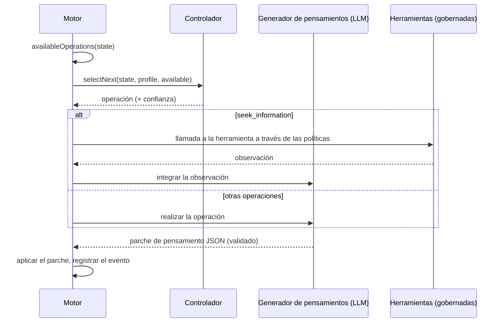

# Agentes cognitivos

Un agente cognitivo no responde en una sola pasada. Mantiene un **estado mental explícito** y lo mejora con una **operación cognitiva** cada vez, hasta que puede comprometerse con una decisión que es capaz de justificar.

::: tip En palabras sencillas
Una IA habitual responde de una vez, y su razonamiento desaparece. Un agente cognitivo trabaja como alguien con una libreta: anota lo que sabe, lo que supone y lo que todavía no sabe, enumera varias opciones, imagina sus consecuencias, busca lo que podría salir mal, comprueba los hechos con las herramientas que le permitiste, compara las opciones y solo entonces decide. Cada uno de estos movimientos es una **operación**, y cada uno se escribe en la libreta, de modo que después puedes releer todo el razonamiento. Si no puede llegar a una conclusión sólida, lo dice. Cada término de esta página se explica en [Términos clave en palabras sencillas](./glossary#how-a-cognitive-agent-reasons).
:::

{.illustration style="max-width:460px"}

```ts
const agent = sdk.createCognitiveAgent({
  name: 'analyst',
  model: 'gpt-4o',
  tools: [lookupMetric],
  profile: myProfile, // optional, see Thinker profiles
});

const { status, answer, decision, state, runId } = await agent.think({
  problem: 'Should we build or buy our analytics module?',
  context: { budget: '10k EUR', deadline: 'before Q4' },
  observations: [{ content: 'Churn was 4% last month', originGroup: 'billing' }], // optional
});

decision?.status; // 'committed' | 'provisional' | 'abstain'
```

::: tip La evidencia primero
Cómo se trazan las observaciones, cómo se prueban las predicciones y cómo se protegen las conclusiones se describe en [Evidencia y verificación](./evidence-and-verification).
:::

## El estado mental {#the-mental-state}

El estado mental son datos simples y tipados. Cada elemento recibe un identificador estable al que el modelo puede referirse.

| Parte | Identificadores | Qué contiene |
| --- | --- | --- |
| `observations` | `O1…` | Lo que se observó — dado con el problema, devuelto por una herramienta o por una prueba — con su procedencia |
| `facts` | `F1…` | Afirmaciones con un origen (`input`, `tool`, `inference`), las observaciones de las que proceden y un estado (`active`, `superseded`, `retracted`) |
| `assumptions` | `A1…` | Lo que el razonamiento da por sentado |
| `constraints` | `K1…` | Lo que cualquier respuesta debe respetar |
| `unknowns` | `U1…` | Preguntas abiertas — `open`, `resolved` o `dropped`, con el número de intentos |
| `hypotheses` | `H1…` | Propuestas, reglas o explicaciones con premisas, simulaciones, críticas, un respaldo de la evidencia (`support`), un `preferenceFit` y un estado |
| `comparisons` | `R1…` | Relaciones entre observaciones: similitud, diferencia, evolución, incompatibilidad, contraejemplo |
| `predictions` | `P1…` | Lo que predice una hipótesis, lo que la refutaría y el resultado de la prueba |
| `contradictions` | `C1…` | Conflictos entre elementos, con una categoría, hasta que se resuelven citando evidencia |
| `failures` | `X1…` | Lo que ya falló, para no volver a intentarlo a ciegas |
| `knowledge` | `M1…` | Lo que ejecuciones anteriores del mismo ámbito establecieron con pruebas reales, recuperado al iniciarse la ejecución (consulta [Memoria entre ejecuciones](./memory)) |
| `confidence`, `evidenceRevision` | | Respaldo de la evidencia de la mejor respuesta; un contador que hace obsoletas las valoraciones anteriores |
| `decision`, `trail` | | La decisión final y su estado, una línea por paso |

{.illustration style="max-width:760px"}

El estado **nunca se edita en el sitio**. Cada operación produce un *parche de pensamiento*; el parche se registra como un evento `cognition.thought`; el estado es el resultado de aplicar todos los parches en orden. Por eso `sdk.getMentalState(runId)` puede reconstruir exactamente cualquier ejecución, incluso meses después.

## Las operaciones {#the-operations}

| Operación | Qué hace | Disponible cuando |
| --- | --- | --- |
| `represent` | Extrae hechos, supuestos, restricciones e incógnitas | Siempre la primera; de nuevo cuando hay una contradicción abierta |
| `compare_observations` | Relaciona las observaciones: similitudes, diferencias, cambios, contraejemplos | Hay dos o más observaciones comparables (sin contar duplicados ni resultados de pruebas), con nuevas desde la última comparación |
| `hypothesize` | Plantea nuevas propuestas, reglas o explicaciones | Hay menos hipótesis activas que `maxHypotheses` |
| `simulate` | Proyecta las consecuencias paso a paso y formula predicciones comprobables | Una hipótesis no tiene simulación |
| `test_prediction` | Ejecuta tu evaluador de resultados sobre una predicción registrada — sin llamada al LLM | Hay un evaluador configurado, una predicción pendiente y presupuesto de pruebas restante |
| `revise` | Convierte una hipótesis contradicha por la evidencia en una variante de ámbito acotado | Una hipótesis refutada o contradicha todavía no tiene variante |
| `critique` | Encuentra las razones más fuertes por las que una hipótesis podría fallar | Una hipótesis no tiene crítica |
| `seek_information` | Llama a una herramienta gobernada para responder a una incógnita abierta | Hay herramientas, una incógnita abierta y presupuesto de herramientas restante |
| `compare` | Juzga el respaldo de la evidencia y cuánto le convienen las propuestas al pensador | Una hipótesis criticada cambió, o la evidencia cambió, desde la última comparación |
| `decide` | Se compromete con una respuesta, una justificación, una confianza y unas próximas acciones | Una hipótesis supera la [guarda de conclusión](./evidence-and-verification#the-conclusion-guard) |

**El código decide lo que es posible, el controlador decide lo que es útil.** Las condiciones previas se calculan a partir del estado, y el controlador solo puede elegir entre las operaciones disponibles.

Reglas impuestas en el código, diga lo que diga el modelo:

- una crítica `fatal` sin réplica, o una predicción refutada, rechaza su hipótesis;
- una hipótesis rechazada no puede reactivarse, volver a plantearse ni seleccionarse — solo revisarse en una variante que diga qué cambió;
- el código nunca mezcla preferencias en el respaldo de la evidencia de una afirmación, y el modelo no puede fijar la confianza del estado;
- una contradicción se resuelve una sola vez, y solo citando las observaciones o los hechos que la zanjan;
- un paso que no cambió nada de lo que debía cambiar, o una decisión aplazada, cuenta como un intento fallido; tras dos seguidos, la operación deja de ofrecerse hasta que otro paso aporte evidencia nueva (consulta [Un presupuesto que no se desperdicia](./evidence-and-verification#a-budget-that-is-not-wasted));
- la procedencia (observaciones, resultados de pruebas) y el estado de la decisión los escribe el motor: se eliminan de una respuesta del modelo que los contenga;
- las referencias a identificadores desconocidos se ignoran y se notifican como `issues` en el evento del pensamiento;
- como mucho hay `maxHypotheses` hipótesis en juego: las propuestas sobrantes se descartan y se notifican;
- una incógnita deja de investigarse tras dos intentos sin éxito, o de inmediato cuando ninguna herramienta disponible puede responderla, y la reformulación (`represent` ante una contradicción) se ofrece como máximo tres veces;
- una operación fallida se registra como fallida y no cuenta como hecha;
- el **último paso es siempre un intento de decisión**: una respuesta que no supera la guarda de conclusión pasa a ser `provisional` (con lo que falta) o una `abstain`; si el modelo no puede producir ninguna decisión, el motor se abstiene y registra por qué.

## Controladores {#controllers}

El controlador elige la siguiente operación.



| Controlador | Cómo elige | Cuándo usarlo |
| --- | --- | --- |
| `heuristic` | Un orden de atención fijo: representar → revisar → comparar observaciones → formular hipótesis → simular → probar predicciones → criticar → buscar información → comparar → decidir | Por defecto sin Jev, determinista, gratuito |
| `typed` | Una solicitud a Jev por paso: un Choice entre las operaciones disponibles y un Noul "¿listo para decidir?" | Razonamiento adaptativo con confianza calibrada |
| el tuyo propio | Implementa `CognitiveController.selectNext()` | Un modelo local ajustado, reglas de negocio, … |

Con `controller: 'auto'` (el valor por defecto), el agente usa Jev cuando el SDK tiene un backend de decisiones tipadas, y la heurística en caso contrario. El controlador tipado **recurre a la heurística** cuando la confianza del Choice está por debajo de `minConfidence` (0,35), cuando el cliente falla o cuando la respuesta no es una operación disponible. Un controlador personalizado que lanza una excepción o devuelve una operación no disponible también se sustituye por la heurística. Cada recurso a la heurística se registra en el campo `fallbackFrom` del evento de selección.

```ts
sdk.createCognitiveAgent({
  name: 'analyst',
  model: 'gpt-4o',
  controller: 'typed',
  controllerOptions: { minConfidence: 0.5, readinessThreshold: 0.85 },
  assessment: 'typed', // compare hypotheses with Jev Score questions
});
```

## Herramientas dentro del razonamiento {#tools-inside-reasoning}

`seek_information` usa los **motores nativos de razonamiento y de acciones**: el LLM elige una herramienta para la incógnita abierta, el motor de acciones comprueba que la herramienta **se dio a este agente**, valida la llamada contra las políticas (límites de ejecución incluidos, consulta [Límites y políticas](#limits-and-policies)), las aprobaciones y los presupuestos, y el resultado se registra como una **observación** que apunta a su evento `action.executed`, y después se integra como hechos con `source: "tool"`. La observación se conserva aunque falle su interpretación. Una herramienta denegada, bloqueada o que falla se convierte en un fallo registrado, y el razonamiento continúa.

## Límites {#limits}

```ts
sdk.createCognitiveAgent({
  name: 'analyst',
  model: 'gpt-4o',
  limits: {
    maxSteps: 12,              // the last one always decides
    timeoutMs: 180_000,
    maxHypotheses: 3,          // in play at the same time
    maxToolCalls: 5,
    decisionThreshold: 0.75,   // evidence support a committed answer needs (see minProposalSupport)
    maxConsecutiveFailures: 3, // then the run fails (and alerts you, if incidents are on)
    maxPredictionTests: 4,     // calls to the outcome evaluator per run
    preferenceWeight: 0.4,     // weight of the thinker's preferences when ranking proposals
    minProposalSupport: 0.35,  // evidence support enough for a choice of action the thinker clearly prefers
  },
  evaluator: myBench,          // optional OutcomeEvaluator, enables test_prediction
  knowledge: { store, scope: 'my-domain' }, // optional memory across runs
});
```

Los límites se validan al crear el agente: `maxSteps: 0` o un tiempo límite superior a lo que admite un temporizador lanza un `ValidationError` en lugar de desactivar en silencio una salvaguarda. `minProposalSupport` no puede superar `decisionThreshold`; ponlo igual a `decisionThreshold` para que solo la evidencia pueda hacer firme una respuesta. Si bajas `decisionThreshold` sin fijar `minProposalSupport`, el mínimo baja con él.

### Límites y políticas {#limits-and-policies}

Las políticas de presupuesto y de tiempo límite que se aplican al agente — las de sus `policies` y las globales — se comprueban **antes de cada paso**, antes de cualquiera de sus llamadas al modelo, y de nuevo antes de cada llamada a herramienta. Ven el progreso de la ejecución: `maxSteps` cuenta los pasos ya dados, `maxTokens` los tokens de las llamadas al modelo de la ejecución (pensamientos y sus reparaciones, selecciones de herramienta, decisiones tipadas, respuestas que el proveedor no pudo usar) y `maxDuration` el tiempo transcurrido desde el inicio de la ejecución. Los presupuestos de tokens y de coste por periodo (`budgetLimit` con `maxTokens` o `maxCost`, sin `toolName`) también se comprueban antes de cada paso, y cada llamada al modelo que registra la ejecución cuenta en ellos (consulta [Costes de API](./costs#budgets)). Un paso se comprueba como una intención de tipo `continue`: una política cuyas condiciones exigen una llamada a herramienta (`intention.type` igual a `tool_call`) solo se aplica a las llamadas a herramientas. Las listas de permitidos, las políticas personalizadas, los presupuestos de llamadas (`maxToolCalls`) y las aprobaciones solo afectan a las llamadas a herramientas, igual que una regla de límite cuya acción es `require_approval`: un paso nunca espera una aprobación. La comprobación de cada paso figura en la auditoría de políticas (`sdk.getPolicyAuditTrail`), para las políticas que pueden aplicarse a un paso.

El primer límite alcanzado termina la ejecución (los límites de llamadas a herramientas solo omiten llamadas), y los dos tipos de límites no la terminan de la misma manera:

| Límite | `limits` del agente | Políticas |
| --- | --- | --- |
| Pasos | `maxSteps`: el último paso decide; `completed`, con una decisión `committed`, `provisional` o `abstain` | `maxSteps`: el paso siguiente se rechaza; `failed` |
| Tiempo | `timeoutMs`: la ejecución se interrumpe y una llamada en curso recibe la señal de interrupción; `failed`, `Timeout exceeded (… ms)` | `maxDuration`: se comprueba entre pasos y antes de las llamadas a herramientas, y una llamada en curso sigue; `failed`, `Timeout (… ms) exceeded` |
| Tokens, coste | — | `maxTokens`, presupuestos por periodo: el paso siguiente se rechaza; `failed` |
| Llamadas a herramientas | `maxToolCalls`: `seek_information` deja de ofrecerse | Una llamada rechazada es un fallo registrado, y el razonamiento continúa |

Un paso rechazado se registra como `policy.violated` — con `intention: { type: 'continue' }`, el paso (`step`), el motivo (`reason`) y las políticas incumplidas (`violatedPolicies`) — y después `run.failed` con el motivo de la política; el resultado tiene `status: 'failed'` y un `PolicyViolationError` como `error`. Una llamada a herramienta rechazada por un límite de ejecución se registra como `policy.violated` y como una operación fallida; como el límite sigue superado, el paso siguiente se rechaza y la ejecución falla. Para terminar con una decisión en lugar de un rechazo, mantén el `maxSteps` del agente igual o por debajo del de la política: su último paso decide entonces antes de que la política rechace nada.

## Salida no válida del modelo {#invalid-model-output}

Cada operación tiene un contrato JSON estricto validado por Zod. Una respuesta que no es JSON válido, a la que le falta su campo obligatorio o que usa un valor incorrecto se devuelve **una vez** con el error de validación. Los campos que una operación no puede escribir (una `decision` durante `simulate`, por ejemplo) se ignoran y se enumeran en `ignoredFields`. Si la reparación también falla, la operación se registra como un fallo y el bucle continúa.

## Detener, cancelar, agotar el tiempo {#stop-cancel-time-out}

```ts
const pending = agent.think({ problem });
await agent.stop();          // or agent.stop(runId)
const result = await pending; // status: 'cancelled'
```

Un tiempo límite agotado produce `status: 'failed'` con `Timeout exceeded (… ms)`, y la ejecución se marca como fallida en el registro de eventos. `sdk.stopRun(runId)` también detiene las ejecuciones cognitivas. El tiempo límite y la detención se comprueban entre operaciones y se pasan a tu proveedor como señal de cancelación; los proveedores integrados de OpenAI y Anthropic no cancelan una solicitud que ya está en curso, así que una llamada lenta termina con el propio tiempo límite del proveedor.

Se hace una **instantánea del perfil al iniciarse una ejecución**: la retroalimentación dada mientras una ejecución está en curso se aplica a la siguiente ejecución.

## Seguridad {#security}

Un agente cognitivo lee texto que no ha escrito él: resultados de herramientas, descripciones de herramientas MCP, documentos del contexto. Trátalo todo como **entrada no fiable** — puede contener instrucciones dirigidas al modelo (inyección de prompts). El SDK limita lo que ese texto puede conseguir:

- el agente solo puede llamar a las herramientas que se le dieron, y las políticas se comprueban en cada llamada — pon las herramientas destructivas detrás de políticas `require_approval`;
- el modelo nunca ejecuta nada por sí mismo: propone, y el motor de acciones valida;
- los invariantes del estado mental se imponen en el código, no mediante el prompt;
- cada llamada a herramienta y cada pensamiento están en el registro de eventos para su revisión.

El registro de eventos guarda el objetivo, el contexto y cada pensamiento, y los eventos `decision.evaluated` guardan el contexto enviado a Jev. Aplica al almacén de eventos que elijas las reglas de conservación y de anonimización que exijan tus datos.

## Repetición y auditoría {#replay-and-audit}

Una ejecución cognitiva es una ejecución normal:

- `sdk.getTrace(runId)` muestra los eventos `cognition.*` junto a `policy.checked`, `tool.called`, …
- `sdk.replay(runId)` vuelve a ejecutar sus llamadas a herramientas sin llamar al LLM y reproduce la respuesta final — con la misma restricción de herramientas que la ejecución original, de modo que una herramienta que se le denegó al agente se vuelve a denegar, y con el progreso de la ejecución en cada llamada, de modo que una llamada que rechazó un límite de ejecución se vuelve a rechazar;
- `sdk.getMentalState(runId)` reconstruye el estado;
- `sdk.exportControllerDataset()` convierte las ejecuciones en datos de entrenamiento (consulta [Perfiles de pensador](./thinker-profiles#train-your-own-controller)).
