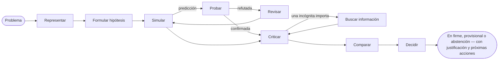

# Introducción

**SDK AI Agents** es un SDK de TypeScript para crear agentes de IA en los que puedes confiar en producción: agentes que razonan de forma explícita antes de actuar, a los que se puede enseñar cómo piensas *tú*, y en los que cada paso está gobernado, trazado, con su coste calculado y se puede repetir.

{.illustration style="max-width:460px"}

## ¿Por qué otro SDK de agentes? {#why-another-agent-sdk}

Las API de LLM te dan un generador de texto muy capaz. Lo que no te dan es el control sobre **cómo** se llega a una conclusión:

- el razonamiento ocurre dentro del modelo, en una sola pasada, y desaparece en cuanto se imprime la respuesta;
- nada impide que el modelo actúe basándose en una suposición, llame a la herramienta equivocada o gaste de más;
- cuando algo sale mal, tienes un prompt y una respuesta — no una historia.

Este SDK coloca una capa de razonamiento **alrededor** del modelo. El LLM pasa a ser un componente entre otros:

| Capa | Qué hace | Dónde vive |
| --- | --- | --- |
| **Estado mental** | Hechos, supuestos, restricciones, incógnitas, hipótesis, contradicciones, confianza | Se reconstruye a partir de los eventos en cualquier momento |
| **Controlador** | Elige la siguiente operación cognitiva | Heurística determinista, decisiones tipadas de Jev o el tuyo propio |
| **Generador de pensamientos** | Realiza una operación y devuelve un parche JSON validado | Cualquier proveedor de LLM |
| **Perfil de pensador** | El orden de atención, las prioridades y las heurísticas de una persona | Datos versionados, refinados con la retroalimentación |
| **Gobernanza** | Políticas, listas de permitidos, presupuestos, aprobaciones, reintentos | Se comprueba antes de cada acción |
| **Almacén de eventos** | La única fuente de verdad | Archivo, SQLite o PostgreSQL |

## Dos tipos de agentes {#two-kinds-of-agents}

Los **agentes gobernados** (`sdk.createAgent`) ejecutan el bucle clásico de llamadas a herramientas — el LLM propone una intención, el motor de acciones la valida y la ejecuta. Son ideales para tareas bien definidas.

Los **agentes cognitivos** (`sdk.createCognitiveAgent`) razonan de forma explícita. Están hechos para decisiones: elegir una arquitectura, clasificar un incidente, evaluar una oportunidad, responder a preguntas del tipo "¿deberíamos…?".

Ambos tipos comparten las mismas herramientas, políticas, almacén de eventos, repetición, costes y alertas de incidentes.

## ¿Puede razonar como una persona concreta? {#can-it-reason-like-a-given-person}

**Sí.** Un agente cognitivo puede imitar la forma de razonar de una persona concreta. Explicas algunos temas con tus propias palabras; el SDK extrae de ellos un **perfil de pensador**: el orden en que examinas un problema, tus prioridades, tus reflejos, lo que te hace rechazar una idea, tu apetito de riesgo. Ese perfil se escribe en las instrucciones de cada paso de su razonamiento. Después de cada ejecución dices hasta qué punto estás de acuerdo (por ejemplo "acertado en un 60 %, y aquí es donde te equivocaste"), y la lección se conserva para las siguientes ejecuciones.

Lo que imita es una **forma de razonar**: no sabe lo que nunca pusiste por escrito, no decide en tu lugar, y tus preferencias nunca hacen más creíble una afirmación sobre el mundo. El SDK no se califica a sí mismo: el porcentaje de acuerdo que das ejecución tras ejecución, sobre problemas que nunca ha visto, es lo que te dice cuánto se acerca. [Razonar como una persona concreta](./thinker-profiles) explica cada paso.

## Qué obtienes {#what-you-get}

- **Razonamiento explícito** — diez operaciones sobre un estado mental, con invariantes impuestos en el código (una hipótesis rechazada no puede seleccionarse, una crítica fatal rechaza una hipótesis, el último paso siempre concluye).
- **Evidencia que puedes auditar** — observaciones con su procedencia, predicciones puestas a prueba por tu propio evaluador, reglas refutadas revisadas en variantes de ámbito acotado, preferencias separadas de la evidencia, y una guarda de conclusión que responde `committed`, `provisional` o `abstain`; con un almacén de conocimiento, lo que respondieron las pruebas se recuerda para las siguientes ejecuciones.
- **Razonar como una persona concreta**: destila un perfil de pensador a partir de temas explicados con tus propias palabras, y después corrige al agente con veredictos `match`, `partial` o `mismatch` y un porcentaje de acuerdo.
- **Decisiones tipadas** — [TypeSafe Jev](https://docs.typesafe.ai) o cualquier backend compatible responde a preguntas Noul, Choice y Score con probabilidades calibradas.
- **Conectores MCP** — expón tus herramientas como un servidor MCP, importa cualquier servidor MCP como herramientas gobernadas.
- **Operación integrada** — costes de API por ejecución, políticas de reintento que no se acumulan, alertas de incidentes por correo electrónico o webhook.
- **Event sourcing nativo** — repetición sin el LLM, trazas de referencia, detección de regresiones, grafos de razonamiento.

¿Cómo se compara con otros frameworks? Consulta [Por qué este SDK](./why). ¿Eres nuevo con estos términos? [Términos clave en palabras sencillas](./glossary) explica cada uno. ¿Listo? Ve a [Primeros pasos](./getting-started).
