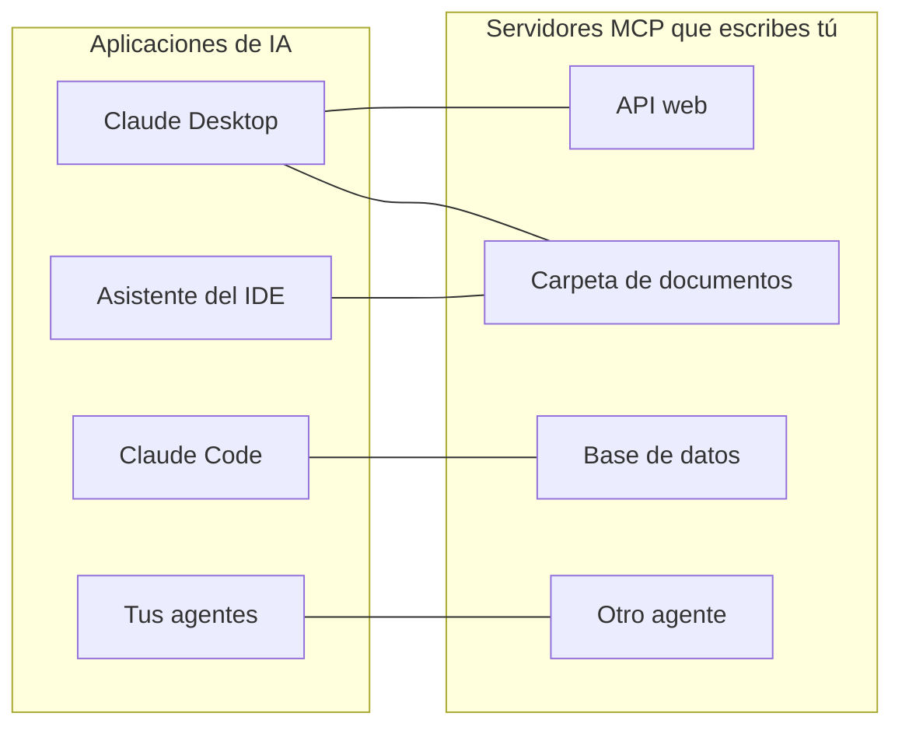
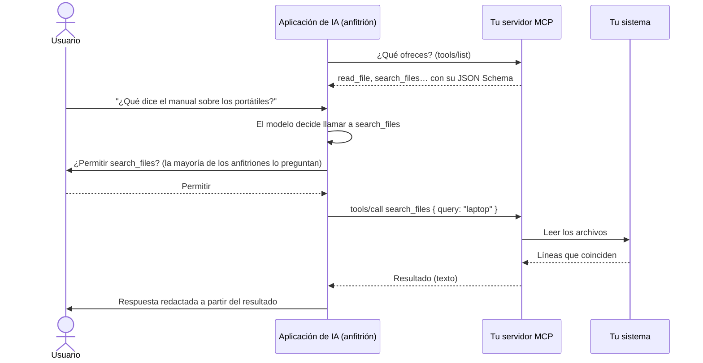
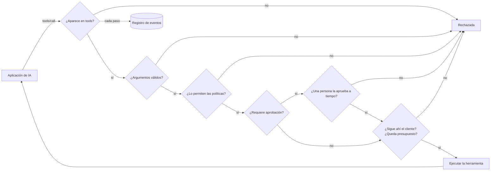

# MCP en palabras sencillas

**MCP permite que una aplicación de IA — Claude Desktop, Claude Code, un asistente de IDE, tu propio agente — use tus sistemas: una API, una carpeta de documentos, una base de datos, otro agente.** Esta página explica la idea y el vocabulario. Las páginas siguientes van de cero a un servidor que funciona:

1. [Tu primer servidor MCP en 5 minutos](./mcp-first-server) — paso a paso, de una carpeta vacía a Claude Desktop.
2. [Un servidor MCP para cualquier cosa](./mcp-recipes) — una línea para una función, una API web, una carpeta, una base de datos o un agente.
3. [Desplegar, proteger y resolver problemas](./mcp-deploy) — despliegue HTTP, autenticación, aprobaciones, y qué hacer cuando no funciona.

## La idea: un solo enchufe para todas las aplicaciones de IA {#the-idea-one-plug-for-every-ai-app}

Piensa en MCP (Model Context Protocol) como el **USB-C de las aplicaciones de IA**. Antes del USB, cada dispositivo tenía su propio cable. Antes de MCP, cada aplicación de IA necesitaba su propio código de integración para cada sistema con el que hablaba: una integración para Claude, otra para tu IDE, otra para tu agente.

Con MCP, escribes **un pequeño programa — un servidor MCP — delante de tu sistema**. Cualquier aplicación que hable MCP puede entonces conectarse a él, enumerar lo que ofrece y usarlo. Construyes el servidor una vez; funciona en todas partes.



El protocolo es un estándar abierto publicado en [modelcontextprotocol.io](https://modelcontextprotocol.io). Lo inició Anthropic; muchas aplicaciones de IA lo admiten.

## El vocabulario, término a término {#the-words-one-by-one}

| Término | En palabras sencillas | Ejemplo |
| --- | --- | --- |
| **Anfitrión** (host, la aplicación de IA) | La aplicación con la que habla el usuario. Ejecuta el modelo de lenguaje y decide cuándo usar tu servidor. | Claude Desktop, Claude Code, VS Code |
| **Cliente MCP** | La parte del anfitrión que mantiene la conexión con un servidor. Rara vez lo ves. | Uno por servidor en Claude Desktop |
| **Servidor MCP** | Tu pequeño programa. Dice lo que ofrece y hace el trabajo cuando se le pide. | `serveMcpOverStdio(sdk, { … })` |
| **Herramienta** (tool) | Una acción a la que el modelo puede decidir llamar, con argumentos con nombre. El modelo lee su nombre, su descripción y su lista de argumentos para decidir. | `read_file`, `list_pets`, `query` |
| **Recurso** (resource) | Un documento que el servidor ofrece para su lectura. A diferencia de una herramienta, lo elige **el usuario o la aplicación** (por ejemplo con un botón de "adjuntar"), no el modelo. | `folder://handbook/onboarding.md` |
| **Prompt** | Una plantilla de mensaje lista para usar que ofrece un servidor. Este SDK todavía no lo proporciona. | — |
| **Transporte** (transport) | Cómo viajan los mensajes entre el anfitrión y el servidor. | stdio, Streamable HTTP |
| **stdio** | El anfitrión **inicia tu servidor como un programa** en el mismo equipo y se comunica con él a través de su entrada y su salida estándar — como escribirle y leer lo que imprime. No se abre nada en la red. | Servidores locales en Claude Desktop |
| **Streamable HTTP** | Tu servidor es un **servicio web**; los anfitriones le envían solicitudes HTTP. Se usa para compartir un servidor con un equipo. | `https://mcp.example.com/mcp` |
| **JSON Schema** | La descripción de los argumentos de una herramienta (nombres, tipos, cuáles son obligatorios) que lee el modelo. El SDK la escribe por ti. | `{ "type": "object", "properties": { "path": { "type": "string" } } }` |
| **Anotación** (annotation) | Una indicación sobre una herramienta que se muestra a los anfitriones, como "esta herramienta solo lee". Los anfitriones pueden usarla para decidir cuándo pedir confirmación al usuario. | `readOnlyHint: true` |

::: tip Herramientas frente a recursos
Una **herramienta** es algo que el modelo *hace* ("busca 'laptop' en el manual"). Un **recurso** es algo que el usuario *entrega* ("adjunta onboarding.md a esta conversación"). La receta de carpeta ofrece ambos, a partir de la misma carpeta.
:::

## Qué ocurre durante una llamada {#what-happens-during-one-call}



Dos cosas que recordar:

- **El modelo solo ve lo que enumera el servidor**: nombres, descripciones, esquemas de argumentos y los resultados que recibe. Escribe descripciones claras; nunca pongas secretos en ellas.
- **El servidor decide lo que ocurre realmente.** El modelo propone una llamada; tu servidor puede rechazarla, limitarla, preguntar a una persona o registrarla. Ahí es donde entra este SDK.

## Qué añade este SDK {#what-this-sdk-adds}

Puedes escribir servidores MCP solo con el SDK oficial de MCP. Este SDK se sitúa por encima y añade lo que necesitas para ejecutar uno **de forma segura, y en una línea**:

| | Solo con el SDK oficial de MCP | Con SDK AI Agents |
| --- | --- | --- |
| Exponer una API web | Escribir un manejador por endpoint | `openApiTools({ spec })` — una herramienta por operación, de solo lectura por defecto |
| Exponer una carpeta | Escribir tú mismo las comprobaciones de rutas | `folderTools({ root })` — los enlaces simbólicos y `..` no pueden salir de la carpeta |
| Exponer una base de datos | Escribir tú mismo la protección SQL | `databaseTools({ database })` — un solo SELECT, de solo lectura a nivel de la base de datos (una transacción de solo lectura en PostgreSQL, `query_only` en SQLite), con un límite de filas |
| Exponer un agente | — | `cognitiveAgentTool(agent)` — "¿qué pensaría Nicolas?" como una sola herramienta |
| Nada expuesto por accidente | Depende de ti | Solo las herramientas que enumeras en `tools` |
| Reglas antes de cada llamada | Depende de ti | [Políticas](./governed-agents), presupuestos, listas de permitidos |
| Una persona dice que sí primero | Depende de ti | Las herramientas marcadas con `requiresApproval` esperan a `sdk.approveAction()`; la aprobación se cancela cuando el cliente cancela o se desconecta, y tras `approvalTimeoutMs` (50 s por defecto) |
| Saber qué ha pasado | Depende de ti | Cada llamada y cada lectura de recurso es una ejecución en el [registro de eventos](./observability) |



En ese orden: una llamada con argumentos no válidos se rechaza antes de pedir a nadie que la apruebe, y una llamada se descuenta de su presupuesto cuando empieza, sea cual sea su resultado.

Cada llamada hecha a través de MCP se registra como su propia ejecución, con la identidad `mcp:<server name>`: puedes leerla, calcular su coste y generar alertas sobre ella, exactamente igual que con la ejecución de un agente.

## En ambas direcciones {#both-directions}

El SDK habla MCP en los dos sentidos:

- **Servir**: convierte tus herramientas, API, carpetas, bases de datos y agentes en servidores MCP — las páginas siguientes.
- **Usar**: da a tus propios agentes las herramientas de cualquier servidor MCP existente — a continuación.

### Usar las herramientas de un servidor MCP en tus agentes {#use-the-tools-of-an-mcp-server-in-your-agents}

```ts
import { connectMcpServer } from '@sdk-ai-agents/core/mcp';

const crm = await connectMcpServer({
  name: 'crm',
  transport: { type: 'http', url: 'https://mcp.acme.internal/crm', headers: { Authorization: `Bearer ${token}` } },
  toolPrefix: 'crm_',                         // avoid collisions between servers
  include: ['lookup_customer', 'list_invoices'],
  metadata: { riskLevel: 'medium' },          // for every tool; a label no policy reads unless you write one
  retry: { maxRetries: 2 },
});

const tools = crm.tools.map((definition) => sdk.defineTool(definition));
const agent = sdk.createCognitiveAgent({ name: 'account-manager', model: 'gpt-4o', tools });

await agent.think({ problem: 'Should we offer customer c-42 a discount?' });
await crm.close();
```

| `transport.type` | Úsalo para |
| --- | --- |
| `stdio` | Servidores locales iniciados como un proceso (`command`, `args`, `env`, `cwd`) |
| `http` | Servidores remotos por Streamable HTTP (`url`, `headers`) |
| `custom` | Cualquier transporte que construyas (WebSocket, en memoria para las pruebas…) |

Las herramientas importadas conservan el JSON Schema del servidor, así que el modelo ve los argumentos reales. Una vez definidas con `sdk.defineTool`, se comportan exactamente igual que las herramientas locales: las listas de permitidos, las políticas, las aprobaciones (`metadata: { requiresApproval: true }` hace que cada llamada espere a una persona), los presupuestos, los reintentos y las trazas se aplican a cada llamada. Si falla el listado de herramientas, la conexión (y el proceso stdio) se cierra antes de lanzar el error.

::: warning Conecta solo servidores de confianza
Las descripciones y los resultados de las herramientas importadas llegan al modelo palabra por palabra: un servidor malicioso puede escribir instrucciones en ellos. Conecta servidores de confianza, da a cada agente solo las herramientas que necesita y protege las herramientas destructivas con aprobaciones.
:::

## Conviene saber {#good-to-know}

- La compatibilidad con MCP está en un punto de entrada aparte, `@sdk-ai-agents/core/mcp`, para que el paquete principal no requiera `@modelcontextprotocol/sdk` salvo que lo uses. Las fuentes de herramientas (`openApiTools`, `folderTools`, `databaseTools`, `cognitiveAgentTool`, `webTools`…) están en el paquete principal: tus agentes pueden usarlas sin MCP.
- El servidor se basa en el SDK oficial de MCP para TypeScript 1.30, que acepta las revisiones del protocolo 2024-10-07, 2024-11-05, 2025-03-26, 2025-06-18 y 2025-11-25 (su `SUPPORTED_PROTOCOL_VERSIONS`, comprobado el 2026-09-24). El sitio de MCP también documenta una revisión 2026-07-28 ([arquitectura](https://modelcontextprotocol.io/docs/learn/architecture), comprobado el 2026-09-24), que este SDK todavía no habla.
- Este SDK sirve **herramientas** y **recursos**. Los prompts, el sampling y la elicitation no se proporcionan.

Siguiente: [construye tu primer servidor](./mcp-first-server).
