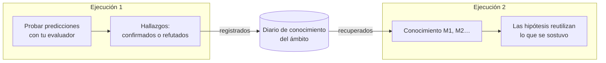

# Memoria entre ejecuciones

::: tip En palabras sencillas
Piensa en un cuaderno de laboratorio compartido por todos los que trabajan en el mismo banco de pruebas. Cada vez que un experimento confirma o refuta una regla, se anota con lo que se esperaba y lo que se vio. La siguiente persona lee el cuaderno antes de empezar: reutiliza lo que se sostuvo, y no vuelve a intentar, tal cual, lo que ya falló.

Un agente cognitivo puede llevar un cuaderno así. Solo anota **lo que respondió una prueba real**, nunca lo que el modelo o el pensador simplemente creían.
:::

## Qué hace {#what-it-does}



1. **Al final de una ejecución**, cada regla o explicación con al menos una predicción que tu [evaluador de resultados](./evidence-and-verification#predictions-and-the-outcome-evaluator) confirmó o refutó se convierte en un **hallazgo**: la afirmación, su ámbito, la regla que revisa dentro de la ejecución, y cada prueba (lo que se esperaba, lo que se observó, qué evaluador). Los hallazgos se añaden al **diario** del ámbito.
2. **Al inicio de la siguiente ejecución** en el mismo ámbito, los elementos más pertinentes se **recuperan** y se colocan en el estado mental como `knowledge`, con los identificadores `M1`, `M2`…
3. **Durante la ejecución**:
   - el modelo ve cada elemento con su estado y sus pruebas más recientes, y se le indica que reutilice una regla verificada dentro de su ámbito, citándola;
   - el motor rechaza una hipótesis que vuelve a plantear palabra por palabra un elemento **refutado** (mismo tipo, misma afirmación y mismo ámbito, sin contar mayúsculas y puntuación); se indica al modelo que proponga en su lugar una variante que cite el identificador `M` del elemento en sus premisas y explique la refutación, pero cualquier otra redacción u otro ámbito se acepta como una hipótesis nueva;
   - una hipótesis que vuelve a plantear un elemento **verificado** o **discutido** se vincula a él automáticamente (su identificador `M` se añade a las premisas), de modo que el paso de comparación ve las pruebas anteriores.

## Actívala {#turn-it-on}

```ts
import { FileKnowledgeStore } from '@sdk-ai-agents/core';

const physicist = sdk.createCognitiveAgent({
  name: 'physicist',
  model: 'gpt-4o',
  evaluator: bench,   // without an evaluator, nothing is tested, so nothing is remembered
  knowledge: {
    store: new FileKnowledgeStore('./knowledge'),
    scope: 'inclined-plane',
  },
});

const first = await physicist.think({ problem: 'Does the rolling time depend on the ball?', observations });
const second = await physicist.think({ problem: 'Will a 250 g glass ball take as long as a steel one?' });

second.state.knowledge;
// [{ id: 'M1', status: 'refuted',  statement: 'Rolling time on this plane does not depend on the ball', … },
//  { id: 'M2', status: 'verified', statement: 'For rigid balls, rolling time on this plane does not depend on mass', … }]
```

| Opción | Por defecto | Significado |
| --- | --- | --- |
| `store` | (obligatoria) | Dónde se guarda el diario: `FileKnowledgeStore`, `InMemoryKnowledgeStore` o el tuyo propio |
| `scope` | (obligatoria) | Sobre qué trata el conocimiento. Las ejecuciones comparten lo que aprendieron solo dentro de un ámbito. Letras minúsculas, dígitos, `.`, `-`, `_`: dos ámbitos que solo se diferencian por las mayúsculas compartirían un mismo archivo en macOS y Windows |
| `recallLimit` | `10` | Elementos recuperados al inicio de una ejecución, de 0 a 50. `0` registra sin recuperar |
| `record` | `true` | Si las ejecuciones registran lo que establecieron sus pruebas |

`examples/rule-discovery.ts` la utiliza: ejecútalo dos veces, y la segunda ejecución empieza con lo que estableció la primera.

## Qué se recuerda, y qué no se recuerda nunca {#what-is-remembered-and-what-never-is}

| Se recuerda | No se recuerda nunca |
| --- | --- |
| Las reglas y las explicaciones con una predicción que tu evaluador **confirmó** o **refutó** | Las elecciones de acción (propuestas): dependen de quién decide y cuándo |
| Lo que se esperaba, lo que se observó, qué evaluador y qué versión | Las predicciones que nunca se probaron, o cuya prueba fue **no concluyente** |
| La regla que revisa una variante, y qué cambió | Lo que creía el modelo, el respaldo que dio, las preferencias del pensador |
| Qué ejecuciones lo registraron | La respuesta final de la ejecución |

Una ejecución que falla o se detiene sigue registrando las pruebas que realizó: una medición sigue siendo válida pase lo que pase después.

## Estados {#statuses}

| Estado | Cuándo | Qué se le dice al modelo |
| --- | --- | --- |
| `verified` | Solo confirmaciones hasta ahora | Reutilízalo dentro de su ámbito y cítalo; fuera de ese ámbito es una hipótesis que hay que volver a probar |
| `refuted` | Solo refutaciones hasta ahora | No lo vuelvas a proponer nunca tal cual; una variante cita su identificador `M` en sus premisas y dice en qué se diferencia |
| `contested` | Tanto confirmaciones como refutaciones | Solo se cumple en algunas condiciones: averigua en cuáles |

La misma afirmación en el mismo ámbito es el mismo elemento, sean cuales sean sus mayúsculas o su puntuación. Las pruebas se deduplican por ejecución y por predicción: registrar dos veces la misma ejecución no añade nada.

## Qué elementos se recuperan {#which-items-are-recalled}

Los elementos del ámbito se ordenan, de forma determinista:

1. primero los que comparten más palabras con el problema (palabras de cuatro letras o más, en la afirmación y en el ámbito);
2. después los más probados;
3. después los más recientes.

Se recuperan los `recallLimit` primeros elementos. Es una simple coincidencia de palabras, no una búsqueda semántica: puede que una regla redactada de forma muy distinta al problema no se recupere la primera. Mantén los ámbitos estrechos (un banco de pruebas, un producto, un dominio) para que todo lo que hay en un ámbito sea pertinente.

## Ámbitos {#scopes}

Un ámbito es un límite, no un nombre de carpeta para tenerlo todo ordenado:

- las ejecuciones **comparten** lo que aprendieron solo dentro de un ámbito;
- usa un ámbito por banco de pruebas, producto, conjunto de datos o dominio cuyas reglas se apliquen entre sí: `inclined-plane`, `checkout-latency`, `churn-model-v3`;
- nunca mezcles clientes o inquilinos (tenants) en un mismo ámbito si sus datos deben mantenerse separados.

## Almacenes {#stores}

| Almacén | Úsalo para |
| --- | --- |
| `FileKnowledgeStore(directory)` | Un archivo por ámbito, `<directory>/<scope>.jsonl`, una línea por ejecución. Las líneas solo se añaden al final, así que el archivo es también un historial legible. Las escrituras a través de una misma instancia de `FileKnowledgeStore` se serializan: comparte una sola instancia entre los agentes de un proceso |
| `InMemoryKnowledgeStore()` | Pruebas, prototipos, procesos de corta duración |
| Tu propio `KnowledgeStore` | Una base de datos compartida por varios procesos |

Varias instancias o varios procesos que escriben el mismo ámbito a la vez deberían usar una base de datos: implementa los tres métodos del puerto. Una línea que una escritura interrumpida dejó a medias se omite al leer, con un aviso, y la siguiente entrada empieza en una línea nueva; una línea que es JSON válido pero no es una entrada válida detiene la lectura indicando su número de línea, porque el archivo se ha alterado.

```ts
import type { KnowledgeStore } from '@sdk-ai-agents/core';

const store: KnowledgeStore = {
  async recall({ scope, goal, limit }) { /* the most relevant items of the scope */ },
  async record({ scope, runId, recordedAt, findings }) { /* append one entry */ },
  async list(scope) { /* every item of the scope */ },
};
```

`projectKnowledge(entries)` combina las entradas del diario en elementos y `rankKnowledge(items, goal, limit)` los ordena, así que un almacén personalizado solo necesita guardar las entradas (por ejemplo una fila por ejecución) y reutilizar ambas funciones.

Inspecciona en cualquier momento lo que sabe un ámbito:

```ts
for (const item of await store.list('inclined-plane')) {
  console.log(item.status, item.confirmations, item.refutations, item.statement);
}
```

## Auditoría y repetición {#audit-and-replay}

- Los elementos recuperados se registran en `cognition.started` (`knowledge.scope`, `knowledge.items`), así que `sdk.getMentalState(runId)` reconstruye exactamente lo que sabía la ejecución, sin volver a leer el almacén, aunque el almacén haya cambiado desde entonces.
- Los hallazgos se registran en un evento `cognition.knowledge_recorded` (`scope`, `findings`).
- Un almacén que falla nunca detiene una ejecución: una recuperación fallida se registra como `knowledge.error` en `cognition.started` y la ejecución continúa sin memoria; un registro fallido se anota como `error` en `cognition.knowledge_recorded`. Un almacén que no responde dentro del `limits.timeoutMs` de la ejecución se trata como fallido (una escritura lenta puede completarse igualmente después). Si el propio registro de eventos no puede registrar los hallazgos, se imprime un aviso y el resultado de la ejecución se devuelve sin cambios.

## Límites {#limits}

- **Coincidencia de palabras.** La recuperación no es semántica; se pueden pasar por alto reglas relacionadas redactadas de otra forma.
- **Solo reformulaciones exactas.** Solo se rechaza una reformulación de una regla refutada con el mismo tipo, la misma redacción (sin contar mayúsculas y puntuación) y el mismo ámbito; una redactada de otra forma se acepta como una hipótesis nueva.
- **Una prueba basta para ser `verified`.** Un elemento queda verificado en cuanto se confirmó una predicción y no se refutó ninguna, y es el modelo quien elige qué predicción pone a prueba una regla: una predicción débil sigue contando como una confirmación.
- **El ámbito se declara, no se comprueba.** Una regla verificada para "bolas rígidas" se muestra con ese ámbito, y se indica al modelo que no la aplique en otro sitio sin una prueba nueva; nada lo verifica en el código.
- **Se confía en el evaluador.** La memoria es tan fiable como tu evaluador: una medición errónea se recuerda como una prueba.
- **Un solo escritor por archivo.** `FileKnowledgeStore` serializa únicamente las escrituras de una instancia; dos instancias o dos procesos que escriben el mismo ámbito no se coordinan.
