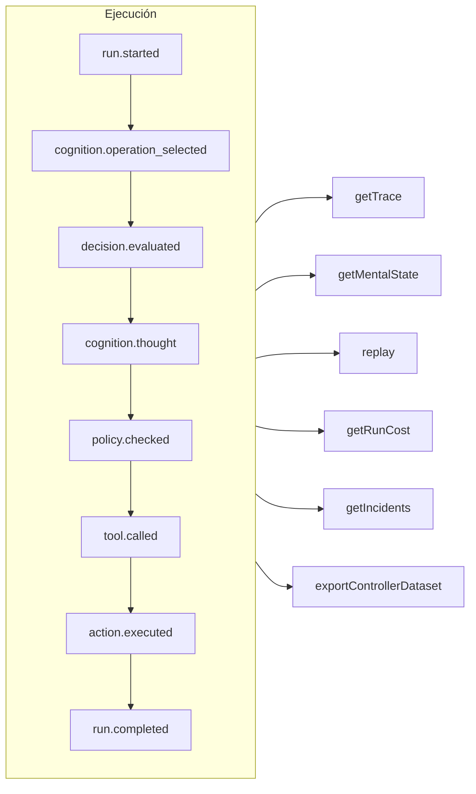

# Trazabilidad y repetición

Cada ejecución — gobernada, cognitiva, una decisión tipada directa o una llamada a una herramienta MCP — es un **registro de eventos de solo adición** (append-only). Nada ocurre sin quedar registrado, y todo lo demás se deriva de él.



## Almacenes {#stores}

| Almacén | Úsalo para |
| --- | --- |
| `FileEventStore` (por defecto) | Desarrollo, un solo proceso — un archivo JSON por ejecución |
| `SQLiteEventStore` | Persistencia local con consultas |
| `PostgreSQLEventStore` | Producción: consultas indexadas, agregación, copia de seguridad y restauración |

::: code-group

```ts [File]
import { createSDK, FileEventStore } from '@sdk-ai-agents/core';

const sdk = createSDK({ apiKey, eventStore: new FileEventStore('./events') });
```

```ts [SQLite]
import Database from 'better-sqlite3';
import { createSDK, SQLiteEventStore } from '@sdk-ai-agents/core';

const sdk = createSDK({ apiKey, eventStore: new SQLiteEventStore({ db: new Database('events.db') }) });
```

```ts [PostgreSQL]
import pg from 'pg';
import { createSDK, PostgreSQLEventStore } from '@sdk-ai-agents/core';

const pool = new pg.Pool({ connectionString: process.env.DATABASE_URL });
const sdk = createSDK({ apiKey, eventStore: new PostgreSQLEventStore({ pool }) });
```

:::

Los almacenes implementan `IEventStore`; escribe el tuyo para usar cualquier base de datos. El almacén de archivos acumula los eventos en un búfer y los vuelca cada 100 ms; llama a `await store.destroy()` al apagar para escribir lo que esté pendiente. Quienes leen el registro (reconstrucción del estado mental, costes, conjuntos de datos) ignoran los eventos repetidos con el mismo identificador.

## Leer una ejecución {#read-a-run}

```ts
const trace = await sdk.getTrace(runId);          // status, timeline, summary
const text = await sdk.exportTrace(runId, 'text'); // human-readable timeline
const events = await sdk.getEvents(runId, { type: ['tool.called', 'policy.violated'] });
const state = await sdk.getMentalState(runId);    // cognitive runs
```

El estado de una ejecución es el **último evento de ciclo de vida** (`run.completed`, `run.failed`, `run.cancelled`). Los eventos añadidos después — retroalimentación, informes de incidentes — nunca la reabren.

## Progreso en tiempo real {#live-progress}

Los eventos también llegan a tu código **mientras la ejecución está en curso**, en cuanto el almacén los ha aceptado: para mostrar el progreso en una interfaz, transmitirlo a un cliente o alimentar un panel de control. Los clientes MCP los reciben como [notificaciones de progreso](./mcp-deploy#progress-notifications).

```ts
const result = await agent.run({
  message: 'Refund order 1234',
  onEvent: (event) => console.log(event.type),
});

const answer = await cognitiveAgent.think({ problem, onEvent: (event) => socket.send(JSON.stringify(event)) });
const replay = await sdk.replay(runId, undefined, { onEvent: (event) => console.log(event.type) });

// Every run of the SDK, for as long as you listen
const unsubscribe = sdk.subscribe((event) => dashboard.push(event), { types: ['run.failed', 'approval.requested'] });
unsubscribe();
```

| Dónde | Qué recibe el listener |
| --- | --- |
| `run({ onEvent })`, `think({ onEvent })` | Todos los eventos de esa ejecución |
| `replay(runId, modifications, { onEvent })` | Todos los eventos de la repetición |
| `executeTool(name, params, { onEvent })` | Los eventos de la llamada, y los de las ejecuciones de agente que inicia su herramienta (`governedAgentTool`, `cognitiveAgentTool`) |
| `sdk.subscribe(listener, { runId?, agentId?, types? })` | Todos los eventos de todas las ejecuciones que coinciden con el filtro, hasta que llamas a la función que devuelve |

Lo que está garantizado:

- **Solo lo que el almacén aceptó.** Se llama a un listener una vez que el `append` del almacén ha tenido éxito, nunca para un evento que el almacén rechazó. Con los almacenes SQL, la fila ya está confirmada (commit); con el almacén de archivos, el evento está en su búfer: `getEvents` lo devuelve de inmediato, y llega al disco en menos de 100 ms (si el proceso se cae entretanto, se pierde).
- **En orden.** Los eventos de una ejecución llegan en el orden en que se registraron; los eventos de ejecuciones distintas se intercalan.
- **Un evento cada vez, y la ejecución nunca espera.** Cuando tu listener devuelve una promesa, su siguiente evento espera a que esa promesa termine, así que un listener asíncrono no puede desordenar los eventos. Mientras tanto, la ejecución sigue: un listener lento se queda atrás, no ralentiza al agente. `run()`, `think()`, `replay()` y `executeTool()` se resuelven una vez que su `onEvent` ha terminado con cada evento de la ejecución, así que cuando devuelven, ya lo has visto todo. Una promesa que nunca termina les impide devolver su resultado: para un trabajo que no hay que esperar (fire-and-forget), no devuelvas la promesa (`onEvent: (event) => { void save(event); }`). Un listener síncrono se llama antes de que vuelva el `append` del evento: que sea rápido.
- **Los errores se quedan fuera de la ejecución.** Si un listener lanza una excepción o rechaza su promesa, el error se notifica en la salida de error estándar (`console.error`) y el listener sigue recibiendo los eventos siguientes. Para gestionarlos tú mismo, captúralos en el listener, o crea el SDK con `eventStore: new ObservedEventStore(store, { onListenerError })`.
- **Una copia.** Cada listener recibe su propia copia del evento, tal como la relee el almacén: modificarla no cambia nada en el registro.
- **Cancelar la suscripción es inmediato.** Después de llamar a la función que devuelve `sdk.subscribe`, el listener no se vuelve a llamar, ni siquiera para los eventos que ya estaban esperando; esa función se puede llamar desde dentro del listener.

El filtro `agentId` compara con el `metadata.agentId` de cada evento: algunos eventos no llevan agente (`provider.retry`, el final de una repetición); filtra por ejecución para recibirlos. Las copias de seguridad restauradas no se entregan. Para un agente montado a mano sobre tu propio almacén (`new AgentImpl(…)`), envuelve el almacén en un `ObservedEventStore` para usar `onEvent`; `createSDK` lo hace por ti.

## Repetir sin el LLM {#replay-without-the-llm}

```ts
const replay = await sdk.replay(runId);
```

La repetición vuelve a ejecutar las intenciones registradas a través del motor de acciones — políticas incluidas — **sin llamar al LLM**. Repite con modificaciones para probar escenarios de "qué pasaría si", por ejemplo después de cambiar una política.

Una repetición vuelve a ejecutar las herramientas, de verdad. Para las herramientas marcadas con `requiresApproval`, una repetición solo repite las llamadas que una persona **aprobó** en la ejecución original — la misma herramienta con los mismos parámetros — sin volver a preguntar; una llamada que fue rechazada, cancelada o nunca aprobada se rechaza, no se ejecuta. Las aprobaciones exigidas por una *política* se siguen aplicando y esperan una decisión.

## Entender las decisiones {#understand-decisions}

| Método | Qué obtienes |
| --- | --- |
| `getReasoningGraph(runId)` / `exportReasoningGraph(runId, 'graphviz')` | La cadena intención → política → acción como un grafo |
| `getAlternatives(runId)` | Las alternativas que consideró el agente |
| `getDecisionPatterns(filters)` | Patrones de decisión recurrentes entre ejecuciones |
| `getTraceVisualization(runId)` | Una estructura agrupada, lista para mostrar en una cronología en una interfaz |
| `getPolicyAuditTrail(runId)` | Cada evaluación de política y su resultado |

## Probar los agentes como si fueran código {#test-agents-like-code}

Convierte una buena ejecución en una **traza de referencia** (golden trace), y después valida las nuevas ejecuciones contra ella:

```ts
const golden = await sdk.createGoldenTrace(runId, { name: 'refund flow', description: 'Expected behavior' });
const validation = await sdk.validateAgainstGoldenTrace(newRunId, golden.id);
const regressions = await sdk.detectRegressions(newRunId, golden.id);
```

También están disponibles las baterías de regresión, las aserciones de comportamiento, la comparación de ejecuciones y el análisis de impacto antes del despliegue — consulta la [API del SDK](../reference/sdk-api).
