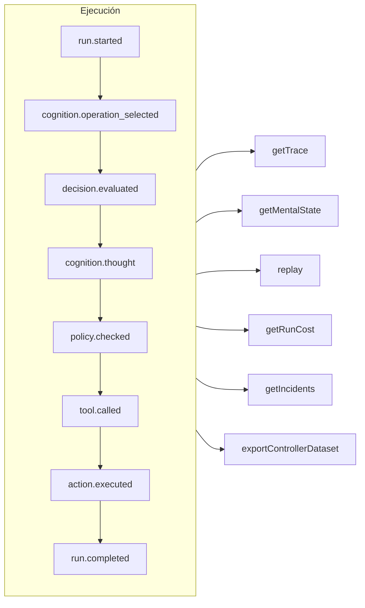

# Trazabilidad y repetición

Cada ejecución — gobernada, cognitiva, una decisión tipada directa o una llamada a una herramienta MCP — es un **registro de eventos de solo adición** (append-only). Nada ocurre sin quedar registrado, y todo lo demás se deriva de él.



## Almacenes {#stores}

| Almacén | Úsalo para |
| --- | --- |
| `FileEventStore` (por defecto) | Desarrollo, un solo proceso — un archivo JSON por ejecución |
| `SQLiteEventStore` | Persistencia local con consultas |
| `PostgreSQLEventStore` | Producción: consultas indexadas, agregación, copia de seguridad y restauración |

::: code-group

```ts [File]
import { createSDK, FileEventStore } from '@sdk-ai-agents/core';

const sdk = createSDK({ apiKey, eventStore: new FileEventStore('./events') });
```

```ts [SQLite]
import Database from 'better-sqlite3';
import { createSDK, SQLiteEventStore } from '@sdk-ai-agents/core';

const sdk = createSDK({ apiKey, eventStore: new SQLiteEventStore({ db: new Database('events.db') }) });
```

```ts [PostgreSQL]
import pg from 'pg';
import { createSDK, PostgreSQLEventStore } from '@sdk-ai-agents/core';

const pool = new pg.Pool({ connectionString: process.env.DATABASE_URL });
const sdk = createSDK({ apiKey, eventStore: new PostgreSQLEventStore({ pool }) });
```

:::

Los almacenes implementan `IEventStore`; escribe el tuyo para usar cualquier base de datos. El almacén de archivos acumula los eventos en un búfer y los vuelca cada 100 ms; llama a `await store.destroy()` al apagar para escribir lo que esté pendiente. Quienes leen el registro (reconstrucción del estado mental, costes, conjuntos de datos) ignoran los eventos repetidos con el mismo identificador.

## Leer una ejecución {#read-a-run}

```ts
const trace = await sdk.getTrace(runId);          // status, timeline, summary
const text = await sdk.exportTrace(runId, 'text'); // human-readable timeline
const events = await sdk.getEvents(runId, { type: ['tool.called', 'policy.violated'] });
const state = await sdk.getMentalState(runId);    // cognitive runs
```

El estado de una ejecución es el **último evento de ciclo de vida** (`run.completed`, `run.failed`, `run.cancelled`). Los eventos añadidos después — retroalimentación, informes de incidentes — nunca la reabren.

## Repetir sin el LLM {#replay-without-the-llm}

```ts
const replay = await sdk.replay(runId);
```

La repetición vuelve a ejecutar las intenciones registradas a través del motor de acciones — políticas incluidas — **sin llamar al LLM**. Repite con modificaciones para probar escenarios de "qué pasaría si", por ejemplo después de cambiar una política.

Una repetición vuelve a ejecutar las herramientas, de verdad. Para las herramientas marcadas con `requiresApproval`, una repetición solo repite las llamadas que una persona **aprobó** en la ejecución original — la misma herramienta con los mismos parámetros — sin volver a preguntar; una llamada que fue rechazada, cancelada o nunca aprobada se rechaza, no se ejecuta. Las aprobaciones exigidas por una *política* se siguen aplicando y esperan una decisión.

## Entender las decisiones {#understand-decisions}

| Método | Qué obtienes |
| --- | --- |
| `getReasoningGraph(runId)` / `exportReasoningGraph(runId, 'graphviz')` | La cadena intención → política → acción como un grafo |
| `getAlternatives(runId)` | Las alternativas que consideró el agente |
| `getDecisionPatterns(filters)` | Patrones de decisión recurrentes entre ejecuciones |
| `getTraceVisualization(runId)` | Una estructura agrupada, lista para mostrar en una cronología en una interfaz |
| `getPolicyAuditTrail(runId)` | Cada evaluación de política y su resultado |

## Probar los agentes como si fueran código {#test-agents-like-code}

Convierte una buena ejecución en una **traza de referencia** (golden trace), y después valida las nuevas ejecuciones contra ella:

```ts
const golden = await sdk.createGoldenTrace(runId, { name: 'refund flow', description: 'Expected behavior' });
const validation = await sdk.validateAgainstGoldenTrace(newRunId, golden.id);
const regressions = await sdk.detectRegressions(newRunId, golden.id);
```

También están disponibles las baterías de regresión, las aserciones de comportamiento, la comparación de ejecuciones y el análisis de impacto antes del despliegue — consulta la [API del SDK](../reference/sdk-api).
