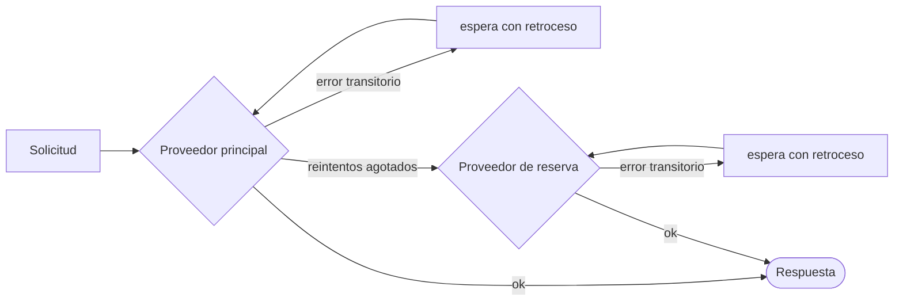

# Reintentos y conmutación por error

Las redes fallan, los proveedores limitan la frecuencia de las solicitudes, las herramientas agotan su tiempo límite. El SDK reintenta lo que se puede reintentar, conmuta a un proveedor de reserva lo que no se puede, y **escribe cada reintento en la ejecución** para que no quede nada oculto.



## Proveedores de LLM {#llm-providers}

Una política de reintentos se aplica a cada proveedor **por separado, antes de cualquier conmutación**:

```ts
const sdk = createSDK({
  apiKey: process.env.OPENAI_API_KEY,
  fallbackProviders: [{ provider: 'anthropic', config: { apiKey: process.env.ANTHROPIC_API_KEY } }],
  retry: { maxRetries: 3, initialDelayMs: 500, maxDelayMs: 8_000 },
});
```

Si el proveedor de respaldo es de otro fabricante, necesita su propia clave, en su `config` o en `providerConfig`: la clave del principal nunca se envía a otro fabricante. Recibe el modelo del agente solo si lo sirve; si no, usa su propio `defaultModel` (Anthropic rechaza un nombre de modelo de OpenAI, y viceversa). El evento `intention.generated` indica qué proveedor respondió y con qué modelo.

| Opción | Por defecto | |
| --- | --- | --- |
| `maxRetries` | `2` | Reintentos después del primer intento |
| `initialDelayMs` | `500` | Se duplica en cada reintento (`multiplier`) |
| `maxDelayMs` | `8000` | Límite superior de una espera de retroceso |
| `maxRetryAfterMs` | `60000` | El `retry-after` más largo que se respeta (`maxDelayMs` cuando existe un proveedor de reserva) |
| `jitter` | `true` | Aleatoriza cada espera en [delay/2, delay] |
| `retryOn` | `isTransientError` | Tu propio predicado |

Solo se reintentan los errores **transitorios**: 408, 409, 425, 429, 5xx, 529, los fallos de conexión y los tiempos límite agotados — incluidos los errores de conexión de OpenAI y Anthropic, reconocidos por su clase y por el código de red de su `cause`. Los errores de autenticación, de validación y de política fallan de inmediato, y también un 429 que significa que la cuenta se ha quedado sin crédito o sin cuota (`insufficient_quota`, `credit_balance_exhausted`…): esperar no devolvería el crédito. El mensaje de error incluye la explicación del proveedor. Cuando el proveedor envía `retry-after-ms` o `retry-after`, el SDK espera ese tiempo en lugar de aplicar su propio retroceso, hasta `maxRetryAfterMs` (60 s por defecto). Cuando hay `fallbackProviders` configurados, ese límite baja a `maxDelayMs`: un proveedor que pide una pausa larga se deja para el proveedor de reserva en lugar de bloquear la ejecución. Una solicitud más larga pone fin a los reintentos.

Cuando la política del SDK está activa, se desactivan los reintentos propios de los clientes de OpenAI y Anthropic — **los reintentos nunca se acumulan**. Cada reintento se registra como un evento `provider.retry` con el proveedor, el modelo, el intento, la espera y el error. Pasa `retry: false` para conservar en su lugar los valores por defecto del proveedor.

Un proveedor que inyectas con `llmProvider` se usa tal cual salvo que fijes `retry` explícitamente, y un `FallbackProvider` nunca se envuelve, para que sus conmutaciones sigan siendo visibles en la traza. Sus proveedores tampoco se envuelven, así que `retry` no se les aplica: para reintentar uno antes de conmutar, envuélvelo en `RetryingLLMProvider` y dale a su cliente `maxRetries: 0`. Fija el `maxRetryAfterMs` de la política en su `maxDelayMs`, como hace el SDK cuando un proveedor de reserva puede tomar el relevo, para que un proveedor que pide una pausa larga se deje para el de reserva. Esos reintentos no se registran como eventos `provider.retry`.

## Herramientas {#tools}

Marca como reintentables las herramientas idempotentes:

```ts
sdk.defineTool({
  name: 'lookup_metric',
  description: 'Reads a metric',
  schema: z.object({ metric: z.string() }),
  retry: { maxRetries: 2, initialDelayMs: 200 },
  handler: async ({ metric }) => warehouse.read(metric),
});
```

Solo se reintentan los fallos de la herramienta — nunca una denegación de una política ni un error de validación. Cada reintento es un evento `tool.retry`.

## Decisiones tipadas {#typed-decisions}

El cliente de Jev reintenta las respuestas 408, 429, 5xx y 529 y los errores de red, **respetando `retry-after`**, con la política de reintentos del SDK como valor por defecto (`jev.maxRetries` la sustituye). A diferencia de los proveedores de LLM, reintenta todos los 429, sea cual sea su causa, hasta `maxRetries`.

## En cualquier otro sitio {#anywhere-else}

`withRetry` se exporta para tu propio código:

```ts
import { withRetry, DEFAULT_RETRY_POLICY } from '@sdk-ai-agents/core';

const data = await withRetry(() => fetchPartnerFeed(), DEFAULT_RETRY_POLICY, {
  onRetry: ({ retry, delayMs, error }) => logger.warn({ retry, delayMs, error }),
});
```
