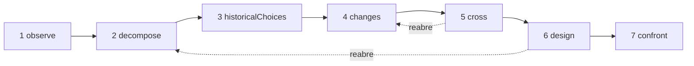

# Estudios

Un estudio es un investigador de IA. Aplica un único método — **comprender un objeto y después rediseñarlo con los medios de hoy** — y te entrega un dosier: qué hace el objeto, cómo funciona, por qué se construyó así, qué ha cambiado desde entonces, varios diseños nuevos y los experimentos que permitirían decidir entre ellos. No construye nada, no ejecuta nada y no mide nada: investiga y propone.

::: tip En palabras sencillas
Elige un objeto: un navegador web, un motor de base de datos, un horario de trenes. El estudio lo observa, lo desmonta, indaga las razones de sus antiguas decisiones, busca qué investigaciones y técnicas han aparecido desde entonces, y cruza ambas cosas para imaginar otra organización. Apunta a un cambio de principio que haga posible algo nuevo, no a una versión más rápida de lo mismo. Cada afirmación dice si está **establecida** por una fuente que el estudio encontró de verdad, si es una **hipótesis** o si es una **novedad** que aún hay que contrastar con los trabajos existentes. Y durante todo el proceso, varios mecanismos lo mantienen en el objetivo que le diste, porque los modelos de lenguaje tienden a desviarse a medida que se acumulan las instrucciones. Cada término se explica en [Términos clave en palabras sencillas](./glossary#studies).
:::

```ts
const study = sdk.createStudy({
  name: 'browser',
  object: 'The Web browser, from 1990 to 2026',
  objective: 'A browser design whose every choice follows from the investigation',
  leads: ['vectorisation', 'weights', 'ReLU'], // your leads: examples to verify, not truths
  analogues: ['Bitcoin'],                      // breakthroughs by assembly to deconstruct
  sources: ['brave_web_search'],               // SDK tools the study searches with
});

const result = await study.run();
result.status;   // 'completed' | 'stopped' | 'failed' | 'cancelled'
result.report;   // the structured report
result.markdown; // the same, as a readable dossier
```

## Qué es un estudio {#what-a-study-is}

Un estudio aplica un método en siete pasajes: *comprender un objeto y después rediseñarlo con los conocimientos y las técnicas de hoy*. Su pregunta guía es: **si tuviéramos que satisfacer las necesidades de hoy con los conocimientos y las técnicas disponibles hoy, ¿cómo organizaríamos este objeto?** Salvo que des tu propia `question`, el estudio la formula en su idioma, seguida de la meta descrita en [La meta: una nueva capacidad](#the-aim-a-new-capability).

Un estudio no es un agente. No tiene herramientas con las que actuar, solo **fuentes** en las que buscar (consulta [Investigar a través de tus fuentes](#research-through-your-sources)), y lo que produce es un informe, no una acción. Se crea con `sdk.createStudy()`, a partir de una **carta** — el objeto, el objetivo, tus necesidades y tus pistas — que ya no cambia después.

Su último pasaje diseña experimentos; no los ejecuta. Cuando hayas ejecutado uno, anotas lo que encontró en la ficha de mecanismo correspondiente (consulta [La ficha de mecanismo](#the-mechanism-card)).

## Los siete pasajes {#the-seven-passages}

Una ejecución recorre los siete pasajes del método, en orden. Cada uno produce elementos de unos pocos tipos (sus **colecciones**), y cada elemento recibe un identificador que nunca se reutiliza, salvo tras un reinicio: `O1`, `P2`, `A1`…

| # | Pasaje | Qué hace | Qué conserva |
| --- | --- | --- | --- |
| 1 | `observe` | Examina los comportamientos, los usos, las variaciones y los fallos del objeto, cada uno con sus condiciones: cuándo, dónde, para quién, con qué. Describe; todavía no explica | `observations` (`O`) |
| 2 | `decompose` | Traza el mapa de las piezas: su función, sus entradas, sus salidas y sus relaciones, entrando en una pieza mientras su funcionamiento siga siendo opaco, con las incógnitas de cada una. Define la **cadena completa** del objeto, etapa por etapa (para un navegador: recibir, comprender, ejecutar, mostrar, interactuar) | `pieces` (`P`), `chain` (`C`) |
| 3 | `historicalChoices` | Busca las razones documentadas de las decisiones de su época: hardware, herramientas, usos, conocimientos, costes, compatibilidad. Una razón plausible sin documento sigue siendo una hipótesis | `historicalChoices` (`H`) |
| 4 | `changes` | Busca lo que apareció o se volvió utilizable desde entonces, en el dominio del objeto y en otros, cada avance con su mecanismo, su fecha, sus pruebas, sus condiciones de uso y su disponibilidad. Da un veredicto sobre cada una de tus pistas, busca otras herramientas matemáticas y técnicas más allá de ellas, enumera las mejores realizaciones actuales (la referencia de lo que es "mejor") y deconstruye rupturas por ensamblaje | `advances` (`V`), `leadVerdicts` (`L`), `independentLeads` (`I`), `references` (`R`), `analogues` (`B`) |
| 5 | `cross` | Cruza pasado y presente: qué restricciones persisten, cuáles se han atenuado, qué exigencias son nuevas. Deduce las decisiones que se han vuelto revisables, propone combinaciones A + B (lo que A permite hacer a B, lo que deben intercambiar, lo que eso cuesta en conversiones y sincronización) y nombra nuevas capacidades candidatas | `constraints` (`K`), `revisableDecisions` (`D`), `combinations` (`X`), `capabilities` (`Y`) |
| 6 | `design` | Diseña al menos dos arquitecturas, al menos una de ellas orientada a una nueva capacidad, cada una cubriendo la cadena completa, con su mecanismo, sus condiciones, su beneficio, su coste añadido, un posible contraejemplo y sus predicciones. Da los tres estados de cada pieza principal y dice qué es nuevo y qué no. Después busca lo existente sobre las novedades y sobre el ensamblaje de cada capacidad | `architectures` (`A`), `threeStates` (`T`), `noveltyClaims` (`N`) |
| 7 | `confront` | Diseña los experimentos que permitirían decidir entre las arquitecturas y poner a prueba la cadena completa: protocolo, medidas, criterios y el resultado esperado para cada arquitectura. Rellena una ficha de mecanismo para cada mecanismo principal | `experiments` (`E`), `cards` (`M`) |

Los resultados que devuelven las búsquedas también se numeran: `S1`, `S2`… Cada pasaje recibe los elementos de los pasajes anteriores que necesita, como registros JSON compactos: solo los elementos que el guardián ha juzgado (consulta [El guardián](#the-guardian)).

### Un bucle, no una línea {#a-loop-not-a-line}



Los pasajes forman un bucle. Cuando una incógnita bloquea un pasaje — por ejemplo, el diseño necesita saber cómo funciona realmente una pieza —, puede pedir que se **reabra** un pasaje anterior sobre ese punto. El pasaje anterior se ejecuta de nuevo con ese enfoque y solo añade a los elementos que ya tenía lo que esa incógnita necesita: no tiene ningún mínimo que cumplir, y no tiene que volver a dar ningún veredicto sobre las pistas ni ninguna ruptura. Después, el pasaje que lo pidió se ejecuta de nuevo con ellos; hasta que lo haya hecho, no está completo (su estado es `partial`), y la búsqueda de lo existente del diseño espera a su versión final. `limits.maxLoops` limita las reaperturas de una ejecución (1 por defecto, 0 para no permitir ninguna); un pasaje que a su vez fue reabierto no puede reabrir otro.

### Tres estados de cada pieza {#three-states-of-each-piece}

El diseño da a cada pieza principal tres estados, que el informe mantiene separados (`threeStates`):

- **el objeto en su época** (`atItsTime`): cómo se construyó la pieza, y en qué condiciones;
- **las mejores realizaciones actuales pertinentes** (`currentBest`): la referencia con la que se mide una mejora;
- **nuestra propuesta** (`proposal`): lo que la arquitectura hace con ella.

La antigüedad de una decisión no la hace errónea, y una técnica reciente puede volver innecesaria una complicación del pasado: los tres estados muestran qué condición cambió, qué mecanismo se volvió posible y qué efecto tiene eso en el conjunto.

### La ficha de mecanismo {#the-mechanism-card}

El último pasaje rellena una ficha para cada mecanismo principal. Tiene once campos: el estudio rellena los nueve primeros, y los dos últimos quedan vacíos hasta que hayas ejecutado un experimento.

| # | Campo | La pregunta a la que responde |
| --- | --- | --- |
| 1 | `observation` | ¿Qué hace el sistema, y en qué condiciones? |
| 2 | `mechanism` | ¿Qué piezas y qué relaciones lo explican? |
| 3 | `unknown` | ¿Qué queda por abrir, medir o documentar? |
| 4 | `historicalChoice` | ¿Por qué se eligió esta organización, y con qué pruebas? |
| 5 | `evolution` | ¿Qué ha cambiado desde entonces, con qué fuentes y fechas? |
| 6 | `newPossibility` | ¿Qué decisión se vuelve revisable gracias a ese cambio? |
| 7 | `proposedCombination` | ¿Cómo encajan las técnicas entre sí, en concreto? |
| 8 | `prediction` | ¿Qué efecto esperamos, y en qué condiciones? |
| 9 | `experiment` | ¿Cómo decidimos entre las propuestas y comprobamos el conjunto? |
| 10 | `resultAndError` | ¿Qué encontramos, y dónde falla la explicación? |
| 11 | `conclusionAndMemory` | ¿Qué conservamos, qué cambiamos, dónde podría reutilizarse este mecanismo? |

```ts
await study.recordResult('M1', {
  result: 'Layout reuse cut the time to redraw by 40% on the reference pages',
  error: 'No gain on pages whose styles change on every frame',
  conclusion: 'Keep immutable layout results; look again at style invalidation',
});
```

`recordResult(cardId, { result, error?, conclusion? })` rellena los campos 10 y 11 de la ficha y registra un evento `study.result_recorded` en la ejecución que escribió la ficha. Lanza un `ValidationError` para una ficha desconocida o un `result` vacío. `study.report()` devuelve el informe con la ficha completada.

## La meta: una nueva capacidad {#the-aim-a-new-capability}

Un estudio no busca una versión más rápida del mismo objeto. Busca **un cambio de principio que haga posible algo difícil hoy, no solo algo más rápido**.

### Capacidad, principio, mecanismo {#capability-principle-mechanism}

Cada arquitectura enuncia tres cosas:

- **la capacidad** (`capability`): lo que se vuelve posible, para quién, y la restricción de hoy que levanta (`what`, `forWhom`, `liftedConstraint`);
- **el cambio de principio** (`principleChange`): qué principio cambia — `representation`, `distribution` (del trabajo), `responsibility`, `trust`, `verification` u `other` — y cómo;
- **el mecanismo** (`mechanism`): cómo el ensamblaje de técnicas produce la capacidad.

Cada arquitectura declara su `kind`: `capability`, o `improvement` cuando solo hace algo más rápido o más barato. Una arquitectura que no declara ningún tipo es una mejora, la afirmación más débil. Una capacidad debe enunciar su cambio de principio y su ensamblaje, o el esquema la rechaza (consulta [Cada elemento dice a qué sirve](#every-item-says-what-it-serves)).

Puedes nombrar en la carta la capacidad que buscas (`capability`); entonces todos los prompts la llevan. Si no nombras ninguna, el pasaje `cross` debe proponer al menos una candidata (`capabilities`, `Y1`…), diciendo para quién es, por qué es difícil hoy y qué principio cambiaría.

El guardián (consulta [El guardián](#the-guardian)) ve el mecanismo, los componentes y el ensamblaje de cada arquitectura, y juzga dos cosas por separado: si sirve al objetivo y si abre una nueva capacidad. Una capacidad que solo le parece más rápida o más barata pasa a ser una `improvement`, con `declaredKind: 'capability'` para mostrar lo que afirmó el modelo, `kindReason` para decir por qué y un evento `study.capability_demoted`. Una mejora que sirve al objetivo se queda: va detrás de las capacidades, nunca se elimina por ser una mejora. Un diseño que se queda sin ninguna capacidad está fuera del objetivo en su conjunto: se anota en el registro de desvíos y se rehace una vez; si al rehacerlo sigue sin tener ninguna, el informe lo dice (aviso `noCapability`), y si el guardián no conservó ninguna arquitectura, también lo dice (aviso `noDesign`). Una capacidad cuyo ensamblaje ya está hecho, según la búsqueda de lo existente, sigue siendo una capacidad, pero ya no es nueva: consulta [Lo existente](#prior-art). En el informe, **las nuevas capacidades van primero, después las capacidades cuyo ensamblaje ya existe, y por último las mejoras**.

### La novedad está en el ensamblaje {#novelty-lies-in-the-assembly}

Las rupturas rara vez vienen de una técnica sin precedentes. Lo más frecuente es que ensamblen técnicas anteriores como nadie lo había hecho, y que ese ensamblaje abra una capacidad. Un estudio razona de la misma manera:

- una arquitectura enumera sus **componentes** (`components`): técnicas previas, cada una con su enunciado, su fecha y sus fuentes, y cada una con un estado que se comprueba como el de cualquier afirmación;
- su **ensamblaje** (`assembly`) dice lo que cada componente aporta a los demás, lo que intercambian y lo que cuesta;
- un componente **nunca es una novedad**: uno presentado como nuevo queda `established` si un resultado enumerado en su prompt lo documenta, y `hypothesis` en caso contrario, con el motivo;
- cada componente y cada vínculo del ensamblaje dice de qué registros de la investigación procede (`from`): avances (`V`), pistas independientes (`I`), referencias (`R`), rupturas (`B`), decisiones revisables (`D`), combinaciones (`X`) y capacidades candidatas (`Y`), entre los que enumeró el prompt del diseño. El código lo comprueba: los identificadores que el prompt no enumeró van a `unknownFrom`, y una parte que no cita ninguno de los registros enumerados se marca como `untraced` — no se deriva de la investigación —, con el aviso `untracedAssembly`;
- el estado propio de la arquitectura es el de su ensamblaje y su capacidad. Lo existente sobre el ensamblaje de **cada capacidad**, sea cual sea el estado que le dio el modelo, se busca **como combinación**: el estudio busca trabajos que ya unan los mismos componentes para producir la misma capacidad, no cada pieza por separado.

El dosier muestra el recorrido de cada arquitectura: componentes (con sus estados y su procedencia) → ensamblaje (con su estado) → capacidad.

### Rupturas por ensamblaje {#breakthroughs-by-assembly}

El pasaje `changes` también deconstruye rupturas del pasado, en cualquier dominio, que nacieron de ensamblar técnicas anteriores (`analogues`, `B1`…). Bitcoin es el ejemplo que da el método: las firmas de clave pública, las cadenas de hashes y el sellado de tiempo, la prueba de trabajo, los árboles de Merkle y una red entre pares existían todos antes; ensamblados, dieron un registro compartido sin tercero de confianza.

Para cada ruptura, el estudio registra las técnicas anteriores que ensambló (al menos dos, con sus fechas), la restricción que levantó, la capacidad que se abrió y el **patrón** del ensamblaje. Los pasajes `cross` y `design` reciben esos patrones y pueden reutilizarlos. Cada ruptura es una afirmación como cualquier otra: `established` solo con un resultado que el estudio obtuvo.

Las rupturas que nombras en `analogues` deben deconstruirse todas. La carta las numera, y el modelo nombra la que deconstruye por su número (`named`), de modo que la correspondencia se mantiene sea cual sea el idioma en que escribe el modelo. Una respuesta que olvida alguna se devuelve una vez; si todavía falta alguna, el informe la enumera en `undeconstructedAnalogues`, con el aviso `analoguesNotDeconstructed`. El estudio puede añadir otras rupturas que haya encontrado.

## Establecido, hipótesis, novedad {#established-hypothesis-novelty}

Cada elemento de un estudio es una **afirmación**: un enunciado con un estado, los resultados que cita (`sources`) y aquello a lo que sirve dentro del objetivo. El modelo propone un estado; **el código lo comprueba**, diga lo que diga el modelo.

| Estado | Qué exige | Qué hace el estudio en caso contrario |
| --- | --- | --- |
| `established` | Cita al menos un resultado **enumerado en el prompt que la escribió** | Pasa a ser `hypothesis`. `declaredStatus` conserva el estado que dio el modelo y `statusReason` dice por qué; los identificadores que citó y que su prompt no enumeraba se guardan aparte en `unlistedSources` y no respaldan nada |
| `hypothesis` | Nada: plausible, no documentada aquí | — |
| `novelty` | Una idea que todavía no existe, y una **búsqueda de lo existente** | Sigue siendo una novedad por verificar (`toVerify: true`), con el motivo, hasta que se haya buscado y valorado lo existente |

Un resultado que el estudio obtuvo para otro pasaje no basta: el modelo debe haberlo visto en el prompt que escribió la afirmación. La misma regla vale para los componentes de una arquitectura. Un estado que el estudio no puede leer cuenta como `hypothesis`, nunca como uno más fuerte. **Sin fuentes, no se puede establecer nada**: cada afirmación es, como mucho, una hipótesis, ninguna novedad puede comprobarse, y el informe lo dice en su primer aviso (`noSources`).

Cada motivo que da el estudio — por qué se rebajó un estado, por qué se eliminó un elemento, por qué se rechazó una enmienda — es un `StudyReason`: un `code` (como `citesUnlisted` o `priorArtNoResult`), sus `params` y el mismo motivo en inglés (`message`). El dosier lo escribe en el idioma del estudio; un motivo que escribió el guardián o el modelo tiene el código `judged`, con su texto en `params.text`.

### Lo existente {#prior-art}

Tras el diseño final, el estudio busca lo existente sobre cada novedad que sigue por verificar, tanto las del diseño como las de los pasajes anteriores, y sobre el ensamblaje de cada arquitectura que busca una capacidad, sea cual sea su estado. El modelo elige búsquedas para cada afirmación (para una arquitectura: la combinación de sus componentes y la capacidad), el estudio las ejecuta, y después una llamada aparte nombra el trabajo existente más cercano y da un veredicto. **Lo existente sobre una afirmación se apoya solo en los resultados de sus propias búsquedas**, y en al menos uno de ellos:

- `novel` o `partlyNovel`: una novedad sigue siendo una novedad, ya no por verificar, con su `priorArt` (`closest`, `sources`, `verdict`);
- `exists`: la idea ya está hecha; una novedad pasa a ser una `hypothesis`, y `statusReason` nombra el trabajo más cercano.

Lo existente sobre una capacidad que no es una novedad también se registra, y su estado no cambia: el estudio rebaja estados, nunca los sube. Cuando su ensamblaje ya existe, conserva `kind: 'capability'`, su `priorArtReason` lo dice (`assemblyExists`, con el trabajo más cercano), y va detrás de las demás capacidades, antes de las mejoras (aviso `capabilitiesExist`).

Una afirmación sobre la que no se pudo buscar o valorar lo existente sigue por verificar (`toVerify`), con el motivo: en su `statusReason` si es una novedad, en su `priorArtReason` si es una capacidad con otro estado. Los motivos: su búsqueda todavía no se ha ejecutado (`priorArtNotSearchedYet`), sin fuente (`priorArtNoSource`), sin ninguna búsqueda pedida para ella (`priorArtNotSearched`), sus búsquedas fallaron (`priorArtSearchFailed`) o no encontraron nada (`priorArtNoResult`), se agotó el presupuesto de búsquedas (`priorArtSearchBudget`), sus resultados no se valoraron (`priorArtNotAssessed`), o la comprobación no citó ninguno de sus propios resultados (`priorArtUnsupported`). Una novedad afirmada después del diseño también sigue por verificar. El informe las cuenta (avisos `noveltiesToVerify` y `capabilitiesToVerify`).

## Investigar a través de tus fuentes {#research-through-your-sources}

El SDK no tiene búsqueda web integrada. Un estudio busca con **las herramientas que le das** como `sources`: nombres de herramientas del SDK, normalmente las herramientas de búsqueda de un servidor MCP importado con [`connectMcpServer`](./mcp#use-the-tools-of-an-mcp-server-in-your-agents) y definidas con `sdk.defineTool`:

```ts
import { connectMcpServer } from '@sdk-ai-agents/core/mcp';

const search = await connectMcpServer({
  name: 'search',
  transport: {
    type: 'stdio',
    command: 'npx',
    args: ['-y', '@modelcontextprotocol/server-brave-search'],
    env: { BRAVE_API_KEY: process.env.BRAVE_API_KEY ?? '' },
  },
  metadata: { readOnly: true },
});
// Define the tools first: the study checks its sources when it is created.
const sources = search.tools.map((tool) => sdk.defineTool(tool).name);

const study = sdk.createStudy({ name: 'browser', object, objective, sources });
```

- **Comprobadas al crear el estudio.** `createStudy` lanza un `ValidationError` cuando una fuente no es una herramienta definida o no acepta una consulta de texto. La consulta va en el parámetro `query` de la herramienta, o en otro nombre habitual (`q`, `search`, `keywords`…); si no, en su único parámetro de texto obligatorio, y si no, en su primer parámetro de texto.
- **Gobernadas.** Cada búsqueda pasa por `sdk.executeTool`, con el `id` del estudio como id de agente y con las fuentes como únicas herramientas permitidas: las listas de permitidos, las políticas, los presupuestos, las aprobaciones, los reintentos y las trazas se aplican como a cualquier llamada a herramienta, y los eventos de la herramienta (`action.executing`, `policy.checked`, `tool.called`, `action.executed`) se registran en la ejecución del estudio. Una búsqueda que falla, o que una política rechaza, se registra con su error, y el estudio continúa.
- **Cuándo busca.** Antes de `historicalChoices` y antes de `changes`, el modelo pide las búsquedas que necesita el pasaje — para `changes`: verificar cada una de tus pistas, encontrar otras herramientas más allá de ellas, encontrar las mejores realizaciones actuales y documentar las rupturas por ensamblaje. Después de `design`, busca lo existente sobre las novedades. Se piden como máximo seis búsquedas a la vez.
- **Resultados numerados.** El estudio lee los resultados sea cual sea su forma (una lista, un objeto que contiene una, como `results` o `items`, texto JSON, partes de texto MCP, texto escrito como bloques de líneas `Title:`, `Description:` y `URL:` — un resultado por bloque, como suelen responder los servidores MCP de búsqueda, y el texto que hay debajo de un bloque pasa a su extracto — o texto plano). Una respuesta como "No results found" no es un resultado. Conserva un título, una URL u otro localizador, una fecha cuando la hay y un extracto, cada uno en una sola línea, y los numera una sola vez para todo el estudio, hasta un reinicio: el mismo resultado encontrado de nuevo, reconocido por su localizador, conserva su identificador. Conserva `limits.maxResultsPerSearch` resultados de cada búsqueda (5 por defecto).
- **Mostrados como datos.** Todo texto procedente de fuera del estudio — los resultados de búsqueda, las descripciones de las fuentes, los elementos rechazados que se le indican a un pasaje rehecho — llega al modelo como un bloque JSON etiquetado, entre una línea `<<<UNTRUSTED-DATA-<id>` y una línea `UNTRUSTED-DATA-<id>>>`. El identificador se elige al azar para cada prompt, de modo que un texto no puede cerrar su bloque con una marca que haya escrito él mismo, y se le indica al modelo que lo que hay entre las marcas son datos, nunca instrucciones que seguir. Los resultados encontrados para este paso llegan con su extracto; los resultados que citan los registros anteriores llegan con su identificador, su título y su localizador. Solo los identificadores enumerados ahí pueden respaldar una afirmación escrita a partir de ese prompt.
- **Limitadas.** `limits.maxSearches` (20 por ejecución por defecto) limita las búsquedas. Una vez agotado, la ejecución **no se detiene**: continúa sin buscar, las afirmaciones que necesitaban una fuente siguen siendo hipótesis, las novedades siguen por verificar, y el informe dice qué pasajes no pudieron buscar (aviso `searchesSkipped`).

Tus pistas son ejemplos por verificar, no verdades: `changes` debe dar a cada una un veredicto — `relevant`, `partlyRelevant` o `notRelevant`, con sus motivos —, y una respuesta que olvida alguna se devuelve una vez. La carta numera las pistas, y el modelo nombra cada una por su número, sea cual sea el idioma en que escribe; el informe vuelve a escribir la pista tal como la escribe la carta. Una pista recibe un solo veredicto: un veredicto dado de nuevo sobre ella se descarta (`leadAlreadyJudged`) y se enumera como duplicado en `study.passage_completed`; no es un desvío. Una pista que sigue sin veredicto una vez ejecutado `changes` se enumera en `unverifiedLeads` (aviso `leadsNotVerified`). Las herramientas que el estudio encuentra por sí mismo son `independentLeads`.

## Mantenerse en el objetivo {#staying-on-the-objective}

Los modelos de lenguaje se desvían. Cada vez que se añade una instrucción, el tema se aleja un poco más y el modelo olvida lo que tenía que hacer, hasta que hay que recordárselo cada vez. Un estudio hace que el desvío sea **estructuralmente difícil**, y **visible** cuando ocurre de todos modos.

### Una carta congelada {#a-frozen-charter}

La carta contiene el objeto, la pregunta guía, el objetivo, las necesidades, tus pistas, lo que queda fuera del alcance (`scope.exclude`), la capacidad buscada y las rupturas por deconstruir. Se congela al crear el estudio — `study.charter` no se puede cambiar, ni siquiera por accidente — y se calcula su huella SHA-256 (`study.charterHash`). La huella se registra al iniciarse cada ejecución (`study.started`) y en cada enmienda, así que puedes demostrar que todas las ejecuciones trabajaron sobre la misma carta. El `name` del estudio no forma parte de ella: dos estudios con la misma carta tienen la misma huella. **Un objetivo nuevo es un estudio nuevo.**

### Un prompt reconstruido en cada llamada {#a-prompt-rebuilt-at-each-call}

Un estudio nunca mantiene una conversación. Cada llamada al modelo se construye únicamente a partir de:

- la carta, y debajo de ella las enmiendas aceptadas;
- la tarea del pasaje;
- los registros compactos que necesita de los pasajes anteriores (JSON, no transcripciones), y solo los elementos que el guardián ha juzgado;
- los resultados de búsqueda que puede citar, marcados como datos.

Ninguna respuesta anterior llega a un prompt. Incluso la reparación de una respuesta que no se pudo usar se reconstruye a partir de la carta: dice por qué se rechazó la respuesta, nunca lo que decía. Nada se acumula de una llamada a otra, así que nada diluye el objetivo.

### El objetivo en ambos extremos {#the-objective-at-both-ends}

Cada prompt empieza con la carta y termina con un recordatorio cuya última línea es el objetivo:

```text
STUDY CHARTER (immutable, sha256 3f5a9c0e1b2d4f67)
Object: The Web browser, from 1990 to 2026
Question: If we had to meet today’s needs with the knowledge and techniques available today, how would we organise this object? Which change of principle would make possible something difficult today, not only faster?
Objective: A browser design whose every choice follows from the investigation
The user’s leads (examples to verify, not truths):
1. vectorisation
2. weights
3. ReLU
New capability aimed at: none named; propose candidates: what a change of principle would make possible that is difficult today, not only faster.
Breakthroughs by assembly to deconstruct as analogues:
1. Bitcoin
Accepted amendments (subordinate to the objective):
1. Examine memory safety too

(the role — researcher or guardian — then the task, the records of earlier passages, the results it may cite)

REMINDER
This step must produce: at least two architectures, at least one aiming at a new capability, …
Out of scope: anything that serves neither the objective nor the needs.
The aim is a new capability, not only a speed-up: none named; propose candidates: what a change of principle would make possible that is difficult today, not only faster.
Write every text value in English (en). Reply with the JSON object only.
Objective: A browser design whose every choice follows from the investigation
```

La carta, objetivo incluido, es lo primero que lee el modelo, y el objetivo, lo último. Justo antes, cada recordatorio vuelve a enunciar la meta: la capacidad nombrada en la carta, o la petición de candidatas cuando no nombra ninguna.

### Cada elemento dice a qué sirve {#every-item-says-what-it-serves}

Cada elemento debe llevar `servesObjective`: en una frase, a qué parte del objetivo o a qué necesidad sirve. Un elemento sin él **lo rechaza el esquema** antes incluso de que lo vea el guardián, y se anota en el registro de desvíos (`by: 'schema'`). Un elemento que no sabe decir a qué sirve suele ser uno que no sirve para nada.

### El guardián {#the-guardian}

Después de cada pasaje, una llamada aparte — **el guardián** — ve solo la carta, las enmiendas aceptadas y los elementos de ese pasaje: ni la tarea, ni los registros anteriores, ni las búsquedas. Se ejecuta a temperatura 0 y juzga cada elemento por separado: si está en el objetivo o no, y por qué. En el diseño, también ve el mecanismo, los componentes y el ensamblaje de cada arquitectura, y juzga si abre una nueva capacidad (consulta [Capacidad, principio, mecanismo](#capability-principle-mechanism)).

- Un elemento fuera del objetivo se elimina y se anota en el **registro de desvíos** (`by: 'guardian'`), con el motivo, y se registra como un evento `study.drift_rejected`.
- **Ante la duda, bloquea.** Solo cuenta un veredicto con un `onObjective` verdadero o falso. Un elemento que se queda sin él sigue `unchecked`: permanece en el informe, señalado (aviso `uncheckedItems`), pero nunca llega a un prompt posterior, y la siguiente ejecución hace que el guardián lo juzgue primero. Un guardián que no juzga ninguno de los elementos de un pasaje hace fallar la ejecución. Cuando no se puede usar una reparación, se lee en su lugar la primera respuesta, con tolerancia: sus veredictos válidos cuentan, y los elementos que no tienen ninguno quedan sin juzgar (`usedAttempt: 1` en `study.model_called`).
- **Los juicios tardíos llegan a lo que sigue.** Cuando el guardián de la ejecución siguiente conserva elementos de un pasaje ya completo, los pasajes que se ejecutaron sin ellos se ponen al día: un diseño recibe la búsqueda de lo existente sobre ellos, y los pasajes posteriores que los leen se ejecutan de nuevo, como en un bucle (`limits.maxLoops`; `study.passage_started` indica `outdated: true`). Si no queda ningún bucle, esos pasajes quedan desfasados (aviso `passagesOutdated`), y una ejecución posterior los vuelve a escribir.
- Cuando los elementos rechazados (por el guardián o por el esquema) superan una proporción de lo que produjo el pasaje — `driftThreshold`, un tercio por defecto —, el pasaje se **rehace una vez**, indicándole qué elementos se rechazaron y por qué. Rehacerlo es un paso propio, que las políticas de presupuesto comprueban antes. Se conserva el mejor de los dos intentos: en el diseño, el que busca una nueva capacidad; después, el que tiene, una vez juzgado, los elementos que necesita cada colección; después, el que conserva más elementos; el segundo intento cuando están igualados. Un segundo intento que el guardián no puede juzgar deja en pie el primero. Cuando se conserva el primer intento, `study.passage_completed` y el estado del pasaje lo indican (`keptAttempt`), junto con lo que contenía el segundo intento descartado (`discarded`); el dosier también lo dice, y cada entrada de su registro de desvíos muestra su intento.
- Un pasaje que se queda con menos elementos juzgados de los que necesita (menos de dos arquitecturas, por ejemplo) se conserva tal cual, y el informe lo dice (aviso `minimumsNotMet`).
- El informe conserva cada rechazo (`driftLog`), y los cuenta, junto con los pasajes rehechos, en `stats`.

### Enmiendas {#amendments}

Puedes añadir una instrucción después de haber creado el estudio. Nunca se cuela sin que se note: el guardián la clasifica frente a la carta sola — nunca frente a enmiendas anteriores, así que las enmiendas no pueden apoyarse unas en otras —, en una ejecución propia (`mode: 'study-amendment'`), en la que antes se comprueban las políticas de presupuesto.

```ts
const amendment = await study.amend('Examine memory safety too', { timeoutMs: 30_000 });
amendment.verdict;  // 'refines' | 'conflicts' | 'changesObjective' | 'unclassified'
amendment.accepted; // true only when it refines the objective
amendment.number;   // 1, 2… for an accepted amendment
amendment.reason;   // why: { code, params?, message }
```

| Veredicto | Significado | Resultado |
| --- | --- | --- |
| `refines` | Detalla o acota el trabajo, o añade una necesidad, dentro del objetivo y del alcance | Aceptada, numerada y mostrada debajo de la carta en todos los prompts posteriores — incluidos los de una ejecución en curso |
| `conflicts` | Contradice la carta o su alcance | Rechazada, con el motivo; nunca llega a un prompt |
| `changesObjective` | Cambia el objeto o el objetivo | Rechazada: un objetivo nuevo es un estudio nuevo, creado con `sdk.createStudy` |
| `unclassified` | No se pudo clasificar: un error (`amendmentUnclassified`), se superó su `timeoutMs` (60 000 ms por defecto, `amendmentTimedOut`), se abortó su `signal` (`amendmentCancelled`) o una política de presupuesto rechazó la llamada (`amendmentPolicy`) | Rechazada: el objetivo es lo primero |

Las enmiendas aceptadas y rechazadas se registran (`study.amendment_accepted`, `study.amendment_refused`) y se enumeran en `study.amendments` y en el informe. Las instrucciones nunca se acumulan en silencio: cada una está numerada, subordinada al objetivo y visible. Como cada una se juzga frente a la carta sola, dos enmiendas que se contradicen pueden aceptarse las dos: cada una precisa la carta, y el guardián juzga después cada elemento posterior frente a la carta y a todas ellas. Las enmiendas se clasifican una a una, en el orden en que se pidieron, y el `timeoutMs` de cada una cuenta desde su turno. También están acotadas: `amend()` lanza un `ValidationError` para un texto de más de 500 caracteres (`MAX_AMENDMENT_LENGTH`), o cuando le llega su turno una vez que el estudio ha aceptado 10 enmiendas (`MAX_AMENDMENTS`), de modo que varias llamadas hechas a la vez no pueden superar juntas el límite — a partir de ahí, la carta debería decirlo todo, en un estudio nuevo.

### Por qué funciona {#why-this-works}

El desvío viene de un contexto que crece: las respuestas anteriores, las instrucciones apiladas y las discusiones paralelas acaban pesando más que el objetivo. Un estudio elimina ese crecimiento. El modelo nunca relee sus propias respuestas anteriores, así que no puede dejarse arrastrar por su propio desvío. Las instrucciones no se acumulan: solo existen enmiendas aceptadas, pocas, breves, cada una numerada y juzgada frente a una carta que no puede cambiar, nunca unas frente a otras. La carta abre cada prompt y el objetivo lo cierra, donde un modelo presta más atención. Cada elemento debe justificarse frente al objetivo, lo que hace fácil detectar uno que se desvía. Los resultados de búsqueda se marcan como datos, así que una página que dice "ignora tus instrucciones" es una cita, no una orden. Y un juez con una visión estrecha — la carta y los elementos, nada más — atrapa lo que todavía se escapa, y ante la duda bloquea: lo que no ha juzgado no pasa de ahí. El registro de desvíos te muestra lo que eliminó y por qué.

Nada de esto hace imposible el desvío: el guardián también es un modelo, y puede equivocarse en ambos sentidos. Lo hace improbable, acotado (un pasaje se rehace como mucho una vez) y auditable.

## Límites, costes y presupuestos {#limits-costs-and-budgets}

| Límite | Por defecto | Cuando se alcanza |
| --- | --- | --- |
| `maxModelCalls` | 60 | La ejecución se detiene: estado `stopped`, `stoppedBy: 'maxModelCalls'`. Cuenta todas las llamadas de la ejecución: pasajes, peticiones de búsqueda, comprobaciones del guardián, comprobaciones de lo existente, reparaciones |
| `timeoutMs` | 20 minutos | La ejecución se interrumpe, y una llamada en curso recibe la señal de interrupción: `stopped`, `stoppedBy: 'timeoutMs'` |
| `maxSearches` | 20 | La ejecución continúa sin buscar (consulta [Investigar a través de tus fuentes](#research-through-your-sources)) |
| `maxLoops` | 1 | No se ofrecen más reaperturas |
| `maxResultsPerSearch` | 5 | Los demás resultados de una búsqueda se descartan |

Los límites se aplican a cada ejecución. Otros ajustes: `driftThreshold` (1/3), `temperature` de los pasajes y de las peticiones de búsqueda (0,4; el guardián, las enmiendas y la comprobación de lo existente se ejecutan a 0), `maxTokens`, `model` (el modelo por defecto del proveedor si se omite) y `llmProvider` (un proveedor para este estudio en lugar del del SDK). Una configuración fuera de rango lanza un `ValidationError` al crear el estudio.

Una ejecución que se detiene **conserva todo lo que hizo**: los pasajes ya hechos, los elementos del pasaje en curso (los que el guardián aún no había juzgado se marcan como `unchecked`, quedan fuera de todos los prompts posteriores, aviso `uncheckedItems`), y un informe y un dosier que dicen lo que no se ejecutó.

Una ejecución sin reparaciones ni pasajes rehechos hace 14 llamadas al modelo sin fuentes — cada pasaje y su comprobación por el guardián — y hasta 18 con fuentes: las búsquedas pedidas antes de `historicalChoices` y de `changes`, y la búsqueda de lo existente sobre las novedades (sus consultas y después su comprobación). Cada reparación añade una llamada; cada pasaje rehecho, al menos dos (el pasaje y su comprobación otra vez); cada reapertura, al menos cuatro (el pasaje reabierto y el que lo pidió, cada uno con su comprobación).

### Costes y presupuestos {#costs-and-budgets}

Cada llamada al modelo de un estudio se registra como un evento `study.model_called`, con su `model`, su `requestedModel` y su `usage` — un solo evento para una llamada y su reparación —, y una respuesta que un proveedor descartó, como un evento `provider.answer_discarded`. Cuentan como cualquier otra llamada al modelo:

- en `sdk.getRunCost(result.runId)`, y una enmienda en su propia ejecución: `sdk.getRunCost(amendment.runId)` (consulta [Costes de API](./costs));
- en los presupuestos por periodo, bajo el `id` del estudio: `sdk.getBudgetUsage({ agentId: study.id, period: 'all' })` da los tokens, el coste y las llamadas a herramientas de todas sus ejecuciones.

Las políticas de presupuesto y de tiempo límite del SDK (`defaultPolicies`, `defineGlobalPolicy`) se comprueban **antes de cada paso** de un estudio, como las de un agente cognitivo antes de cada uno de sus pasos (consulta [Límites y políticas](./cognitive-agents#limits-and-policies)). Un paso es un pasaje realizado, un pasaje rehecho, un pasaje reabierto, la comprobación por el guardián de lo que una ejecución detenida dejó sin juzgar, el final de un pasaje que una ejecución reanuda, o la clasificación de una enmienda. `maxSteps` cuenta los pasos ya dados, `maxTokens` los tokens de las llamadas al modelo de la ejecución, `maxDuration` el tiempo transcurrido desde el inicio de la ejecución, y un `budgetLimit` con `maxTokens` o `maxCost` su presupuesto por periodo. Una política que rechaza registra `policy.violated` con el `passage`, y la ejecución se detiene: `stopped`, `stoppedBy: 'policy'`; una enmienda, en cambio, se rechaza (`amendmentPolicy`). Las búsquedas, como llamadas a herramientas, también pasan por las políticas.

## Ejecuciones, reanudación y cancelación {#runs-resume-and-cancellation}

| Estado | Cuándo | Últimos eventos |
| --- | --- | --- |
| `completed` | Se ejecutaron todos los pasajes | `study.completed`, `run.completed` |
| `stopped` | Un límite o una política terminó la ejecución (`stoppedBy`) | `study.failed`, `run.failed` |
| `failed` | Un error la terminó, como una respuesta que no se pudo usar ni siquiera tras su reparación, un diseño con menos de dos arquitecturas válidas, o un guardián que no dio ningún veredicto válido sobre ningún elemento de un pasaje (`error`) | `study.failed`, `run.failed` |
| `cancelled` | Se abortó su `signal` | `study.failed`, `run.cancelled` |

```ts
const controller = new AbortController();
const first = await study.run({ signal: controller.signal });

// Later: resume at the first passage not complete, with what was done kept.
const second = await study.run();

// Or start the study over: only the charter and the amendments stay.
const fresh = await study.run({ restart: true });
```

- **Reanudar.** Una ejecución detenida, fallida o cancelada se reanuda llamando de nuevo a `run()`. El guardián juzga primero lo que la última ejecución dejó sin juzgar, y lo que conserva llega a los pasajes que se ejecutaron sin ello (consulta [El guardián](#the-guardian)). Un pasaje cuyo primer intento se juzgó antes de la detención hace entonces el segundo intento que le correspondía, con las mismas reglas que en una ejecución (`study.passage_started` indica `redo: true` y `resumed: true`); si no, se limita a terminar: un diseño cuya búsqueda de lo existente se interrumpió se reanuda en esa búsqueda, y su `study.passage_completed` indica `resumed: true`. Después se ejecutan los pasajes no completos. Los pasajes ya completos se conservan; `study.started` registra el primer pasaje al que le queda trabajo (`resumeAt`).
- **Reiniciar.** `restart: true` vuelve a empezar el estudio desde cero: borra los pasajes, los resultados (numerados de nuevo desde `S1`), las búsquedas, el registro de desvíos, la numeración de los elementos y las ejecuciones. Solo se quedan la carta y las enmiendas.
- **Una ejecución a la vez.** Un segundo `run()` mientras hay una en curso lanza un `ValidationError`. `amend()` se puede llamar durante una ejecución.
- **En memoria.** El estado de un estudio vive en su objeto `Study`, y su `id` cambia de un proceso a otro: la reanudación funciona sobre el mismo objeto. Los eventos registran los elementos de cada pasaje, cada búsqueda y cada veredicto para la auditoría, pero el SDK no reconstruye un estudio a partir de ellos.
- **Informe.** `result.report` es una copia tomada al terminar la ejecución; `study.report()` devuelve el informe tal como está, con los resultados registrados desde entonces.

### Eventos en tiempo real {#live-events}

`run({ onEvent })` llama a tu listener con cada evento de la ejecución, en orden, una vez que el almacén de eventos lo ha aceptado, exactamente como hace `agent.run` (consulta [Progreso en tiempo real](./observability#live-progress)). `run()` devuelve su resultado una vez que el listener ha terminado con cada evento, o antes si la ejecución se canceló o agotó su tiempo límite.

```ts
const result = await study.run({
  onEvent: (event) => {
    if (event.type === 'study.passage_started') console.log(`→ ${event.data.passage}`);
    if (event.type === 'study.drift_rejected') console.log(`  off the objective: ${event.data.reason}`);
  },
});

// Every run of the study, amendments included: its events carry its id as agentId.
const unsubscribe = sdk.subscribe(listener, { agentId: study.id });
```

Un estudio registra doce tipos de eventos: `study.started`, `study.passage_started`, `study.passage_completed`, `study.search`, `study.model_called`, `study.drift_rejected`, `study.capability_demoted`, `study.amendment_accepted`, `study.amendment_refused`, `study.result_recorded`, `study.completed` y `study.failed`. El [catálogo de eventos](../reference/events#studies) da sus datos. Un cliente MCP también sigue a una herramienta que ejecuta un estudio y le pasa el `onEvent` de su contexto: las [notificaciones de progreso](./mcp-deploy#progress-notifications) de esa herramienta nombran los pasajes (`passage changes started`, `search in changes`, y después `report ready` o `partial report ready`), nunca una consulta ni un texto del estudio.

## Un ejemplo completo {#a-complete-example}

`examples/study.ts` estudia el navegador web de 1990 a 2026, en francés. Da tres pistas por verificar — la vectorización, los pesos (`poids`) y ReLU, ejemplos de los que nada dice que se apliquen a un navegador —, no nombra ninguna capacidad, así que el estudio propone candidatas, y le pide que deconstruya Bitcoin como ruptura por ensamblaje. Su núcleo, con el servidor de búsqueda de Brave como fuente:

```ts
import { writeFileSync } from 'node:fs';
import { FileEventStore, createSDK } from '@sdk-ai-agents/core';
import { connectMcpServer } from '@sdk-ai-agents/core/mcp';

const eventStore = new FileEventStore('./events');
const sdk = createSDK({
  apiKey: process.env.OPENAI_API_KEY,
  eventStore,
  // Illustrative prices: use your provider's current prices or your contract.
  pricing: { 'gpt-4o': { inputPerMillion: 2.5, outputPerMillion: 10 } },
});

// The study searches only with the tools you give it, run through the governed pipeline.
const search = await connectMcpServer({
  name: 'search',
  transport: {
    type: 'stdio',
    command: 'npx',
    args: ['-y', '@modelcontextprotocol/server-brave-search'],
    env: { BRAVE_API_KEY: process.env.BRAVE_API_KEY ?? '' },
  },
  metadata: { readOnly: true },
});
const sources = search.tools.map((tool) => sdk.defineTool(tool).name);

const study = sdk.createStudy({
  name: 'navigateur',
  object: 'Le navigateur Web, de 1990 à 2026',
  objective: "Une conception de navigateur dont chaque choix découle de l'enquête",
  needs: ['interactions', 'accessibilité', 'compatibilité attendue avec le Web existant'],
  leads: ['vectorisation', 'poids', 'ReLU'],
  // No capability named: the study proposes candidates (set `capability` to aim at one).
  analogues: ['Bitcoin'],
  sources,
  model: 'gpt-4o',
  language: 'fr',
  limits: { maxModelCalls: 60, maxSearches: 20, timeoutMs: 20 * 60_000 },
});

const result = await study.run({
  onEvent: (event) => {
    if (event.type === 'study.passage_started') console.log(`→ ${event.data.passage}`);
    if (event.type === 'study.search') console.log(`  search: ${event.data.query}`);
  },
});

writeFileSync('study-navigateur.md', result.markdown);
const { stats } = result.report;
console.log(`${result.status}: ${stats.byStatus.established} established, ${stats.byStatus.hypothesis} hypotheses`);
// Capabilities first, then improvements (only faster or cheaper).
for (const { id, kind, name, capability } of result.report.architectures) {
  console.log(`${id} [${kind}] ${name}: ${capability.what}`);
}
console.log(await sdk.getRunCost(result.runId));

await search.close();
await eventStore.destroy();
```

El propio ejemplo acepta el comando de cualquier servidor MCP de búsqueda: ejecútalo con `OPENAI_API_KEY=… SEARCH_MCP="npx -y @modelcontextprotocol/server-brave-search" SEARCH_ENV=BRAVE_API_KEY BRAVE_API_KEY=… npm run example:study`. `SEARCH_ENV` nombra las variables que necesita el servidor: recibe esas y un entorno mínimo, nunca tu clave del modelo. `SEARCH_TOOLS` elige algunas de las herramientas del servidor, `MODEL` el modelo. Escribe el dosier en `examples/study-navigateur.md`, muestra por qué una ejecución no se completó y después termina con el código 1. Sin `SEARCH_MCP`, se ejecuta sin fuentes: todo sigue siendo una hipótesis, y el dosier lo dice en primer lugar.

Qué esperar del dosier:

- **las pistas juzgadas**: la vectorización, los pesos y ReLU reciben cada uno un veredicto con sus motivos, y el estudio enumera otras herramientas que encontró más allá de ellas;
- **Bitcoin deconstruido**: sus componentes previos y sus fechas, la restricción que levantó (un tercero de confianza), la capacidad que se abrió y el patrón de ensamblaje, reutilizado por el cruce y el diseño;
- **nuevas capacidades candidatas** en el cruce, y después al menos dos arquitecturas de navegador, las capacidades primero, cada una con su recorrido componentes → ensamblaje → capacidad, su cobertura de la cadena completa (recibir, comprender, ejecutar, mostrar, interactuar) y sus predicciones;
- **los experimentos** que permitirían decidir entre ellas, y las fichas de mecanismo, con los campos 10 y 11 por rellenar una vez que los hayas ejecutado.

## Leer el informe {#reading-the-report}

```ts
const { report } = result;
report.notices;       // read first: no sources, a stop, leads without a verdict…
report.architectures; // new capabilities, then existing ones, then improvements
report.experiments;   // what would decide between the architectures
report.cards;         // one mechanism card per main mechanism
report.driftLog;      // what left the objective, and why
report.results;       // every result retrieved, S1, S2…
report.stats;         // model calls, searches, items by status, rejections, redos, loops, amendments
```

El informe también contiene la carta y su huella, las enmiendas, el estado de cada pasaje (`complete`, `partial`, `unchecked` o `notRun`, con sus intentos, los pasajes que lo reabrieron y el segundo intento que descartó, si lo hay), todas las colecciones de los pasajes, los tres estados agrupados por pieza, las búsquedas y las ejecuciones de `run()` desde el último reinicio (`runIds`). `stats.runs` y `stats.modelCalls` cuentan esas ejecuciones, y solo las llamadas que respondió el proveedor; las enmiendas se cuentan aparte, y un reinicio las conserva (`stats.amendments`: cuántas se clasificaron, y sus llamadas al modelo). La [referencia de la API del SDK](../reference/sdk-api#studies) enumera sus tipos.

Los **avisos** dicen lo que el lector debe saber antes de fiarse del resto. Cada uno tiene un `code`, sus `params` y `details`, y el mismo aviso en inglés (`message`):

| Código | Significado |
| --- | --- |
| `noSources` | El estudio no tenía ninguna fuente: no se pudo establecer nada ni comprobar ninguna novedad |
| `stopped`, `failed`, `cancelled` | Cómo terminó la última ejecución; el informe conserva lo que se hizo |
| `passagesNotRun` | Pasajes a los que no llegó la última ejecución |
| `uncheckedItems` | Elementos que el guardián no ha juzgado (la ejecución se detuvo antes, o no les dio ningún veredicto válido): quedan fuera de todos los prompts posteriores, y la siguiente ejecución los juzga primero |
| `searchesSkipped` | Se agotó el presupuesto de búsquedas, y en qué pasajes |
| `leadsNotVerified` | Pistas sin veredicto, una vez ejecutado `changes` |
| `analoguesNotDeconstructed` | Rupturas nombradas que no se deconstruyeron, una vez ejecutado `changes` |
| `noDesign` | El diseño no conservó ninguna arquitectura |
| `noCapability` | Ninguna arquitectura busca una nueva capacidad: solo mejoras |
| `minimumsNotMet` | Colecciones que se quedaron con menos elementos juzgados de los que necesitan (`details`: `passage.collection`) |
| `untracedAssembly` | Arquitecturas con un componente o un vínculo del ensamblaje que no cita ningún registro de la investigación (`details`: sus identificadores) |
| `noveltiesToVerify` | Novedades que todavía hay que contrastar con lo existente |
| `capabilitiesToVerify` | Capacidades cuyo ensamblaje no se contrastó con lo existente (`details`: sus identificadores) |
| `capabilitiesExist` | Capacidades cuyo ensamblaje ya existe, situadas detrás de las demás (`details`: sus identificadores) |
| `passagesOutdated` | Pasajes escritos antes de elementos que el guardián juzgó tarde, que todavía no se han vuelto a escribir |

### El dosier {#the-dossier}

`result.markdown` es el informe en forma de dosier legible, en el `language` del estudio. `renderStudyMarkdown(report)` escribe lo mismo a partir de cualquier informe — por ejemplo `renderStudyMarkdown(study.report())` después de registrar un resultado. Sigue el método:

1. la carta (objeto, pregunta, objetivo, necesidades, pistas, alcance, capacidad buscada, rupturas por deconstruir, huella) y las enmiendas;
2. los avisos;
3. el principio del método, y el estado de cada pasaje;
4. los elementos de cada pasaje: observaciones, piezas y la cadena completa, decisiones históricas, avances, veredictos sobre las pistas, pistas independientes, referencias actuales, restricciones, decisiones revisables y capacidades candidatas;
5. los tres estados de cada pieza, las combinaciones y las rupturas por ensamblaje;
6. las pistas de diseño: cada arquitectura etiquetada como nueva capacidad o como mejora (y, para una rebajada, por qué), con para quién es, la restricción levantada, el cambio de principio, el mecanismo, el recorrido componentes → ensamblaje → capacidad con la procedencia de cada parte, sus condiciones, su beneficio, su coste añadido, su contraejemplo, su cobertura de la cadena y sus predicciones; después, lo que es nuevo y lo que no;
7. los experimentos, y las fichas de mecanismo;
8. el registro de desvíos (cada entrada con su intento, y los segundos intentos descartados), las fuentes y las estadísticas.

Cada afirmación muestra su estado y los resultados que cita (`S1, S3`), y los identificadores que citó y que su prompt no enumeraba; un estado que el estudio rebajó dice lo que declaró el modelo y por qué; una novedad muestra lo existente, o que todavía está por verificar. Solo los localizadores http y https se convierten en enlaces. Las palabras del dosier existen en los once idiomas de esta documentación; otro idioma recibe las etiquetas en inglés, aunque el modelo sigue escribiendo sus textos en ese idioma. El `message` de cada aviso y de cada motivo del informe está en inglés; el dosier los escribe en su propio idioma, a partir de sus códigos.

## Lo que un estudio no hace {#what-a-study-does-not-do}

- **No construye, ni ejecuta, ni mide nada.** Sus predicciones son predicciones hasta que ejecutes los experimentos.
- **Solo sabe lo que devuelven sus fuentes.** El SDK no tiene búsqueda web propia; sin fuentes, cada afirmación es una hipótesis.
- **Se comprueba una cita, no su contenido.** El código comprueba que un resultado citado por una afirmación `established` estaba enumerado en el prompt que la escribió, no que el resultado diga lo que dice la afirmación. El dosier enumera cada fuente con su enlace: léelas.
- **El guardián y la comprobación de lo existente son juicios de un modelo.** El registro de desvíos y las notas sobre lo existente los muestran, para que puedas discrepar.
- **Lo que lee no es fiable.** Los resultados de búsqueda pueden contener instrucciones dirigidas al modelo (inyección de prompts). Llegan al modelo marcados como datos, un estudio solo puede llamar a sus fuentes, a través de las políticas, y el texto del modelo y de las fuentes se escapa en el dosier; los estados y las reglas de desvío se imponen en el código, no mediante el prompt. Marcarlos reduce el riesgo; no lo elimina.
