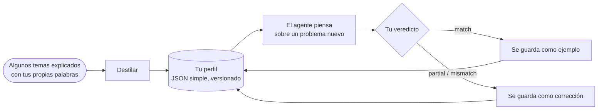

# Perfiles de pensador: razonar como una persona concreta

::: tip ¿Puede el SDK razonar como yo?
**Sí: puede imitar la forma de razonar de una persona concreta.** Un agente cognitivo puede seguir *tu* orden de atención, sopesar *tus* prioridades, aplicar *tus* reflejos y rechazar lo que *tú* rechazarías. Lo aprende de unos pocos problemas que explicas con tus propias palabras; cada vez que le dices dónde se equivocó, la corrección se añade a sus instrucciones, y tu grado de acuerdo muestra si se acerca más.

Imita una **forma de razonar**, no a una persona: no sabe lo que no has puesto por escrito, y no decide en tu lugar. El SDK no afirma cuánto se acerca en tu caso: **lo mides tú**, ejecución tras ejecución, como el porcentaje de acuerdo que das a sus respuestas.
:::

{.illustration}

## Qué significa "razonar como tú" {#what-reasoning-like-you-means}

| Imita | No imita |
| --- | --- |
| El **orden** en que examinas un problema (primero lo que realmente permite, después sus límites…) | Tus **conocimientos**: lo que sabes pero nunca pusiste por escrito, salvo que lo des como contexto u observaciones |
| Tus **prioridades** (lo que más te importa, en orden) | Tus **recuerdos** y tu vida: solo conoce las muestras, las correcciones y el contexto que le diste |
| Tus **reflejos** ("cuando un servicio es de pago, primero busco una alternativa gratuita") | Las intuiciones que nunca pusiste en palabras |
| Lo que te hace **rechazar** una idea | Tu **responsabilidad**: su respuesta es una predicción de lo que pensarías, no una decisión tomada por ti |
| Tu **apetito de riesgo** | Tu certeza sobre el mundo: las afirmaciones siguen necesitando evidencia, como en cualquier agente cognitivo |
| Los **errores que corregiste**: se le indica que no los repita | |

## Cómo funciona, paso a paso {#how-it-works-step-by-step}



### Paso 1: explica algunos temas con tus propias palabras {#step-1-explain-a-few-topics-in-your-own-words}

Una **muestra** es un tema sobre el que razonaste, escrito tal y como te vino. Da igual que esté desordenado. Tiene tres partes:

| Campo | Qué escribir | Ejemplo |
| --- | --- | --- |
| `topic` | El tema, en pocas palabras | "Un robot que solo ordena cocinas" |
| `reasoning` | Cómo lo abordaste: qué miraste primero, qué comprobaste, qué te hizo dudar, por qué | "¿Qué hace realmente? Solo una habitación, así que el límite es la generalización. ¿Podría aprender otra habitación a partir de unos pocos ejemplos?…" |
| `conclusion` | Lo que concluiste o harías (opcional, pero se convierte en un ejemplo de calibración) | "Construir un pequeño bucle adaptativo y probarlo en una segunda habitación" |

De cinco a diez muestras sobre temas **variados** funcionan mejor que muchas muestras sobre un solo tema: el destilador busca lo que se repite **de un tema a otro**, y un patrón visto una sola vez es débil.

### Paso 2: destila tu perfil {#step-2-distill-your-profile}

```ts
const profile = await sdk.distillThinkerProfile({
  id: 'nicolas',
  name: 'Nicolas',
  model: 'gpt-4o',
  samples: [
    {
      topic: 'Typed decision APIs like Jev',
      reasoning:
        'What does it really allow? Then the limits: closed, US-only, paid. Is there an open clone? ' +
        'Could it become the controller of my agents? I would benchmark it on my own traces first.',
      conclusion: 'Use an open clone as the controller and benchmark it against Jev',
    },
    { topic: 'World models', reasoning: 'Structure beats scale. Test on a small chaotic system before anything big.' },
  ],
});
```

Qué ocurre, exactamente:

1. Se comprueban las muestras: cada una necesita un tema y un razonamiento.
2. Una llamada al modelo de lenguaje hace de *analista cognitivo*. Busca las **operaciones recurrentes** de tu razonamiento, no tus opiniones: qué examinas primero, las preguntas que haces, hasta dónde llevas una idea, qué te hace rechazar una solución, tu relación con el riesgo, el coste y la novedad. Se le indica que conserve solo los patrones que respaldan las muestras, y que prefiera los que aparecen en varias muestras.
3. Su respuesta se valida contra el esquema del perfil. Una respuesta no válida se devuelve una vez con el error; un segundo fallo lanza un `ThoughtGenerationError` en lugar de devolver un perfil a medio hacer.
4. Las muestras que tienen una conclusión se conservan dentro del perfil como **ejemplos**, de modo que el perfil lleva a la vez el método extraído y la evidencia de la que procede.

El resultado es JSON simple. **Léelo**: si un paso o una prioridad está mal o falta, corrígelo a mano. Te conoces mejor de lo que te conoce una sola extracción.

### Paso 3: deja que el agente piense como tú {#step-3-let-the-agent-think-as-you}

```ts
const twin = sdk.createCognitiveAgent({
  name: 'my-twin',
  model: 'gpt-4o',
  profile,
  systemPrompt: "Write every statement and the answer in French, in the thinker's own voice.", // optional
});

const run = await twin.think({
  problem: 'A bank offers you a stable, well-paid CTO job maintaining legacy systems. What do you decide?',
});
console.log(run.decision?.status, run.decision?.answer);
```

El perfil se **copia cuando se inicia la ejecución**, así que una corrección dada durante una ejecución se aplica a la siguiente. Se escribe en las instrucciones de cada paso del razonamiento, y al paso final `decide` se le pide *la respuesta que daría el pensador*, con una justificación que sigue el orden de atención del pensador. [Dónde pesa el perfil](#where-the-profile-weighs-and-where-it-never-does) enumera cada lugar.

### Paso 4: dile dónde se equivocó {#step-4-tell-it-where-it-went-wrong}

Después de una ejecución, da tu **veredicto**: ¿razonó como lo habrías hecho tú?

```ts
// "Yes, exactly what I would have thought."
await twin.learnFromFeedback(run.runId, { verdict: 'match' });

// "No, I would have gone another way."
await twin.learnFromFeedback(run.runId, {
  verdict: 'mismatch',
  expected: 'Prototype with the free clone first, then compare with Jev on 100 real tickets',
  lesson: 'Always test the free option on real data before paying',
});

// "You are 50% right, and here is where you went wrong."
await twin.learnFromFeedback(run.runId, {
  verdict: 'partial',
  agreement: 0.5,
  wrongAbout: ['ignored the free option', 'overestimated the integration cost'],
  expected: 'Benchmark the open clone on our own tickets before deciding',
});
```

| Campo | Significado | Obligatorio |
| --- | --- | --- |
| `verdict` | `match` (razonó como tú), `partial` (en parte), `mismatch` (en absoluto) | Siempre |
| `agreement` | Cuánto compartes de ella, de 0 a 1: `0.8` significa "acertado en un 80 %" | No |
| `expected` | Lo que habrías concluido tú en su lugar | Con `partial` y `mismatch` |
| `wrongAbout` | Dónde se equivocó el razonamiento, con tus palabras | No |
| `lesson` | La regla que hay que recordar la próxima vez (por defecto, `expected`) | No |
| `notes` | Cualquier otra cosa, que se conserva en el evento | No |

Qué ocurre con él:

| Veredicto | Efecto en el perfil |
| --- | --- |
| `match` | La ejecución se convierte en un **ejemplo** de calibración: su pregunta, un resumen de sus pasos de razonamiento y su conclusión. Cada `match` conserva los 10 ejemplos más recientes, incluidas las muestras destiladas. |
| `partial` / `mismatch` | Se registra una **corrección**: lo que concluyó el agente, lo que esperabas, tu grado de acuerdo, dónde se equivocó y la lección. Se conservan las 20 más recientes. Las correcciones cierran el perfil en las instrucciones de cada paso del razonamiento, como máxima prioridad: "no repitas estos errores". El controlador Jev ve las cinco últimas lecciones. |

Cada veredicto incrementa la versión de parche del perfil (`1.0.0` → `1.0.1`) y se añade a la ejecución como un evento `cognition.feedback`, con la versión del perfil antes y después. Una ejecución sin decisión no puede recibir retroalimentación: no hay nada que juzgar.

`learnFromFeedback` devuelve el perfil refinado y lo conserva en el agente. **Guárdalo** (`twin.getProfile()` es JSON simple), o las lecciones se pierden cuando se detiene tu proceso.

### Paso 5: mide cuánto se acerca {#step-5-measure-how-close-it-gets}

El SDK registra tus veredictos; no se califica a sí mismo. Para saber si realmente razona como tú, sigue un protocolo sencillo:

1. Prepara **problemas nuevos** que el agente no haya visto nunca, sobre temas variados.
2. **Escribe primero tu propia respuesta**, antes de leer la del agente, para que su respuesta no influya en la tuya.
3. Ejecuta el agente y puntúa cada respuesta: `agreement`, en qué se equivocó (`wrongAbout`), lo que esperabas (`expected`).
4. Da esa retroalimentación y guarda el perfil refinado.
5. En la siguiente ronda, usa **otros problemas nuevos** y compara el acuerdo medio con el de la ronda anterior.

Si la media sube en problemas que nunca ha visto, es señal de que está captando tu *forma* de razonar, y no solo las respuestas que corregiste; con un puñado de problemas, una subida también puede deberse al azar, así que continúa durante varias rondas. Si solo mejora en los problemas que corregiste, está copiando respuestas.

```ts
const scores = [0.4, 0.6, 0.5]; // the agreement you gave this round
const average = scores.reduce((sum, value) => sum + value, 0) / scores.length; // 0.5, that is 50%
```

## Anatomía de un perfil {#anatomy-of-a-profile}

También puedes escribir un perfil a mano:

```ts
import { defineThinkerProfile } from '@sdk-ai-agents/core';

const builder = defineThinkerProfile({
  id: 'builder',
  name: 'Pragmatic builder',
  summary: 'Looks for what a technology really enables, then its limits, then a prototype.',
  reasoningSequence: [
    { id: 'real-capability', instruction: 'Establish what the technology really enables' },
    { id: 'limits', instruction: 'Look for its limits immediately' },
    { id: 'workaround', instruction: 'Imagine how to work around those limits' },
    { id: 'product', instruction: 'Check whether it can become a product' },
    { id: 'automation', instruction: 'Ask how the product could run itself' },
    { id: 'generalize', instruction: 'Extrapolate towards a more general architecture' },
    { id: 'prototype', instruction: 'Design the smallest prototype that tests it' },
  ],
  priorities: ['Real capability over hype', 'Free and open options first', 'Fast feedback'],
  heuristics: [{ when: 'a service is paid and closed', action: 'look for an open alternative before paying' }],
  rejectionCriteria: ['Cannot be tested with a prototype', 'Locks data in a vendor'],
  riskAppetite: 'high',
});

const agent = sdk.createCognitiveAgent({ name: 'me', model: 'gpt-4o', profile: builder });
```

`defineThinkerProfile` valida el perfil y completa lo que falta con valores por defecto (listas vacías, `riskAppetite: 'medium'`, `version: '1.0.0'`).

| Campo | En palabras sencillas | Cómo lo usa el motor |
| --- | --- | --- |
| `id`, `name`, `version` | A quién describe este perfil, y qué revisión es | Se registra en cada ejecución, para que sepas qué versión del perfil la produjo |
| `summary` | Una frase que describe el estilo | Se escribe al principio del perfil en los prompts |
| `reasoningSequence` | Los pasos por los que pasas, en orden | Se escribe como "Orden de atención (síguelo)"; la respuesta final lo sigue |
| `priorities` | Lo que más importa, lo más importante primero | Se escribe en los prompts; se usa para juzgar cuánto te conviene una elección |
| `heuristics` | Tus reflejos: "cuando …, entonces …" | Se escriben como reglas en los prompts |
| `rejectionCriteria` | Lo que te hace descartar una idea | Se usan para criticar las opciones y rechazar las que tú rechazarías |
| `riskAppetite` | `low`, `medium` o `high` | Se escribe en los prompts |
| `examples` | Ejecuciones y muestras que validaste | Se muestran como "ejemplos validados de su razonamiento": el modelo se calibra con ellos |
| `corrections` | Lecciones de ejecuciones con las que no estuviste de acuerdo | Se muestran al final del perfil, como máxima prioridad |

Sin perfil, los agentes usan `DEFAULT_THINKER_PROFILE`, un analista neutral que prioriza la evidencia.

## Dónde pesa el perfil, y dónde no pesa nunca {#where-the-profile-weighs-and-where-it-never-does}

| Momento del razonamiento | ¿Cuenta tu perfil? |
| --- | --- |
| **Cada paso del razonamiento** (representar, formular hipótesis, simular, criticar, comparar, decidir, leer el resultado de una herramienta) | Sí: el perfil completo está en las instrucciones que recibe el modelo de lenguaje. Solo lo deja fuera la breve solicitud que elige a qué herramienta llamar |
| **Elegir el siguiente paso** | Con el controlador Jev, sí: ve tu orden de atención, tus prioridades, tus criterios de rechazo, tu apetito de riesgo y tus cinco últimas lecciones. Sin Jev, el controlador heurístico sigue un orden fijo, y tu perfil moldea en cambio el contenido de cada paso |
| **Crítica** | Sí: las opciones se atacan con tus criterios de rechazo |
| **Cuánto te conviene una elección** (`preferenceFit`) | Sí: esa es su finalidad. Una elección que se considera que cumple uno de tus criterios de rechazo queda peor clasificada, y se rechaza cuando el juez está seguro de ello (Jev pone toda su probabilidad en ese nivel) o, con un modelo de lenguaje como juez, cuando el modelo la rechaza |
| **Cuánto respalda la evidencia una opción** (`support`) | **No.** Con Jev, esta pregunta se envía sin tu perfil; con un modelo de lenguaje, se indica al modelo que ignore las preferencias |
| **Qué elección de acción queda primera en la clasificación** | Sí, para las elecciones de acción, con un peso del 40 % por defecto |
| **Si una elección de acción puede adoptarse en firme** | Sí, cuando la prefieres claramente y los hechos no hablan en su contra |
| **Si una afirmación sobre el mundo es creíble** | **Nunca** en el código: las dos puntuaciones nunca se mezclan. Con un modelo de lenguaje como juez, la separación depende de sus instrucciones, y una afirmación que el modelo etiquete por error como elección podría tomar la vía de la preferencia (consulta [Tipos declarados](./evidence-and-verification#not-there-yet)) |

### Las dos puntuaciones {#the-two-scores}

Cuando se comparan las opciones, cada una recibe hasta dos puntuaciones entre 0 y 1:

| Puntuación | Pregunta | 0 | 0,25 | 0,5 | 0,75 | 1 |
| --- | --- | --- | --- | --- | --- | --- |
| `support` | ¿Hasta qué punto la respaldan los hechos, las observaciones, las pruebas y las críticas? | Refutada | Débilmente respaldada | Plausible | Fuertemente respaldada | Establecida |
| `preferenceFit` | ¿Hasta qué punto le conviene esta elección al pensador? (solo elecciones de acción) | Cumple un criterio de rechazo | Ajuste pobre | Ajuste aceptable | Buen ajuste | Ajuste ideal |

Estos son los niveles por los que pregunta el valorador Jev; un modelo de lenguaje como juez da un número entre 0 y 1 para cada una, que se lee de la misma forma. Ambas son juicios, no probabilidades medidas.

### Cómo se clasifica y se adopta en firme una elección {#how-a-choice-is-ranked-and-committed}

Toma el problema del empleo en el banco de arriba, con dos opciones:

| Opción | `support` | `preferenceFit` | Puntuación de clasificación: 60 % respaldo + 40 % ajuste |
| --- | --- | --- | --- |
| H1: aceptar el empleo | 0,5 (plausible) | 0,25 (ajuste pobre: nada nuevo que construir) | 0,6 × 0,5 + 0,4 × 0,25 = **0,40** |
| H2: rechazarlo y seguir construyendo | 0,5 (plausible) | 1 (ajuste ideal) | 0,6 × 0,5 + 0,4 × 1 = **0,70** |

Los hechos respaldan por igual ambas opciones; tus preferencias ponen H2 en primer lugar. El peso es `limits.preferenceWeight` (0,4).

Para adoptarse **en firme** (una respuesta firme, en lugar de una provisional o una abstención), una opción debe superar la [guarda de conclusión](./evidence-and-verification#the-conclusion-guard). Su evidencia es suficiente de una de estas dos formas:

- **solo por la evidencia**, para cualquier tipo de hipótesis: un `support` de al menos `limits.decisionThreshold` (0,75, "fuertemente respaldada");
- **por tu elección**, solo para una elección de acción: un `preferenceFit` de al menos `limits.decisionThreshold` (0,75, "buen ajuste") **y** un `support` de al menos `limits.minProposalSupport` (0,35, un poco por encima de "débilmente respaldada").

H2 toma la segunda vía: respaldo 0,5 ≥ 0,35, ajuste 1 ≥ 0,75. Se adopta en firme con una **confianza de 0,5**, porque la confianza de una decisión nunca supera su respaldo de la evidencia: la respuesta dice "esta es la elección del pensador", no "esto está demostrado".

Por qué existe la segunda vía: una pregunta como *"¿aceptarías este empleo?"* tiene poca evidencia que sopesar. Una persona la decide con sus prioridades, siempre que los hechos no hablen en contra de la elección. En una ejecución real con un perfil de pensador, estas preguntas terminaban sin una respuesta en firme antes de que existiera esta segunda vía.

Por qué está cerrada a las afirmaciones: un enunciado como *"la IA de esta start-up detecta mentiras con un 99 % de precisión"* es una **regla** sobre el mundo. Aunque te encantaría que fuera cierto, solo se adopta en firme si su respaldo de la evidencia alcanza 0,75, siempre que el modelo lo etiquete como regla, que es lo que se le indica que haga (consulta [Tipos declarados](./evidence-and-verification#not-there-yet)). Las preferencias pueden elegir qué hacer; nunca hacen que algo sea cierto.

## Límites {#limits}

- **El modelo importa.** El perfil es un conjunto de instrucciones: un modelo pequeño las sigue con menos fidelidad que uno grande.
- **Solo sabe lo que le diste.** Da los hechos de tu situación como `context` u `observations` cuando importen.
- **Un primer perfil es un esbozo.** Un puñado de muestras da un puñado de patrones; son las correcciones las que lo refinan.
- **Su memoria es limitada.** Se conservan 20 correcciones, y cada `match` conserva los 10 ejemplos más recientes (un perfil destilado puede empezar con más); los más antiguos se descartan.
- **La fidelidad no es la verdad.** Tu retroalimentación mide si el agente razonó **como tú**, no si **acertó**. Para comprobar una afirmación contra el mundo, dale al agente un [evaluador de resultados](./evidence-and-verification#predictions-and-the-outcome-evaluator).
- **Son datos personales.** Las muestras, los perfiles y los eventos de estas ejecuciones describen cómo piensa una persona. Guárdalos de forma privada, nunca en un repositorio público, y pide consentimiento antes de perfilar a otra persona.

## Los perfiles son datos {#profiles-are-data}

Los perfiles son JSON simple: guárdalos donde quieras y vuelve a cargarlos con `agent.setProfile(profile)` o con la opción `profile`. Los eventos llevan `profileId` y `profileVersion`, así que siempre sabes qué versión del perfil produjo una ejecución.

## Entrena tu propio controlador {#train-your-own-controller}

Cada elección de operación se registra con el estado que vio el controlador. Expórtalas como JSON Lines:

```ts
const jsonl = await sdk.exportControllerDataset(); // or pass runIds
```

```json
{"runId":"run_…","step":3,"state":{…},"available":["hypothesize","simulate","critique","decide"],"operation":"simulate","controller":"jev","confidence":0.82,"usedFallback":false,"runStatus":"completed","feedback":"partial","agreement":0.5}
```

Filtra por `feedback: "match"` y tendrás ejemplos supervisados de *tu* forma de elegir el siguiente movimiento: suficientes para ajustar un modelo abierto pequeño y conectarlo como un `CognitiveController` personalizado, sin coste por llamada.
