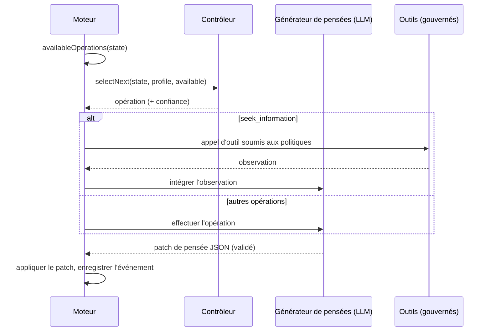

# Agents cognitifs

Un agent cognitif ne répond pas en un seul passage. Il tient un **état mental explicite** et l'améliore une **opération cognitive** à la fois, jusqu'à pouvoir s'engager sur une décision qu'il sait justifier.

::: tip En termes simples
Une IA habituelle répond d'un seul jet, et son raisonnement disparaît. Un agent cognitif travaille comme quelqu'un muni d'un carnet : il note ce qu'il sait, ce qu'il suppose et ce qu'il ignore encore, dresse la liste de plusieurs options, imagine leurs conséquences, cherche ce qui pourrait mal tourner, vérifie les faits avec les outils que vous avez autorisés, compare les options, et seulement ensuite décide. Chacun de ces mouvements est une **opération**, et chacun est consigné dans le carnet, si bien que vous pouvez relire tout le raisonnement après coup. S'il ne parvient pas à une conclusion solide, il le dit. Chaque terme de cette page est expliqué dans [Les termes clés expliqués simplement](./glossary#how-a-cognitive-agent-reasons).
:::

{.illustration style="max-width:460px"}

```ts
const agent = sdk.createCognitiveAgent({
  name: 'analyst',
  model: 'gpt-4o',
  tools: [lookupMetric],
  profile: myProfile, // optional, see Thinker profiles
});

const { status, answer, decision, state, runId } = await agent.think({
  problem: 'Should we build or buy our analytics module?',
  context: { budget: '10k EUR', deadline: 'before Q4' },
  observations: [{ content: 'Churn was 4% last month', originGroup: 'billing' }], // optional
});

decision?.status; // 'committed' | 'provisional' | 'abstain'
```

::: tip Les preuves d'abord
La façon dont les observations sont tracées, les prédictions testées et les conclusions protégées est décrite dans [Preuves et vérification](./evidence-and-verification).
:::

## L'état mental {#the-mental-state}

L'état mental est constitué de données simples et typées. Chaque élément reçoit un identifiant stable auquel le modèle peut faire référence.

| Partie | Identifiants | Ce qu'elle contient |
| --- | --- | --- |
| `observations` | `O1…` | Ce qui a été observé — fourni avec le problème, renvoyé par un outil ou par un test — avec sa provenance |
| `facts` | `F1…` | Des affirmations avec une source (`input`, `tool`, `inference`), les observations dont elles proviennent, et un statut (`active`, `superseded`, `retracted`) |
| `assumptions` | `A1…` | Ce que le raisonnement tient pour acquis |
| `constraints` | `K1…` | Ce que toute réponse doit respecter |
| `unknowns` | `U1…` | Les questions ouvertes — `open`, `resolved` ou `dropped`, avec le nombre de tentatives |
| `hypotheses` | `H1…` | Des propositions, des règles ou des explications, avec leurs prémisses, leurs simulations, leurs critiques, un soutien par les preuves (`support`), une adéquation aux préférences (`preferenceFit`) et un statut |
| `comparisons` | `R1…` | Les relations entre observations : similarité, différence, évolution, incompatibilité, contre-exemple |
| `predictions` | `P1…` | Ce qu'une hypothèse prédit, ce qui la réfuterait, et le résultat du test |
| `contradictions` | `C1…` | Les conflits entre éléments, avec une catégorie, jusqu'à leur résolution par des preuves citées |
| `failures` | `X1…` | Ce qui a déjà échoué, pour ne pas le retenter à l'aveugle |
| `knowledge` | `M1…` | Ce que des exécutions antérieures du même périmètre ont établi par de vrais tests, rappelé au démarrage de l'exécution (voir [Mémoire entre exécutions](./memory)) |
| `confidence`, `evidenceRevision` | | Le soutien que les preuves apportent à la meilleure réponse ; un compteur qui rend périmées les évaluations plus anciennes |
| `decision`, `trail` | | La décision finale et son statut, une ligne par étape |

{.illustration style="max-width:760px"}

L'état n'est **jamais modifié sur place**. Chaque opération produit un *patch de pensée* ; ce patch est enregistré sous forme d'événement `cognition.thought` ; l'état est le résultat de l'application successive de tous les patchs. C'est pourquoi `sdk.getMentalState(runId)` peut reconstruire exactement n'importe quelle exécution, même des mois plus tard.

## Les opérations {#the-operations}

| Opération | Ce qu'elle fait | Disponible quand |
| --- | --- | --- |
| `represent` | Extrait les faits, les suppositions, les contraintes et les inconnues | Toujours en premier ; de nouveau quand une contradiction est ouverte |
| `compare_observations` | Met les observations en relation : similitudes, différences, évolutions, contre-exemples | Au moins deux observations comparables (doublons et résultats de tests exclus), avec de nouvelles observations depuis la dernière comparaison |
| `hypothesize` | Formule de nouvelles propositions, règles ou explications | Il y a moins d'hypothèses actives que `maxHypotheses` |
| `simulate` | Projette les conséquences étape par étape et énonce des prédictions testables | Une hypothèse n'a pas de simulation |
| `test_prediction` | Exécute votre évaluateur de résultats sur une prédiction enregistrée — sans appel au LLM | Un évaluateur est configuré, une prédiction est en attente, il reste du budget de tests |
| `revise` | Transforme une hypothèse contredite par les preuves en une variante au périmètre restreint | Une hypothèse réfutée ou contredite n'a pas encore de variante |
| `critique` | Trouve les raisons les plus fortes pour lesquelles une hypothèse pourrait échouer | Une hypothèse n'a pas de critique |
| `seek_information` | Appelle un outil gouverné pour répondre à une inconnue ouverte | Des outils existent, une inconnue est ouverte, il reste du budget d'outils |
| `compare` | Juge le soutien apporté par les preuves, et l'adéquation des propositions au penseur | Une hypothèse critiquée a changé, ou les preuves ont changé, depuis la dernière comparaison |
| `decide` | S'engage sur une réponse, une justification, une confiance et des prochaines actions | Une hypothèse passe le [garde-fou de conclusion](./evidence-and-verification#the-conclusion-guard) |

**Le code décide de ce qui est possible, le contrôleur décide de ce qui est utile.** Les préconditions sont calculées à partir de l'état, et le contrôleur ne peut choisir que parmi les opérations disponibles.

Règles imposées par le code, quoi que dise le modèle :

- une critique `fatal` sans réfutation, ou une prédiction réfutée, rejette son hypothèse ;
- une hypothèse rejetée ne peut être ni ranimée, ni reformulée, ni sélectionnée — seulement révisée en une variante qui dit ce qui a changé ;
- le code ne mêle jamais les préférences au soutien que les preuves apportent à une affirmation, et le modèle ne peut pas fixer la confiance de l'état ;
- une contradiction n'est résolue qu'une fois, et seulement en citant les observations ou les faits qui la tranchent ;
- une étape qui n'a rien changé de ce qu'elle devait changer, ou une décision reportée, compte comme une tentative échouée ; après deux d'affilée, l'opération n'est plus proposée tant qu'une autre étape n'a pas apporté de nouvelles preuves (voir [Un budget qui n'est pas gaspillé](./evidence-and-verification#a-budget-that-is-not-wasted)) ;
- la provenance (observations, résultats de tests) et le statut de la décision sont écrits par le moteur : une réponse du modèle qui les contient en est expurgée ;
- les références à des identifiants inconnus sont ignorées et signalées comme `issues` dans l'événement de pensée ;
- au plus `maxHypotheses` hypothèses sont en jeu : les propositions en trop sont écartées et signalées ;
- une inconnue n'est plus examinée après deux tentatives infructueuses, ou immédiatement quand aucun outil disponible ne peut y répondre, et la reformulation (`represent` sur une contradiction) est proposée au plus trois fois ;
- une opération en échec est enregistrée comme échouée et ne compte pas comme effectuée ;
- la **dernière étape est toujours une tentative de décision** : une réponse qui ne passe pas le garde-fou de conclusion devient `provisional` (avec ce qui manque) ou `abstain` ; si le modèle ne parvient pas du tout à produire une décision, le moteur s'abstient et en consigne la raison.

## Les contrôleurs {#controllers}

Le contrôleur choisit l'opération suivante.



| Contrôleur | Comment il choisit | Quand l'utiliser |
| --- | --- | --- |
| `heuristic` | Un ordre d'attention fixe : représenter → réviser → comparer les observations → formuler des hypothèses → simuler → tester les prédictions → critiquer → chercher de l'information → comparer → décider | Par défaut sans Jev, déterministe, gratuit |
| `typed` | Une requête Jev par étape : un Choice parmi les opérations disponibles et un Noul « prêt à décider ? » | Un raisonnement adaptatif avec une confiance calibrée |
| le vôtre | Implémentez `CognitiveController.selectNext()` | Un modèle local affiné, des règles métier, … |

Avec `controller: 'auto'` (la valeur par défaut), l'agent utilise Jev quand le SDK dispose d'un backend de décisions typées, et l'heuristique sinon. Le contrôleur typé **se replie sur l'heuristique** quand la confiance du Choice est inférieure à `minConfidence` (0,35), quand le client échoue, ou quand la réponse n'est pas une opération disponible. Un contrôleur personnalisé qui lève une exception ou renvoie une opération indisponible est lui aussi remplacé par l'heuristique. Chaque repli est enregistré dans le champ `fallbackFrom` de l'événement de sélection.

```ts
sdk.createCognitiveAgent({
  name: 'analyst',
  model: 'gpt-4o',
  controller: 'typed',
  controllerOptions: { minConfidence: 0.5, readinessThreshold: 0.85 },
  assessment: 'typed', // compare hypotheses with Jev Score questions
});
```

## Les outils au sein du raisonnement {#tools-inside-reasoning}

`seek_information` utilise les **moteurs natifs de raisonnement et d'action** : le LLM choisit un outil pour l'inconnue ouverte, le moteur d'action vérifie que l'outil a bien été **donné à cet agent**, valide l'appel au regard des politiques (limites d'exécution comprises, voir [Limites et politiques](#limits-and-policies)), des approbations et des budgets, et le résultat est enregistré comme une **observation** qui pointe vers son événement `action.executed`, puis intégré sous forme de faits avec `source: "tool"`. L'observation est conservée même si son interprétation échoue. Un outil refusé, bloqué ou en échec devient un échec enregistré, et le raisonnement continue.

## Les limites {#limits}

```ts
sdk.createCognitiveAgent({
  name: 'analyst',
  model: 'gpt-4o',
  limits: {
    maxSteps: 12,              // the last one always decides
    timeoutMs: 180_000,
    maxHypotheses: 3,          // in play at the same time
    maxToolCalls: 5,
    decisionThreshold: 0.75,   // evidence support a committed answer needs (see minProposalSupport)
    maxConsecutiveFailures: 3, // then the run fails (and alerts you, if incidents are on)
    maxPredictionTests: 4,     // calls to the outcome evaluator per run
    preferenceWeight: 0.4,     // weight of the thinker's preferences when ranking proposals
    minProposalSupport: 0.35,  // evidence support enough for a choice of action the thinker clearly prefers
  },
  evaluator: myBench,          // optional OutcomeEvaluator, enables test_prediction
  knowledge: { store, scope: 'my-domain' }, // optional memory across runs
});
```

Les limites sont validées à la création de l'agent : `maxSteps: 0` ou un délai maximal au-delà de ce qu'un minuteur peut gérer lève une `ValidationError` au lieu de désactiver silencieusement une protection. `minProposalSupport` ne peut pas dépasser `decisionThreshold` ; donnez-lui la même valeur que `decisionThreshold` pour que seules les preuves puissent rendre une réponse ferme. Si vous abaissez `decisionThreshold` sans définir `minProposalSupport`, ce plancher baisse avec lui.

### Limites et politiques {#limits-and-policies}

Les politiques de budget et de durée qui s'appliquent à l'agent — celles de ses `policies` et les politiques globales — sont vérifiées **avant chaque étape**, avant tout appel au modèle de cette étape, puis de nouveau avant chaque appel d'outil. Elles voient la progression de l'exécution : `maxSteps` compte les étapes déjà effectuées, `maxTokens` les tokens des appels au modèle de l'exécution (pensées et leurs réparations, sélections d'outil, décisions typées), `maxDuration` le temps écoulé depuis le début de l'exécution. Les budgets de tokens et de coût par période (`budgetLimit` avec `maxTokens` ou `maxCost`, sans `toolName`) sont eux aussi vérifiés avant chaque étape, et chaque appel au modèle que l'exécution enregistre y est compté (voir [Coûts d'API](./costs#budgets)). Une étape est vérifiée comme une intention de type `continue` : une politique dont les conditions exigent un appel d'outil (`intention.type` égal à `tool_call`) ne s'applique qu'aux appels d'outils. Les listes d'autorisation, les politiques personnalisées, les budgets d'appels (`maxToolCalls`) et les approbations ne concernent que les appels d'outils.

La première limite atteinte met fin à l'exécution, et les deux sortes de limites n'y mettent pas fin de la même façon :

| Limite | `limits` de l'agent | Politiques |
| --- | --- | --- |
| Étapes | `maxSteps` : la dernière étape décide ; `completed`, avec une décision `committed`, `provisional` ou `abstain` | `maxSteps` : l'étape suivante est refusée ; `failed` |
| Durée | `timeoutMs` : l'exécution est interrompue, un appel en cours reçoit le signal d'interruption ; `failed`, `Timeout exceeded (… ms)` | `maxDuration` : vérifiée entre les étapes et avant les appels d'outils, un appel en cours va à son terme ; `failed`, `Timeout (… ms) exceeded` |
| Tokens, coût | — | `maxTokens`, budgets par période : l'étape suivante est refusée ; `failed` |
| Appels d'outils | `maxToolCalls` : `seek_information` n'est plus proposée | Un appel refusé est un échec enregistré, et le raisonnement continue |

Une étape refusée est enregistrée comme `policy.violated` — avec `intention: { type: 'continue' }`, l'étape (`step`), la raison (`reason`) et les politiques en cause (`violatedPolicies`) — puis `run.failed` avec la raison de la politique ; le résultat a `status: 'failed'` et une `PolicyViolationError` pour `error`. Un appel d'outil refusé par une limite d'exécution est enregistré comme `policy.violated` et comme une opération en échec ; la limite restant dépassée, l'étape suivante est refusée et l'exécution échoue. Pour finir sur une décision plutôt que sur un refus, gardez le `maxSteps` de l'agent inférieur ou égal à celui de la politique : sa dernière étape décide alors avant que la politique ne refuse quoi que ce soit.

## Sortie invalide du modèle {#invalid-model-output}

Chaque opération a un contrat JSON strict, validé par Zod. Une réponse qui n'est pas du JSON valide, à laquelle il manque son champ obligatoire ou qui utilise une valeur incorrecte est renvoyée **une fois** au modèle avec l'erreur de validation. Les champs qu'une opération n'a pas le droit d'écrire (une `decision` pendant `simulate`, par exemple) sont ignorés et listés dans `ignoredFields`. Si la réparation échoue aussi, l'opération est enregistrée comme un échec et la boucle continue.

## Arrêter, annuler, expirer {#stop-cancel-time-out}

```ts
const pending = agent.think({ problem });
await agent.stop();          // or agent.stop(runId)
const result = await pending; // status: 'cancelled'
```

Un dépassement du délai produit `status: 'failed'` avec `Timeout exceeded (… ms)`, et l'exécution est marquée en échec dans le journal d'événements. `sdk.stopRun(runId)` arrête aussi les exécutions cognitives. Le délai et l'arrêt sont vérifiés entre deux opérations et transmis à votre fournisseur sous forme de signal d'interruption ; les fournisseurs OpenAI et Anthropic intégrés n'annulent pas une requête déjà en cours, si bien qu'un appel lent se termine au délai propre au fournisseur.

Le profil est **figé au démarrage de l'exécution** : un retour donné pendant qu'une exécution est en cours s'applique à l'exécution suivante.

## Sécurité {#security}

Un agent cognitif lit du texte qu'il n'a pas écrit : des résultats d'outils, des descriptions d'outils MCP, des documents fournis dans le contexte. Traitez tout cela comme des **entrées non fiables** — elles peuvent contenir des instructions destinées au modèle (injection de prompt). Le SDK limite ce qu'un tel texte peut obtenir :

- l'agent ne peut appeler que les outils qui lui ont été donnés, et les politiques sont vérifiées à chaque appel — placez les outils destructeurs derrière des politiques `require_approval` ;
- le modèle n'exécute jamais rien lui-même : il propose, le moteur d'action valide ;
- les invariants de l'état mental sont imposés par le code, pas par le prompt ;
- chaque appel d'outil et chaque pensée figurent dans le journal d'événements, pour examen.

Le journal d'événements stocke l'objectif, le contexte et chaque pensée, et les événements `decision.evaluated` stockent le contexte envoyé à Jev. Appliquez au magasin d'événements que vous choisissez les règles de conservation et d'anonymisation qu'exigent vos données.

## Rejeu et audit {#replay-and-audit}

Une exécution cognitive est une exécution normale :

- `sdk.getTrace(runId)` montre les événements `cognition.*` à côté de `policy.checked`, `tool.called`, …
- `sdk.replay(runId)` exécute de nouveau ses appels d'outils sans appeler le LLM et reproduit la réponse finale — avec la même restriction d'outils que l'exécution d'origine, si bien qu'un outil refusé à l'agent est refusé de nouveau, et avec la progression de l'exécution à chaque appel, si bien qu'un appel refusé par une limite d'exécution est refusé de nouveau ;
- `sdk.getMentalState(runId)` reconstruit l'état ;
- `sdk.exportControllerDataset()` transforme des exécutions en données d'entraînement (voir [Profils de penseur](./thinker-profiles#train-your-own-controller)).
