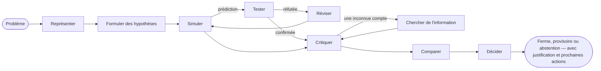

# Introduction

**SDK AI Agents** est un SDK TypeScript pour construire des agents d'IA auxquels vous pouvez faire confiance en production : des agents qui raisonnent de manière explicite avant d'agir, à qui l'on peut apprendre la façon dont *vous* pensez, et dont chaque étape est gouvernée, tracée, chiffrée et rejouable.

{.illustration style="max-width:460px"}

## Pourquoi un SDK d'agents de plus ? {#why-another-agent-sdk}

Les API de LLM vous donnent un générateur de texte très performant. Ce qu'elles ne vous donnent pas, c'est le contrôle sur **la manière** dont une conclusion est atteinte :

- le raisonnement se déroule à l'intérieur du modèle, en un seul passage, et disparaît une fois la réponse affichée ;
- rien n'empêche le modèle d'agir sur une supposition, d'appeler le mauvais outil ou de trop dépenser ;
- quand quelque chose tourne mal, vous avez un prompt et une réponse — pas une histoire.

Ce SDK place une couche de raisonnement **autour** du modèle. Le LLM devient un composant parmi d'autres :

| Couche | Ce qu'elle fait | Où elle se trouve |
| --- | --- | --- |
| **État mental** | Faits, suppositions, contraintes, inconnues, hypothèses, contradictions, confiance | Reconstruit à partir des événements à tout moment |
| **Contrôleur** | Choisit la prochaine opération cognitive | Heuristique déterministe, décisions typées de Jev ou le vôtre |
| **Générateur de pensées** | Effectue une opération et renvoie un patch JSON validé | N'importe quel fournisseur de LLM |
| **Profil de penseur** | L'ordre d'attention, les priorités et les heuristiques d'une personne | Des données versionnées, affinées par les retours |
| **Gouvernance** | Politiques, listes d'autorisation, budgets, approbations, nouvelles tentatives | Vérifiée avant chaque action |
| **Magasin d'événements** | L'unique source de vérité | Fichier, SQLite ou PostgreSQL |

## Deux sortes d'agents {#two-kinds-of-agents}

Les **agents gouvernés** (`sdk.createAgent`) exécutent la boucle classique d'appel d'outils — le LLM propose une intention, le moteur d'action la valide et l'exécute. Ils sont idéaux pour les tâches bien définies.

Les **agents cognitifs** (`sdk.createCognitiveAgent`) raisonnent de manière explicite. Ils sont faits pour les décisions : choisir une architecture, trier un incident, évaluer une opportunité, répondre à des questions du type « devrions-nous… ? ».

Les deux sortes partagent les mêmes outils, politiques, magasin d'événements, rejeu, coûts et alertes d'incident.

## Peut-il raisonner comme une personne donnée ? {#can-it-reason-like-a-given-person}

**Oui.** Un agent cognitif peut imiter la façon dont une personne donnée raisonne. Vous expliquez quelques sujets avec vos propres mots ; le SDK en extrait un **profil de penseur** : l'ordre dans lequel vous examinez un problème, vos priorités, vos réflexes, ce qui vous fait rejeter une idée, votre appétence pour le risque. Ce profil est inscrit dans les instructions de chaque étape de son raisonnement. Après chaque exécution, vous dites dans quelle mesure vous êtes d'accord (par exemple « juste à 60 %, et voici où tu t'es trompé »), et la leçon est conservée pour les exécutions suivantes.

Ce qu'il imite, c'est une **façon de raisonner** : il ne sait pas ce que vous n'avez jamais écrit, il ne décide pas à votre place, et vos préférences ne rendent jamais plus crédible une affirmation sur le monde. Le SDK ne s'auto-évalue pas : c'est le pourcentage d'accord que vous donnez, exécution après exécution, sur des problèmes qu'il n'a jamais vus, qui vous indique à quel point il s'approche de vous. [Raisonner comme une personne donnée](./thinker-profiles) explique chaque étape.

## Ce que vous obtenez {#what-you-get}

- **Un raisonnement explicite** — dix opérations sur un état mental, avec des invariants imposés par le code (une hypothèse rejetée ne peut pas être sélectionnée, une critique fatale rejette une hypothèse, la dernière étape conclut toujours).
- **Des preuves que vous pouvez auditer** — des observations avec leur provenance, des prédictions testées par votre propre évaluateur, des règles réfutées révisées en variantes au périmètre restreint, des préférences tenues à l'écart des preuves, et un garde-fou de conclusion qui répond `committed`, `provisional` ou `abstain` ; avec un magasin de connaissances, ce que les tests ont répondu est mémorisé pour les exécutions suivantes.
- **Raisonner comme une personne donnée** : distillez un profil de penseur à partir de sujets expliqués avec vos propres mots, puis corrigez l'agent avec les verdicts `match`, `partial` ou `mismatch` et un pourcentage d'accord.
- **Des décisions typées** — [TypeSafe Jev](https://docs.typesafe.ai) ou tout backend compatible répond aux questions Noul, Choice et Score avec des probabilités calibrées.
- **Des connecteurs MCP** — exposez vos outils sous forme de serveur MCP, importez n'importe quel serveur MCP sous forme d'outils gouvernés.
- **Des études** — un chercheur qui comprend un objet, puis propose de le repenser avec les moyens d'aujourd'hui : sept passages, des affirmations vérifiées par rapport aux sources qu'il a réellement consultées, et une charte figée avec un gardien qui le maintient sur son objectif. Voir [Études](./studies).
- **L'exploitation intégrée** — coûts d'API par exécution, politiques de nouvelles tentatives qui ne s'empilent pas, alertes d'incident par e-mail ou par webhook.
- **Un event sourcing natif** — rejeu sans le LLM, traces de référence, détection des régressions, graphes de raisonnement.

Comment se compare-t-il aux autres frameworks ? Voir [Pourquoi ce SDK](./why). Ces termes sont nouveaux pour vous ? [Les termes clés expliqués simplement](./glossary) les explique un par un. Prêt ? Rendez-vous sur [Premiers pas](./getting-started).
