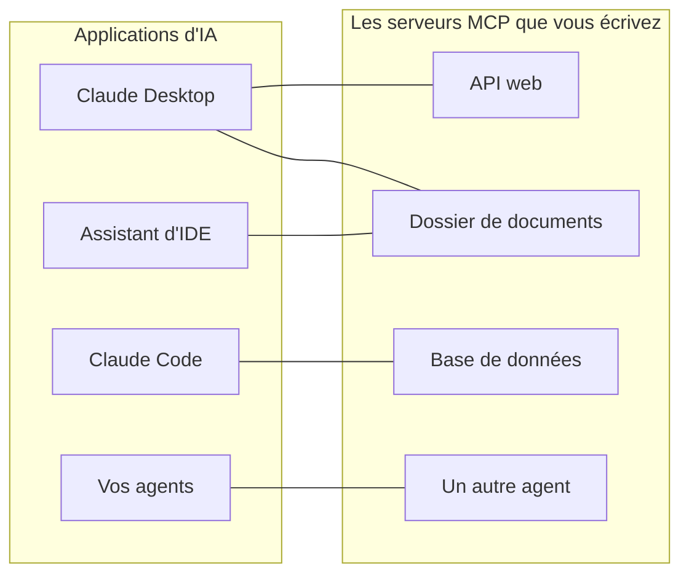
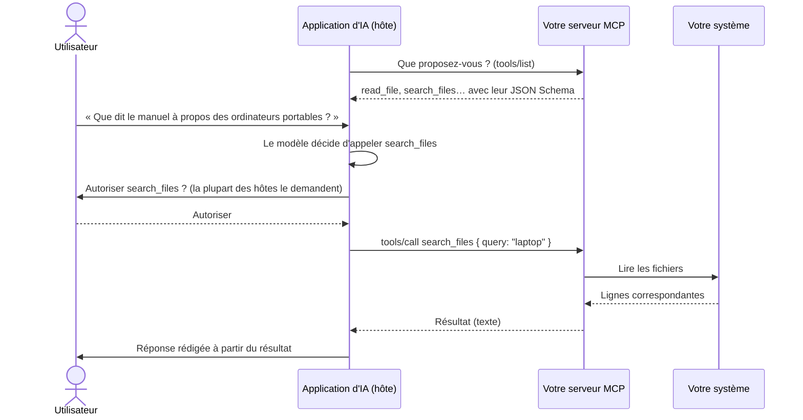
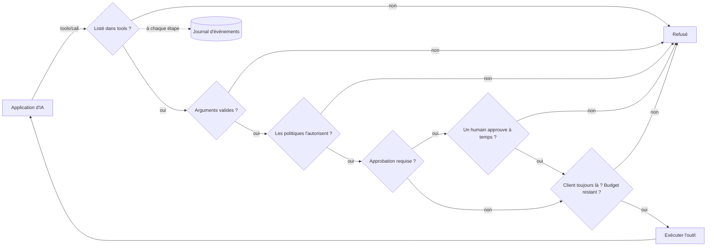

# MCP expliqué simplement

**MCP permet à une application d'IA — Claude Desktop, Claude Code, un assistant d'IDE, votre propre agent — d'utiliser vos systèmes : une API, un dossier de documents, une base de données, un autre agent.** Cette page explique l'idée et le vocabulaire. Les pages suivantes vous mènent de zéro à un serveur qui fonctionne :

1. [Votre premier serveur MCP en 5 minutes](./mcp-first-server) — pas à pas, d'un dossier vide jusqu'à Claude Desktop.
2. [Un serveur MCP pour tout](./mcp-recipes) — une ligne pour une fonction, une API web, un dossier, une base de données ou un agent.
3. [Déployer, sécuriser et dépanner](./mcp-deploy) — déploiement HTTP, authentification, approbations, et que faire quand cela ne fonctionne pas.

## L'idée : une seule prise pour toutes les applications d'IA {#the-idea-one-plug-for-every-ai-app}

Voyez MCP (Model Context Protocol) comme **l'USB-C des applications d'IA**. Avant l'USB, chaque appareil avait son propre câble. Avant MCP, chaque application d'IA avait besoin de son propre code d'intégration pour chaque système avec lequel elle communiquait : une intégration pour Claude, une autre pour votre IDE, une autre pour votre agent.

Avec MCP, vous écrivez **un petit programme — un serveur MCP — placé devant votre système**. Toute application qui parle MCP peut alors s'y brancher, lister ce qu'il propose et l'utiliser. Vous construisez le serveur une fois ; il fonctionne partout.



Le protocole est un standard ouvert publié sur [modelcontextprotocol.io](https://modelcontextprotocol.io). Anthropic l'a lancé ; de nombreuses applications d'IA le prennent en charge.

## Le vocabulaire, mot par mot {#the-words-one-by-one}

| Mot | En termes simples | Exemple |
| --- | --- | --- |
| **Hôte** (*host*, l'application d'IA) | L'application avec laquelle l'utilisateur échange. Elle exécute le modèle de langage et décide quand utiliser votre serveur. | Claude Desktop, Claude Code, VS Code |
| **Client MCP** | La partie de l'hôte qui maintient la connexion avec un serveur. Vous la voyez rarement. | Un par serveur dans Claude Desktop |
| **Serveur MCP** | Votre petit programme. Il dit ce qu'il propose et fait le travail quand on le lui demande. | `serveMcpOverStdio(sdk, { … })` |
| **Outil** (*tool*) | Une action que le modèle peut décider d'appeler, avec des arguments nommés. Le modèle lit son nom, sa description et sa liste d'arguments pour décider. | `read_file`, `list_pets`, `query` |
| **Ressource** (*resource*) | Un document que le serveur propose à la lecture. Contrairement à un outil, c'est **l'utilisateur ou l'application** qui le choisit (par exemple avec un bouton « joindre »), pas le modèle. | `folder://handbook/onboarding.md` |
| **Prompt** | Un modèle de message prêt à l'emploi proposé par un serveur. Pas encore fourni par ce SDK. | — |
| **Transport** | La façon dont les messages circulent entre l'hôte et le serveur. | stdio, Streamable HTTP |
| **stdio** | L'hôte **lance votre serveur comme un programme** sur le même ordinateur et communique avec lui par son entrée et sa sortie standard — comme si l'on tapait dedans et qu'on lisait ce qu'il affiche. Rien n'est ouvert sur le réseau. | Les serveurs locaux dans Claude Desktop |
| **Streamable HTTP** | Votre serveur est un **service web** ; les hôtes lui envoient des requêtes HTTP. Sert à partager un même serveur avec une équipe. | `https://mcp.example.com/mcp` |
| **JSON Schema** | La description des arguments d'un outil (noms, types, lesquels sont obligatoires) que lit le modèle. Le SDK l'écrit pour vous. | `{ "type": "object", "properties": { "path": { "type": "string" } } }` |
| **Annotation** | Une indication sur un outil montrée aux hôtes, comme « cet outil ne fait que lire ». Les hôtes peuvent s'en servir pour décider quand demander une confirmation à l'utilisateur. | `readOnlyHint: true` |

::: tip Outils ou ressources
Un **outil** est quelque chose que le modèle *fait* (« cherche "laptop" dans le manuel »). Une **ressource** est quelque chose que l'utilisateur *remet* (« joins onboarding.md à cette conversation »). La recette du dossier propose les deux, à partir du même dossier.
:::

## Ce qui se passe lors d'un appel {#what-happens-during-one-call}



Deux choses à retenir :

- **Le modèle ne voit que ce que le serveur liste** : les noms, les descriptions, les schémas des arguments, et les résultats qu'il reçoit en retour. Rédigez des descriptions claires ; n'y mettez jamais de secrets.
- **C'est le serveur qui décide de ce qui se passe réellement.** Le modèle propose un appel ; votre serveur peut le refuser, le limiter, demander à un humain ou le journaliser. C'est là qu'intervient ce SDK.

## Ce qu'apporte ce SDK {#what-this-sdk-adds}

Vous pouvez écrire des serveurs MCP avec le seul SDK MCP officiel. Ce SDK se place par-dessus et ajoute ce qu'il faut pour en faire tourner un **en toute sécurité, et en une ligne** :

| | Avec le seul SDK MCP officiel | Avec SDK AI Agents |
| --- | --- | --- |
| Exposer une API web | Écrire un gestionnaire par point d'accès | `openApiTools({ spec })` — un outil par opération, en lecture seule par défaut |
| Exposer un dossier | Écrire soi-même les vérifications de chemins | `folderTools({ root })` — les liens symboliques et `..` ne peuvent pas sortir du dossier |
| Exposer une base de données | Écrire soi-même la protection SQL | `databaseTools({ database })` — un seul SELECT, en lecture seule au niveau de la base de données (une transaction en lecture seule sur PostgreSQL, `query_only` sur SQLite), avec une limite de lignes |
| Exposer un agent | — | `cognitiveAgentTool(agent)` — « que penserait Nicolas ? » sous la forme d'un seul outil |
| Rien d'exposé par accident | À votre charge | Seuls les outils que vous listez dans `tools` |
| Des règles avant chaque appel | À votre charge | [Politiques](./governed-agents), budgets, listes d'autorisation |
| Un humain dit oui d'abord | À votre charge | Les outils marqués `requiresApproval` attendent `sdk.approveAction()` ; l'approbation est annulée quand le client annule ou se déconnecte, et au bout de `approvalTimeoutMs` (50 s par défaut) |
| Savoir ce qui s'est passé | À votre charge | Chaque appel et chaque lecture de ressource est une exécution dans le [journal d'événements](./observability) |



Dans cet ordre : un appel aux arguments invalides est refusé avant que quiconque ne soit sollicité pour l'approuver, et un appel est décompté de son budget dès qu'il commence, quelle qu'en soit l'issue.

Chaque appel passé par MCP est enregistré comme une exécution à part entière, sous l'identité `mcp:<server name>` : vous pouvez la lire, en calculer le coût, déclencher une alerte dessus, exactement comme pour une exécution d'agent.

## Dans les deux sens {#both-directions}

Le SDK parle MCP dans les deux sens :

- **Servir** : transformer vos outils, API, dossiers, bases de données et agents en serveurs MCP — les pages suivantes.
- **Utiliser** : donner à vos propres agents les outils de n'importe quel serveur MCP existant — ci-dessous.

### Utiliser les outils d'un serveur MCP dans vos agents {#use-the-tools-of-an-mcp-server-in-your-agents}

```ts
import { connectMcpServer } from '@sdk-ai-agents/core/mcp';

const crm = await connectMcpServer({
  name: 'crm',
  transport: { type: 'http', url: 'https://mcp.acme.internal/crm', headers: { Authorization: `Bearer ${token}` } },
  toolPrefix: 'crm_',                         // avoid collisions between servers
  include: ['lookup_customer', 'list_invoices'],
  metadata: { riskLevel: 'medium' },          // governance metadata for every tool
  retry: { maxRetries: 2 },
});

const tools = crm.tools.map((definition) => sdk.defineTool(definition));
const agent = sdk.createCognitiveAgent({ name: 'account-manager', model: 'gpt-4o', tools });

await agent.think({ problem: 'Should we offer customer c-42 a discount?' });
await crm.close();
```

| `transport.type` | À utiliser pour |
| --- | --- |
| `stdio` | Les serveurs locaux lancés comme un processus (`command`, `args`, `env`, `cwd`) |
| `http` | Les serveurs distants en Streamable HTTP (`url`, `headers`) |
| `custom` | Tout transport que vous construisez (WebSocket, en mémoire pour les tests…) |

Les outils importés conservent le JSON Schema du serveur, si bien que le modèle voit les vrais arguments. Une fois définis avec `sdk.defineTool`, ils se comportent exactement comme des outils locaux : listes d'autorisation, politiques, approbations (`metadata: { requiresApproval: true }` fait attendre chaque appel la décision d'un humain), budgets, nouvelles tentatives et traces s'appliquent à chaque appel. Si la récupération de la liste des outils échoue, la connexion (et le processus stdio) est fermée avant que l'erreur soit levée.

::: warning Ne connectez que des serveurs de confiance
Les descriptions et les résultats des outils importés parviennent mot pour mot au modèle : un serveur malveillant peut y glisser des instructions. Connectez des serveurs de confiance, ne donnez à chaque agent que les outils dont il a besoin, et protégez les outils destructeurs par des approbations.
:::

## Bon à savoir {#good-to-know}

- La prise en charge de MCP se trouve dans un point d'entrée séparé, `@sdk-ai-agents/core/mcp`, si bien que le paquet principal n'exige pas `@modelcontextprotocol/sdk` tant que vous ne l'utilisez pas. Les sources d'outils (`openApiTools`, `folderTools`, `databaseTools`, `cognitiveAgentTool`…) se trouvent dans le paquet principal : vos agents peuvent les utiliser sans MCP.
- Le serveur repose sur le SDK TypeScript officiel de MCP 1.30, qui accepte les révisions du protocole 2024-10-07, 2024-11-05, 2025-03-26, 2025-06-18 et 2025-11-25 (son `SUPPORTED_PROTOCOL_VERSIONS`, vérifié le 2026-09-24). Le site de MCP documente aussi une révision 2026-07-28 ([architecture](https://modelcontextprotocol.io/docs/learn/architecture), vérifié le 2026-09-24), que ce SDK ne parle pas encore.
- Ce SDK sert des **outils** et des **ressources**. Les prompts, l'échantillonnage (*sampling*) et la sollicitation (*elicitation*) ne sont pas fournis.

Suite : [construisez votre premier serveur](./mcp-first-server).
