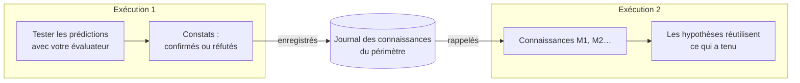

# Mémoire entre exécutions

::: tip En termes simples
Imaginez un cahier de laboratoire partagé par tous ceux qui travaillent sur le même banc d'essai. Chaque fois qu'une expérience confirme ou réfute une règle, on y note ce qui était attendu et ce qui a été constaté. La personne suivante lit le cahier avant de commencer : elle réutilise ce qui a tenu, et ne retente pas, telle quelle, une idée qui a déjà échoué.

Un agent cognitif peut tenir un tel cahier. Il n'y note que **ce qu'un vrai test a répondu**, jamais ce que le modèle ou le penseur se contentait de croire.
:::

## Ce qu'elle fait {#what-it-does}



1. **À la fin d'une exécution**, chaque règle ou explication dont au moins une prédiction a été confirmée ou réfutée par votre [évaluateur de résultats](./evidence-and-verification#predictions-and-the-outcome-evaluator) devient un **constat** : l'énoncé, son périmètre, la règle qu'il révise au sein de l'exécution, et chaque test (ce qui était attendu, ce qui a été observé, par quel évaluateur). Les constats sont ajoutés au **journal** du périmètre.
2. **Au début de l'exécution suivante** dans le même périmètre, les éléments les plus pertinents sont **rappelés** et placés dans l'état mental sous `knowledge`, avec les identifiants `M1`, `M2`…
3. **Pendant l'exécution** :
   - le modèle voit chaque élément avec son statut et ses derniers tests, et reçoit pour instruction de réutiliser une règle vérifiée dans son périmètre, en la citant ;
   - une hypothèse qui reformule mot pour mot un élément **réfuté** (même type, même énoncé et même périmètre, à la casse et à la ponctuation près) est refusée par le moteur ; le modèle reçoit pour instruction de proposer plutôt une variante qui cite l'identifiant `M` de l'élément dans ses prémisses et explique la réfutation, mais toute autre formulation ou tout autre périmètre est accepté comme une nouvelle hypothèse ;
   - une hypothèse qui reformule un élément **vérifié** ou **contesté** y est reliée automatiquement (son identifiant `M` est ajouté aux prémisses), si bien que l'étape de comparaison voit les tests antérieurs.

## L'activer {#turn-it-on}

```ts
import { FileKnowledgeStore } from '@sdk-ai-agents/core';

const physicist = sdk.createCognitiveAgent({
  name: 'physicist',
  model: 'gpt-4o',
  evaluator: bench,   // without an evaluator, nothing is tested, so nothing is remembered
  knowledge: {
    store: new FileKnowledgeStore('./knowledge'),
    scope: 'inclined-plane',
  },
});

const first = await physicist.think({ problem: 'Does the rolling time depend on the ball?', observations });
const second = await physicist.think({ problem: 'Will a 250 g glass ball take as long as a steel one?' });

second.state.knowledge;
// [{ id: 'M1', status: 'refuted',  statement: 'Rolling time on this plane does not depend on the ball', … },
//  { id: 'M2', status: 'verified', statement: 'For rigid balls, rolling time on this plane does not depend on mass', … }]
```

| Option | Valeur par défaut | Signification |
| --- | --- | --- |
| `store` | (obligatoire) | L'endroit où le journal est conservé : `FileKnowledgeStore`, `InMemoryKnowledgeStore` ou le vôtre |
| `scope` | (obligatoire) | Le sujet des connaissances. Les exécutions ne partagent ce qu'elles ont appris qu'au sein d'un périmètre. Lettres minuscules, chiffres, `.`, `-`, `_` : deux périmètres qui ne diffèrent que par la casse partageraient un même fichier sous macOS et Windows |
| `recallLimit` | `10` | Nombre d'éléments rappelés au début d'une exécution, de 0 à 50. `0` enregistre sans rappeler |
| `record` | `true` | Indique si les exécutions enregistrent ce que leurs tests ont établi |

`examples/rule-discovery.ts` l'utilise : lancez-le deux fois, et la seconde exécution démarre avec ce que la première a établi.

## Ce qui est mémorisé, et ce qui ne l'est jamais {#what-is-remembered-and-what-never-is}

| Mémorisé | Jamais mémorisé |
| --- | --- |
| Les règles et les explications dont une prédiction a été **confirmée** ou **réfutée** par votre évaluateur | Les choix d'action (propositions) : ils dépendent de qui décide et de quand |
| Ce qui était attendu, ce qui a été observé, quel évaluateur et quelle version | Les prédictions qui n'ont jamais été testées, ou dont le test a été **non concluant** |
| La règle qu'une variante révise, et ce qui a changé | Ce que le modèle croyait, le soutien qu'il accordait, les préférences du penseur |
| Les exécutions qui l'ont enregistré | La réponse finale de l'exécution |

Une exécution qui échoue ou qui est arrêtée enregistre quand même les tests qu'elle a menés : une mesure reste valable quoi qu'il se soit passé ensuite.

## Statuts {#statuses}

| Statut | Quand | Ce que le modèle reçoit comme instruction |
| --- | --- | --- |
| `verified` | Uniquement des confirmations jusqu'ici | La réutiliser dans son périmètre et la citer ; hors de ce périmètre, c'est une hypothèse à tester de nouveau |
| `refuted` | Uniquement des réfutations jusqu'ici | Ne jamais la proposer de nouveau telle quelle ; une variante cite son identifiant `M` dans ses prémisses et dit ce qui diffère |
| `contested` | À la fois des confirmations et des réfutations | Elle ne tient que dans certaines conditions : trouver lesquelles |

Le même énoncé dans le même périmètre est le même élément, quelles que soient sa casse ou sa ponctuation. Les tests sont dédoublonnés par exécution et par prédiction : enregistrer deux fois la même exécution n'ajoute rien.

## Quels éléments sont rappelés {#which-items-are-recalled}

Les éléments du périmètre sont classés de manière déterministe :

1. d'abord ceux qui partagent le plus de mots avec le problème (mots de quatre lettres ou plus, dans l'énoncé et le périmètre) ;
2. puis les plus testés ;
3. puis les plus récents.

Les `recallLimit` premiers éléments sont rappelés. Il s'agit d'une simple correspondance de mots, pas d'une recherche sémantique : une règle formulée très différemment du problème peut ne pas être rappelée en premier. Gardez des périmètres étroits (un banc d'essai, un produit, un domaine) pour que tout ce qui se trouve dans un périmètre soit pertinent.

## Périmètres {#scopes}

Un périmètre est une frontière, pas un nom de dossier pour faire du rangement :

- les exécutions ne **partagent** ce qu'elles ont appris qu'au sein d'un périmètre ;
- utilisez un périmètre par banc d'essai, produit, jeu de données ou domaine dont les règles s'appliquent les unes aux autres : `inclined-plane`, `checkout-latency`, `churn-model-v3` ;
- ne mélangez jamais dans un même périmètre des clients ou des locataires dont les données doivent rester séparées.

## Magasins {#stores}

| Magasin | À utiliser pour |
| --- | --- |
| `FileKnowledgeStore(directory)` | Un fichier par périmètre, `<directory>/<scope>.jsonl`, une ligne par exécution. Les lignes sont uniquement ajoutées, si bien que le fichier est aussi un historique lisible. Les écritures passant par une même instance de `FileKnowledgeStore` sont sérialisées : partagez une seule instance entre les agents d'un même processus |
| `InMemoryKnowledgeStore()` | Les tests, les prototypes, les processus de courte durée |
| Votre propre `KnowledgeStore` | Une base de données partagée par plusieurs processus |

Plusieurs instances ou processus qui écrivent en même temps dans le même périmètre devraient utiliser une base de données : implémentez les trois méthodes du port. Une ligne laissée inachevée par une écriture interrompue est ignorée à la lecture, avec un avertissement, et l'entrée suivante commence sur une nouvelle ligne ; une ligne qui est du JSON valide mais pas une entrée valide arrête la lecture en indiquant son numéro de ligne, puisque le fichier a été altéré.

```ts
import type { KnowledgeStore } from '@sdk-ai-agents/core';

const store: KnowledgeStore = {
  async recall({ scope, goal, limit }) { /* the most relevant items of the scope */ },
  async record({ scope, runId, recordedAt, findings }) { /* append one entry */ },
  async list(scope) { /* every item of the scope */ },
};
```

`projectKnowledge(entries)` regroupe les entrées du journal en éléments et `rankKnowledge(items, goal, limit)` les classe, si bien qu'un magasin personnalisé n'a qu'à conserver les entrées (par exemple une ligne de table par exécution) et à réutiliser ces deux fonctions.

Consultez à tout moment ce que sait un périmètre :

```ts
for (const item of await store.list('inclined-plane')) {
  console.log(item.status, item.confirmations, item.refutations, item.statement);
}
```

## Audit et rejeu {#audit-and-replay}

- Les éléments rappelés sont enregistrés dans `cognition.started` (`knowledge.scope`, `knowledge.items`), si bien que `sdk.getMentalState(runId)` reconstruit exactement ce que l'exécution savait, sans relire le magasin, même si celui-ci a changé depuis.
- Les constats sont enregistrés dans un événement `cognition.knowledge_recorded` (`scope`, `findings`).
- Un magasin en échec n'arrête jamais une exécution : un rappel en échec est enregistré comme `knowledge.error` dans `cognition.started` et l'exécution continue sans mémoire ; un enregistrement en échec est consigné comme `error` dans `cognition.knowledge_recorded`. Un magasin qui ne répond pas dans le délai `limits.timeoutMs` de l'exécution est traité comme en échec (une écriture lente peut tout de même aboutir ensuite). Si le journal d'événements lui-même ne peut pas enregistrer les constats, un avertissement est affiché et le résultat de l'exécution est renvoyé inchangé.

## Limites {#limits}

- **Correspondance de mots.** Le rappel n'est pas sémantique ; des règles voisines formulées différemment peuvent être manquées.
- **Reformulations exactes uniquement.** Seule une reformulation d'une règle réfutée avec le même type, la même formulation (à la casse et à la ponctuation près) et le même périmètre est refusée ; une reformulation avec d'autres mots est acceptée comme une nouvelle hypothèse.
- **Un seul test suffit pour être `verified`.** Un élément est vérifié dès qu'une prédiction a été confirmée et qu'aucune n'a été réfutée, et c'est le modèle qui choisit quelle prédiction teste une règle : une prédiction faible compte tout de même comme une confirmation.
- **Le périmètre est déclaré, pas vérifié.** Une règle vérifiée pour les « billes rigides » est présentée avec ce périmètre, et le modèle reçoit pour instruction de ne pas l'appliquer ailleurs sans nouveau test ; rien ne le vérifie dans le code.
- **L'évaluateur est tenu pour fiable.** La mémoire est aussi fiable que votre évaluateur : une mesure erronée est mémorisée comme un test.
- **Un seul rédacteur par fichier.** `FileKnowledgeStore` ne sérialise que les écritures d'une seule instance ; deux instances ou deux processus qui écrivent dans le même périmètre ne sont pas coordonnés.
