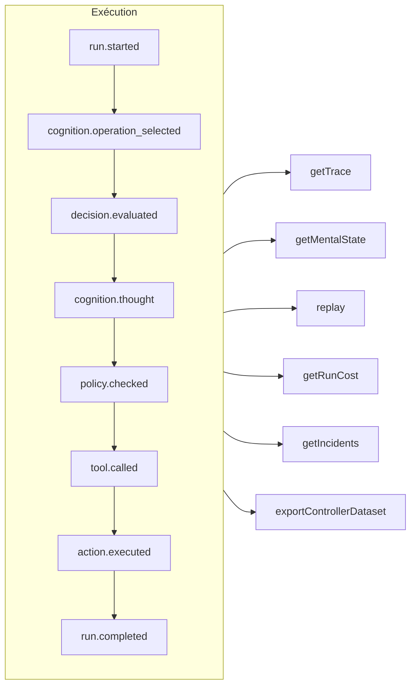

# Traçabilité et rejeu

Chaque exécution — gouvernée, cognitive, décision typée directe ou appel d'outil MCP — est un **journal d'événements en ajout seul** (*append-only*). Rien ne se passe hors de ce registre, et tout le reste en est dérivé.



## Magasins {#stores}

| Magasin | À utiliser pour |
| --- | --- |
| `FileEventStore` (par défaut) | Le développement, un seul processus — un fichier JSON par exécution |
| `SQLiteEventStore` | Une persistance locale avec des requêtes |
| `PostgreSQLEventStore` | La production : requêtes indexées, agrégation, sauvegarde et restauration |

::: code-group

```ts [File]
import { createSDK, FileEventStore } from '@sdk-ai-agents/core';

const sdk = createSDK({ apiKey, eventStore: new FileEventStore('./events') });
```

```ts [SQLite]
import Database from 'better-sqlite3';
import { createSDK, SQLiteEventStore } from '@sdk-ai-agents/core';

const sdk = createSDK({ apiKey, eventStore: new SQLiteEventStore({ db: new Database('events.db') }) });
```

```ts [PostgreSQL]
import pg from 'pg';
import { createSDK, PostgreSQLEventStore } from '@sdk-ai-agents/core';

const pool = new pg.Pool({ connectionString: process.env.DATABASE_URL });
const sdk = createSDK({ apiKey, eventStore: new PostgreSQLEventStore({ pool }) });
```

:::

Les magasins implémentent `IEventStore` ; écrivez le vôtre pour cibler n'importe quelle base de données. Le magasin de fichiers met les événements en mémoire tampon et les écrit toutes les 100 ms ; appelez `await store.destroy()` à l'arrêt pour écrire ce qui est en attente. Les lecteurs du journal (reconstruction de l'état mental, coûts, jeux de données) ignorent les événements répétés avec le même identifiant.

## Lire une exécution {#read-a-run}

```ts
const trace = await sdk.getTrace(runId);          // status, timeline, summary
const text = await sdk.exportTrace(runId, 'text'); // human-readable timeline
const events = await sdk.getEvents(runId, { type: ['tool.called', 'policy.violated'] });
const state = await sdk.getMentalState(runId);    // cognitive runs
```

Le statut d'une exécution est celui du **dernier événement de cycle de vie** (`run.completed`, `run.failed`, `run.cancelled`). Les événements ajoutés ensuite — retours, rapports d'incident — ne la rouvrent jamais.

## Progression en direct {#live-progress}

Les événements parviennent aussi à votre code **pendant que l'exécution est en cours**, dès que le magasin les a acceptés : pour afficher la progression dans une interface, la diffuser à un client ou alimenter un tableau de bord. Les clients MCP les reçoivent sous forme de [notifications de progression](./mcp-deploy#progress-notifications).

```ts
const result = await agent.run({
  message: 'Refund order 1234',
  onEvent: (event) => console.log(event.type),
});

const answer = await cognitiveAgent.think({ problem, onEvent: (event) => socket.send(JSON.stringify(event)) });
const replay = await sdk.replay(runId, undefined, { onEvent: (event) => console.log(event.type) });

// Every run of the SDK, for as long as you listen
const unsubscribe = sdk.subscribe((event) => dashboard.push(event), { types: ['run.failed', 'approval.requested'] });
unsubscribe();
```

| Où | Ce que reçoit l'écouteur |
| --- | --- |
| `run({ onEvent })`, `think({ onEvent })` | Tous les événements de cette exécution |
| `replay(runId, modifications, { onEvent })` | Tous les événements du rejeu |
| `executeTool(name, params, { onEvent })` | Les événements de l'appel, et ceux des exécutions d'agent que lance son outil (`governedAgentTool`, `cognitiveAgentTool`) |
| `sdk.subscribe(listener, { runId?, agentId?, types? })` | Tous les événements de toutes les exécutions qui correspondent au filtre, jusqu'à ce que vous appeliez la fonction qu'il renvoie |

Ce qui est garanti :

- **Uniquement ce que le magasin a accepté.** Un écouteur est appelé une fois que l'`append` du magasin a réussi, jamais pour un événement que le magasin a refusé. Avec les magasins SQL, la ligne est validée en base ; avec le magasin de fichiers, l'événement est dans sa mémoire tampon : `getEvents` le renvoie aussitôt, et il atteint le disque dans les 100 ms (en cas de plantage entre-temps, il est perdu).
- **Dans l'ordre.** Les événements d'une exécution arrivent dans l'ordre où ils ont été enregistrés ; ceux d'exécutions différentes s'entremêlent.
- **Un événement à la fois, et l'exécution n'attend jamais.** Quand votre écouteur renvoie une promesse, son événement suivant attend que cette promesse soit résolue ou rejetée, si bien qu'un écouteur asynchrone ne peut pas changer l'ordre des événements. L'exécution continue pendant ce temps : un écouteur lent prend du retard, il ne ralentit pas l'agent. `run()`, `think()`, `replay()` et `executeTool()` se résolvent une fois que leur `onEvent` a fini de traiter chaque événement de l'exécution, si bien que lorsqu'ils rendent la main, vous avez tout vu. Une promesse qui n'est jamais résolue ni rejetée les empêche de rendre la main : pour un traitement dont vous n'attendez pas la fin (*fire-and-forget*), ne renvoyez pas la promesse (`onEvent: (event) => { void save(event); }`). Un écouteur synchrone est appelé avant que l'`append` de l'événement ne rende la main : gardez-le rapide.
- **Les erreurs restent hors de l'exécution.** L'erreur d'un écouteur qui lève une exception ou renvoie une promesse rejetée est signalée sur la sortie d'erreur standard (`console.error`), et l'écouteur reçoit tout de même les événements suivants. Pour traiter ces erreurs vous-même, interceptez-les dans l'écouteur, ou créez le SDK avec `eventStore: new ObservedEventStore(store, { onListenerError })`.
- **Une copie.** Chaque écouteur reçoit sa propre copie de l'événement, telle que le magasin la relit : la modifier ne change rien dans le journal.
- **Le désabonnement est immédiat.** Une fois appelée la fonction renvoyée par `sdk.subscribe`, l'écouteur n'est plus appelé, pas même pour des événements déjà en attente ; cette fonction peut être appelée depuis l'écouteur lui-même.

Le filtre `agentId` porte sur le `metadata.agentId` de chaque événement : quelques événements ne sont liés à aucun agent (`provider.retry`, la fin d'un rejeu) ; filtrez par exécution pour les obtenir. Les sauvegardes restaurées ne sont pas transmises. Pour un agent assemblé à la main sur votre propre magasin (`new AgentImpl(…)`), enveloppez le magasin dans un `ObservedEventStore` pour utiliser `onEvent` ; `createSDK` le fait pour vous.

## Rejouer sans le LLM {#replay-without-the-llm}

```ts
const replay = await sdk.replay(runId);
```

Le rejeu exécute de nouveau les intentions enregistrées en passant par le moteur d'action — politiques comprises — **sans appeler le LLM**. Rejouez avec des modifications pour tester des scénarios « et si », par exemple après avoir modifié une politique.

Un rejeu exécute de nouveau les outils, pour de vrai. Pour les outils marqués `requiresApproval`, un rejeu ne répète que les appels qu'un humain avait **approuvés** lors de l'exécution d'origine — le même outil avec les mêmes paramètres — sans redemander ; un appel qui avait été rejeté, annulé ou jamais approuvé est refusé, pas exécuté. Les approbations exigées par une *politique* s'appliquent toujours et attendent une décision.

## Comprendre les décisions {#understand-decisions}

| Méthode | Ce que vous obtenez |
| --- | --- |
| `getReasoningGraph(runId)` / `exportReasoningGraph(runId, 'graphviz')` | La chaîne intention → politique → action sous forme de graphe |
| `getAlternatives(runId)` | Les alternatives que l'agent a envisagées |
| `getDecisionPatterns(filters)` | Les schémas de décision récurrents d'une exécution à l'autre |
| `getTraceVisualization(runId)` | Une structure groupée, prête pour une chronologie dans une interface |
| `getPolicyAuditTrail(runId)` | Chaque évaluation de politique et son résultat |

## Tester les agents comme du code {#test-agents-like-code}

Transformez une bonne exécution en **trace de référence** (*golden trace*), puis validez les nouvelles exécutions par rapport à elle :

```ts
const golden = await sdk.createGoldenTrace(runId, { name: 'refund flow', description: 'Expected behavior' });
const validation = await sdk.validateAgainstGoldenTrace(newRunId, golden.id);
const regressions = await sdk.detectRegressions(newRunId, golden.id);
```

Les suites de régression, les assertions de comportement, la comparaison d'exécutions et l'analyse d'impact avant déploiement sont également disponibles — voir l'[API du SDK](../reference/sdk-api).
