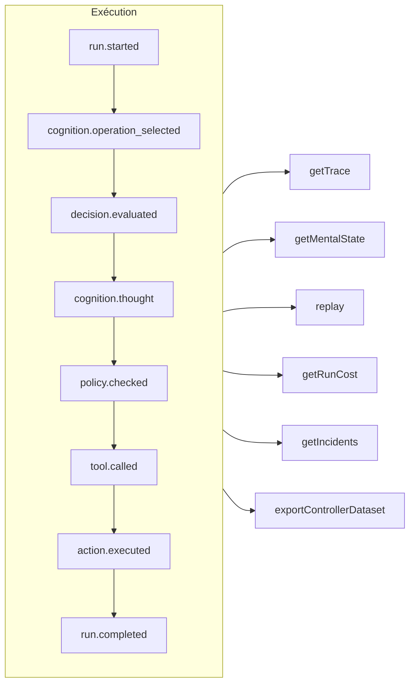

# Traçabilité et rejeu

Chaque exécution — gouvernée, cognitive, décision typée directe ou appel d'outil MCP — est un **journal d'événements en ajout seul** (*append-only*). Rien ne se passe hors de ce registre, et tout le reste en est dérivé.



## Magasins {#stores}

| Magasin | À utiliser pour |
| --- | --- |
| `FileEventStore` (par défaut) | Le développement, un seul processus — un fichier JSON par exécution |
| `SQLiteEventStore` | Une persistance locale avec des requêtes |
| `PostgreSQLEventStore` | La production : requêtes indexées, agrégation, sauvegarde et restauration |

::: code-group

```ts [File]
import { createSDK, FileEventStore } from '@sdk-ai-agents/core';

const sdk = createSDK({ apiKey, eventStore: new FileEventStore('./events') });
```

```ts [SQLite]
import Database from 'better-sqlite3';
import { createSDK, SQLiteEventStore } from '@sdk-ai-agents/core';

const sdk = createSDK({ apiKey, eventStore: new SQLiteEventStore({ db: new Database('events.db') }) });
```

```ts [PostgreSQL]
import pg from 'pg';
import { createSDK, PostgreSQLEventStore } from '@sdk-ai-agents/core';

const pool = new pg.Pool({ connectionString: process.env.DATABASE_URL });
const sdk = createSDK({ apiKey, eventStore: new PostgreSQLEventStore({ pool }) });
```

:::

Les magasins implémentent `IEventStore` ; écrivez le vôtre pour cibler n'importe quelle base de données. Le magasin de fichiers met les événements en mémoire tampon et les écrit toutes les 100 ms ; appelez `await store.destroy()` à l'arrêt pour écrire ce qui est en attente. Les lecteurs du journal (reconstruction de l'état mental, coûts, jeux de données) ignorent les événements répétés avec le même identifiant.

## Lire une exécution {#read-a-run}

```ts
const trace = await sdk.getTrace(runId);          // status, timeline, summary
const text = await sdk.exportTrace(runId, 'text'); // human-readable timeline
const events = await sdk.getEvents(runId, { type: ['tool.called', 'policy.violated'] });
const state = await sdk.getMentalState(runId);    // cognitive runs
```

Le statut d'une exécution est celui du **dernier événement de cycle de vie** (`run.completed`, `run.failed`, `run.cancelled`). Les événements ajoutés ensuite — retours, rapports d'incident — ne la rouvrent jamais.

## Progression en direct {#live-progress}

Les événements parviennent aussi à votre code **pendant que l'exécution est en cours**, dès que le magasin les a acceptés : pour afficher la progression dans une interface, la diffuser à un client ou alimenter un tableau de bord. Les clients MCP les reçoivent sous forme de [notifications de progression](./mcp-deploy#progress-notifications).

```ts
const result = await agent.run({
  message: 'Refund order 1234',
  onEvent: (event) => console.log(event.type),
});

const answer = await cognitiveAgent.think({ problem, onEvent: (event) => socket.send(JSON.stringify(event)) });
const replay = await sdk.replay(runId, undefined, { onEvent: (event) => console.log(event.type) });

// Every run of the SDK, for as long as you listen
const unsubscribe = sdk.subscribe((event) => dashboard.push(event), { types: ['run.failed', 'approval.requested'] });
unsubscribe();
```

| Où | Ce que reçoit l'écouteur |
| --- | --- |
| `run({ onEvent })`, `think({ onEvent })` | Tous les événements de cette exécution |
| `replay(runId, modifications, { onEvent })` | Tous les événements du rejeu |
| `executeTool(name, params, { onEvent })` | Les événements de l'appel, et ceux de l'exécution d'agent que lance son outil (`governedAgentTool`, `cognitiveAgentTool`), sur un seul niveau : pas les exécutions que cet agent lance à son tour |
| `sdk.subscribe(listener, { runId?, agentId?, types?, maxQueued? })` | Tous les événements de toutes les exécutions qui correspondent au filtre, jusqu'à ce que vous appeliez la fonction qu'il renvoie |

Ce qui est garanti :

- **Uniquement ce que le magasin a accepté.** Un écouteur est appelé une fois que l'`append` du magasin a réussi, jamais pour un événement que le magasin a refusé. Avec les magasins SQL, la ligne est validée en base ; avec le magasin de fichiers, l'événement est dans sa mémoire tampon : `getEvents` le renvoie aussitôt, et il atteint le disque dans les 100 ms (en cas de plantage entre-temps, il est perdu).
- **Dans l'ordre.** Les événements d'une exécution arrivent dans l'ordre où ils ont été enregistrés ; ceux d'exécutions différentes s'entremêlent.
- **Un événement à la fois, et l'exécution n'attend jamais.** Quand votre écouteur renvoie une promesse, son événement suivant attend que cette promesse soit résolue ou rejetée, si bien qu'un écouteur asynchrone ne peut pas changer l'ordre des événements. L'exécution continue pendant ce temps : un écouteur lent prend du retard, il ne ralentit pas l'agent. Un écouteur synchrone est appelé avant que l'`append` de l'événement ne rende la main : gardez-le rapide.
- **L'appel attend l'écouteur, à moins que l'exécution ne soit interrompue.** Une fois l'exécution terminée, `run()`, `think()`, `replay()` et `executeTool()` attendent que leur `onEvent` ait fini de traiter chaque événement, si bien que lorsqu'ils rendent la main, vous avez tout vu. L'attente prend fin plus tôt quand l'exécution a été arrêtée ou annulée, ou quand son `signal` est interrompu (l'appelant abandonne) ; pour une exécution cognitive, le délai `limits.timeoutMs` couvre aussi cette attente. L'écouteur est alors désabonné : les événements qu'il n'a pas encore reçus sont abandonnés. Un rejeu ne peut pas être annulé, il attend donc toujours. Sinon, une promesse qui n'est jamais résolue ni rejetée empêche l'appel de rendre la main : pour un traitement dont vous n'attendez pas la fin (*fire-and-forget*), ne renvoyez pas la promesse (`onEvent: (event) => { void save(event); }`).
- **Une file d'attente bornée.** Au plus `maxQueued` événements (10 000 par défaut) attendent un écouteur encore occupé par un événement précédent ; au-delà, les nouveaux événements sont abandonnés pour cet écouteur. L'abandon est signalé une fois que l'écouteur a rattrapé son retard, par une `LiveEventsDroppedError` qui indique combien d'événements ont été abandonnés.
- **Les erreurs restent hors de l'exécution.** L'erreur d'un écouteur qui lève une exception ou renvoie une promesse rejetée est signalée sur la sortie d'erreur standard (`console.error`), et l'écouteur reçoit tout de même les événements suivants ; les événements abandonnés sont signalés de la même façon. Pour traiter vous-même les erreurs, interceptez-les dans l'écouteur ; pour traiter de la même façon les erreurs et les événements abandonnés, créez le SDK avec `eventStore: new ObservedEventStore(store, { onListenerError })`.
- **Une copie.** Chaque écouteur reçoit sa propre copie de l'événement, telle que le magasin la relit : la modifier ne change rien dans le journal.
- **Le désabonnement est immédiat.** Une fois appelée la fonction renvoyée par `sdk.subscribe`, l'écouteur n'est plus appelé, pas même pour des événements déjà en attente ; cette fonction peut être appelée depuis l'écouteur lui-même.

Le filtre `agentId` porte sur le `metadata.agentId` de chaque événement : quelques événements ne sont liés à aucun agent (`provider.retry`, la fin d'un rejeu, le `decision.evaluated` d'un appel à `sdk.decisions` fait sans `agentId`) ; filtrez par exécution pour les obtenir. Les sauvegardes restaurées ne sont pas transmises. Les rapports d'incident de `incidents` sont transmis ; avec un `MonitoredEventStore` que vous construisez vous-même, construisez-le sur un `ObservedEventStore` (`new MonitoredEventStore(new ObservedEventStore(store), options)`), sinon ses rapports sont enregistrés mais pas transmis en direct. Pour un agent assemblé à la main sur votre propre magasin (`new AgentImpl(…)`), enveloppez le magasin dans un `ObservedEventStore` pour utiliser `onEvent` ; `createSDK` le fait pour vous. Derrière un outil d'agent, un agent dont le magasin n'est pas enveloppé s'exécute sans l'écouteur de l'appelant, au lieu d'échouer.

## Rejouer sans le LLM {#replay-without-the-llm}

```ts
const replay = await sdk.replay(runId);
```

Le rejeu exécute de nouveau les intentions enregistrées en passant par le moteur d'action — politiques comprises — **sans appeler le LLM**. Rejouez avec des modifications pour tester des scénarios « et si », par exemple après avoir modifié une politique.

Un rejeu exécute de nouveau les outils, pour de vrai. Pour les outils marqués `requiresApproval`, un rejeu ne répète que les appels qu'un humain avait **approuvés** lors de l'exécution d'origine — le même outil avec les mêmes paramètres — sans redemander ; un appel qui avait été rejeté, annulé ou jamais approuvé est refusé, pas exécuté. Les approbations exigées par une *politique* s'appliquent toujours et attendent une décision.

## Comprendre les décisions {#understand-decisions}

| Méthode | Ce que vous obtenez |
| --- | --- |
| `getReasoningGraph(runId)` / `exportReasoningGraph(runId, 'graphviz')` | La chaîne intention → politique → action sous forme de graphe |
| `getAlternatives(runId)` | Les alternatives que l'agent a envisagées |
| `getDecisionPatterns(filters)` | Les schémas de décision récurrents d'une exécution à l'autre |
| `getTraceVisualization(runId)` | Une structure groupée, prête pour une chronologie dans une interface |
| `getPolicyAuditTrail(runId)` | Chaque évaluation de politique et son résultat |

## Tester les agents comme du code {#test-agents-like-code}

Transformez une bonne exécution en **trace de référence** (*golden trace*), puis validez les nouvelles exécutions par rapport à elle :

```ts
const golden = await sdk.createGoldenTrace(runId, { name: 'refund flow', description: 'Expected behavior' });
const validation = await sdk.validateAgainstGoldenTrace(newRunId, golden.id);
const regressions = await sdk.detectRegressions(newRunId, golden.id);
```

Les exécutions sont comparées d'après ce que signifient leurs événements — type, ordre, outil, paramètres, résultats —, jamais d'après les id des événements, nouveaux à chaque exécution ; les heures, les nombres de tokens et les autres valeurs que le SDK écrit et qui changent d'une exécution à l'autre sont aussi laissés de côté, mais les paramètres et les résultats d'un outil sont toujours comparés, quels que soient leurs noms de clés. Une exécution qui refait la même chose passe ; un outil appelé avec d'autres arguments est signalé là où l'appel a eu lieu.

### Suites de régression en CI {#regression-suites-in-ci}

Regroupez une fois les traces de référence dans une suite, puis exécutez-la en CI :

```ts
// Once, after recording the good runs
await sdk.createRegressionTestSuite('support-agent', {
  name: 'refunds',
  goldenTraces: [{ goldenTraceId: golden.id, name: 'refund flow' }],
});

// In CI: the same agent, created again
sdk.createAgent({ name: 'support-agent', model: 'gpt-4o', tools });
const { results, exitCode } = await sdk.runRegressionTestsForCI('support-agent', {
  detection: { tolerance: { ignoreEventTypes: ['intention.generated'], ignoreDataFields: ['output'] } },
});
await sdk.exportTestResults(results, 'junit', { outputPath: 'regressions.xml' });
process.exitCode = exitCode;
```

Une suite connaît son agent par son **nom**, puisque les id d'agent sont nouveaux dans chaque processus. Toutes les suites de l'agent s'exécutent, la plus ancienne d'abord : chaque test envoie à l'agent l'entrée de l'exécution de référence et compare la nouvelle exécution à la trace de référence. Le code de sortie vaut 0 quand tous les tests passent, 1 quand l'un d'eux a trouvé une régression, 2 quand l'un d'eux n'a pas pu s'exécuter. Un vrai modèle formule ses réponses autrement d'une exécution à l'autre : la `detection` ci-dessus laisse de côté le texte du modèle et la réponse finale, et vérifie toujours chaque appel d'outil avec ses arguments.

Les assertions sur les événements d'une exécution, la comparaison de deux exécutions, l'impact d'une nouvelle version d'un agent et les requêtes sur toutes les exécutions sont décrits dans l'[API du SDK](../reference/sdk-api#assertions).
