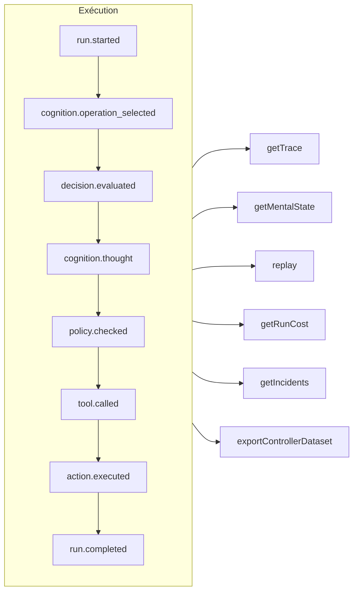

# Traçabilité et rejeu

Chaque exécution — gouvernée, cognitive, décision typée directe ou appel d'outil MCP — est un **journal d'événements en ajout seul** (*append-only*). Rien ne se passe hors de ce registre, et tout le reste en est dérivé.



## Magasins {#stores}

| Magasin | À utiliser pour |
| --- | --- |
| `FileEventStore` (par défaut) | Le développement, un seul processus — un fichier JSON par exécution |
| `SQLiteEventStore` | Une persistance locale avec des requêtes |
| `PostgreSQLEventStore` | La production : requêtes indexées, agrégation, sauvegarde et restauration |

::: code-group

```ts [File]
import { createSDK, FileEventStore } from '@sdk-ai-agents/core';

const sdk = createSDK({ apiKey, eventStore: new FileEventStore('./events') });
```

```ts [SQLite]
import Database from 'better-sqlite3';
import { createSDK, SQLiteEventStore } from '@sdk-ai-agents/core';

const sdk = createSDK({ apiKey, eventStore: new SQLiteEventStore({ db: new Database('events.db') }) });
```

```ts [PostgreSQL]
import pg from 'pg';
import { createSDK, PostgreSQLEventStore } from '@sdk-ai-agents/core';

const pool = new pg.Pool({ connectionString: process.env.DATABASE_URL });
const sdk = createSDK({ apiKey, eventStore: new PostgreSQLEventStore({ pool }) });
```

:::

Les magasins implémentent `IEventStore` ; écrivez le vôtre pour cibler n'importe quelle base de données. Le magasin de fichiers met les événements en mémoire tampon et les écrit toutes les 100 ms ; appelez `await store.destroy()` à l'arrêt pour écrire ce qui est en attente. Les lecteurs du journal (reconstruction de l'état mental, coûts, jeux de données) ignorent les événements répétés avec le même identifiant.

## Lire une exécution {#read-a-run}

```ts
const trace = await sdk.getTrace(runId);          // status, timeline, summary
const text = await sdk.exportTrace(runId, 'text'); // human-readable timeline
const events = await sdk.getEvents(runId, { type: ['tool.called', 'policy.violated'] });
const state = await sdk.getMentalState(runId);    // cognitive runs
```

Le statut d'une exécution est celui du **dernier événement de cycle de vie** (`run.completed`, `run.failed`, `run.cancelled`). Les événements ajoutés ensuite — retours, rapports d'incident — ne la rouvrent jamais.

## Rejouer sans le LLM {#replay-without-the-llm}

```ts
const replay = await sdk.replay(runId);
```

Le rejeu exécute de nouveau les intentions enregistrées en passant par le moteur d'action — politiques comprises — **sans appeler le LLM**. Rejouez avec des modifications pour tester des scénarios « et si », par exemple après avoir modifié une politique.

Un rejeu exécute de nouveau les outils, pour de vrai. Pour les outils marqués `requiresApproval`, un rejeu ne répète que les appels qu'un humain avait **approuvés** lors de l'exécution d'origine — le même outil avec les mêmes paramètres — sans redemander ; un appel qui avait été rejeté, annulé ou jamais approuvé est refusé, pas exécuté. Les approbations exigées par une *politique* s'appliquent toujours et attendent une décision.

## Comprendre les décisions {#understand-decisions}

| Méthode | Ce que vous obtenez |
| --- | --- |
| `getReasoningGraph(runId)` / `exportReasoningGraph(runId, 'graphviz')` | La chaîne intention → politique → action sous forme de graphe |
| `getAlternatives(runId)` | Les alternatives que l'agent a envisagées |
| `getDecisionPatterns(filters)` | Les schémas de décision récurrents d'une exécution à l'autre |
| `getTraceVisualization(runId)` | Une structure groupée, prête pour une chronologie dans une interface |
| `getPolicyAuditTrail(runId)` | Chaque évaluation de politique et son résultat |

## Tester les agents comme du code {#test-agents-like-code}

Transformez une bonne exécution en **trace de référence** (*golden trace*), puis validez les nouvelles exécutions par rapport à elle :

```ts
const golden = await sdk.createGoldenTrace(runId, { name: 'refund flow', description: 'Expected behavior' });
const validation = await sdk.validateAgainstGoldenTrace(newRunId, golden.id);
const regressions = await sdk.detectRegressions(newRunId, golden.id);
```

Les suites de régression, les assertions de comportement, la comparaison d'exécutions et l'analyse d'impact avant déploiement sont également disponibles — voir l'[API du SDK](../reference/sdk-api).
