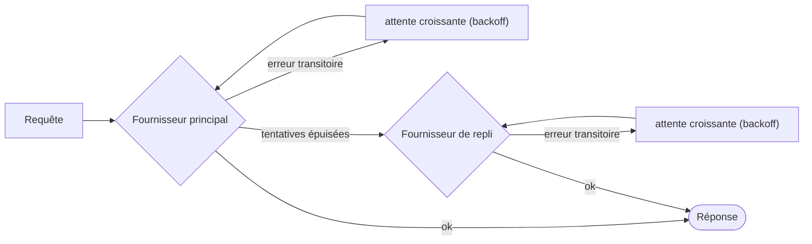

# Nouvelles tentatives et repli

Les réseaux tombent, les fournisseurs limitent le débit, les outils dépassent leur délai. Le SDK retente ce qui peut l'être, bascule ce qui ne peut pas l'être, et **inscrit chaque nouvelle tentative dans l'exécution**, si bien que rien n'est caché.



## Fournisseurs de LLM {#llm-providers}

Une politique de nouvelles tentatives s'applique à chaque fournisseur **individuellement, avant tout repli** :

```ts
const sdk = createSDK({
  apiKey: process.env.OPENAI_API_KEY,
  fallbackProviders: [{ provider: 'anthropic', config: { apiKey: process.env.ANTHROPIC_API_KEY } }],
  retry: { maxRetries: 3, initialDelayMs: 500, maxDelayMs: 8_000 },
});
```

| Option | Valeur par défaut | |
| --- | --- | --- |
| `maxRetries` | `2` | Nouvelles tentatives après la première tentative |
| `initialDelayMs` | `500` | Doublé à chaque nouvelle tentative (`multiplier`) |
| `maxDelayMs` | `8000` | Borne supérieure d'une attente entre deux tentatives |
| `maxRetryAfterMs` | `60000` | Plus long `retry-after` respecté (`maxDelayMs` quand un repli existe) |
| `jitter` | `true` | Rend aléatoire chaque attente dans [delay/2, delay] |
| `retryOn` | `isTransientError` | Votre propre prédicat |

Seules les erreurs **transitoires** donnent lieu à de nouvelles tentatives : 408, 409, 425, 429, 5xx, 529, les échecs de connexion et les dépassements de délai — y compris les erreurs de connexion d'OpenAI et d'Anthropic, reconnues par leur classe et par le code réseau de leur `cause`. Les erreurs d'authentification, de validation et de politique échouent immédiatement, tout comme une erreur 429 qui signifie que le compte n'a plus de crédit ou de quota (`insufficient_quota`, `credit_balance_exhausted`…) : attendre ne ferait pas revenir le crédit. Le message d'erreur reprend l'explication du fournisseur. Quand le fournisseur envoie `retry-after-ms` ou `retry-after`, le SDK attend cette durée au lieu d'appliquer sa propre attente croissante, jusqu'à `maxRetryAfterMs` (60 s par défaut). Quand des `fallbackProviders` sont configurés, cette borne est abaissée à `maxDelayMs` : un fournisseur qui demande une longue pause est laissé de côté au profit du repli au lieu de bloquer l'exécution. Une demande plus longue met fin aux nouvelles tentatives.

Quand la politique du SDK est active, les nouvelles tentatives propres aux clients OpenAI et Anthropic sont désactivées — **les nouvelles tentatives ne s'empilent jamais**. Chaque nouvelle tentative est enregistrée sous forme d'événement `provider.retry` avec le fournisseur, le modèle, la tentative, le délai et l'erreur. Passez `retry: false` pour conserver plutôt les réglages par défaut des fournisseurs.

Un fournisseur que vous injectez avec `llmProvider` est utilisé tel quel, sauf si vous définissez `retry` explicitement, et un `FallbackProvider` n'est jamais enveloppé, pour que ses basculements restent visibles dans la trace.

## Outils {#tools}

Marquez les outils idempotents comme pouvant être retentés :

```ts
sdk.defineTool({
  name: 'lookup_metric',
  description: 'Reads a metric',
  schema: z.object({ metric: z.string() }),
  retry: { maxRetries: 2, initialDelayMs: 200 },
  handler: async ({ metric }) => warehouse.read(metric),
});
```

Seuls les échecs d'outils donnent lieu à de nouvelles tentatives — jamais un refus de politique ni une erreur de validation. Chaque nouvelle tentative est un événement `tool.retry`.

## Décisions typées {#typed-decisions}

Le client Jev retente les réponses 408, 429, 5xx et 529 ainsi que les erreurs réseau, **en respectant `retry-after`**, avec par défaut la politique de nouvelles tentatives du SDK (`jev.maxRetries` la remplace). Contrairement aux fournisseurs de LLM, il retente toute erreur 429, quelle qu'en soit la cause, jusqu'à `maxRetries`.

## Partout ailleurs {#anywhere-else}

`withRetry` est exporté pour votre propre code :

```ts
import { withRetry, DEFAULT_RETRY_POLICY } from '@sdk-ai-agents/core';

const data = await withRetry(() => fetchPartnerFeed(), DEFAULT_RETRY_POLICY, {
  onRetry: ({ retry, delayMs, error }) => logger.warn({ retry, delayMs, error }),
});
```
