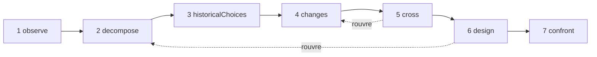

# Études

Une étude est un chercheur IA. Elle applique une seule méthode — **comprendre un objet, puis le repenser avec les moyens d'aujourd'hui** — et vous remet un dossier : ce que fait l'objet, comment il fonctionne, pourquoi il a été construit ainsi, ce qui a changé depuis, plusieurs nouvelles conceptions, et les expériences qui permettraient de les départager. Elle ne construit rien, n'exécute rien et ne mesure rien : elle enquête et propose.

::: tip En termes simples
Prenez un objet : un navigateur Web, un moteur de base de données, une grille horaire de trains. L'étude l'observe, le démonte, cherche les raisons de ses choix d'autrefois, recherche les travaux et les techniques apparus depuis, et croise les deux pour imaginer une autre organisation. Elle vise un changement de principe qui rend possible quelque chose de nouveau, pas une version plus rapide de la même chose. Chaque affirmation indique si elle est **établie** par une source que l'étude a réellement trouvée, si c'est une **hypothèse**, ou une **nouveauté** encore à confronter à l'existant. Et pendant tout ce temps, plusieurs mécanismes la maintiennent sur l'objectif que vous lui avez donné, car les modèles de langage ont tendance à s'en écarter à mesure que les instructions s'accumulent. Chaque terme est expliqué dans [Les termes clés expliqués simplement](./glossary#studies).
:::

```ts
const study = sdk.createStudy({
  name: 'browser',
  object: 'The Web browser, from 1990 to 2026',
  objective: 'A browser design whose every choice follows from the investigation',
  leads: ['vectorisation', 'weights', 'ReLU'], // your leads: examples to verify, not truths
  analogues: ['Bitcoin'],                      // breakthroughs by assembly to deconstruct
  sources: ['brave_web_search'],               // SDK tools the study searches with
});

const result = await study.run();
result.status;   // 'completed' | 'stopped' | 'failed' | 'cancelled'
result.report;   // the structured report
result.markdown; // the same, as a readable dossier
```

## Ce qu'est une étude {#what-a-study-is}

Une étude applique une méthode en sept passages : *comprendre un objet, puis le repenser avec les connaissances et les techniques d'aujourd'hui*. Sa question directrice est : **si nous devions satisfaire les besoins d'aujourd'hui avec les connaissances et les techniques disponibles aujourd'hui, comment organiserions-nous cet objet ?** Sauf si vous donnez votre propre `question`, l'étude la pose dans sa langue, suivie du but décrit dans [Le but : une capacité nouvelle](#the-aim-a-new-capability).

Une étude n'est pas un agent. Elle n'a pas d'outils pour agir, seulement des **sources** où chercher (voir [Chercher avec vos sources](#research-through-your-sources)), et ce qu'elle produit est un rapport, pas une action. Elle est créée avec `sdk.createStudy()`, à partir d'une **charte** — l'objet, l'objectif, vos besoins et vos pistes — qui ne change plus ensuite.

Son dernier passage conçoit des expériences ; il ne les mène pas. Une fois que vous en avez mené une, vous inscrivez ce qu'elle a trouvé sur la fiche de mécanisme correspondante (voir [La fiche de mécanisme](#the-mechanism-card)).

## Les sept passages {#the-seven-passages}

Une exécution parcourt les sept passages de la méthode, dans l'ordre. Chacun produit des éléments de quelques sortes (ses **collections**), et chaque élément reçoit un identifiant qui n'est jamais réutilisé, jusqu'à un redémarrage : `O1`, `P2`, `A1`…

| # | Passage | Ce qu'il fait | Ce qu'il conserve |
| --- | --- | --- | --- |
| 1 | `observe` | Examine les comportements, les usages, les variations et les pannes de l'objet, chacun avec ses conditions : quand, où, pour qui, avec quoi. Il décrit ; il n'explique pas encore | `observations` (`O`) |
| 2 | `decompose` | Cartographie les pièces : leur fonction, leurs entrées, leurs sorties et leurs relations, en descendant dans une pièce tant que son fonctionnement reste opaque, avec les inconnues de chacune. Définit la **chaîne complète** de l'objet, étape par étape (pour un navigateur : recevoir, comprendre, exécuter, afficher, interagir) | `pieces` (`P`), `chain` (`C`) |
| 3 | `historicalChoices` | Cherche les raisons documentées des choix de leur époque : matériel, outils, usages, connaissances, coûts, compatibilité. Une raison plausible sans document reste une hypothèse | `historicalChoices` (`H`) |
| 4 | `changes` | Cherche ce qui est apparu ou devenu utilisable depuis, dans le domaine de l'objet et dans d'autres, chaque avancée avec son mécanisme, sa date, ses preuves, ses conditions d'utilisation et sa disponibilité. Donne un verdict sur chacune de vos pistes, cherche d'autres outils mathématiques et techniques au-delà, liste les meilleures réalisations actuelles (la référence du « mieux ») et déconstruit des ruptures par assemblage | `advances` (`V`), `leadVerdicts` (`L`), `independentLeads` (`I`), `references` (`R`), `analogues` (`B`) |
| 5 | `cross` | Croise le passé et le présent : quelles contraintes subsistent, lesquelles se sont atténuées, quelles exigences sont nouvelles. En déduit les décisions devenues révisables, propose des combinaisons A + B (ce que A permet à B, ce qu'ils doivent échanger, ce que cela coûte en conversions et en synchronisation) et nomme des capacités nouvelles candidates | `constraints` (`K`), `revisableDecisions` (`D`), `combinations` (`X`), `capabilities` (`Y`) |
| 6 | `design` | Conçoit au moins deux architectures, dont au moins une vise une capacité nouvelle, chacune couvrant toute la chaîne, avec son mécanisme, ses conditions, son bénéfice, son coût ajouté, un contre-exemple possible et ses prédictions. Donne les trois états de chaque pièce principale et dit ce qui est nouveau et ce qui ne l'est pas. Cherche ensuite l'existant des nouveautés et de l'assemblage de chaque capacité | `architectures` (`A`), `threeStates` (`T`), `noveltyClaims` (`N`) |
| 7 | `confront` | Conçoit les expériences qui départageraient les architectures et éprouveraient toute la chaîne : protocole, mesures, critères et résultat attendu pour chaque architecture. Remplit une fiche de mécanisme pour chaque mécanisme principal | `experiments` (`E`), `cards` (`M`) |

Les résultats que renvoient les recherches sont numérotés eux aussi : `S1`, `S2`… Chaque passage reçoit les éléments des passages précédents dont il a besoin, sous forme d'enregistrements JSON compacts : seulement les éléments que le gardien a jugés (voir [Le gardien](#the-guardian)).

### Une boucle, pas une ligne {#a-loop-not-a-line}



Les passages forment une boucle. Quand une inconnue bloque un passage — la conception a besoin de savoir comment une pièce fonctionne vraiment, par exemple —, il peut demander à **rouvrir** un passage précédent sur ce point. Le passage précédent s'exécute de nouveau sur ce point précis et n'ajoute aux éléments qu'il avait que ce dont cette inconnue a besoin : il n'a aucun minimum à respecter, et n'a à redonner ni verdict sur les pistes ni rupture. Puis le passage qui l'a demandé s'exécute de nouveau avec eux ; tant qu'il ne l'a pas fait, il n'est pas terminé (son état est `partial`), et la recherche de l'existant de la conception attend sa version finale. `limits.maxLoops` borne les réouvertures d'une exécution (1 par défaut, 0 pour n'en permettre aucune) ; un passage qui a lui-même été rouvert ne peut pas en rouvrir un autre.

### Trois états de chaque pièce {#three-states-of-each-piece}

La conception donne à chaque pièce principale trois états, tenus séparés dans le rapport (`threeStates`) :

- **l'objet à son époque** (`atItsTime`) : comment la pièce a été construite, et dans quelles conditions ;
- **les meilleures réalisations actuelles pertinentes** (`currentBest`) : la référence à laquelle se mesure une amélioration ;
- **notre proposition** (`proposal`) : ce que l'architecture en fait.

L'ancienneté d'un choix ne le rend pas mauvais, et une technique récente peut rendre inutile une complication du passé : les trois états montrent quelle condition a changé, quel mécanisme est devenu possible, et ce que cela change pour l'ensemble.

### La fiche de mécanisme {#the-mechanism-card}

Le dernier passage remplit une fiche pour chaque mécanisme principal. Elle a onze champs : l'étude remplit les neuf premiers, et les deux derniers restent vides tant que vous n'avez pas mené d'expérience.

| # | Champ | La question à laquelle il répond |
| --- | --- | --- |
| 1 | `observation` | Que fait le système, dans quelles conditions ? |
| 2 | `mechanism` | Quelles pièces et quelles relations l'expliquent ? |
| 3 | `unknown` | Que reste-t-il à ouvrir, à mesurer ou à documenter ? |
| 4 | `historicalChoice` | Pourquoi cette organisation a-t-elle été choisie, sur quelles preuves ? |
| 5 | `evolution` | Qu'est-ce qui a changé depuis, avec quelles sources et quelles dates ? |
| 6 | `newPossibility` | Quel choix devient révisable grâce à ce changement ? |
| 7 | `proposedCombination` | Comment les techniques s'assemblent-elles, concrètement ? |
| 8 | `prediction` | Quel effet attendons-nous, dans quelles conditions ? |
| 9 | `experiment` | Comment départager les propositions et vérifier l'ensemble ? |
| 10 | `resultAndError` | Qu'avons-nous trouvé, et où l'explication échoue-t-elle ? |
| 11 | `conclusionAndMemory` | Que gardons-nous, que changeons-nous, où ce mécanisme pourrait-il resservir ? |

```ts
await study.recordResult('M1', {
  result: 'Layout reuse cut the time to redraw by 40% on the reference pages',
  error: 'No gain on pages whose styles change on every frame',
  conclusion: 'Keep immutable layout results; look again at style invalidation',
});
```

`recordResult(cardId, { result, error?, conclusion? })` remplit les champs 10 et 11 de la fiche et enregistre un événement `study.result_recorded` dans l'exécution qui a écrit la fiche. Il lève une `ValidationError` pour une fiche inconnue ou un `result` vide. `study.report()` renvoie le rapport avec la fiche remplie.

## Le but : une capacité nouvelle {#the-aim-a-new-capability}

Une étude ne cherche pas une version plus rapide du même objet. Elle cherche **un changement de principe qui rend possible quelque chose de difficile aujourd'hui, pas seulement quelque chose de plus rapide**.

### Capacité, principe, mécanisme {#capability-principle-mechanism}

Chaque architecture énonce trois choses :

- **la capacité** (`capability`) : ce qui devient possible, pour qui, et la contrainte d'aujourd'hui qu'elle lève (`what`, `forWhom`, `liftedConstraint`) ;
- **le changement de principe** (`principleChange`) : quel principe change — `representation`, `distribution` (du travail), `responsibility`, `trust`, `verification` ou `other` — et comment ;
- **le mécanisme** (`mechanism`) : comment l'assemblage de techniques produit la capacité.

Chaque architecture déclare son `kind` : `capability`, ou `improvement` quand elle ne fait que rendre quelque chose plus rapide ou moins cher. Une architecture qui ne déclare aucun type est une amélioration, l'affirmation la plus faible. Une capacité doit énoncer son changement de principe et son assemblage, sinon le schéma la refuse (voir [Chaque élément dit ce qu'il sert](#every-item-says-what-it-serves)).

Vous pouvez nommer dans la charte la capacité que vous visez (`capability`) ; chaque prompt la porte alors. Sans elle, le passage `cross` doit proposer au moins une candidate (`capabilities`, `Y1`…), en disant pour qui elle est, pourquoi elle est difficile aujourd'hui et quel principe changerait.

Le gardien (voir [Le gardien](#the-guardian)) voit le mécanisme, les composants et l'assemblage de chaque architecture, et juge deux choses séparément : si elle sert l'objectif, et si elle ouvre une capacité nouvelle. Une capacité qu'il ne trouve que plus rapide ou moins chère devient une `improvement`, avec `declaredKind: 'capability'` pour montrer ce que le modèle affirmait, `kindReason` pour dire pourquoi, et un événement `study.capability_demoted`. Une amélioration qui sert l'objectif est conservée : elle est classée après les capacités, jamais retirée parce qu'elle est une amélioration. Une conception qui ne garde aucune capacité est hors de l'objectif dans son ensemble : elle est consignée dans le journal de dérive et refaite une fois ; si la nouvelle version n'en a toujours aucune, le rapport le dit (avertissement `noCapability`), et si le gardien n'a gardé aucune architecture, il le dit aussi (avertissement `noDesign`). Une capacité dont la recherche de l'existant trouve l'assemblage déjà réalisé reste une capacité, mais elle n'est plus nouvelle : voir [L'existant](#prior-art). Dans le rapport, **les capacités nouvelles viennent en premier, puis les capacités dont l'assemblage existe déjà, puis les améliorations**.

### La nouveauté est dans l'assemblage {#novelty-lies-in-the-assembly}

Les ruptures viennent rarement d'une technique sans précédent. Le plus souvent, elles assemblent des techniques antérieures d'une façon que personne n'avait trouvée, et cet assemblage ouvre une capacité. Une étude raisonne de la même façon :

- une architecture liste ses **composants** (`components`) : des techniques antérieures, chacune avec son énoncé, sa date et ses sources, et chacune avec un statut vérifié comme celui de toute affirmation ;
- son **assemblage** (`assembly`) dit ce que chaque composant apporte aux autres, ce qu'ils échangent et ce que cela coûte ;
- un composant n'est **jamais une nouveauté** : un composant présenté comme nouveau est `established` si un résultat listé dans son prompt le documente, et `hypothesis` sinon, avec la raison ;
- chaque composant et chaque lien de l'assemblage dit de quels enregistrements de l'enquête il provient (`from`) : avancées (`V`), pistes trouvées au-delà (`I`), références (`R`), ruptures (`B`), décisions révisables (`D`), combinaisons (`X`) et capacités candidates (`Y`), parmi ceux que le prompt de la conception a listés. Le code le vérifie : les identifiants que ce prompt n'a pas listés vont dans `unknownFrom`, et une partie qui ne cite aucun des enregistrements listés est marquée `untraced` — elle ne découle pas de l'enquête —, avec l'avertissement `untracedAssembly` ;
- le statut de l'architecture elle-même est celui de son assemblage et de sa capacité. L'existant de l'assemblage de **chaque capacité**, quel que soit le statut que lui a donné le modèle, est cherché **en tant que combinaison** : l'étude cherche des travaux qui réunissent déjà les mêmes composants pour produire la même capacité, et non chaque pièce séparément.

Le dossier montre le parcours de chaque architecture : composants (avec leurs statuts et leur provenance) → assemblage (avec son statut) → capacité.

### Les ruptures par assemblage {#breakthroughs-by-assembly}

Le passage `changes` déconstruit aussi des ruptures passées, dans n'importe quel domaine, nées de l'assemblage de techniques antérieures (`analogues`, `B1`…). Bitcoin est l'exemple que donne la méthode : les signatures à clé publique, les chaînes de hachage et l'horodatage, la preuve de travail, les arbres de Merkle et un réseau pair à pair existaient tous auparavant ; assemblés, ils ont donné un registre partagé sans tiers de confiance.

Pour chaque rupture, l'étude consigne les techniques antérieures qu'elle a assemblées (au moins deux, avec leurs dates), la contrainte qu'elle a levée, la capacité qui s'est ouverte et le **motif** de l'assemblage. Les passages `cross` et `design` reçoivent ces motifs et peuvent les réutiliser. Chaque rupture est une affirmation comme les autres : `established` seulement avec un résultat que l'étude a obtenu.

Les ruptures que vous nommez dans `analogues` doivent toutes être déconstruites. La charte les numérote, et le modèle désigne celle qu'il déconstruit par son numéro (`named`), si bien que la correspondance tient quelle que soit la langue dans laquelle il écrit. Une réponse qui en oublie une est renvoyée une fois ; s'il en manque encore une, le rapport la liste dans `undeconstructedAnalogues`, avec l'avertissement `analoguesNotDeconstructed`. L'étude peut ajouter d'autres ruptures qu'elle a trouvées.

## Établie, hypothèse, nouveauté {#established-hypothesis-novelty}

Chaque élément d'une étude est une **affirmation** : un énoncé accompagné d'un statut, des résultats qu'il cite (`sources`) et de ce qu'il sert dans l'objectif. Le modèle propose un statut ; **le code le vérifie**, quoi que dise le modèle.

| Statut | Ce qu'il exige | Ce que fait l'étude sinon |
| --- | --- | --- |
| `established` | L'affirmation cite au moins un résultat **listé dans le prompt qui l'a écrite** | Elle devient une `hypothesis`. `declaredStatus` garde le statut donné par le modèle et `statusReason` dit pourquoi ; les identifiants cités que son prompt ne listait pas sont mis à part dans `unlistedSources` et n'appuient rien |
| `hypothesis` | Rien : plausible, non documentée ici | — |
| `novelty` | Une idée qui n'existe pas encore, et une **recherche de son existant** | Elle reste une nouveauté à vérifier (`toVerify: true`), avec la raison, jusqu'à ce que son existant ait été cherché et évalué |

Un résultat que l'étude a obtenu pour un autre passage ne suffit pas : le modèle doit l'avoir vu dans le prompt qui a écrit l'affirmation. La même règle vaut pour les composants d'une architecture. Un statut que l'étude ne peut pas lire compte comme `hypothesis`, jamais comme un statut plus fort. **Sans sources, rien ne peut être établi** : chaque affirmation est au mieux une hypothèse, aucune nouveauté ne peut être vérifiée, et le rapport le dit dans son premier avertissement (`noSources`).

Chaque raison que donne l'étude — pourquoi un statut a été abaissé, pourquoi un élément a été retiré, pourquoi un amendement a été refusé — est une `StudyReason` : un `code` (comme `citesUnlisted` ou `priorArtNoResult`), ses `params`, et la même raison en anglais (`message`). Le dossier l'écrit dans la langue de l'étude ; une raison écrite par le gardien ou par le modèle a le code `judged`, avec son texte dans `params.text`.

### L'existant {#prior-art}

Après la conception finale, l'étude cherche l'existant de chaque nouveauté encore à vérifier, celles de la conception comme celles des passages précédents, et de l'assemblage de chaque architecture qui vise une capacité, quel que soit son statut. Le modèle choisit des recherches pour chaque affirmation (pour une architecture : la combinaison de ses composants et la capacité), l'étude les exécute, puis un appel distinct désigne les travaux existants les plus proches et donne un verdict. **L'existant d'une affirmation ne repose que sur les résultats de ses propres recherches**, et sur au moins l'un d'eux :

- `novel` ou `partlyNovel` : une nouveauté reste une nouveauté, qui n'est plus à vérifier, avec son `priorArt` (`closest`, `sources`, `verdict`) ;
- `exists` : l'idée est déjà réalisée ; une nouveauté devient une `hypothesis`, et `statusReason` nomme les travaux les plus proches.

L'existant d'une capacité qui n'est pas une nouveauté est consigné lui aussi, et son statut ne change pas : l'étude abaisse des statuts, elle ne les relève jamais. Quand son assemblage existe déjà, elle garde `kind: 'capability'`, son `priorArtReason` le dit (`assemblyExists`, avec les travaux les plus proches), et elle est classée après les autres capacités, avant les améliorations (avertissement `capabilitiesExist`).

Une affirmation dont l'existant n'a pas pu être cherché ou évalué reste à vérifier (`toVerify`), avec la raison : dans son `statusReason` pour une nouveauté, dans son `priorArtReason` pour une capacité d'un autre statut. Les raisons : sa recherche ne s'est pas encore exécutée (`priorArtNotSearchedYet`), pas de source (`priorArtNoSource`), aucune recherche demandée pour elle (`priorArtNotSearched`), ses recherches ont échoué (`priorArtSearchFailed`) ou n'ont rien trouvé (`priorArtNoResult`), le budget de recherches a été épuisé (`priorArtSearchBudget`), ses résultats n'ont pas été évalués (`priorArtNotAssessed`), ou l'évaluation n'a cité aucun de ses propres résultats (`priorArtUnsupported`). Une nouveauté revendiquée après la conception reste elle aussi à vérifier. Le rapport les compte (avertissements `noveltiesToVerify` et `capabilitiesToVerify`).

## Chercher avec vos sources {#research-through-your-sources}

Le SDK n'a pas de recherche Web intégrée. Une étude cherche avec **les outils que vous lui donnez** comme `sources` : des noms d'outils du SDK, en général les outils de recherche d'un serveur MCP importés avec [`connectMcpServer`](./mcp#use-the-tools-of-an-mcp-server-in-your-agents) et définis avec `sdk.defineTool` :

```ts
import { connectMcpServer } from '@sdk-ai-agents/core/mcp';

const search = await connectMcpServer({
  name: 'search',
  transport: {
    type: 'stdio',
    command: 'npx',
    args: ['-y', '@modelcontextprotocol/server-brave-search'],
    env: { BRAVE_API_KEY: process.env.BRAVE_API_KEY ?? '' },
  },
  metadata: { readOnly: true },
});
// Define the tools first: the study checks its sources when it is created.
const sources = search.tools.map((tool) => sdk.defineTool(tool).name);

const study = sdk.createStudy({ name: 'browser', object, objective, sources });
```

- **Vérifiées à la création de l'étude.** `createStudy` lève une `ValidationError` quand une source n'est pas un outil défini, ou ne prend pas de requête texte. La requête va dans le paramètre `query` de l'outil, ou dans un autre nom courant (`q`, `search`, `keywords`…), sinon dans son seul paramètre texte obligatoire, sinon dans son premier paramètre texte.
- **Gouvernées.** Chaque recherche passe par `sdk.executeTool`, avec l'`id` de l'étude comme id d'agent et les sources comme seuls outils autorisés : listes d'autorisation, politiques, budgets, approbations, nouvelles tentatives et traces s'appliquent comme à tout appel d'outil, et les événements de l'outil (`action.executing`, `policy.checked`, `tool.called`, `action.executed`) sont enregistrés dans l'exécution de l'étude. Une recherche qui échoue, ou qu'une politique refuse, est enregistrée avec son erreur, et l'étude continue.
- **Quand elle cherche.** Avant `historicalChoices` et avant `changes`, le modèle demande les recherches dont le passage a besoin — pour `changes` : vérifier chacune de vos pistes, trouver d'autres outils au-delà, trouver les meilleures réalisations actuelles et documenter les ruptures par assemblage. Après `design`, elle cherche l'existant des nouveautés. Au plus six recherches sont demandées à la fois.
- **Des résultats numérotés.** L'étude lit les résultats quelle que soit leur forme (une liste, un objet qui en contient une comme `results` ou `items`, du texte JSON, des parties texte MCP, du texte écrit en blocs de lignes `Title:`, `Description:` et `URL:` — un résultat par bloc, comme répondent souvent les serveurs de recherche MCP, le texte libre placé sous un bloc allant dans son extrait — ou du texte brut). Une réponse comme « No results found » n'est pas un résultat. Elle en garde un titre, une URL ou un autre localisateur, une date quand elle est donnée et un extrait, chacun sur une ligne, et les numérote une fois pour toute l'étude, jusqu'à un redémarrage : le même résultat retrouvé, d'après son localisateur, garde son identifiant. Elle garde `limits.maxResultsPerSearch` résultats de chaque recherche (5 par défaut).
- **Présentés comme des données.** Tout texte venu de l'extérieur de l'étude — les résultats de recherche, les descriptions des sources, les éléments rejetés que l'on signale à un passage refait — parvient au modèle sous la forme d'un bloc JSON étiqueté, entre une ligne `<<<UNTRUSTED-DATA-<id>` et une ligne `UNTRUSTED-DATA-<id>>>`. L'identifiant est tiré au hasard pour chaque prompt, si bien qu'un texte ne peut pas fermer son bloc avec un marqueur qu'il aurait écrit lui-même, et le modèle est averti que ce qui se trouve entre les marqueurs, ce sont des données, jamais des instructions à suivre. Les résultats trouvés pour cette étape sont accompagnés de leur extrait ; ceux que citent les enregistrements antérieurs, de leur identifiant, de leur titre et de leur localisateur. Seuls les identifiants listés là peuvent appuyer une affirmation écrite à partir de ce prompt.
- **Bornées.** `limits.maxSearches` (20 par exécution par défaut) plafonne les recherches. Une fois ce budget épuisé, l'exécution **ne s'arrête pas** : elle continue sans chercher, les affirmations qui avaient besoin d'une source restent des hypothèses, les nouveautés restent à vérifier, et le rapport dit quels passages n'ont pas pu chercher (avertissement `searchesSkipped`).

Vos pistes sont des exemples à vérifier, pas des vérités : `changes` doit donner à chacune un verdict — `relevant`, `partlyRelevant` ou `notRelevant`, avec des raisons — et une réponse qui en oublie une est renvoyée une fois. La charte numérote les pistes, et le modèle désigne chacune par son numéro, quelle que soit la langue dans laquelle il écrit ; le rapport réécrit la piste telle que la charte l'écrit. Une piste reçoit un seul verdict : un verdict redonné sur elle est ignoré (`leadAlreadyJudged`) et listé comme doublon dans `study.passage_completed` ; ce n'est pas une dérive. Une piste toujours sans verdict une fois `changes` exécuté est listée dans `unverifiedLeads` (avertissement `leadsNotVerified`). Les outils que l'étude trouve d'elle-même sont des `independentLeads`.

## Rester sur l'objectif {#staying-on-the-objective}

Les modèles de langage dérivent. Chaque fois qu'une instruction s'ajoute, le sujet s'éloigne un peu plus et le modèle oublie ce qu'il devait faire, jusqu'à ce qu'il faille le lui rappeler à chaque fois. Une étude rend la dérive **structurellement difficile**, et **visible** quand elle se produit malgré tout.

### Une charte figée {#a-frozen-charter}

La charte contient l'objet, la question directrice, l'objectif, les besoins, vos pistes, ce qui est hors du périmètre (`scope.exclude`), la capacité visée et les ruptures à déconstruire. Elle est figée à la création de l'étude — `study.charter` ne peut pas être modifiée, même par accident — et hachée avec SHA-256 (`study.charterHash`). L'empreinte est enregistrée au début de chaque exécution (`study.started`) et dans chaque amendement, si bien que vous pouvez prouver que chaque exécution a travaillé sur la même charte. Le `name` de l'étude n'en fait pas partie : deux études qui ont la même charte ont la même empreinte. **Un nouvel objectif est une nouvelle étude.**

### Un prompt reconstruit à chaque appel {#a-prompt-rebuilt-at-each-call}

Une étude ne tient jamais de conversation. Chaque appel au modèle est construit uniquement à partir de :

- la charte, et les amendements acceptés placés sous elle ;
- la tâche du passage ;
- les enregistrements compacts des passages précédents dont il a besoin (du JSON, pas des transcriptions), et seulement les éléments que le gardien a jugés ;
- les résultats de recherche qu'il peut citer, marqués comme des données.

Aucune réponse antérieure n'atteint un prompt. Même la réparation d'une réponse inutilisable est reconstruite à partir de la charte : elle dit pourquoi la réponse a été refusée, jamais ce qu'elle était. Rien ne s'accumule d'un appel à l'autre, si bien que rien ne dilue l'objectif.

### L'objectif aux deux bouts {#the-objective-at-both-ends}

Chaque prompt commence par la charte, et se termine par un rappel dont la dernière ligne est l'objectif :

```text
STUDY CHARTER (immutable, sha256 3f5a9c0e1b2d4f67)
Object: The Web browser, from 1990 to 2026
Question: If we had to meet today’s needs with the knowledge and techniques available today, how would we organise this object? Which change of principle would make possible something difficult today, not only faster?
Objective: A browser design whose every choice follows from the investigation
The user’s leads (examples to verify, not truths):
1. vectorisation
2. weights
3. ReLU
New capability aimed at: none named; propose candidates: what a change of principle would make possible that is difficult today, not only faster.
Breakthroughs by assembly to deconstruct as analogues:
1. Bitcoin
Accepted amendments (subordinate to the objective):
1. Examine memory safety too

(the role — researcher or guardian — then the task, the records of earlier passages, the results it may cite)

REMINDER
This step must produce: at least two architectures, at least one aiming at a new capability, …
Out of scope: anything that serves neither the objective nor the needs.
The aim is a new capability, not only a speed-up: none named; propose candidates: what a change of principle would make possible that is difficult today, not only faster.
Write every text value in English (en). Reply with the JSON object only.
Objective: A browser design whose every choice follows from the investigation
```

La charte, objectif compris, est la première chose que lit le modèle, et l'objectif la dernière. Juste avant l'objectif, chaque rappel redit le but : la capacité nommée dans la charte, ou l'appel à des candidates quand elle n'en nomme aucune.

### Chaque élément dit ce qu'il sert {#every-item-says-what-it-serves}

Chaque élément doit porter `servesObjective` : en une phrase, quelle partie de l'objectif ou quel besoin il sert. Un élément qui ne l'a pas est **refusé par le schéma** avant même que le gardien ne le voie, et consigné dans le journal de dérive (`by: 'schema'`). Un élément qui ne sait pas dire ce qu'il sert est généralement un élément qui ne sert à rien.

### Le gardien {#the-guardian}

Après chaque passage, un appel distinct — **le gardien** — ne voit que la charte, les amendements acceptés et les éléments de ce passage : ni la tâche, ni les enregistrements antérieurs, ni les recherches. Il s'exécute à une température de 0 et juge chaque élément pour lui-même : sur l'objectif ou non, et pourquoi. Pour la conception, il voit aussi le mécanisme, les composants et l'assemblage de chaque architecture, et juge si elle ouvre une capacité nouvelle (voir [Capacité, principe, mécanisme](#capability-principle-mechanism)).

- Un élément hors de l'objectif est retiré et consigné dans le **journal de dérive** (`by: 'guardian'`), avec la raison, et enregistré comme un événement `study.drift_rejected`.
- **Faute de verdict, il bloque.** Seul compte un verdict dont `onObjective` vaut vrai ou faux. Un élément laissé sans verdict demeure `unchecked` : il reste dans le rapport, signalé (avertissement `uncheckedItems`), mais n'atteint jamais un prompt ultérieur, et l'exécution suivante le fait d'abord juger par le gardien. Un gardien qui ne juge aucun des éléments d'un passage fait échouer l'exécution. Quand une réparation est inutilisable, c'est la première réponse qui est lue à la place, de façon permissive : ses verdicts valides comptent, et les éléments qui n'en ont pas restent non jugés (`usedAttempt: 1` sur `study.model_called`).
- **Les jugements tardifs se répercutent sur la suite.** Quand le gardien de l'exécution suivante garde des éléments d'un passage déjà terminé, les passages qui se sont exécutés sans eux rattrapent leur retard : une conception obtient la recherche de leur existant, et les passages ultérieurs qui les lisent s'exécutent de nouveau, comme le fait une boucle (`limits.maxLoops` ; `study.passage_started` indique `outdated: true`). S'il ne reste plus de boucle, ces passages restent obsolètes (avertissement `passagesOutdated`), et une exécution ultérieure les réécrit.
- Quand les éléments rejetés (par le gardien ou par le schéma) dépassent une certaine part de ce que le passage a produit — `driftThreshold`, un tiers par défaut —, le passage est **refait une fois**, en lui indiquant quels éléments ont été rejetés et pourquoi. Le passage refait est une étape à part entière, que les politiques de budget vérifient d'abord. La meilleure des deux tentatives est conservée : pour la conception, celle qui vise une capacité nouvelle ; puis celle qui a, une fois jugée, les éléments dont chaque collection a besoin ; puis celle qui garde le plus d'éléments ; et, à égalité, le passage refait. Un passage refait que le gardien ne peut pas juger laisse la première tentative en place. Quand la première tentative est conservée, `study.passage_completed` et l'état du passage le disent (`keptAttempt`), ainsi que ce que contenait le passage refait écarté (`discarded`) ; le dossier le dit aussi, et chaque entrée de son journal de dérive indique sa tentative.
- Un passage qui reste avec moins d'éléments jugés qu'il ne lui en faut (moins de deux architectures, par exemple) est gardé tel quel, et le rapport le dit (avertissement `minimumsNotMet`).
- Le rapport garde chaque rejet (`driftLog`), et compte les rejets et les passages refaits dans `stats`.

### Les amendements {#amendments}

Vous pouvez ajouter une instruction après la création de l'étude. Elle ne se glisse jamais sans qu'on le remarque : le gardien la classe par rapport à la charte seule — jamais par rapport aux amendements précédents, si bien que les amendements ne peuvent pas s'appuyer les uns sur les autres —, dans une exécution à part (`mode: 'study-amendment'`), où les politiques de budget sont vérifiées d'abord.

```ts
const amendment = await study.amend('Examine memory safety too', { timeoutMs: 30_000 });
amendment.verdict;  // 'refines' | 'conflicts' | 'changesObjective' | 'unclassified'
amendment.accepted; // true only when it refines the objective
amendment.number;   // 1, 2… for an accepted amendment
amendment.reason;   // why: { code, params?, message }
```

| Verdict | Signification | Issue |
| --- | --- | --- |
| `refines` | Il détaille ou restreint le travail, ou ajoute un besoin, dans le cadre de l'objectif et du périmètre | Accepté, numéroté, et affiché sous la charte dans chaque prompt suivant — y compris ceux d'une exécution en cours |
| `conflicts` | Il contredit la charte ou son périmètre | Refusé, avec la raison ; il n'atteint jamais un prompt |
| `changesObjective` | Il change l'objet ou l'objectif | Refusé : un nouvel objectif est une nouvelle étude, créée avec `sdk.createStudy` |
| `unclassified` | Il n'a pas pu être classé : une erreur (`amendmentUnclassified`), son `timeoutMs` est dépassé (60 000 ms par défaut, `amendmentTimedOut`), son `signal` a été interrompu (`amendmentCancelled`) ou une politique de budget a refusé l'appel (`amendmentPolicy`) | Refusé : l'objectif passe en premier |

Les amendements acceptés et refusés sont enregistrés (`study.amendment_accepted`, `study.amendment_refused`) et listés dans `study.amendments` et dans le rapport. Les instructions ne s'empilent jamais en silence : chacune est numérotée, subordonnée à l'objectif, et visible. Comme chacun est jugé par rapport à la charte seule, deux amendements qui se contredisent peuvent être acceptés tous les deux : chacun précise la charte, et le gardien juge ensuite chaque élément ultérieur par rapport à la charte et à tous ces amendements. Les amendements sont classés un à la fois, dans l'ordre où ils ont été demandés, et le `timeoutMs` de chacun court à partir de son tour. Ils sont aussi bornés : `amend()` lève une `ValidationError` pour un texte de plus de 500 caractères (`MAX_AMENDMENT_LENGTH`), ou quand, son tour venu, l'étude a déjà accepté 10 amendements (`MAX_AMENDMENTS`), si bien que des appels simultanés ne peuvent pas franchir la limite ensemble — au-delà, c'est la charte qui devrait tout dire, dans une nouvelle étude.

### Pourquoi cela fonctionne {#why-this-works}

La dérive vient d'un contexte qui grandit : les réponses antérieures, les instructions empilées et les discussions annexes finissent par peser plus que l'objectif. Une étude supprime cette croissance. Le modèle ne relit jamais ses propres réponses antérieures, il ne peut donc pas être emporté par sa propre dérive. Les instructions ne s'accumulent pas : seuls existent des amendements acceptés, peu nombreux, courts, chacun numéroté et jugé par rapport à une charte qui ne peut pas changer, jamais les uns par rapport aux autres. La charte ouvre chaque prompt et l'objectif le ferme, là où un modèle est le plus attentif. Chaque élément doit se justifier au regard de l'objectif, ce qui permet de repérer facilement un élément qui s'égare. Les résultats de recherche sont marqués comme des données, si bien qu'une page qui dit « ignorez vos instructions » est une citation, pas un ordre. Et un juge au champ de vision étroit — la charte et les éléments, rien d'autre — rattrape ce qui passe encore, et bloque faute de verdict : ce qu'il n'a pas jugé ne va pas plus loin. Le journal de dérive vous montre ce qu'il a retiré et pourquoi.

Rien de tout cela ne rend la dérive impossible : le gardien est lui aussi un modèle, et peut se tromper dans les deux sens. Cela rend la dérive improbable, bornée (un passage n'est refait qu'une fois) et auditable.

## Limites, coûts et budgets {#limits-costs-and-budgets}

| Limite | Valeur par défaut | Quand elle est atteinte |
| --- | --- | --- |
| `maxModelCalls` | 60 | L'exécution s'arrête : statut `stopped`, `stoppedBy: 'maxModelCalls'`. Tous les appels de l'exécution comptent : passages, demandes de recherche, contrôles du gardien, évaluations de l'existant, réparations |
| `timeoutMs` | 20 minutes | L'exécution est interrompue, et un appel en cours reçoit le signal d'interruption : `stopped`, `stoppedBy: 'timeoutMs'` |
| `maxSearches` | 20 | L'exécution continue sans chercher (voir [Chercher avec vos sources](#research-through-your-sources)) |
| `maxLoops` | 1 | Plus aucune réouverture n'est proposée |
| `maxResultsPerSearch` | 5 | Les autres résultats d'une recherche sont écartés |

Les limites s'appliquent à chaque exécution. Autres réglages : `driftThreshold` (1/3), `temperature` des passages et des demandes de recherche (0,4 ; le gardien, les amendements et l'évaluation de l'existant s'exécutent à 0), `maxTokens`, `model` (le modèle par défaut du fournisseur s'il est omis) et `llmProvider` (un fournisseur propre à cette étude au lieu de celui du SDK). Une configuration hors des plages permises lève une `ValidationError` à la création de l'étude.

Une exécution qui s'arrête **garde tout ce qu'elle a fait** : les passages déjà terminés, les éléments du passage en cours (ceux que le gardien n'avait pas encore jugés sont marqués `unchecked`, tenus à l'écart de tout prompt ultérieur, avertissement `uncheckedItems`), ainsi qu'un rapport et un dossier qui disent ce qui n'a pas été exécuté.

Une exécution sans réparation ni passage refait effectue 14 appels au modèle sans sources — chaque passage et son contrôle par le gardien — et jusqu'à 18 avec des sources : les recherches demandées avant `historicalChoices` et `changes`, et la recherche de l'existant des nouveautés (ses requêtes, puis son évaluation). Chaque réparation ajoute un appel, chaque passage refait au moins deux (le passage et son contrôle, de nouveau), chaque réouverture au moins quatre (le passage rouvert et celui qui l'a demandé, chacun avec son contrôle).

### Coûts et budgets {#costs-and-budgets}

Chaque appel au modèle d'une étude est enregistré comme un événement `study.model_called`, avec son `model`, son `requestedModel` et son `usage` — un seul événement pour un appel et sa réparation —, et une réponse qu'un fournisseur a écartée comme un événement `provider.answer_discarded`. Ils comptent comme tout autre appel au modèle :

- dans `sdk.getRunCost(result.runId)`, et un amendement dans sa propre exécution : `sdk.getRunCost(amendment.runId)` (voir [Coûts d'API](./costs)) ;
- dans les budgets par période, sous l'`id` de l'étude : `sdk.getBudgetUsage({ agentId: study.id, period: 'all' })` donne les tokens, le coût et les appels d'outils de toutes ses exécutions.

Les politiques de budget et de durée du SDK (`defaultPolicies`, `defineGlobalPolicy`) sont vérifiées **avant chaque étape** d'une étude, comme celles d'un agent cognitif le sont avant chacune de ses étapes (voir [Limites et politiques](./cognitive-agents#limits-and-policies)). Une étape est un passage effectué, un passage refait, un passage rouvert, le contrôle par le gardien de ce qu'une exécution arrêtée a laissé sans jugement, la fin d'un passage qu'une exécution reprend, ou la classification d'un amendement. `maxSteps` compte les étapes déjà franchies, `maxTokens` les tokens des appels au modèle de l'exécution, `maxDuration` le temps écoulé depuis le début de l'exécution, et un `budgetLimit` avec `maxTokens` ou `maxCost` son budget par période. Une politique qui refuse enregistre `policy.violated` avec le `passage`, et l'exécution s'arrête : `stopped`, `stoppedBy: 'policy'` ; pour un amendement, c'est lui qui est refusé (`amendmentPolicy`). Les recherches, en tant qu'appels d'outils, passent elles aussi par les politiques.

## Exécutions, reprise et annulation {#runs-resume-and-cancellation}

| Statut | Quand | Derniers événements |
| --- | --- | --- |
| `completed` | Tous les passages se sont exécutés | `study.completed`, `run.completed` |
| `stopped` | Une limite ou une politique a mis fin à l'exécution (`stoppedBy`) | `study.failed`, `run.failed` |
| `failed` | Une erreur y a mis fin, comme une réponse inutilisable même après sa réparation, une conception avec moins de deux architectures valides, ou un gardien qui n'a donné de verdict valide sur aucun élément d'un passage (`error`) | `study.failed`, `run.failed` |
| `cancelled` | Son `signal` a été interrompu | `study.failed`, `run.cancelled` |

```ts
const controller = new AbortController();
const first = await study.run({ signal: controller.signal });

// Later: resume at the first passage not complete, with what was done kept.
const second = await study.run();

// Or start the study over: only the charter and the amendments stay.
const fresh = await study.run({ restart: true });
```

- **Reprise.** Une exécution arrêtée, en échec ou annulée se reprend en appelant de nouveau `run()`. Le gardien juge d'abord ce que la dernière exécution a laissé sans jugement, et ce qu'il garde se répercute sur les passages qui se sont exécutés sans cela (voir [Le gardien](#the-guardian)). Un passage dont la première tentative a été jugée avant l'arrêt est ensuite refait, comme il aurait dû l'être, selon les mêmes règles que dans une exécution (`study.passage_started` indique `redo: true` et `resumed: true`) ; sinon, il ne fait que se terminer — une conception dont la recherche de l'existant a été interrompue reprend à cette recherche, et son `study.passage_completed` indique `resumed: true`. Puis les passages non terminés s'exécutent. Les passages déjà terminés sont conservés ; `study.started` enregistre le premier passage où il reste du travail (`resumeAt`).
- **Redémarrage.** `restart: true` recommence l'étude depuis le début : il efface les passages, les résultats (numérotés de nouveau à partir de `S1`), les recherches, le journal de dérive, la numérotation des éléments et les exécutions. Seuls la charte et les amendements restent.
- **Une exécution à la fois.** Un second `run()` pendant qu'une exécution est en cours lève une `ValidationError`. `amend()` peut être appelé pendant une exécution.
- **En mémoire.** L'état d'une étude vit dans son objet `Study`, et son `id` change d'un processus à l'autre : la reprise fonctionne sur le même objet. Les événements enregistrent les éléments de chaque passage, chaque recherche et chaque verdict pour l'audit, mais le SDK ne reconstruit pas une étude à partir d'eux.
- **Rapport.** `result.report` est une copie prise à la fin de l'exécution ; `study.report()` renvoie le rapport tel qu'il est, avec les résultats enregistrés depuis.

### Événements en direct {#live-events}

`run({ onEvent })` appelle votre écouteur avec chaque événement de l'exécution, dans l'ordre, une fois que le magasin d'événements l'a accepté, exactement comme le fait `agent.run` (voir [Progression en direct](./observability#live-progress)). `run()` rend la main une fois que l'écouteur a fini de traiter chaque événement, ou plus tôt quand l'exécution a été annulée ou a dépassé son délai.

```ts
const result = await study.run({
  onEvent: (event) => {
    if (event.type === 'study.passage_started') console.log(`→ ${event.data.passage}`);
    if (event.type === 'study.drift_rejected') console.log(`  off the objective: ${event.data.reason}`);
  },
});

// Every run of the study, amendments included: its events carry its id as agentId.
const unsubscribe = sdk.subscribe(listener, { agentId: study.id });
```

Une étude enregistre douze types d'événements : `study.started`, `study.passage_started`, `study.passage_completed`, `study.search`, `study.model_called`, `study.drift_rejected`, `study.capability_demoted`, `study.amendment_accepted`, `study.amendment_refused`, `study.result_recorded`, `study.completed` et `study.failed`. Le [catalogue des événements](../reference/events#studies) donne leurs données. Un outil qui exécute une étude et lui transmet l'`onEvent` de son contexte est suivi aussi par un client MCP : ses [notifications de progression](./mcp-deploy#progress-notifications) nomment les passages (`passage changes started`, `search in changes`, puis `report ready` ou `partial report ready`), jamais une requête ni un texte de l'étude.

## Un exemple complet {#a-complete-example}

`examples/study.ts` étudie le navigateur Web de 1990 à 2026, en français. Il donne trois pistes à vérifier — la vectorisation, les poids (`poids`) et ReLU, des exemples dont rien ne dit qu'ils s'appliquent à un navigateur —, ne nomme aucune capacité, si bien que l'étude propose des candidates, et lui demande de déconstruire Bitcoin comme rupture par assemblage. Son cœur, avec le serveur de recherche Brave comme source :

```ts
import { writeFileSync } from 'node:fs';
import { FileEventStore, createSDK } from '@sdk-ai-agents/core';
import { connectMcpServer } from '@sdk-ai-agents/core/mcp';

const eventStore = new FileEventStore('./events');
const sdk = createSDK({
  apiKey: process.env.OPENAI_API_KEY,
  eventStore,
  // Illustrative prices: use your provider's current prices or your contract.
  pricing: { 'gpt-4o': { inputPerMillion: 2.5, outputPerMillion: 10 } },
});

// The study searches only with the tools you give it, run through the governed pipeline.
const search = await connectMcpServer({
  name: 'search',
  transport: {
    type: 'stdio',
    command: 'npx',
    args: ['-y', '@modelcontextprotocol/server-brave-search'],
    env: { BRAVE_API_KEY: process.env.BRAVE_API_KEY ?? '' },
  },
  metadata: { readOnly: true },
});
const sources = search.tools.map((tool) => sdk.defineTool(tool).name);

const study = sdk.createStudy({
  name: 'navigateur',
  object: 'Le navigateur Web, de 1990 à 2026',
  objective: "Une conception de navigateur dont chaque choix découle de l'enquête",
  needs: ['interactions', 'accessibilité', 'compatibilité attendue avec le Web existant'],
  leads: ['vectorisation', 'poids', 'ReLU'],
  // No capability named: the study proposes candidates (set `capability` to aim at one).
  analogues: ['Bitcoin'],
  sources,
  model: 'gpt-4o',
  language: 'fr',
  limits: { maxModelCalls: 60, maxSearches: 20, timeoutMs: 20 * 60_000 },
});

const result = await study.run({
  onEvent: (event) => {
    if (event.type === 'study.passage_started') console.log(`→ ${event.data.passage}`);
    if (event.type === 'study.search') console.log(`  search: ${event.data.query}`);
  },
});

writeFileSync('study-navigateur.md', result.markdown);
const { stats } = result.report;
console.log(`${result.status}: ${stats.byStatus.established} established, ${stats.byStatus.hypothesis} hypotheses`);
// Capabilities first, then improvements (only faster or cheaper).
for (const { id, kind, name, capability } of result.report.architectures) {
  console.log(`${id} [${kind}] ${name}: ${capability.what}`);
}
console.log(await sdk.getRunCost(result.runId));

await search.close();
await eventStore.destroy();
```

L'exemple lui-même accepte la commande de n'importe quel serveur de recherche MCP : exécutez-le avec `OPENAI_API_KEY=… SEARCH_MCP="npx -y @modelcontextprotocol/server-brave-search" SEARCH_ENV=BRAVE_API_KEY BRAVE_API_KEY=… npm run example:study`. `SEARCH_ENV` nomme les variables dont le serveur a besoin : il reçoit celles-là et un environnement minimal, jamais votre clé de modèle. `SEARCH_TOOLS` choisit certains des outils du serveur, `MODEL` le modèle. Il écrit le dossier dans `examples/study-navigateur.md`, affiche pourquoi une exécution n'est pas allée à son terme, puis quitte avec le code 1. Sans `SEARCH_MCP`, il s'exécute sans sources : tout reste une hypothèse, et le dossier le dit en premier.

Ce que vous trouverez dans le dossier :

- **les pistes jugées** : la vectorisation, les poids et ReLU reçoivent chacun un verdict avec ses raisons, et l'étude liste d'autres outils qu'elle a trouvés au-delà ;
- **Bitcoin déconstruit** : ses composants antérieurs et leurs dates, la contrainte qu'il a levée (un tiers de confiance), la capacité qui s'est ouverte et le motif d'assemblage, réutilisé par le croisement et la conception ;
- **des capacités candidates** sous le croisement, puis au moins deux architectures de navigateur, les capacités en premier, chacune avec son parcours composants → assemblage → capacité, sa couverture de toute la chaîne (recevoir, comprendre, exécuter, afficher, interagir) et ses prédictions ;
- **les expériences** qui les départageraient, et les fiches de mécanisme, dont les champs 10 et 11 sont à remplir une fois que vous les aurez menées.

## Lire le rapport {#reading-the-report}

```ts
const { report } = result;
report.notices;       // read first: no sources, a stop, leads without a verdict…
report.architectures; // new capabilities, then existing ones, then improvements
report.experiments;   // what would decide between the architectures
report.cards;         // one mechanism card per main mechanism
report.driftLog;      // what left the objective, and why
report.results;       // every result retrieved, S1, S2…
report.stats;         // model calls, searches, items by status, rejections, redos, loops, amendments
```

Le rapport contient aussi la charte et son empreinte, les amendements, l'état de chaque passage (`complete`, `partial`, `unchecked` ou `notRun`, avec ses tentatives, les passages qui l'ont rouvert, et le passage refait qu'il a écarté, le cas échéant), chaque collection des passages, les trois états regroupés par pièce, les recherches, et les exécutions de `run()` depuis le dernier redémarrage (`runIds`). `stats.runs` et `stats.modelCalls` comptent ces exécutions, et seulement les appels auxquels l'éditeur a répondu ; les amendements sont comptés à part, et un redémarrage les conserve (`stats.amendments` : combien ont été classés, et leurs appels au modèle). La [référence de l'API du SDK](../reference/sdk-api#studies) liste ses types.

Les **avertissements** disent ce que le lecteur doit savoir avant de faire confiance au reste. Chacun a un `code`, ses `params` et ses `details`, et le même avertissement en anglais (`message`) :

| Code | Signification |
| --- | --- |
| `noSources` | L'étude n'avait aucune source : rien n'a pu être établi, et aucune nouveauté vérifiée |
| `stopped`, `failed`, `cancelled` | Comment la dernière exécution s'est terminée ; le rapport garde ce qui a été fait |
| `passagesNotRun` | Les passages que la dernière exécution n'a pas atteints |
| `uncheckedItems` | Les éléments que le gardien n'a pas jugés (l'exécution s'est arrêtée avant, ou il ne leur a donné aucun verdict valide) : tenus à l'écart de tout prompt ultérieur, et jugés en premier par l'exécution suivante |
| `searchesSkipped` | Le budget de recherches a été épuisé, et dans quels passages |
| `leadsNotVerified` | Les pistes sans verdict, une fois `changes` exécuté |
| `analoguesNotDeconstructed` | Les ruptures nommées qui n'ont pas été déconstruites, une fois `changes` exécuté |
| `noDesign` | La conception n'a gardé aucune architecture |
| `noCapability` | Aucune architecture ne vise une capacité nouvelle : seulement des améliorations |
| `minimumsNotMet` | Les collections restées avec moins d'éléments jugés qu'il ne leur en faut (`details` : `passage.collection`) |
| `untracedAssembly` | Les architectures dont un composant ou un lien de l'assemblage ne cite aucun enregistrement de l'enquête (`details` : leurs identifiants) |
| `noveltiesToVerify` | Les nouveautés encore à confronter à l'existant |
| `capabilitiesToVerify` | Les capacités dont l'assemblage n'a pas été confronté à l'existant (`details` : leurs identifiants) |
| `capabilitiesExist` | Les capacités dont l'assemblage existe déjà, classées après les autres (`details` : leurs identifiants) |
| `passagesOutdated` | Les passages écrits avant des éléments que le gardien a jugés tardivement, pas encore réécrits |

### Le dossier {#the-dossier}

`result.markdown` est le rapport sous la forme d'un dossier lisible, dans la `language` de l'étude. `renderStudyMarkdown(report)` écrit la même chose à partir de n'importe quel rapport — par exemple `renderStudyMarkdown(study.report())` après avoir enregistré un résultat. Il suit la méthode :

1. la charte (objet, question, objectif, besoins, pistes, périmètre, capacité visée, ruptures à déconstruire, empreinte) et les amendements ;
2. les avertissements ;
3. le principe de la méthode, et l'état de chaque passage ;
4. les éléments de chaque passage : observations, pièces et chaîne complète, choix d'époque, avancées, verdicts sur les pistes, pistes trouvées au-delà, meilleures réalisations actuelles, contraintes, décisions révisables et capacités candidates ;
5. les trois états de chaque pièce, les combinaisons, et les ruptures par assemblage ;
6. les pistes de conception : chaque architecture étiquetée capacité nouvelle ou amélioration (et, pour une architecture rétrogradée, pourquoi), avec pour qui, la contrainte levée, le changement de principe, le mécanisme, le parcours composants → assemblage → capacité avec la provenance de chaque partie, ses conditions, son bénéfice, son coût ajouté, son contre-exemple, sa couverture de la chaîne et ses prédictions ; puis ce qui est nouveau et ce qui ne l'est pas ;
7. les expériences, et les fiches de mécanisme ;
8. le journal de dérive (chaque entrée avec sa tentative, et les passages refaits écartés), les sources, et les statistiques.

Chaque affirmation affiche son statut et les résultats qu'elle cite (`S1, S3`), ainsi que les identifiants cités que son prompt ne listait pas ; un statut que l'étude a abaissé indique ce que le modèle avait déclaré et pourquoi ; une nouveauté affiche son existant, ou le fait qu'elle reste à vérifier. Seuls les localisateurs http et https deviennent des liens. Les mots du dossier existent dans les onze langues de cette documentation ; une autre langue reçoit des libellés en anglais, tandis que le modèle écrit toujours ses textes dans cette langue. Le `message` de chaque avertissement et de chaque raison du rapport est en anglais ; le dossier les écrit dans sa propre langue, à partir de leurs codes.

## Ce qu'une étude ne fait pas {#what-a-study-does-not-do}

- **Elle ne construit, n'exécute et ne mesure rien.** Ses prédictions restent des prédictions tant que vous n'avez pas mené les expériences.
- **Elle ne sait que ce que ses sources renvoient.** Le SDK n'a pas de recherche Web propre ; sans sources, chaque affirmation est une hypothèse.
- **Une citation est vérifiée, pas son contenu.** Le code vérifie qu'un résultat cité par une affirmation `established` était listé dans le prompt qui l'a écrite, pas que le résultat dit ce que dit l'affirmation. Le dossier liste chaque source avec son lien : lisez-les.
- **Le gardien et l'évaluation de l'existant sont des jugements de modèle.** Le journal de dérive et les notes sur l'existant les montrent, pour que vous puissiez les contester.
- **Ce qu'elle lit n'est pas fiable.** Les résultats de recherche peuvent contenir des instructions destinées au modèle (injection de prompt). Ils parviennent au modèle marqués comme des données, une étude ne peut appeler que ses sources, en passant par les politiques, et le texte du modèle et celui des sources sont échappés dans le dossier ; les statuts et les règles de dérive sont imposés par le code, pas par le prompt. Le marquage réduit le risque ; il ne le supprime pas.
