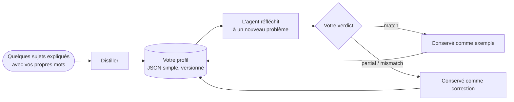

# Profils de penseur : raisonner comme une personne donnée

::: tip Le SDK peut-il raisonner comme moi ?
**Oui : il peut imiter la façon dont une personne donnée raisonne.** Un agent cognitif peut suivre *votre* ordre d'attention, peser *vos* priorités, appliquer *vos* réflexes et rejeter ce que *vous* rejetteriez. Il l'apprend à partir de quelques problèmes que vous expliquez avec vos propres mots ; chaque fois que vous lui dites où il s'est trompé, la correction est ajoutée à ses instructions, et votre degré d'accord montre s'il se rapproche de vous.

Il imite une **façon de raisonner**, pas une personne : il ne sait pas ce que vous n'avez pas écrit, et il ne décide pas à votre place. Le SDK ne prétend pas savoir à quel point il s'approche de vous : **c'est vous qui le mesurez**, exécution après exécution, avec le pourcentage d'accord que vous donnez à ses réponses.
:::

{.illustration}

## Ce que signifie « raisonner comme vous » {#what-reasoning-like-you-means}

| Il imite | Il n'imite pas |
| --- | --- |
| L'**ordre** dans lequel vous examinez un problème (d'abord ce que cela permet réellement, puis ses limites…) | Vos **connaissances** : ce que vous savez sans l'avoir jamais écrit, à moins que vous ne le fournissiez comme contexte ou comme observations |
| Vos **priorités** (ce qui compte le plus pour vous, dans l'ordre) | Vos **souvenirs** et votre vie : il ne connaît que les échantillons, les corrections et le contexte que vous lui avez donnés |
| Vos **réflexes** (« quand un service est payant, je cherche d'abord une alternative gratuite ») | Les intuitions que vous n'avez jamais mises en mots |
| Ce qui vous fait **rejeter** une idée | Votre **responsabilité** : sa réponse est une prédiction de ce que vous penseriez, pas une décision prise à votre place |
| Votre **appétence pour le risque** | Votre certitude sur le monde : les affirmations ont toujours besoin de preuves, comme dans tout agent cognitif |
| Les **erreurs que vous avez corrigées** : il a pour instruction de ne pas les répéter | |

## Comment cela fonctionne, étape par étape {#how-it-works-step-by-step}



### Étape 1 : expliquez quelques sujets avec vos propres mots {#step-1-explain-a-few-topics-in-your-own-words}

Un **échantillon** est un sujet sur lequel vous avez raisonné, écrit comme cela vous est venu. Le désordre ne pose pas de problème. Il comporte trois parties :

| Champ | Ce qu'il faut écrire | Exemple |
| --- | --- | --- |
| `topic` | Le sujet, en quelques mots | « Un robot qui ne range que les cuisines » |
| `reasoning` | Comment vous l'avez abordé : ce que vous avez regardé en premier, ce que vous avez vérifié, ce qui vous a fait hésiter, pourquoi | « Que fait-il vraiment ? Une seule pièce, donc la limite, c'est la généralisation. Pourrait-il apprendre une autre pièce à partir de quelques exemples ?… » |
| `conclusion` | Ce que vous avez conclu ou ce que vous feriez (facultatif, mais cela devient un exemple de calibrage) | « Construire une petite boucle adaptative et la tester dans une deuxième pièce » |

Cinq à dix échantillons sur des sujets **variés** valent mieux que beaucoup d'échantillons sur un seul sujet : le distillateur cherche ce qui se répète **d'un sujet à l'autre**, et un schéma vu une seule fois est faible.

### Étape 2 : distillez votre profil {#step-2-distill-your-profile}

```ts
const profile = await sdk.distillThinkerProfile({
  id: 'nicolas',
  name: 'Nicolas',
  model: 'gpt-4o',
  samples: [
    {
      topic: 'Typed decision APIs like Jev',
      reasoning:
        'What does it really allow? Then the limits: closed, US-only, paid. Is there an open clone? ' +
        'Could it become the controller of my agents? I would benchmark it on my own traces first.',
      conclusion: 'Use an open clone as the controller and benchmark it against Jev',
    },
    { topic: 'World models', reasoning: 'Structure beats scale. Test on a small chaotic system before anything big.' },
  ],
});
```

Ce qui se passe, exactement :

1. Les échantillons sont vérifiés : chacun doit avoir un sujet et un raisonnement.
2. Un appel au modèle de langage joue le rôle d'un *analyste cognitif*. Il cherche les **opérations récurrentes** de votre raisonnement, pas vos opinions : ce que vous examinez en premier, les questions que vous posez, jusqu'où vous poussez une idée, ce qui vous fait rejeter une solution, votre rapport au risque, au coût et à la nouveauté. Il a pour instruction de ne retenir que les schémas étayés par les échantillons, et de privilégier ceux qu'on retrouve dans plusieurs échantillons.
3. Sa réponse est validée par rapport au schéma de profil. Une réponse invalide lui est renvoyée une fois avec l'erreur ; un second échec lève une `ThoughtGenerationError` plutôt que de renvoyer un profil à moitié construit.
4. Les échantillons qui ont une conclusion sont conservés dans le profil comme **exemples**, si bien que le profil contient à la fois la méthode extraite et les éléments dont elle provient.

Le résultat est du JSON simple. **Lisez-le** : si une étape ou une priorité est fausse ou manquante, corrigez-la à la main. Vous vous connaissez mieux qu'une seule extraction.

### Étape 3 : laissez l'agent penser comme vous {#step-3-let-the-agent-think-as-you}

```ts
const twin = sdk.createCognitiveAgent({
  name: 'my-twin',
  model: 'gpt-4o',
  profile,
  systemPrompt: "Write every statement and the answer in French, in the thinker's own voice.", // optional
});

const run = await twin.think({
  problem: 'A bank offers you a stable, well-paid CTO job maintaining legacy systems. What do you decide?',
});
console.log(run.decision?.status, run.decision?.answer);
```

Le profil est **copié au démarrage de l'exécution**, si bien qu'une correction donnée pendant une exécution s'applique à la suivante. Il est inscrit dans les instructions de chaque étape de raisonnement, et on demande à l'étape finale `decide` *la réponse que donnerait le penseur*, avec une justification qui suit l'ordre d'attention du penseur. [Où le profil pèse](#where-the-profile-weighs-and-where-it-never-does) liste chacun de ces endroits.

### Étape 4 : dites-lui où il s'est trompé {#step-4-tell-it-where-it-went-wrong}

Après une exécution, donnez votre **verdict** : a-t-il raisonné comme vous l'auriez fait ?

```ts
// "Yes, exactly what I would have thought."
await twin.learnFromFeedback(run.runId, { verdict: 'match' });

// "No, I would have gone another way."
await twin.learnFromFeedback(run.runId, {
  verdict: 'mismatch',
  expected: 'Prototype with the free clone first, then compare with Jev on 100 real tickets',
  lesson: 'Always test the free option on real data before paying',
});

// "You are 50% right, and here is where you went wrong."
await twin.learnFromFeedback(run.runId, {
  verdict: 'partial',
  agreement: 0.5,
  wrongAbout: ['ignored the free option', 'overestimated the integration cost'],
  expected: 'Benchmark the open clone on our own tickets before deciding',
});
```

| Champ | Signification | Obligatoire |
| --- | --- | --- |
| `verdict` | `match` (il a raisonné comme vous), `partial` (en partie), `mismatch` (pas du tout) | Toujours |
| `agreement` | La part avec laquelle vous êtes d'accord, de 0 à 1 : `0.8` signifie « juste à 80 % » | Non |
| `expected` | Ce que vous auriez conclu à la place | Pour `partial` et `mismatch` |
| `wrongAbout` | Là où le raisonnement s'est trompé, avec vos mots | Non |
| `lesson` | La règle à retenir pour la prochaine fois (par défaut, `expected`) | Non |
| `notes` | Tout le reste, conservé dans l'événement | Non |

Ce qu'il advient de votre retour :

| Verdict | Effet sur le profil |
| --- | --- |
| `match` | L'exécution devient un **exemple** de calibrage : sa question, un résumé de ses étapes de raisonnement et sa conclusion. Chaque `match` conserve les 10 exemples les plus récents, échantillons distillés compris. |
| `partial` / `mismatch` | Une **correction** est enregistrée : ce que l'agent a conclu, ce que vous attendiez, votre degré d'accord, là où il s'est trompé et la leçon. Les 20 plus récentes sont conservées. Les corrections terminent le profil dans les instructions de chaque étape de raisonnement, avec la priorité la plus haute : « ne répète pas ces erreurs ». Le contrôleur Jev voit les cinq dernières leçons. |

Chaque verdict incrémente la version de correctif du profil (`1.0.0` → `1.0.1`) et est ajouté à l'exécution sous forme d'événement `cognition.feedback`, avec la version du profil avant et après. Une exécution sans décision ne peut pas recevoir de retour : il n'y a rien à juger.

`learnFromFeedback` renvoie le profil affiné et le conserve dans l'agent. **Sauvegardez-le** (`twin.getProfile()` est du JSON simple), sinon les leçons sont perdues à l'arrêt de votre processus.

### Étape 5 : mesurez à quel point il s'approche de vous {#step-5-measure-how-close-it-gets}

Le SDK enregistre vos verdicts ; il ne s'auto-évalue pas. Pour savoir s'il raisonne vraiment comme vous, suivez un protocole simple :

1. Préparez des **problèmes nouveaux** que l'agent n'a jamais vus, sur des sujets variés.
2. **Écrivez d'abord votre propre réponse**, avant de lire celle de l'agent, pour que sa réponse n'influence pas la vôtre.
3. Lancez l'agent, puis notez chaque réponse : `agreement`, là où il s'est trompé (`wrongAbout`), ce que vous attendiez (`expected`).
4. Donnez ce retour et sauvegardez le profil affiné.
5. Au tour suivant, utilisez **d'autres problèmes nouveaux** et comparez le degré d'accord moyen avec celui du tour précédent.

Si la moyenne augmente sur des problèmes qu'il n'a jamais vus, c'est le signe qu'il saisit votre *façon* de raisonner, et pas seulement les réponses que vous avez corrigées ; sur une poignée de problèmes, une hausse peut aussi être due au hasard, alors poursuivez sur plusieurs tours. S'il ne progresse que sur les problèmes que vous avez corrigés, il recopie des réponses.

```ts
const scores = [0.4, 0.6, 0.5]; // the agreement you gave this round
const average = scores.reduce((sum, value) => sum + value, 0) / scores.length; // 0.5, that is 50%
```

## Anatomie d'un profil {#anatomy-of-a-profile}

Vous pouvez aussi écrire un profil à la main :

```ts
import { defineThinkerProfile } from '@sdk-ai-agents/core';

const builder = defineThinkerProfile({
  id: 'builder',
  name: 'Pragmatic builder',
  summary: 'Looks for what a technology really enables, then its limits, then a prototype.',
  reasoningSequence: [
    { id: 'real-capability', instruction: 'Establish what the technology really enables' },
    { id: 'limits', instruction: 'Look for its limits immediately' },
    { id: 'workaround', instruction: 'Imagine how to work around those limits' },
    { id: 'product', instruction: 'Check whether it can become a product' },
    { id: 'automation', instruction: 'Ask how the product could run itself' },
    { id: 'generalize', instruction: 'Extrapolate towards a more general architecture' },
    { id: 'prototype', instruction: 'Design the smallest prototype that tests it' },
  ],
  priorities: ['Real capability over hype', 'Free and open options first', 'Fast feedback'],
  heuristics: [{ when: 'a service is paid and closed', action: 'look for an open alternative before paying' }],
  rejectionCriteria: ['Cannot be tested with a prototype', 'Locks data in a vendor'],
  riskAppetite: 'high',
});

const agent = sdk.createCognitiveAgent({ name: 'me', model: 'gpt-4o', profile: builder });
```

`defineThinkerProfile` valide le profil et complète ce qui manque avec des valeurs par défaut (listes vides, `riskAppetite: 'medium'`, `version: '1.0.0'`).

| Champ | En termes simples | Comment le moteur l'utilise |
| --- | --- | --- |
| `id`, `name`, `version` | La personne que décrit ce profil, et quelle révision du profil | Enregistrés dans chaque exécution, pour que vous sachiez quelle version du profil l'a produite |
| `summary` | Une phrase qui décrit le style | Écrit en tête du profil dans les prompts |
| `reasoningSequence` | Les étapes par lesquelles vous passez, dans l'ordre | Écrit sous la forme « Ordre d'attention (à suivre) » ; la réponse finale le suit |
| `priorities` | Ce qui compte le plus, du plus important au moins important | Écrit dans les prompts ; sert à juger à quel point un choix vous convient |
| `heuristics` | Vos réflexes : « quand …, alors … » | Écrits sous forme de règles dans les prompts |
| `rejectionCriteria` | Ce qui vous fait abandonner une idée | Sert à critiquer les options et à rejeter celles que vous rejetteriez |
| `riskAppetite` | `low`, `medium` ou `high` | Écrit dans les prompts |
| `examples` | Les exécutions et les échantillons que vous avez validés | Présentés comme des « exemples validés de son raisonnement » : le modèle se calibre sur eux |
| `corrections` | Les leçons tirées d'exécutions avec lesquelles vous étiez en désaccord | Présentées à la fin du profil, avec la priorité la plus haute |

Sans profil, les agents utilisent `DEFAULT_THINKER_PROFILE`, un analyste neutre qui fait passer les preuves en premier.

## Où le profil pèse, et où il ne pèse jamais {#where-the-profile-weighs-and-where-it-never-does}

| Moment du raisonnement | Votre profil compte-t-il ? |
| --- | --- |
| **Chaque étape de raisonnement** (représenter, formuler des hypothèses, simuler, critiquer, comparer, décider, lire un résultat d'outil) | Oui : le profil entier figure dans les instructions que reçoit le modèle de langage. Seule la courte requête qui choisit l'outil à appeler s'en passe |
| **Le choix de l'étape suivante** | Avec le contrôleur Jev, oui : il voit votre ordre d'attention, vos priorités, vos critères de rejet, votre appétence pour le risque et vos cinq dernières leçons. Sans Jev, le contrôleur heuristique suit un ordre fixe, et c'est le contenu de chaque étape que votre profil façonne |
| **La critique** | Oui : les options sont attaquées avec vos critères de rejet |
| **À quel point un choix vous convient** (`preferenceFit`) | Oui : c'est sa raison d'être. Un choix jugé conforme à l'un de vos critères de rejet est classé plus bas, et il est rejeté quand le juge en est sûr (Jev met toute sa probabilité sur ce niveau) ou, avec un juge qui est un modèle de langage, quand le modèle le rejette |
| **À quel point les preuves appuient une option** (`support`) | **Non.** Avec Jev, cette question est envoyée sans votre profil ; avec un modèle de langage, le modèle a pour instruction d'ignorer les préférences |
| **Le choix d'action classé en premier** | Oui, pour les choix d'action, avec un poids de 40 % par défaut |
| **Si un choix d'action peut être retenu comme ferme** | Oui, quand vous le préférez clairement et que les faits ne plaident pas contre lui |
| **Si une affirmation sur le monde est crédible** | **Jamais** dans le code : les deux scores ne sont jamais mélangés. Avec un juge qui est un modèle de langage, la séparation repose sur ses instructions, et une affirmation que le modèle étiquette à tort comme un choix pourrait emprunter la voie des préférences (voir [Types déclarés](./evidence-and-verification#not-there-yet)) |

### Les deux scores {#the-two-scores}

Quand les options sont comparées, chacune reçoit jusqu'à deux scores compris entre 0 et 1 :

| Score | Question | 0 | 0,25 | 0,5 | 0,75 | 1 |
| --- | --- | --- | --- | --- | --- | --- |
| `support` | À quel point les faits, les observations, les tests et les critiques l'appuient-ils ? | Réfutée | Faiblement soutenue | Plausible | Fortement soutenue | Établie |
| `preferenceFit` | À quel point ce choix convient-il au penseur ? (choix d'action uniquement) | Remplit un critère de rejet | Peu adapté | Adéquation acceptable | Bonne adéquation | Adéquation idéale |

Ce sont les niveaux sur lesquels l'évaluateur d'hypothèses Jev pose ses questions ; un juge qui est un modèle de langage donne pour chacun un nombre compris entre 0 et 1, qui se lit de la même façon. Les deux sont des jugements, pas des probabilités mesurées.

### Comment un choix est classé et retenu comme ferme {#how-a-choice-is-ranked-and-committed}

Reprenons le problème du poste à la banque ci-dessus, avec deux options :

| Option | `support` | `preferenceFit` | Score de classement : 60 % du soutien + 40 % de l'adéquation |
| --- | --- | --- | --- |
| H1 : accepter le poste | 0,5 (plausible) | 0,25 (peu adapté : rien de nouveau à construire) | 0,6 × 0,5 + 0,4 × 0,25 = **0,40** |
| H2 : décliner et continuer à construire | 0,5 (plausible) | 1 (adéquation idéale) | 0,6 × 0,5 + 0,4 × 1 = **0,70** |

Les faits appuient également les deux options ; vos préférences placent H2 en tête. Le poids est `limits.preferenceWeight` (0,4).

Pour être retenue comme **ferme** (une réponse définitive, plutôt qu'une réponse provisoire ou une abstention), une option doit passer le [garde-fou de conclusion](./evidence-and-verification#the-conclusion-guard). Ses preuves suffisent de l'une de ces deux façons :

- **par les preuves seules**, pour tout type d'hypothèse : un `support` d'au moins `limits.decisionThreshold` (0,75, « fortement soutenue ») ;
- **par votre choix**, pour un choix d'action uniquement : une `preferenceFit` d'au moins `limits.decisionThreshold` (0,75, « bonne adéquation ») **et** un `support` d'au moins `limits.minProposalSupport` (0,35, un peu au-dessus de « faiblement soutenue »).

H2 emprunte la seconde voie : soutien 0,5 ≥ 0,35, adéquation 1 ≥ 0,75. Elle est retenue comme ferme avec une **confiance de 0,5**, car la confiance d'une décision ne dépasse jamais le soutien que lui apportent les preuves : la réponse dit « c'est le choix du penseur », pas « c'est prouvé ».

Pourquoi la seconde voie existe : une question comme *« accepteriez-vous ce poste ? »* offre peu de preuves à peser. Une personne en décide selon ses priorités, à condition que les faits ne plaident pas contre ce choix. Lors d'une exécution réelle avec un profil de penseur, de telles questions se terminaient sans réponse ferme avant que cette seconde voie existe.

Pourquoi elle est fermée aux affirmations : un énoncé comme *« l'IA de cette start-up détecte les mensonges avec 99 % de précision »* est une **règle** sur le monde. Même si vous aimeriez qu'il soit vrai, il n'est retenu comme ferme que si son soutien par les preuves atteint 0,75, du moment que le modèle l'étiquette comme une règle, ce qu'il a pour instruction de faire (voir [Types déclarés](./evidence-and-verification#not-there-yet)). Les préférences peuvent choisir quoi faire ; elles ne rendent jamais quelque chose vrai.

## Limites {#limits}

- **Le modèle compte.** Le profil est un ensemble d'instructions : un petit modèle les suit moins fidèlement qu'un grand.
- **Il ne connaît que ce que vous lui avez donné.** Fournissez les faits de votre situation comme `context` ou `observations` quand ils comptent.
- **Un premier profil est une ébauche.** Une poignée d'échantillons donne une poignée de schémas ; ce sont les corrections qui l'affinent.
- **Sa mémoire est bornée.** 20 corrections sont conservées, et chaque `match` conserve les 10 exemples les plus récents (un profil distillé peut commencer avec davantage) ; les plus anciens sont écartés.
- **La fidélité n'est pas la vérité.** Votre retour mesure si l'agent a raisonné **comme vous**, pas s'il avait **raison**. Pour confronter une affirmation au monde réel, donnez à l'agent un [évaluateur de résultats](./evidence-and-verification#predictions-and-the-outcome-evaluator).
- **Ce sont des données personnelles.** Les échantillons, les profils et les événements de ces exécutions décrivent la façon de penser d'une personne. Stockez-les de manière privée, jamais dans un dépôt public, et demandez le consentement avant de profiler quelqu'un d'autre.

## Les profils sont des données {#profiles-are-data}

Les profils sont du JSON simple : conservez-les où vous voulez et rechargez-les avec `agent.setProfile(profile)` ou l'option `profile`. Les événements portent `profileId` et `profileVersion`, si bien que vous savez toujours quelle version du profil a produit une exécution.

## Entraînez votre propre contrôleur {#train-your-own-controller}

Chaque choix d'opération est enregistré avec l'état que le contrôleur voyait. Exportez-les au format JSON Lines :

```ts
const jsonl = await sdk.exportControllerDataset(); // or pass runIds
```

```json
{"runId":"run_…","step":3,"state":{…},"available":["hypothesize","simulate","critique","decide"],"operation":"simulate","controller":"jev","confidence":0.82,"usedFallback":false,"runStatus":"completed","feedback":"partial","agreement":0.5}
```

Filtrez sur `feedback: "match"` et vous obtenez des exemples supervisés de *votre* façon de choisir le mouvement suivant : de quoi affiner un petit modèle ouvert et le brancher comme `CognitiveController` personnalisé, sans coût par appel.
