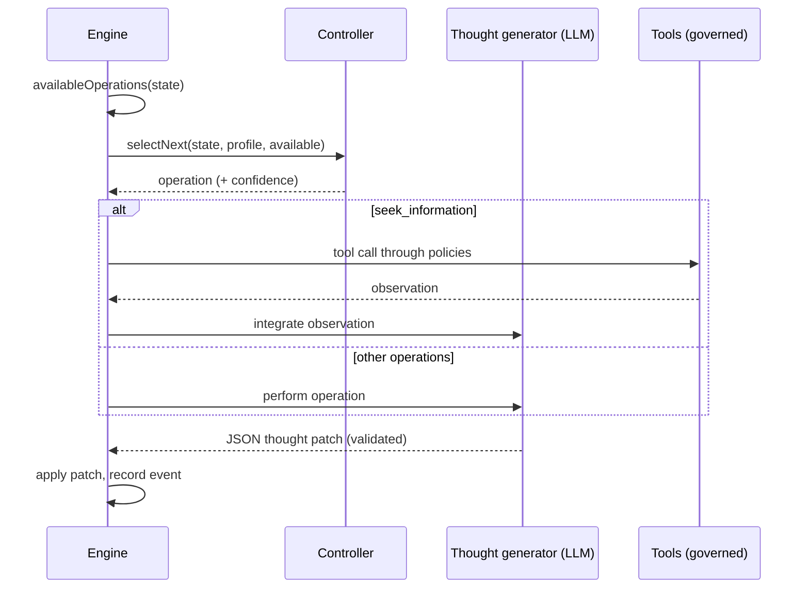

# Cognitive agents

A cognitive agent does not answer in one pass. It keeps an **explicit mental state** and improves it one **cognitive operation** at a time, until it can commit to a decision it can justify.

{.illustration style="max-width:460px"}

```ts
const agent = sdk.createCognitiveAgent({
  name: 'analyst',
  model: 'gpt-4o',
  tools: [lookupMetric],
  profile: myProfile, // optional, see Thinker profiles
});

const { status, answer, decision, state, runId } = await agent.think({
  problem: 'Should we build or buy our analytics module?',
  context: { budget: '10k EUR', deadline: 'before Q4' },
  observations: [{ content: 'Churn was 4% last month', originGroup: 'billing' }], // optional
});

decision?.status; // 'committed' | 'provisional' | 'abstain'
```

::: tip Evidence first
How observations are traced, predictions tested and conclusions guarded is described in [Evidence & verification](./evidence-and-verification).
:::

## The mental state

The mental state is plain, typed data. Every item gets a stable id the model can refer to.

| Part | Ids | What it holds |
| --- | --- | --- |
| `observations` | `O1…` | What was observed — given with the problem, returned by a tool or by a test — with its provenance |
| `facts` | `F1…` | Statements with a source (`input`, `tool`, `inference`), the observations they come from, and a status (`active`, `superseded`, `retracted`) |
| `assumptions` | `A1…` | What the reasoning takes for granted |
| `constraints` | `K1…` | What any answer must respect |
| `unknowns` | `U1…` | Open questions — `open`, `resolved` or `dropped`, with attempt counts |
| `hypotheses` | `H1…` | Proposals, rules or explanations with premises, simulations, critiques, an evidence `support`, a `preferenceFit` and a status |
| `comparisons` | `R1…` | Relations between observations: similarity, difference, evolution, incompatibility, counterexample |
| `predictions` | `P1…` | What a hypothesis predicts, what would refute it, and the test result |
| `contradictions` | `C1…` | Conflicts between items, with a category, until resolved with cited evidence |
| `failures` | `X1…` | What already failed, so it is not retried blindly |
| `confidence`, `evidenceRevision` | | Evidence support of the best answer; a counter that makes older assessments stale |
| `decision`, `trail` | | The final decision and its status, one line per step |

{.illustration style="max-width:760px"}

The state is **never edited in place**. Each operation produces a *thought patch*; the patch is recorded as a `cognition.thought` event; the state is the fold of all patches. That is why `sdk.getMentalState(runId)` can rebuild any run exactly, even months later.

## The operations

| Operation | What it does | Available when |
| --- | --- | --- |
| `represent` | Extracts facts, assumptions, constraints and unknowns | Always first; again when a contradiction is open |
| `compare_observations` | Relates observations: similarities, differences, changes, counterexamples | Two comparable observations or more (duplicates and test results excluded), new ones since the last comparison |
| `hypothesize` | Proposes new proposals, rules or explanations | Fewer active hypotheses than `maxHypotheses` |
| `simulate` | Projects consequences step by step and states testable predictions | A hypothesis has no simulation |
| `test_prediction` | Runs your outcome evaluator on a recorded prediction — no LLM call | An evaluator is configured, a prediction is pending, test budget left |
| `revise` | Turns a hypothesis contradicted by evidence into a scoped variant | A refuted or contradicted hypothesis has no variant yet |
| `critique` | Finds the strongest reasons a hypothesis could fail | A hypothesis has no critique |
| `seek_information` | Calls a governed tool to answer an open unknown | Tools exist, an unknown is open, tool budget left |
| `compare` | Judges evidence support, and how proposals suit the thinker | A critiqued hypothesis changed, or the evidence changed, since the last comparison |
| `decide` | Commits to an answer, rationale, confidence and next actions | A hypothesis passes the [conclusion guard](./evidence-and-verification#the-conclusion-guard) |

**Code decides what is possible, the controller decides what is useful.** Preconditions are computed from the state, and the controller can only choose among available operations.

Rules enforced in code, whatever the model says:

- a `fatal` critique without rebuttal, or a refuted prediction, rejects its hypothesis;
- a rejected hypothesis cannot be revived, restated or selected — only revised into a variant that says what changed;
- the code never mixes preferences into the evidence support of a claim, and the model cannot set the state's confidence;
- a contradiction is resolved once, and only by citing the observations or facts that settle it;
- a step that changed nothing it was meant to change, or a deferred decision, counts as a failed attempt; after two in a row the operation is no longer offered until another step brings new evidence (see [A budget that is not wasted](./evidence-and-verification#a-budget-that-is-not-wasted));
- provenance (observations, test results) and the decision status are written by the engine: a model reply that contains them is stripped;
- references to unknown ids are ignored and reported as `issues` on the thought event;
- at most `maxHypotheses` hypotheses are in play: extra proposals are dropped and reported;
- an unknown is no longer investigated after two unsuccessful attempts, or at once when no available tool can answer it, and reframing (`represent` on a contradiction) is offered at most three times;
- a failed operation is recorded as failed and does not count as done;
- the **last step is always a decision attempt**: an answer that does not pass the conclusion guard becomes `provisional` (with what is missing) or an `abstain`; if the model cannot produce a decision at all, the engine abstains and records why.

## Controllers

The controller picks the next operation.



| Controller | How it chooses | When to use it |
| --- | --- | --- |
| `heuristic` | A fixed order of attention: represent → revise → compare observations → hypothesize → simulate → test predictions → critique → seek information → compare → decide | Default without Jev, deterministic, free |
| `typed` | One Jev request per step: a Choice over available operations and a Noul "ready to decide?" | Adaptive reasoning with calibrated confidence |
| your own | Implement `CognitiveController.selectNext()` | A fine-tuned local model, business rules, … |

With `controller: 'auto'` (the default) the agent uses Jev when the SDK has a typed-decision backend, and the heuristic otherwise. The typed controller **falls back to the heuristic** when the Choice confidence is below `minConfidence` (0.35), when the client fails, or when the answer is not an available operation. A custom controller that throws or returns an unavailable operation is replaced by the heuristic too. Every fallback is recorded in the `fallbackFrom` field of the selection event.

```ts
sdk.createCognitiveAgent({
  name: 'analyst',
  model: 'gpt-4o',
  controller: 'typed',
  controllerOptions: { minConfidence: 0.5, readinessThreshold: 0.85 },
  assessment: 'typed', // compare hypotheses with Jev Score questions
});
```

## Tools inside reasoning

`seek_information` uses the **native reasoning and action engines**: the LLM picks one tool for the open unknown, the action engine checks that the tool was **given to this agent**, validates the call against policies, approvals and budgets, and the result is recorded as an **observation** pointing to its `action.executed` event, then integrated as facts with `source: "tool"`. The observation is kept even if its interpretation fails. A denied, blocked or failing tool becomes a recorded failure, and the reasoning continues.

## Limits

```ts
sdk.createCognitiveAgent({
  name: 'analyst',
  model: 'gpt-4o',
  limits: {
    maxSteps: 12,              // the last one always decides
    timeoutMs: 180_000,
    maxHypotheses: 3,          // in play at the same time
    maxToolCalls: 5,
    decisionThreshold: 0.75,   // minimum evidence support of a committed answer
    maxConsecutiveFailures: 3, // then the run fails (and alerts you, if incidents are on)
    maxPredictionTests: 4,     // calls to the outcome evaluator per run
    preferenceWeight: 0.4,     // weight of the thinker's preferences when ranking proposals
    minProposalSupport: 0.35,  // evidence a clearly preferred choice of action needs to be committed
  },
  evaluator: myBench,          // optional OutcomeEvaluator, enables test_prediction
});
```

Limits are validated when the agent is created: `maxSteps: 0` or a timeout beyond what a timer supports throws a `ValidationError` instead of silently disabling a safeguard.

## Invalid model output

Each operation has a strict JSON contract validated by Zod. A reply that is not valid JSON, misses its required field or uses a wrong value is sent back **once** with the validation error. Fields an operation may not write (a `decision` during `simulate`, for example) are ignored and listed in `ignoredFields`. If the repair also fails, the operation is recorded as a failure and the loop continues.

## Stop, cancel, time out

```ts
const pending = agent.think({ problem });
await agent.stop();          // or agent.stop(runId)
const result = await pending; // status: 'cancelled'
```

A timeout produces `status: 'failed'` with `Timeout exceeded (… ms)`, and the run is marked failed in the event log. `sdk.stopRun(runId)` stops cognitive runs too. The timeout and the stop are checked between operations and passed to your provider as an abort signal; the built-in OpenAI and Anthropic providers do not cancel a request already in flight, so a slow call ends at the vendor's own timeout.

The profile is **snapshotted when a run starts**: feedback given while a run is in progress applies to the next run.

## Security

A cognitive agent reads text it did not write: tool results, MCP tool descriptions, documents in the context. Treat all of it as **untrusted input** — it can contain instructions aimed at the model (prompt injection). The SDK limits what such text can achieve:

- the agent can only call the tools it was given, and policies are checked on every call — put destructive tools behind `require_approval` policies;
- the model never executes anything itself: it proposes, the action engine validates;
- invariants on the mental state are enforced in code, not by the prompt;
- every tool call and thought is in the event log for review.

The event log stores the goal, the context and every thought, and `decision.evaluated` events store the context sent to Jev. Apply the retention and redaction rules your data requires to the event store you choose.

## Replay and audit

A cognitive run is a normal run:

- `sdk.getTrace(runId)` shows `cognition.*` events next to `policy.checked`, `tool.called`, …
- `sdk.replay(runId)` re-executes its tool calls without calling the LLM and reproduces the final answer — with the same tool restriction as the original run, so a tool the agent was denied is denied again;
- `sdk.getMentalState(runId)` rebuilds the state;
- `sdk.exportControllerDataset()` turns runs into training data (see [Thinker profiles](./thinker-profiles#train-your-own-controller)).
