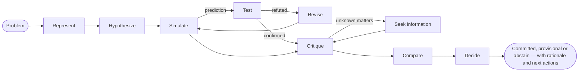

# Introduction

**SDK AI Agents** is a TypeScript SDK for building AI agents you can trust in production: agents that reason explicitly before acting, that can be taught how *you* think, and whose every step is governed, traced, priced and replayable.

{.illustration style="max-width:460px"}

## Why another agent SDK?

LLM APIs give you a very capable text generator. What they do not give you is control over **how** a conclusion is reached:

- the reasoning happens inside the model, in one pass, and is gone once the answer is printed;
- nothing stops the model from acting on a guess, calling the wrong tool or overspending;
- when something goes wrong, you have a prompt and an answer — not a story.

This SDK puts a reasoning layer **around** the model. The LLM becomes one component among others:

| Layer | What it does | Where it lives |
| --- | --- | --- |
| **Mental state** | Facts, assumptions, constraints, unknowns, hypotheses, contradictions, confidence | Rebuilt from events at any time |
| **Controller** | Picks the next cognitive operation | Deterministic heuristic, Jev typed decisions or your own |
| **Thought generator** | Performs one operation and returns a validated JSON patch | Any LLM provider |
| **Thinker profile** | The order of attention, priorities and heuristics of a person | Versioned data, refined by feedback |
| **Governance** | Policies, allowlists, budgets, approvals, retries | Checked before every action |
| **Event store** | The single source of truth | File, SQLite or PostgreSQL |

## Two kinds of agents

**Governed agents** (`sdk.createAgent`) run the classic tool-calling loop — the LLM proposes an intention, the action engine validates and executes it. They are ideal for well-defined tasks.

**Cognitive agents** (`sdk.createCognitiveAgent`) reason explicitly. They are made for decisions: choosing an architecture, triaging an incident, assessing an opportunity, answering "should we…?" questions.

Both kinds share the same tools, policies, event store, replay, costs and incident alerts.

## Can it reason like a given person?

**Yes.** A cognitive agent can imitate the way a given person reasons. You explain a few topics in your own words; the SDK extracts a **thinker profile** from them: the order in which you look at a problem, your priorities, your reflexes, what makes you reject an idea, your appetite for risk. That profile is written into the instructions of each step of its reasoning. After each run you say how far you agree (for example "60% right, here is where you went wrong"), and the lesson is kept for the next runs.

What it imitates is a **way of reasoning**: it does not know what you never wrote down, it does not decide in your place, and your preferences never make a claim about the world more credible. The SDK does not grade itself: the percentage of agreement you give run after run, on problems it has never seen, is what tells you how close it gets. [Reason like a given person](./thinker-profiles) explains each step.

## What you get

- **Explicit reasoning** — ten operations on a mental state, with invariants enforced in code (a rejected hypothesis cannot be selected, a fatal critique rejects a hypothesis, the last step always concludes).
- **Evidence you can audit** — observations with provenance, predictions tested by your own evaluator, refuted rules revised into scoped variants, preferences kept apart from evidence, and a conclusion guard that answers `committed`, `provisional` or `abstain`.
- **Reasoning like a given person**: distill a thinker profile from topics explained in your own words, then correct the agent with `match`, `partial` or `mismatch` verdicts and a percentage of agreement.
- **Typed decisions** — [TypeSafe Jev](https://docs.typesafe.ai) or any compatible backend answers Noul, Choice and Score questions with calibrated probabilities.
- **MCP connectors** — expose your tools as an MCP server, import any MCP server as governed tools.
- **Operations built in** — per-run API costs, retry policies that do not stack, incident alerts by email or webhook.
- **Native event sourcing** — replay without the LLM, golden traces, regression detection, reasoning graphs.

How does it compare with other frameworks? See [Why this SDK](./why). New to these terms? [Key terms in plain words](./glossary) explains each one. Ready? Head to [Getting started](./getting-started).
