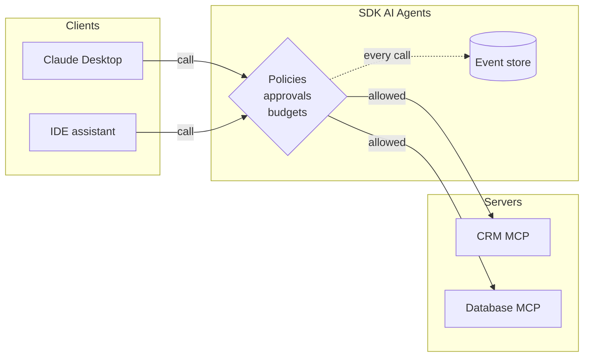

# MCP connectors

The [Model Context Protocol](https://modelcontextprotocol.io) is the standard way to connect AI applications to tools and data. The SDK speaks it in **both directions**:

- **expose** your governed tools as an MCP server, for Claude Desktop, IDE assistants or other agents;
- **import** the tools of any MCP server, so your agents can use your CRM, database or internal APIs.

{.illustration}

MCP support lives in a separate entry point, so the core package does not depend on it:

```sh
npm install @modelcontextprotocol/sdk
```

```ts
import { connectMcpServer, createMcpServer, serveMcpOverStdio } from '@sdk-ai-agents/core/mcp';
```

## Expose your tools

```ts
const sdk = createSDK({ apiKey: process.env.OPENAI_API_KEY, defaultPolicies: [noDeletesPolicy] });

sdk.defineTool({
  name: 'lookup_customer',
  description: 'Returns the plan and churn risk of a customer',
  schema: z.object({ customerId: z.string() }),
  handler: async ({ customerId }) => crm.customer(customerId),
});

await serveMcpOverStdio(sdk, {
  name: 'acme-crm',
  tools: ['lookup_customer'],   // required: nothing is exposed unless listed
  instructions: 'Read-only access to ACME customer data.',
});
```

The `tools` list is required: tools imported from other MCP servers or meant for internal agents never leak to clients by accident, and a call to any other tool is denied even if it is registered. Every call goes through the **governed pipeline**: the schema is validated, policies are checked (with the identity `mcp:<name>`), approvals and budgets apply, idempotent tools are retried, and the call is recorded as its own run. Tool errors are returned to the client as `isError` results, not as protocol failures. By default the client only sees the top-level message; set `exposeErrorDetails: true` to include the underlying causes (they can contain internal details such as SQL errors or file paths). The full error is always in the event log.

Register it in an MCP client, for example Claude Desktop:

```json
{
  "mcpServers": {
    "acme-crm": { "command": "node", "args": ["dist/mcp-server.js"] }
  }
}
```

For HTTP deployments, pass `createMcpServer(sdk, options)` to the Streamable HTTP transport of the MCP SDK.

## Import tools from an MCP server

```ts
const crm = await connectMcpServer({
  name: 'crm',
  transport: { type: 'http', url: 'https://mcp.acme.internal/crm', headers: { Authorization: `Bearer ${token}` } },
  toolPrefix: 'crm_',                         // avoid collisions between servers
  include: ['lookup_customer', 'list_invoices'],
  metadata: { riskLevel: 'medium' },          // governance metadata for every tool
  retry: { maxRetries: 2 },
});

const tools = crm.tools.map((definition) => sdk.defineTool(definition));
const agent = sdk.createCognitiveAgent({ name: 'account-manager', model: 'gpt-4o', tools });

await agent.think({ problem: 'Should we offer customer c-42 a discount?' });
await crm.close();
```

Transports:

| `transport.type` | Use it for |
| --- | --- |
| `stdio` | Local servers started as a process (`command`, `args`, `env`, `cwd`) |
| `http` | Remote servers over Streamable HTTP (`url`, `headers`) |
| `custom` | Any transport you build (WebSocket, in-memory for tests…) |

Imported tools keep the server's JSON Schema, so the LLM sees the real parameters. Once defined with `sdk.defineTool`, they behave exactly like local tools: allowlists, policies, approvals, budgets, retries and traces apply to every call. If the tool listing fails, the connection (and the stdio process) is closed before the error is thrown.

::: warning Untrusted servers
Descriptions and results of imported tools reach the model word for word. Only connect servers you trust, give each agent only the tools it needs, and protect destructive tools with approval policies.
:::

## Governance across the bridge



A company can therefore put **one governed layer** between every AI client and every internal system — with a single audit trail.
