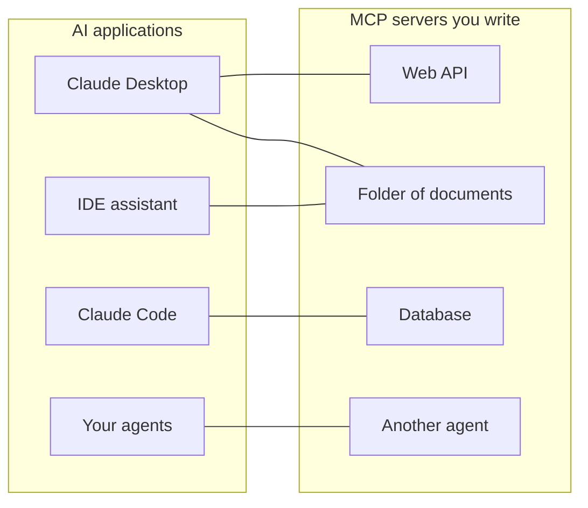
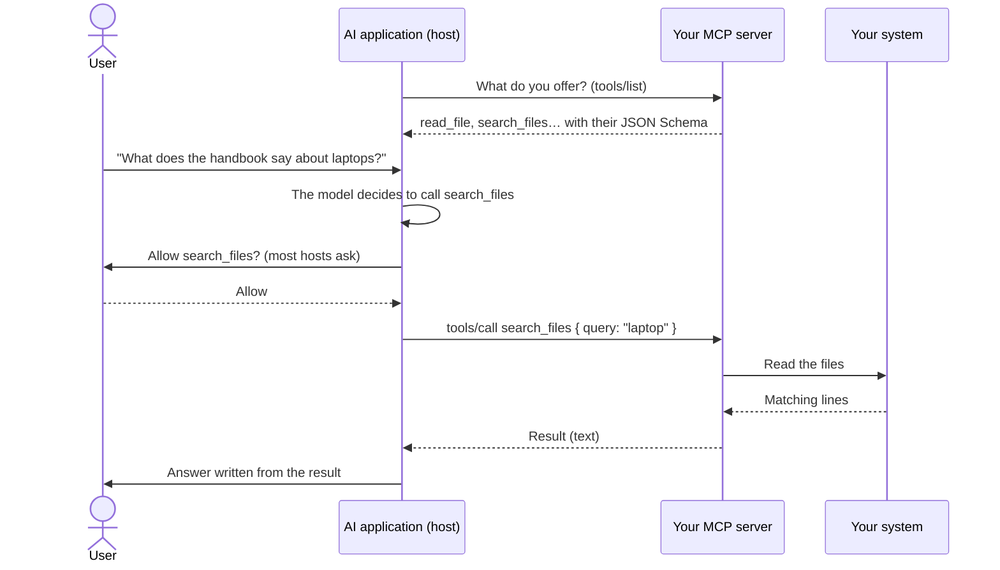
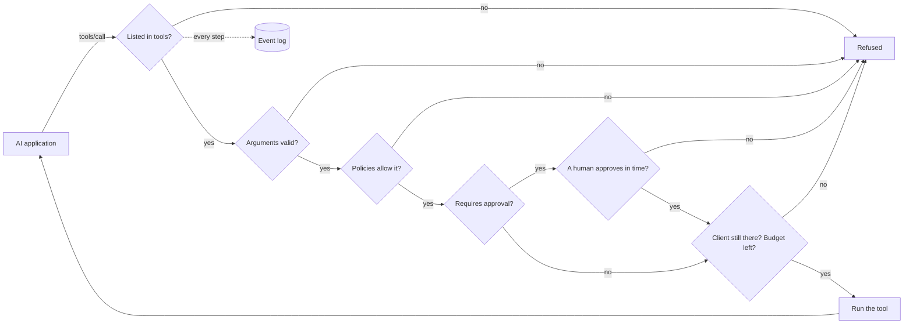

# MCP in plain words

**MCP lets an AI application — Claude Desktop, Claude Code, an IDE assistant, your own agent — use your systems: an API, a folder of documents, a database, another agent.** This page explains the idea and the words. The next pages go from zero to a working server:

1. [Your first MCP server in 5 minutes](./mcp-first-server) — step by step, from an empty folder to Claude Desktop.
2. [An MCP server for anything](./mcp-recipes) — one line for a function, a web API, a folder, a database or an agent.
3. [Deploy, secure and troubleshoot](./mcp-deploy) — HTTP deployment, authentication, approvals, and what to do when it does not work.

## The idea: one plug for every AI app

Think of MCP (Model Context Protocol) as **USB-C for AI applications**. Before USB, every device had its own cable. Before MCP, every AI application needed its own glue code for every system it talked to: one integration for Claude, another for your IDE, another for your agent.

With MCP, you write **one small program — an MCP server — in front of your system**. Every application that speaks MCP can then plug into it, list what it offers and use it. You build the server once; it works everywhere.



The protocol is an open standard published at [modelcontextprotocol.io](https://modelcontextprotocol.io). Anthropic started it; many AI applications support it.

## The words, one by one

| Word | In plain words | Example |
| --- | --- | --- |
| **Host** (the AI application) | The app the user talks to. It runs the language model and decides when to use your server. | Claude Desktop, Claude Code, VS Code |
| **MCP client** | The part of the host that holds the connection to one server. You rarely see it. | One per server in Claude Desktop |
| **MCP server** | Your small program. It says what it offers and does the work when asked. | `serveMcpOverStdio(sdk, { … })` |
| **Tool** | An action the model may decide to call, with named arguments. The model reads its name, description and argument list to decide. | `read_file`, `list_pets`, `query` |
| **Resource** | A document the server offers for reading. Unlike a tool, the **user or the app** picks it (for example with an "attach" button), not the model. | `folder://handbook/onboarding.md` |
| **Prompt** | A ready-made message template offered by a server. Not provided by this SDK yet. | — |
| **Transport** | How messages travel between host and server. | stdio, Streamable HTTP |
| **stdio** | The host **starts your server as a program** on the same computer and talks to it through its standard input and output — like typing into it and reading what it prints. Nothing is open on the network. | Local servers in Claude Desktop |
| **Streamable HTTP** | Your server is a **web service**; hosts send it HTTP requests. Used to share one server with a team. | `https://mcp.example.com/mcp` |
| **JSON Schema** | The description of a tool's arguments (names, types, which ones are required) that the model reads. The SDK writes it for you. | `{ "type": "object", "properties": { "path": { "type": "string" } } }` |
| **Annotation** | A hint about a tool shown to hosts, such as "this tool only reads". Hosts may use it to decide when to ask the user for confirmation. | `readOnlyHint: true` |

::: tip Tools versus resources
A **tool** is something the model *does* ("search the handbook for 'laptop'"). A **resource** is something the user *hands over* ("attach onboarding.md to this conversation"). The folder recipe offers both, from the same folder.
:::

## What happens during one call



Two things to remember:

- **The model only sees what the server lists**: names, descriptions, argument schemas, and the results it gets back. Write clear descriptions; never put secrets in them.
- **The server decides what really happens.** The model proposes a call; your server can refuse it, limit it, ask a human, or log it. That is where this SDK comes in.

## What this SDK adds

You can write MCP servers with the official MCP SDK alone. This SDK sits on top of it and adds what you need to run one **safely, and in one line**:

| | With the official MCP SDK alone | With SDK AI Agents |
| --- | --- | --- |
| Expose a web API | Write one handler per endpoint | `openApiTools({ spec })` — one tool per operation, read-only by default |
| Expose a folder | Write path checks yourself | `folderTools({ root })` — symbolic links and `..` cannot leave the folder |
| Expose a database | Write the SQL guard yourself | `databaseTools({ database })` — one SELECT, read-only at the database level (a read-only transaction on PostgreSQL, `query_only` on SQLite), with a row limit |
| Expose an agent | — | `cognitiveAgentTool(agent)` — "what would Nicolas think?" as one tool |
| Nothing exposed by accident | Up to you | Only the tools you list in `tools` |
| Rules before every call | Up to you | [Policies](./governed-agents), budgets, allowlists |
| A human says yes first | Up to you | Tools marked `requiresApproval` wait for `sdk.approveAction()`; the approval is cancelled when the client cancels or disconnects, and after `approvalTimeoutMs` (50 s by default) |
| Know what happened | Up to you | Every call and every resource read is a run in the [event log](./observability) |



In that order: a call with invalid arguments is refused before anyone is asked to approve it, and a call is counted against its budget when it starts, whatever its outcome.

Every call made through MCP is recorded as its own run, with the identity `mcp:<server name>`: you can read it, price it, alert on it, exactly like an agent run.

## Both directions

The SDK speaks MCP both ways:

- **Serve**: turn your tools, APIs, folders, databases and agents into MCP servers — the next pages.
- **Use**: give your own agents the tools of any existing MCP server — below.

### Use the tools of an MCP server in your agents

```ts
import { connectMcpServer } from '@sdk-ai-agents/core/mcp';

const crm = await connectMcpServer({
  name: 'crm',
  transport: { type: 'http', url: 'https://mcp.acme.internal/crm', headers: { Authorization: `Bearer ${token}` } },
  toolPrefix: 'crm_',                         // avoid collisions between servers
  include: ['lookup_customer', 'list_invoices'],
  metadata: { riskLevel: 'medium' },          // governance metadata for every tool
  retry: { maxRetries: 2 },
});

const tools = crm.tools.map((definition) => sdk.defineTool(definition));
const agent = sdk.createCognitiveAgent({ name: 'account-manager', model: 'gpt-4o', tools });

await agent.think({ problem: 'Should we offer customer c-42 a discount?' });
await crm.close();
```

| `transport.type` | Use it for |
| --- | --- |
| `stdio` | Local servers started as a process (`command`, `args`, `env`, `cwd`) |
| `http` | Remote servers over Streamable HTTP (`url`, `headers`) |
| `custom` | Any transport you build (WebSocket, in-memory for tests…) |

Imported tools keep the server's JSON Schema, so the model sees the real arguments. Once defined with `sdk.defineTool`, they behave exactly like local tools: allowlists, policies, approvals (`metadata: { requiresApproval: true }` makes every call wait for a human), budgets, retries and traces apply to every call. If the tool listing fails, the connection (and the stdio process) is closed before the error is thrown.

::: warning Only connect servers you trust
Descriptions and results of imported tools reach the model word for word: a malicious server can write instructions into them. Connect servers you trust, give each agent only the tools it needs, and protect destructive tools with approvals.
:::

## Good to know

- MCP support lives in a separate entry point, `@sdk-ai-agents/core/mcp`, so the core package does not require `@modelcontextprotocol/sdk` unless you use it. The tool sources (`openApiTools`, `folderTools`, `databaseTools`, `cognitiveAgentTool`, `webTools`…) are in the core package: your agents can use them without MCP.
- The server is built on the official MCP TypeScript SDK 1.30, which accepts the protocol revisions 2024-10-07, 2024-11-05, 2025-03-26, 2025-06-18 and 2025-11-25 (its `SUPPORTED_PROTOCOL_VERSIONS`, checked on 2026-09-24). The MCP site also documents a 2026-07-28 revision ([architecture](https://modelcontextprotocol.io/docs/learn/architecture), checked on 2026-09-24), which this SDK does not speak yet.
- This SDK serves **tools** and **resources**. Prompts, sampling and elicitation are not provided.

Next: [build your first server](./mcp-first-server).
