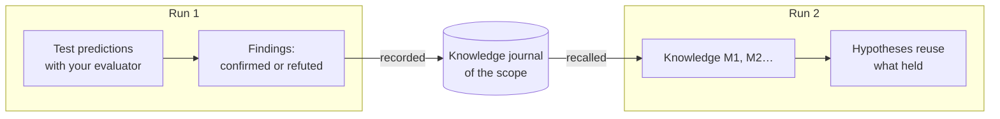

# Memory across runs

::: tip In plain words
Think of a lab notebook shared by everyone who works on the same bench. Each time an experiment confirms or refutes a rule, it is written down with what was expected and what was seen. The next person reads the notebook before starting: they reuse what held, and they do not try again, as it was, what already failed.

A cognitive agent can keep such a notebook. It only writes down **what a real test answered**, never what the model or the thinker merely believed.
:::

## What it does



1. **At the end of a run**, every rule or explanation with at least one prediction your [outcome evaluator](./evidence-and-verification#predictions-and-the-outcome-evaluator) confirmed or refuted becomes a **finding**: the statement, its scope, the rule it revises, and each test (what was expected, what was observed, which evaluator). The findings are appended to the **journal** of the scope.
2. **At the start of the next run** in the same scope, the most relevant items are **recalled** and placed in the mental state as `knowledge`, with ids `M1`, `M2`…
3. **During the run**:
   - the model sees each item with its status and its latest tests, and is told to reuse a verified rule within its scope, citing it;
   - a hypothesis that restates a **refuted** item, with the same scope, is refused by the engine: only a variant that explains the refutation can come back;
   - a hypothesis that restates a **verified** item is linked to it automatically, so the comparison step sees the earlier tests.

## Turn it on

```ts
import { FileKnowledgeStore } from '@sdk-ai-agents/core';

const physicist = sdk.createCognitiveAgent({
  name: 'physicist',
  model: 'gpt-4o',
  evaluator: bench,   // without an evaluator, nothing is tested, so nothing is remembered
  knowledge: {
    store: new FileKnowledgeStore('./knowledge'),
    scope: 'inclined-plane',
  },
});

const first = await physicist.think({ problem: 'Does the rolling time depend on the ball?', observations });
const second = await physicist.think({ problem: 'Will a 250 g glass ball take as long as a steel one?' });

second.state.knowledge;
// [{ id: 'M1', status: 'refuted',  statement: 'Rolling time on this plane does not depend on the ball', … },
//  { id: 'M2', status: 'verified', statement: 'For rigid balls, rolling time on this plane does not depend on mass', … }]
```

| Option | Default | Meaning |
| --- | --- | --- |
| `store` | (required) | Where the journal is kept: `FileKnowledgeStore`, `InMemoryKnowledgeStore` or your own |
| `scope` | (required) | What the knowledge is about. Runs share what they learned only within a scope. Letters, digits, `.`, `-`, `_` |
| `recallLimit` | `10` | Items recalled at the start of a run, from 0 to 50. `0` records without recalling |
| `record` | `true` | Whether runs record what their tests established |

`examples/rule-discovery.ts` uses it: run it twice, and the second run starts with what the first one established.

## What is remembered, and what never is

| Remembered | Never remembered |
| --- | --- |
| Rules and explanations with a prediction your evaluator **confirmed** or **refuted** | Choices of action (proposals): they depend on who decides and when |
| What was expected, what was observed, which evaluator and version | Predictions that were never tested, or whose test was **inconclusive** |
| The rule a variant revises, and what changed | What the model believed, the support it gave, the thinker's preferences |
| Which runs recorded it | The final answer of the run |

A run that fails or is stopped still records the tests it ran: a measurement stays valid whatever happened next.

## Statuses

| Status | When | What the model is told |
| --- | --- | --- |
| `verified` | Only confirmations so far | Reuse it within its scope and cite it; outside that scope it is a hypothesis to test again |
| `refuted` | Only refutations so far | Never propose it again as it was; only a variant that explains the refutation |
| `contested` | Both confirmations and refutations | It holds only in some conditions: find which |

The same statement in the same scope is the same item, whatever its case or punctuation. Tests are deduplicated by run and prediction: recording the same run twice adds nothing.

## Which items are recalled

The items of the scope are ranked, deterministically:

1. the most words shared with the problem (words of four letters or more, in the statement and the scope);
2. then the most tested;
3. then the most recent.

The first `recallLimit` items are recalled. This is plain word matching, not semantic search: a rule worded very differently from the problem may not be recalled first. Keep scopes narrow (one bench, one product, one domain) so that everything in a scope is relevant.

## Scopes

A scope is a boundary, not a folder name for tidiness:

- runs **share** what they learned only within a scope;
- use one scope per bench, product, dataset or domain whose rules apply to each other: `inclined-plane`, `checkout-latency`, `churn-model-v3`;
- never mix clients or tenants in one scope if their data must stay apart.

## Stores

| Store | Use it for |
| --- | --- |
| `FileKnowledgeStore(directory)` | One file per scope, `<directory>/<scope>.jsonl`, one line per run. Lines are only appended, so the file is also a readable history. Writes are serialized within one process |
| `InMemoryKnowledgeStore()` | Tests, prototypes, short-lived processes |
| Your own `KnowledgeStore` | A database shared by several processes |

Several processes writing the same scope at once should use a database: implement the three methods of the port.

```ts
import type { KnowledgeStore } from '@sdk-ai-agents/core';

const store: KnowledgeStore = {
  async recall({ scope, goal, limit }) { /* the most relevant items of the scope */ },
  async record({ scope, runId, recordedAt, findings }) { /* append one entry */ },
  async list(scope) { /* every item of the scope */ },
};
```

`projectKnowledge(entries)` folds journal entries into items and `rankKnowledge(items, goal, limit)` ranks them, so a custom store only needs to keep the entries (for example one row per run) and reuse both.

Inspect what a scope knows at any time:

```ts
for (const item of await store.list('inclined-plane')) {
  console.log(item.status, item.confirmations, item.refutations, item.statement);
}
```

## Audit and replay

- The recalled items are recorded in `cognition.started` (`knowledge.scope`, `knowledge.items`), so `sdk.getMentalState(runId)` rebuilds exactly what the run knew, without reading the store again, even if the store changed since.
- The findings are recorded in a `cognition.knowledge_recorded` event (`scope`, `findings`).
- A store that fails never stops a run: a failed recall is recorded as `knowledge.error` in `cognition.started` and the run goes on without memory; a failed recording is recorded as `error` in `cognition.knowledge_recorded`.

## Limits

- **Word matching.** Recall is not semantic; related rules worded differently can be missed.
- **Exact restatements only.** Only a restatement of a refuted rule with the same wording (case and punctuation aside) and the same scope is refused; a reworded one is accepted as a new hypothesis.
- **Scope is declared, not checked.** A rule verified for "rigid balls" is shown with that scope, and the model is told not to apply it elsewhere without a new test; nothing verifies it in code.
- **The evaluator is trusted.** Memory is as reliable as your evaluator: a wrong measurement is remembered as a test.
- **One process per file.** `FileKnowledgeStore` serializes writes within a process only.
