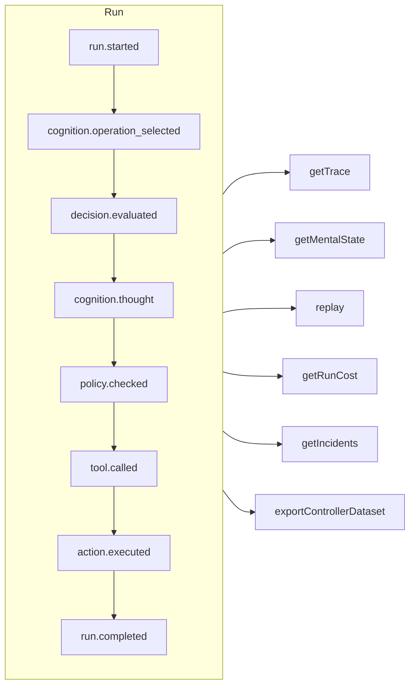

# Traceability & replay

Every run — governed, cognitive, a direct typed decision or an MCP tool call — is an **append-only event log**. Nothing happens off the record, and everything else is derived from it.



## Stores

| Store | Use it for |
| --- | --- |
| `FileEventStore` (default) | Development, single process — one JSON file per run |
| `SQLiteEventStore` | Local persistence with queries |
| `PostgreSQLEventStore` | Production: indexed queries, aggregation, backup and restore |

::: code-group

```ts [File]
import { createSDK, FileEventStore } from '@sdk-ai-agents/core';

const sdk = createSDK({ apiKey, eventStore: new FileEventStore('./events') });
```

```ts [SQLite]
import Database from 'better-sqlite3';
import { createSDK, SQLiteEventStore } from '@sdk-ai-agents/core';

const sdk = createSDK({ apiKey, eventStore: new SQLiteEventStore({ db: new Database('events.db') }) });
```

```ts [PostgreSQL]
import pg from 'pg';
import { createSDK, PostgreSQLEventStore } from '@sdk-ai-agents/core';

const pool = new pg.Pool({ connectionString: process.env.DATABASE_URL });
const sdk = createSDK({ apiKey, eventStore: new PostgreSQLEventStore({ pool }) });
```

:::

Stores implement `IEventStore`; write your own to target any database. The file store buffers events and flushes them every 100 ms; call `await store.destroy()` at shutdown to write what is pending. Readers of the log (mental state rebuild, costs, datasets) ignore events repeated with the same id.

## Read a run

```ts
const trace = await sdk.getTrace(runId);          // status, timeline, summary
const text = await sdk.exportTrace(runId, 'text'); // human-readable timeline
const events = await sdk.getEvents(runId, { type: ['tool.called', 'policy.violated'] });
const state = await sdk.getMentalState(runId);    // cognitive runs
```

A run's status is the **last lifecycle event** (`run.completed`, `run.failed`, `run.cancelled`). Events appended afterwards — feedback, incident reports — never reopen it.

## Live progress

Events also reach your code **while the run is in progress**, once the store has accepted them: to show progress in an interface, stream it to a client or feed a dashboard. MCP clients get them as [progress notifications](./mcp-deploy#progress-notifications).

```ts
const result = await agent.run({
  message: 'Refund order 1234',
  onEvent: (event) => console.log(event.type),
});

const answer = await cognitiveAgent.think({ problem, onEvent: (event) => socket.send(JSON.stringify(event)) });
const replay = await sdk.replay(runId, undefined, { onEvent: (event) => console.log(event.type) });

// Every run of the SDK, for as long as you listen
const unsubscribe = sdk.subscribe((event) => dashboard.push(event), { types: ['run.failed', 'approval.requested'] });
unsubscribe();
```

| Where | What the listener receives |
| --- | --- |
| `run({ onEvent })`, `think({ onEvent })`, `study.run({ onEvent })` | Every event of that run |
| `replay(runId, modifications, { onEvent })` | Every event of the replay |
| `executeTool(name, params, { onEvent })` | The events of the call, and of the agent run its tool starts (`governedAgentTool`, `cognitiveAgentTool`), one level deep: not the runs that agent starts in turn |
| `sdk.subscribe(listener, { runId?, agentId?, types?, maxQueued? })` | Every event of every run that matches the filter, until you call the function it returns |

What is guaranteed:

- **Only what the store accepted.** A listener is called once the store's `append` has succeeded, never for an event the store refused. With the SQL stores the row is committed; with the file store the event is in its buffer: `getEvents` returns it at once, and it reaches the disk within 100 ms (a crash in between loses it).
- **In order.** The events of a run arrive in the order they were recorded; the events of different runs interleave.
- **One event at a time, and the run never waits.** When your listener returns a promise, its next event waits until that promise settles, so an async listener cannot reorder events. The run goes on meanwhile: a slow listener falls behind, it does not slow the agent down. A synchronous listener is called before the event's `append` returns: keep it quick.
- **The call waits for the listener, until the run is interrupted.** Once the run is over, `run()`, `think()`, `replay()` and `executeTool()` wait until their `onEvent` has settled on every event, so when they return you have seen everything. The wait ends early when the run was stopped or cancelled, or when its `signal` aborts (the caller gives up); for a cognitive run, `limits.timeoutMs` counts the wait too. The listener is then unsubscribed: the events it has not received yet are dropped. A replay cannot be cancelled, so it always waits. Otherwise a promise that never settles keeps the call from returning: for fire-and-forget work, do not return the promise (`onEvent: (event) => { void save(event); }`).
- **A bounded queue.** At most `maxQueued` events (10 000 by default) wait for a listener still busy with an earlier one; past that, new events are dropped for this listener. The drop is reported once the listener catches up, with a `LiveEventsDroppedError` saying how many events were dropped.
- **Errors stay out of the run.** A listener that throws or rejects is reported on standard error (`console.error`) and still gets the next events; so are dropped events. To handle errors yourself, catch them in the listener; to handle errors and dropped events alike, create the SDK with `eventStore: new ObservedEventStore(store, { onListenerError })`.
- **A copy.** Each listener gets its own copy of the event, as the store reads it back: changing it changes nothing in the log.
- **Unsubscribing is immediate.** After the function returned by `sdk.subscribe` is called, the listener is not called again, not even for events already waiting; it can be called from inside the listener.

The `agentId` filter matches the `metadata.agentId` of each event: a few events carry no agent (`provider.retry`, the end of a replay, the `decision.evaluated` of a `sdk.decisions` call made without `agentId`), filter by run to get them. Restored backups are not delivered. The incident reports of `incidents` are delivered; with a `MonitoredEventStore` you build yourself, build it on an `ObservedEventStore` (`new MonitoredEventStore(new ObservedEventStore(store), options)`), or its reports are recorded but not delivered live. For an agent assembled by hand on your own store (`new AgentImpl(…)`), wrap the store in an `ObservedEventStore` to use `onEvent`; `createSDK` does it for you. Behind an agent tool, an agent whose store is not wrapped runs without the caller's listener instead of failing.

## Replay without the LLM

```ts
const replay = await sdk.replay(runId);
```

Replay re-executes the recorded intentions through the action engine — policies included — **without calling the LLM**. Replay with modifications to test "what if" scenarios, for example after changing a policy.

A replay runs the tools again, for real. For tools marked `requiresApproval`, a replay repeats only the calls a human **approved** in the original run — the same tool with the same parameters — without asking again; a call that was rejected, cancelled or never approved is refused, not run. Approvals required by a *policy* still apply and wait for a decision.

## Understand decisions

| Method | What you get |
| --- | --- |
| `getReasoningGraph(runId)` / `exportReasoningGraph(runId, 'graphviz')` | The chain intention → policy → action as a graph |
| `getAlternatives(runId)` | Alternatives the agent considered |
| `getDecisionPatterns(filters)` | Recurring decision patterns across runs |
| `getTraceVisualization(runId)` | Grouped, timeline-ready structure for a UI |
| `getPolicyAuditTrail(runId)` | Every policy evaluation and its result |

## Test agents like code

Turn a good run into a **golden trace**, then validate new runs against it:

```ts
const golden = await sdk.createGoldenTrace(runId, { name: 'refund flow', description: 'Expected behavior' });
const validation = await sdk.validateAgainstGoldenTrace(newRunId, golden.id);
const regressions = await sdk.detectRegressions(newRunId, golden.id);
```

Runs are compared by what their events mean — type, order, tool, parameters, results — never by event ids, which are new in every run; times, token counts and the other values the SDK writes that change from one run to the next are left out too, but a tool's own parameters and results are always compared, whatever their keys. A run that does the same thing again passes; a tool called with other arguments is reported where it happened.

### Regression suites in CI

Group golden traces in a suite once, then run it in CI:

```ts
// Once, after recording the good runs
await sdk.createRegressionTestSuite('support-agent', {
  name: 'refunds',
  goldenTraces: [{ goldenTraceId: golden.id, name: 'refund flow' }],
});

// In CI: the same agent, created again
sdk.createAgent({ name: 'support-agent', model: 'gpt-4o', tools });
const { results, exitCode } = await sdk.runRegressionTestsForCI('support-agent', {
  detection: { tolerance: { ignoreEventTypes: ['intention.generated'], ignoreDataFields: ['output'] } },
});
await sdk.exportTestResults(results, 'junit', { outputPath: 'regressions.xml' });
process.exitCode = exitCode;
```

A suite knows its agent by **name**, since agent ids are new in every process. Every suite of the agent runs, oldest first: each test sends the golden run's input to the agent and compares the new run with the golden trace. The exit code is 0 when every test passed, 1 when one found a regression, 2 when one could not run. A real model words its answers differently from one run to the next: the `detection` above leaves the model's text and the final answer out, and still checks every tool call with its arguments.

Assertions on a run's events, the comparison of two runs, the impact of a new version of an agent and queries across runs are in the [SDK API](../reference/sdk-api#assertions).
