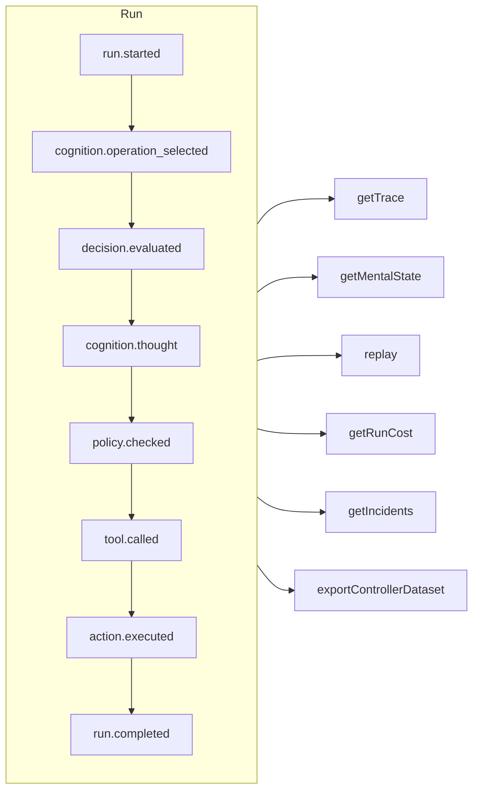

# Traceability & replay

Every run — governed, cognitive, a direct typed decision or an MCP tool call — is an **append-only event log**. Nothing happens off the record, and everything else is derived from it.



## Stores

| Store | Use it for |
| --- | --- |
| `FileEventStore` (default) | Development, single process — one JSON file per run |
| `SQLiteEventStore` | Local persistence with queries |
| `PostgreSQLEventStore` | Production: indexed queries, aggregation, backup and restore |

::: code-group

```ts [File]
import { createSDK, FileEventStore } from '@sdk-ai-agents/core';

const sdk = createSDK({ apiKey, eventStore: new FileEventStore('./events') });
```

```ts [SQLite]
import Database from 'better-sqlite3';
import { createSDK, SQLiteEventStore } from '@sdk-ai-agents/core';

const sdk = createSDK({ apiKey, eventStore: new SQLiteEventStore({ db: new Database('events.db') }) });
```

```ts [PostgreSQL]
import pg from 'pg';
import { createSDK, PostgreSQLEventStore } from '@sdk-ai-agents/core';

const pool = new pg.Pool({ connectionString: process.env.DATABASE_URL });
const sdk = createSDK({ apiKey, eventStore: new PostgreSQLEventStore({ pool }) });
```

:::

Stores implement `IEventStore`; write your own to target any database. The file store buffers events and flushes them every 100 ms; call `await store.destroy()` at shutdown to write what is pending. Readers of the log (mental state rebuild, costs, datasets) ignore events repeated with the same id.

## Read a run

```ts
const trace = await sdk.getTrace(runId);          // status, timeline, summary
const text = await sdk.exportTrace(runId, 'text'); // human-readable timeline
const events = await sdk.getEvents(runId, { type: ['tool.called', 'policy.violated'] });
const state = await sdk.getMentalState(runId);    // cognitive runs
```

A run's status is the **last lifecycle event** (`run.completed`, `run.failed`, `run.cancelled`). Events appended afterwards — feedback, incident reports — never reopen it.

## Replay without the LLM

```ts
const replay = await sdk.replay(runId);
```

Replay re-executes the recorded intentions through the action engine — policies included — **without calling the LLM**. Replay with modifications to test "what if" scenarios, for example after changing a policy.

A replay runs the tools again, for real. Tools marked `requiresApproval` are **not** asked again: whoever starts a replay decides to re-run its actions. Approvals required by a *policy* still apply and wait for a decision.

## Understand decisions

| Method | What you get |
| --- | --- |
| `getReasoningGraph(runId)` / `exportReasoningGraph(runId, 'graphviz')` | The chain intention → policy → action as a graph |
| `getAlternatives(runId)` | Alternatives the agent considered |
| `getDecisionPatterns(filters)` | Recurring decision patterns across runs |
| `getTraceVisualization(runId)` | Grouped, timeline-ready structure for a UI |
| `getPolicyAuditTrail(runId)` | Every policy evaluation and its result |

## Test agents like code

Turn a good run into a **golden trace**, then validate new runs against it:

```ts
const golden = await sdk.createGoldenTrace(runId, { name: 'refund flow', description: 'Expected behavior' });
const validation = await sdk.validateAgainstGoldenTrace(newRunId, golden.id);
const regressions = await sdk.detectRegressions(newRunId, golden.id);
```

Regression suites, behavioral assertions, run comparison and impact analysis before deployment are available too — see the [SDK API](../reference/sdk-api).
