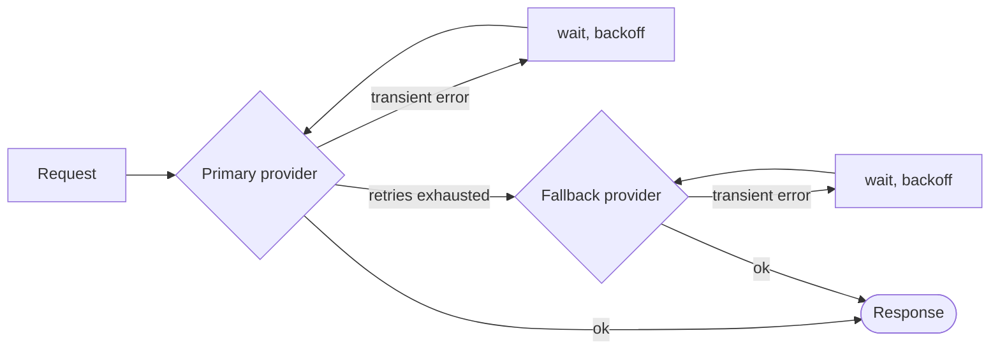

# Retries & fallback

Networks fail, providers get rate-limited, tools time out. The SDK retries what can be retried, fails over what cannot, and **writes every retry in the run** so nothing is hidden.



## LLM providers

A retry policy applies to each provider **individually, before any fallback**:

```ts
const sdk = createSDK({
  apiKey: process.env.OPENAI_API_KEY,
  fallbackProviders: [{ provider: 'anthropic', config: { apiKey: process.env.ANTHROPIC_API_KEY } }],
  retry: { maxRetries: 3, initialDelayMs: 500, maxDelayMs: 8_000 },
});
```

A fallback of another vendor needs its own key, in its `config` or in `providerConfig`: the primary key is never sent to another vendor. It gets the agent's model only if it serves it, and otherwise its own `defaultModel`, `gpt-5.4` for OpenAI and `claude-opus-5` for Anthropic unless set (Anthropic refuses an OpenAI model name, and the other way round). The `intention.generated` event names the provider that answered and the model it used.

| Option | Default | |
| --- | --- | --- |
| `maxRetries` | `2` | Retries after the first attempt |
| `initialDelayMs` | `500` | Doubled at each retry (`multiplier`) |
| `maxDelayMs` | `8000` | Upper bound for one backoff wait |
| `maxRetryAfterMs` | `60000` | Longest `retry-after` honored (`maxDelayMs` when a fallback exists) |
| `jitter` | `true` | Randomizes each wait in [delay/2, delay] |
| `retryOn` | `isTransientError` | Your own predicate |

Only **transient** errors are retried: 408, 409, 425, 429, 5xx, 529, connection failures and timeouts — including the OpenAI and Anthropic connection errors, recognized by class and by the network code on their `cause`. Authentication, validation and policy errors fail immediately, and so does a 429 that means the account is out of credit or quota (`insufficient_quota`, `credit_balance_exhausted`…): waiting would not bring credit back. The error message carries the vendor's explanation. When the provider sends `retry-after-ms` or `retry-after`, the SDK waits that long instead of its own backoff, up to `maxRetryAfterMs` (60 s by default). When `fallbackProviders` are configured, that bound is lowered to `maxDelayMs`: a provider asking for a long pause is left for the fallback instead of blocking the run. A longer request ends the retries.

When the SDK policy is active, the OpenAI and Anthropic clients' own retries are disabled — **retries never stack**. Each retry is recorded as a `provider.retry` event with the provider, model, attempt, delay and error. Pass `retry: false` to keep the vendor defaults instead.

A run that streams its text (`onText`) can see a model call fail after part of the answer arrived. An error the vendor sends in the middle of the stream counts as its HTTP counterpart: OpenAI's `server_error` (500) and Anthropic's `rate_limit_error` (429), `api_error` (500), `timeout_error` (504) and `overloaded_error` (529) are retried, other types are not. A connection that drops in the middle of the stream, a stream that ends before its answer is complete, and a stream that sends nothing for the client's timeout (10 minutes by default; `timeout` in `providerConfig`, in a fallback's `config` or in the options of `OpenAIProvider` and `AnthropicProvider`) are connection failures. Before the retry, or before the fallback provider, `onTextRestart` tells the caller to drop the text the failed attempt had streamed: the next attempt writes the answer again (see [Streaming the answer](./governed-agents#_7-streaming-the-answer)).

A provider you inject with `llmProvider` is used as given unless you set `retry` explicitly, and a `FallbackProvider` is never wrapped so its failovers stay visible in the trace. Its providers are not wrapped either, so `retry` does not apply to them: to retry one before failing over, wrap it in `RetryingLLMProvider` and give its client `maxRetries: 0`. Set the policy's `maxRetryAfterMs` to its `maxDelayMs`, as the SDK does when a fallback can take over, so that a provider asking for a long pause is left for the fallback. Those retries are not recorded as `provider.retry` events.

## Tools

Mark idempotent tools as retryable:

```ts
sdk.defineTool({
  name: 'lookup_metric',
  description: 'Reads a metric',
  schema: z.object({ metric: z.string() }),
  retry: { maxRetries: 2, initialDelayMs: 200 },
  handler: async ({ metric }) => warehouse.read(metric),
});
```

Only tool failures are retried — never a policy denial or a validation error. Each retry is a `tool.retry` event.

## Typed decisions

The Jev client retries 408, 429, 5xx and 529 responses and network errors, **honoring `retry-after`**, with the SDK retry policy as default (`jev.maxRetries` overrides it). Unlike the LLM providers, it retries every 429, whatever its cause, up to `maxRetries`.

## Anywhere else

`withRetry` is exported for your own code:

```ts
import { withRetry, DEFAULT_RETRY_POLICY } from '@sdk-ai-agents/core';

const data = await withRetry(() => fetchPartnerFeed(), DEFAULT_RETRY_POLICY, {
  onRetry: ({ retry, delayMs, error }) => logger.warn({ retry, delayMs, error }),
});
```
