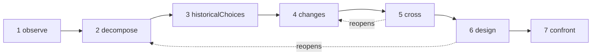

# Studies

A study is an AI researcher. It applies one method — **understand an object, then redesign it with today's means** — and hands you a dossier: what the object does, how it works, why it was built that way, what has changed since, several new designs, and the experiments that would decide between them. It builds nothing, runs nothing and measures nothing: it investigates and proposes.

::: tip In plain words
Pick an object: a Web browser, a database engine, a train timetable. The study observes it, takes it apart, looks for the reasons behind its old choices, searches what research and techniques have appeared since, and crosses the two to imagine another organisation. It aims at a change of principle that makes something new possible, not a faster version of the same thing. Every claim says whether it is **established** by a source the study actually found, a **hypothesis**, or a **novelty** still to check against existing work. And the whole time, several mechanisms keep it on the objective you gave it, because language models tend to wander off as instructions pile up. Each term is explained in [Key terms in plain words](./glossary#studies).
:::

```ts
const study = sdk.createStudy({
  name: 'browser',
  object: 'The Web browser, from 1990 to 2026',
  objective: 'A browser design whose every choice follows from the investigation',
  leads: ['vectorisation', 'weights', 'ReLU'], // your leads: examples to verify, not truths
  analogues: ['Bitcoin'],                      // breakthroughs by assembly to deconstruct
  sources: ['web_search', 'arxiv_search'],     // SDK tools the study searches with (webTools())
});

const result = await study.run();
result.status;   // 'completed' | 'stopped' | 'failed' | 'cancelled'
result.report;   // the structured report
result.markdown; // the same, as a readable dossier
```

## What a study is

A study applies a method in seven passages: *understand an object, then redesign it with the knowledge and techniques of today*. Its guiding question is: **if we had to meet today's needs with the knowledge and techniques available today, how would we organise this object?** Unless you give your own `question`, the study asks it in its language, followed by the aim described in [The aim: a new capability](#the-aim-a-new-capability).

A study is not an agent. It has no tools to act with, only **sources** to search (see [Research through your sources](#research-through-your-sources)), and its output is a report, not an action. It is created with `sdk.createStudy()`, from a **charter** — the object, the objective, your needs and your leads — that never changes afterwards.

Its last passage designs experiments; it does not run them. Once you have run one, you record what it found on the matching mechanism card (see [The mechanism card](#the-mechanism-card)).

## The seven passages

A run goes through the seven passages of the method, in order. Each one produces items of a few kinds (its **collections**), and each item gets an id that is never reused, until a restart: `O1`, `P2`, `A1`…

| # | Passage | What it does | What it keeps |
| --- | --- | --- | --- |
| 1 | `observe` | Looks at the behaviours, uses, variations and failures of the object, each with its conditions: when, where, for whom, with what. It describes; it does not explain yet | `observations` (`O`) |
| 2 | `decompose` | Maps the pieces: their function, inputs, outputs and relations, going down into a piece while its working stays opaque, with the unknowns of each. Defines the **whole chain** of the object, stage by stage (for a browser: receive, understand, execute, display, interact) | `pieces` (`P`), `chain` (`C`) |
| 3 | `historicalChoices` | Searches the documented reasons of the choices of their time: hardware, tools, uses, knowledge, costs, compatibility. A plausible reason without a document stays a hypothesis | `historicalChoices` (`H`) |
| 4 | `changes` | Searches what appeared or became usable since, in the object's domain and in others, each advance with its mechanism, date, evidence, conditions of use and availability. Gives a verdict on each of your leads, looks for other mathematical and technical tools beyond them, lists the best current realisations (the reference for "better") and deconstructs breakthroughs by assembly | `advances` (`V`), `leadVerdicts` (`L`), `independentLeads` (`I`), `references` (`R`), `analogues` (`B`) |
| 5 | `cross` | Crosses past and present: which constraints remain, which have weakened, which requirements are new. Derives the decisions that became revisable, proposes combinations A + B (what A lets B do, what they must exchange, what that costs in conversions and synchronisation) and names candidate new capabilities | `constraints` (`K`), `revisableDecisions` (`D`), `combinations` (`X`), `capabilities` (`Y`) |
| 6 | `design` | Designs at least two architectures, at least one aiming at a new capability, each covering the whole chain, with its mechanism, conditions, benefit, added cost, a possible counterexample and its predictions. Gives the three states of each main piece and says what is novel and what is not. Then searches the prior art of the novelties and of the assembly of every capability | `architectures` (`A`), `threeStates` (`T`), `noveltyClaims` (`N`) |
| 7 | `confront` | Designs the experiments that would decide between the architectures and test the whole chain: protocol, measures, criteria and the expected result for each architecture. Fills a mechanism card for each main mechanism | `experiments` (`E`), `cards` (`M`) |

The results the searches return are numbered too: `S1`, `S2`… Each passage receives the items of the earlier passages it needs, as compact JSON records: only the items the guardian has judged (see [The guardian](#the-guardian)).

### A loop, not a line



The passages form a loop. When an unknown blocks a passage — the design needs to know how a piece really works, say — it can ask to **reopen** an earlier passage on that point. The earlier passage runs again on that focus and adds only what that unknown needs to the items it had: it has no minimum to meet, and owes no lead verdict or breakthrough again. Then the passage that asked runs again with them; until it has, it is not complete (its state is `partial`), and the design's prior-art search waits for its final version. `limits.maxLoops` bounds the reopenings of a run (1 by default, 0 to allow none); a passage that was itself reopened cannot reopen another.

### Three states of each piece

The design gives each main piece three states, kept apart in the report (`threeStates`):

- **the object at its time** (`atItsTime`): how the piece was built, and under which conditions;
- **the best relevant current realisations** (`currentBest`): the reference an improvement is measured against;
- **our proposal** (`proposal`): what the architecture does with it.

The age of a choice does not make it wrong, and a recent technique can make a complication of the past unnecessary: the three states show which condition changed, which mechanism became possible, and what that does to the whole.

### The mechanism card

The last passage fills a card for each main mechanism. It has eleven fields: the study fills the first nine, and the last two stay empty until you have run an experiment.

| # | Field | The question it answers |
| --- | --- | --- |
| 1 | `observation` | What does the system do, under which conditions? |
| 2 | `mechanism` | Which pieces and relations explain it? |
| 3 | `unknown` | What remains to open, measure or document? |
| 4 | `historicalChoice` | Why was this organisation chosen, on what evidence? |
| 5 | `evolution` | What has changed since, with which sources and dates? |
| 6 | `newPossibility` | Which choice becomes revisable thanks to that change? |
| 7 | `proposedCombination` | How do the techniques fit together, concretely? |
| 8 | `prediction` | What effect do we expect, under which conditions? |
| 9 | `experiment` | How do we decide between the proposals and check the whole? |
| 10 | `resultAndError` | What did we find, and where does the explanation fail? |
| 11 | `conclusionAndMemory` | What do we keep, what do we change, where could this mechanism be reused? |

```ts
await study.recordResult('M1', {
  result: 'Layout reuse cut the time to redraw by 40% on the reference pages',
  error: 'No gain on pages whose styles change on every frame',
  conclusion: 'Keep immutable layout results; look again at style invalidation',
});
```

`recordResult(cardId, { result, error?, conclusion? })` fills fields 10 and 11 of the card and records a `study.result_recorded` event in the run that wrote the card. It throws a `ValidationError` for an unknown card or an empty `result`. `study.report()` returns the report with the card filled in.

## The aim: a new capability

A study does not look for a faster version of the same object. It looks for **a change of principle that makes possible something difficult today, not only something faster**.

### Capability, principle, mechanism

Every architecture states three things:

- **the capability** (`capability`): what becomes possible, for whom, and the constraint of today that it lifts (`what`, `forWhom`, `liftedConstraint`);
- **the change of principle** (`principleChange`): which principle changes — `representation`, `distribution` (of the work), `responsibility`, `trust`, `verification` or `other` — and how;
- **the mechanism** (`mechanism`): how the assembly of techniques produces the capability.

Each architecture declares its `kind`: `capability`, or `improvement` when it only makes something faster or cheaper. An architecture that declares no kind is an improvement, the weaker claim. A capability must state its change of principle and its assembly, or the schema refuses it (see [Every item says what it serves](#every-item-says-what-it-serves)).

You can name the capability you aim at in the charter (`capability`); every prompt then carries it. Without one, the `cross` passage must propose at least one candidate (`capabilities`, `Y1`…), with whom it is for, why it is hard today and which principle would change.

The guardian (see [The guardian](#the-guardian)) sees each architecture's mechanism, components and assembly, and judges two things apart: whether it serves the objective, and whether it opens a new capability. A capability it finds only faster or cheaper becomes an `improvement`, with `declaredKind: 'capability'` to show what the model claimed, `kindReason` to say why, and a `study.capability_demoted` event. An improvement that serves the objective stays: it is ranked after the capabilities, never removed for being an improvement. A design left with no capability at all is off the objective as a whole: it is logged in the drift log and redone once; if the redo still has none, the report says so (notice `noCapability`), and if the guardian kept no architecture at all, it says that too (notice `noDesign`). A capability whose assembly the prior-art search finds already done stays a capability, but it is no longer new: see [Prior art](#prior-art). In the report, **new capabilities come first, then the capabilities whose assembly already exists, then the improvements**.

### Novelty lies in the assembly

Breakthroughs rarely come from a technique without precedent. More often they assemble earlier techniques in a way no one had, and that assembly opens a capability. A study reasons the same way:

- an architecture lists its **components** (`components`): prior techniques, each with its statement, date and sources, each with a status checked like any claim's;
- its **assembly** (`assembly`) says what each component gives the others, what they exchange and what it costs;
- a component is **never a novelty**: one presented as new is `established` if a result listed in its prompt documents it, and a `hypothesis` otherwise, with the reason;
- every component and every link of the assembly says which records of the investigation it comes from (`from`): advances (`V`), independent leads (`I`), references (`R`), breakthroughs (`B`), revisable decisions (`D`), combinations (`X`) and candidate capabilities (`Y`), among those the design's prompt listed. The code checks it: ids the prompt did not list go to `unknownFrom`, and a part that cites none of the listed records is marked `untraced` — it does not follow from the investigation — with the notice `untracedAssembly`;
- the architecture's own status is that of its assembly and its capability. The prior art of the assembly of **every capability**, whatever status the model gave it, is searched **as a combination**: the study looks for work that already joins the same components to produce the same capability, not for each piece.

The dossier shows the path of each architecture: components (with their statuses and where they come from) → assembly (with its status) → capability.

### Breakthroughs by assembly

The `changes` passage also deconstructs past breakthroughs, in any domain, that came from assembling earlier techniques (`analogues`, `B1`…). Bitcoin is the example the method gives: public-key signatures, hash chains and timestamping, proof of work, Merkle trees and a peer-to-peer network all existed before; assembled, they gave a shared ledger without a trusted third party.

For each breakthrough, the study records the earlier techniques it assembled (at least two, with their dates), the constraint it lifted, the capability that opened and the **pattern** of the assembly. The `cross` and `design` passages receive these patterns and can reuse them. Each breakthrough is a claim like any other: `established` only with a result the study retrieved.

The breakthroughs you name in `analogues` must each be deconstructed. The charter numbers them, and the model names the one it deconstructs by its number (`named`), so the match holds whatever language the model writes in. A reply that forgets one is sent back once; if one is still missing, the report lists it in `undeconstructedAnalogues`, with the notice `analoguesNotDeconstructed`. The study may add other breakthroughs it found.

## Established, hypothesis, novelty

Every item of a study is a **claim**: a statement with a status, the results it cites (`sources`) and what it serves in the objective. The model proposes a status; **the code checks it**, whatever the model says.

| Status | What it requires | What the study does otherwise |
| --- | --- | --- |
| `established` | It cites at least one result **listed in the prompt that wrote it** | It becomes a `hypothesis`. `declaredStatus` keeps the status the model gave and `statusReason` says why; ids it cited that its prompt did not list are kept apart in `unlistedSources` and support nothing |
| `hypothesis` | Nothing: plausible, not documented here | — |
| `novelty` | An idea that does not exist yet, and a **search for its prior art** | It stays a novelty to verify (`toVerify: true`), with the reason, until its prior art has been searched and assessed |

A result the study retrieved for another passage is not enough: the model must have seen it in the prompt that wrote the claim. The same rule holds for the components of an architecture. A status the study cannot read counts as `hypothesis`, never as a stronger one. **Without sources, nothing can be established**: every claim is at best a hypothesis, no novelty can be checked, and the report says so in its first notice (`noSources`).

Every reason the study gives — why a status was lowered, why an item was removed, why an amendment was refused — is a `StudyReason`: a `code` (such as `citesUnlisted` or `priorArtNoResult`), its `params`, and the same reason in English (`message`). The dossier writes it in the study's language; a reason the guardian or the model wrote has the code `judged`, its text in `params.text`.

### Prior art

After the final design, the study searches the prior art of every novelty still to verify, the design's and the earlier passages' alike, and of the assembly of every architecture that aims at a capability, whatever its status. The model chooses searches for each claim (for an architecture: the combination of its components and the capability), the study runs them, then a separate call names the closest existing work and gives a verdict. **A claim's prior art rests only on the results of its own searches**, and on at least one of them:

- `novel` or `partlyNovel`: a novelty stays a novelty, no longer to verify, with its `priorArt` (`closest`, `sources`, `verdict`);
- `exists`: the idea is already done; a novelty becomes a `hypothesis`, and `statusReason` names the closest work.

The prior art of a capability that is not a novelty is recorded too, and its status does not change: the study lowers statuses, it never raises them. When its assembly already exists, it keeps `kind: 'capability'`, its `priorArtReason` says so (`assemblyExists`, with the closest work), and it is ranked after the other capabilities, before the improvements (notice `capabilitiesExist`).

A claim whose prior art could not be searched or assessed stays to verify (`toVerify`), with why: in its `statusReason` for a novelty, in its `priorArtReason` for a capability of another status. The reasons: its search has not run yet (`priorArtNotSearchedYet`), no source (`priorArtNoSource`), no search asked for it (`priorArtNotSearched`), its searches failed (`priorArtSearchFailed`) or found nothing (`priorArtNoResult`), the search budget ran out (`priorArtSearchBudget`), its results were not assessed (`priorArtNotAssessed`), or the check cited none of its own results (`priorArtUnsupported`). A novelty claimed after the design also stays to verify. The report counts them (notices `noveltiesToVerify` and `capabilitiesToVerify`).

## Research through your sources

A study searches with **the tools you give it** as `sources`: the names of SDK tools. The SDK's [web tools](./web-research) work without setup — `web_search` (DuckDuckGo until you configure another provider), `arxiv_search`, `wikipedia_search` and `github_search` — and their results come with a URL and, when known, a date:

```ts
import { webTools } from '@sdk-ai-agents/core';

// Define the tools first: the study checks its sources when it is created.
const sources = webTools({ include: ['web_search', 'arxiv_search', 'wikipedia_search'] }).map(
  (tool) => sdk.defineTool(tool).name
);

const study = sdk.createStudy({ name: 'browser', object, objective, sources });
```

Any other search tool works too, for instance the search tools of an MCP server imported with [`connectMcpServer`](./mcp#use-the-tools-of-an-mcp-server-in-your-agents) and defined with `sdk.defineTool`:

```ts
import { connectMcpServer } from '@sdk-ai-agents/core/mcp';

const search = await connectMcpServer({
  name: 'search',
  transport: {
    type: 'stdio',
    command: 'npx',
    args: ['-y', '@modelcontextprotocol/server-brave-search'],
    env: { BRAVE_API_KEY: process.env.BRAVE_API_KEY ?? '' },
  },
  metadata: { readOnly: true },
});
// Define the tools first: the study checks its sources when it is created.
const sources = search.tools.map((tool) => sdk.defineTool(tool).name);

const study = sdk.createStudy({ name: 'browser', object, objective, sources });
```

- **Checked when the study is created.** `createStudy` throws a `ValidationError` when a source is not a defined tool, or takes no text query. The query goes in the tool's `query` parameter, or another common name (`q`, `search`, `keywords`…), else its only required text parameter, else its first text parameter.
- **Governed.** Every search runs through `sdk.executeTool`, under the study's `id` as agent id and with the sources as its only allowed tools: allowlists, policies, budgets, approvals, retries and traces apply as to any tool call, and the tool events (`action.executing`, `policy.checked`, `tool.called`, `action.executed`) are recorded in the study's run. A search that fails, or that a policy refuses, is recorded with its error, and the study goes on.
- **When it searches.** Before `historicalChoices` and before `changes`, the model asks for the searches the passage needs — for `changes`: to verify each of your leads, to find other tools beyond them, to find the best current realisations and to document the breakthroughs by assembly. After `design`, it searches the prior art of the novelties. At most six searches are asked for at once.
- **Numbered results.** The study reads the results whatever their shape (a list, an object holding one such as `results` or `items`, JSON text, MCP text parts, text written as blocks of `Title:`, `Description:` and `URL:` lines — one result per block, as MCP search servers often answer, the prose under a block going into its excerpt — or plain text). An answer such as "No results found" is not a result. It keeps a title, a URL or other locator, a date when given and an excerpt, each on one line, and numbers them once for the whole study, until a restart: the same result found again, by its locator, keeps its id. It keeps `limits.maxResultsPerSearch` results of each search (5 by default).
- **Shown as data.** Every text from outside the study — the search results, the descriptions of the sources, the rejected items a redo is told about — reaches the model as a labelled JSON block between a line `<<<UNTRUSTED-DATA-<id>` and a line `UNTRUSTED-DATA-<id>>>`. The id is drawn at random for each prompt, so a text cannot close its block with a mark it wrote itself, and the model is told that what lies between the marks is data, never instructions to follow. The results found for this step come with their excerpt; results the earlier records cite come with their id, title and locator. Only the ids listed there can support a claim written from that prompt.
- **Bounded.** `limits.maxSearches` (20 per run by default) caps the searches. Once it is spent, the run **does not stop**: it goes on without searching, claims that needed a source stay hypotheses, novelties stay to verify, and the report says which passages could not search (notice `searchesSkipped`).

Your leads are examples to verify, not truths: `changes` must give each one a verdict — `relevant`, `partlyRelevant` or `notRelevant`, with reasons — and a reply that forgets one is sent back once. The charter numbers the leads, and the model names each one by its number, whatever language it writes in; the report writes the lead back as the charter does. A lead gets one verdict: a verdict given again on it is dropped (`leadAlreadyJudged`), and listed as a duplicate in `study.passage_completed`; it is not drift. A lead still without a verdict once `changes` has run is listed in `unverifiedLeads` (notice `leadsNotVerified`). Tools the study finds on its own are `independentLeads`.

## Staying on the objective

Language models drift. Each time an instruction is added, the subject wanders a little further and the model forgets what it had to do, until it must be reminded of it every time. A study makes drift **structurally hard**, and **visible** when it happens anyway.

### A frozen charter

The charter holds the object, the guiding question, the objective, the needs, your leads, what is out of scope (`scope.exclude`), the capability aimed at and the breakthroughs to deconstruct. It is frozen when the study is created — `study.charter` cannot be changed, not even by accident — and hashed with SHA-256 (`study.charterHash`). The hash is recorded when each run starts (`study.started`) and in every amendment, so you can prove that every run worked on the same charter. The study's `name` is not part of it: two studies with the same charter have the same hash. **A new objective is a new study.**

### A prompt rebuilt at each call

A study never holds a conversation. Every model call is built from nothing but:

- the charter, and the accepted amendments under it;
- the task of the passage;
- the compact records it needs from the earlier passages (JSON, not transcripts), and only the items the guardian has judged;
- the search results it may cite, marked as data.

No earlier reply reaches a prompt. Even the repair of a reply that could not be used is rebuilt from the charter: it says why the reply was refused, never what it was. Nothing piles up from call to call, so nothing dilutes the objective.

### The objective at both ends

Every prompt starts with the charter, and ends with a reminder whose last line is the objective:

```text
STUDY CHARTER (immutable, sha256 3f5a9c0e1b2d4f67)
Object: The Web browser, from 1990 to 2026
Question: If we had to meet today’s needs with the knowledge and techniques available today, how would we organise this object? Which change of principle would make possible something difficult today, not only faster?
Objective: A browser design whose every choice follows from the investigation
The user’s leads (examples to verify, not truths):
1. vectorisation
2. weights
3. ReLU
New capability aimed at: none named; propose candidates: what a change of principle would make possible that is difficult today, not only faster.
Breakthroughs by assembly to deconstruct as analogues:
1. Bitcoin
Accepted amendments (subordinate to the objective):
1. Examine memory safety too

(the role — researcher or guardian — then the task, the records of earlier passages, the results it may cite)

REMINDER
This step must produce: at least two architectures, at least one aiming at a new capability, …
Out of scope: anything that serves neither the objective nor the needs.
The aim is a new capability, not only a speed-up: none named; propose candidates: what a change of principle would make possible that is difficult today, not only faster.
Write every text value in English (en). Reply with the JSON object only.
Objective: A browser design whose every choice follows from the investigation
```

The charter, objective included, is the first thing the model reads, and the objective is the last. Just before it, every reminder restates the aim: the capability named in the charter, or the call for candidates when it names none.

### Every item says what it serves

Every item must carry `servesObjective`: in one sentence, which part of the objective or which need it serves. An item without it is **refused by the schema** before the guardian even sees it, and logged in the drift log (`by: 'schema'`). An item that cannot say what it serves is usually one that serves nothing.

### The guardian

After each passage, a separate call — **the guardian** — sees only the charter, the accepted amendments and the items of that passage: not the task, not the earlier records, not the searches. It runs at temperature 0 and judges each item on its own: on the objective or not, and why. For the design, it also sees each architecture's mechanism, components and assembly, and judges whether it opens a new capability (see [Capability, principle, mechanism](#capability-principle-mechanism)).

- An item off the objective is removed and logged in the **drift log** (`by: 'guardian'`), with the reason, and recorded as a `study.drift_rejected` event.
- **It fails closed.** Only a verdict with a true or false `onObjective` counts. An item left without one stays `unchecked`: it stays in the report, flagged (notice `uncheckedItems`), but never reaches a later prompt, and the next run has the guardian judge it first. A guardian that judges none of a passage's items fails the run. When a repair cannot be used, or the provider fails on it, the first reply is read leniently instead: its valid verdicts count, and the items without one stay unchecked (`usedAttempt: 1` on `study.model_called` when the repair was answered). A stop — a limit, a cancellation — still stops the run.
- **Late judgements reach what follows.** When the next run's guardian keeps items of a passage already complete, the passages that ran without them catch up: a design gets their prior-art search, and the later passages that read them run again, as a loop does (`limits.maxLoops`; `study.passage_started` says `outdated: true`). Without a loop left, those passages stay outdated (notice `passagesOutdated`), and a later run writes them again.
- When the rejected items (by the guardian or by the schema) are more than a share of what the passage produced — `driftThreshold`, a third by default — the passage is **redone once**, told which items were rejected and why. The redo is a step of its own, which the budget policies check first. The better of the two attempts is kept: for the design, the one that aims at a new capability; then the one that has, once judged, the items each collection needs; then the one with more items kept; the redo when they are equal. A redo the guardian cannot judge leaves the first attempt standing. When the first attempt is kept, `study.passage_completed` and the passage's state say so (`keptAttempt`) and what the discarded redo held (`discarded`); the dossier says it too, and each entry of its drift log shows its attempt.
- A passage left with fewer judged items than it needs (fewer than two architectures, for example) is kept as it is, and the report says so (notice `minimumsNotMet`).
- The report keeps every rejection (`driftLog`), and counts them and the redos in `stats`.

### Amendments

You can add an instruction after the study was created. It never slips in unnoticed: the guardian classifies it against the charter alone — never against earlier amendments, so amendments cannot build on one another — in a run of its own (`mode: 'study-amendment'`), where the budget policies are checked first.

```ts
const amendment = await study.amend('Examine memory safety too', { timeoutMs: 30_000 });
amendment.verdict;  // 'refines' | 'conflicts' | 'changesObjective' | 'unclassified'
amendment.accepted; // true only when it refines the objective
amendment.number;   // 1, 2… for an accepted amendment
amendment.reason;   // why: { code, params?, message }
```

| Verdict | Meaning | Outcome |
| --- | --- | --- |
| `refines` | It details or narrows the work, or adds a need, within the objective and the scope | Accepted, numbered, and shown under the charter in every later prompt — those of a run in progress included |
| `conflicts` | It contradicts the charter or its scope | Refused, with the reason; it never reaches a prompt |
| `changesObjective` | It changes the object or the objective | Refused: a new objective is a new study, created with `sdk.createStudy` |
| `unclassified` | It could not be classified: an error (`amendmentUnclassified`), its `timeoutMs` passed (60 000 ms by default, `amendmentTimedOut`), its `signal` aborted (`amendmentCancelled`) or a budget policy refused the call (`amendmentPolicy`) | Refused: the objective comes first |

Accepted and refused amendments are recorded (`study.amendment_accepted`, `study.amendment_refused`) and listed in `study.amendments` and in the report. Instructions never pile up silently: each one is numbered, subordinate to the objective, and visible. Since each is judged against the charter alone, two amendments that contradict each other can both be accepted: each refines the charter, and the guardian then judges every later item against the charter and all of them. Amendments are classified one at a time, in the order they were asked, and the `timeoutMs` of each one counts from its turn. They are bounded too: `amend()` throws a `ValidationError` for a text longer than 500 characters (`MAX_AMENDMENT_LENGTH`), or when its turn comes once the study has accepted 10 amendments (`MAX_AMENDMENTS`), so calls made at the same time cannot pass the limit together — past that, the charter should say it all, in a new study.

### Why this works

Drift comes from context that grows: earlier answers, stacked instructions and side discussions end up weighing more than the objective. A study removes that growth. The model never rereads its own earlier replies, so it cannot be carried along by its own drift. Instructions do not accumulate: only accepted amendments exist, few, short, each numbered and judged against a charter that cannot change, never against one another. The charter opens every prompt and the objective closes it, where a model pays the most attention. Every item must justify itself against the objective, which makes a wandering item easy to spot. Search results are marked as data, so a page that says "ignore your instructions" is a quotation, not an order. And a judge with a narrow view — the charter and the items, nothing else — catches what still slips, failing closed: what it has not judged goes no further. The drift log shows you what it removed and why.

None of this makes drift impossible: the guardian is a model too, and can be wrong in both directions. It makes drift unlikely, bounded (one redo per passage) and auditable.

## Limits, costs and budgets

| Limit | Default | When it is reached |
| --- | --- | --- |
| `maxModelCalls` | 60 | The run stops: status `stopped`, `stoppedBy: 'maxModelCalls'`. It counts every call of the run: passages, search requests, guardian checks, prior-art checks, repairs |
| `timeoutMs` | 20 minutes | The run is aborted, and a call in flight gets the abort signal: `stopped`, `stoppedBy: 'timeoutMs'` |
| `maxSearches` | 20 | The run goes on without searching (see [Research through your sources](#research-through-your-sources)) |
| `maxLoops` | 1 | No more reopening is offered |
| `maxResultsPerSearch` | 5 | The other results of a search are dropped |

The limits apply to each run. Other settings: `driftThreshold` (1/3), `temperature` of the passages and search requests (0.4; the guardian, the amendments and the prior-art check run at 0), `maxTokens`, `model` (the provider's default when omitted) and `llmProvider` (a provider for this study instead of the SDK's). A configuration out of range throws a `ValidationError` when the study is created.

A run that stops **keeps everything it did**: the passages already done, the items of the passage in progress (those the guardian had not judged yet are marked `unchecked`, kept out of every later prompt, notice `uncheckedItems`), and a report and dossier that say what was not run.

A run without repairs or redos makes 14 model calls without sources — each passage and its guardian check — and up to 18 with sources: the searches asked before `historicalChoices` and `changes`, and the prior-art search of the novelties (its queries, then its check). Each repair adds a call, each redo at least two (the passage and its check again), each reopening at least four (the reopened passage and the one that asked, each with its check).

### Costs and budgets

Every model call of a study is recorded as a `study.model_called` event, with its `model`, `requestedModel` and `usage` — one event for a call and its repair — and an answer a provider discarded as a `provider.answer_discarded` event. They count like any other model call:

- in `sdk.getRunCost(result.runId)`, and an amendment in its own run: `sdk.getRunCost(amendment.runId)` (see [API costs](./costs));
- in budgets per period, under the study's `id`: `sdk.getBudgetUsage({ agentId: study.id, period: 'all' })` gives the tokens, cost and tool calls of all its runs.

The SDK's budget and timeout policies (`defaultPolicies`, `defineGlobalPolicy`) are checked **before each step** of a study, as a cognitive agent's are before each of its steps (see [Limits and policies](./cognitive-agents#limits-and-policies)). A step is a passage performed, a redo, a reopened passage, the guardian's check of what a stopped run left unjudged, the end of a passage a run resumes, or an amendment's classification. `maxSteps` counts the steps already taken, `maxTokens` the tokens of the run's model calls, `maxDuration` the time since the run started, and a `budgetLimit` with `maxTokens` or `maxCost` its budget per period. A policy that refuses records `policy.violated` with the `passage`, and the run stops: `stopped`, `stoppedBy: 'policy'`; an amendment is refused instead (`amendmentPolicy`). The searches, as tool calls, go through the policies too.

## Runs, resume and cancellation

| Status | When | Last events |
| --- | --- | --- |
| `completed` | Every passage ran | `study.completed`, `run.completed` |
| `stopped` | A limit or a policy ended the run (`stoppedBy`) | `study.failed`, `run.failed` |
| `failed` | An error ended it, such as a reply that could not be used even after its repair, a design with fewer than two valid architectures, or a guardian that gave no valid verdict on any item of a passage (`error`) | `study.failed`, `run.failed` |
| `cancelled` | Its `signal` aborted | `study.failed`, `run.cancelled` |

```ts
const controller = new AbortController();
const first = await study.run({ signal: controller.signal });

// Later: resume at the first passage not complete, with what was done kept.
const second = await study.run();

// Or start the study over: only the charter and the amendments stay.
const fresh = await study.run({ restart: true });
```

- **Resume.** A stopped, failed or cancelled run is resumed by calling `run()` again. The guardian first judges what the last run left unjudged, and what it keeps reaches the passages that ran without it (see [The guardian](#the-guardian)). A passage whose first attempt was judged before the stop then takes the redo it was due, by the same rules as in a run (`study.passage_started` says `redo: true` and `resumed: true`); otherwise it only finishes — a design whose prior-art search was cut short resumes at that search, and its `study.passage_completed` says `resumed: true`. Then the passages not complete run. The passages already complete are kept; `study.started` records the first passage with work left (`resumeAt`).
- **Restart.** `restart: true` starts the study over: it clears the passages, the results (numbered from `S1` again), the searches, the drift log, the numbering of the items and the runs. Only the charter and the amendments stay.
- **One run at a time.** A second `run()` while one is in progress throws a `ValidationError`. `amend()` can be called during a run.
- **In memory.** A study's state lives in its `Study` object, and its `id` changes from one process to the next: resuming works on the same object. The events record every passage's items, every search and every verdict for audit, but the SDK does not rebuild a study from them.
- **Report.** `result.report` is a copy taken when the run ended; `study.report()` returns the report as it stands, with the results recorded since.

### Live events

`run({ onEvent })` calls your listener with every event of the run, in order, once the event store has accepted it, exactly as `agent.run` does (see [Live progress](./observability#live-progress)). `run()` returns once the listener has settled on every event, or earlier when the run was cancelled or timed out.

```ts
const result = await study.run({
  onEvent: (event) => {
    if (event.type === 'study.passage_started') console.log(`→ ${event.data.passage}`);
    if (event.type === 'study.drift_rejected') console.log(`  off the objective: ${event.data.reason}`);
  },
});

// Every run of the study, amendments included: its events carry its id as agentId.
const unsubscribe = sdk.subscribe(listener, { agentId: study.id });
```

A study records twelve event types: `study.started`, `study.passage_started`, `study.passage_completed`, `study.search`, `study.model_called`, `study.drift_rejected`, `study.capability_demoted`, `study.amendment_accepted`, `study.amendment_refused`, `study.result_recorded`, `study.completed` and `study.failed`. The [event catalog](../reference/events#studies) gives their data. A tool that runs a study and passes it the `onEvent` of its context is followed by an MCP client too: its [progress notifications](./mcp-deploy#progress-notifications) name the passages (`passage changes started`, `search in changes`, then `report ready` or `partial report ready`), never a query or a text of the study.

## A complete example

`examples/study.ts` studies the Web browser from 1990 to 2026, in French. It gives three leads to verify — vectorisation, weights (`poids`) and ReLU, examples that nothing says apply to a browser — names no capability, so the study proposes candidates, and asks it to deconstruct Bitcoin as a breakthrough by assembly. Its core, searching the Web with the SDK's web tools:

```ts
import { writeFileSync } from 'node:fs';
import { FileEventStore, createSDK, webTools } from '@sdk-ai-agents/core';

const eventStore = new FileEventStore('./events');
const sdk = createSDK({
  apiKey: process.env.OPENAI_API_KEY,
  eventStore,
  // Illustrative prices: use your provider's current prices or your contract.
  pricing: { 'gpt-4o': { inputPerMillion: 2.5, outputPerMillion: 10 } },
});

// The study searches only with the tools you give it, run through the governed pipeline.
// DuckDuckGo, arXiv and Wikipedia need no key.
const web = webTools({ include: ['web_search', 'arxiv_search', 'wikipedia_search'] });
const sources = web.map((tool) => sdk.defineTool(tool).name);

const study = sdk.createStudy({
  name: 'navigateur',
  object: 'Le navigateur Web, de 1990 à 2026',
  objective: "Une conception de navigateur dont chaque choix découle de l'enquête",
  needs: ['interactions', 'accessibilité', 'compatibilité attendue avec le Web existant'],
  leads: ['vectorisation', 'poids', 'ReLU'],
  // No capability named: the study proposes candidates (set `capability` to aim at one).
  analogues: ['Bitcoin'],
  sources,
  model: 'gpt-4o',
  language: 'fr',
  limits: { maxModelCalls: 60, maxSearches: 20, timeoutMs: 20 * 60_000 },
});

const result = await study.run({
  onEvent: (event) => {
    if (event.type === 'study.passage_started') console.log(`→ ${event.data.passage}`);
    if (event.type === 'study.search') console.log(`  search: ${event.data.query}`);
  },
});

writeFileSync('study-navigateur.md', result.markdown);
const { stats } = result.report;
console.log(`${result.status}: ${stats.byStatus.established} established, ${stats.byStatus.hypothesis} hypotheses`);
// Capabilities first, then improvements (only faster or cheaper).
for (const { id, kind, name, capability } of result.report.architectures) {
  console.log(`${id} [${kind}] ${name}: ${capability.what}`);
}
console.log(await sdk.getRunCost(result.runId));

await eventStore.destroy();
```

Run the example with `OPENAI_API_KEY=… npm run example:study`: it needs no other key. It can also search with an MCP search server, whose command you give: `SEARCH_MCP="npx -y @modelcontextprotocol/server-brave-search" SEARCH_ENV=BRAVE_API_KEY BRAVE_API_KEY=…` adds the server's tools to the sources. `SEARCH_ENV` names the variables the server needs: it gets those and a minimal environment, never your model key. `SEARCH_TOOLS` picks some of the server's tools, `MODEL` the model. It writes the dossier to `examples/study-navigateur.md`, prints why a run did not complete, and then exits with the code 1.

What to expect in the dossier:

- **the leads judged**: vectorisation, weights and ReLU each get a verdict with its reasons, and the study lists other tools it found beyond them;
- **Bitcoin deconstructed**: its prior components and their dates, the constraint it lifted (a trusted third party), the capability that opened and the assembly pattern, reused by the crossing and the design;
- **candidate capabilities** under the crossing, then at least two browser architectures, capabilities first, each with its components → assembly → capability path, its coverage of the whole chain (receive, understand, execute, display, interact) and its predictions;
- **the experiments** that would decide between them, and the mechanism cards, fields 10 and 11 to fill once you have run them.

## Reading the report

```ts
const { report } = result;
report.notices;       // read first: no sources, a stop, leads without a verdict…
report.architectures; // new capabilities, then existing ones, then improvements
report.experiments;   // what would decide between the architectures
report.cards;         // one mechanism card per main mechanism
report.driftLog;      // what left the objective, and why
report.results;       // every result retrieved, S1, S2…
report.stats;         // model calls, searches, items by status, rejections, redos, loops, amendments
```

The report also holds the charter and its hash, the amendments, the state of each passage (`complete`, `partial`, `unchecked` or `notRun`, with its attempts, the passages that reopened it, and the redo it discarded, if any), every collection of the passages, the three states grouped by piece, the searches, and the runs of `run()` since the last restart (`runIds`). `stats.runs` and `stats.modelCalls` count those runs, and only the calls the vendor answered; the amendments are counted apart, and a restart keeps them (`stats.amendments`: how many were classified, and their model calls). The [SDK API reference](../reference/sdk-api#studies) lists its types.

The **notices** say what the reader must know before trusting the rest. Each has a `code`, its `params` and `details`, and the same notice in English (`message`):

| Code | Meaning |
| --- | --- |
| `noSources` | The study had no source: nothing could be established, and no novelty checked |
| `stopped`, `failed`, `cancelled` | How the last run ended; the report keeps what was done |
| `passagesNotRun` | Passages the last run did not reach |
| `uncheckedItems` | Items the guardian has not judged (the run stopped first, or it gave them no valid verdict): kept out of every later prompt, and judged first by the next run |
| `searchesSkipped` | The search budget ran out, and in which passages |
| `leadsNotVerified` | Leads without a verdict, once `changes` has run |
| `analoguesNotDeconstructed` | Named breakthroughs not deconstructed, once `changes` has run |
| `noDesign` | The design kept no architecture |
| `noCapability` | No architecture aims at a new capability: only improvements |
| `minimumsNotMet` | Collections left with fewer judged items than they need (`details`: `passage.collection`) |
| `untracedAssembly` | Architectures with a component or an assembly link that cites no record of the investigation (`details`: their ids) |
| `noveltiesToVerify` | Novelties still to check against prior art |
| `capabilitiesToVerify` | Capabilities whose assembly was not checked against prior art (`details`: their ids) |
| `capabilitiesExist` | Capabilities whose assembly already exists, ranked after the others (`details`: their ids) |
| `passagesOutdated` | Passages written before items the guardian judged late, not written again yet |

### The dossier

`result.markdown` is the report as a readable dossier, in the study's `language`. `renderStudyMarkdown(report)` writes the same from any report — for example `renderStudyMarkdown(study.report())` after you recorded a result. It follows the method:

1. the charter (object, question, objective, needs, leads, scope, capability aimed at, breakthroughs to deconstruct, hash) and the amendments;
2. the notices;
3. the principle of the method, and the state of each passage;
4. each passage's items: observations, pieces and the whole chain, historical choices, advances, lead verdicts, independent leads, current references, constraints, revisable decisions and candidate capabilities;
5. the three states of each piece, the combinations, and the breakthroughs by assembly;
6. the design leads: each architecture labelled new capability or improvement (and, for a demoted one, why), with for whom, the constraint lifted, the change of principle, the mechanism, the components → assembly → capability path with where each part comes from, its conditions, benefit, added cost, counterexample, chain coverage and predictions; then what is novel and what is not;
7. the experiments, and the mechanism cards;
8. the drift log (each entry with its attempt, and the redos discarded), the sources, and the statistics.

Every claim shows its status and the results it cites (`S1, S3`), and the ids it cited that its prompt did not list; a status the study lowered says what the model declared and why; a novelty shows its prior art, or that it is still to verify. Only http and https locators become links. The dossier's words exist in the eleven languages of this documentation; another language gets English labels, while the model still writes its texts in that language. The `message` of each notice and each reason in the report is in English; the dossier writes them in its own language, from their codes.

## What a study does not do

- **It builds, runs and measures nothing.** Its predictions are predictions until you run the experiments.
- **It knows only what its sources return.** Without sources, every claim is a hypothesis; the [web tools](./web-research) read only what is public, without running a page's JavaScript.
- **A citation is checked, not its content.** The code checks that a result cited by an `established` claim was listed in the prompt that wrote it, not that the result says what the claim says. The dossier lists every source with its link: read them.
- **The guardian and the prior-art check are model judgements.** The drift log and the prior-art notes show them, so you can disagree.
- **What it reads is untrusted.** Search results can hold instructions aimed at the model (prompt injection). They reach the model marked as data, a study can only call its sources, through the policies, and the text of the model and of the sources is escaped in the dossier; the statuses and the drift rules are enforced in code, not by the prompt. Marking reduces the risk; it does not remove it.
