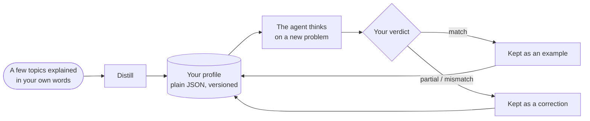

# Thinker profiles: reason like a given person

::: tip Can the SDK reason like me?
**Yes: it can imitate the way a given person reasons.** A cognitive agent can follow *your* order of attention, weigh *your* priorities, apply *your* reflexes and reject what *you* would reject. It learns this from a few problems you explain in your own words; each time you tell it where it went wrong, the correction is added to its instructions, and your agreement shows whether it gets closer.

It imitates a **way of reasoning**, not a person: it does not know what you have not written down, and it does not decide in your place. The SDK does not claim how close it gets for you: **you measure it**, run after run, as the percentage of agreement you give its answers.
:::

{.illustration}

## What "reasoning like you" means

| It imitates | It does not imitate |
| --- | --- |
| The **order** in which you look at a problem (first what it really enables, then its limits…) | Your **knowledge**: what you know but never wrote down, unless you give it as context or observations |
| Your **priorities** (what matters most to you, in order) | Your **memories** and your life: it only knows the samples, corrections and context you gave it |
| Your **reflexes** ("when a service is paid, I look for a free alternative first") | The intuitions you never put into words |
| What makes you **reject** an idea | Your **responsibility**: its answer is a prediction of what you would think, not a decision taken for you |
| Your **appetite for risk** | Your certainty about the world: claims still need evidence, like in any cognitive agent |
| The **mistakes you corrected**: it is told not to repeat them | |

## How it works, step by step



### Step 1: explain a few topics in your own words

A **sample** is one topic you reasoned about, written the way it came to you. Messy is fine. It has three parts:

| Field | What to write | Example |
| --- | --- | --- |
| `topic` | The subject, in a few words | "A robot that only tidies kitchens" |
| `reasoning` | How you approached it: what you looked at first, what you checked, what made you hesitate, why | "What does it really do? Only one room, so the limit is generalization. Could it learn another room from a few examples?…" |
| `conclusion` | What you concluded or would do (optional, but it becomes a calibration example) | "Build a small adaptive loop and test it on a second room" |

Five to ten samples on **varied** topics work better than many samples on one topic: the distiller looks for what repeats **across** topics, and a pattern seen once is weak.

### Step 2: distill your profile

```ts
const profile = await sdk.distillThinkerProfile({
  id: 'nicolas',
  name: 'Nicolas',
  model: 'gpt-4o',
  samples: [
    {
      topic: 'Typed decision APIs like Jev',
      reasoning:
        'What does it really allow? Then the limits: closed, US-only, paid. Is there an open clone? ' +
        'Could it become the controller of my agents? I would benchmark it on my own traces first.',
      conclusion: 'Use an open clone as the controller and benchmark it against Jev',
    },
    { topic: 'World models', reasoning: 'Structure beats scale. Test on a small chaotic system before anything big.' },
  ],
});
```

What happens, exactly:

1. The samples are checked: each one needs a topic and a reasoning.
2. One language-model call plays a *cognitive analyst*. It looks for the **recurring operations** of your reasoning, not your opinions: what you examine first, the questions you ask, how far you push an idea, what makes you reject a solution, your relation to risk, cost and novelty. It is told to keep only patterns the samples support, and to prefer those seen in several samples.
3. Its reply is validated against the profile schema. An invalid reply is sent back once with the error; a second failure throws a `ThoughtGenerationError` rather than returning a half-made profile.
4. Samples that have a conclusion are kept inside the profile as **examples**, so the profile carries both the extracted method and the evidence it came from.

The result is plain JSON. **Read it**: if a step or a priority is wrong or missing, fix it by hand. You know yourself better than one extraction does.

### Step 3: let the agent think as you

```ts
const twin = sdk.createCognitiveAgent({
  name: 'my-twin',
  model: 'gpt-4o',
  profile,
  systemPrompt: "Write every statement and the answer in French, in the thinker's own voice.", // optional
});

const run = await twin.think({
  problem: 'A bank offers you a stable, well-paid CTO job maintaining legacy systems. What do you decide?',
});
console.log(run.decision?.status, run.decision?.answer);
```

The profile is **copied when the run starts**, so a correction given during a run applies to the next one. It is written into the instructions of every reasoning step, and the final `decide` step is asked for *the answer the thinker would give*, with a rationale that follows the thinker's order of attention. [Where the profile weighs](#where-the-profile-weighs-and-where-it-never-does) lists each place.

### Step 4: tell it where it went wrong

After a run, give your **verdict**: did it reason the way you would have?

```ts
// "Yes, exactly what I would have thought."
await twin.learnFromFeedback(run.runId, { verdict: 'match' });

// "No, I would have gone another way."
await twin.learnFromFeedback(run.runId, {
  verdict: 'mismatch',
  expected: 'Prototype with the free clone first, then compare with Jev on 100 real tickets',
  lesson: 'Always test the free option on real data before paying',
});

// "You are 50% right, and here is where you went wrong."
await twin.learnFromFeedback(run.runId, {
  verdict: 'partial',
  agreement: 0.5,
  wrongAbout: ['ignored the free option', 'overestimated the integration cost'],
  expected: 'Benchmark the open clone on our own tickets before deciding',
});
```

| Field | Meaning | Required |
| --- | --- | --- |
| `verdict` | `match` (it reasoned like you), `partial` (partly), `mismatch` (not at all) | Always |
| `agreement` | How much of it you agree with, from 0 to 1: `0.8` means "80% right" | No |
| `expected` | What you would have concluded instead | On `partial` and `mismatch` |
| `wrongAbout` | Where the reasoning went wrong, in your words | No |
| `lesson` | The rule to remember next time (defaults to `expected`) | No |
| `notes` | Anything else, kept in the event | No |

What happens to it:

| Verdict | Effect on the profile |
| --- | --- |
| `match` | The run becomes a calibration **example**: its question, a summary of its reasoning steps and its conclusion. Each `match` keeps the 10 most recent examples, distilled samples included. |
| `partial` / `mismatch` | A **correction** is recorded: what the agent concluded, what you expected, your agreement, where it went wrong and the lesson. The 20 most recent are kept. Corrections close the profile in the instructions of each reasoning step, as the highest priority: "do not repeat these mistakes". The Jev controller sees the last five lessons. |

Every verdict bumps the profile's patch version (`1.0.0` → `1.0.1`) and is appended to the run as a `cognition.feedback` event, with the profile version before and after. A run without a decision cannot receive feedback: there is nothing to judge.

`learnFromFeedback` returns the refined profile and keeps it in the agent. **Save it** (`twin.getProfile()` is plain JSON), or the lessons are lost when your process stops.

### Step 5: measure how close it gets

The SDK records your verdicts; it does not grade itself. To know whether it really reasons like you, follow a simple protocol:

1. Prepare **new problems** the agent has never seen, on varied topics.
2. **Write your own answer first**, before reading the agent's, so its answer does not influence yours.
3. Run the agent, then score each answer: `agreement`, what it was `wrongAbout`, what you `expected`.
4. Give that feedback and save the refined profile.
5. Next round, use **other new problems** and compare the average agreement with the previous round.

If the average rises on problems it has never seen, that is a sign it is picking up your *way* of reasoning, not just the answers you corrected; over a handful of problems a rise can also be chance, so keep going for several rounds. If it only improves on the problems you corrected, it is copying answers.

```ts
const scores = [0.4, 0.6, 0.5]; // the agreement you gave this round
const average = scores.reduce((sum, value) => sum + value, 0) / scores.length; // 0.5, that is 50%
```

## Anatomy of a profile

You can also write a profile by hand:

```ts
import { defineThinkerProfile } from '@sdk-ai-agents/core';

const builder = defineThinkerProfile({
  id: 'builder',
  name: 'Pragmatic builder',
  summary: 'Looks for what a technology really enables, then its limits, then a prototype.',
  reasoningSequence: [
    { id: 'real-capability', instruction: 'Establish what the technology really enables' },
    { id: 'limits', instruction: 'Look for its limits immediately' },
    { id: 'workaround', instruction: 'Imagine how to work around those limits' },
    { id: 'product', instruction: 'Check whether it can become a product' },
    { id: 'automation', instruction: 'Ask how the product could run itself' },
    { id: 'generalize', instruction: 'Extrapolate towards a more general architecture' },
    { id: 'prototype', instruction: 'Design the smallest prototype that tests it' },
  ],
  priorities: ['Real capability over hype', 'Free and open options first', 'Fast feedback'],
  heuristics: [{ when: 'a service is paid and closed', action: 'look for an open alternative before paying' }],
  rejectionCriteria: ['Cannot be tested with a prototype', 'Locks data in a vendor'],
  riskAppetite: 'high',
});

const agent = sdk.createCognitiveAgent({ name: 'me', model: 'gpt-4o', profile: builder });
```

`defineThinkerProfile` validates the profile and fills in what is missing with defaults (empty lists, `riskAppetite: 'medium'`, `version: '1.0.0'`).

| Field | In plain words | How the engine uses it |
| --- | --- | --- |
| `id`, `name`, `version` | Who this profile describes, and which revision of it | Recorded in every run, so you know which version of the profile produced it |
| `summary` | One sentence describing the style | Written at the top of the profile in the prompts |
| `reasoningSequence` | The steps you go through, in order | Written as "Order of attention (follow it)"; the final answer follows it |
| `priorities` | What matters most, most important first | Written in the prompts; used to judge how well a choice suits you |
| `heuristics` | Your reflexes: "when …, then …" | Written as rules in the prompts |
| `rejectionCriteria` | What makes you drop an idea | Used to critique options and to reject those you would reject |
| `riskAppetite` | `low`, `medium` or `high` | Written in the prompts |
| `examples` | Runs and samples you validated | Shown as "validated examples of their reasoning": the model calibrates on them |
| `corrections` | Lessons from runs you disagreed with | Shown at the end of the profile, as the highest priority |

Without a profile, agents use `DEFAULT_THINKER_PROFILE`, a neutral, evidence-first analyst.

## Where the profile weighs, and where it never does

| Moment of the reasoning | Does your profile count? |
| --- | --- |
| **Each reasoning step** (represent, hypothesize, simulate, critique, compare, decide, reading a tool result) | Yes: the whole profile is in the instructions the language model receives. Only the short request that picks which tool to call leaves it out |
| **Choosing the next step** | With the Jev controller, yes: it sees your order of attention, priorities, rejection criteria, risk appetite and your last five lessons. Without Jev, the heuristic controller follows a fixed order, and your profile shapes the content of each step instead |
| **Critique** | Yes: options are attacked with your rejection criteria |
| **How well a choice suits you** (`preferenceFit`) | Yes: that is its purpose. A choice judged to meet one of your rejection criteria ranks lower, and is rejected when the judge is sure of it (Jev puts all its probability on that level) or, with a language-model judge, when the model rejects it |
| **How well the evidence supports an option** (`support`) | **No.** With Jev, this question is sent without your profile; with a language model, the model is told to ignore preferences |
| **Which choice of action is ranked first** | Yes, for choices of action, with a weight of 40% by default |
| **Whether a choice of action may be committed** | Yes, when you clearly prefer it and the facts do not speak against it |
| **Whether a claim about the world is credible** | **Never** in the code: the two scores are never mixed. With a language-model judge the separation rests on its instructions, and a claim the model mislabels as a choice could take the preference path (see [Declared kinds](./evidence-and-verification#not-there-yet)) |

### The two scores

When options are compared, each one gets up to two scores between 0 and 1:

| Score | Question | 0 | 0.25 | 0.5 | 0.75 | 1 |
| --- | --- | --- | --- | --- | --- | --- |
| `support` | How well do the facts, observations, tests and critiques support it? | Refuted | Weakly supported | Plausible | Strongly supported | Established |
| `preferenceFit` | How well does this choice suit the thinker? (choices of action only) | Meets a rejection criterion | Poor fit | Acceptable fit | Good fit | Ideal fit |

These are the levels the Jev assessor asks about; a language-model judge gives a number between 0 and 1 for each, read the same way. Both are judgements, not measured probabilities.

### How a choice is ranked and committed

Take the bank job problem above, with two options:

| Option | `support` | `preferenceFit` | Ranking score: 60% support + 40% fit |
| --- | --- | --- | --- |
| H1: accept the job | 0.5 (plausible) | 0.25 (poor fit: nothing new to build) | 0.6 × 0.5 + 0.4 × 0.25 = **0.40** |
| H2: decline and keep building | 0.5 (plausible) | 1 (ideal fit) | 0.6 × 0.5 + 0.4 × 1 = **0.70** |

The facts support both options equally; your preferences put H2 first. The weight is `limits.preferenceWeight` (0.4).

To be **committed** (a firm answer, rather than a provisional one or an abstention), an option must pass the [conclusion guard](./evidence-and-verification#the-conclusion-guard). Its evidence is enough in one of two ways:

- **by the evidence alone**, for any kind of hypothesis: `support` of at least `limits.decisionThreshold` (0.75, "strongly supported");
- **by your choice**, for a choice of action only: `preferenceFit` of at least `limits.decisionThreshold` (0.75, "good fit") **and** `support` of at least `limits.minProposalSupport` (0.35, a little above "weakly supported").

H2 takes the second way: support 0.5 ≥ 0.35, fit 1 ≥ 0.75. It is committed with a **confidence of 0.5**, because a decision's confidence never exceeds its evidence support: the answer says "this is the thinker's choice", not "this is proven".

Why the second way exists: a question like *"would you take this job?"* has little evidence to weigh. A person decides it with their priorities, provided the facts do not speak against the choice. In a real run with a thinker profile, such questions ended without a committed answer before this second way existed.

Why it is closed to claims: a statement such as *"this start-up's AI detects lies with 99% accuracy"* is a **rule** about the world. Even if you would love it to be true, it is committed only if its evidence support reaches 0.75, as long as the model labels it as a rule, which it is told to do (see [Declared kinds](./evidence-and-verification#not-there-yet)). Preferences can choose what to do; they never make something true.

## Limits

- **The model matters.** The profile is a set of instructions: a small model follows them less faithfully than a large one.
- **It knows only what you gave it.** Give the facts of your situation as `context` or `observations` when they matter.
- **A first profile is a sketch.** A handful of samples gives a handful of patterns; corrections are what refine it.
- **Its memory is bounded.** 20 corrections are kept, and each `match` keeps the 10 most recent examples (a distilled profile can start with more); the oldest are dropped.
- **Fidelity is not truth.** Your feedback measures whether the agent reasoned **like you**, not whether it was **right**. To check a claim against the world, give the agent an [outcome evaluator](./evidence-and-verification#predictions-and-the-outcome-evaluator).
- **It is personal data.** Samples, profiles and the events of these runs describe how a person thinks. Store them privately, never in a public repository, and ask for consent before profiling someone else.

## Profiles are data

Profiles are plain JSON: persist them wherever you like and reload them with `agent.setProfile(profile)` or the `profile` option. Events carry `profileId` and `profileVersion`, so you always know which version of the profile produced a run.

## Train your own controller

Every choice of operation is recorded with the state the controller saw. Export them as JSON Lines:

```ts
const jsonl = await sdk.exportControllerDataset(); // or pass runIds
```

```json
{"runId":"run_…","step":3,"state":{…},"available":["hypothesize","simulate","critique","decide"],"operation":"simulate","controller":"jev","confidence":0.82,"usedFallback":false,"runStatus":"completed","feedback":"partial","agreement":0.5}
```

Filter on `feedback: "match"` and you have supervised examples of *your* way of choosing the next move: enough to fine-tune a small open model and plug it in as a custom `CognitiveController`, with no per-call cost.
