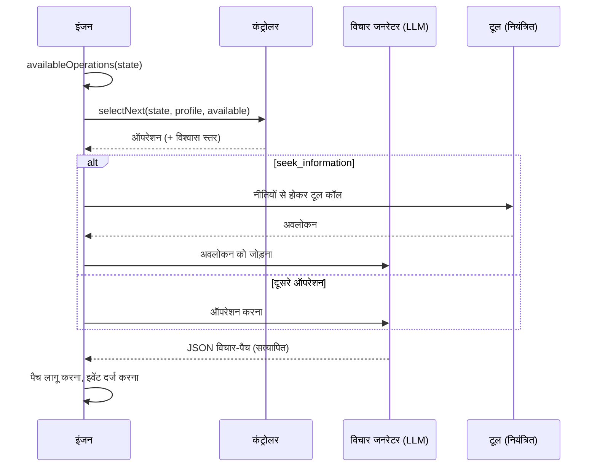

# संज्ञानात्मक एजेंट

एक संज्ञानात्मक एजेंट एक ही बार में जवाब नहीं देता। वह एक **स्पष्ट मानसिक स्थिति** रखता है और उसे एक-एक **संज्ञानात्मक ऑपरेशन** से बेहतर बनाता जाता है, जब तक कि वह ऐसे निर्णय पर पक्का न हो सके जिसे वह सही ठहरा सके।

::: tip आसान भाषा में
एक आम AI एक ही बार में जवाब देता है, और उसका तर्क गायब हो जाता है। एक संज्ञानात्मक एजेंट ऐसे व्यक्ति की तरह काम करता है जिसके पास एक नोटबुक हो: वह लिखता है कि वह क्या जानता है, क्या मानकर चल रहा है और क्या अभी नहीं जानता, कई विकल्पों की सूची बनाता है, उनके नतीजों की कल्पना करता है, देखता है कि क्या गलत हो सकता है, आपके दिए गए टूल से तथ्य जाँचता है, विकल्पों की तुलना करता है, और उसके बाद ही निर्णय लेता है। इनमें से हर कदम एक **ऑपरेशन** है, और हर ऑपरेशन नोटबुक में लिखा जाता है, ताकि बाद में आप पूरा तर्क दोबारा पढ़ सकें। अगर वह किसी ठोस निष्कर्ष पर नहीं पहुँच पाता, तो वह यह बता देता है। इस पेज का हर शब्द [मुख्य शब्द, आसान भाषा में](./glossary#how-a-cognitive-agent-reasons) में समझाया गया है।
:::

{.illustration style="max-width:460px"}

```ts
const agent = sdk.createCognitiveAgent({
  name: 'analyst',
  model: 'gpt-4o',
  tools: [lookupMetric],
  profile: myProfile, // optional, see Thinker profiles
});

const { status, answer, decision, state, runId } = await agent.think({
  problem: 'Should we build or buy our analytics module?',
  context: { budget: '10k EUR', deadline: 'before Q4' },
  observations: [{ content: 'Churn was 4% last month', originGroup: 'billing' }], // optional
});

decision?.status; // 'committed' | 'provisional' | 'abstain'
```

::: tip पहले साक्ष्य
अवलोकन कैसे ट्रेस होते हैं, पूर्वानुमान कैसे परखे जाते हैं और निष्कर्षों की रक्षा कैसे होती है, यह [साक्ष्य और सत्यापन](./evidence-and-verification) में बताया गया है।
:::

## मानसिक स्थिति {#the-mental-state}

मानसिक स्थिति सादा, टाइप्ड डेटा है। हर आइटम को एक स्थिर id मिलता है जिसका हवाला मॉडल दे सकता है।

| हिस्सा | Ids | इसमें क्या होता है |
| --- | --- | --- |
| `observations` | `O1…` | जो देखा गया — समस्या के साथ दिया गया, किसी टूल या परीक्षण द्वारा लौटाया गया — उसके उद्गम के साथ |
| `facts` | `F1…` | स्रोत (`input`, `tool`, `inference`) वाले कथन, वे अवलोकन जिनसे वे आते हैं, और एक स्थिति (`active`, `superseded`, `retracted`) |
| `assumptions` | `A1…` | तर्क जिसे बिना सबूत मानकर चलता है |
| `constraints` | `K1…` | जिसका हर उत्तर को पालन करना होगा |
| `unknowns` | `U1…` | खुले सवाल — `open`, `resolved` या `dropped`, प्रयासों की गिनती के साथ |
| `hypotheses` | `H1…` | प्रस्ताव, नियम या व्याख्याएँ, जिनके साथ आधार-वाक्य, सिमुलेशन, आलोचनाएँ, साक्ष्य का `support`, एक `preferenceFit` और एक स्थिति होती है |
| `comparisons` | `R1…` | अवलोकनों के बीच संबंध: समानता, अंतर, बदलाव, असंगति, प्रति-उदाहरण |
| `predictions` | `P1…` | कोई परिकल्पना क्या पूर्वानुमान करती है, क्या उसे खंडित करेगा, और परीक्षण का परिणाम |
| `contradictions` | `C1…` | आइटमों के बीच टकराव, एक श्रेणी के साथ, जब तक उद्धृत साक्ष्य से सुलझ न जाएँ |
| `failures` | `X1…` | जो पहले ही विफल हो चुका है, ताकि उसे आँख मूँदकर दोबारा न आज़माया जाए |
| `knowledge` | `M1…` | उसी दायरे के पहले के runs ने असली परीक्षणों से जो स्थापित किया, वह run शुरू होते समय याद किया जाता है (देखें [runs के बीच स्मृति](./memory)) |
| `confidence`, `evidenceRevision` | | सबसे अच्छे उत्तर का साक्ष्य-समर्थन; एक काउंटर जो पुराने आकलनों को पुराना पड़ चुका (stale) बना देता है |
| `decision`, `trail` | | अंतिम निर्णय और उसकी स्थिति, हर कदम की एक लाइन |

{.illustration style="max-width:760px"}

स्थिति को **कभी सीधे बदला नहीं जाता**। हर ऑपरेशन एक *विचार-पैच* (thought patch) बनाता है; वह पैच एक `cognition.thought` इवेंट के रूप में दर्ज होता है; स्थिति सभी पैचों को क्रम से लागू करने का नतीजा है। इसीलिए `sdk.getMentalState(runId)` किसी भी run को ठीक-ठीक दोबारा बना सकता है, महीनों बाद भी।

## ऑपरेशन {#the-operations}

| ऑपरेशन | यह क्या करता है | कब उपलब्ध है |
| --- | --- | --- |
| `represent` | तथ्य, धारणाएँ, बाध्यताएँ और अज्ञात बातें निकालता है | हमेशा सबसे पहले; और फिर तब, जब कोई विरोधाभास खुला हो |
| `compare_observations` | अवलोकनों को जोड़ता है: समानताएँ, अंतर, बदलाव, प्रति-उदाहरण | दो या ज़्यादा तुलना-योग्य अवलोकन (डुप्लिकेट और परीक्षण परिणामों को छोड़कर), और पिछली तुलना के बाद नए अवलोकन |
| `hypothesize` | नए प्रस्ताव, नियम या व्याख्याएँ सुझाता है | सक्रिय परिकल्पनाएँ `maxHypotheses` से कम हों |
| `simulate` | नतीजों का कदम-दर-कदम अनुमान लगाता है और परखने योग्य पूर्वानुमान बताता है | किसी परिकल्पना का सिमुलेशन न हुआ हो |
| `test_prediction` | दर्ज किए गए पूर्वानुमान पर आपका परिणाम मूल्यांकनकर्ता चलाता है — कोई LLM कॉल नहीं | कोई मूल्यांकनकर्ता कॉन्फ़िगर हो, कोई पूर्वानुमान बाकी हो, परीक्षण का बजट बचा हो |
| `revise` | साक्ष्य से खंडित हुई परिकल्पना को सीमित दायरे वाले वेरिएंट में बदलता है | किसी खंडित या विरोधाभास वाली परिकल्पना का अभी तक कोई वेरिएंट न हो |
| `critique` | वे सबसे मज़बूत कारण ढूँढता है जिनसे कोई परिकल्पना विफल हो सकती है | किसी परिकल्पना की आलोचना न हुई हो |
| `seek_information` | किसी खुली अज्ञात बात का जवाब पाने के लिए एक नियंत्रित टूल कॉल करता है | टूल मौजूद हों, कोई अज्ञात बात खुली हो, टूल का बजट बचा हो |
| `compare` | साक्ष्य-समर्थन को आँकता है, और यह कि प्रस्ताव विचारक के कितने अनुकूल हैं | पिछली तुलना के बाद आलोचना-प्राप्त कोई परिकल्पना बदली हो, या साक्ष्य बदले हों |
| `decide` | एक उत्तर, कारण, विश्वास स्तर और अगली कार्रवाइयों पर पक्का होता है | कोई परिकल्पना [निष्कर्ष गार्ड](./evidence-and-verification#the-conclusion-guard) को पार कर ले |

**क्या संभव है यह कोड तय करता है, क्या उपयोगी है यह कंट्रोलर तय करता है।** पूर्व-शर्तें स्थिति से निकाली जाती हैं, और कंट्रोलर सिर्फ़ उपलब्ध ऑपरेशनों में से ही चुन सकता है।

कोड में लागू नियम, मॉडल चाहे जो कहे:

- बिना जवाब की `fatal` आलोचना, या खंडित पूर्वानुमान, अपनी परिकल्पना को अस्वीकार कर देता है;
- अस्वीकृत परिकल्पना को दोबारा ज़िंदा, दोहराया या चुना नहीं जा सकता — उसे सिर्फ़ ऐसे वेरिएंट में संशोधित किया जा सकता है जो बताए कि क्या बदला;
- कोड किसी दावे के साक्ष्य-समर्थन में पसंद को कभी नहीं मिलाता, और मॉडल स्थिति का विश्वास स्तर तय नहीं कर सकता;
- कोई विरोधाभास एक ही बार सुलझाया जाता है, और सिर्फ़ उन अवलोकनों या तथ्यों का हवाला देकर जो उसे सुलझाते हैं;
- ऐसा कदम जिसने वह कुछ नहीं बदला जो उसे बदलना था, या टाला गया निर्णय, एक विफल प्रयास गिना जाता है; लगातार दो के बाद वह ऑपरेशन तब तक पेश नहीं किया जाता जब तक कोई दूसरा कदम नए साक्ष्य न लाए (देखें [ऐसा बजट जो बर्बाद न हो](./evidence-and-verification#a-budget-that-is-not-wasted));
- उद्गम (अवलोकन, परीक्षण परिणाम) और निर्णय की स्थिति इंजन लिखता है: जिस मॉडल जवाब में ये हों, उनसे ये हटा दिए जाते हैं;
- अज्ञात ids के हवालों को अनदेखा किया जाता है और विचार-इवेंट पर `issues` के रूप में रिपोर्ट किया जाता है;
- एक समय में ज़्यादा से ज़्यादा `maxHypotheses` परिकल्पनाएँ चर्चा में रहती हैं: अतिरिक्त प्रस्ताव हटा दिए जाते हैं और रिपोर्ट किए जाते हैं;
- किसी अज्ञात बात की जाँच दो असफल प्रयासों के बाद बंद हो जाती है, या तुरंत, जब कोई उपलब्ध टूल उसका जवाब न दे सके, और समस्या को नए सिरे से देखना (किसी विरोधाभास पर `represent`) ज़्यादा से ज़्यादा तीन बार पेश किया जाता है;
- विफल ऑपरेशन विफल के रूप में दर्ज होता है और पूरा हुआ नहीं गिना जाता;
- **आखिरी कदम हमेशा निर्णय का प्रयास होता है**: जो उत्तर निष्कर्ष गार्ड को पार नहीं करता, वह `provisional` (साथ में यह कि क्या कमी है) या `abstain` बन जाता है; अगर मॉडल कोई निर्णय बना ही नहीं पाता, तो इंजन परहेज़ करता है और कारण दर्ज करता है।

## कंट्रोलर {#controllers}

कंट्रोलर अगला ऑपरेशन चुनता है।



| कंट्रोलर | यह कैसे चुनता है | इसे कब इस्तेमाल करें |
| --- | --- | --- |
| `heuristic` | ध्यान का एक तय क्रम: समस्या को दर्शाना → संशोधन → अवलोकनों की तुलना → परिकल्पना बनाना → सिमुलेशन → पूर्वानुमानों का परीक्षण → आलोचना → जानकारी खोजना → तुलना → निर्णय | Jev के बिना डिफ़ॉल्ट, नियतात्मक, मुफ़्त |
| `typed` | हर कदम पर Jev को एक अनुरोध: उपलब्ध ऑपरेशनों पर एक Choice और "निर्णय के लिए तैयार?" वाला एक Noul | कैलिब्रेटेड विश्वास स्तर के साथ परिस्थिति के अनुसार ढलने वाला तर्क |
| आपका अपना | `CognitiveController.selectNext()` लागू करें | फ़ाइन-ट्यून किया हुआ लोकल मॉडल, व्यावसायिक नियम, … |

`controller: 'auto'` (डिफ़ॉल्ट) के साथ, अगर SDK के पास टाइप्ड-निर्णय backend है तो एजेंट Jev इस्तेमाल करता है, वरना ह्यूरिस्टिक। टाइप्ड कंट्रोलर **ह्यूरिस्टिक पर लौट आता है** जब Choice का विश्वास स्तर `minConfidence` (0.35) से कम हो, जब क्लाइंट विफल हो, या जब उत्तर कोई उपलब्ध ऑपरेशन न हो। जो कस्टम कंट्रोलर error फेंके या कोई अनुपलब्ध ऑपरेशन लौटाए, उसकी जगह भी ह्यूरिस्टिक ले लेता है। हर बार लौटने की बात चयन-इवेंट के `fallbackFrom` फ़ील्ड में दर्ज होती है।

```ts
sdk.createCognitiveAgent({
  name: 'analyst',
  model: 'gpt-4o',
  controller: 'typed',
  controllerOptions: { minConfidence: 0.5, readinessThreshold: 0.85 },
  assessment: 'typed', // compare hypotheses with Jev Score questions
});
```

## तर्क के अंदर टूल {#tools-inside-reasoning}

`seek_information` **मूल तर्क और एक्शन इंजनों** का इस्तेमाल करता है: LLM खुली अज्ञात बात के लिए एक टूल चुनता है, एक्शन इंजन जाँचता है कि वह टूल **इसी एजेंट को दिया गया था**, कॉल को नीतियों (run की सीमाओं समेत, देखें [सीमाएँ और नीतियाँ](#limits-and-policies)), मंज़ूरियों और बजट के सामने सत्यापित करता है, और परिणाम एक **अवलोकन** के रूप में दर्ज होता है जो अपने `action.executed` इवेंट की ओर इशारा करता है, फिर `source: "tool"` वाले तथ्यों के रूप में जोड़ा जाता है। अवलोकन तब भी रखा जाता है जब उसकी व्याख्या विफल हो जाए। मना किया गया, रोका गया या विफल होने वाला टूल एक दर्ज की गई विफलता बन जाता है, और तर्क जारी रहता है।

## सीमाएँ {#limits}

```ts
sdk.createCognitiveAgent({
  name: 'analyst',
  model: 'gpt-4o',
  limits: {
    maxSteps: 12,              // the last one always decides
    timeoutMs: 180_000,
    maxHypotheses: 3,          // in play at the same time
    maxToolCalls: 5,
    decisionThreshold: 0.75,   // evidence support a committed answer needs (see minProposalSupport)
    maxConsecutiveFailures: 3, // then the run fails (and alerts you, if incidents are on)
    maxPredictionTests: 4,     // calls to the outcome evaluator per run
    preferenceWeight: 0.4,     // weight of the thinker's preferences when ranking proposals
    minProposalSupport: 0.35,  // evidence support enough for a choice of action the thinker clearly prefers
  },
  evaluator: myBench,          // optional OutcomeEvaluator, enables test_prediction
  knowledge: { store, scope: 'my-domain' }, // optional memory across runs
});
```

एजेंट बनाते समय सीमाओं का सत्यापन होता है: `maxSteps: 0` या ऐसा timeout जो timer के संभालने से ज़्यादा हो, चुपचाप किसी सुरक्षा उपाय को बंद करने की बजाय `ValidationError` फेंकता है। `minProposalSupport` का मान `decisionThreshold` से ज़्यादा नहीं हो सकता; इसे `decisionThreshold` के बराबर रखें ताकि सिर्फ़ साक्ष्य ही किसी उत्तर को पक्का कर सकें। अगर आप `minProposalSupport` तय किए बिना `decisionThreshold` घटाते हैं, तो निचली सीमा भी उसके साथ नीचे आ जाती है।

### सीमाएँ और नीतियाँ {#limits-and-policies}

एजेंट पर लागू होने वाली बजट और timeout नीतियाँ — उसकी `policies` वाली और वैश्विक नीतियाँ — **हर कदम से पहले**, उस कदम की किसी भी मॉडल कॉल से पहले, जाँची जाती हैं, और हर टूल कॉल से पहले फिर से जाँची जाती हैं। वे run की प्रगति देखती हैं: `maxSteps` पूरे हो चुके कदम गिनता है, `maxTokens` run की मॉडल कॉल (विचार और उनके सुधार, टूल का चुनाव, टाइप्ड निर्णय, ऐसे जवाब जिन्हें प्रदाता इस्तेमाल नहीं कर सका) के टोकन, और `maxDuration` run शुरू होने के बाद बीता समय। अवधि के हिसाब से टोकन और लागत बजट (`maxTokens` या `maxCost` के साथ, `toolName` के बिना `budgetLimit`) भी हर कदम से पहले जाँचे जाते हैं, और run जो भी मॉडल कॉल दर्ज करता है, वह उनमें गिनी जाती है (देखें [API लागत](./costs#budgets))। किसी कदम को `continue` प्रकार के इरादे की तरह जाँचा जाता है: जिस नीति की शर्तें टूल कॉल माँगती हैं (`intention.type` बराबर `tool_call`), वह सिर्फ़ टूल कॉल पर लागू होती है। अनुमति-सूचियाँ, अपनी (custom) नीतियाँ, कॉल-बजट (`maxToolCalls`) और मंज़ूरियाँ सिर्फ़ टूल कॉल से जुड़ी हैं, और वह सीमा-नियम भी जिसकी action `require_approval` है: कोई कदम कभी मंज़ूरी का इंतज़ार नहीं करता। हर कदम की जाँच नीतियों के ऑडिट (`sdk.getPolicyAuditTrail`) में दर्ज होती है, उन नीतियों के लिए जो किसी कदम पर लागू हो सकती हैं।

जो सीमा पहले पहुँचती है वही run खत्म करती है (टूल कॉल की सीमाएँ सिर्फ़ कॉल छोड़ देती हैं), और दोनों तरह की सीमाएँ उसे एक ही तरह खत्म नहीं करतीं:

| सीमा | एजेंट की `limits` | नीतियाँ |
| --- | --- | --- |
| कदम | `maxSteps`: आख़िरी कदम निर्णय लेता है; `completed`, `committed`, `provisional` या `abstain` निर्णय के साथ | `maxSteps`: अगला कदम ठुकरा दिया जाता है; `failed` |
| समय | `timeoutMs`: run रोक दिया जाता है, चल रही कॉल को abort signal मिलता है; `failed`, `Timeout exceeded (… ms)` | `maxDuration`: कदमों के बीच और टूल कॉल से पहले जाँची जाती है, चल रही कॉल चलती रहती है; `failed`, `Timeout (… ms) exceeded` |
| टोकन, लागत | — | `maxTokens`, अवधि वाले बजट: अगला कदम ठुकरा दिया जाता है; `failed` |
| टूल कॉल | `maxToolCalls`: `seek_information` अब पेश नहीं किया जाता | ठुकराई गई कॉल एक दर्ज की गई विफलता है, और तर्क जारी रहता है |

ठुकराया गया कदम `policy.violated` के रूप में दर्ज होता है — `intention: { type: 'continue' }`, कदम (`step`), कारण (`reason`) और उल्लंघित नीतियों (`violatedPolicies`) के साथ — फिर नीति के कारण के साथ `run.failed`; परिणाम में `status: 'failed'` और `error` के रूप में `PolicyViolationError` होता है। run की किसी सीमा द्वारा ठुकराई गई टूल कॉल `policy.violated` और एक विफल ऑपरेशन के रूप में दर्ज होती है; क्योंकि सीमा अब भी पार है, अगला कदम ठुकरा दिया जाता है और run विफल हो जाता है। ठुकराए जाने की बजाय निर्णय पर खत्म करने के लिए एजेंट का `maxSteps` नीति के `maxSteps` से ज़्यादा न रखें: तब नीति कुछ भी ठुकराए, उससे पहले ही उसका आख़िरी कदम निर्णय ले लेता है।

## मॉडल का अमान्य आउटपुट {#invalid-model-output}

हर ऑपरेशन का एक सख़्त JSON अनुबंध होता है जिसे Zod सत्यापित करता है। जो जवाब मान्य JSON नहीं है, जिसमें ज़रूरी फ़ील्ड नहीं है या जो गलत मान इस्तेमाल करता है, उसे सत्यापन error के साथ **एक बार** वापस भेजा जाता है। जिन फ़ील्ड को कोई ऑपरेशन नहीं लिख सकता (जैसे `simulate` के दौरान `decision`), उन्हें अनदेखा किया जाता है और `ignoredFields` में सूचीबद्ध किया जाता है। अगर सुधार भी विफल हो जाए, तो ऑपरेशन विफलता के रूप में दर्ज होता है और चक्र जारी रहता है।

## रोकना, रद्द करना, समय-सीमा खत्म होना {#stop-cancel-time-out}

```ts
const pending = agent.think({ problem });
await agent.stop();          // or agent.stop(runId)
const result = await pending; // status: 'cancelled'
```

timeout होने पर `status: 'failed'` के साथ `Timeout exceeded (… ms)` मिलता है, और इवेंट लॉग में run को विफल चिह्नित किया जाता है। `sdk.stopRun(runId)` संज्ञानात्मक runs को भी रोकता है। timeout और रोक की जाँच ऑपरेशनों के बीच होती है और यह आपके प्रदाता को abort signal के रूप में दी जाती है; बिल्ट-इन OpenAI और Anthropic प्रदाता पहले से चल रहे अनुरोध को रद्द नहीं करते, इसलिए कोई धीमी कॉल विक्रेता के अपने timeout पर ही खत्म होती है।

प्रोफ़ाइल का **run शुरू होते समय स्नैपशॉट लिया जाता है**: किसी run के चलते समय दिया गया फ़ीडबैक अगले run पर लागू होता है।

## सुरक्षा {#security}

एक संज्ञानात्मक एजेंट ऐसा टेक्स्ट पढ़ता है जो उसने नहीं लिखा: टूल के परिणाम, MCP टूल के विवरण, संदर्भ में दिए दस्तावेज़। इन सबको **अविश्वसनीय इनपुट** मानें — इनमें मॉडल को निशाना बनाने वाले निर्देश हो सकते हैं (prompt injection)। SDK सीमित करता है कि ऐसा टेक्स्ट क्या हासिल कर सकता है:

- एजेंट सिर्फ़ वही टूल कॉल कर सकता है जो उसे दिए गए हों, और हर कॉल पर नीतियाँ जाँची जाती हैं — विनाशकारी टूल को `require_approval` नीतियों के पीछे रखें;
- मॉडल खुद कभी कुछ नहीं चलाता: वह प्रस्ताव रखता है, एक्शन इंजन सत्यापित करता है;
- मानसिक स्थिति के अपरिवर्तनीय नियम कोड में लागू होते हैं, prompt से नहीं;
- हर टूल कॉल और हर विचार समीक्षा के लिए इवेंट लॉग में होता है।

इवेंट लॉग लक्ष्य, संदर्भ और हर विचार सहेजता है, और `decision.evaluated` इवेंट Jev को भेजा गया संदर्भ सहेजते हैं। आप जो इवेंट स्टोर चुनें, उस पर वे डेटा-संरक्षण (retention) और गोपनीय हिस्से हटाने (redaction) के नियम लागू करें जो आपके डेटा के लिए ज़रूरी हैं।

## रीप्ले और ऑडिट {#replay-and-audit}

एक संज्ञानात्मक run एक सामान्य run ही है:

- `sdk.getTrace(runId)` `cognition.*` इवेंट्स को `policy.checked`, `tool.called`, … के साथ दिखाता है
- `sdk.replay(runId)` LLM को बुलाए बिना इसकी टूल कॉल दोबारा चलाता है और अंतिम उत्तर फिर से बनाता है — मूल run वाली टूल-पाबंदी के साथ, इसलिए जो टूल एजेंट के लिए मना था वह फिर से मना होता है, और हर कॉल पर run की उस समय की प्रगति के साथ, इसलिए जिस कॉल को run की किसी सीमा ने ठुकराया था वह फिर से ठुकराई जाती है;
- `sdk.getMentalState(runId)` स्थिति दोबारा बनाता है;
- `sdk.exportControllerDataset()` runs को ट्रेनिंग डेटा में बदलता है (देखें [विचारक प्रोफ़ाइल](./thinker-profiles#train-your-own-controller))।
