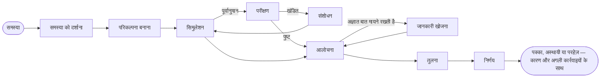

# परिचय

**SDK AI Agents** एक TypeScript SDK है, जिससे आप ऐसे AI एजेंट बना सकते हैं जिन पर production में भरोसा किया जा सके: ऐसे एजेंट जो कार्रवाई से पहले स्पष्ट रूप से तर्क करते हैं, जिन्हें सिखाया जा सकता है कि *आप* कैसे सोचते हैं, और जिनका हर कदम नियंत्रित, ट्रेस किया हुआ, लागत के हिसाब वाला और रीप्ले करने योग्य होता है।

{.illustration style="max-width:460px"}

## एक और एजेंट SDK क्यों? {#why-another-agent-sdk}

LLM API आपको एक बहुत सक्षम टेक्स्ट जनरेटर देते हैं। लेकिन वे आपको इस पर नियंत्रण नहीं देते कि कोई निष्कर्ष **कैसे** निकाला जाता है:

- तर्क मॉडल के अंदर, एक ही बार में होता है, और उत्तर छपते ही गायब हो जाता है;
- कोई चीज़ मॉडल को अंदाज़े पर काम करने, गलत टूल बुलाने या ज़्यादा खर्च करने से नहीं रोकती;
- जब कुछ गलत होता है, तो आपके पास एक prompt और एक उत्तर होता है — पूरी कहानी नहीं।

यह SDK मॉडल के **चारों ओर** तर्क की एक परत लगाता है। LLM कई घटकों में से सिर्फ़ एक घटक बन जाता है:

| परत | यह क्या करती है | यह कहाँ रहती है |
| --- | --- | --- |
| **मानसिक स्थिति** | तथ्य, धारणाएँ, बाध्यताएँ, अज्ञात बातें, परिकल्पनाएँ, विरोधाभास, विश्वास स्तर | किसी भी समय इवेंट्स से दोबारा बनाई जाती है |
| **कंट्रोलर** | अगला संज्ञानात्मक ऑपरेशन चुनता है | नियतात्मक (deterministic) ह्यूरिस्टिक, Jev के टाइप्ड निर्णय या आपका अपना |
| **विचार जनरेटर** | एक ऑपरेशन करता है और एक सत्यापित JSON पैच लौटाता है | कोई भी LLM प्रदाता |
| **विचारक प्रोफ़ाइल** | किसी व्यक्ति के ध्यान का क्रम, प्राथमिकताएँ और ह्यूरिस्टिक | वर्ज़न वाला डेटा, फ़ीडबैक से निखरता है |
| **नियंत्रण (governance)** | नीतियाँ, अनुमति-सूचियाँ, बजट, मंज़ूरियाँ, दोबारा प्रयास | हर कार्रवाई से पहले जाँचे जाते हैं |
| **इवेंट स्टोर** | सच का एकमात्र स्रोत | फ़ाइल, SQLite या PostgreSQL |

## दो तरह के एजेंट {#two-kinds-of-agents}

**नियंत्रित एजेंट** (`sdk.createAgent`) पारंपरिक टूल-कॉलिंग चक्र चलाते हैं — LLM एक इरादा प्रस्तावित करता है, और एक्शन इंजन उसे सत्यापित करके लागू करता है। ये साफ़-साफ़ परिभाषित कामों के लिए आदर्श हैं।

**संज्ञानात्मक एजेंट** (`sdk.createCognitiveAgent`) स्पष्ट रूप से तर्क करते हैं। ये निर्णयों के लिए बने हैं: आर्किटेक्चर चुनना, किसी घटना (incident) की प्राथमिकता तय करना, किसी अवसर का आकलन करना, "क्या हमें… करना चाहिए?" जैसे सवालों के जवाब देना।

दोनों तरह के एजेंट एक जैसे टूल, नीतियाँ, इवेंट स्टोर, रीप्ले, लागत और घटना अलर्ट साझा करते हैं।

## क्या यह किसी खास व्यक्ति की तरह तर्क कर सकता है? {#can-it-reason-like-a-given-person}

**हाँ।** एक संज्ञानात्मक एजेंट किसी खास व्यक्ति के तर्क करने के तरीके की नकल कर सकता है। आप कुछ विषयों को अपने शब्दों में समझाते हैं; SDK उनसे एक **विचारक प्रोफ़ाइल** निकालता है: वह क्रम जिसमें आप किसी समस्या को देखते हैं, आपकी प्राथमिकताएँ, आपकी सहज प्रतिक्रियाएँ, किस वजह से आप कोई विचार ठुकराते हैं, और जोखिम लेने की आपकी रुचि। यह प्रोफ़ाइल उसके तर्क के हर कदम के निर्देशों में लिखी जाती है। हर run के बाद आप बताते हैं कि आप कितने सहमत हैं (जैसे "60% सही, यहाँ तुमसे गलती हुई"), और यह सबक अगले runs के लिए रखा जाता है।

यह जिस चीज़ की नकल करता है, वह है **तर्क करने का तरीका**: यह वह नहीं जानता जो आपने कभी लिखा ही नहीं, यह आपकी जगह निर्णय नहीं लेता, और आपकी पसंद दुनिया के बारे में किसी दावे को कभी ज़्यादा विश्वसनीय नहीं बनाती। SDK खुद को अंक नहीं देता: run दर run, ऐसी समस्याओं पर जिन्हें उसने पहले कभी नहीं देखा, आप जो सहमति का प्रतिशत देते हैं, वही बताता है कि नकल कितनी करीब पहुँची। [किसी खास व्यक्ति की तरह तर्क करें](./thinker-profiles) हर कदम समझाता है।

## आपको क्या मिलता है {#what-you-get}

- **स्पष्ट तर्क** — एक मानसिक स्थिति पर दस ऑपरेशन, और ऐसे अपरिवर्तनीय नियम (invariants) जिन्हें कोड लागू करता है (अस्वीकृत परिकल्पना चुनी नहीं जा सकती, घातक आलोचना परिकल्पना को अस्वीकार कर देती है, आखिरी कदम हमेशा निष्कर्ष निकालता है)।
- **ऐसे साक्ष्य जिनका आप ऑडिट कर सकें** — उद्गम के साथ अवलोकन, आपके अपने मूल्यांकनकर्ता द्वारा परखे गए पूर्वानुमान, खंडित नियम सीमित दायरे वाले वेरिएंट में संशोधित, पसंद को साक्ष्य से अलग रखा जाता है, और एक निष्कर्ष गार्ड जो `committed`, `provisional` या `abstain` उत्तर देता है; ज्ञान भंडार के साथ, परीक्षणों ने जो उत्तर दिया वह अगले runs के लिए याद रखा जाता है।
- **किसी खास व्यक्ति की तरह तर्क**: अपने शब्दों में समझाए गए विषयों से एक विचारक प्रोफ़ाइल का सार निकालें, फिर `match`, `partial` या `mismatch` फ़ैसलों और सहमति के प्रतिशत से एजेंट को सुधारें।
- **टाइप्ड निर्णय** — [TypeSafe Jev](https://docs.typesafe.ai) या कोई भी संगत backend, Noul, Choice और Score सवालों के जवाब कैलिब्रेटेड संभावनाओं के साथ देता है।
- **MCP कनेक्टर** — अपने टूल को MCP सर्वर के रूप में उपलब्ध कराएँ, किसी भी MCP सर्वर को नियंत्रित टूल के रूप में इम्पोर्ट करें।
- **संचालन पहले से शामिल** — हर run की API लागत, ऐसी retry नीतियाँ जो एक-दूसरे पर नहीं चढ़तीं, ईमेल या वेबहुक से घटना अलर्ट।
- **मूल रूप से इवेंट सोर्सिंग** — LLM के बिना रीप्ले, गोल्डन ट्रेस, रिग्रेशन का पता लगाना, तर्क के ग्राफ़।

दूसरे फ़्रेमवर्क से इसकी तुलना कैसी है? देखें [यह SDK क्यों](./why)। ये शब्द आपके लिए नए हैं? [मुख्य शब्द, आसान भाषा में](./glossary) हर शब्द समझाता है। तैयार हैं? [शुरुआत करें](./getting-started) पर जाएँ।
